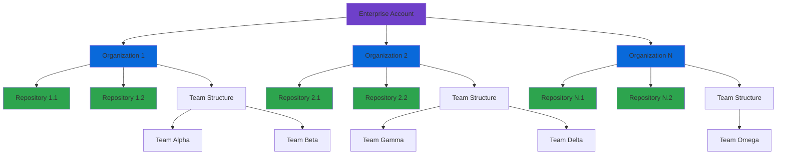
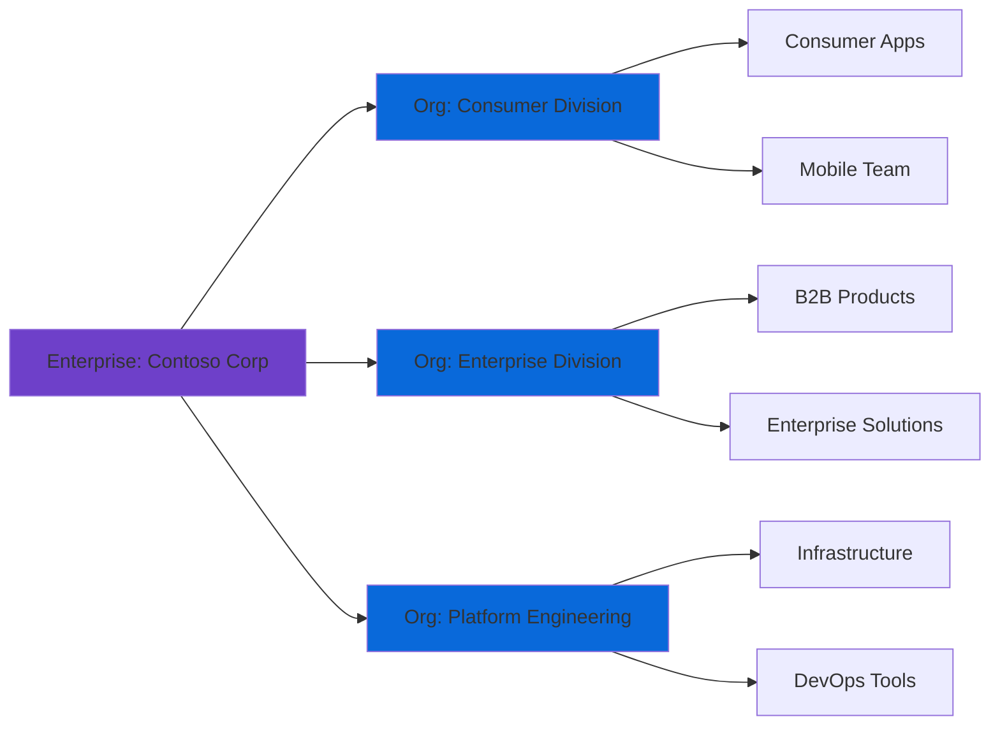
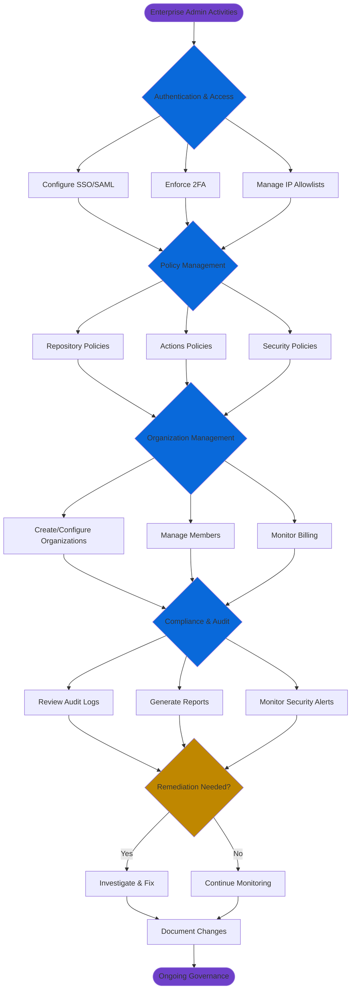

# GitHub Enterprise Cloud Hierarchy

## Overview

GitHub Enterprise Cloud (GHEC) provides a multi-tiered organizational structure that enables large organizations to manage multiple teams, projects, and repositories under a unified enterprise account. This hierarchical model facilitates centralized governance, billing, and policy enforcement while maintaining organizational autonomy and flexibility.

The enterprise account serves as the top-level container, providing enterprise administrators with visibility and control across all member organizations, enabling strategic oversight of development activities, security posture, and resource allocation.

## Enterprise Account Capabilities

An enterprise account on GitHub Enterprise Cloud delivers advanced administrative, security, and compliance capabilities designed for large-scale operations:

### Core Enterprise Features

**Centralized Management**
- Unified dashboard providing real-time visibility across all organizations
- Consolidated user management with enterprise-level identity provisioning
- Single sign-on (SSO) enforcement via SAML 2.0 or OIDC
- Centralized billing with cost allocation and usage analytics

**Security and Compliance**
- Enterprise-wide security policies and enforcement
- Advanced audit logging with 180-day retention for audit events (Git events: 7 days); extendable via log streaming
- IP allow lists at the enterprise level
- SSH certificate authority for cryptographic authentication
- SCIM provisioning for automated user lifecycle management

**Policy Enforcement**
- Repository policy management across organizations
- Branch protection rules inheritance
- Required workflows for GitHub Actions
- Custom repository roles and permissions
- Dependency management and security advisories

**Advanced Features**
- GitHub Advanced Security (GHAS) licensing and deployment
- Enterprise Managed Users (EMU) for complete identity control
- GitHub Connect for hybrid cloud/server environments
- Premium support with configurable SLA tiers

## Hierarchy Levels

The GitHub Enterprise Cloud architecture implements a three-tier hierarchy that balances centralized governance with distributed autonomy:

### Enterprise Level

The enterprise account represents the apex of the hierarchy and serves as the administrative and billing boundary. Key characteristics include:

- **Scope:** Contains multiple organizations with unified governance
- **Ownership:** Managed by Enterprise Owners with super-admin privileges
- **Billing:** Consolidated invoicing across all organizations and users
- **Policies:** Top-level policy inheritance and enforcement
- **Visibility:** Aggregate insights and reporting across the enterprise
- **Identity:** Enterprise-level SSO configuration and authentication requirements

### Organization Level

Organizations function as logical groupings for teams, projects, and repositories. They provide:

- **Autonomy:** Independent settings within enterprise policy constraints
- **Team Management:** Hierarchical team structures with nested teams
- **Access Control:** Organization-level roles and team-based permissions
- **Project Governance:** Organization-specific policies and workflows
- **Resource Ownership:** Repositories, projects, packages, and Actions workflows
- **Collaboration:** Shared context for related projects and teams

Organizations inherit mandatory policies from the enterprise but can implement additional restrictions. This allows business units, divisions, or product lines to operate semi-independently while adhering to corporate standards.

### Repository Level

Repositories are the fundamental units of source code management and collaboration:

- **Code Storage:** Git-based version control with full history
- **Access Management:** Granular permissions (Read, Triage, Write, Maintain, Admin)
- **Collaboration:** Issues, pull requests, discussions, and wikis
- **Automation:** GitHub Actions workflows, webhooks, and GitHub Apps
- **Security:** Dependabot, code scanning, secret scanning, and security advisories
- **Deployment:** Environments, deployment branches, and protection rules

Repositories inherit policies from both the organization and enterprise levels, creating a defense-in-depth security model.

## Enterprise Roles

GitHub Enterprise Cloud implements a role-based access control (RBAC) model with specialized enterprise-level roles:

### Enterprise Owner

The Enterprise Owner role carries the highest level of administrative privileges across the entire enterprise account.

**Capabilities:**
- Full administrative access to all enterprise settings and configurations
- Create, configure, and delete organizations within the enterprise
- Invite and remove enterprise members and administrators
- Configure enterprise-wide authentication and SSO requirements
- Manage enterprise billing settings and payment methods
- Set and enforce organization policies across the enterprise
- Access enterprise audit logs and security reports
- Configure IP allow lists and security policies
- Manage GitHub Advanced Security licensing and deployment
- Set up required workflows and organization standards

**Use Cases:**
- C-level executives with ultimate accountability
- Senior IT leadership responsible for platform governance
- Security architects defining enterprise-wide security posture
- Compliance officers requiring audit and oversight capabilities

**Best Practices:**
- Limit to 3-5 individuals maximum for security and accountability
- Require hardware security keys (U2F/WebAuthn) for authentication
- Implement just-in-time access patterns where possible
- Regular access reviews (quarterly minimum)
- Document all Enterprise Owner actions in an external system

### Billing Manager

Billing Managers have specialized access limited to financial and subscription management:

**Capabilities:**
- View and manage enterprise billing settings
- Update payment methods and billing contacts
- Access billing history and invoices
- View license usage and consumption reports
- Download usage data for cost allocation
- Manage spending limits for GitHub Actions and Packages

**Restrictions:**
- No access to enterprise security or administrative settings
- Cannot modify organizations, repositories, or user access
- Cannot view or modify enterprise policies
- Cannot access audit logs (unless separately granted)

**Use Cases:**
- Finance team members managing software expenditures
- Procurement specialists tracking license consumption
- Budget managers requiring cost visibility
- Accounting personnel processing invoices

### App Manager

App Managers have specialized permissions to manage GitHub App registrations owned by the enterprise:

**Capabilities:**
- View, create, edit, and delete GitHub App registrations owned by the enterprise
- Manage app settings and configurations

**Restrictions:**
- Cannot install and uninstall GitHub Apps on an enterprise or organization
- Cannot access other enterprise administrative settings

**Use Cases:**
- Platform engineers managing enterprise-wide integrations
- DevOps teams maintaining CI/CD GitHub Apps
- Security teams managing security-related app registrations

### Security Manager

Security Managers have permissions to effectively manage security features and alerts for the enterprise:

**Capabilities:**
- View, manage, and assign security configurations at enterprise and organization level
- Manage use of GitHub Secret Protection and GitHub Code Security
- View security alerts and dashboards for all repositories in organizations
- Manage security campaigns for organizations
- Manage repository settings for security features
- Read access for code in all repositories
- Write access for all security alerts in the enterprise

**Use Cases:**
- Security engineers managing enterprise-wide security posture
- Compliance officers monitoring security alerts
- Security operations teams responding to vulnerabilities

> **Note:** The enterprise security manager role is currently in public preview and subject to change.

### Enterprise Member

Enterprise Members are users who belong to at least one organization within the enterprise.

**Default Capabilities:**
- Single sign-on authentication via enterprise SSO
- Visibility determined by organization membership
- Access to repositories based on organization/team permissions
- Subject to enterprise-wide policies and restrictions

**Status Management:**
- Membership can be direct or via IdP group synchronization
- Outside collaborators are not enterprise members
- Member status affects licensing and compliance reporting

### Guest Collaborator (EMU Only)

Guest Collaborators provide limited access for vendors and contractors in Enterprise Managed Users environments:

**Characteristics:**
- Provisioned by your IdP, like all managed user accounts
- Can be added as organization members or as collaborators in repositories
- Cannot access internal repositories in the enterprise, except in organizations where they're added as a member
- Different from regular users who automatically gain access to all internal repositories when added to one organization

**Use Cases:**
- Contractors working on specific projects
- Vendors requiring limited repository access
- External consultants with scoped permissions

### Custom Enterprise Roles

Custom roles allow defining specific sets of permissions for access to enterprise settings:

**Capabilities:**
- Define granular permission sets tailored to organizational needs
- Delegate administrative duties securely
- Grant extra privileges to help non-administrators be productive
- Create roles for specific functions (security auditors, compliance reviewers, etc.)

## Enterprise Settings and Dashboard Navigation

The enterprise dashboard serves as the central command center for enterprise administration.

### Accessing the Enterprise Dashboard

1. Navigate to `https://github.com/enterprises/[enterprise-slug]`
2. Click your profile photo → "Your enterprises"
3. Select the appropriate enterprise from the list

### Dashboard Components

**Overview Tab**
- Summary statistics: organizations, repositories, members
- Recent activity feed across all organizations
- License consumption and availability
- Security alerts and recommendations
- Compliance status and pending actions

**Organizations Tab**
- List of all organizations with key metrics
- Organization creation and configuration
- Policy compliance indicators
- Quick actions for common tasks

**People Tab**
- Enterprise member roster with role assignments
- Pending invitations and access requests
- SCIM provisioning status and sync errors
- Member activity and audit trail

**Settings Tab**

The Settings area provides access to critical configuration options:

**Authentication & Security**
- SAML/OIDC single sign-on configuration
- Two-factor authentication enforcement
- SSH certificate authority setup
- IP allow list management
- Session duration and timeout policies

**Policy Management**
- Repository management policies
- Base permissions for member organizations
- Repository creation restrictions
- Repository deletion and transfer policies
- Repository visibility constraints
- Commit signature requirements

**GitHub Actions Policies**
- Actions usage limits and spending caps
- Allowed actions and verified creator restrictions
- Required workflows for organizational compliance
- Runner group management and registration

**Audit Log**
- Searchable event log with 180+ day retention
- Export capabilities (JSON, CSV)
- Real-time event streaming to SIEM platforms
- Compliance reporting and anomaly detection

**Billing**
- Current plan and subscription details
- License allocation and usage metrics
- Payment methods and billing contacts
- Usage reports for Actions, Packages, and Storage
- Cost allocation by organization

## Multi-Organization Management Patterns

Enterprises typically adopt one of several organizational structures based on their business model and operational requirements:

### Pattern 1: Business Unit Segregation

Organizations align with major business units or divisions:

**Characteristics:**
- Clear ownership boundaries
- Independent budgets and reporting
- Autonomous decision-making
- Distinct compliance requirements

**Governance Approach:**
- Enterprise sets minimum security baseline
- Organizations customize workflows and processes
- Dedicated organization admins per business unit
- Cross-organization collaboration via outside collaborators

### Pattern 2: Product/Project-Based

Organizations represent major products or strategic initiatives:

**Characteristics:**
- Product-centric ownership
- Cross-functional teams within each organization
- Shared services organizations for platform capabilities
- Temporary organizations for time-bound initiatives

**Governance Approach:**
- Product owners have organization admin rights
- Shared libraries via internal packages
- Reusable Actions workflows across products
- Central platform team maintains shared services

### Pattern 3: Environment Segregation

Organizations separate production and non-production workloads:

**Characteristics:**
- Production organization with strict controls
- Development/staging organizations with relaxed policies
- Air-gapped security boundaries
- Promotion workflows between environments

**Governance Approach:**
- Enhanced security policies for production organization
- Restricted membership for production access
- Automated promotion via GitHub Actions
- Audit logging and change approval requirements

### Pattern 4: Security-Driven Isolation

Organizations segregate based on data classification or compliance requirements:

**Characteristics:**
- Public-facing projects in dedicated organization
- Highly regulated projects in compliant organization
- Open source contributions isolated from proprietary code
- Third-party integrations restricted by organization

**Governance Approach:**
- Defense in depth with multiple policy layers
- Strict access controls and regular reviews
- Enhanced monitoring and alerting
- Compliance attestation per organization

## Enterprise Admin Responsibilities Flow

The following diagram illustrates the key responsibilities and decision flows for enterprise administrators:

### Key Administrative Workflows

**Daily Operations**
1. Monitor security alerts across organizations
2. Review audit log for anomalous activities
3. Process access requests and membership changes
4. Respond to support escalations from organization admins

**Weekly Activities**
1. Review license consumption and trends
2. Analyze GitHub Actions usage and costs
3. Validate policy compliance across organizations
4. Update IP allow lists for new office locations or VPN endpoints

**Monthly Governance**
1. Access recertification for Enterprise Owners
2. Audit organization admin assignments
3. Review and optimize repository policies
4. Generate compliance reports for stakeholders
5. Evaluate new GitHub features for adoption

**Quarterly Strategic Reviews**
1. Enterprise architecture alignment assessment
2. Security posture evaluation and improvements
3. Disaster recovery and business continuity testing
4. Budget planning and license forecasting
5. Training and enablement program effectiveness

## Enterprise Audit Log and Compliance Features

The enterprise audit log provides comprehensive visibility into all administrative and security-relevant activities across the enterprise.

### Audit Log Capabilities

**Event Coverage**
- Authentication events (SSO, 2FA, login attempts)
- Administrative actions (role changes, policy modifications)
- Repository operations (creation, deletion, transfer, visibility changes)
- Access control changes (team membership, permissions grants)
- Security events (secret detection, security policy changes)
- Integration activities (OAuth apps, GitHub Apps, webhooks)

**Retention and Export**
- 180-day retention in GitHub UI (extendable via export)
- Real-time streaming to SIEM platforms via webhooks
- Bulk export in JSON or CSV formats
- Programmatic access via REST API

**Search and Filtering**
- Advanced query syntax with boolean operators
- Filter by actor, action, organization, repository, timestamp
- Saved searches for common compliance queries
- Integration with enterprise reporting tools

### Log Streaming Integration

For long-term retention and advanced analytics, configure audit log streaming:

**Supported Destinations**
- Amazon S3 for cost-effective archival
- Azure Event Hubs for real-time processing
- Splunk for security information and event management (SIEM)
- Datadog for observability and alerting
- Google Cloud Storage for GCP-native workflows

**Configuration Steps**
1. Navigate to Enterprise Settings → Audit log
2. Select "Stream logs" and choose destination
3. Provide endpoint credentials (access keys, connection strings)
4. Configure event filters (optional)
5. Test connection and verify event delivery
6. Enable streaming for continuous delivery

**Common Use Cases**
- SOC 2, ISO 27001, and compliance reporting
- Security incident investigation and forensics
- User behavior analytics (UBA) and anomaly detection
- Governance dashboards and executive reporting
- Automated alerting on policy violations

### Compliance Monitoring

**Key Compliance Metrics**
- Percentage of users with 2FA enabled
- SSO adoption rate across organizations
- Repository policy compliance scores
- Security vulnerability remediation SLAs
- Access review completion rates

**Automated Compliance Checks**
- GitHub Actions workflows for policy validation
- Required workflows for compliance gates
- Branch protection rule enforcement
- Commit signature verification requirements
- Dependency vulnerability scanning coverage

**Regulatory Frameworks**
- SOC 2 Type II attestation support
- GDPR data processing agreement
- HIPAA compliance with BAA available
- FedRAMP compliance (GovCloud)
- ISO 27001, 27017, 27018 certifications

## Best Practices for Enterprise Administration

### Security Hardening

1. **Enforce Strong Authentication**
   - Require 2FA for all enterprise members
   - Mandate hardware security keys for admins
   - Configure SSO with modern protocols (SAML 2.0, OIDC)
   - Implement conditional access policies

2. **Principle of Least Privilege**
   - Minimize Enterprise Owner assignments
   - Use organization-level admins for delegation
   - Implement just-in-time access workflows
   - Regular access reviews and recertification

3. **Defense in Depth**
   - Layer policies at enterprise and organization levels
   - Use IP allow lists for sensitive organizations
   - Enable GitHub Advanced Security across repositories
   - Implement required workflows for compliance

### Operational Excellence

1. **Automation and Infrastructure as Code**
   - Use Terraform provider for GitHub Enterprise
   - Automate organization creation and configuration
   - Implement GitOps for policy management
   - Self-service workflows for common requests

2. **Monitoring and Alerting**
   - Stream audit logs to SIEM platform
   - Configure alerts for high-risk events
   - Dashboard license consumption trends
   - Monitor GitHub Actions minutes usage

3. **Documentation and Training**
   - Maintain runbooks for common scenarios
   - Document organizational structure decisions
   - Training programs for organization admins
   - Regular communication of policy updates

### Scalability Planning

1. **Capacity Management**
   - Monitor license consumption trends
   - Forecast growth based on hiring plans
   - Plan for GitHub Actions minutes scaling
   - Budget for storage and bandwidth overages

2. **Organizational Structure Evolution**
   - Review organization structure quarterly
   - Plan for mergers, acquisitions, and divestitures
   - Balance autonomy with governance overhead
   - Consider splitting large organizations strategically

## Advanced Topics

### Enterprise Managed Users (EMU)

EMU provides complete lifecycle management of user identities through your Identity Provider:

**Key Characteristics**
- GitHub manages user accounts on your behalf
- Users can only authenticate via enterprise SSO
- No personal GitHub account interactions
- Usernames follow configurable pattern (e.g., `octocat_corp`)
- Complete isolation from public GitHub

**Trade-offs**
- Enhanced security and control
- Simplified compliance and auditing
- Limited external collaboration workflows
- Cannot contribute to public repositories outside enterprise
- Requires migration planning for existing enterprises

### GitHub Connect

GitHub Connect enables hybrid deployments connecting GitHub Enterprise Server to GitHub Enterprise Cloud:

**Capabilities**
- Unified search across cloud and server instances
- Dependency insights from GitHub Advisory Database
- GitHub Actions access to cloud-hosted runners
- Single sign-on spanning both environments

**Use Cases**
- Gradual cloud migration strategies
- Regulatory requirements for on-premises code
- Hybrid workforce with distributed access needs
- Air-gapped environments with periodic sync

## Migration and Onboarding Strategies

### Enterprise Onboarding Checklist

**Phase 1: Planning (Weeks 1-2)**
- [ ] Define organizational structure
- [ ] Identify Enterprise Owners and Billing Managers
- [ ] Plan SSO integration and authentication strategy
- [ ] Design IP allow list requirements
- [ ] Establish policy framework and governance model

**Phase 2: Configuration (Weeks 3-4)**
- [ ] Configure enterprise SSO and test authentication
- [ ] Create initial organizations
- [ ] Set enterprise-level policies
- [ ] Configure audit log streaming
- [ ] Establish billing alerts and spending limits

**Phase 3: Migration (Weeks 5-8)**
- [ ] Migrate existing organizations (if applicable)
- [ ] Provision users via SCIM or bulk invite
- [ ] Transfer repository ownership
- [ ] Configure GitHub Advanced Security
- [ ] Test workflows and integrations

**Phase 4: Enablement (Weeks 9-12)**
- [ ] Train organization administrators
- [ ] Document support escalation procedures
- [ ] Establish governance review cadence
- [ ] Launch internal developer portal
- [ ] Collect feedback and iterate

### Organization Migration Patterns

**Approach 1: Repository Transfer**
- Transfer repositories to new organizations within enterprise
- Preserves history, issues, and pull requests
- Updates integrations and webhooks automatically
- Minimal disruption to development workflows

**Approach 2: Fork and Redirect**
- Fork repositories to new organization
- Update repository settings to archive old repos
- Redirect teams to new locations
- Allows gradual migration and rollback capability

**Approach 3: Fresh Start**
- Create new repositories in target organizations
- Migrate code via git operations (preserving history)
- Reconfigure integrations and CI/CD pipelines
- Opportunity to clean up legacy configurations

## Troubleshooting Common Issues

### SSO Configuration Problems

**Issue:** Users cannot authenticate via SSO
- Verify SAML/OIDC metadata URL is accessible
- Check NameID format matches configuration
- Validate signing certificate is not expired
- Review IdP group mappings for correctness

**Issue:** Some users bypass SSO requirement
- Check for pre-existing personal access tokens
- Verify SSO enforcement is enabled at enterprise level
- Review outside collaborator access patterns
- Audit organization membership for exceptions

### Policy Enforcement Gaps

**Issue:** Repositories not complying with policies
- Confirm policies are enabled at enterprise level
- Check for organization-level policy overrides
- Review repository exemption lists
- Verify policy synchronization has completed

**Issue:** Required workflows not executing
- Validate workflow file location and syntax
- Check organization settings for workflow requirements
- Review runner availability and labels
- Examine workflow run logs for errors

### Licensing and Billing Concerns

**Issue:** Higher than expected license consumption
- Audit enterprise member list for inactive users
- Check for outside collaborators consuming licenses
- Review deprovisioning automation effectiveness
- Identify dormant accounts for removal

**Issue:** GitHub Actions minutes exhausted
- Review top consuming workflows and repositories
- Optimize workflow efficiency (caching, concurrency)
- Consider self-hosted runners for high-volume jobs
- Adjust spending limits or increase minutes allocation

## References

This document is based on official GitHub documentation and resources:

- [GitHub Enterprise Cloud Documentation](https://docs.github.com/en/enterprise-cloud@latest/admin) - Comprehensive administration guide for GHEC
- [Enterprise Onboarding Guide](https://docs.github.com/en/enterprise-cloud@latest/enterprise-onboarding) - Official onboarding pathways and best practices
- [Administration and Governance Learning Path](https://resources.github.com/learn/pathways/administration-governance/essentials/administration-governance-github-enterprise-cloud/) - GitHub's official training resources for enterprise administration
- [Enterprise Accounts Overview](https://docs.github.com/en/enterprise-cloud@latest/admin/overview/about-enterprise-accounts) - Enterprise account structure and capabilities
- [Managing Enterprise Roles](https://docs.github.com/en/enterprise-cloud@latest/admin/managing-accounts-and-repositories/managing-users-in-your-enterprise/roles-in-an-enterprise) - Role-based access control documentation
- [Enterprise Audit Log](https://docs.github.com/en/enterprise-cloud@latest/admin/monitoring-activity-in-your-enterprise/reviewing-audit-logs-for-your-enterprise) - Audit logging and compliance features
- [Enterprise Policies](https://docs.github.com/en/enterprise-cloud@latest/admin/policies) - Policy management and enforcement

---

*This document is maintained as part of the GitHub Enterprise Cloud Administration learning path. For questions or contributions, please refer to the repository guidelines.*
