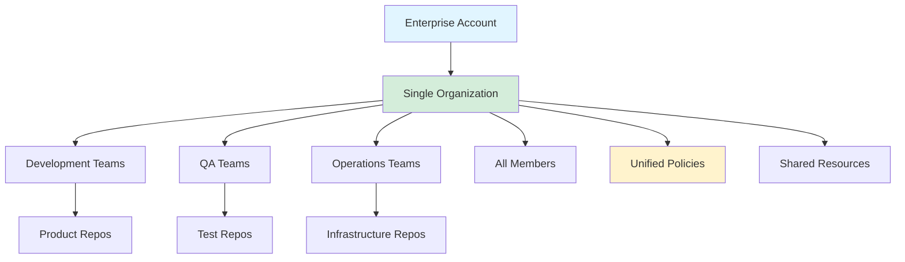
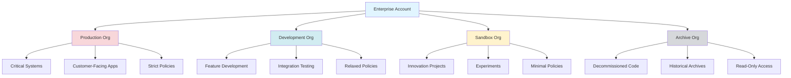
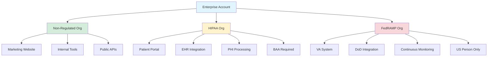
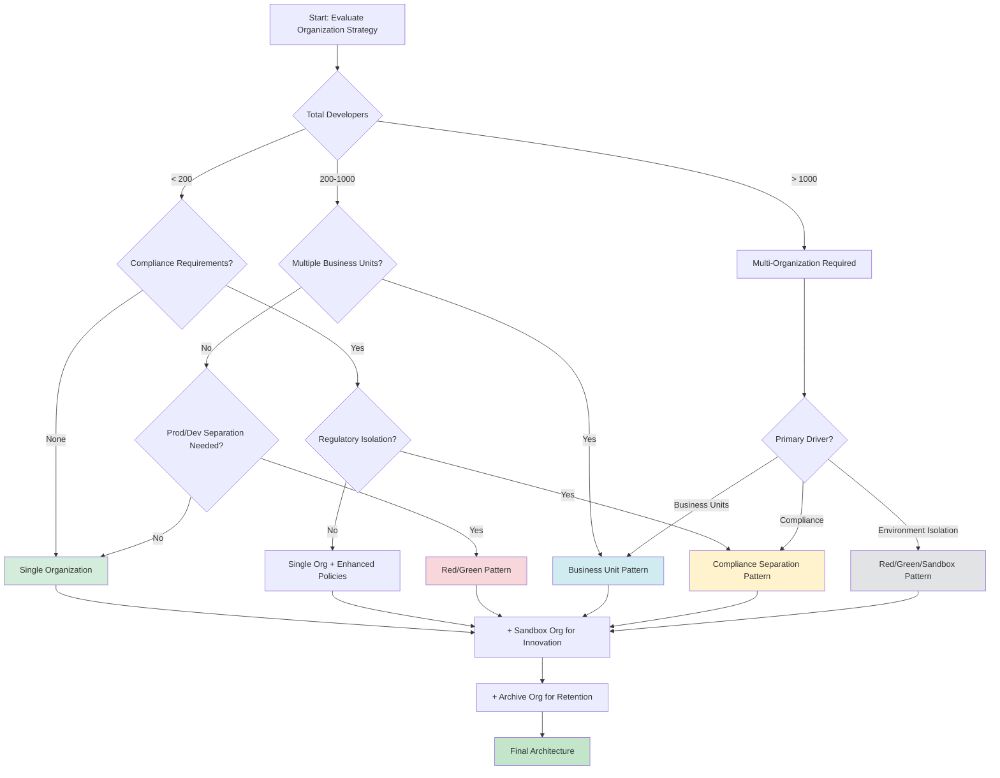
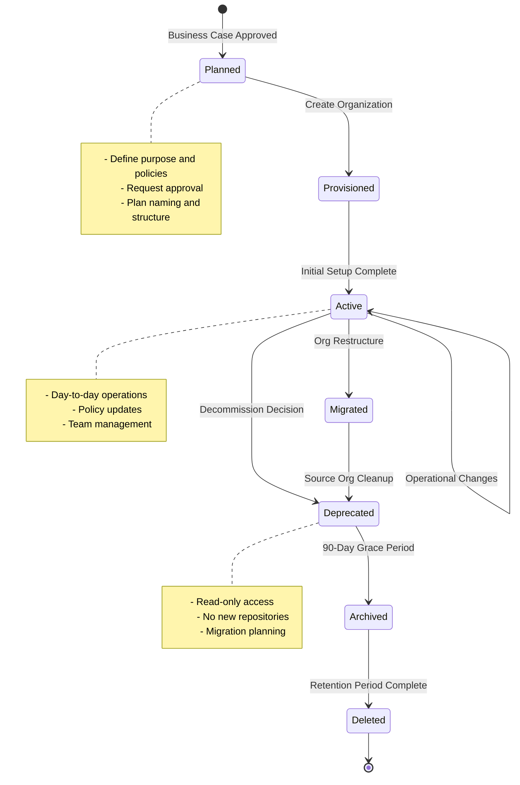

# Organization Design Patterns and Strategies

## Overview

Organization architecture represents one of the most critical design decisions in GitHub Enterprise Cloud (GHEC) deployment. The organizational structure directly impacts security boundaries, policy enforcement, cost allocation, compliance posture, and operational efficiency. This document provides expert-level guidance on selecting, implementing, and evolving organization design patterns for enterprise-scale GitHub deployments.

Organizations in GHEC serve as administrative and security boundaries within an enterprise account. They encapsulate repositories, teams, members, and policies while providing isolation for billing, audit, and compliance purposes. The choice between single and multi-organization architectures fundamentally shapes how your enterprise manages access control, enforces governance, and scales development operations.

## Single Organization Pattern

### Architecture Overview

The single organization pattern consolidates all repositories, teams, and members under one organizational unit within the enterprise account. This unified approach maximizes collaboration and simplifies administration while maintaining enterprise-level governance through centralized policies.



### When to Use Single Organization

**Optimal Use Cases:**
- **Small to Medium Enterprises** (< 500 developers): Administrative overhead remains manageable with unified governance
- **Highly Collaborative Environments**: Cross-functional teams require frequent repository access across product lines
- **Homogeneous Compliance Requirements**: Single regulatory framework applies uniformly across all development activities
- **Centralized Security Model**: Unified security posture with consistent scanning, secrets management, and vulnerability response
- **Startup to Scale-up Phase**: Rapid growth environments where organizational boundaries are still fluid
- **Platform Engineering Teams**: Shared platform services require universal access patterns

### Advantages

**Administrative Efficiency**
- Single point of administration for organization settings, integrations, and applications
- Unified audit log for comprehensive security monitoring
- Simplified user and team management through consolidated IdP synchronization
- Reduced context switching for administrators and users
- Single GitHub App installation scope reduces integration complexity

**Collaboration Benefits**
- Frictionless repository discovery through unified namespace
- Internal repositories enable innersource patterns across all teams
- Simplified CODEOWNERS configuration with organization-wide team references
- Unified discussions, projects, and dependency graphs
- Cross-team code reuse without fork/transfer overhead

**Cost Optimization**
- Single set of GitHub Actions shared runners (organization-level)
- Consolidated GitHub Advanced Security (GHAS) license utilization
- Simplified billing analysis and showback reporting
- Reduced administrative licensing costs

**Technical Advantages**
- Organization-level repository rulesets apply uniformly
- Shared secrets and variables for GitHub Actions
- Unified Dependabot configuration and security policies
- Single GitHub Packages namespace and artifact management
- Consolidated organization insights and metrics

### Disadvantages and Limitations

**Scaling Challenges**
- **Repository Sprawl**: Discovery becomes difficult as repository count exceeds 1,000+
- **Team Management Complexity**: Nested team hierarchies become unwieldy beyond 100 teams
- **Permission Model Limitations**: Base permissions apply globally, limiting defense-in-depth
- **Audit Log Volume**: High-velocity organizations generate massive audit data requiring streaming
- **API Rate Limits**: Shared organization-level rate limits may impact automation

**Security Concerns**
- **Reduced Blast Radius Control**: Compromised credentials grant access to entire organization
- **Uniform Security Posture**: Cannot enforce graduated security controls by sensitivity level
- **Internal Repository Visibility**: All members see all internal repositories by default
- **Shared Attack Surface**: Single SAML/SCIM configuration represents critical dependency
- **Compliance Boundaries**: Cannot isolate regulated workloads (PCI, HIPAA, FedRAMP) effectively

**Operational Constraints**
- **Change Management Risk**: Organization-level policy changes impact all repositories simultaneously
- **Disaster Recovery Complexity**: Single organization requires comprehensive backup strategy
- **Migration Friction**: Extracting business units later requires complex repository transfers
- **Limited Cost Allocation**: Granular chargeback requires external tooling and tagging discipline

### Scaling Considerations

**Growth Thresholds and Mitigation Strategies**

| Metric | Threshold | Impact | Mitigation Strategy |
|--------|-----------|--------|---------------------|
| Repositories | 1,000+ | Discovery degradation | Topic taxonomy, repository templates, naming conventions |
| Teams | 100+ | Management complexity | Team sync with IdP groups, flat structure preference |
| Members | 500+ | Permission sprawl | Custom repository roles, CODEOWNERS enforcement |
| Daily Commits | 10,000+ | Audit log volume | Enable log streaming to SIEM, implement retention policies |
| CI/CD Minutes | 1M+/month | Cost and queueing | Self-hosted runners, organization-level concurrency limits |

**Technical Scaling Patterns**

**Repository Organization Strategies**
- **Topic-Based Discovery**: Enforce topic taxonomy for repository categorization (`team:platform`, `tier:1`, `language:java`)
- **Naming Conventions**: Implement hierarchical naming schemes (`platform-api-gateway`, `mobile-ios-app`, `infra-terraform-modules`)
- **Template Repositories**: Standardize repository creation with pre-configured settings, security scanning, and CI/CD pipelines
- **Repository Archival Policy**: Automated archival of inactive repositories (90+ days no commits) to reduce clutter

**Team Structure Patterns**
- **Minimize Nesting**: Prefer flat team structures; excessive nesting (>3 levels) complicates permission reasoning
- **Team Sync**: Leverage IdP group synchronization to delegate team management to HR/IT systems
- **Team Size Optimization**: Keep teams under 50 members; larger groups should be split functionally
- **Maintainer Distribution**: Designate multiple team maintainers (minimum 3) for business continuity

**Permission Model Evolution**
- **Progressive Base Permissions**: Start with "No permission" base, grant explicit access through teams
- **Custom Repository Roles**: Define organization-specific roles (`security-reviewer`, `deployment-manager`, `read-plus-actions`)
- **CODEOWNERS Governance**: Enforce code review requirements through organization-level rulesets
- **Just-in-Time Access**: Implement temporary access workflows using GitHub Apps and API automation

## Multi-Organization Patterns

Multi-organization architectures leverage organizational boundaries as security, compliance, and operational isolation mechanisms. Each organization maintains independent settings, policies, and resources while remaining governed by enterprise-level controls.



### Red/Green (Blue/Green) Pattern

The Red/Green pattern (sometimes called Blue/Green) establishes strict separation between production and non-production environments using organizational boundaries. This pattern is derived from blue/green deployment strategies but applied at the organizational architecture level.

**Architecture Characteristics**

**Red Organization (Production)**
- **Purpose**: Production systems, customer-facing applications, revenue-generating services
- **Security Posture**: Maximum enforcement, zero-trust principles
- **Access Model**: Minimal privileges, time-bounded access, comprehensive audit logging
- **Change Control**: Mandatory peer review, required status checks, deployment approval gates
- **Compliance**: SOC 2, ISO 27001, industry-specific regulations (PCI DSS, HIPAA)

**Green Organization (Development)**
- **Purpose**: Feature development, integration testing, staging environments
- **Security Posture**: Balanced security with developer velocity
- **Access Model**: Broader access for development teams, self-service capabilities
- **Change Control**: Lighter review requirements, faster iteration cycles
- **Compliance**: Development environment standards, non-production data handling

**Policy Differentiation**

| Policy Domain | Red (Production) | Green (Development) |
|---------------|------------------|---------------------|
| Branch Protection | Required reviews (2+), signed commits, status checks | Required reviews (1+), optional signing |
| Secret Scanning | Push protection enabled, custom patterns | Push protection disabled, alerts only |
| Actions Policies | Approved actions only, self-hosted runners | Public actions allowed, GitHub-hosted runners |
| External Collaborators | Prohibited | Allowed with time limits |
| Repository Visibility | Private only | Private and internal |
| GHAS Enforcement | All features required | Optional per repository |
| IP Allow Lists | Corporate network only | Corporate + remote access |
| Deployment Environments | Protection rules, approval gates | Self-service deployment |

**Implementation Best Practices**

**Code Promotion Pipeline**
1. Development occurs in Green organization repositories
2. Pull request workflow merges code to main branch
3. CI/CD pipeline packages artifacts (container images, binaries, packages)
4. Artifacts promoted to production artifact registry
5. Red organization references promoted artifacts in deployment pipelines
6. Infrastructure-as-Code (IaC) may be replicated or shared depending on trust model

**Repository Strategy**
- **Option 1: Separate Repositories**: Maintain distinct repositories in each organization; promote artifacts only
  - **Advantages**: Complete isolation, different team access patterns
  - **Disadvantages**: Code duplication, synchronized repository settings
  
- **Option 2: Branch-Based**: Single repository in Green, protected production branch
  - **Advantages**: Unified history, simpler management
  - **Disadvantages**: Production code in non-production organization

**Access Management**
- **Separate Team Membership**: Production access requires explicit approval, separate IdP groups
- **Temporary Access Patterns**: Time-bounded production access using GitHub App automation
- **Break-Glass Procedures**: Emergency access protocols with mandatory incident tickets
- **Service Accounts**: Dedicated machine users for CI/CD with minimal scoped credentials

**Use Cases**
- Regulated industries requiring environment separation (financial services, healthcare)
- Organizations with strict change control requirements (ITIL, CMMI Level 4-5)
- Enterprises with separate production operations teams
- Multi-tenant SaaS providers with customer isolation requirements

### Sandbox Pattern

The Sandbox organization provides a low-risk environment for innovation, experimentation, and learning without impacting production systems or development velocity.

**Architecture Characteristics**

**Purpose and Scope**
- Technology evaluation and proof-of-concept projects
- Developer training and certification programs
- Hackathons and innovation initiatives
- Third-party integration testing
- Open-source project contributions
- Interview and assessment environments

**Security Model**
- **Isolation**: No connectivity to production or development systems
- **Data Restrictions**: Synthetic data only, no production data or credentials
- **Network Boundaries**: Separate network policies, no VPN/private link access
- **Access Control**: Self-service repository creation, relaxed permissions
- **Monitoring**: Basic audit logging, anomaly detection for abuse patterns

**Policy Configuration**
- Minimal branch protection (optional peer review)
- Public repositories allowed (with approval workflow)
- GitHub Actions: Public marketplace access, generous compute quotas
- External collaborators: Allowed for partnership evaluations
- GitHub Packages: Separate registry, no promotion to production
- Advanced Security: Optional, typically disabled for cost optimization

**Lifecycle Management**

**Onboarding Process**
1. Developer submits sandbox request via issue template or portal
2. Automated provisioning creates time-bounded repository (30/60/90 day TTL)
3. Repository includes README template with sandbox policies and expiration date
4. Automated notification 7 days before expiration with renewal instructions

**Graduation Path**
- Successful experiments promoted to Development organization via repository transfer
- Requires security review, code quality assessment, and architectural approval
- Repository transfer triggers automated policy application and security scan baseline

**Automatic Cleanup**
- Scheduled GitHub Actions workflow archives inactive repositories (30 days no commits)
- Notification workflow alerts owners before deletion (7-day warning)
- Soft delete: Transfer to Archive organization before permanent deletion (90-day retention)

**Cost Management**
- **Compute Quotas**: Per-user GitHub Actions minutes limits (e.g., 2,000 minutes/month)
- **Storage Quotas**: Repository size limits (1GB soft limit, alerts at 80%)
- **GHAS Exclusion**: Sandbox repositories excluded from GHAS license consumption
- **Spending Limits**: Organization-level spending caps for Actions and Packages

**Use Cases**
- **Technology Evaluation**: Assessing new frameworks, languages, or tools before adoption
- **Developer Onboarding**: New hire training environments without production access risk
- **Hackathons**: Time-bounded innovation events with rapid iteration
- **Partner Integration**: Testing third-party APIs and services in isolation
- **Certification Labs**: Hands-on environments for internal training programs
- **Interview Assessments**: Candidate technical evaluations with consistent environments

### Archive Pattern

The Archive organization serves as a repository graveyard for decommissioned, historical, or reference code that must be retained for compliance, audit, or historical purposes.

**Architecture Characteristics**

**Purpose**
- Regulatory retention requirements (SOX, GDPR, industry-specific regulations)
- Historical reference for legacy system migrations
- IP protection and code provenance documentation
- Audit trail for security incident investigations
- Sunset application code bases
- Acquired company repositories post-integration

**Security Posture**
- **Read-Only Access**: All repositories archived automatically on transfer
- **Limited Membership**: Minimal user access (compliance officers, legal, senior leadership)
- **Audit Logging**: Comprehensive access logging with extended retention (7+ years)
- **Encryption**: At-rest encryption for all archived content
- **Immutability**: Branch protection prevents force pushes or deletion

**Access Control Model**

**Tiered Access Levels**
1. **Legal/Compliance (Organization Owners)**: Full read access for discovery and export
2. **Historical Reference (Read Access)**: Engineers requiring legacy system understanding
3. **Audit/Security (Custom Role)**: Access to audit logs and repository metadata only
4. **External Auditors (Time-Bounded)**: Temporary read access via outside collaborators

**Request Workflow**
- Access requires formal request with business justification
- Approval chain: Manager → Security → Compliance
- Time-bounded access grants (30/60/90 days) with automatic expiration
- Comprehensive audit logging of all read operations

**Repository Lifecycle**

**Transfer Criteria**
- Application sunset after customer migration complete
- Acquired company code post-integration (12-month stabilization period)
- Regulatory retention triggers (end of service date + retention period)
- Legacy platform deprecation (mainframe, deprecated language versions)
- Security incident preservation (immutable record for forensics)

**Transfer Process**
1. Repository maintainer initiates transfer request via GitHub issue
2. Automated workflow validates completeness (README, LICENSE, documentation)
3. Metadata tagging (decommission date, business owner, retention period)
4. Transfer to Archive organization triggers automatic archival
5. Notification to organization members of new archived repository
6. Original organization retains redirect for 90 days

**Retention and Disposal**

**Retention Policies by Category**
| Content Type | Retention Period | Disposal Method |
|--------------|------------------|-----------------|
| Financial Systems | 7 years | Secure deletion with certificate |
| Healthcare (HIPAA) | 6 years | Secure deletion with audit log |
| General Business | 3-5 years | Standard deletion |
| IP/Patents | Indefinite | No disposal |
| Security Incidents | Indefinite | No disposal |

**Disposal Process**
- Automated workflow identifies repositories exceeding retention period
- Legal review confirms no ongoing litigation or audit holds
- Secure deletion with cryptographic verification
- Disposal certificate generated and retained in compliance system

**Cost Optimization**
- Archive organization excluded from GHAS licensing
- GitHub Actions disabled (no compute costs)
- GitHub Packages disabled (no storage costs for new artifacts)
- Storage costs minimal (Git repositories highly compressible)

**Use Cases**
- **Post-Merger Integration**: Acquired company repositories after code consolidation
- **Legacy Platform Sunsets**: Mainframe, AS/400, or deprecated language code bases
- **Regulatory Compliance**: SOX 404, GDPR Article 17 (right to erasure), industry-specific retention
- **Security Forensics**: Incident response evidence preservation with chain of custody
- **IP Portfolio Management**: Patent prosecution supporting documentation and prior art

### Business Unit Separation Pattern

Business Unit (BU) separation leverages organizational boundaries to align with corporate structure, enabling autonomous operations while maintaining enterprise governance.

**Architecture Rationale**

**Organizational Alignment**
- GitHub organizations mirror corporate reporting structure
- Department/division leadership has delegated administrative control
- Independent P&L centers require cost allocation and showback
- Merger and acquisition integration with preserved autonomy
- Geographic regional separation (EMEA, APAC, Americas)

**Autonomy vs. Governance Balance**
- **Enterprise-Level Controls**: SAML/SCIM, IP allow lists, audit log streaming, enterprise-wide policies
- **Organization-Level Autonomy**: Repository creation, team structure, internal workflows, application installations
- **Centralized Platform Team**: Shared services, reusable actions, internal packages, security tooling

**Policy Differentiation by Business Context**

**Example: Financial Services Conglomerate**

| Organization | Business Context | Policy Customization |
|--------------|------------------|----------------------|
| Retail Banking | Customer-facing web/mobile | PCI DSS compliance, strict data handling |
| Investment Management | Trading algorithms | IP protection, no external collaborators |
| Insurance | Claims processing | HIPAA compliance, audit logging emphasis |
| Corporate IT | Internal tools | Standard security, relaxed policies |

**Repository Organization Taxonomy**
- **Product-Aligned**: Separate organizations by major product lines or customer segments
- **Function-Aligned**: Engineering, Data Science, Security, Platform
- **Geography-Aligned**: Regional data residency and compliance requirements
- **Acquisition-Aligned**: Preserve acquired company structure during integration

**Inter-Organization Collaboration Patterns**

**Shared Code Libraries**
- **Internal Packages**: Publish reusable libraries to organization-specific GitHub Packages registry
- **Cross-Organization Access**: Grant read access to package registries via PAT or GitHub App
- **Monorepo Alternative**: Central "platform" organization hosts shared libraries

**Reusable GitHub Actions**
- **Centralized Workflows**: Platform organization publishes enterprise-standard actions
- **Organization Workflow References**: `organization/repository/.github/workflows/workflow.yml@main`
- **Composite Actions**: Publish as releases, consumed via semantic versioning

**Security Scanning Consolidation**
- **Central Security Organization**: Security team maintains visibility across all BU organizations
- **GitHub Advanced Security**: Enterprise-level licensing with per-organization opt-in
- **Aggregated Security Dashboard**: GitHub API + external tooling for unified vulnerability view

**Cost Allocation and Showback**

**Billing Separation**
- Each organization represents a cost center with independent billing reports
- GitHub Actions minutes and storage tracked per organization
- GHAS license consumption tracked via enterprise billing reports
- Export to financial systems for chargeback/showback via API integration

**Use Cases**
- **Conglomerate Enterprises**: Multi-brand corporations with distinct business units (PepsiCo divisions, Alphabet companies)
- **Professional Services Firms**: Client-dedicated organizations with strict access boundaries
- **Holding Companies**: Portfolio companies with preserved operational independence
- **Geographic Distribution**: Regional subsidiaries with local compliance requirements
- **Merger Integration**: Phased integration strategy preserving acquired company structure

### Compliance Separation Pattern

Compliance separation establishes organizational boundaries to enforce regulatory requirements, contractual obligations, and industry-specific security controls.

**Regulatory Boundary Management**

**Isolation Requirements by Regulation**

**PCI DSS (Payment Card Industry)**
- **In-Scope Organization**: Repositories containing payment processing logic, cardholder data handling
- **Security Controls**: Quarterly vulnerability scans, annual penetration testing, code review requirements
- **Access Restrictions**: Minimum necessary access, revocation within 24 hours of termination
- **Network Isolation**: IP allow lists restrict access to PCI network segments only
- **Audit Logging**: Enhanced logging with 1-year retention minimum

**HIPAA (Healthcare)**
- **PHI-Handling Organization**: Repositories with Protected Health Information access
- **Security Controls**: Encryption at rest and in transit, BAA-compliant infrastructure
- **Access Control**: Role-based access, minimum necessary principle, audit trails
- **Breach Notification**: Automated alerting for unauthorized PHI access attempts
- **Data Residency**: GitHub Enterprise Cloud with Advanced Security for compliance alignment

**FedRAMP (Federal Government)**
- **FedRAMP Organization**: Government-facing applications and systems
- **Security Controls**: Continuous monitoring, incident response, security documentation
- **Access Requirements**: Background checks, US-person restrictions, government device access
- **Data Classification**: CUI (Controlled Unclassified Information) handling procedures
- **Boundary Defense**: Strict network ingress/egress controls

**ITAR (International Traffic in Arms Regulations)**
- **ITAR Organization**: Defense-related repositories with export-controlled technology
- **Access Control**: US person restrictions, need-to-know basis, geographic IP restrictions
- **Audit Requirements**: Detailed access logs, quarterly compliance reviews
- **Data Transfer Controls**: No repository forks to uncontrolled organizations
- **Physical Location**: Verify GitHub data residency alignment with ITAR requirements

**Architecture Example: Healthcare Technology Company**



**Policy Enforcement Matrix**

| Control Domain | Non-Regulated | HIPAA | FedRAMP |
|----------------|---------------|-------|---------|
| MFA Enforcement | Required | Required + Hardware Tokens | Required + Hardware Tokens |
| IP Allow Lists | VPN Optional | Required (PHI Network) | Required (GovCloud) |
| Branch Protection | 1 Reviewer | 2 Reviewers + Security | 2 Reviewers + Security + ISSO |
| Secrets Scanning | Push Protection | Push Protection + Custom Patterns | Push Protection + Custom + Manual Review |
| Audit Retention | 90 days | 6 years | 3 years + SIEM Streaming |
| External Collaborators | Allowed | Prohibited | Prohibited |
| Third-Party Actions | Allowed | Vetted Only | Prohibited (Internal Only) |

**Cross-Organization Data Flow Controls**

**Data Classification Enforcement**
- **Metadata Tagging**: Repository topics indicate data classification (`data:phi`, `data:cui`, `compliance:fedramp`)
- **Automated Compliance Checks**: GitHub Actions validate no regulated data flows to non-compliant organizations
- **Code Scanning Custom Queries**: Detect potential sensitive data leaks in code

**Shared Resource Patterns**
- **Non-Sensitive Libraries**: Reusable code promoted from non-regulated to compliant organizations after security review
- **Infrastructure-as-Code**: Network boundary definitions prevent cross-contamination
- **CI/CD Pipelines**: Separate runners and deployment targets per compliance boundary

**Audit and Compliance Reporting**

**Automated Compliance Evidence Collection**
- GitHub API extracts policy configurations for compliance artifacts
- Audit log streaming to SIEM for real-time compliance monitoring
- Scheduled reports: Access reviews, policy changes, security findings
- Compliance dashboard: Organization-specific compliance posture scoring

**Use Cases**
- **Multi-Vertical Healthcare**: Hospital systems, insurance, pharmaceutical
- **Financial Services**: Investment banking, retail banking, fintech
- **Government Contractors**: Defense, intelligence, civilian agencies
- **Multi-National Corporations**: EU (GDPR), China (Cybersecurity Law), regional regulations
- **Critical Infrastructure**: Energy, utilities, telecommunications

## Organization Naming Conventions

Consistent naming conventions enable programmatic organization management, improve discoverability, and enforce governance through automation.

### Naming Pattern Strategies

**Hierarchical Prefix Naming**
```
<enterprise>-<category>-<descriptor>
```

**Examples:**
- `acme-prod-external` - Production organization for customer-facing services
- `acme-dev-platform` - Development organization for platform engineering
- `acme-sandbox-innovation` - Sandbox for R&D and experiments
- `acme-archive-legacy` - Archive for decommissioned systems
- `acme-compliance-pci` - PCI DSS compliant workloads

**Business Unit Alignment**
```
<enterprise>-<business-unit>-<environment>
```

**Examples:**
- `globex-retail-prod` - Retail division production
- `globex-insurance-dev` - Insurance division development
- `globex-corporate-it` - Corporate IT shared services

**Geographic Distribution**
```
<enterprise>-<region>-<purpose>
```

**Examples:**
- `initech-emea-prod` - EMEA regional production
- `initech-apac-dev` - APAC regional development
- `initech-amer-sandbox` - Americas sandbox environment

### Naming Convention Best Practices

**Character Constraints**
- Lowercase alphanumeric characters and hyphens only
- Maximum 39 characters (GitHub organization name limit)
- No consecutive hyphens, start/end with alphanumeric character
- Avoid ambiguous abbreviations (use `prod` not `prd`, `dev` not `dv`)

**Semantic Clarity**
- Self-documenting names convey purpose without lookup
- Consistent terminology across enterprise (standardize on red/green or blue/green, not mixed)
- Avoid generic names (`team-a`, `org-1`) that scale poorly

**Future-Proofing**
- Reserve naming patterns for anticipated growth (plan for 10x scale)
- Version numbers in names create migration challenges (avoid `acme-v2-prod`)
- Consider merger/acquisition scenarios (use neutral naming)

**Automation Integration**
- Naming pattern validation via GitHub Actions workflow on organization creation
- Automated tagging based on naming pattern (e.g., `acme-prod-*` gets `environment:production` topic)
- RBAC policies derived from organization name patterns

### Metadata and Discoverability

**Organization Description Standard**
```
<purpose> | <owner-team> | <environment-tier> | <compliance-scope>
```

**Example:**
```
Customer-facing e-commerce platform | Product Engineering | Production | PCI DSS
```

**Organization Profile Components**
- **Email**: Organizational distribution list for notifications (`ghec-prod-admins@company.com`)
- **URL**: Link to internal documentation or runbook (`https://wiki.company.com/github/organizations/prod`)
- **Location**: Geographic region or data residency (`US-East`, `EU-West`)
- **Twitter**: Department or product Twitter handle (optional, for public organizations)

## Migration Strategies Between Patterns

Organizational architecture evolution requires careful planning to minimize disruption while enabling strategic transformation.

### Migration Scenarios

**Single to Multi-Organization Migration**

**Trigger Conditions**
- Repository count exceeds 1,500 with discovery problems
- Security incident reveals need for blast radius reduction
- Compliance audit identifies need for regulatory separation
- Merger/acquisition requires separate organizational boundary
- Cost allocation requirements demand granular billing

**Migration Approach: Phased Extraction**

**Phase 1: Planning and Design (2-4 weeks)**
- Inventory all repositories, teams, and access patterns
- Define target organization structure and naming conventions
- Map repositories to target organizations based on criteria (compliance, business unit, lifecycle)
- Design team and permission model for each organization
- Document application and integration migration requirements

**Phase 2: Pilot Migration (2-3 weeks)**
- Select low-risk pilot group (10-20 repositories, single team)
- Create target organization with policy configuration
- Transfer pilot repositories using GitHub API or UI
- Migrate team membership and configure IdP synchronization
- Validate CI/CD pipelines, GitHub Apps, and webhooks
- Document lessons learned and refine runbook

**Phase 3: Bulk Migration (4-8 weeks)**
- Execute repository transfers in batches (50-100 repos per batch)
- Automated transfer via GitHub API with comprehensive logging
- Update documentation, links, and references
- Migrate GitHub Actions secrets and variables
- Reconfigure organization webhooks and installed applications
- Communicate changes to affected teams with migration guides

**Phase 4: Cleanup and Optimization (2 weeks)**
- Archive or delete empty repositories in source organization
- Review and optimize team structures in new organizations
- Consolidate duplicate teams across organizations
- Validate policy enforcement and compliance posture
- Update enterprise documentation and architecture diagrams

**Technical Considerations**

**Repository Transfer Impacts**
- **URLs Change**: `github.com/old-org/repo` → `github.com/new-org/repo`
- **Git Remotes**: Users must update remote URLs (GitHub creates redirects for 90 days)
- **Issues/PRs**: Issue numbers preserved, but URLs change
- **Actions**: Workflow runs lose history in source organization
- **Packages**: GitHub Packages namespace changes (may require republishing)
- **Webhooks**: Organization-level webhooks require reconfiguration
- **Apps**: GitHub App installations scoped to organization require reinstallation

**Automation Strategy**
```bash
# Example: Repository transfer via GitHub API
for repo in $(cat repos-to-migrate.txt); do
  gh api \
    --method POST \
    -H "Accept: application/vnd.github+json" \
    "/repos/source-org/${repo}/transfer" \
    -f new_owner="target-org" \
    -f new_name="${repo}"
  
  echo "Transferred ${repo} to target-org"
  sleep 2  # Rate limit consideration
done
```

**Multi-Organization Consolidation**

**Trigger Conditions**
- Over-segmentation created administrative burden
- Original compliance requirement resolved (regulation changed, product decommissioned)
- Organizational restructuring merged business units
- Cost optimization initiative consolidating licenses

**Consolidation Approach**

**Pre-Consolidation Assessment**
- Identify policy conflicts between source organizations
- Catalog organization-specific integrations and webhooks
- Map team memberships and identify duplicates
- Assess repository name collisions in target organization
- Evaluate security and compliance implications

**Consolidation Execution**
1. **Policy Harmonization**: Align target organization policies to most restrictive settings
2. **Team Merging**: Consolidate teams with overlapping membership
3. **Repository Transfer**: Batch transfer repositories with collision resolution (rename with prefix)
4. **Integration Migration**: Reinstall GitHub Apps and reconfigure webhooks
5. **Clean Decommission**: Delete source organizations after 30-day validation period

**Red/Green to Single Organization**

**Rationale**: Development velocity concerns outweigh environment separation benefits

**Approach**: Merge Green into Red with enhanced branch protection
- Establish branch naming convention (`production/*`, `development/*`)
- Implement repository rulesets with environment-specific targeting
- Migrate deployment environment protection rules
- Consolidate CI/CD pipelines with environment-aware logic

**Single to Red/Green/Sandbox Separation**

**Rationale**: Security maturity progression demands defense-in-depth

**Approach**: Extract by criticality and lifecycle
1. **Identify Production Repositories**: Customer-facing, revenue-generating, regulated
2. **Create Red Organization**: Configure maximum security posture
3. **Transfer Production Repos**: Migrate with comprehensive testing
4. **Establish Promotion Pipeline**: Define artifact promotion from Green → Red
5. **Create Sandbox**: Extract experimental repositories to separate organization

### Migration Risk Mitigation

**Pre-Migration Checklist**
- [ ] Backup audit logs from source organization (API export or log streaming)
- [ ] Export all repository metadata (topics, descriptions, visibility settings)
- [ ] Document all organization webhooks and installed GitHub Apps
- [ ] Capture current team structures and member access levels
- [ ] Clone critical repository wikis and GitHub Pages content
- [ ] Export organization projects and associated issues
- [ ] Validate backup strategy for rollback scenarios

**Communication Plan**
- **T-minus 2 weeks**: Announce migration, share timeline and FAQs
- **T-minus 1 week**: Provide detailed instructions for updating git remotes
- **Migration Day**: Real-time status updates via Slack/Teams channel
- **T-plus 1 week**: Office hours for troubleshooting and support
- **T-plus 2 weeks**: Post-migration retrospective and lessons learned

**Rollback Strategy**
- Repository transfers are reversible (transfer back to source organization)
- GitHub maintains redirects for 90 days (reduces URL change impact)
- Backup audit logs and metadata enable point-in-time restoration
- Document rollback procedure and decision criteria

## Organization Strategy Decision Matrix

Selecting the optimal organization architecture requires evaluating multiple dimensions against business requirements.

### Decision Framework



### Evaluation Criteria Matrix

| Criterion | Weight | Single Org | Red/Green | Business Unit | Compliance Separation |
|-----------|--------|------------|-----------|---------------|----------------------|
| **Team Size** | High | Optimal < 500 | Optimal < 1000 | Any | Any |
| **Admin Overhead** | Medium | Low | Medium | High | Very High |
| **Collaboration** | High | Excellent | Good | Medium | Limited |
| **Security Isolation** | High | Basic | Good | Good | Excellent |
| **Compliance** | High | Limited | Medium | Medium | Excellent |
| **Cost Allocation** | Medium | Manual | Basic | Good | Excellent |
| **Scalability** | High | Limited (< 2000 repos) | Good | Excellent | Excellent |
| **Change Velocity** | High | Fastest | Fast | Medium | Slower |

**Scoring System**
- Assign weight to each criterion (1-5, where 5 is most critical to your organization)
- Score each pattern (1-5, where 5 is best alignment)
- Calculate weighted score: Σ(Weight × Score)
- Highest score indicates recommended pattern

### Pattern Selection Guidelines

**Choose Single Organization When:**
- Total developers < 300 and growth trajectory remains below 500
- Collaboration and code sharing are paramount business requirements
- Administrative resources are limited (< 2 FTE GitHub admins)
- Compliance requirements are uniform across all development activities
- Organizational structure is flat with minimal departmental boundaries

**Choose Red/Green Pattern When:**
- Production incidents require blast radius containment
- Regulatory compliance mandates environment separation (but not isolation)
- Different change control processes apply to production vs. development
- Development velocity is hindered by production-level controls
- Clear promotion pipeline exists for artifacts from dev to prod

**Choose Business Unit Pattern When:**
- Multiple P&L centers require cost allocation and showback
- Departmental autonomy is critical to operational model
- Different business units have distinct compliance requirements
- Merger/acquisition integration requires preserved boundaries
- Geographic distribution necessitates regional administration

**Choose Compliance Separation Pattern When:**
- Multiple regulatory frameworks apply (PCI + HIPAA, FedRAMP + ITAR)
- Contractual obligations require strict customer data isolation
- Audit scope reduction is critical for compliance efficiency
- Data residency requirements vary by application type
- Security clearance levels dictate access boundaries

**Hybrid Patterns**
Most enterprises benefit from combining multiple patterns:
- **Common Architecture**: Red/Green + Sandbox + Archive
- **BU with Isolation**: Business Unit + Compliance Separation per unit
- **Geographic BU**: Business Unit (by region) + Red/Green (per BU)

## Organization Lifecycle Management



### Provisioning Workflow

**Organization Request Process**
1. **Business Justification**: Requester submits organization request via internal portal or GitHub issue
   - Business rationale for new organization
   - Expected repository and team count
   - Compliance and security requirements
   - Cost center / budget approval
   - Proposed naming and description

2. **Architectural Review**: Enterprise Architect evaluates against standards
   - Alignment with enterprise patterns
   - Alternative solutions (team/repository vs. organization)
   - Long-term scalability assessment
   - Policy and compliance implications

3. **Approval Chain**: Multi-level approval workflow
   - Department head approval (business need)
   - Security team approval (risk assessment)
   - Enterprise Architect approval (architectural fit)
   - Finance approval (budget allocation)

4. **Automated Provisioning**: Terraform or GitHub API-based creation
   ```hcl
   resource "github_organization" "new_org" {
     name        = "acme-${var.business_unit}-${var.environment}"
     description = var.org_description
     billing_email = var.billing_email
     
     # Apply standard settings
     has_organization_projects = true
     has_repository_projects   = true
     members_can_create_repositories = false
   }
   ```

5. **Baseline Configuration**: Apply organization settings via policy-as-code
   - SAML SSO configuration
   - Team synchronization with IdP groups
   - Repository creation policies
   - GitHub Actions permissions
   - Security and analysis features
   - Third-party access policies

6. **Documentation and Handoff**: Update enterprise documentation
   - Add to organization inventory
   - Update architecture diagrams
   - Create runbook in wiki
   - Notify stakeholders of new organization URL

### Active Lifecycle Management

**Quarterly Organization Health Check**
- **Repository Growth**: Monitor repository count vs. planned capacity
- **Team Structure**: Review team proliferation and nesting depth
- **Access Review**: Validate outside collaborators and dormant accounts
- **Policy Compliance**: Audit policy configurations against baselines
- **Cost Analysis**: Review Actions minutes, storage, and GHAS utilization
- **Security Posture**: Aggregate security alerts and response times

**Automated Governance**
- **Policy Drift Detection**: Scheduled GitHub Actions workflow compares organization settings to baseline
- **Compliance Reporting**: Weekly reports on security findings, access anomalies, policy violations
- **Cost Alerts**: Threshold-based notifications for Actions minutes and storage consumption
- **Capacity Planning**: Trending analysis triggers expansion discussions

### Deprecation and Decommissioning

**Deprecation Triggers**
- Business unit restructuring or dissolution
- Technology platform migration (move to new organization architecture)
- Compliance scope change (regulation no longer applies)
- Cost optimization (consolidate underutilized organizations)
- Post-acquisition integration completion

**Deprecation Workflow**
1. **Deprecation Notice**: Organization description updated with deprecation date
2. **Repository Freeze**: Disable repository creation, enforce read-only on non-critical repos
3. **Migration Planning**: Identify repositories requiring transfer vs. archival
4. **User Communication**: 90-day notice to organization members with transition plan
5. **Access Restriction**: Remove members with no active repositories (retain owners only)
6. **Final Migration**: Transfer remaining active repositories to target organization
7. **Archive Transfer**: Move historical repositories to Archive organization
8. **Organization Deletion**: Delete empty organization or convert to placeholder

**Retention Considerations**
- Maintain organization for redirect purposes (GitHub redirects `old-org/repo` → `new-org/repo` for 90 days after transfer)
- Preserve audit logs via enterprise audit log streaming (organization deletion removes logs)
- Export organization metadata and team structures for historical reference

## Cross-References

### Related Documentation
- [Enterprise Hierarchy](01-enterprise-hierarchy.md) - Understanding the enterprise account structure that contains organizations
- [Teams and Permissions](05-teams-permissions.md) - Team structures and permission models within organizations
- [Policy Inheritance](06-policy-inheritance.md) - How enterprise policies flow down to organization level
- [Repository Governance](07-repository-governance.md) - Repository-level controls within organizational boundaries
- [Security and Compliance](08-security-compliance.md) - Security features and compliance capabilities across organizations
- [Best Practices and WAF](09-best-practices-waf.md) - Organization design best practices aligned with GitHub Well-Architected Framework

## References

### GitHub Documentation
- [About organizations](https://docs.github.com/en/enterprise-cloud@latest/organizations/collaborating-with-groups-in-organizations/about-organizations)
- [Managing organization settings](https://docs.github.com/en/enterprise-cloud@latest/organizations/managing-organization-settings)
- [Best practices for organizations](https://docs.github.com/en/enterprise-cloud@latest/organizations/collaborating-with-groups-in-organizations/best-practices-for-organizations)
- [Transferring a repository](https://docs.github.com/en/enterprise-cloud@latest/repositories/creating-and-managing-repositories/transferring-a-repository)
- [Viewing and managing a member's SAML access](https://docs.github.com/en/enterprise-cloud@latest/organizations/granting-access-to-your-organization-with-saml-single-sign-on/viewing-and-managing-a-members-saml-access-to-your-organization)

### Architecture and Best Practices
- [GitHub Enterprise Cloud Well-Architected Framework](https://wellarchitected.github.com/)
- [Enterprise account documentation](https://docs.github.com/en/enterprise-cloud@latest/admin/overview/about-github-enterprise-cloud)
- [Establishing a GitHub enterprise](https://docs.github.com/en/enterprise-cloud@latest/admin/overview/establishing-a-github-enterprise)
- [GitHub Enterprise onboarding resources](https://resources.github.com/learn/pathways/administration-governance/)

### Compliance and Security
- [GitHub Enterprise Cloud security features](https://docs.github.com/en/enterprise-cloud@latest/admin/code-security)
- [About data residency](https://docs.github.com/en/enterprise-cloud@latest/admin/configuration/configuring-data-residency-for-your-enterprise)
- [GitHub compliance documentation](https://docs.github.com/en/enterprise-cloud@latest/admin/overview/about-github-enterprise-cloud#compliance-and-security)
- [Audit log documentation](https://docs.github.com/en/enterprise-cloud@latest/admin/monitoring-activity-in-your-enterprise/reviewing-audit-logs-for-your-enterprise)

---

*This document is part of the GitHub Enterprise Cloud Administration & Governance (L400) workshop series. For questions or contributions, contact the Enterprise Architecture team.*
