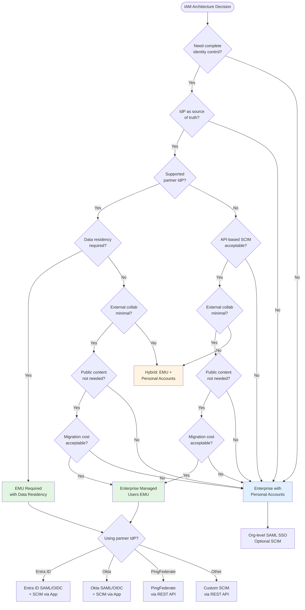
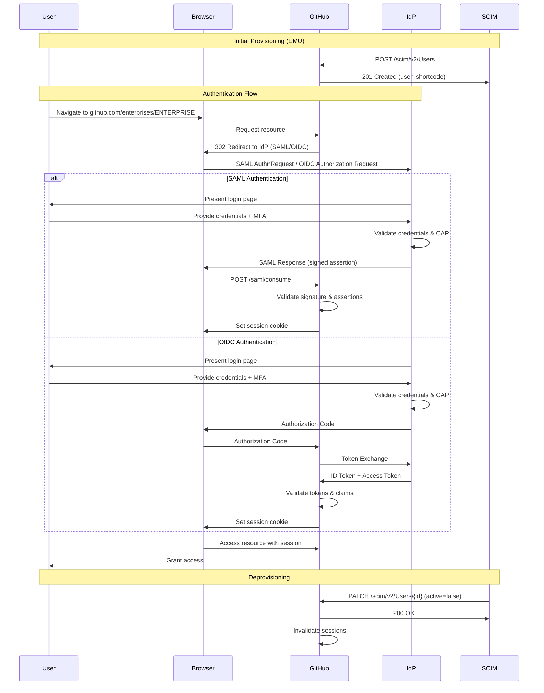
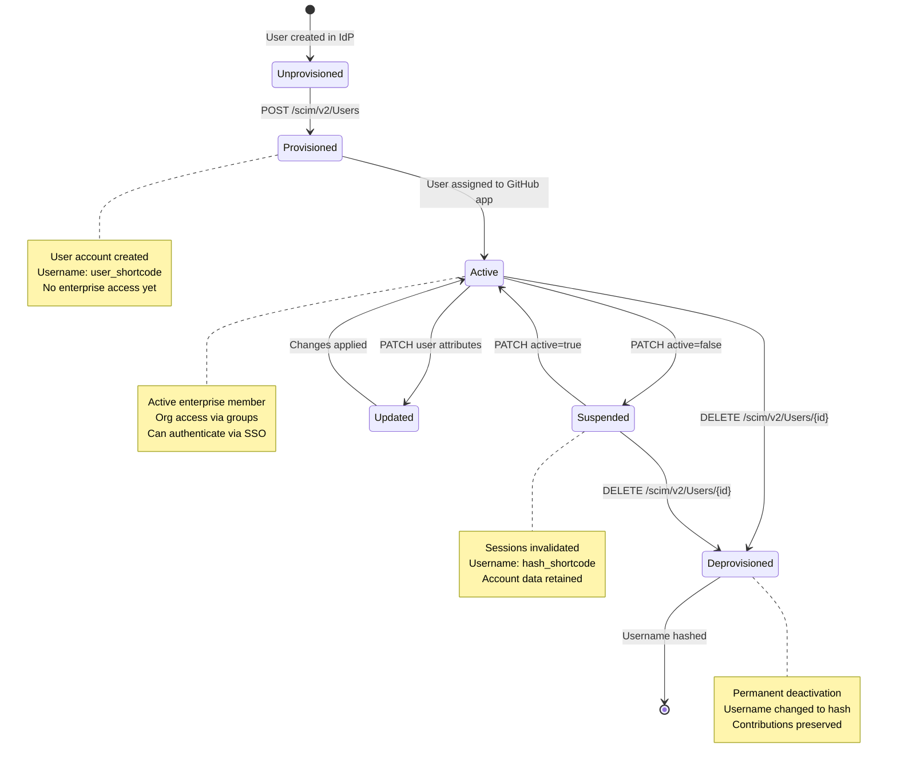

# Identity and Access Management (IAM)

## Overview

Identity and Access Management (IAM) is the foundational pillar of GitHub Enterprise Cloud security and governance. This guide provides L400-level technical expertise for enterprise administrators implementing authentication, authorization, and identity lifecycle management at scale.

GitHub Enterprise Cloud offers two distinct enterprise types with fundamentally different IAM architectures. The choice between enterprise types has far-reaching implications for authentication flows, user lifecycle management, security boundaries, and operational complexity.

## Table of Contents

- [Enterprise Type Selection](#enterprise-type-selection)
- [Authentication Methods Overview](#authentication-methods-overview)
- [SAML Single Sign-On (SSO) Configuration](#saml-single-sign-on-sso-configuration)
- [SCIM Provisioning Fundamentals](#scim-provisioning-fundamentals)
- [Personal Access Token (PAT) Policies](#personal-access-token-pat-policies)
- [SSH Key and GPG Key Management](#ssh-key-and-gpg-key-management)
- [Two-Factor Authentication (2FA) Enforcement](#two-factor-authentication-2fa-enforcement)
- [Advanced IAM Considerations](#advanced-iam-considerations)
- [References](#references)

---

## Enterprise Type Selection

### Enterprise Types Comparison

GitHub Enterprise Cloud offers two mutually exclusive enterprise architectures:

| Aspect | Enterprise with Personal Accounts | Enterprise with Managed Users (EMU) |
|--------|-----------------------------------|-------------------------------------|
| **Identity Ownership** | User-controlled personal accounts | Enterprise-controlled managed accounts |
| **Authentication** | Optional SAML SSO per organization | Mandatory SAML/OIDC SSO at enterprise level |
| **User Provisioning** | Manual or org-level SCIM | Enterprise-level SCIM with full lifecycle |
| **Username Control** | User-defined | IdP-normalized (e.g., `user_shortcode`) |
| **Profile Management** | User-controlled | IdP-controlled (immutable on GitHub) |
| **External Collaboration** | Native support | Requires separate personal account |
| **Public Content** | Allowed | Prohibited (no public repos/gists/Pages) |
| **Migration Path** | Bidirectional between orgs | Requires new enterprise (no in-place upgrade) |
| **Data Residency** | Not available | Required for data residency compliance |
| **Recovery Access** | User password reset | Setup user (`SHORTCODE_admin`) |
| **Audit Granularity** | Org-level with external identity links | Enterprise-level with complete IdP control |

### Decision Framework



### Enterprise with Personal Accounts

**Architecture Characteristics:**
- Users authenticate with GitHub-managed personal accounts
- Optional SAML SSO configured per organization (not enterprise-wide)
- Users may belong to multiple enterprises with single account
- SCIM provisioning only manages organization membership, not accounts
- Users retain full control over username, profile, and personal repositories

**Ideal Use Cases:**
- Organizations with established GitHub user base
- Environments requiring extensive external collaboration
- Teams needing public repository and GitHub Pages access
- Enterprises not ready for comprehensive IdP integration
- Multi-enterprise users (contractors, open-source maintainers)

**Implementation Considerations:**
- Configure SAML SSO independently for each organization
- Enforce SAML authentication via organization security settings
- Link external identities using SAML NameID assertion
- Manage access via GitHub teams synchronized with IdP groups (optional)
- Monitor external collaborator access patterns

### Enterprise Managed Users (EMU)

**Architecture Characteristics:**
- Complete identity lifecycle managed from IdP (provision, update, deprovision)
- Mandatory SAML/OIDC authentication at enterprise boundary
- Username format: `{idp_username}_{shortcode}` (e.g., `jsmith_acme`)
- Profile data (name, email) immutable on GitHub, controlled by IdP
- Strong isolation: managed users cannot access content outside enterprise
- Setup user account for emergency access: `{shortcode}_admin`

**Ideal Use Cases:**
- Enterprises requiring true SSO with centralized identity governance
- Organizations with security compliance mandates (SOC 2, ISO 27001)
- Environments prohibiting public content creation
- Companies needing data residency capabilities
- Strict deprovisioning requirements for terminated employees

**Implementation Considerations:**
- **Cannot be applied to existing enterprises** - requires new enterprise creation
- Setup user credentials must be securely stored for recovery scenarios
- Users requiring external collaboration need separate personal accounts
- IdP must support SAML 2.0 or OIDC 1.0 + SCIM 2.0 specifications
- Plan for username normalization conflicts (IdP identifier collisions)

### Supported Identity Providers

#### Partner IdPs (Paved-Path Integration)

**Microsoft Entra ID (Azure AD):**
- SAML 2.0 or OIDC support with Conditional Access Policy (CAP) validation
- Enterprise application with automated SCIM provisioning
- Group-based role assignment and team synchronization
- Limitation: Does not support nested group provisioning

**Okta:**
- SAML 2.0 or OIDC authentication
- Native GitHub EMU application with SCIM provisioning
- Support for group push and role assignment
- Extensive attribute mapping capabilities

**PingFederate:**
- SAML 2.0 authentication (partner support)
- SCIM provisioning via REST API (not native application)
- Requires manual configuration of SCIM endpoints

**Critical Restriction:**
> ⚠️ **Mixing Okta and Entra ID for SSO and SCIM (in either direction) is explicitly unsupported.** GitHub's SCIM API returns errors when this combination is detected. Choose one partner IdP for both authentication and provisioning.

#### Non-Partner IdPs

Any IdP meeting these requirements:
- SAML 2.0 specification compliance for authentication
- SCIM 2.0 specification compliance for provisioning
- REST API integration for user lifecycle management
- GitHub integration guidelines adherence

**Support Limitations:**
- GitHub Support may not assist with custom/mixed IdP configurations
- Extensive testing and validation required
- Documentation and troubleshooting responsibility falls on enterprise

---

## Authentication Methods Overview

### Authentication Architecture



### Authentication Methods by Enterprise Type

#### Personal Accounts Enterprise

1. **Username/Password:** Native GitHub authentication (always available)
2. **SAML SSO (Optional):** Per-organization SAML 2.0 authentication
3. **OAuth Apps:** Third-party application authorization
4. **GitHub Mobile:** Mobile device authentication with push notifications
5. **Two-Factor Authentication:** TOTP, SMS, or security keys (optional/required per org)

#### EMU Enterprise

1. **SAML 2.0 SSO (Mandatory):** Enterprise-wide SAML authentication with IdP
2. **OIDC 1.0 SSO (Mandatory):** OpenID Connect with CAP support (Entra ID)
3. **Setup User:** Emergency access via `{shortcode}_admin` account
4. **Personal Access Tokens:** Fine-grained or classic tokens (policy-controlled)
5. **SSH Keys:** Git protocol authentication (IdP identity-linked)

### Session Management

**Session Duration:**
- SAML SSO: Configurable in IdP (typically 8-24 hours)
- OIDC SSO: Controlled by token lifetime and refresh policies
- GitHub session: Maximum 90 days (refreshed on activity)

**Session Invalidation:**
- User logout from GitHub
- IdP-initiated logout (SAML SLO - Single Logout)
- Account deprovisioning via SCIM
- Password change or credential revocation
- Security policy enforcement (IP whitelist violation)

---

## SAML Single Sign-On (SSO) Configuration

### SAML 2.0 Protocol Overview

SAML (Security Assertion Markup Language) enables federated authentication by allowing GitHub to trust identity assertions from external IdPs. The protocol uses XML-based messages exchanged via HTTP redirects/POSTs.

### IdP Setup: Microsoft Entra ID

#### Prerequisites
- Azure AD Premium P1/P2 license (for CAP support with OIDC)
- Global Administrator or Application Administrator role
- GitHub Enterprise Cloud with EMU (for enterprise-level SSO)

#### Configuration Steps

**1. Create Enterprise Application**
```bash
# Azure CLI approach (alternative to portal)
az ad app create \
  --display-name "GitHub EMU - ACME Corp" \
  --sign-in-audience AzureADMyOrg \
  --required-resource-accesses @manifest.json
```

**2. Configure Single Sign-On**

Navigate to Azure Portal → Enterprise Applications → GitHub EMU → Single sign-on:

- **SSO Method:** SAML or OIDC
- **Entity ID:** `https://github.com/enterprises/{ENTERPRISE_SLUG}`
- **Reply URL (ACS):** `https://github.com/enterprises/{ENTERPRISE_SLUG}/saml/consume`
- **Sign-on URL:** `https://github.com/enterprises/{ENTERPRISE_SLUG}/sso`
- **Logout URL:** `https://github.com/enterprises/{ENTERPRISE_SLUG}/saml/slo`

**3. Download Metadata**

Export SAML metadata XML or note these values:
- **IdP SSO URL:** `https://login.microsoftonline.com/{tenant}/saml2`
- **IdP Issuer:** `https://sts.windows.net/{tenant}/`
- **X.509 Certificate:** Base64-encoded public certificate

#### SAML Attribute Mapping

Critical SAML assertions for GitHub EMU:

| GitHub Attribute | SAML Assertion | Entra ID Source | Required |
|------------------|----------------|-----------------|----------|
| `NameID` | Subject NameID | `user.userprincipalname` or `user.mail` | Yes |
| `administrator` | `http://schemas.xmlsoap.org/ws/2005/05/identity/claims/administrator` | Custom (group membership) | No |
| `userName` | `http://schemas.xmlsoap.org/ws/2005/05/identity/claims/name` | `user.userprincipalname` | Yes |
| `emails` | `http://schemas.xmlsoap.org/ws/2005/05/identity/claims/emailaddress` | `user.mail` | Yes |
| `firstName` | `http://schemas.xmlsoap.org/ws/2005/05/identity/claims/givenname` | `user.givenname` | Yes |
| `lastName` | `http://schemas.xmlsoap.org/ws/2005/05/identity/claims/surname` | `user.surname` | Yes |

**Advanced: Role-Based Attribute**

Configure administrator role via group claim:
```xml
<!-- Attribute transformation in Azure -->
<Claim Name="administrator">
  <Value>
    Join("", 
      If(
        Contains([group], "github-enterprise-owners-guid"),
        "true",
        "false"
      )
    )
  </Value>
</Claim>
```

#### Conditional Access Policy (CAP) Integration

For OIDC authentication, configure CAP to enforce:
- **Multi-Factor Authentication:** Require MFA for GitHub access
- **Device Compliance:** Restrict to Intune-managed devices
- **Location Restrictions:** Block access from unapproved countries
- **Risk-Based Policies:** Require step-up auth for risky sign-ins

GitHub validates CAP enforcement during OIDC token exchange.

### IdP Setup: Okta

#### Prerequisites
- Okta Workforce Identity or Customer Identity Cloud
- Organization Administrator or Application Administrator role
- GitHub EMU enterprise shortcode

#### Configuration Steps

**1. Add GitHub EMU Application**

Okta Admin Console → Applications → Browse App Catalog → "GitHub Enterprise Managed User"

**2. Configure Application Settings**

- **GitHub Enterprise Slug:** `{ENTERPRISE_SLUG}`
- **GitHub Enterprise Shortcode:** `{SHORTCODE}`
- **SCIM Provisioning:** Enable (requires API token from GitHub)

**3. SAML Settings (Automatic via Template)**

Pre-configured by Okta application:
- **SSO URL:** Auto-populated
- **Audience URI:** Auto-populated
- **Name ID Format:** EmailAddress
- **Application Username:** Okta username prefix

**4. Attribute Mapping**

| Okta User Attribute | GitHub SAML Attribute |
|---------------------|-----------------------|
| `user.login` | `userName` |
| `user.email` | `emails` |
| `user.firstName` | `firstName` |
| `user.lastName` | `lastName` |
| Group membership | `roles` (via API) |

**5. Group-Based Roles**

Use Okta groups to assign GitHub enterprise roles:
- Create rule: If user is member of `github-owners` → Set `roles=enterprise_owner`
- Okta sends role information during provisioning API calls

### IdP Setup: PingFederate

#### Configuration Steps

**1. Create SP Connection**

PingFederate Admin → SP Connections → Create New:
- **Partner Entity ID:** `https://github.com/enterprises/{ENTERPRISE_SLUG}`
- **Connection Type:** Browser SSO
- **Binding:** HTTP POST or HTTP Redirect

**2. Configure SSO Service URLs**

- **Assertion Consumer Service (ACS):** 
  - URL: `https://github.com/enterprises/{ENTERPRISE_SLUG}/saml/consume`
  - Binding: HTTP POST
  - Index: 0 (default)

**3. Attribute Contract**

Define attributes passed to GitHub:
- **Subject NameID:** Persistent identifier (email or username)
- **userName:** User's unique identifier
- **emails:** User's email address
- **firstName, lastName:** User's display name components

**4. Signature Policy**

- Sign assertion: Enabled
- Sign response: Enabled (recommended)
- Algorithm: RSA-SHA256 or RSA-SHA512
- Certificate: Valid X.509 certificate from trusted CA

### GitHub Enterprise Configuration

#### Enable SAML SSO

**For EMU Enterprise:**

1. Sign in as setup user: `{SHORTCODE}_admin`
2. Navigate to Enterprise → Settings → Authentication security
3. Select "Enable SAML authentication"
4. Upload IdP metadata XML or enter manually:
   - **Sign-on URL:** IdP SAML SSO endpoint
   - **Issuer:** IdP entity ID
   - **Public Certificate:** X.509 certificate (PEM format)
5. Configure NameID format: Email Address (recommended)
6. Test SSO with setup user session active (new private window)
7. Enable "Require SAML authentication" after successful test

**Verification Steps:**
```bash
# Test SAML metadata endpoint
curl -I https://github.com/enterprises/{ENTERPRISE}/saml/metadata

# Verify certificate expiration
openssl x509 -in idp_certificate.pem -noout -enddate

# Test SSO flow
curl -v https://github.com/enterprises/{ENTERPRISE}/sso \
  --user-agent "Mozilla/5.0"
```

#### SSO Enforcement and Recovery

**Enforcement Levels:**

1. **Recommended (Soft Enforcement):**
   - Display SSO banner for unauthenticated users
   - Allow personal account access for setup user
   - Graceful degradation for troubleshooting

2. **Required (Hard Enforcement):**
   - Redirect all unauthenticated requests to IdP
   - Block access without valid SAML assertion
   - Setup user exempt for emergency access

**Recovery Procedures:**

**Scenario 1: IdP Outage**
```bash
# Emergency access via setup user
# 1. Navigate to https://github.com/enterprises/{ENTERPRISE}/settings/security
# 2. Sign in as {SHORTCODE}_admin
# 3. Temporarily disable "Require SAML authentication"
# 4. Users can authenticate with GitHub credentials
# 5. Re-enable after IdP restoration
```

**Scenario 2: Certificate Expiration**
```bash
# Urgent certificate rotation
# 1. Generate new certificate on IdP
# 2. Sign in to GitHub as setup user
# 3. Enterprise → Authentication security → Edit SAML
# 4. Upload new certificate (old cert still valid during overlap)
# 5. Test authentication with new cert
# 6. Revoke old certificate on IdP
```

**Scenario 3: Misconfigured Attributes**
```bash
# Debug SAML assertions
# 1. Enable SAML debug mode (contact GitHub Support)
# 2. Authenticate as test user
# 3. Review SAML assertion in audit log:
#    Enterprise → Settings → Audit log → Filter: "saml"
# 4. Identify missing/malformed attributes
# 5. Correct attribute mapping on IdP
# 6. Test with same user
```

#### SSO for Unauthenticated Users

**Configuration Options:**

- **Redirect Unauthenticated Users:** Automatically send to IdP (recommended for EMU)
- **Display 404 Error:** Require explicit SSO URL navigation (default for privacy)

**Implementation:**
```bash
# Enterprise Settings → Security → Authentication
# Enable: "Automatically redirect unauthenticated users to SSO"
```

**Use Cases:**
- **Enable:** Seamless user experience, no confusion about authentication method
- **Disable:** Privacy-conscious organizations hiding enterprise existence from scanners

---

## SCIM Provisioning Fundamentals

### SCIM 2.0 Protocol Overview

System for Cross-domain Identity Management (SCIM) standardizes user and group provisioning via RESTful APIs. GitHub implements SCIM 2.0 RFC 7644 for EMU user lifecycle management.

### SCIM User Lifecycle



### SCIM Provisioning Configuration

#### Partner IdP: Microsoft Entra ID

**1. Enable Provisioning in Enterprise App**

Azure Portal → Enterprise Applications → GitHub EMU → Provisioning:
- **Provisioning Mode:** Automatic
- **Tenant URL:** `https://api.github.com/scim/v2/enterprises/{ENTERPRISE}`
- **Secret Token:** Generate from GitHub (Enterprise → Settings → Security)
- **Notification Email:** Email for provisioning error alerts

**2. Attribute Mapping**

Azure AD → GitHub EMU → Provisioning → Mappings → "Provision Azure AD Users":

| Azure AD Attribute | GitHub Attribute | Notes |
|--------------------|------------------|-------|
| `userPrincipalName` | `userName` | Normalized to lowercase, special chars removed |
| `mail` | `emails[type eq "work"].value` | Primary email address |
| `givenName` | `name.givenName` | First name |
| `surname` | `name.familyName` | Last name |
| `displayName` | `displayName` | Full display name |
| `accountEnabled` | `active` | `true` = active, `false` = suspended |
| `externalId` | `externalId` | Azure AD object ID (immutable) |

**3. Group Provisioning (Team Synchronization)**

Azure AD → GitHub EMU → Provisioning → Mappings → "Provision Azure AD Groups":

| Azure AD Attribute | GitHub Attribute | Notes |
|--------------------|------------------|-------|
| `displayName` | `displayName` | Group/team name on GitHub |
| `members` | `members` | Group membership synchronization |
| `mailNickname` | `externalId` | Unique group identifier |

**Configuration:**
- Enable group provisioning in provisioning settings
- Assign Azure AD groups to GitHub EMU application
- Map groups to GitHub teams via IdP groups feature

**4. Scoping Filters**

Define which users to provision:
```bash
# Example: Only provision users with specific attribute
# Azure AD → Provisioning → Mappings → Scope
- Filter: extensionAttribute1 Equals "github_user"
- Filter: department Equals "Engineering" OR department Equals "Product"
```

**5. Start Provisioning**

- **Initial Sync:** Provisions all in-scope users/groups (can take minutes to hours)
- **Incremental Sync:** Runs every 40 minutes (Entra ID default)
- **On-Demand Sync:** Manually trigger for specific user

#### Partner IdP: Okta

**1. Configure SCIM in Okta Application**

Okta Admin → Applications → GitHub EMU → Provisioning:
- **Enable:** Provisioning to App
- **SCIM Base URL:** Auto-configured
- **API Token:** Paste token from GitHub enterprise settings

**2. Provisioning Features**

Enable:
- **Create Users:** Provision new managed user accounts
- **Update User Attributes:** Sync profile changes (name, email)
- **Deactivate Users:** Suspend accounts when unassigned
- **Group Push:** Sync Okta groups to GitHub teams

**3. Attribute Mapping**

Okta → GitHub EMU → Provisioning → Attribute Mappings:

| Okta Attribute | GitHub Attribute |
|----------------|------------------|
| `login` | `userName` |
| `email` | `emails.value` |
| `firstName` | `name.givenName` |
| `lastName` | `name.familyName` |

**4. Group Push Configuration**

Okta Admin → Directory → Groups → {Group} → Applications → GitHub EMU:
- **Push Status:** Active
- **Push Group Memberships:** Immediately or on schedule
- Creates corresponding team in GitHub organization (specified via API)

#### Non-Partner IdPs: REST API Provisioning

**1. Generate SCIM Token**

GitHub Enterprise → Settings → Security → Personal access tokens → Enable Open SCIM:
- Sign in as `{SHORTCODE}_admin`
- Navigate to Identity provider → Single sign-on configuration
- Enable "Open SCIM configuration"
- Generate token (store securely - shown once)

**2. SCIM API Endpoints**

Base URL: `https://api.github.com/scim/v2/enterprises/{ENTERPRISE}`

**User Provisioning:**
```bash
# Create user
POST /scim/v2/enterprises/{ENTERPRISE}/Users
Content-Type: application/scim+json
Authorization: Bearer {SCIM_TOKEN}

{
  "schemas": ["urn:ietf:params:scim:schemas:core:2.0:User"],
  "userName": "jsmith",
  "name": {
    "givenName": "Jane",
    "familyName": "Smith"
  },
  "emails": [{
    "value": "jsmith@example.com",
    "type": "work",
    "primary": true
  }],
  "active": true,
  "externalId": "idp-user-12345"
}

# Response: 201 Created
{
  "id": "github-user-guid",
  "userName": "jsmith_shortcode",
  "active": true,
  ...
}
```

**Update User:**
```bash
PATCH /scim/v2/enterprises/{ENTERPRISE}/Users/{id}
Content-Type: application/scim+json

{
  "schemas": ["urn:ietf:params:scim:api:messages:2.0:PatchOp"],
  "Operations": [{
    "op": "replace",
    "path": "name.givenName",
    "value": "Janet"
  }]
}
```

**Deactivate User:**
```bash
PATCH /scim/v2/enterprises/{ENTERPRISE}/Users/{id}

{
  "schemas": ["urn:ietf:params:scim:api:messages:2.0:PatchOp"],
  "Operations": [{
    "op": "replace",
    "path": "active",
    "value": false
  }]
}
```

**3. Group Provisioning:**
```bash
# Create group
POST /scim/v2/enterprises/{ENTERPRISE}/Groups

{
  "schemas": ["urn:ietf:params:scim:schemas:core:2.0:Group"],
  "displayName": "Engineering Team",
  "externalId": "idp-group-67890",
  "members": [
    {
      "value": "github-user-guid-1",
      "$ref": "https://api.github.com/scim/v2/enterprises/{ENTERPRISE}/Users/github-user-guid-1"
    }
  ]
}

# Add member to group
PATCH /scim/v2/enterprises/{ENTERPRISE}/Groups/{id}

{
  "schemas": ["urn:ietf:params:scim:api:messages:2.0:PatchOp"],
  "Operations": [{
    "op": "add",
    "path": "members",
    "value": [{
      "value": "github-user-guid-2"
    }]
  }]
}
```

### Automated User Lifecycle Management

#### Provisioning Workflows

**New Employee Onboarding:**
1. HR system creates user in IdP
2. User assigned to GitHub EMU application/group
3. IdP sends SCIM POST request to GitHub
4. GitHub creates managed user account: `{username}_{shortcode}`
5. IdP assigns groups → GitHub teams provisioned/updated
6. User receives welcome email (if configured)
7. User authenticates via SSO → gains access to assigned repositories

**User Attribute Updates:**
1. User profile changed in IdP (name, email)
2. IdP detects change (delta sync or polling)
3. IdP sends SCIM PATCH request to GitHub
4. GitHub updates user profile immediately
5. Changes reflected in user's GitHub profile, commits, etc.

**Employee Termination:**
1. HR system deactivates user in IdP
2. IdP unassigns user from GitHub application
3. IdP sends SCIM PATCH with `active: false` or DELETE request
4. GitHub immediately:
   - Invalidates all active sessions
   - Disables account access
   - Changes username to hash: `{hash}_{shortcode}`
   - Retains contribution history and authored content
5. User cannot authenticate via SSO
6. Account can be reactivated if termination reversed

#### Group Synchronization

**Team Membership Management:**

GitHub supports IdP group → GitHub team synchronization:
- **IdP Groups:** Define in identity provider (Azure AD, Okta, etc.)
- **GitHub Teams:** Organizational units for repository access control
- **Synchronization:** Automatic via SCIM group provisioning

**Configuration:**
```bash
# 1. Create IdP group (e.g., "github-platform-engineering")
# 2. Assign users to IdP group
# 3. Push group to GitHub (Okta) or assign to app (Entra ID)
# 4. GitHub creates/updates team in specified organization
# 5. Team members inherit repository permissions
```

**Mapping Strategy:**
- **One-to-One:** Each IdP group maps to one GitHub team
- **Hierarchical:** Nested IdP groups (Okta) → parent/child teams
- **Cross-Organization:** Same IdP group provisions teams in multiple orgs

**Example: Organization Assignment via Group:**
```bash
# IdP group metadata (sent to GitHub)
{
  "displayName": "Engineering-Backend",
  "externalId": "idp-group-backend-eng",
  "members": [...]
}

# GitHub team creation (automatic)
# Organization: acme-corp
# Team: backend-engineers
# Members: Synced from IdP group
# Repositories: Assigned via GitHub team settings
```

#### Deprovisioning Workflows

**Graceful Deprovisioning:**
1. Deprovision user from GitHub EMU application in IdP
2. GitHub marks account as inactive (`active: false`)
3. Username changed to hash to free original for reuse
4. Contributions preserved under hashed username
5. User's commits, issues, PRs remain attributed to hashed account
6. Reactivation possible by reassigning to application

**Immediate Revocation:**
1. Delete user via SCIM DELETE endpoint
2. All sessions terminated immediately
3. Account permanently disabled
4. No reactivation path without reprovisioning

**Best Practices:**
- **Soft Delete:** Use `active: false` for temporary terminations (leave, suspension)
- **Hard Delete:** Use DELETE for permanent departures
- **Audit Retention:** Maintain deprovisioned user records for compliance
- **Automated Workflows:** Trigger deprovisioning from HR system (Workday, BambooHR)

---

## Personal Access Token (PAT) Policies

### Token Types

**1. Fine-Grained Personal Access Tokens (Beta)**
- Granular repository and permission scope
- Expiration required (1-365 days, or custom)
- Organization-level approval workflow
- API access to specific repositories only

**2. Classic Personal Access Tokens**
- Broad permission scopes (repo, admin, workflow)
- Optional expiration
- No organization approval by default
- Legacy support for existing integrations

### PAT Policy Configuration

**Enterprise-Level Policies:**

GitHub Enterprise → Settings → Personal access tokens:

**1. Restrict Classic PAT Creation:**
- **Allow:** Members can create classic PATs (default)
- **Restrict:** Block classic PAT creation enterprise-wide
- **Approval Required:** Admins approve classic PAT requests

**2. Fine-Grained PAT Requirements:**
- **Require Expiration:** Enforce maximum token lifetime (e.g., 90 days)
- **Require Approval:** Organization owners approve fine-grained PATs
- **Allowed Repositories:** Limit to specific repository patterns

**3. Token Rotation Policies:**
- Enforce token regeneration every N days
- Email notifications for expiring tokens
- Automated revocation of expired tokens

**Example Policy:**
```yaml
# Enterprise PAT policy (conceptual YAML)
classic_tokens:
  enabled: false  # Disable classic PATs
  
fine_grained_tokens:
  enabled: true
  require_approval: true
  max_lifetime_days: 90
  allowed_permissions:
    - contents: read
    - pull_requests: write
    - workflows: write  # Restricted to admins only
  
rotation_policy:
  enforce_rotation_days: 60
  notification_days_before_expiry: 14
```

### Token Security Best Practices

**1. Secure Storage:**
- Store tokens in secret management systems (HashiCorp Vault, Azure Key Vault)
- Never commit tokens to repositories (use secret scanning)
- Rotate tokens stored in CI/CD systems quarterly

**2. Least Privilege:**
- Grant minimum required permissions for token purpose
- Use fine-grained tokens over classic tokens
- Separate tokens for different use cases (CI, API access, CLI)

**3. Monitoring and Auditing:**
- Review PAT usage in audit log: Enterprise → Audit log → Filter: "oauth_access"
- Alert on suspicious token usage (unusual IP, geographic anomaly)
- Revoke unused tokens after 90 days of inactivity

**4. Token Authentication in CI/CD:**
```bash
# GitHub Actions: Use GITHUB_TOKEN (automatic, scoped)
- name: Checkout code
  uses: actions/checkout@v3
  with:
    token: ${{ secrets.GITHUB_TOKEN }}  # Preferred

# GitHub Actions: Use PAT for cross-repo access
- name: Access external repo
  env:
    GH_TOKEN: ${{ secrets.FINE_GRAINED_PAT }}
  run: gh repo clone external-org/repo
```

---

## SSH Key and GPG Key Management

### SSH Key Management

**Key Types and Support:**
- **RSA:** 2048-bit minimum, 4096-bit recommended
- **Ed25519:** Preferred (smaller, faster, more secure)
- **ECDSA:** P-256, P-384, P-521 curves supported
- **DSA:** Deprecated (insecure, unsupported)

**SSH Key Policies:**

**1. Enterprise SSH Key Requirements:**
```bash
# Enforce SSH certificate authority (advanced)
# Enterprise → Settings → SSH certificate authorities
# Upload CA public key for signed SSH certificates
```

**2. User SSH Key Management:**

For EMU users:
- SSH keys linked to managed user identity
- Keys uploaded to `https://github.com/settings/keys`
- Keys verified via SAML/OIDC assertion (user must be authenticated)

```bash
# Generate Ed25519 key (recommended)
ssh-keygen -t ed25519 -C "jsmith@example.com"

# Add to SSH agent
eval "$(ssh-agent -s)"
ssh-add ~/.ssh/id_ed25519

# Add public key to GitHub
# Copy public key: cat ~/.ssh/id_ed25519.pub
# GitHub → Settings → SSH and GPG keys → New SSH key
```

**3. SSH Key Rotation:**
```bash
# Best practice: Rotate SSH keys annually
# 1. Generate new key pair
# 2. Add new public key to GitHub
# 3. Test new key
# 4. Remove old key from GitHub
# 5. Delete old private key
```

**4. SSH Certificate Authority (Advanced):**

For enterprises requiring SSH certificate-based authentication:
```bash
# 1. Generate CA key pair
ssh-keygen -t rsa -b 4096 -f github-ssh-ca

# 2. Sign user's public key with CA
ssh-keygen -s github-ssh-ca \
  -I jsmith@example.com \
  -n git \
  -V +52w \
  ~/.ssh/id_ed25519.pub

# 3. Upload CA public key to GitHub Enterprise
# 4. Users present signed certificates for git operations
```

### GPG Key Management

**GPG Key for Commit Signing:**

**1. Generate GPG Key:**
```bash
# Generate 4096-bit RSA key
gpg --full-generate-key
# Select: (1) RSA and RSA
# Keysize: 4096
# Expiration: 2y (2 years recommended)
# User ID: Name and email matching GitHub

# List keys
gpg --list-secret-keys --keyid-format=long

# Export public key
gpg --armor --export {KEY_ID}
```

**2. Add GPG Key to GitHub:**
```bash
# Copy GPG public key block
gpg --armor --export {KEY_ID} | pbcopy

# GitHub → Settings → SSH and GPG keys → New GPG key
# Paste public key
```

**3. Configure Git for Signing:**
```bash
# Set signing key
git config --global user.signingkey {KEY_ID}

# Enable commit signing by default
git config --global commit.gpgsign true

# Enable tag signing
git config --global tag.gpgSign true
```

**4. Verify Signed Commits:**
```bash
# Sign a commit
git commit -S -m "Signed commit"

# Verify signature
git log --show-signature

# GitHub displays "Verified" badge for signed commits
```

**5. Enterprise GPG Policies:**

Enforce commit signing at organization level:
```bash
# Organization → Settings → Repository defaults
# Enable: "Require contributors to sign off on web-based commits"

# Branch protection rules
# Enable: "Require signed commits"
# Blocks pushes with unsigned commits
```

---

## Two-Factor Authentication (2FA) Enforcement

### 2FA Methods

**Supported 2FA Methods:**

1. **TOTP (Time-based One-Time Password):**
   - Authenticator apps: Google Authenticator, Microsoft Authenticator, Authy
   - 6-digit codes rotating every 30 seconds
   - Recommended primary method

2. **SMS (Text Message):**
   - Backup method (less secure than TOTP)
   - Subject to SIM swapping attacks
   - Not recommended as primary method

3. **Security Keys (WebAuthn/U2F):**
   - Hardware tokens: YubiKey, Titan Security Key, Feitian
   - Strongest 2FA method (phishing-resistant)
   - Supports passkeys (FIDO2)
   - Recommended for high-privilege accounts

4. **GitHub Mobile:**
   - Push notification approval on mobile app
   - Biometric authentication on device
   - Convenient for frequent authentications

5. **Recovery Codes:**
   - One-time use codes for 2FA recovery
   - Store securely (password manager, secure note)
   - Generate new codes after use

### Enterprise 2FA Enforcement

**Organization-Level Enforcement:**

For enterprises with personal accounts:
```bash
# Organization → Settings → Authentication security
# Enable: "Require two-factor authentication"
# Members without 2FA: 7-day grace period to enable or removed from org
```

**Enterprise-Level Enforcement (EMU):**

For EMU enterprises, 2FA enforced at IdP level:
- IdP MFA policies control GitHub access
- GitHub trusts IdP's authentication assertion
- Configure MFA in IdP (Entra ID Conditional Access, Okta MFA)

**Implementation Strategy:**

**Phase 1: Communication (Week 1-2)**
- Announce 2FA enforcement timeline
- Provide documentation and tutorials
- Offer office hours for assistance

**Phase 2: Monitoring (Week 3-4)**
- Identify members without 2FA enabled
- Send targeted reminders
- Provide 1:1 support for struggling users

**Phase 3: Enforcement (Week 5)**
- Enable organization-level 2FA requirement
- Monitor compliance in real-time
- Address escalations promptly

**Compliance Monitoring:**
```bash
# Audit 2FA compliance
# Organization → People → Filter: "2FA disabled"

# API approach
curl -H "Authorization: token {PAT}" \
  https://api.github.com/orgs/{ORG}/members?filter=2fa_disabled

# Remove non-compliant users (after grace period)
gh api -X DELETE /orgs/{ORG}/members/{USERNAME}
```

### 2FA Recovery Procedures

**User Lost 2FA Device:**

**Option 1: Use Recovery Codes**
```bash
# User navigates to GitHub login
# Enters username and password
# Clicks "Enter a two-factor recovery code"
# Enters one of their 16-digit recovery codes
# Regenerates new recovery codes after login
```

**Option 2: Use Fallback 2FA Method**
```bash
# If SMS configured as fallback:
# User selects "Text me a verification code"
# Enters SMS code to authenticate
```

**Option 3: Organization Owner Recovery (Personal Accounts)**
```bash
# Organization owner can disable 2FA for user
# Organization → People → {User} → Manage → Disable 2FA
# User must re-enable 2FA to regain org access
```

**Option 4: GitHub Support (EMU)**
```bash
# For EMU accounts, contact GitHub Support
# Provide proof of identity and authorization
# Support can reset 2FA at enterprise level
```

**Best Practices:**
- Register multiple 2FA methods (TOTP + Security Key)
- Store recovery codes in password manager
- Document 2FA recovery process in runbooks
- Test recovery procedures quarterly

---

## Advanced IAM Considerations

### IP Allow Lists

Restrict access to GitHub enterprise from approved IP ranges:

**Configuration:**
```bash
# Enterprise → Settings → IP allow list
# Add allowed IP ranges:
# - Corporate VPN: 203.0.113.0/24
# - Office networks: 198.51.100.0/24
# - CI/CD runners: 192.0.2.50/32

# Enable enforcement:
# [ ] Enable IP allow list (blocks all other IPs)
# [ ] Allow GitHub Apps installed on the organization
```

**Exceptions:**
- GitHub Actions runners (managed by GitHub)
- Installed GitHub Apps (requires explicit permission)
- API access via PATs (if allowed in policy)

### Audit Log Streaming

Stream audit events to SIEM/logging platforms:

**Supported Destinations:**
- Amazon S3
- Azure Blob Storage
- Azure Event Hubs
- Google Cloud Storage
- Splunk
- Datadog

**Configuration:**
```bash
# Enterprise → Settings → Audit log → Stream logs
# Select destination → Configure credentials
# Filter events: User login, PAT creation, repo access

# Example: Stream to Azure Event Hubs
# Event Hub namespace: acme-github-logs
# Event Hub: github-audit-stream
# Shared access key: {CONNECTION_STRING}
```

**Critical Events to Monitor:**
- `oauth_access.create`: PAT generation
- `organization.add_member`: User provisioning
- `organization.remove_member`: User deprovisioning
- `repo.access`: Repository access attempts
- `protected_branch.policy_override`: Branch protection bypass

### Just-in-Time (JIT) Access

Implement temporary privilege escalation:

**Approach 1: IdP Group-Based (Recommended)**
```bash
# 1. User requests elevated access via service portal
# 2. Approval workflow assigns user to privileged IdP group
# 3. SCIM syncs group membership to GitHub team
# 4. User gains org/repo permissions for time-boxed period
# 5. Automatic removal after expiration
```

**Approach 2: GitHub App with Fine-Grained Permissions**
```bash
# Develop custom GitHub App for JIT access
# 1. User requests access via Slack/Portal
# 2. App grants temporary collaborator access to repo
# 3. Lambda/Azure Function revokes access after TTL
```

### Identity Lifecycle Integration

**Integration with HR Systems:**

Common integrations for automated IAM:
- **Workday:** Identity provisioning and termination
- **BambooHR:** Onboarding/offboarding workflows
- **Namely:** Employee lifecycle events
- **SAP SuccessFactors:** Enterprise HR events

**Architecture:**
```bash
# HR System → IdP → GitHub
# Example: Workday → Okta → GitHub EMU

# 1. Workday: New employee record created
# 2. Workday Integration: Provisions user in Okta
# 3. Okta Workflow: Assigns user to GitHub EMU app
# 4. Okta SCIM: Provisions managed user on GitHub
# 5. Okta Groups: Assigns user to teams based on dept/role
```

### Cross-Organization Access Patterns

**EMU with Multiple Organizations:**

- Single enterprise with multiple organizations (business units, regions)
- Users provisioned at enterprise level, assigned to orgs via IdP groups
- Centralized IAM policy enforcement
- Consistent authentication across all organizations

**Example:**
```bash
# Enterprise: acme-corp
# Organizations:
#   - acme-platform (Platform Engineering)
#   - acme-data (Data Engineering)
#   - acme-mobile (Mobile Engineering)
#
# IdP Group Mapping:
#   - "github-platform-team" → acme-platform org
#   - "github-data-team" → acme-data org
#   - "github-mobile-team" → acme-mobile org
#   - "github-enterprise-admins" → All orgs (owner role)
```

---

## References

### Official GitHub Documentation

- [About Enterprise Managed Users](https://docs.github.com/en/enterprise-cloud@latest/admin/identity-and-access-management/understanding-iam-for-enterprises/about-enterprise-managed-users)
- [Choose an Enterprise Type](https://docs.github.com/en/enterprise-cloud@latest/enterprise-onboarding/getting-started-with-your-enterprise/choose-an-enterprise-type)
- [Configuring SAML SSO for Your Enterprise](https://docs.github.com/en/enterprise-cloud@latest/admin/identity-and-access-management/using-saml-for-enterprise-iam/configuring-saml-single-sign-on-for-your-enterprise)
- [Configuring SCIM Provisioning for EMU](https://docs.github.com/en/enterprise-cloud@latest/admin/identity-and-access-management/using-enterprise-managed-users-and-saml-for-iam/configuring-scim-provisioning-for-enterprise-managed-users)
- [Managing Team Memberships with IdP Groups](https://docs.github.com/en/enterprise-cloud@latest/admin/identity-and-access-management/using-enterprise-managed-users-for-iam/managing-team-memberships-with-identity-provider-groups)
- [Enforcing Policies for Security Settings](https://docs.github.com/en/enterprise-cloud@latest/admin/policies/enforcing-policies-for-your-enterprise/enforcing-policies-for-security-settings-in-your-enterprise)
- [About SSH Certificate Authorities](https://docs.github.com/en/enterprise-cloud@latest/organizations/managing-git-access-to-your-organizations-repositories/about-ssh-certificate-authorities)

### Related Documentation

- [Enterprise Managed Users Deep Dive](./04-enterprise-managed-users.md) - Comprehensive guide to EMU implementation and management
- [Teams and Permissions Management](./05-teams-permissions.md) - Role-based access control and team hierarchies
- [Security and Compliance](./06-security-compliance.md) - Enterprise security controls and compliance frameworks

### External Resources

#### Microsoft Entra ID (Azure AD)
- [Tutorial: Azure AD SSO Integration with GitHub](https://learn.microsoft.com/en-us/azure/active-directory/saas-apps/github-tutorial)
- [Configure SCIM Provisioning with GitHub EMU](https://learn.microsoft.com/en-us/azure/active-directory/saas-apps/github-enterprise-managed-user-provisioning-tutorial)
- [Conditional Access Policies Overview](https://learn.microsoft.com/en-us/azure/active-directory/conditional-access/overview)

#### Okta
- [Okta GitHub EMU Integration Guide](https://saml-doc.okta.com/SAML_Docs/How-to-Configure-SAML-2.0-for-GitHub-Enterprise-Managed-User.html)
- [Okta Lifecycle Management](https://help.okta.com/en-us/Content/Topics/Provisioning/lcm/lcm-main.htm)
- [Okta Group Push to GitHub](https://help.okta.com/en-us/Content/Topics/users-groups-profiles/usgp-group-push-main.htm)

#### PingFederate
- [PingFederate SAML Configuration](https://docs.pingidentity.com/r/en-us/pingfederate-112/help_samlquickconnectiontasklet_samlquickconnectionstate)
- [PingFederate SP Connection Setup](https://docs.pingidentity.com/r/en-us/pingfederate-112/pf_sp_connections_overview)

#### SAML & SCIM Standards
- [SAML 2.0 Specification (OASIS)](http://docs.oasis-open.org/security/saml/v2.0/saml-core-2.0-os.pdf)
- [SCIM 2.0 RFC 7644](https://datatracker.ietf.org/doc/html/rfc7644)
- [OpenID Connect Core 1.0](https://openid.net/specs/openid-connect-core-1_0.html)

#### Security Best Practices
- [NIST Digital Identity Guidelines (SP 800-63)](https://pages.nist.gov/800-63-3/)
- [OWASP Authentication Cheat Sheet](https://cheatsheetseries.owasp.org/cheatsheets/Authentication_Cheat_Sheet.html)
- [CIS GitHub Enterprise Benchmark](https://www.cisecurity.org/benchmark/github)

---

**Document Version:** 1.0  
**Last Updated:** 2024  
**Target Audience:** Enterprise Administrators, Security Engineers, Identity & Access Management Teams  
**Expertise Level:** L400 (Expert)

For questions or feedback on this documentation, please contact your GitHub Customer Success Manager or Technical Account Manager.
