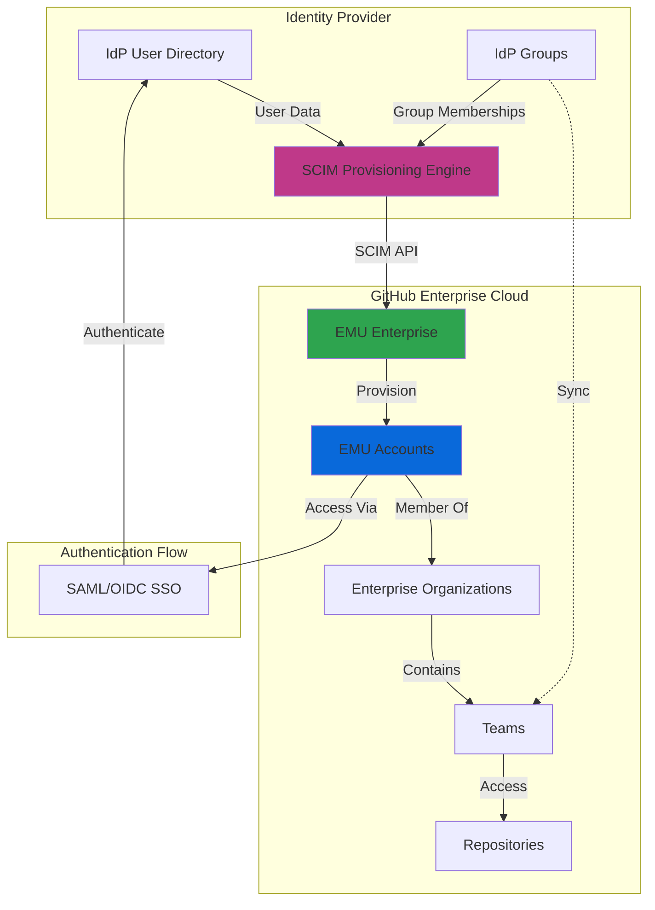
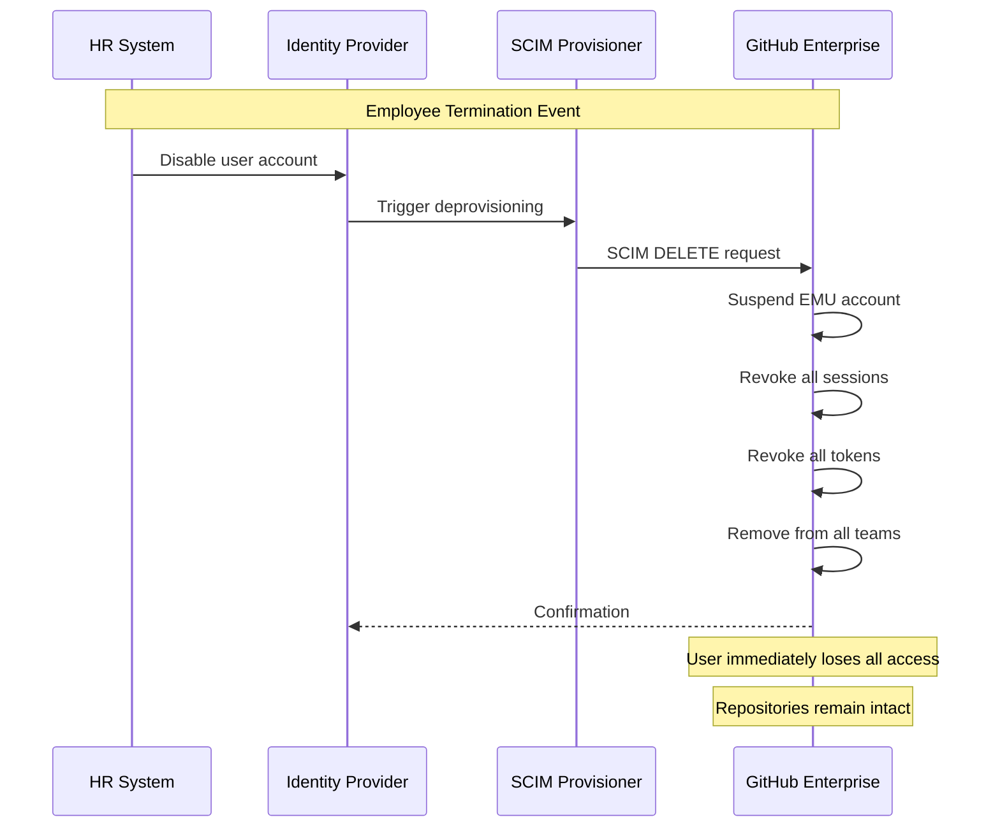
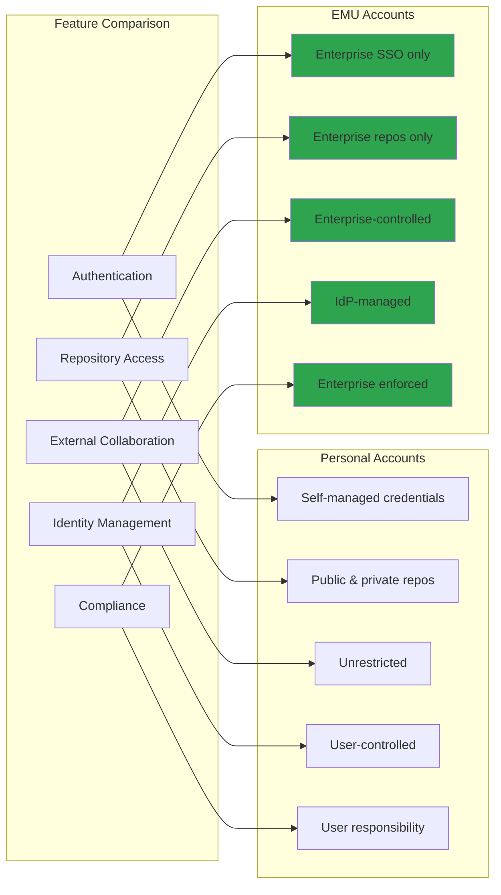
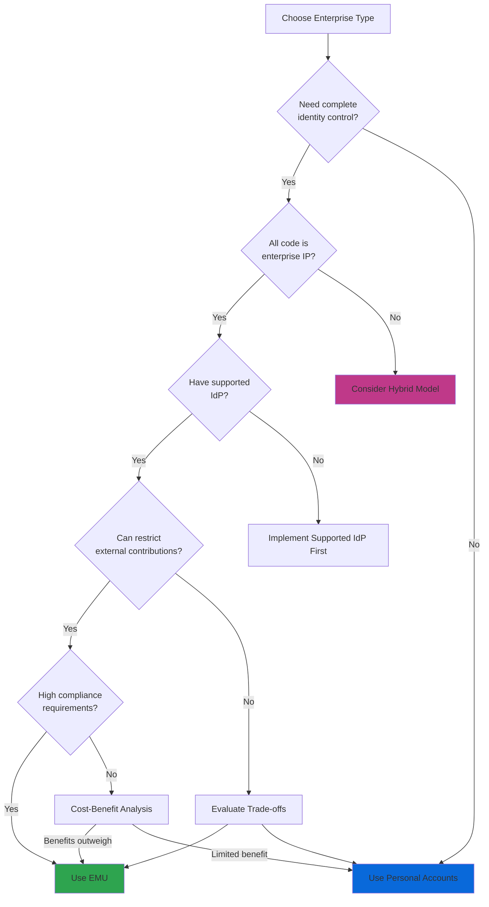
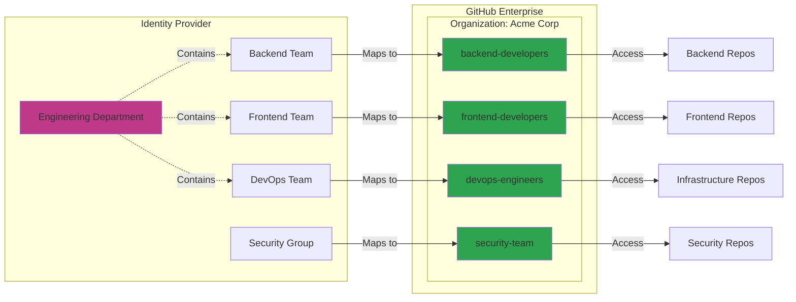
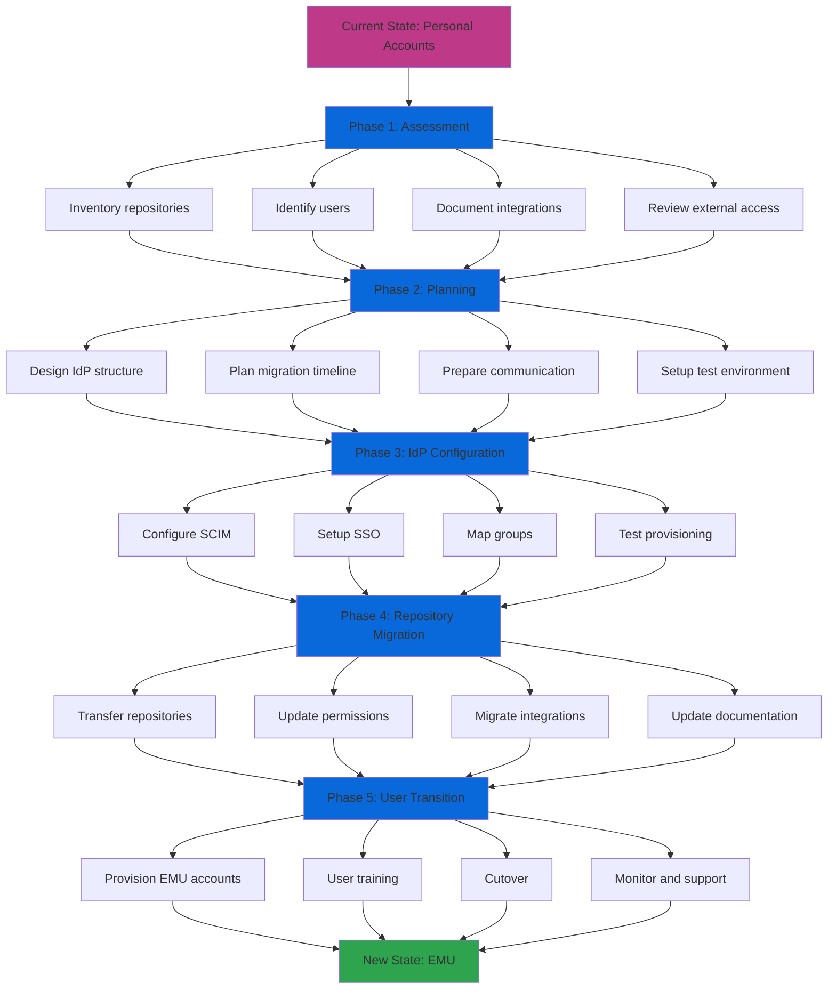
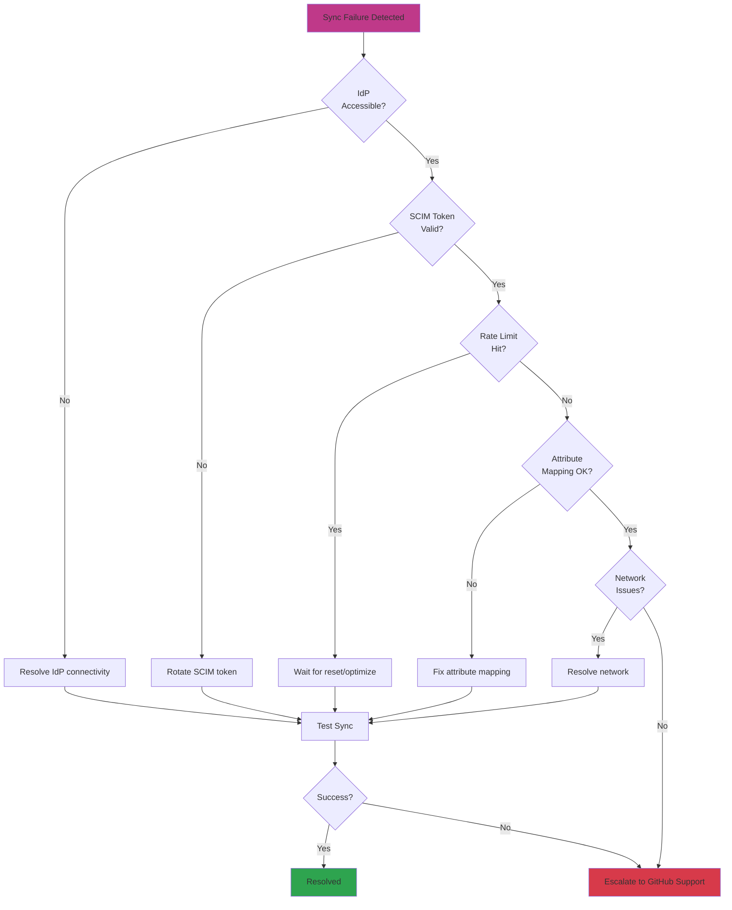

# Enterprise Managed Users (EMU)

## Overview

Enterprise Managed Users (EMU) represents GitHub's most secure and enterprise-grade identity management solution, providing organizations with complete control over the entire user lifecycle through direct integration with corporate Identity Providers (IdP). EMU fundamentally transforms how enterprises manage GitHub access by treating user accounts as managed resources provisioned and controlled by the organization rather than independently owned personal accounts.

## What are Enterprise Managed Users?

Enterprise Managed Users are GitHub user accounts that are fully owned, provisioned, and managed by an enterprise through an external Identity Provider. Unlike traditional personal GitHub accounts where users maintain independent control, EMU accounts are:

- **Provisioned automatically** via SCIM (System for Cross-domain Identity Management)
- **Synchronized continuously** with your corporate identity provider
- **Controlled centrally** by enterprise administrators
- **Identified distinctly** with an `_shortcode` suffix (e.g., `octocat_acme`)
- **Lifecycle-managed** from provisioning through deprovisioning

### EMU Architecture



### How EMU Differs from Personal Accounts

| Aspect | Personal Accounts | Enterprise Managed Users |
|--------|------------------|--------------------------|
| **Account Ownership** | User-owned | Enterprise-owned |
| **Provisioning** | Self-registration | IdP-provisioned via SCIM |
| **Authentication** | Username/password + 2FA | Enterprise SSO (SAML/OIDC) |
| **Username Format** | user choice | `username_shortcode` |
| **Email Domain** | Any email | Enterprise domain only |
| **Password Management** | User-controlled | IdP-controlled |
| **Account Recovery** | Self-service | Enterprise IT |
| **External Collaboration** | Full access | Enterprise-only (by default) |
| **Public Contributions** | Unrestricted | Restricted to enterprise repos |
| **Profile Customization** | Full control | Limited/managed |

## EMU Value Proposition

### 1. Centralized Identity Control

EMU provides a **single source of truth** for user identity, eliminating the disconnect between corporate identity systems and GitHub access:

- **Automatic provisioning**: New employees receive GitHub access as part of standard onboarding
- **Real-time synchronization**: Changes in IdP instantly reflect in GitHub
- **Group-based access**: IdP groups automatically map to GitHub teams
- **Consistent identity**: Same credentials across all enterprise systems

### 2. Enhanced Security Posture

EMU dramatically reduces security risks through enterprise-grade controls:

**Identity Hardening:**
- Enforced SSO authentication (SAML 2.0 or OIDC)
- No local passwords or 2FA to manage
- Impossible for users to create backdoor access
- IdP MFA policies automatically enforced

**Access Control:**
- Conditional access policies from IdP
- IP allowlist enforcement at enterprise level
- Session duration controls
- Device compliance requirements

**Attack Surface Reduction:**
- No personal access tokens by default
- SSH keys managed centrally
- OAuth app restrictions
- GitHub App policies enforced

### 3. Simplified Offboarding

One of EMU's most powerful features is **instant access revocation**:



**Offboarding Benefits:**
- Instant access termination (seconds, not hours/days)
- Automatic removal from all repositories and teams
- All sessions and tokens immediately revoked
- No orphaned accounts or lingering access
- Complete audit trail of access removal
- Repositories and contributions preserved

### 4. Compliance Benefits

EMU supports rigorous compliance requirements:

**Audit and Reporting:**
- Complete user lifecycle audit trail
- Identity verification for compliance (SOC2, ISO 27001)
- Centralized access reviews
- Automated compliance reporting

**Data Governance:**
- Enterprise owns all code and data
- No personal account mixing
- Clear data residency
- Simplified GDPR/privacy compliance

**Regulatory Requirements:**
- Federal/government compliance (FedRAMP)
- Financial services regulations (SOX, FINRA)
- Healthcare standards (HIPAA)
- Industry-specific mandates

### 5. Namespace Isolation

EMU provides **complete namespace separation**:

- Managed users cannot interact with personal GitHub accounts by default
- Enterprise code remains within enterprise boundaries
- Reduced risk of accidental public exposure
- Clear separation between work and personal contributions
- Protection against shadow IT

### 6. Policy Enforcement

Enterprise policies apply uniformly across all managed users:

- **Repository policies**: Visibility, creation, deletion, forking
- **Security policies**: Secret scanning, dependency reviews, code scanning
- **Compliance policies**: Required workflows, branch protection
- **Collaboration policies**: Outside collaborator restrictions
- **Content policies**: Prohibited content scanning

### 7. IP Allow Lists

EMU enables network-level access control:

```yaml
# Enterprise IP Allow List Configuration
Allowed IP Ranges:
  - Corporate VPN: 203.0.113.0/24
  - Office Networks: 198.51.100.0/24
  - Cloud Infrastructure: 192.0.2.0/24
  - Trusted Partners: 198.51.100.128/25

Enforcement:
  - Web UI Access: Enforced
  - Git Operations: Enforced
  - API Calls: Enforced
  - GitHub Actions: Configurable
```

**IP Allowlist Capabilities:**
- Restrict access to known networks
- Prevent access from unauthorized locations
- Support for GitHub Actions with IP ranges
- Configuration at enterprise level
- Automatic application to all managed users

### 8. Reduced Attack Surface

EMU minimizes security exposure through architectural constraints:

- Cannot create personal access tokens (unless specifically allowed)
- Cannot configure OAuth apps without approval
- Cannot participate in public GitHub community by default
- Cannot fork enterprise repositories to personal accounts
- Cannot invite external collaborators without enterprise settings
- Cannot change profile information arbitrarily

## EMU vs Personal Accounts: Detailed Comparison



### Feature-by-Feature Comparison Matrix

| Feature Category | Personal Accounts | EMU Accounts | Best For |
|------------------|-------------------|--------------|----------|
| **Authentication & Identity** |
| Login Method | Username/password, SSO, or keys | Enterprise SSO only | EMU for security |
| Password Management | User-managed | IdP-managed | EMU for centralization |
| MFA Enforcement | User choice (unless org requires) | IdP policy enforced | EMU for compliance |
| Account Recovery | Self-service or support | Enterprise IT only | EMU for control |
| Username Format | Flexible | `username_shortcode` | Personal for flexibility |
| Email Addresses | Any email domain | Enterprise domain | EMU for validation |
| **Repository Access** |
| Public Repos | Full read/write access | Read-only (no contributions) | Personal for OSS |
| Private Personal Repos | Unlimited | Not available | Personal for personal work |
| Enterprise Repos | Via invitation | Default access | EMU for enterprise |
| Forking | To personal or org | Within enterprise only | Personal for flexibility |
| External Contributions | Unrestricted | Blocked by default | Personal for OSS work |
| **Collaboration** |
| Outside Collaborators | Can invite freely | Enterprise policy controlled | EMU for governance |
| External Teams | Can participate | Enterprise only | Personal for OSS |
| Gists | Public/secret | Private to enterprise | Personal for sharing |
| GitHub Pages | Public hosting | Enterprise-approved only | Personal for portfolio |
| GitHub Marketplace | Full access | Restricted access | Personal for tools |
| **Security & Compliance** |
| Access Tokens | User-generated | Centrally managed | EMU for security |
| SSH Keys | User-managed | Policy-controlled | EMU for control |
| GPG Keys | User-managed | Policy-controlled | EMU for compliance |
| OAuth Apps | User-approved | Enterprise-approved | EMU for governance |
| GitHub Apps | User-installed | Enterprise-controlled | EMU for security |
| Audit Logging | Limited | Comprehensive enterprise logs | EMU for compliance |
| IP Restrictions | Org-level only | Enterprise-enforced | EMU for security |
| **Administration** |
| Account Lifecycle | User-managed | Automated via IdP | EMU for efficiency |
| Offboarding | Manual removal | Automatic suspension | EMU for security |
| Profile Updates | User-controlled | IdP-synchronized | EMU for accuracy |
| Team Membership | Manual management | IdP group sync | EMU for automation |
| Access Reviews | Manual process | IdP-integrated | EMU for compliance |
| **Use Case Fit** |
| Open Source Development | ✅ Excellent | ❌ Not supported | Personal |
| Enterprise Development | ⚠️ Manual management | ✅ Optimal | EMU |
| Contractors/Vendors | ✅ Guest access works | ⚠️ Requires planning | Personal or hybrid |
| Personal Projects | ✅ Native support | ❌ Not available | Personal |
| Highly Regulated Industries | ⚠️ Requires configuration | ✅ Purpose-built | EMU |
| Mixed Work/Personal | ✅ One account | ❌ Requires separate accounts | Personal |

### Decision Framework: When to Use EMU



## EMU Limitations and Considerations

While EMU provides significant advantages, it's crucial to understand its constraints:

### Technical Limitations

**1. Public Repository Restrictions**
- ❌ Cannot create public repositories outside enterprise
- ❌ Cannot contribute to public repositories (issues, PRs, comments)
- ❌ Cannot fork public repositories to personal account
- ❌ Cannot participate in GitHub Discussions publicly
- ⚠️ Read-only access to public repositories maintained

**2. External Collaboration Constraints**
- ❌ Cannot have personal repositories under managed account
- ❌ Cannot be added to non-enterprise organizations
- ❌ Cannot collaborate outside enterprise boundary (by default)
- ⚠️ Requires separate personal account for OSS contributions
- ⚠️ Complex process for external collaborators

**3. Account and Profile Limitations**
- ❌ Cannot change username (managed by IdP)
- ❌ Limited profile customization
- ❌ Cannot merge with existing personal account
- ❌ No GitHub achievements or contribution graph outside enterprise
- ⚠️ Username always includes `_shortcode` suffix

**4. Feature Access Restrictions**
- ❌ Cannot use GitHub Sponsors
- ❌ Cannot create or participate in public GitHub Pages (limited - see GitHub Pages limits)
- ❌ Cannot use personal access tokens (unless policy allows)
- ❌ Limited GitHub Marketplace access
- ❌ Cannot create gists or comment on gists
- ❌ Cannot create personalized profiles
- ❌ Do not have access to the GitHub Certifications program
- ❌ Cannot sign up for GitHub Copilot Pro or GitHub Copilot Free (requires enterprise Copilot Business/Enterprise license)
- ⚠️ GitHub Copilot coding agent is not available in personal repositories (requires GitHub-hosted runners)

**5. GitHub Actions Limitations**
- ❌ Cannot create workflow templates for GitHub Actions
- ❌ GitHub-hosted runners are not available for repositories owned by managed user accounts
- ⚠️ Can trigger workflows in organizations where they are not members by forking and creating PRs

**6. GitHub Codespaces Restrictions (GitHub.com)**
- ✅ Can create codespaces for organization repositories (if organization pays for Codespaces)
- ❌ Cannot create codespaces for personal repositories
- ❌ Cannot create codespaces for repositories outside their organizations
- ❌ Cannot use GitHub's public templates for Codespaces
- ❌ Cannot publish a codespace created from a template to a new repository

### Operational Considerations

**1. Identity Provider Dependency**
- ⚠️ Critical dependency on IdP availability
- ⚠️ IdP outages block all GitHub access
- ⚠️ IdP misconfigurations can cause mass access issues
- ⚠️ SCIM sync delays affect user experience

**2. Migration Complexity**
```yaml
Migration Challenges:
  - Repository History: Must be migrated carefully
  - Git History: Author attribution changes
  - External References: May break links
  - OAuth/Apps: Require reconfiguration
  - Integrations: Need reconnection
  - Training: Users need adaptation time
  - Dual Accounts: Personal + EMU workflow complexity
```

**3. Contractor and Vendor Access**

Managing external contributors requires careful planning:

**Option A: Guest Collaborators**
- Create EMU accounts in IdP for vendors
- Requires IdP user management
- Full audit trail
- Can be time-consuming

**Option B: OAuth App Access**
- Configure GitHub App for specific access
- More limited permissions
- Easier to provision
- Less integrated

**Option C: Hybrid Approach**
- Maintain separate personal account enterprise
- Invite as outside collaborators
- More complex management
- Better for temporary access

**4. Developer Experience Impact**
- Requires two GitHub accounts (personal + EMU) for developers who contribute to OSS
- Context switching between accounts
- Separate Git configurations
- SSH key management complexity
- Browser profile separation needed

### Organizational Considerations

**1. Change Management**
- Significant workflow changes for users
- Training requirements
- Potential resistance from developers
- Communication planning essential

**2. Cost Implications**
- EMU requires GitHub Enterprise Cloud
- Per-seat licensing model
- IdP integration costs
- Potential consulting/implementation costs

**3. Compliance vs. Flexibility Trade-off**
- Maximum security and control
- Reduced developer flexibility
- Potential productivity impact
- Cultural fit assessment needed

## Supported Identity Providers

EMU integrates with enterprise-grade identity providers using standard protocols:

### Officially Supported IdPs

| Identity Provider | SAML 2.0 | OIDC | SCIM 2.0 | Notes |
|-------------------|----------|------|----------|-------|
| **Microsoft Entra ID** (Azure AD) | ✅ | ✅ | ✅ | Recommended, best integration |
| **Okta** | ✅ | ❌ | ✅ | SAML-only (OIDC not supported) |
| **PingFederate** | ✅ | ❌ | ✅ | SAML-only |
| **Other IdPs** | ✅ | - | ✅ | Via REST API, SAML 2.0 required |

### Protocol Comparison: OIDC vs SAML


**OIDC Advantages:**
- Modern protocol built on OAuth 2.0
- JSON Web Tokens (JWT) - easier to debug
- Better mobile/API support
- Standardized discovery endpoints
- Refresh token support

**SAML Advantages:**
- Mature, widely deployed
- Extensive enterprise support
- Rich attribute mapping
- Strong enterprise adoption

### SCIM Provisioning Requirements

All EMU implementations require SCIM 2.0 for user lifecycle management:

```yaml
SCIM Operations:
  Required:
    - Create User (POST /Users)
    - Update User (PATCH /Users/{id})
    - Delete User (DELETE /Users/{id})
    - Get User (GET /Users/{id})
    - List Users (GET /Users)
    - Create Group (POST /Groups)
    - Update Group (PATCH /Groups/{id})
    - Get Group (GET /Groups/{id})
    - List Groups (GET /Groups)
  
  Attributes Synchronized:
    - userName (required)
    - name.givenName
    - name.familyName
    - emails (required)
    - active (required)
    - groups (required)
    - roles
```

### IdP Setup Requirements

**Prerequisites for all IdPs:**
1. Enterprise license for GitHub
2. IdP admin access
3. SCIM provisioning capability
4. SSO (SAML or OIDC) capability
5. User group management
6. Custom attribute support

**Microsoft Entra ID Specific:**
- Azure AD Premium P1/P2 or Microsoft 365 Business
- Enterprise Application registration
- App roles configuration
- Group-based assignment
- Conditional access policies (optional)

**Okta Specific:**
- Okta Workforce Identity
- SCIM provisioning enabled
- App integration from catalog
- Group push configuration
- Custom attribute mapping

## EMU Configuration Best Practices

### IdP Group Mapping Strategy



**Best Practices for Group Mapping:**

1. **Use Hierarchical Structure**
   ```yaml
   IdP Group Hierarchy:
     - company-all (root)
       - engineering
         - engineering-backend
         - engineering-frontend
         - engineering-devops
       - product
       - security
   
   GitHub Team Structure:
     - Organization: acme-corp
       - Team: engineering (parent)
         - backend-team (child)
         - frontend-team (child)
         - devops-team (child)
       - Team: product-team
       - Team: security-team
   ```

2. **Naming Conventions**
   - **IdP Groups**: Use descriptive, hierarchical names (`eng-backend-services`)
   - **GitHub Teams**: Mirror IdP structure (`backend-services`)
   - **Consistency**: Maintain parallel naming across systems
   - **Prefixes**: Consider role prefixes (`role-admin-`, `team-`, `project-`)

3. **Role-Based Access Control (RBAC)**
   ```yaml
   Access Pattern Examples:
     
     Repository Access:
       - Group: "github-repo-myapp-read"
         Team: "myapp-readers"
         Permission: Read
       
       - Group: "github-repo-myapp-write"
         Team: "myapp-developers"
         Permission: Write
       
       - Group: "github-repo-myapp-admin"
         Team: "myapp-maintainers"
         Permission: Admin
     
     Organization Roles:
       - Group: "github-org-owner"
         Role: Organization Owner
       
       - Group: "github-org-billing"
         Role: Billing Manager
       
       - Group: "github-enterprise-admin"
         Role: Enterprise Owner
   ```

4. **Dynamic vs Static Groups**
   - **Dynamic Groups**: Based on user attributes (department, location, role)
   - **Static Groups**: Manually managed membership
   - **Recommendation**: Prefer dynamic for scalability

5. **Group Sync Configuration**
   ```yaml
   Sync Settings:
     Frequency: Real-time (event-driven) or scheduled
     Conflict Resolution: IdP is source of truth
     Orphaned Teams: Preserve or remove based on policy
     Audit Logging: Enable comprehensive logging
     Error Notifications: Alert on sync failures
   ```

### Team Synchronization Architecture

**Sync Flow:**
1. User added to IdP group
2. IdP triggers SCIM notification
3. GitHub receives group membership update
4. User automatically added to GitHub team
5. User inherits team repository permissions
6. Audit log records change

**Sync Failure Handling:**
```yaml
Common Sync Issues:
  - API Rate Limits: Implement backoff strategy
  - Network Failures: Retry with exponential backoff
  - Invalid Mappings: Alert and require manual fix
  - Permission Conflicts: Log and escalate
  - Orphaned Users: Define retention policy
```

### RBAC Implementation Patterns

**Pattern 1: Repository-Centric**
```yaml
Structure:
  For each repository:
    - {repo}-read (team with read)
    - {repo}-write (team with write)
    - {repo}-admin (team with admin)

Pros:
  - Granular control per repository
  - Clear permission boundaries
  - Easy to audit

Cons:
  - Team proliferation
  - Complex management at scale
  - Higher IdP group count
```

**Pattern 2: Role-Centric**
```yaml
Structure:
  Global roles:
    - developers (write to most repos)
    - senior-developers (admin to most repos)
    - viewers (read to all repos)
    - security (admin to security repos)

Pros:
  - Fewer teams to manage
  - Simpler mental model
  - Scalable

Cons:
  - Less granular
  - Potential over-permissioning
  - Requires careful planning
```

**Pattern 3: Hybrid**
```yaml
Structure:
  - Base roles for common access
  - Specific teams for sensitive repos
  - Project-based teams for initiatives
  - Service account teams for automation

Recommended:
  This approach balances flexibility and control
```

### Naming Conventions

**Usernames:**
- Format: `{idp_username}_{enterprise_shortcode}`
- Example: `jsmith_acme`, `agarcia_acme`
- Cannot be changed after creation
- Must be unique across GitHub

**Email Addresses:**
- Must match enterprise verified domains
- Primary email from IdP is used
- Secondary emails can be added via IdP
- Email changes sync from IdP

**Team Names:**
- Use kebab-case: `backend-services`, `frontend-web`
- Mirror IdP group names where possible
- Include organization prefix for large enterprises
- Avoid abbreviations that aren't clear

**Organization Names:**
- Use descriptive names: `acme-corp`, `acme-engineering`
- Consider department or business unit structure
- Plan for growth and organizational changes

### Contractors and External Collaborators

**Strategy 1: IdP Guest Accounts**
```yaml
Approach:
  - Create guest accounts in IdP
  - Assign to specific groups
  - Provision as EMU accounts
  - Limit access scope

Pros:
  - Full audit trail
  - Centralized management
  - Consistent access control
  - Easy offboarding

Cons:
  - IdP guest license costs
  - Administrative overhead
  - Onboarding delays

Best For:
  - Long-term contractors
  - Strategic partners
  - Frequent collaborators
```

**Strategy 2: Repository Collaborators (EMU Terminology)**

> **Important:** In Enterprise Managed Users environments, the outside collaborator role is called "**repository collaborator**". A repository collaborator must be part of your enterprise, with a managed user account provisioned from your identity provider.

```yaml
Approach:
  - Provision managed user accounts for external collaborators via IdP
  - Grant repository-specific access
  - Collaborators are subject to enterprise IP allow list and IdP conditional access
  - Not subject to organization IP allow list

Key Differences from Personal Account Enterprises:
  - Cannot enforce 2FA (handled by IdP for EMU)
  - Cannot bypass SSO requirements (SSO managed at enterprise level)
  - If user doesn't consume a license, they will after repository access is granted

Pros:
  - Full enterprise audit trail
  - IdP-managed lifecycle
  - Consistent security controls
  - Enterprise policy compliance

Cons:
  - Requires IdP provisioning
  - Consumes enterprise license
  - More complex onboarding
  - IdP management overhead

Best For:
  - Long-term contractors needing enterprise integration
  - Vendors requiring audited access
  - Partners with formal relationships
```

**Strategy 3: Separate Organization**
```yaml
Approach:
  - Create separate GitHub organization
  - Use personal accounts
  - Share specific repositories
  - Maintain boundary

Pros:
  - Clear separation
  - Flexible collaboration
  - No EMU constraints

Cons:
  - Additional organization to manage
  - Repository duplication or syncing
  - Complex access patterns

Best For:
  - External partnerships
  - Multi-company projects
  - Mixed collaboration models
```

**Recommendation Matrix:**

| Duration | Trust Level | Access Scope | Recommended Strategy |
|----------|-------------|--------------|----------------------|
| < 1 month | Low | Single repo | Outside Collaborator |
| 1-6 months | Medium | Multiple repos | Outside Collaborator or IdP Guest |
| 6+ months | High | Organization-wide | IdP Guest Account |
| Ongoing | High | Enterprise-wide | IdP Guest Account |
| Partner | Varies | Specific projects | Separate Organization |

## EMU Migration Strategies

### Migration from Personal Accounts to EMU

Migrating from personal accounts to EMU is a **one-way, irreversible** transition that requires careful planning:



### Phase 1: Assessment (2-4 weeks)

**Repository Inventory:**
```bash
# Gather critical information
- Total repository count
- Repository ownership and access patterns
- Repository visibility (public/private/internal)
- Repository size and activity
- Branch protection rules
- CODEOWNERS files
- GitHub Actions workflows
- Secrets and variables
- Deploy keys
- Webhooks
```

**User Analysis:**
```yaml
User Categories:
  - Full-time employees: Migrate to EMU
  - Contractors: Decide on strategy
  - External collaborators: Outside collaborator approach
  - Service accounts: Bot/service account strategy
  - Departed users: Archive or remove

Questions to Answer:
  - How many active users?
  - What are their roles?
  - Who needs OSS access?
  - What IdP groups exist?
  - Current authentication methods?
```

**Integration Audit:**
```yaml
Integrations to Review:
  - GitHub Apps (installed)
  - OAuth Apps (authorized)
  - Personal Access Tokens (in use)
  - Deploy keys (configured)
  - Webhooks (active)
  - CI/CD systems
  - Project management tools
  - Security scanning tools
  - Monitoring systems
```

### Phase 2: Planning (2-4 weeks)

**IdP Structure Design:**
```yaml
Group Design:
  - Organization membership groups
  - Team membership groups
  - Role-based access groups
  - Repository access groups
  - Admin/special access groups

Naming Standards:
  - Prefix conventions
  - Hierarchy structure
  - Attribute mapping
  - Shortcode selection
```

**Migration Timeline:**
```yaml
Recommended Approach:
  Week 1-2: Assessment complete
  Week 3-4: Planning and design
  Week 5-6: IdP configuration
  Week 7-8: Test environment setup
  Week 9-10: Pilot with small team
  Week 11-12: Phased rollout begins
  Week 13-16: Full migration
  Week 17+: Hypercare and optimization

Critical Path Items:
  - IdP configuration (blocking)
  - SCIM setup (blocking)
  - EMU enterprise creation (blocking)
  - User communication (parallel)
  - Repository transfer (phased)
```

**Communication Plan:**
```yaml
Stakeholders:
  - Executive leadership: Business case, timeline
  - Engineering leadership: Technical impact, benefits
  - Developers: Workflow changes, training
  - IT/Security: IdP integration, support
  - External partners: Access changes

Key Messages:
  - Why EMU? (security, compliance, efficiency)
  - What changes? (authentication, workflows)
  - When? (timeline and milestones)
  - How to prepare? (action items)
  - Support available? (resources, contacts)
```

### Phase 3: IdP Configuration (2-3 weeks)

**SCIM Configuration:**
```yaml
Steps:
  1. Create enterprise application in IdP
  2. Configure SCIM endpoint
  3. Set SCIM bearer token
  4. Map attributes:
     - userName → username
     - name.givenName → first name
     - name.familyName → last name
     - emails[primary] → email
     - active → account status
  5. Test provisioning with test users
  6. Verify deprovisioning works
  7. Configure group sync
```

**SSO Configuration:**
```yaml
SAML/OIDC Setup:
  1. Configure SSO in IdP
  2. Set GitHub as service provider
  3. Configure attribute mapping
  4. Set up claim/attribute assertions
  5. Test SSO flow
  6. Enable MFA enforcement
  7. Configure conditional access (if applicable)
  8. Document recovery procedures
```

**Group Mapping:**
```yaml
Implementation:
  1. Create GitHub teams structure
  2. Create corresponding IdP groups
  3. Configure group sync
  4. Test membership changes
  5. Verify permission inheritance
  6. Document mapping
```

### Phase 4: Repository Migration (4-6 weeks)

**Transfer Process:**
```bash
# Option 1: Repository Transfer (Recommended)
# Preserves all history, issues, PRs, settings
1. Transfer repository to EMU organization
2. Update repository permissions
3. Update branch protection rules
4. Verify GitHub Actions workflows
5. Update documentation

# Option 2: Fresh Import
# Use when restructuring or cleaning
1. Create new repository in EMU org
2. Push code from old repository
3. Migrate issues (via API or tools)
4. Recreate branch protections
5. Reconfigure settings
```

**Post-Transfer Checklist:**
```yaml
For Each Repository:
  - Verify all branches transferred
  - Check branch protection rules
  - Validate GitHub Actions workflows
  - Test deploy keys/secrets
  - Update CODEOWNERS
  - Verify webhooks
  - Test CI/CD pipelines
  - Update external references
  - Communicate new URL to team
```

### Phase 5: User Transition (2-4 weeks)

**EMU Account Provisioning:**
```yaml
Provisioning Process:
  1. Assign users to IdP groups
  2. SCIM provisions EMU accounts
  3. Users receive welcome email
  4. Users perform first SSO login
  5. Verify team memberships
  6. Grant additional permissions as needed
  7. Provide training materials
```

**User Training:**
```yaml
Training Topics:
  - SSO login process
  - Username format change
  - Two-account strategy (EMU + personal)
  - Git configuration updates
  - SSH key management
  - Personal vs. work separation
  - Troubleshooting common issues
  - Where to get help

Delivery Methods:
  - Live training sessions
  - Recorded videos
  - Written documentation
  - Office hours
  - Slack/Teams channel
```

**Cutover:**
```yaml
Phased Approach (Recommended):
  Phase A: Pilot team (1 week)
    - Select small, representative team
    - Provision EMU accounts
    - Monitor closely
    - Gather feedback
    - Adjust as needed
  
  Phase B: Early adopters (2 weeks)
    - Expand to volunteers
    - Multiple teams
    - Continue monitoring
    - Refine processes
  
  Phase C: General availability (4-6 weeks)
    - Department by department
    - Or project by project
    - Continue support
  
  Phase D: Completion
    - Final stragglers
    - Archive old accounts
    - Complete documentation
```

### Change Management Best Practices

**Before Migration:**
- Secure executive sponsorship
- Build cross-functional team (IT, Security, Engineering)
- Document current state thoroughly
- Create rollback plan (though limited with EMU)
- Set up helpdesk/support processes

**During Migration:**
- Communicate frequently and transparently
- Provide multiple support channels
- Monitor metrics (adoption, issues, satisfaction)
- Be flexible and responsive to feedback
- Celebrate milestones

**After Migration:**
- Conduct retrospective
- Document lessons learned
- Optimize IdP group structure
- Review and update policies
- Plan continuous improvement

### Common Migration Challenges

| Challenge | Impact | Mitigation |
|-----------|--------|------------|
| Developer resistance | Slow adoption | Clear communication, executive support, show benefits |
| OSS contribution workflow | Productivity | Document dual-account workflow, provide tooling |
| Integration breakage | Service disruption | Thorough testing, phased rollout, quick support |
| IdP sync issues | Access problems | Robust monitoring, clear escalation, IdP expertise |
| External collaborator access | Project delays | Plan external access strategy early |
| Git configuration | User frustration | Provide scripts, clear documentation, office hours |
| Repository URL changes | Broken links | Update documentation, use redirects where possible |
| Loss of contribution history | Morale | Explain limitations, acknowledge contributions |

## EMU Operational Excellence

### Monitoring and Observability

**Key Metrics to Track:**

```yaml
Health Metrics:
  - SSO success rate
  - SSO latency
  - SCIM sync success rate
  - SCIM sync duration
  - User provisioning time
  - Deprovisioning time
  - Group sync accuracy

Usage Metrics:
  - Active user count
  - Login frequency
  - Failed login attempts
  - Team membership changes
  - Repository access patterns
  - API rate limit consumption

Security Metrics:
  - Unauthorized access attempts
  - Policy violations
  - IP allowlist hits/blocks
  - Token usage patterns
  - Privilege escalation events
```

**Monitoring Tools:**
```yaml
GitHub:
  - Audit log streaming
  - GitHub Advanced Security alerts
  - GitHub Actions usage metrics
  - API rate limit monitoring

IdP:
  - Provisioning logs
  - Authentication logs
  - Group membership changes
  - Error rates

SIEM Integration:
  - Stream audit logs to SIEM
  - Create correlation rules
  - Set up alerting
  - Build dashboards
```

**Alerting Strategy:**
```yaml
Critical Alerts (Immediate Response):
  - SCIM provisioning failures (> 5 in 10 min)
  - SSO complete outage
  - Mass deprovisioning events (> 10 users)
  - Enterprise owner changes
  - Security policy modifications

Warning Alerts (Review Within Hours):
  - SCIM sync delays (> 5 minutes)
  - SSO elevated error rates (> 5%)
  - Unusual access patterns
  - Failed privilege escalation attempts
  - API rate limit approaching

Info Alerts (Daily Review):
  - User provisioning stats
  - Team membership changes
  - Repository creation/deletion
  - External collaborator invitations
```

### Troubleshooting Guide

**Issue: User Cannot Log In**
```yaml
Symptoms:
  - SSO fails
  - User gets access denied
  - Redirect loop

Troubleshooting Steps:
  1. Verify user exists in IdP
  2. Check IdP account is active
  3. Verify user assigned to GitHub app in IdP
  4. Check SCIM provisioning status
  5. Verify EMU account exists in GitHub
  6. Check EMU account is not suspended
  7. Review IdP authentication logs
  8. Review GitHub audit logs
  9. Test SSO configuration with test user
  10. Check IP allowlist if configured

Common Causes:
  - User not assigned to IdP app
  - SCIM provisioning failed
  - Account suspended
  - IP allowlist blocking
  - IdP configuration issue
  - SSO certificate expired
```

**Issue: SCIM Sync Failures**
```yaml
Symptoms:
  - Users not provisioned
  - Group membership not syncing
  - User updates not reflecting

Troubleshooting Steps:
  1. Check SCIM endpoint accessibility
  2. Verify SCIM token validity
  3. Review IdP provisioning logs
  4. Check GitHub API rate limits
  5. Verify IdP group mappings
  6. Test SCIM provisioning manually
  7. Check network connectivity
  8. Review error messages in IdP

Common Causes:
  - Expired SCIM token
  - Network connectivity issues
  - Rate limit exceeded
  - Invalid attribute mapping
  - IdP service disruption
  - Malformed SCIM requests
```

**Issue: Incorrect Team Memberships**
```yaml
Symptoms:
  - User in wrong teams
  - Missing team access
  - Unexpected access

Troubleshooting Steps:
  1. Verify user's IdP group memberships
  2. Check IdP-to-GitHub group mapping
  3. Review SCIM group sync logs
  4. Manually trigger group sync
  5. Check for nested group issues
  6. Review team sync configuration
  7. Verify team slug matches mapping

Common Causes:
  - Incorrect IdP group membership
  - Mapping configuration error
  - Sync delay
  - Nested group not supported
  - Team renamed in GitHub
```

**Issue: IdP Outage Impact**
```yaml
Impact:
  - No new SSO logins possible
  - Existing sessions continue to work
  - No new user provisioning
  - No group sync updates

Mitigation:
  - Existing Git credentials still work (SSH keys, tokens)
  - Active browser sessions remain valid
  - GitHub Actions continue to run
  - Service accounts unaffected
  
Recovery:
  1. Wait for IdP restoration
  2. Verify SSO working
  3. Trigger SCIM sync if needed
  4. Check for sync backlog
  5. Verify critical users have access
  6. Communicate status to users
```

### IdP Sync Failure Resolution



### Audit Log Analysis

**Critical Events to Monitor:**

```yaml
Authentication Events:
  - org.sso_response (SSO logins)
  - user.failed_login (failed attempts)
  - user.suspend (account suspensions)
  - user.unsuspend (account reactivations)

Provisioning Events:
  - user.create (SCIM user creation)
  - user.remove (SCIM user deletion)
  - team.add_member (team additions)
  - team.remove_member (team removals)

Administrative Events:
  - org.update_member (permission changes)
  - org.add_member (new members)
  - org.remove_member (member removal)
  - enterprise.config.update (config changes)

Security Events:
  - repo.access (repository access)
  - repo.download_zip (bulk downloads)
  - git.clone (repository clones)
  - org.oauth_app.* (OAuth app events)
  - personal_access_token.* (PAT events)
```

**Sample Audit Log Queries:**

```bash
# Failed SSO attempts in last hour
action:org.sso_response result:failure created:>=$(date -u -d '1 hour ago' +%Y-%m-%dT%H:%M:%SZ)

# Mass deprovisioning events
action:user.remove created:>=$(date -u -d '24 hours ago' +%Y-%m-%dT%H:%M:%SZ) | count

# Privilege escalation to owner
action:org.update_member permission:admin

# External IP access attempts (if IP allowlist enabled)
action:org.sso_response blocked:true

# Token creation outside IdP
action:personal_access_token.create
```

**Audit Log Streaming Setup:**
```yaml
Destinations:
  - Splunk
  - Azure Sentinel
  - AWS Security Lake
  - Google Chronicle
  - Datadog

Benefits:
  - Real-time alerting
  - Long-term retention
  - Advanced analytics
  - Compliance reporting
  - Incident response
```

### Operational Runbooks

**Runbook: Emergency User Access**
```yaml
Scenario: Executive needs immediate access during IdP outage

NOT POSSIBLE with EMU:
  - Cannot bypass SSO
  - Cannot create local credentials
  - Cannot manually provision

Alternatives:
  - Use existing session if active
  - Use GitHub CLI with existing token
  - Use SSH key for Git operations
  - Wait for IdP restoration
  
Prevention:
  - High IdP availability SLA
  - IdP failover/redundancy
  - Service account strategy
  - GitHub Actions for automation
```

**Runbook: Bulk User Offboarding**
```yaml
Scenario: Department closure, mass layoff

Steps:
  1. Identify users in IdP
  2. Remove from IdP groups (or disable accounts)
  3. SCIM automatically:
     - Suspends EMU accounts
     - Revokes sessions
     - Removes team memberships
  4. Verify deprovisioning in GitHub
  5. Review repository ownership
  6. Transfer repository ownership if needed
  7. Document for compliance

Timeline:
  - User removed from IdP: Immediate
  - SCIM deprovisioning: < 5 minutes
  - All access revoked: < 10 minutes
```

**Runbook: Repository Access Emergency**
```yaml
Scenario: Critical repository needs immediate access for incident response

Steps:
  1. Identify user needing access
  2. Add user to appropriate IdP group
  3. Wait for SCIM sync (< 5 min) or trigger manual sync
  4. Verify user in GitHub team
  5. Confirm repository access
  6. Document access grant in incident log
  7. Remove access post-incident if temporary

If IdP unavailable:
  1. Add as outside collaborator (if allowed by policy)
  2. Use service account
  3. Use existing team member
```

### Performance Optimization

**SCIM Sync Optimization:**
```yaml
Best Practices:
  - Use incremental sync instead of full sync
  - Schedule sync during off-peak hours
  - Batch operations where possible
  - Monitor and tune sync frequency
  - Use IdP change notifications (event-driven)

Typical Sync Times:
  - Single user: < 10 seconds
  - 100 users: < 2 minutes
  - 1000 users: < 20 minutes
  - Full sync (10,000 users): < 2 hours
```

**SSO Performance:**
```yaml
Optimization Tips:
  - Use OIDC for better performance
  - Minimize SAML assertion size
  - Optimize attribute mapping
  - Use IdP session caching
  - Monitor SSO latency
  - Implement IdP load balancing

Target Metrics:
  - SSO redirect: < 500ms
  - IdP authentication: < 2s
  - Assertion validation: < 500ms
  - Total SSO flow: < 5s
```

## References

### Official Documentation
- [About Enterprise Managed Users](https://docs.github.com/en/enterprise-cloud@latest/admin/identity-and-access-management/using-enterprise-managed-users-for-iam/about-enterprise-managed-users)
- [Choosing an Enterprise Type](https://docs.github.com/en/enterprise-cloud@latest/enterprise-onboarding/getting-started-with-your-enterprise/choose-an-enterprise-type)
- [Configuring SCIM for EMU](https://docs.github.com/en/enterprise-cloud@latest/admin/identity-and-access-management/using-enterprise-managed-users-and-saml-for-iam/configuring-scim-provisioning-for-enterprise-managed-users)
- [Abilities and Restrictions of Managed User Accounts](https://docs.github.com/en/enterprise-cloud@latest/admin/managing-iam/understanding-iam-for-enterprises/abilities-and-restrictions-of-managed-user-accounts)
- [Configuring SAML SSO for EMU](https://docs.github.com/en/enterprise-cloud@latest/admin/identity-and-access-management/using-enterprise-managed-users-and-saml-for-iam/configuring-saml-single-sign-on-for-enterprise-managed-users)
- [Configuring OIDC for EMU](https://docs.github.com/en/enterprise-cloud@latest/admin/identity-and-access-management/using-enterprise-managed-users-and-oidc-for-iam/configuring-oidc-for-enterprise-managed-users)

### Identity Provider Guides
- [Configuring Azure AD for EMU](https://docs.github.com/en/enterprise-cloud@latest/admin/identity-and-access-management/using-enterprise-managed-users-and-saml-for-iam/configuring-scim-provisioning-for-enterprise-managed-users-with-azure-active-directory)
- [Configuring Okta for EMU](https://docs.github.com/en/enterprise-cloud@latest/admin/identity-and-access-management/using-enterprise-managed-users-and-saml-for-iam/configuring-scim-provisioning-for-enterprise-managed-users-with-okta)
- [Configuring PingFederate for EMU](https://docs.github.com/en/enterprise-cloud@latest/admin/identity-and-access-management/using-enterprise-managed-users-and-saml-for-iam/configuring-scim-provisioning-for-enterprise-managed-users-with-pingfederate)

### Related Documentation
- [Identity and Access Management Guide](./03-identity-access-management.md)
- [Teams and Permissions](./02-teams-permissions.md)
- [Security and Compliance](./05-security-compliance.md)
- [GitHub Audit Logs](https://docs.github.com/en/organizations/keeping-your-organization-secure/managing-security-settings-for-your-organization/reviewing-the-audit-log-for-your-organization)
- [SCIM Specification (RFC 7644)](https://datatracker.ietf.org/doc/html/rfc7644)
- [SAML 2.0 Specification](http://docs.oasis-open.org/security/saml/Post2.0/sstc-saml-tech-overview-2.0.html)
- [OpenID Connect Core Specification](https://openid.net/specs/openid-connect-core-1_0.html)

### Additional Resources
- [GitHub Enterprise Blog: EMU Announcements](https://github.blog/tag/enterprise-managed-users/)
- [GitHub Skills: GitHub Administration](https://skills.github.com/)
- [GitHub Support: EMU Troubleshooting](https://support.github.com/)
- [GitHub Community Forum: EMU Discussions](https://github.community/)

---

*This document is part of the GitHub Administration Best Practices and Compliance Series (GitHub ABCs). For the complete series, see the [main documentation index](./README.md).*
