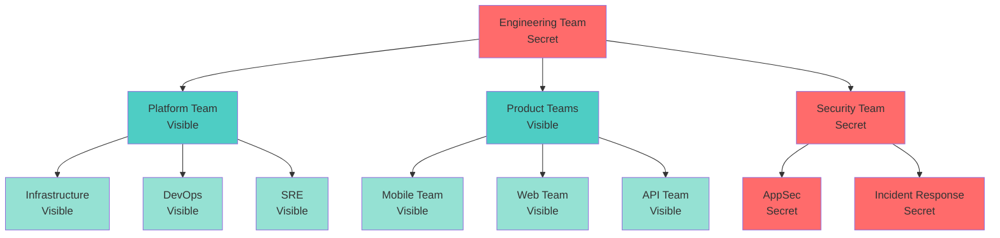
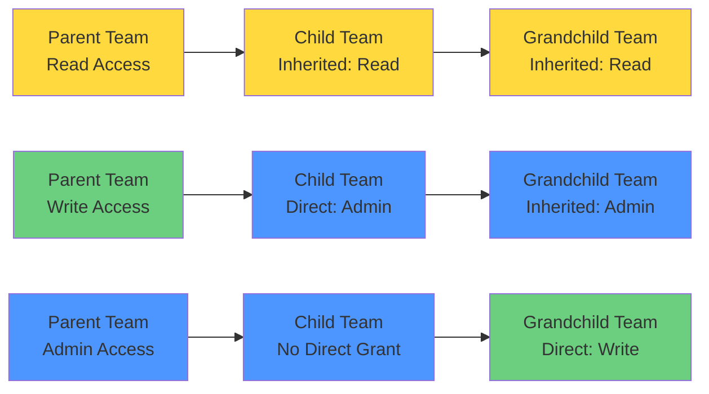
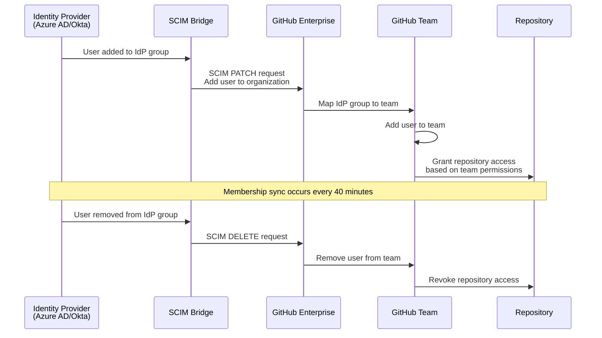
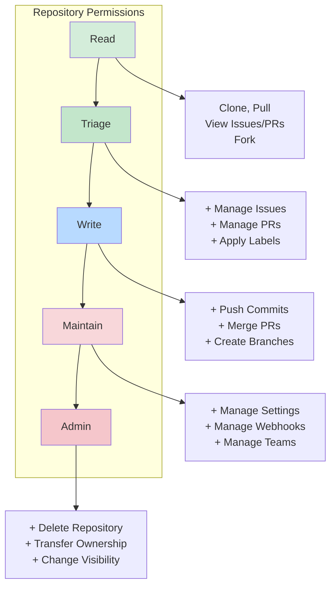
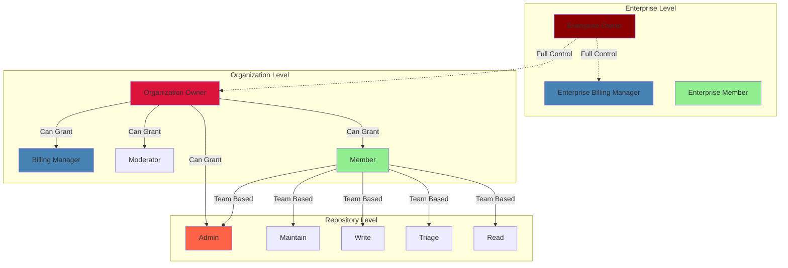
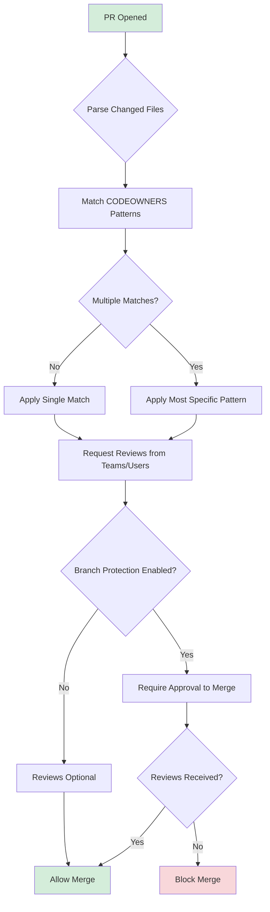
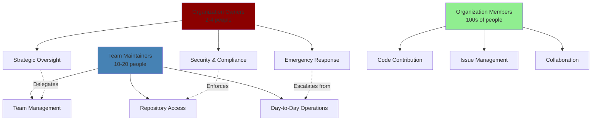

# Teams and Permissions

## Overview

GitHub's teams and permissions system provides a sophisticated framework for organizing members and controlling access across repositories and organizational resources. Understanding the intricacies of team hierarchies, permission inheritance, and role-based access control is essential for designing scalable access management strategies in enterprise environments.

This guide explores advanced team structures, nested team relationships, permission cascading mechanisms, and the integration of teams with identity provider (IdP) synchronization for centralized access management.

## Team Types and Visibility

GitHub teams support two visibility modes that control who can see team membership and mentions:

### Visible Teams

**Characteristics:**
- Default team type for organizations
- All organization members can see the team and its members
- Any member can @mention the team
- Team discussions are visible to all organization members
- Ideal for cross-functional collaboration and transparency

**Use Cases:**
- Engineering teams (frontend, backend, infrastructure)
- Cross-functional groups (security, DevOps, platform)
- Public-facing teams that coordinate with multiple departments

### Secret Teams

**Characteristics:**
- Only team members and organization owners can see the team
- Team mentions are restricted to team members
- Team discussions are private to members
- Must be explicitly granted access by organization owners
- Cannot be nested under visible teams

**Use Cases:**
- Security incident response teams
- Compliance and audit teams
- Executive leadership teams
- Teams handling sensitive data or projects
- Temporary teams for confidential initiatives

**Visibility Implications:**

```yaml
Visible Team:
  - Discoverable: Yes
  - Mentionable: All org members
  - Parent Teams: Can be visible or secret
  - Child Teams: Can be visible or secret
  
Secret Team:
  - Discoverable: No (owners and members only)
  - Mentionable: Members only
  - Parent Teams: Must be secret
  - Child Teams: Must be secret
```

## Nested Teams and Hierarchy

Nested teams enable sophisticated organizational structures that mirror company hierarchies while providing powerful permission inheritance mechanisms.

### Team Hierarchy Structure



### Parent/Child Team Inheritance

**Access Inheritance Rules:**

1. **Repository Access:**
   - Child teams inherit all repository access from parent teams
   - Child teams can have additional repositories not granted to parents
   - Child teams cannot have less access than parents (only equal or greater)
   - Permission level inheritance follows the maximum level granted

2. **Permission Cascading:**
   - If parent has `Write` access, child automatically has `Write` minimum
   - Child can be granted `Admin` while parent has `Write`
   - Removing parent's access doesn't remove child's explicit grants
   - Child's effective permission = max(parent permission, direct permission)

**Example Inheritance:**

```
Engineering Team (Parent)
├── Repository: core-api (Write)
├── Repository: infrastructure (Admin)
└── Backend Team (Child)
    ├── Inherits: core-api (Write)
    ├── Inherits: infrastructure (Admin)
    ├── Direct: backend-services (Admin)
    └── Effective Access:
        - core-api: Write (inherited)
        - infrastructure: Admin (inherited)
        - backend-services: Admin (direct)
```

### Permission Cascading Mechanics

**Cascading Behavior:**



**Cascading Rules:**
- Permissions flow down, never up
- Explicit grants always take precedence over inheritance
- Removing a parent team does not remove child's explicit access
- Multiple inheritance paths result in highest permission level
- Organization base permissions act as absolute minimum

### Nested Team Best Practices

**Structural Guidelines:**

1. **Maximum Depth:** Limit nesting to 3-4 levels for maintainability
2. **Visibility Consistency:** Secret teams should have secret parents
3. **Permission Clarity:** Document expected inheritance patterns
4. **Ownership Model:** Assign team maintainers at each level
5. **Naming Convention:** Use consistent prefixes (e.g., `eng-platform-sre`)

**Anti-Patterns to Avoid:**

```yaml
# DON'T: Deep nesting reduces clarity
org-engineering-platform-infrastructure-kubernetes-operators-team

# DO: Flat structure with clear naming
engineering-k8s-operators

# DON'T: Mix visibility in hierarchy
Parent: Secret Team
└── Child: Visible Team  # Creates confusion

# DO: Consistent visibility
Parent: Secret Team
└── Child: Secret Team
```

## Team Synchronization with Identity Provider

Team sync enables automatic team membership management through IdP groups, ensuring consistency between corporate identity systems and GitHub access.

### Team Sync Architecture



### Configuring Team Sync

**Prerequisites:**
- Enterprise account with EMU or SAML SSO
- SCIM provisioning enabled
- IdP group claim mapping configured
- Identity provider supports group membership

**Setup Process:**

1. **Enable Team Sync:**
```bash
# Organization settings → Teams → Enable team synchronization
# Requires organization owner permissions
```

2. **Map IdP Groups to Teams:**
```yaml
GitHub Team: engineering-backend
IdP Group: CN=Engineering-Backend,OU=Engineering,DC=company,DC=com
Sync Status: Active
Last Sync: 2024-01-15 10:30 UTC
Members Synced: 24
```

3. **Configure Sync Rules:**
```json
{
  "team_sync": {
    "group_id": "engineering-backend",
    "provider": "azure_ad",
    "group_name": "Engineering-Backend",
    "sync_enabled": true,
    "sync_frequency": "40_minutes",
    "remove_members_not_in_group": true
  }
}
```

### Team Sync Behavior

**Membership Management:**

| Action in IdP | Result in GitHub | Timing |
|---------------|------------------|--------|
| User added to group | Added to team | Next sync (≤40 min) |
| User removed from group | Removed from team | Next sync (≤40 min) |
| Group deleted | Team unchanged | Manual intervention required |
| User suspended | Removed from org | Immediate (SCIM) |
| Group renamed | Team unchanged | Manual remapping required |

**Important Considerations:**

1. **Manual Members:** Users manually added to synced teams are removed on next sync
2. **Team Maintainers:** Cannot manually manage membership of synced teams
3. **Nested Teams:** Child team sync is independent of parent team sync
4. **Multiple Groups:** One team can sync with one IdP group only
5. **Sync Failures:** Check audit log for `team.add_member` and `team.remove_member` events

### Team Sync vs Manual Management

**When to Use Team Sync:**
- Large organizations (100+ members)
- Rapid employee onboarding/offboarding
- Compliance requirements for access reviews
- Existing IdP group structure mirrors GitHub needs
- Centralized identity management mandate

**When to Use Manual Management:**
- Small teams (< 20 members)
- Project-based temporary teams
- Cross-organizational collaboration
- Teams that don't align with IdP groups
- Contractors without IdP accounts

## Permission Levels

GitHub implements role-based access control (RBAC) across three scopes: repository, organization, and enterprise. Each scope has distinct permission levels with specific capabilities.

### Repository Permission Levels



**Read Permission:**
- Clone and pull repository
- Open issues and comment
- Submit pull requests from forks
- View wiki pages
- Download releases
- View GitHub Actions workflows (not logs)

**Triage Permission:**
- All Read permissions
- Manage issues (assign, label, close)
- Manage pull requests (assign, label, request reviews)
- Apply milestones
- Dismiss pull request reviews
- Lock conversations
- Hide duplicate comments

**Write Permission:**
- All Triage permissions
- Push to protected and unprotected branches (unless restricted)
- Merge pull requests
- Edit and delete issue comments
- Delete issue attachments
- Create and edit releases
- View and cancel GitHub Actions workflow runs
- Create deployment environments

**Maintain Permission:**
- All Write permissions
- Manage repository settings (except danger zone)
- Manage webhooks and deploy keys
- Grant team access (up to Maintain level)
- Manage branch protection rules
- Manage GitHub Pages
- Manage Actions secrets and variables
- Enable/disable Features (Wikis, Projects, Discussions)

**Admin Permission:**
- All Maintain permissions
- Delete repository
- Change repository visibility (public/private/internal)
- Transfer repository ownership
- Manage security and analysis settings
- Grant admin access to other teams
- Manage collaborators with full permissions
- Archive repository

### Organization Permission Levels

**Member:**
- Create repositories (if allowed by organization settings)
- View organization members and teams
- Create teams (if allowed)
- Invite organization members
- See organization audit log (own actions only)
- Fork internal and private repositories

**Moderator:**
- All Member permissions
- Block and unblock users
- Limit interactions for users
- Hide comments organization-wide
- Lock conversations
- Manage organization interaction limits

**Billing Manager:**
- View billing information
- Update payment methods
- Download receipts and invoices
- Add/remove billing managers
- View organization membership (for billing purposes only)
- Cannot access repositories or organization settings

**Owner:**
- All permissions across the organization
- Add/remove organization members
- Manage organization settings
- Configure security policies
- Manage billing and plan
- Delete organization
- Promote/demote other owners
- Access all repositories (including private)
- Configure enterprise connections

### Enterprise Permission Levels

**Enterprise Member:**
- Access granted organizations within enterprise
- View enterprise members list (if enabled)
- Collaborate on repositories per organization role

**Enterprise Billing Manager:**
- View enterprise billing information
- Manage payment methods and subscriptions
- View organizations and members for billing
- Cannot access repositories or manage organizations

**Enterprise Owner:**
- All permissions across enterprise account
- Create and manage organizations
- Configure enterprise policies
- Enforce SAML SSO and team sync
- Manage enterprise audit log and insights
- Configure IP allow lists
- Promote/demote enterprise administrators
- Remove organizations from enterprise

### Permission Levels Matrix



### Permission Inheritance and Conflicts

**Inheritance Rules:**

1. **Team Membership:** User inherits all team permissions
2. **Multiple Teams:** User receives highest permission level across teams
3. **Direct Assignment:** Trumps team-based permissions
4. **Base Permissions:** Organization-wide minimum applies to all members
5. **Outside Collaborators:** Bypass base permissions (explicit only)

**Example Scenario:**

```yaml
User: jane@company.com

Organization Base Permission: Read

Team Memberships:
  - engineering-team (Write on repo-a)
  - security-team (Admin on repo-a)
  - frontend-team (Read on repo-b)

Direct Grants:
  - repo-c: Maintain

Effective Permissions:
  - repo-a: Admin (highest from teams)
  - repo-b: Read (from team)
  - repo-c: Maintain (direct grant)
  - repo-d: Read (base permission)
```

## Custom Repository Roles

Custom repository roles enable organizations to define precise permission sets beyond the five standard levels, providing fine-grained access control tailored to specific workflows.

### Creating Custom Roles

**Available Permissions Categories:**

1. **Repository Content:**
   - Read repository content
   - Edit repository content
   - Delete repository content

2. **Issues and Projects:**
   - Read issues
   - Create/edit/delete issues
   - Manage issue assignments and labels

3. **Pull Requests:**
   - Read pull requests
   - Create/edit/delete pull requests
   - Merge pull requests
   - Manage PR assignments and reviews

4. **Repository Administration:**
   - Manage branches and branch protection
   - Manage webhooks and integrations
   - Manage repository settings
   - Manage Actions secrets and workflows

5. **Security:**
   - View vulnerability alerts
   - Dismiss/resolve security alerts
   - Manage security settings

**Example Custom Role: "Security Reviewer"**

```yaml
name: security-reviewer
base_role: read
permissions:
  contents: read
  issues: write
  pull_requests: write
  security_events: admin
  actions: read
  metadata: read

description: >
  Role for security team members to review code,
  manage security alerts, and participate in security reviews
  without write access to code.

includes:
  - View all repository content
  - Create and comment on issues
  - Review pull requests and request changes
  - View and dismiss security alerts
  - Access dependency graphs and insights
  - View Actions workflow runs

excludes:
  - Push commits
  - Merge pull requests
  - Manage repository settings
  - Create releases
```

**Example Custom Role: "Release Manager"**

```yaml
name: release-manager
base_role: write
permissions:
  contents: write
  pull_requests: write
  actions: write
  packages: admin
  deployments: write
  metadata: read

description: >
  Role for release engineers to manage releases,
  packages, and deployments without full admin access.

includes:
  - All Write permissions
  - Create and publish releases
  - Manage GitHub Packages
  - Trigger deployment workflows
  - View and manage Actions secrets (read-only)
  - Cancel workflow runs

excludes:
  - Delete repository
  - Manage collaborators
  - Change repository visibility
  - Manage webhooks
```

### Assigning Custom Roles

**Via Teams:**
```bash
# Organization settings → Repository roles → Create custom role
# Team settings → Repositories → Add repository → Select custom role
```

**Via API:**
```bash
# Create custom role
curl -X POST \
  -H "Accept: application/vnd.github+json" \
  -H "Authorization: Bearer <token>" \
  https://api.github.com/orgs/ORG/custom_roles \
  -d '{
    "name": "security-reviewer",
    "description": "Security review role",
    "base_role": "read",
    "permissions": ["security_events"]
  }'

# Assign to team
curl -X PUT \
  -H "Accept: application/vnd.github+json" \
  -H "Authorization: Bearer <token>" \
  https://api.github.com/orgs/ORG/teams/TEAM/repos/OWNER/REPO \
  -d '{"permission": "security-reviewer"}'
```

### Custom Role Use Cases

**Security-Focused Roles:**
- **Security Auditor:** Read-only with security alert access
- **Vulnerability Manager:** Security admin without code write
- **Compliance Reviewer:** Read with audit log access

**Operational Roles:**
- **CI/CD Manager:** Actions and deployments without code changes
- **Documentation Maintainer:** Write access to docs paths only (via branch rules)
- **Dependency Manager:** Packages and security updates only

**Development Roles:**
- **Code Reviewer:** Review and comment without merge authority
- **Junior Developer:** Write with restrictions on protected branches
- **Contractor:** Limited write with approval requirements

## Base Permissions Configuration

Base permissions define the default access level for all organization members across repositories, establishing the minimum permission floor.

### Base Permission Options

**None (Default for Private Organizations):**
- Members have no access unless explicitly granted via teams
- Encourages principle of least privilege
- Requires active permission management
- Best for security-sensitive organizations

**Read:**
- All members can view all repositories
- Promotes transparency and knowledge sharing
- Members must be granted higher permissions for contributions
- Common in open development environments

**Write:**
- All members can contribute to all repositories
- Maximum collaboration and velocity
- Significant security implications
- Rare in enterprise environments, common in startups

**Admin:**
- Not recommended for organizations
- All members have full repository control
- No access control or security boundaries
- Only appropriate for single-person "organizations"

### Configuring Base Permissions

**Organization Settings:**
```yaml
Path: Organization → Settings → Member privileges → Base permissions

Configuration:
  base_permission: "read"
  members_can_create_repositories: true
  repository_types_members_can_create:
    - private
    - internal
  members_can_create_teams: false
  members_can_fork_private_repos: true
  outside_collaborators_block: false
```

**Strategic Considerations:**

| Organization Type | Recommended Base | Rationale |
|-------------------|------------------|-----------|
| Financial Services | None | Strict compliance, explicit grants |
| Healthcare | None | HIPAA requirements, data sensitivity |
| Technology/SaaS | Read | Transparency, cross-team awareness |
| Open Source | Read | Community collaboration |
| Startup (< 50 members) | Read or Write | Velocity over process |
| Consulting Firm | None | Client confidentiality |

### Base Permissions and Outside Collaborators

**Key Distinction:**

```yaml
Organization Members:
  - Subject to base permissions
  - Can be added to teams
  - Counted in license seats
  - Access via organization membership

Outside Collaborators:
  - Bypass base permissions
  - Require explicit repository grants
  - Not counted in license seats (with limits)
  - Access via direct repository invitation
  - Cannot see private repositories without explicit access
```

**Outside Collaborator Use Cases:**
- Contractors with limited engagement
- Partner organizations collaborating on specific projects
- Consultants performing audits or reviews
- Temporary contributors for specific features

**Management Strategy:**

```bash
# Audit outside collaborators
gh api /orgs/ORG/outside_collaborators \
  --jq '.[] | {login: .login, repos: .repos_url}'

# Convert to member (if expanding role)
# Organization → People → Outside collaborators → Invite to organization

# Remove access (if engagement ends)
gh api -X DELETE /repos/OWNER/REPO/collaborators/USERNAME
```

## CODEOWNERS and Automatic Review Assignment

CODEOWNERS provides a powerful mechanism for defining code ownership boundaries, automatically assigning reviewers based on file paths, and enforcing review requirements through branch protection.

### CODEOWNERS File Syntax

**Location:**
- Repository root: `/.github/CODEOWNERS`
- Alternative: `/CODEOWNERS` or `/docs/CODEOWNERS`

**Basic Syntax:**

```bash
# Lines starting with # are comments

# Default owner for everything (fallback)
*       @org/engineering-team

# Specific directories
/docs/  @org/documentation-team @jane-doe
/src/   @org/backend-team
/ui/    @org/frontend-team

# Specific file types
*.js    @org/javascript-team
*.go    @org/golang-team
*.sql   @org/database-team

# Specific files
package.json    @org/platform-leads
Dockerfile      @org/devops-team
.github/workflows/  @org/cicd-team

# Nested ownership (more specific takes precedence)
/src/payment/   @org/payment-team @org/security-team
/src/payment/encryption/ @org/security-team

# Order matters: last matching pattern takes precedence
README.md       @org/everyone
/docs/README.md @org/docs-leads
```

### Advanced CODEOWNERS Patterns

**Pattern Matching:**

```bash
# Match files at any depth
**.md   @org/documentation-team

# Match only at root
/*.yml  @org/config-owners

# Exclude pattern (not natively supported, use precedence)
/src/               @org/engineering
/src/experimental/  @org/research-team  # Overrides previous

# Multiple files same owner
*.{yml,yaml,json}   @org/config-team

# Critical paths requiring multiple approvals
/security/      @org/security-leads @org/engineering-leads @ciso
/database/migrations/   @org/dba-team @org/backend-leads
```

**Team vs Individual Ownership:**

```bash
# Team ownership (preferred for resilience)
/frontend/  @org/frontend-team

# Individual ownership (use sparingly)
/frontend/legacy/   @john-smith

# Hybrid approach
/frontend/  @org/frontend-team
/frontend/core-framework/   @jane-doe @bob-jones @org/architecture
```

### Automatic Review Assignment

**How It Works:**

1. Developer opens pull request
2. GitHub parses CODEOWNERS for modified files
3. Teams/individuals are automatically requested as reviewers
4. Notifications sent to code owners
5. PR status checks wait for required reviews

**Review Assignment Logic:**



**Review Assignment Configuration:**

```yaml
# Repository Settings → Code review assignment

Enabled: true

Assignment Method:
  - Round robin: Distribute reviews evenly
  - Load balance: Consider pending reviews
  - Least recent reviewer: Prioritize inactive reviewers

Team Assignment:
  - Request team review: Yes
  - Notify all members: No
  - Auto-assign individuals: Yes
  - Number to assign: 2
  - Consider unavailable: Yes (skip on vacation)

Child Team Routing:
  - Route to child teams: Yes
  - Child team assignment: Random selection
```

### CODEOWNERS and Branch Protection

**Integration Strategy:**

```yaml
Branch Protection Rule: main

Require Pull Request Reviews:
  - Required approving reviews: 2
  - Dismiss stale reviews: true
  - Require review from Code Owners: true  # Critical setting
  - Restrict dismissals: @org/engineering-leads

Additional Requirements:
  - Require status checks: true
  - Require conversation resolution: true
  - Include administrators: false

Code Owner Review Behavior:
  - PR cannot merge without Code Owner approval
  - Code Owner review replaces generic review requirement
  - Multiple owners = multiple approvals needed (if specified)
```

**Example Enforcement:**

```bash
# Scenario: Change to /src/payment/api.go

CODEOWNERS content:
/src/payment/   @org/payment-team @org/security-team

Branch Protection:
- Require Code Owner review: Enabled
- Required reviews: 2

Result:
- @org/payment-team must approve (1 member minimum)
- @org/security-team must approve (1 member minimum)
- Total: 2 approvals from 2 different teams required
- Generic engineering reviews don't satisfy requirement
```

### CODEOWNERS Best Practices

**Structure and Maintenance:**

1. **Ownership Granularity:**
   - Start broad, refine as needed
   - Balance specificity with maintainability
   - Avoid excessive individual ownership

2. **Team-Based Ownership:**
   - Prefer teams over individuals for resilience
   - Ensure teams have sufficient members for coverage
   - Document escalation paths

3. **Review Coverage:**
   - All code should have at least one owner
   - Critical paths should have multiple owners
   - Security-sensitive areas require specialized teams

4. **Documentation:**
   ```bash
   # Document ownership rationale
   # Backend team owns business logic
   /src/services/  @org/backend-team
   
   # Security team required for auth changes (compliance req)
   /src/auth/      @org/backend-team @org/security-team
   
   # Dual ownership for financial calculations (audit requirement)
   /src/billing/   @org/payment-team @org/finance-team
   ```

5. **Testing CODEOWNERS:**
   ```bash
   # Validate syntax
   gh api repos/OWNER/REPO/codeowners/errors
   
   # Test ownership for specific files
   gh api repos/OWNER/REPO/contents/PATH \
     --jq '.owners'
   ```

**Anti-Patterns to Avoid:**

```bash
# DON'T: Too many owners (review bottleneck)
/src/   @org/team1 @org/team2 @org/team3 @org/team4 @person1 @person2

# DO: Focused ownership
/src/   @org/backend-team

# DON'T: Individual-only ownership (vacation/turnover risk)
/critical-path/     @john-doe

# DO: Team with optional individual leads
/critical-path/     @org/platform-team @platform-lead

# DON'T: Conflicting patterns (unclear precedence)
*.js        @org/frontend-team
/backend/*.js   @org/backend-team
/backend/api/*.js   @org/api-team

# DO: Clear hierarchical structure
/frontend/**/*.js   @org/frontend-team
/backend/**/*.js    @org/backend-team
```

## Team Maintainers vs Organization Owners

Understanding the distinction between team maintainers and organization owners is crucial for implementing proper separation of duties and delegating administrative responsibilities.

### Team Maintainer Role

**Capabilities:**

```yaml
Team Management:
  - Add/remove team members (within team only)
  - Edit team description and settings
  - Manage team repositories (grant/revoke access)
  - Delete the team
  - Convert team to secret/visible
  - Create child teams

Limitations:
  - Cannot access organization settings
  - Cannot manage other teams (except child teams)
  - Cannot view organization audit log
  - Cannot manage organization billing
  - Cannot create repositories (unless org setting allows)
  - Cannot access repos without explicit permission
```

**Use Cases:**

- Engineering team leads managing their teams
- Project managers controlling project team membership
- Department heads overseeing department teams
- Security team leads managing security groups

**Assignment:**

```bash
# Via UI: Team settings → Members → Promote to maintainer

# Via API:
gh api -X PUT \
  /orgs/ORG/teams/TEAM/memberships/USERNAME \
  -f role=maintainer
```

### Organization Owner Role

**Capabilities:**

```yaml
Full Authority:
  - All team maintainer permissions across ALL teams
  - Organization settings and policies
  - Billing and subscription management
  - Create/delete repositories
  - Manage organization security settings
  - Access organization audit log
  - Manage GitHub Apps and OAuth apps
  - Transfer repository ownership
  - Remove organization members
  - Delete organization

Implicit Repository Access:
  - Can access all repositories (including private)
  - Override branch protection for admin tasks
  - Bypass required reviews for emergency fixes
  - Access restricted by IP allow lists (if configured)
```

**Security Implications:**

```yaml
Owner Account Protection:
  - Require 2FA: Mandatory
  - SAML SSO: Required for authentication
  - Audit logging: All actions tracked
  - IP restrictions: Apply allow lists
  - Session timeout: Short duration recommended
  - Device registration: Limited approved devices
```

### Separation of Duties

**Delegation Strategy:**



**Recommended Distribution:**

| Organization Size | Owners | Team Maintainers | Ratio |
|------------------|--------|------------------|-------|
| < 50 members | 2 | 5-10 | 1:5 |
| 50-200 members | 3-4 | 10-20 | 1:15 |
| 200-1000 members | 4-6 | 20-50 | 1:50 |
| 1000+ members | 6-10 | 50+ | 1:100 |

### Ownership Best Practices

**Owner Account Security:**

1. **Limited Owner Count:**
   - Minimum: 2 (avoid single point of failure)
   - Maximum: 5-10 (reduce attack surface)
   - Principle of least privilege

2. **Owner Selection Criteria:**
   - Executive leadership (CTO, VP Engineering)
   - Security leads (CISO, Security Director)
   - Operations leads (Director of Infrastructure)
   - Backup contacts across time zones

3. **Protected Owner Accounts:**
   ```yaml
   Security Requirements:
     - Hardware 2FA keys (YubiKey, etc.)
     - No password-only authentication
     - Dedicated "admin" accounts (not personal)
     - Regular access reviews (quarterly)
     - Break-glass procedures documented
   ```

**Team Maintainer Empowerment:**

```yaml
Delegate Authority:
  Team Management:
    - Add/remove members to their teams
    - Create child teams for projects
    - Grant repository access up to Maintain level
  
  Restrictions:
    - Cannot grant Admin repository access
    - Cannot manage organization-wide settings
    - Cannot access other teams' private repos
  
  Governance:
    - Monthly access reviews required
    - Quarterly maintainer training
    - Documented escalation procedures
    - Audit log monitoring
```

**Operational Handoffs:**

```bash
# Scenario: Engineering Lead Promotion

Step 1: Add as Team Maintainer
gh api -X PUT /orgs/ORG/teams/engineering/memberships/USER \
  -f role=maintainer

Step 2: Document Responsibilities
- Team: engineering-backend
- Scope: Manage team members, repository access
- Escalation: Contact @org-owners for billing/security
- Training: Complete admin onboarding

Step 3: Grant Supporting Access
- Repository: engineering-docs (Write)
- Repository: team-tools (Maintain)
- Team: engineering-leads (Member)

Step 4: Monitor and Review
- 30-day check-in: Review actions taken
- 90-day review: Assess effectiveness
- Ongoing: Audit log monitoring
```

### Emergency Access Patterns

**Break-Glass Procedures:**

```yaml
Scenario: Team Maintainer Unavailable

Option 1: Backup Maintainer
  - Promote secondary team member to maintainer
  - Temporary elevation (document end date)
  - Automated reminders to demote

Option 2: Organization Owner Intervention
  - Owner temporarily joins team
  - Performs required action
  - Documents in ticket/incident
  - Removes self from team

Option 3: Child Team Delegation
  - Create child team for specific task
  - Grant temporary maintainer to trusted member
  - Delete child team after task completion
```

**Owner Succession Planning:**

```yaml
Documented Process:
  Current Owners:
    - Primary: cto@company.com (Timezone: PST)
    - Secondary: vp-eng@company.com (Timezone: EST)
    - Tertiary: director-infra@company.com (Timezone: GMT)
  
  Backup Owners (not active):
    - ciso@company.com
    - director-platform@company.com
  
  Emergency Procedure:
    1. Contact support@github.com with enterprise account
    2. Provide verification: ticket #, domain, registered email
    3. GitHub support can promote backup owner
    4. Document incident in audit log
  
  Rotation Schedule:
    - Annual review of owner list
    - Quarterly confirmation of contact info
    - Monthly break-glass procedure test
```

## Advanced Permission Scenarios

### Multi-Tier Access Control

**Scenario: Enterprise with strict compliance requirements**

```yaml
Structure:
  Enterprise: FinTech Corp
  └── Organizations:
      ├── production (prod.company.com)
      │   ├── Base Permission: None
      │   ├── Teams: 5 (security, backend, frontend, data, devops)
      │   └── Repositories: 50 (all private)
      │
      ├── staging (staging.company.com)
      │   ├── Base Permission: Read
      │   ├── Teams: 5 (mirrors production)
      │   └── Repositories: 50 (mirrors production)
      │
      └── development (dev.company.com)
          ├── Base Permission: Write
          ├── Teams: 10 (includes experimental teams)
          └── Repositories: 100+ (includes prototypes)

Access Pattern:
  Junior Developer:
    - development: Write (base permission)
    - staging: Read (team: backend-team)
    - production: None (no access)
  
  Senior Developer:
    - development: Write (base permission)
    - staging: Write (team: backend-team)
    - production: Read (team: backend-team)
  
  Lead Developer:
    - development: Admin (team: backend-leads)
    - staging: Maintain (team: backend-leads)
    - production: Write (team: backend-leads)
  
  Security Team:
    - development: Custom "security-reviewer"
    - staging: Custom "security-reviewer"
    - production: Admin (team: security-team)
```

### Cross-Organization Collaboration

**Scenario: Partner integration project**

```yaml
Primary Organization: company-a
Partner Organization: company-b

Repository: company-a/integration-api
  Access:
    - company-a/engineering: Write
    - company-a/security: Admin
    - partner-b-team: Write (outside collaborators)
    - partner-b-lead: Maintain (outside collaborator)

Constraints:
  - Partners cannot access other company-a repositories
  - CODEOWNERS requires company-a approval for core files
  - Branch protection requires company-a security review
  - Partners limited to integration-specific branches

Configuration:
  Branch Protection (main):
    - Require company-a/security approval
    - Block partner force push
    - Require status checks from company-a CI
  
  Branch Protection (partner/*):
    - Partner can force push
    - Reduced review requirements
    - Must pass integration tests
```

## Audit and Compliance

### Permission Auditing

**Regular Audit Procedures:**

```bash
# Audit team membership
gh api /orgs/ORG/teams/TEAM/members --paginate \
  | jq '.[] | {login, role}' > team-audit.json

# Audit repository access by team
gh api /orgs/ORG/teams/TEAM/repos --paginate \
  | jq '.[] | {name, permissions}' > repo-access.json

# Find users with direct repository access (bypass teams)
gh api /repos/OWNER/REPO/collaborators \
  | jq '.[] | select(.type == "User") | {login, permissions}'

# Audit organization owners
gh api /orgs/ORG/members?role=admin \
  | jq '.[] | .login'

# Audit outside collaborators
gh api /orgs/ORG/outside_collaborators --paginate \
  | jq '.[] | {login, repos_url}'

# Audit team sync status
gh api /orgs/ORG/teams --paginate \
  | jq '.[] | {name, synchronized: .synchronized}'
```

**Compliance Reporting:**

```bash
# Generate quarterly access report
#!/bin/bash

ORG="your-org"
OUTPUT="access-report-$(date +%Y-%m-%d).csv"

echo "User,Team,Repository,Permission,Direct/Team" > $OUTPUT

# Team-based access
for team in $(gh api /orgs/$ORG/teams --jq '.[].slug'); do
  for repo in $(gh api /orgs/$ORG/teams/$team/repos --jq '.[].name'); do
    for user in $(gh api /orgs/$ORG/teams/$team/members --jq '.[].login'); do
      perm=$(gh api /orgs/$ORG/teams/$team/repos --jq ".[] | select(.name==\"$repo\") | .permissions | to_entries[] | select(.value==true) | .key" | tail -1)
      echo "$user,$team,$repo,$perm,Team" >> $OUTPUT
    done
  done
done

# Direct collaborator access
for repo in $(gh api /orgs/$ORG/repos --jq '.[].name'); do
  for user in $(gh api /repos/$ORG/$repo/collaborators --jq '.[].login'); do
    perm=$(gh api /repos/$ORG/$repo/collaborators/$user/permission --jq '.permission')
    echo "$user,N/A,$repo,$perm,Direct" >> $OUTPUT
  done
done
```

### Monitoring and Alerting

**Webhook Events to Monitor:**

```yaml
Critical Events:
  - team.created
  - team.deleted
  - team.add_member
  - team.remove_member
  - member_invited
  - member_removed
  - org_credentials_authorized
  - repository.privatized
  - repository.publicized
  - repository.transferred

Security Events:
  - team_add_repository
  - team_remove_repository
  - repository.collaborator_added
  - repository.collaborator_removed
  - branch_protection_rule.deleted
  - organization.permission_granted
```

**Alert Configuration:**

```json
{
  "alerts": [
    {
      "event": "team.add_member",
      "condition": "team.name matches 'production-*'",
      "action": "notify_security_team",
      "severity": "high"
    },
    {
      "event": "repository.publicized",
      "action": "block_and_alert",
      "severity": "critical"
    },
    {
      "event": "member_invited",
      "condition": "role == 'admin'",
      "action": "require_owner_approval",
      "severity": "high"
    }
  ]
}
```

## Troubleshooting Common Issues

### Permission Escalation Not Taking Effect

**Symptoms:** User cannot access repository despite team membership

**Diagnosis:**
```bash
# Check user organization membership
gh api /orgs/ORG/members/USER

# Check team membership
gh api /orgs/ORG/teams/TEAM/memberships/USER

# Check repository access
gh api /repos/OWNER/REPO/collaborators/USER/permission

# Check for team sync conflicts
gh api /orgs/ORG/teams/TEAM --jq '.synchronized'
```

**Solutions:**
1. **Team sync delay:** Wait up to 40 minutes for IdP sync
2. **Base permissions conflict:** Check org base permission setting
3. **Repository privacy:** Ensure user can access private repos
4. **Team nesting:** Verify parent team has repository access
5. **Outside collaborator:** Convert to member for base permissions

### CODEOWNERS Not Assigning Reviewers

**Symptoms:** Pull requests not automatically requesting reviews

**Diagnosis:**
```bash
# Validate CODEOWNERS syntax
gh api /repos/OWNER/REPO/codeowners/errors

# Check file location
ls -la .github/CODEOWNERS
ls -la CODEOWNERS
ls -la docs/CODEOWNERS

# Verify branch protection settings
gh api /repos/OWNER/REPO/branches/main/protection \
  --jq '.required_pull_request_reviews.require_code_owner_reviews'
```

**Solutions:**
1. **Wrong location:** Move CODEOWNERS to `/.github/` directory
2. **Syntax error:** Fix pattern matching (check for invalid characters)
3. **Team slug incorrect:** Use `@org/team-slug` not team name
4. **Branch protection disabled:** Enable "Require review from Code Owners"
5. **Team privacy:** Secret teams cannot be code owners (make visible)

### Team Sync Failures

**Symptoms:** Users not added/removed from teams after IdP changes

**Diagnosis:**
```bash
# Check sync status
gh api /orgs/ORG/teams/TEAM/team-sync/group-mappings

# View audit log for sync events
gh api /orgs/ORG/audit-log?phrase=team.add_member

# Verify SCIM provisioning
curl https://api.github.com/scim/v2/organizations/ORG/Users \
  -H "Authorization: Bearer TOKEN"
```

**Solutions:**
1. **Group mapping incorrect:** Remap IdP group to team
2. **SCIM not configured:** Enable SCIM provisioning in IdP
3. **Group claim missing:** Add group claim to SAML assertion
4. **Sync disabled:** Re-enable team sync in organization settings
5. **Manual members present:** Remove manually-added members (conflict with sync)

## References

### Official Documentation

- [GitHub Docs: Organizations and Teams](https://docs.github.com/en/enterprise-cloud@latest/organizations)
- [GitHub Docs: Managing Teams](https://docs.github.com/en/enterprise-cloud@latest/organizations/organizing-members-into-teams)
- [GitHub Docs: Repository Roles](https://docs.github.com/en/organizations/managing-user-access-to-your-organizations-repositories/repository-roles-for-an-organization)
- [GitHub Docs: Organization Roles](https://docs.github.com/en/organizations/managing-peoples-access-to-your-organization-with-roles/roles-in-an-organization)
- [GitHub Docs: Enterprise Roles](https://docs.github.com/en/enterprise-cloud@latest/admin/user-management/managing-users-in-your-enterprise/roles-in-an-enterprise)
- [GitHub Docs: CODEOWNERS](https://docs.github.com/en/repositories/managing-your-repositorys-settings-and-features/customizing-your-repository/about-code-owners)
- [GitHub Docs: Team Synchronization](https://docs.github.com/en/enterprise-cloud@latest/organizations/managing-saml-single-sign-on-for-your-organization/managing-team-synchronization-for-your-organization)
- [GitHub Docs: Custom Repository Roles](https://docs.github.com/en/enterprise-cloud@latest/organizations/managing-peoples-access-to-your-organization-with-roles/managing-custom-repository-roles-for-an-organization)

### Related Documentation in This Series

- [Enterprise Managed Users (EMU)](./06-enterprise-managed-users.md) - Centralized identity management and team provisioning
- [Identity and Access Management](./07-identity-access-management.md) - SAML SSO, SCIM provisioning, and authentication
- [Repository Governance](./04-repository-governance.md) - Branch protection, required reviews, and security policies

### API References

- [REST API: Teams](https://docs.github.com/en/rest/teams)
- [REST API: Organization Members](https://docs.github.com/en/rest/orgs/members)
- [REST API: Repository Collaborators](https://docs.github.com/en/rest/collaborators)
- [REST API: Custom Repository Roles](https://docs.github.com/en/rest/orgs/custom-roles)

### Community Resources

- [GitHub Community: Enterprise Best Practices](https://github.community/t/enterprise-best-practices)
- [GitHub Skills: Organization Administration](https://skills.github.com/)
- [GitHub Changelog: Team and Permission Updates](https://github.blog/changelog/)

### Compliance and Security Frameworks

- [SOC 2 Controls: Access Management](https://www.aicpa.org/interestareas/frc/assuranceadvisoryservices/aicpasoc2report.html)
- [NIST 800-53: Access Control](https://csrc.nist.gov/publications/detail/sp/800-53/rev-5/final)
- [ISO 27001: Access Management](https://www.iso.org/isoiec-27001-information-security.html)
- [CIS Controls: Account Management](https://www.cisecurity.org/controls)

---

**Document Version:** 1.0  
**Last Updated:** 2024-01-15  
**Target Audience:** Enterprise administrators, security teams, compliance officers  
**Skill Level:** L400 (Expert)
