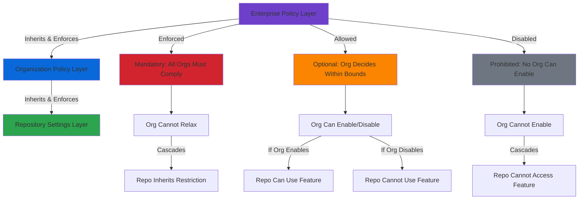
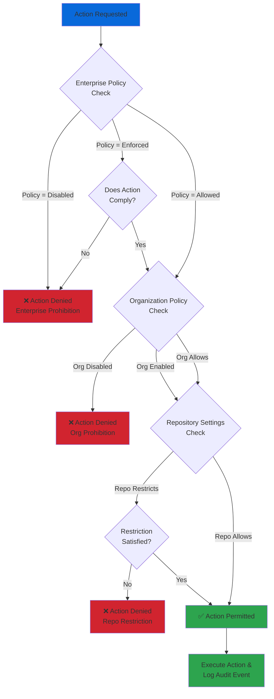
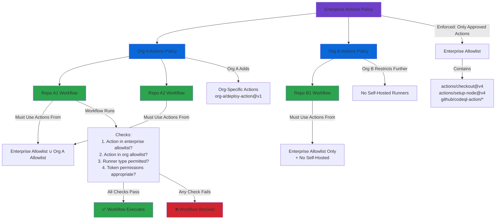

# Policy Enforcement and Inheritance

## Overview

GitHub Enterprise Cloud implements a hierarchical policy enforcement model that enables enterprise administrators to establish guardrails across the entire enterprise while allowing organizational flexibility where appropriate. This three-tiered enforcement architecture—spanning enterprise, organization, and repository levels—provides the foundation for enterprise governance, security compliance, and operational consistency.

Policy inheritance in GHEC follows a top-down cascade model where enterprise-level policies flow down to organizations and repositories. Understanding the nuances of policy enforcement states, inheritance rules, and override capabilities is critical for enterprise administrators architecting governance frameworks that balance security requirements with developer autonomy.

The policy enforcement framework governs multiple domains including repository management, GitHub Actions, security features, collaboration tools, and member privileges. Each policy domain has specific enforcement characteristics, inheritance behaviors, and conflict resolution mechanisms that must be carefully orchestrated to achieve desired governance outcomes.

## Policy Enforcement Model

### Enforcement States

GitHub Enterprise Cloud policies operate under three distinct enforcement states that determine how policies cascade through the hierarchy:

**Enforced (No Override)**
When a policy is set to "enforced" at the enterprise level, it establishes a mandatory baseline that applies uniformly across all organizations and repositories. Organizations cannot deviate from or relax these policies—they can only apply additional restrictions. This state is used for non-negotiable security requirements, compliance mandates, and corporate standards that must be universally applied.

Enforced policies create a compliance floor that prevents policy drift and ensures consistent security posture across the enterprise. For example, an enforced policy requiring two-factor authentication cannot be disabled by organization owners, guaranteeing authentication security enterprise-wide.

**Allowed (Organization Choice)**
The "allowed" state grants organizations autonomy to enable or disable a capability based on their specific needs while remaining within enterprise-defined boundaries. This state is appropriate for features where business context varies across divisions, enabling organizations to self-govern within approved parameters.

When a policy is allowed, organization owners can make independent decisions about enablement without enterprise administrator intervention. However, the enterprise retains visibility into organizational choices through audit logs and policy reports, enabling oversight without micromanagement.

**Disabled (Enterprise Prohibition)**
A disabled policy prevents a capability from being used anywhere in the enterprise. This represents an explicit prohibition, typically driven by security concerns, licensing constraints, or strategic technology decisions. Organizations have no ability to enable disabled capabilities, creating an absolute restriction.

Disabled policies are particularly important for managing security risk, preventing the use of deprecated features, or enforcing technology standardization. Unlike enforced policies that mandate usage, disabled policies prevent usage entirely.

### Policy Inheritance Flow

Policy inheritance follows a unidirectional cascade from enterprise to organization to repository, with each tier inheriting constraints from above and potentially adding additional restrictions:



**Inheritance Principles:**

1. **Restrictive Inheritance:** Child entities can only add restrictions, never relax constraints imposed by parent entities
2. **Policy Composition:** Effective policy at any level is the union of restrictions from all ancestor levels
3. **Immutable Enforcement:** Enforced enterprise policies cannot be overridden at any descendant level
4. **Visibility Cascade:** Policy visibility flows down the hierarchy, but enforcement decisions are evaluated at each tier
5. **Audit Trail Preservation:** All policy changes are logged with actor attribution and timestamps regardless of hierarchy level

### Policy Enforcement Decision Tree

When evaluating whether a user or system can perform an action, GitHub evaluates policies through a decision tree that considers enterprise, organization, and repository policies in sequence:



**Decision Flow Characteristics:**

- **Short-Circuit Evaluation:** If enterprise policy explicitly denies an action, evaluation stops immediately without checking organization or repository policies
- **Additive Restrictions:** Each tier can add new restrictions but cannot remove restrictions from parent tiers
- **Explicit vs Implicit:** Absence of a restrictive policy is not equivalent to explicit permission—some actions require explicit enablement
- **Contextual Evaluation:** Some policies consider additional context such as repository visibility, team membership, or resource classifications

## Enterprise-Level Policies

Enterprise administrators control policies through the enterprise settings interface at `https://github.com/enterprises/[enterprise]/settings/policies`. These policies establish the governance framework for all member organizations.

### Repository Management Policies

**Repository Creation Permissions**

Controls which organization roles can create repositories, with enforcement states determining organizational autonomy:

- **Enforced:** Specifies exactly which roles can create repositories across all organizations (Members, None, or role-specific)
- **Allowed:** Organizations choose their own repository creation policies based on their governance models
- **Disabled:** (Not applicable—creation must be enabled for someone)

Enterprise-enforced creation policies prevent shadow IT scenarios where uncontrolled repository proliferation creates security and compliance risks. Organizations with mature governance may receive creation autonomy, while high-risk organizations may have creation restricted to administrators.

Best practice configuration:
- High-security environments: Enforce creation restricted to organization owners
- Standard environments: Allow organizations to decide, but require organization approval workflows
- Development-focused environments: Allow broad creation rights but enforce repository templates and security baselines

**Repository Visibility Policies**

Governs which repository visibility levels (public, internal, private) organizations can utilize:

- **Enforced:** Mandates specific visibility restrictions (e.g., "no public repositories allowed")
- **Allowed:** Organizations determine appropriate visibility policies for their repositories
- **Disabled:** Prevents specific visibility levels enterprise-wide

Internal repositories (visible to all enterprise members) are exclusive to GHEC and provide a middle ground between public and private. Enterprise policies can enforce internal-only repositories for sensitive projects while disabling public repositories to prevent data exfiltration.

Policy considerations:
- **Public repositories:** Typically disabled for enterprises with proprietary code or regulated data
- **Internal repositories:** Enabled to facilitate inner source and cross-organization collaboration
- **Private repositories:** Always allowed, serving as the most restrictive visibility level

**Repository Forking Policies**

Controls whether repositories can be forked and where forks can be created:

- **Across enterprise:** Allow forks to any organization within the enterprise
- **Within organizations:** Restrict forks to the same organization as the source repository
- **Private/internal repositories:** Separate controls for different visibility levels
- **Disabled:** Prevent forking entirely

Fork policies balance collaboration needs against code control and intellectual property protection. Permissive fork policies enable experimentation and contribution workflows, while restrictive policies prevent unauthorized code duplication and maintain tighter access control.

Strategic fork policy patterns:
- **Open collaboration:** Allow forking across the enterprise to encourage contribution
- **Organizational isolation:** Restrict forks to organization boundaries for audit and compliance
- **No fork zones:** Disable forking for repositories containing proprietary algorithms or regulated data

**Repository Deletion and Transfer**

Controls whether organization owners and repository administrators can delete repositories or transfer them between organizations:

- **Deletion policies:** Can prevent accidental or malicious repository deletion by requiring enterprise administrator approval
- **Transfer policies:** Control whether repositories can move between organizations, affecting audit trails and access control
- **Archival requirements:** Some enterprises enforce archival before deletion to maintain historical records

### GitHub Actions Policies

GitHub Actions represents a significant policy domain due to its ability to execute arbitrary code, access secrets, and interact with external systems. Enterprise Actions policies provide multilayered controls for security and governance.

**Actions Workflow Permissions**

Controls what Actions workflows can do by default within repositories:

- **Runner execution:** Which types of runners (GitHub-hosted, self-hosted) can be used
- **Workflow permissions:** Default token permissions for `GITHUB_TOKEN` (read-only vs write)
- **Fork pull request workflows:** Whether workflows trigger for pull requests from forks
- **Approval requirements:** Requiring approval before workflows run from new contributors

Token permission defaults are particularly important—setting enterprise-wide read-only defaults prevents workflows from unintentionally modifying repository content or performing privileged operations without explicit permission elevation.

**Actions and Reusable Workflows**

Controls which Actions and reusable workflows can be used across the enterprise:

- **Allow all actions:** No restrictions (generally inappropriate for enterprises)
- **Allow local only:** Only Actions and workflows defined within the enterprise
- **Allow select actions:** Explicitly approved list of actions from GitHub Marketplace and verified creators
- **Disable GitHub Actions:** Completely disable Actions capability

The select actions policy requires enterprise administrators to maintain an allowlist of approved actions, typically including:
- Verified creator actions from GitHub
- Actions from trusted organizations
- Enterprise-internal actions published to private repositories

**Actions Policy Inheritance Example**

GitHub Actions policies cascade with specific override rules that enable defense-in-depth configuration:



**Self-Hosted Runner Policies**

Controls the deployment and usage of self-hosted runners:

- **Enterprise-level runners:** Runners available to all or selected organizations
- **Organization-level runners:** Runners scoped to specific organizations
- **Repository-level runners:** Runners dedicated to individual repositories
- **Runner groups:** Logical grouping of runners with specific access controls

Self-hosted runners introduce significant security considerations because they execute untrusted code. Enterprise policies should enforce:
- Runner group restrictions limiting which repositories can use specific runners
- Network isolation for runners processing sensitive workloads
- Ephemeral runner requirements for public repositories
- Required labels and environment segregation

### GitHub Copilot Policies

For enterprises with GitHub Copilot Business or Enterprise licenses, policy controls govern AI assistance capabilities:

**Copilot Enablement**

- **Enforced enabled:** All organization members have access to Copilot
- **Allowed:** Organizations decide whether to enable Copilot for their members
- **Disabled:** Copilot is unavailable enterprise-wide

**Suggestions Matching Public Code**

Controls whether Copilot can provide suggestions that match public code:

- **Allowed:** Copilot may suggest code snippets that match publicly available code
- **Blocked:** Copilot filters out suggestions matching public code to reduce IP concerns

Blocking public code matches reduces licensing and intellectual property risks but may decrease suggestion quality. Organizations with strict IP policies typically block public matches.

**Content Exclusions**

Enterprise policies can specify repositories or file patterns to exclude from Copilot processing:

- File path patterns using glob syntax
- Entire repositories by URL
- Organization-wide exclusions

Content exclusions prevent Copilot from learning from or suggesting code patterns from sensitive repositories, such as those containing proprietary algorithms, security implementations, or regulated data.

### GitHub Pages Policies

Controls the publication of static websites from repositories:

- **Public pages:** Whether public repositories can publish Pages sites
- **Private/internal pages:** Whether private or internal repositories can publish Pages sites
- **Visibility restrictions:** Whether Pages sites must match repository visibility or can be public when repository is private
- **Custom domains:** Controls on custom domain usage and verification requirements

Pages policies balance the value of documentation and project websites against security concerns about inadvertent data exposure. Many enterprises disable public Pages or require approval workflows for Pages publication.

### Project Visibility Policies

GitHub Projects (project boards) have separate visibility controls:

- **Organization projects:** Whether organizations can create projects visible to all organization members
- **Repository projects:** Controls on repository-level project visibility
- **Enterprise-wide projects:** Availability of enterprise-level project tracking

Projects can contain sensitive planning information, making visibility controls important for enterprises with confidential product roadmaps or competitive intelligence concerns.

### Member Privilege Policies

Enterprise policies controlling member capabilities and permissions:

**Repository Invitations**

- **Who can invite:** Controls which roles can invite external collaborators to organization repositories
- **Approval requirements:** Whether external invitations require organization owner approval
- **Domain restrictions:** Limits invitations to specific email domains

External collaborator invitations represent a significant security boundary because they grant repository access to users outside the enterprise. Enforcing approval workflows ensures appropriate review before expanding the trust boundary.

**Team Creation Permissions**

- **Enforced:** Specifies who can create teams (members vs organization owners only)
- **Allowed:** Organizations determine their own team creation policies
- **Disabled:** (Not applicable—team creation must be permitted for administrators)

Liberal team creation policies enable self-organization and agile structures, while restrictive policies maintain tighter organizational control and reduce shadow IT risks.

**Profile Name and Email Visibility**

- **Enforced public:** Member profiles must be visible to the public
- **Allowed private:** Members can choose to make profiles private
- **Enterprise-only visibility:** Profiles visible only within the enterprise

Profile visibility policies affect collaboration discovery and organizational transparency. Enterprises concerned about OSINT reconnaissance may enforce private profiles to reduce external visibility of organizational structure.

## Organization-Level Policies

Organizations inherit enterprise policies and can add additional restrictions within the boundaries established by enterprise settings. Organization policies are configured at `https://github.com/organizations/[org]/settings`.

### Policy Delegation Model

Organization owners exercise delegated authority from the enterprise, with their policy autonomy constrained by enterprise enforcement:

**Inherited Enforcement**
- Enforced enterprise policies appear in organization settings but cannot be modified
- Organization settings UI indicates policies enforced at enterprise level with explanatory text
- Attempts to relax enterprise-enforced policies through API return authorization errors

**Organizational Autonomy**
- Where enterprise policies are "allowed," organizations have full policy-setting authority
- Organizations can enforce policies that enterprise leaves optional
- Organizations can disable features that enterprise allows
- Organizations cannot enable features that enterprise disables

**Additive Restriction Pattern**
Organizations commonly implement organization-specific restrictions beyond enterprise baselines:
- Enterprise allows public repositories → Organization disables public repositories for specific security concerns
- Enterprise allows all Actions → Organization restricts to approved subset relevant to their tech stack
- Enterprise allows member repository creation → Organization requires approval workflow

### Organization Policy Domains

**Base Permissions**

Default repository permissions for organization members:
- **None:** Members have no default access to repositories
- **Read:** Members can read all organization repositories
- **Write:** Members can read and write to all organization repositories
- **Admin:** Members have administrative rights to all repositories (rarely used)

Base permissions establish the default access level before team-based or individual permissions are applied. Security-conscious organizations typically set base permissions to "none" and use explicit team memberships for access control.

**Default Repository Permissions**

Template settings applied to newly created repositories:
- Default visibility (private, internal, public) within enterprise constraints
- Default branch name (main, master, etc.)
- Automatically created repositories include standard files (README, .gitignore, LICENSE)
- Default repository permission level for organization members

**Admin Repository Permissions**

Controls what repository administrators can do:
- Force push to protected branches
- Delete or transfer repositories
- Change repository visibility
- Manage webhooks and integrations

These controls limit the privileges of repository administrators, preventing dangerous operations even for users with admin role assignments.

**Third-Party Application Access**

Controls integration of OAuth applications with organization resources:
- **Allowed applications:** Explicitly approved OAuth apps
- **Denied applications:** Blacklisted applications
- **Approval required:** Whether applications require organization owner approval before accessing organization data

Many enterprises maintain strict application access control to prevent data exfiltration through third-party integrations. Unapproved applications cannot access organization resources even if individual users authorize them.

**Organization Secrets**

Encrypted secrets available to Actions workflows in organization repositories:
- Organization secrets can be scoped to all repositories or selected repositories
- Secrets inherit access control from organization and repository policies
- Secret rotation and audit logging are critical for compliance

Organization secrets enable centralized credential management for CI/CD workflows without exposing credentials in repository code or individual repository secrets.

## Repository-Level Settings

Repository settings represent the lowest tier of policy hierarchy, where policies from enterprise and organization levels converge with repository-specific configurations.

### Repository Setting Categories

**Branch Protection Rules**

Repository-specific access controls for branches:
- Required pull request reviews before merging
- Required status checks (CI/CD pipelines) before merging
- Required conversation resolution before merging
- Restrictions on who can push to matching branches
- Required linear history
- Required deployments to specific environments before merging

Branch protection rules implement repository-specific workflows while operating within organization and enterprise constraints. For example, even with branch protection rules, enterprise-required status checks must still pass.

**Collaboration Settings**

Repository-specific collaboration configuration:
- Features enabled (wikis, issues, projects, discussions)
- Merge button options (merge commits, squash, rebase)
- Automatically delete head branches after pull request merges
- Pull request update methods

These settings customize repository workflow while enterprise and organization policies may restrict available options.

**Security and Analysis**

Security feature enablement for the repository:
- Dependency graph
- Dependabot alerts
- Dependabot security updates
- Dependabot version updates
- Secret scanning
- Code scanning

Repository owners can enable these features if organization and enterprise policies permit. Some enterprises enforce security features at organization or enterprise level to ensure uniform security posture.

**Actions Repository Settings**

Repository-specific Actions configuration within organization and enterprise constraints:
- Actions permissions (which actions and workflows can run)
- Workflow permissions (default `GITHUB_TOKEN` permissions)
- Fork pull request workflows from external contributors
- Required approval for workflows

Even with repository-level settings, Actions must still comply with organization and enterprise Actions policies.

### Repository Setting Inheritance

Repository settings combine inherited policies with repository-specific configuration:

1. **Enterprise policies** flow down as immutable constraints
2. **Organization policies** add additional restrictions within enterprise boundaries
3. **Repository settings** customize behavior within the effective policy framework

Repositories cannot violate policies from above, but can implement additional restrictions. For example:
- Enterprise allows public repositories → Organization allows public → Repository chooses private (more restrictive)
- Enterprise requires Actions approval → Repository inherits requirement (cannot disable)
- Organization sets base permission "read" → Repository can grant team-specific write access (within established base)

## Policy Conflict Resolution

When policies at different hierarchy levels interact, GitHub employs specific resolution mechanisms to determine effective policy:

### Resolution Principles

**Principle 1: Most Restrictive Wins**

When policies conflict, the most restrictive policy takes precedence:
- Enterprise disables feature → Organization/repository cannot enable
- Organization restricts access → Repository cannot expand access beyond restriction
- Multiple restrictions apply → All restrictions must be satisfied

Example: If enterprise policy limits Actions to approved list, organization further restricts to subset, and repository attempts to use action outside organization subset, the action is blocked.

**Principle 2: Explicit Over Implicit**

Explicit policy statements override implicit defaults:
- Explicit denial at any level overrides implicit permission
- Explicit permission requirements aggregate across levels
- Absence of explicit policy at higher level allows lower level control

Example: If enterprise does not explicitly control repository visibility, organization policy determines available options. If organization explicitly restricts visibility, repository must comply regardless of enterprise settings.

**Principle 3: Enforcement State Hierarchy**

Enterprise enforcement state determines organizational autonomy:
- **Enforced → Allowed:** Organization cannot relax but can further restrict
- **Enforced → Enforced:** Organization can match or exceed restriction
- **Allowed → Any:** Organization has full control within allowed boundaries
- **Disabled → Any:** Capability unavailable regardless of lower-tier settings

**Principle 4: Scope-Based Precedence**

When policies apply to different scopes, narrower scope policies apply within broader constraints:
- Enterprise-wide policy establishes boundary
- Organization policy applies within enterprise boundary
- Repository policy applies within organization boundary

### Conflict Scenarios

**Scenario 1: Visibility Conflict**

- Enterprise: Allows public, internal, and private repositories
- Organization: Disables public repositories
- Repository: Attempts to change visibility to public

**Resolution:** Repository visibility change is denied because organization policy explicitly disables public repositories, even though enterprise allows it. Organization policy is more restrictive and takes precedence within that organization.

**Scenario 2: Actions Workflow Conflict**

- Enterprise: Enforces approved Actions list containing `actions/checkout@v4`
- Organization: Further restricts to specific actions, excluding `actions/checkout@v4`
- Repository: Workflow attempts to use `actions/checkout@v4`

**Resolution:** Workflow execution is blocked because organization policy explicitly excludes the action. Both enterprise and organization policies must be satisfied, and organization policy is more restrictive.

**Scenario 3: Repository Creation Conflict**

- Enterprise: Enforced policy allowing only organization owners to create repositories
- Organization: Attempts to allow all members to create repositories

**Resolution:** Organization setting is overridden by enterprise enforcement. Only organization owners can create repositories. The organization setting may appear in UI but is ineffective due to enterprise enforcement.

**Scenario 4: Team Permission Conflict**

- Enterprise: Allows organizations to set base permissions
- Organization: Sets base permission to "none"
- Team: Granted "write" permission to specific repository
- User: Member of team and organization

**Resolution:** User receives "write" permission to the repository because team-specific permissions are additive to base permissions. Base permission "none" establishes the floor, and team permission elevates access for team members.

### Policy Precedence Matrix

| Enterprise Policy | Organization Policy | Effective Result |
|------------------|---------------------|------------------|
| Enforced (Required) | Any | Enterprise policy applies, organization cannot change |
| Allowed | Enabled | Feature available, organization choice respected |
| Allowed | Disabled | Feature unavailable in organization |
| Allowed | Further Restricted | Organization restrictions apply within enterprise boundary |
| Disabled (Prohibited) | Any | Feature unavailable enterprise-wide, organization cannot enable |

### Conflict Detection and Prevention

**Policy Preview and Validation**

Before enforcing enterprise policies, administrators should:
1. **Audit current state:** Survey existing organization policies to identify conflicts
2. **Impact analysis:** Identify organizations and repositories affected by policy changes
3. **Communication plan:** Notify organization owners of upcoming policy enforcements
4. **Phased rollout:** Apply policies to pilot organizations before enterprise-wide enforcement
5. **Validation period:** Monitor audit logs for policy violations and unexpected behaviors

**Conflict Notification**

GitHub provides visibility into policy conflicts:
- Organization settings UI displays enterprise-enforced policies with explanatory text
- API responses include error details when operations violate enterprise policies
- Audit logs record policy enforcement blocks with context about the blocking policy

**Resolution Tools**

Enterprise administrators have tools to identify and resolve conflicts:
- **Enterprise policy report:** Dashboard showing organization compliance with enterprise policies
- **Organization policy export:** API endpoints to retrieve organization policy configurations
- **Audit log queries:** Filter audit events by policy-related actions to identify friction points

## Policy Change Auditing

Comprehensive audit logging of policy changes is critical for compliance, security investigations, and operational accountability.

### Enterprise Audit Log

The enterprise audit log (`https://github.com/enterprises/[enterprise]/settings/audit-log`) records all policy-related events:

**Policy Change Events**

Events logged when enterprise policies are modified:
- `policy.update`: Enterprise policy configuration changed
- `policy.enable`: Previously disabled policy enabled
- `policy.disable`: Policy disabled enterprise-wide
- `policy.enforcement.update`: Policy enforcement state changed (enforced/allowed/disabled)

Each event includes:
- **Actor:** Enterprise owner who made the change
- **Timestamp:** When the change occurred (UTC)
- **Policy domain:** Which policy area was affected (actions, repository, pages, etc.)
- **Before/after values:** Old and new policy configurations
- **IP address:** Source IP of the administrative action
- **User agent:** Browser or API client used for the change

**Organization Policy Events**

Events logged when organization policies are modified within enterprise boundaries:
- `org.update_policy`: Organization policy changed
- `org.policy_compliance`: Organization policy brought into compliance with enterprise enforcement
- `org.policy_violation`: Attempted policy change blocked by enterprise enforcement

**Repository Policy Events**

Repository-level policy changes are logged in organization audit logs:
- `repo.update`: Repository settings changed
- `protected_branch.create`: Branch protection rule created
- `protected_branch.update`: Branch protection rule modified
- `repository_visibility.update`: Repository visibility changed

### Audit Log Retention and Export

**Retention Policies**

- **Enterprise audit log:** 180-day retention for audit events
- **Organization audit log:** 180-day retention for organizations within GHEC enterprise
- **Git events:** 7-day retention only (includes push, clone, fetch operations)
- **Extended retention:** Available through audit log streaming to external SIEM systems

> **Important:** The audit log retains Git events for only **seven days**. To maintain longer Git event history, configure audit log streaming to an external system.

**Export and Streaming**

Enterprise administrators can export audit logs for long-term retention and analysis:

- **Manual export:** Download audit log data as JSON or CSV from enterprise settings
- **API access:** Retrieve audit log events programmatically via REST API
- **Audit log streaming:** Real-time streaming to SIEM platforms (Splunk, Azure Event Hubs, Amazon S3, Datadog, etc.)

Streaming configuration:
```
Enterprise Settings → Audit log → Streaming
→ Configure destination endpoint
→ Set up authentication (tokens, connection strings)
→ Enable streaming for continuous log delivery
```

### Compliance Monitoring

**Policy Compliance Dashboard**

Enterprise administrators should implement monitoring for policy compliance:

1. **Policy drift detection:** Regular scans comparing current policies against baseline configurations
2. **Violation alerts:** Notifications when policy enforcement blocks administrative actions
3. **Usage reports:** Analytics on policy-controlled feature usage (Actions, Pages, external collaborators)
4. **Anomaly detection:** Identification of unusual policy changes or access patterns

**Audit Query Patterns**

Common audit log queries for policy monitoring:

**Recent policy changes:**
```
action:policy.*
created:>YYYY-MM-DD
```

**Actions policy violations:**
```
action:workflows.completed
conclusion:failure
policy_violation:true
```

**Repository visibility changes:**
```
action:repository_visibility.update
```

**External collaborator additions:**
```
action:org.add_outside_collaborator
```

**Enterprise policy override attempts:**
```
action:org.update_policy
org:[organization]
result:failure
```

### Compliance Reporting

Organizations subject to regulatory compliance (SOC 2, ISO 27001, FedRAMP, etc.) require documented evidence of policy enforcement:

**Compliance Artifacts**

- **Policy configuration exports:** Documentation of current enterprise and organization policies
- **Change management records:** Audit log evidence of policy changes with approval workflows
- **Violation reports:** Documented instances of policy enforcement blocks
- **Access reviews:** Regular attestation that policies are correctly configured and enforced

**Compliance Automation**

Integrate GitHub audit logs with compliance automation platforms:
- Export policy configurations to infrastructure-as-code repositories
- Automated policy validation against compliance frameworks
- Integration with GRC (Governance, Risk, Compliance) platforms
- Continuous compliance monitoring dashboards

## Advanced Policy Patterns

### Defense in Depth Policy Architecture

Implement layered policy controls where multiple independent policy mechanisms protect against the same risk:

**Example: Code Quality Enforcement**

- **Enterprise layer:** Require GitHub Advanced Security license for all organizations
- **Organization layer:** Enable required status checks for all repositories
- **Repository layer:** Configure branch protection requiring code scanning and test passage
- **Workflow layer:** Implement rulesets enforcing required workflows for CI/CD

Each layer provides independent enforcement, ensuring that failure or misconfiguration at one layer does not eliminate all protections.

### Context-Aware Policy Enforcement

Design policies that adapt based on repository characteristics:

**Repository Classification-Based Policies**

- **Public repositories:** Strictest policies including required code review, security scanning, and restricted Actions
- **Internal repositories:** Moderate policies balancing security with collaboration
- **Private repositories:** Flexible policies for early-stage development with security reviews before promoting to internal/public

Implement classification through:
- Repository topics (e.g., `tier-1-security`, `compliance-required`)
- Organization membership (critical organizations vs general development)
- Repository templates with predefined security configurations

### Policy as Code

Manage enterprise and organization policies using infrastructure-as-code principles:

**Terraform GitHub Provider**

```hcl
resource "github_enterprise_policy" "actions_policy" {
  enterprise_id = data.github_enterprise.main.id
  
  actions_policy {
    allowed_actions = "selected"
    enabled_repositories = "all"
    
    allowed_actions_config {
      github_owned_allowed = true
      verified_allowed = true
      patterns_allowed = [
        "actions/checkout@*",
        "actions/setup-node@*",
        "github/codeql-action/*"
      ]
    }
  }
}
```

**Benefits:**
- Version control for policy configurations
- Code review processes for policy changes
- Automated policy deployment with CI/CD
- Drift detection comparing actual state to desired state

### Policy Testing and Validation

Before enforcing enterprise-wide policies, validate impact through controlled testing:

**Policy Simulation**

1. **Test organization:** Create dedicated organization for policy testing
2. **Mirror production:** Configure test organization with representative repositories
3. **Apply policy:** Enable candidate policy in test organization
4. **Validate workflows:** Verify that legitimate workflows function correctly
5. **Measure impact:** Collect metrics on workflow success rates, developer friction
6. **Iterate:** Refine policy based on feedback before enterprise rollout

**Canary Deployment**

Roll out enterprise policies progressively:
1. Enforce policy in low-risk organizations first
2. Monitor audit logs for policy violations and workarounds
3. Gather feedback from organization owners and developers
4. Address issues and adjust policy configuration
5. Gradually expand enforcement to additional organizations
6. Complete enterprise-wide rollout after validation

## Key Policy Areas Deep Dive

### Repository Creation and Visibility

**Strategic Considerations**

Repository creation and visibility policies affect organizational collaboration patterns, security boundaries, and intellectual property protection. These policies must balance:

- **Innovation velocity:** Liberal creation policies enable experimentation
- **Governance overhead:** Excessive repositories increase management burden
- **Security risk:** Public repositories can inadvertently expose sensitive data
- **Collaboration needs:** Internal repositories facilitate inner source practices

**Enterprise Policy Options**

```
Repository Creation:
├── Enforced: Members can create [Public/Internal/Private]
├── Enforced: Only organization owners can create
├── Allowed: Organizations determine creation permissions
└── Custom: Role-based creation limits

Repository Visibility:
├── Enforced: No public repositories
├── Enforced: Only internal and private repositories
├── Allowed: Organizations control visibility options
└── Enforced: Public requires approval workflow
```

**Implementation Best Practices**

High-security enterprises typically:
- Disable public repository creation to prevent data exfiltration
- Allow internal repositories for cross-organization collaboration
- Enforce private repositories as default for new creations
- Require organization owner approval for visibility changes to public/internal

Development-focused enterprises may:
- Allow all members to create private and internal repositories
- Permit public repositories for open source projects with approval workflows
- Use repository templates to standardize security configurations
- Monitor repository creation patterns for anomalies

### Repository Forking Policies

**Forking Security Model**

Repository forks create complete copies of repository content including commit history, branches, and tags. Fork policies control:

- **Data duplication:** Whether repository content can be copied to other locations
- **Access boundary expansion:** Whether users can gain persistent access to repository content beyond original access grants
- **Contribution workflows:** Whether external contributors can use fork-based pull request workflows

**Policy Configurations**

```
Private/Internal Repository Forking:
├── Allowed in all enterprise organizations
│   └── Users can fork to any organization where they have membership
├── Allowed in same organization only
│   └── Forks restricted to source repository's organization
├── Allowed in same organization hierarchy only
│   └── Forks permitted within nested organizational structures
└── Disabled
    └── No forking permitted for private/internal repositories

Public Repository Forking:
├── Allowed to any user (standard GitHub behavior)
├── Allowed to enterprise members only
└── Disabled
```

**Strategic Fork Policy Patterns**

**Open Collaboration Model:**
- Allow forking across enterprise organizations
- Enables engineers to contribute to any internal project
- Facilitates inner source development practices
- Requires strong repository access governance

**Isolated Organization Model:**
- Restrict forking to same organization
- Maintains organizational ownership boundaries
- Reduces audit complexity for regulated environments
- May limit cross-team collaboration

**No Fork Model:**
- Disable forking entirely for sensitive repositories
- Requires branch-based contribution workflows
- Maximum control over code distribution
- Appropriate for IP-sensitive codebases

### GitHub Actions Permissions

**Token Permission Model**

GitHub Actions workflows execute with a `GITHUB_TOKEN` that provides authenticated access to repository resources. Enterprise policies control default token permissions:

**Permission Scopes:**
- `actions`: Manage Actions workflows and artifacts
- `checks`: Create and update check runs
- `contents`: Read/write repository contents
- `deployments`: Manage deployment statuses
- `issues`: Read/write issues and comments
- `packages`: Publish and manage packages
- `pull_requests`: Read/write pull requests
- `repository_projects`: Manage project boards
- `security_events`: Read/write security alerts
- `statuses`: Read/write commit statuses

**Default Permission Strategies**

**Read-Only Default (Recommended):**
```
Enterprise Policy: Default GITHUB_TOKEN permissions = read-only
→ Organization: Inherits read-only default
→ Repository: Workflows must explicitly request write permissions
→ Workflow: Elevates permissions for specific jobs only
```

Benefits:
- Prevents accidental repository modifications
- Reduces impact of compromised workflows
- Forces explicit permission requirements in workflow files
- Enables security review of permission elevations

**Write Default (Legacy, Less Secure):**
```
Enterprise Policy: Default GITHUB_TOKEN permissions = write
→ Organization: Inherits write default
→ Repository: All workflows have write access by default
→ Workflow: Can implicitly modify repository without explicit permission
```

Risks:
- Malicious or compromised Actions can modify repository
- Pull request workflows from forks can potentially write to repository
- No explicit security review trigger for write operations
- Violates principle of least privilege

**Recommended Enterprise Configuration:**

```
Actions Permissions:
├── Default workflow permissions: read
├── Allow workflows to approve pull requests: disabled
├── Fork pull request workflows: require approval for all outside collaborators
└── Required workflows: enforce security scanning and compliance checks

Allowed Actions:
├── Allow actions created by GitHub: enabled
├── Allow actions by verified creators: enabled  
├── Allow specified actions and reusable workflows:
│   ├── actions/checkout@v4
│   ├── actions/setup-node@v4
│   ├── actions/cache@v3
│   ├── github/codeql-action/*
│   └── [enterprise-org]/*
└── Block actions from untrusted sources
```

### GitHub Copilot Policies

**Enterprise Copilot Governance**

GitHub Copilot policies control AI-assisted development capabilities across the enterprise:

**Enablement Control:**
- **Enforced enabled:** Mandate Copilot for all developers to standardize AI-assisted workflows
- **Allowed:** Organizations decide Copilot adoption based on team readiness
- **Disabled:** Prohibit Copilot enterprise-wide due to IP concerns or policy restrictions

**Public Code Matching Policy:**

Copilot can suggest code that matches publicly available code. Enterprise policy options:

- **Allow matching:** Copilot may suggest code similar to public repositories
  - **Benefit:** Higher quality, more diverse suggestions
  - **Risk:** Potential licensing and IP concerns if public code has incompatible licenses

- **Block matching:** Filter suggestions matching public code
  - **Benefit:** Reduced IP and licensing risk
  - **Risk:** Suggestion quality may decrease

**Content Exclusion Patterns**

Enterprises can exclude specific repositories or file patterns from Copilot processing:

```
Exclusion Configuration:
├── Repository exclusions:
│   ├── https://github.com/[enterprise]/proprietary-algorithm
│   ├── https://github.com/[enterprise]/security-implementations
│   └── https://github.com/[enterprise]/regulated-data-processing
│
├── File pattern exclusions:
│   ├── **/*.key (cryptographic keys)
│   ├── **/*.pem (certificates)
│   ├── **/secrets/** (credential directories)
│   ├── **/config/production/** (production configurations)
│   └── **/proprietary/** (proprietary code directories)
│
└── Organization-wide exclusions:
    └── https://github.com/[enterprise]/[high-security-org]/*
```

**Strategic Copilot Adoption Patterns**

**Full Adoption Model:**
- Enable Copilot for all developers
- Allow public code matching
- Minimal content exclusions (only sensitive secrets/keys)
- Appropriate for enterprises prioritizing developer velocity

**Controlled Adoption Model:**
- Allow organizations to opt-in to Copilot
- Block public code matching
- Exclude repositories with proprietary algorithms
- Appropriate for enterprises with moderate IP concerns

**Restricted Adoption Model:**
- Disable Copilot or severely restrict enablement
- Comprehensive content exclusions
- Enhanced monitoring of AI-generated code
- Appropriate for highly regulated industries (finance, healthcare, defense)

## Cross-Hierarchy Policy Scenarios

### Scenario 1: Implementing Zero-Trust Repository Access

**Objective:** Enforce zero-trust principle where no implicit repository access is granted

**Enterprise Policies:**
- Enforce base repository permission: None
- Enforce repository creation: Organization owners only
- Enforce external collaborator invitations: Require approval
- Enforce Actions default permissions: Read-only

**Organization Policies:**
- Disable forking to prevent persistent access after team membership removal
- Require team-based access grants (no individual collaborator additions)
- Enable SAML SSO enforcement for all repository access
- Implement just-in-time access using temporary team memberships

**Repository Settings:**
- Branch protection requiring pull request reviews
- Required status checks enforcing security scans
- Signed commits required
- Deployment branches restricted to specific protected branches

**Result:** Access is explicitly granted through team memberships, time-boxed when possible, and monitored through comprehensive audit logging. No user has repository access by default.

### Scenario 2: Inner Source Enablement with IP Protection

**Objective:** Enable cross-organization contribution while protecting intellectual property

**Enterprise Policies:**
- Allow internal repository creation
- Disable public repository creation
- Allow forking within enterprise only
- Enforce Actions to approved list (prevent data exfiltration via malicious Actions)

**Organization Policies:**
- Encourage internal repository visibility for non-sensitive projects
- Require maintainer approval for external organization contributors
- Implement repository classification using topics (public-ok, internal-only, private-only)
- Enable required workflows for license compliance checks

**Repository Settings:**
- CODEOWNERS files requiring approval from IP-aware maintainers
- Branch protection requiring status checks from license scanning tools
- Contribution guidelines documenting acceptable contribution types
- Templates for contributors to certify compliance with contribution policies

**Result:** Developers across organizations can discover and contribute to internal projects while automated checks prevent inadvertent exposure of sensitive IP or incompatible licensing.

### Scenario 3: Regulated Environment Compliance

**Objective:** Meet SOC 2, ISO 27001, and FedRAMP compliance requirements

**Enterprise Policies:**
- Enforce GitHub Advanced Security for all organizations
- Enforce secret scanning (no bypass)
- Enforce two-factor authentication
- Disable public and internal repositories (private only)
- Enforce Actions approval for workflows from new contributors
- Enforce audit log streaming to compliance SIEM

**Organization Policies:**
- Require organization SAML SSO with IdP-based MFA
- Disable repository deletion (require archival through compliance workflow)
- Enforce repository naming conventions for classification
- Require organization-level secrets rotation every 90 days

**Repository Settings:**
- Branch protection on all branches containing production code
- Require linear history (no merge commits to maintain audit trail)
- Required code scanning with zero high-severity vulnerabilities
- Deployment protection rules requiring manual approval for production environments
- Required workflows enforcing compliance scanning tools

**Result:** Comprehensive defense-in-depth security controls with audit trails meeting regulatory requirements. Policy enforcement ensures no single misconfiguration can violate compliance controls.

## Related Documentation

Understanding policy inheritance requires familiarity with the broader GitHub Enterprise Cloud governance architecture:

### Core Hierarchy and Governance

- **[Enterprise Hierarchy](01-enterprise-hierarchy.md):** Foundational understanding of GHEC organizational structure and how enterprise, organization, and repository levels relate. Essential context for understanding policy cascade.

- **[Organization Strategies](02-organization-strategies.md):** Organization design patterns that influence policy requirements. Multi-organization enterprises need different policy strategies than single-organization structures.

- **[Teams and Permissions](05-teams-permissions.md):** How policies interact with team-based access control. Team permissions operate within the effective policy framework established by enterprise and organization policies.

### Identity and Access

- **[Identity and Access Management](03-identity-access-management.md):** Authentication and authorization mechanisms that policies enforce. Policies govern who can authenticate and what they can do after authentication.

- **[Enterprise Managed Users](04-enterprise-managed-users.md):** EMU-specific policy considerations. EMU environments have additional policy controls and restrictions beyond standard GHEC.

### Security and Compliance

- **[Repository Governance](07-repository-governance.md):** Repository-level governance mechanisms including rulesets and branch protection that implement policy requirements at the repository level.

- **[Security and Compliance](08-security-compliance.md):** Security feature policies, compliance frameworks, and audit logging that enable policy enforcement validation and compliance demonstration.

### Architecture and Best Practices

- **[Best Practices and Well-Architected Framework](09-best-practices-waf.md):** Policy design patterns aligned with GitHub WAF principles. How to architect policy frameworks that scale across large enterprises.

- **[Reference Architecture](10-reference-architecture.md):** Example policy architectures for common enterprise scenarios with Mermaid diagrams illustrating policy flows.

## References

### Official GitHub Documentation

**Enterprise Policy Management**
- [Enforcing Policies in Your Enterprise](https://docs.github.com/en/enterprise-cloud@latest/admin/enforcing-policies) - Comprehensive guide to all enterprise policy domains
- [About Enterprise Policies](https://docs.github.com/en/enterprise-cloud@latest/admin/enforcing-policies/about-enterprise-policies) - Policy model and enforcement fundamentals
- [Enforcing Repository Management Policies](https://docs.github.com/en/enterprise-cloud@latest/admin/enforcing-policies/enforcing-policies-for-your-enterprise/enforcing-repository-management-policies-in-your-enterprise) - Repository-specific policy controls

**GitHub Actions Policies**
- [Enforcing GitHub Actions Policies](https://docs.github.com/en/enterprise-cloud@latest/admin/enforcing-policies/enforcing-policies-for-your-enterprise/enforcing-policies-for-github-actions-in-your-enterprise) - Actions policy configuration and inheritance
- [Managing GitHub Actions Settings](https://docs.github.com/en/enterprise-cloud@latest/admin/managing-github-actions-for-your-enterprise/managing-github-actions-settings-for-your-enterprise) - Enterprise Actions management
- [Security Hardening for GitHub Actions](https://docs.github.com/en/actions/security-guides/security-hardening-for-github-actions) - Actions security best practices

**Organization Settings**
- [Managing Organization Settings](https://docs.github.com/en/enterprise-cloud@latest/organizations/managing-organization-settings) - Organization-level policy configuration
- [Managing Security Settings for Your Organization](https://docs.github.com/en/enterprise-cloud@latest/organizations/managing-organization-settings/managing-security-settings-for-your-organization) - Organization security policies
- [Organization Base Permissions](https://docs.github.com/en/enterprise-cloud@latest/organizations/managing-user-access-to-your-organizations-repositories/managing-repository-roles/setting-base-permissions-for-an-organization) - Default access controls

**Audit and Compliance**
- [Reviewing Audit Logs](https://docs.github.com/en/enterprise-cloud@latest/admin/monitoring-activity-in-your-enterprise/reviewing-audit-logs-for-your-enterprise/about-the-audit-log-for-your-enterprise) - Audit log structure and querying
- [Streaming Audit Logs](https://docs.github.com/en/enterprise-cloud@latest/admin/monitoring-activity-in-your-enterprise/reviewing-audit-logs-for-your-enterprise/streaming-the-audit-log-for-your-enterprise) - Real-time audit log export
- [Audit Log Events](https://docs.github.com/en/enterprise-cloud@latest/admin/monitoring-activity-in-your-enterprise/reviewing-audit-logs-for-your-enterprise/audit-log-events-for-your-enterprise) - Complete event reference

**GitHub Copilot Policies**
- [Managing GitHub Copilot in Your Organization](https://docs.github.com/en/enterprise-cloud@latest/copilot/managing-copilot/managing-copilot-for-your-enterprise) - Enterprise Copilot configuration
- [Configuring Content Exclusions](https://docs.github.com/en/enterprise-cloud@latest/copilot/managing-copilot/managing-copilot-for-your-enterprise/managing-policies-and-features-for-copilot-in-your-enterprise) - Content exclusion patterns

**Security Features**
- [GitHub Advanced Security](https://docs.github.com/en/enterprise-cloud@latest/get-started/learning-about-github/about-github-advanced-security) - GHAS features and licensing
- [Secret Scanning](https://docs.github.com/en/enterprise-cloud@latest/code-security/secret-scanning) - Secret detection policies
- [Code Scanning](https://docs.github.com/en/enterprise-cloud@latest/code-security/code-scanning) - Automated security analysis

### GitHub Resources and Learning

**Enterprise Administration**
- [GitHub Enterprise Cloud Documentation](https://docs.github.com/en/enterprise-cloud@latest) - Complete GHEC documentation
- [GitHub Admin Portal](https://resources.github.com/learn/pathways/administration-governance/) - Learning paths for enterprise administrators
- [GitHub Skills](https://skills.github.com/) - Hands-on tutorials and exercises

**Best Practices**
- [GitHub Enterprise Best Practices](https://docs.github.com/en/enterprise-cloud@latest/admin/overview/best-practices-for-enterprises) - Official recommendations
- [GitHub Security Best Practices](https://docs.github.com/en/code-security/getting-started/github-security-features) - Security hardening guidance

**API References**
- [GitHub REST API - Policies](https://docs.github.com/en/rest/enterprise-admin) - Programmatic policy management
- [GitHub GraphQL API](https://docs.github.com/en/graphql) - Advanced queries for policy data
- [Terraform GitHub Provider](https://registry.terraform.io/providers/integrations/github/latest/docs) - Infrastructure-as-code for policies

### Compliance and Standards

**Regulatory Frameworks**
- [SOC 2 Compliance](https://github.com/security) - GitHub's SOC 2 Type II certification
- [FedRAMP Authorization](https://marketplace.fedramp.gov/products/github-enterprise-cloud) - Government compliance
- [ISO/IEC 27001](https://github.com/security) - Information security management

**Industry Standards**
- [CIS Benchmarks for GitHub](https://www.cisecurity.org/) - Security configuration guidelines
- [NIST Cybersecurity Framework](https://www.nist.gov/cyberframework) - Risk management framework
- [OWASP Secure Coding Practices](https://owasp.org/) - Application security guidelines
