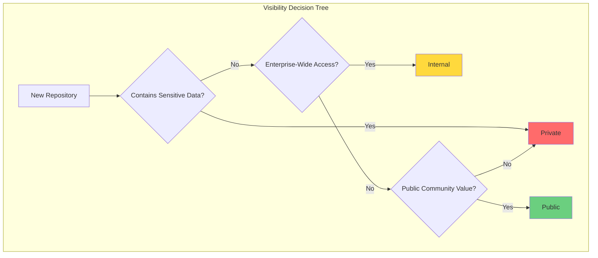
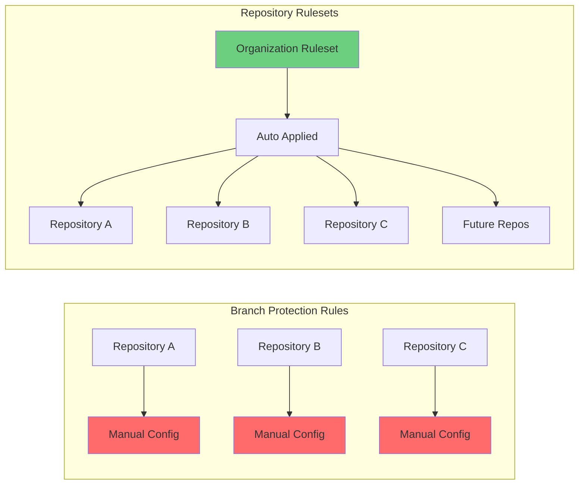
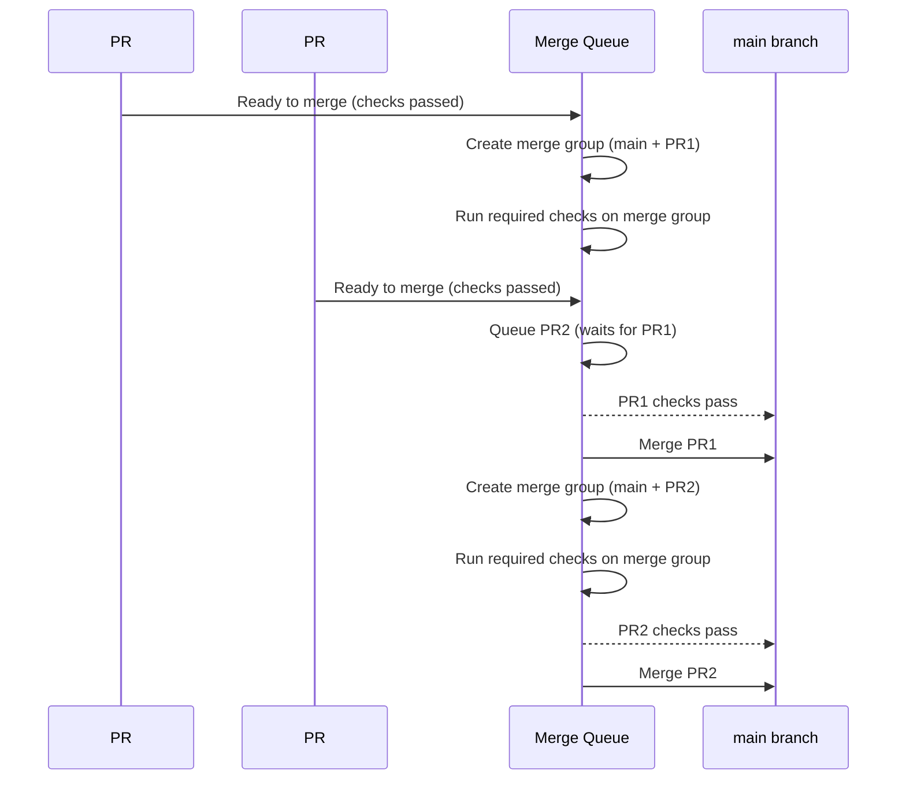
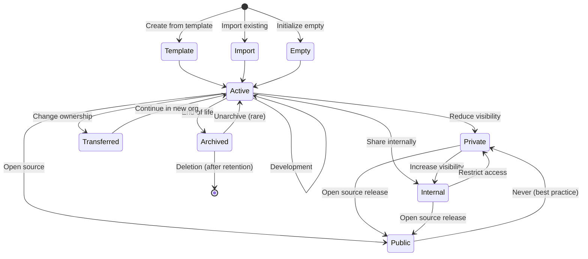

# Repository Governance

**Level:** L400 (Expert)  
**Objective:** Master repository settings, rulesets, and governance patterns for enterprise-scale GitHub deployments

## Overview

Repository governance establishes the policies, standards, and controls that ensure consistency, security, and compliance across your organization's codebase. As organizations scale from dozens to thousands of repositories, governance shifts from manual configuration to automated policy enforcement using repository templates, rulesets, and organization-wide settings.

This guide covers enterprise governance patterns, the evolution from branch protection rules to repository rulesets, and strategies for managing repository lifecycles at scale.

## Repository Visibility Models

GitHub Enterprise Cloud provides three visibility levels that balance collaboration needs with security requirements:

### Public Repositories

**Characteristics:**
- Visible to all GitHub users
- Searchable via GitHub and search engines
- Can accept contributions from external users
- Free unlimited storage and bandwidth

**Use Cases:**
- Open source projects
- Public documentation and marketing sites
- Community-driven tools and libraries
- Public APIs and SDKs

**Security Considerations:**
- No sensitive data, credentials, or proprietary code
- Secret scanning automatically enabled
- Dependency security alerts active by default
- Consider the implications of public issue/PR discussions

### Private Repositories

**Characteristics:**
- Visible only to explicitly granted users
- Not searchable or discoverable externally
- Full access control via teams and collaborators
- Counted against enterprise seat licenses

**Use Cases:**
- Proprietary application code
- Customer-specific implementations
- Internal tools and automation
- Work-in-progress features before public release

**Access Patterns:**
- Grant access via teams (recommended) rather than individuals
- Use read/triage/write/maintain/admin role hierarchy
- Audit access regularly using organization insights
- Implement just-in-time access for contractors

### Internal Repositories

**Characteristics:**
- Available only in GitHub Enterprise Cloud/Server
- Visible to all enterprise members automatically
- Invisible to external collaborators
- Enables innersource collaboration patterns

**Use Cases:**
- Shared libraries and frameworks
- Platform services and APIs
- DevOps tooling and infrastructure code
- Enterprise design systems and component libraries

**Innersource Benefits:**
- Reduces duplication across teams
- Increases code reuse and standardization
- Enables cross-team collaboration without explicit access grants
- Maintains security boundaries for external parties



## Repository Templates and Standardization

Repository templates enable consistent initialization of new repositories with pre-configured files, structure, and settings. This reduces onboarding friction and ensures compliance from day one.

### Template Components

**Essential Files:**
- `README.md` with project structure guidelines
- `.gitignore` for language/framework-specific exclusions
- `LICENSE` file with approved organization license
- `CODEOWNERS` with default ownership rules
- `.github/workflows/` with CI/CD starter templates
- `SECURITY.md` with vulnerability reporting procedures
- `CONTRIBUTING.md` with contribution guidelines
- Dependency manifests with approved baseline packages

**GitHub-Specific Configurations:**
- Issue templates (`.github/ISSUE_TEMPLATE/`)
- Pull request templates (`.github/pull_request_template.md`)
- Funding configuration (`.github/FUNDING.yml`)
- Dependabot configuration (`.github/dependabot.yml`)
- Security policy (`.github/SECURITY.md`)

### Template Strategy Patterns

**1. Monolithic Template:**
- Single template with all possible configurations
- Teams remove unnecessary components
- **Pros:** Comprehensive, nothing forgotten
- **Cons:** Overhead, teams may skip cleanup

**2. Tech Stack Templates:**
- Separate templates per language/framework
- `python-service-template`, `react-app-template`, `go-microservice-template`
- **Pros:** Focused, immediately useful
- **Cons:** More templates to maintain

**3. Tiered Templates:**
- Basic template with minimal structure
- Enhanced templates with additional tooling
- Enterprise template with full compliance
- **Pros:** Flexibility for different project types
- **Cons:** Teams may choose wrong tier

**Best Practice:** Combine approaches with base template + tech-specific additions

### Implementing Template Governance

```bash
# Create a repository template via API
gh api \
  --method PATCH \
  /repos/ORGANIZATION/repo-template \
  -f is_template=true

# Generate new repository from template
gh repo create my-org/new-project \
  --template my-org/repo-template \
  --private \
  --clone

# Audit repositories created from templates
gh api \
  --paginate \
  'orgs/ORGANIZATION/repos?per_page=100' \
  --jq '.[] | select(.template_repository != null) | {name, template: .template_repository.full_name}'
```

**Template Maintenance:**
- Review and update quarterly
- Track template adoption rates
- Survey teams for pain points
- Version templates for major changes
- Document template changelog

## Branch Protection Rules vs Repository Rulesets

GitHub provides two mechanisms for enforcing repository policies: legacy **Branch Protection Rules** and modern **Repository Rulesets**. Understanding when to use each is critical for scalable governance.

### Branch Protection Rules (Legacy)

**Characteristics:**
- Configured per repository
- Applied to branch name patterns (`main`, `release/*`)
- Limited scope and inheritance
- No organization-wide enforcement
- Separate configuration for each repository

**Limitations:**
- No organizational defaults
- Manual configuration at scale requires automation
- Cannot target tags
- Limited bypass mechanisms
- No import/export capability
- Difficult to audit compliance across repos

**When to Use:**
- Single repository or small organizations
- Temporary one-off policies
- Backward compatibility requirements
- Simple linear branch workflows

### Repository Rulesets (Modern Approach)

**Characteristics:**
- Organization or repository scope
- JSON-exportable and importable
- Target branches, tags, or both
- Enforcement and evaluation modes
- Granular bypass permissions
- API-first design for automation

**Key Advantages:**

1. **Organization-Wide Enforcement:**
   - Define once, apply to all repositories
   - Automatic application to new repositories
   - Consistent policy across enterprise

2. **Bypass Actors with Conditions:**
   - Grant exceptions to specific users, teams, or apps
   - Require manual approval for bypass
   - Audit all bypass events
   - Time-based exceptions (via custom apps)

3. **Advanced Targeting:**
   - Include/exclude patterns: `main`, `develop`, `release/**`, `~hotfix/*`
   - Target by repository properties (visibility, template origin)
   - Default branch vs all branches
   - Tag protection with version patterns (`v*`, `v[0-9].[0-9].[0-9]`)

4. **Portability:**
   - Export ruleset as JSON
   - Version control ruleset definitions
   - Import across organizations
   - Disaster recovery and compliance as code

5. **Evaluation Mode:**
   - Test policies without enforcement
   - Gather compliance metrics before blocking
   - Gradual rollout with real data



### Migration Path: Branch Protection to Rulesets

**Phase 1: Assessment**
```bash
# Audit existing branch protection rules
gh api --paginate '/orgs/ORGANIZATION/repos' \
  --jq '.[] | .full_name' | \
  xargs -I {} gh api '/repos/{}/branches/main/protection' 2>/dev/null

# Identify common patterns
# - Required status checks
# - Required reviews
# - Signed commits
# - Linear history requirements
```

**Phase 2: Pilot Ruleset**
1. Create organization ruleset in **Evaluate** mode
2. Monitor compliance via ruleset insights
3. Identify repositories that would fail
4. Address policy violations or adjust ruleset

**Phase 3: Enforcement**
1. Switch ruleset to **Active** mode
2. Communicate changes to development teams
3. Document bypass procedures
4. Disable redundant branch protection rules

**Phase 4: Optimization**
1. Refine targeting based on repository attributes
2. Create specialized rulesets for different project types
3. Automate ruleset updates via API
4. Regular compliance audits

## Repository Ruleset Deep Dive

### Ruleset Structure and Targeting

**Ruleset Components:**

```json
{
  "name": "Production Protection",
  "target": "branch",
  "enforcement": "active",
  "bypass_actors": [
    {
      "actor_id": 1,
      "actor_type": "Team",
      "bypass_mode": "always"
    }
  ],
  "conditions": {
    "ref_name": {
      "include": ["refs/heads/main", "refs/heads/production"],
      "exclude": ["refs/heads/sandbox/*"]
    }
  },
  "rules": [
    {
      "type": "pull_request",
      "parameters": {
        "required_approving_review_count": 2,
        "dismiss_stale_reviews_on_push": true,
        "require_code_owner_review": true,
        "require_last_push_approval": true
      }
    },
    {
      "type": "required_status_checks",
      "parameters": {
        "required_status_checks": [
          {
            "context": "ci/build",
            "integration_id": 12345
          },
          {
            "context": "security/scan"
          }
        ],
        "strict_required_status_checks_policy": true
      }
    },
    {
      "type": "commit_author_email_pattern",
      "parameters": {
        "operator": "ends_with",
        "pattern": "@company.com"
      }
    }
  ]
}
```

### Required Status Checks

Status checks integrate CI/CD systems with merge requirements, ensuring all automated validations pass before code merges.

**Configuration Best Practices:**

1. **Specific Context Names:**
   - Use structured naming: `ci/build`, `security/sast`, `test/unit`
   - Avoid generic names like `build` or `test`
   - Include tool identifiers: `sonarqube/quality-gate`

2. **Strict Status Checks:**
   - Enable "Require branches to be up to date" for `main`
   - Prevents merge races and integration conflicts
   - Increases merge queue wait times (consider merge strategies)

3. **Integration ID Binding:**
   - Lock status checks to specific GitHub App installations
   - Prevents impersonation from similarly-named checks
   - Critical for security-sensitive validations

4. **Exemptions and Bypass:**
   - Allow bot accounts to bypass for automated releases
   - Require manual approval for emergency hotfixes
   - Grant security teams bypass for critical patches

**Common Pitfalls:**
- **Fragile checks:** Status check name changes break policy
- **Overly strict:** Requiring all checks blocks legitimate work
- **Missing checks:** New workflows not added to requirements
- **Circular dependencies:** Status check waits for merge to run

### Required Reviews and CODEOWNERS

Code review requirements enforce quality gates and knowledge distribution across teams.

**Review Configuration:**

```yaml
# Required approving review count: 1, 2, or more
# Considerations:
# - 1 review: Fast, minimal bottleneck, less scrutiny
# - 2 reviews: Balanced, reduces single-point-of-failure
# - 3+ reviews: High-security contexts, slows velocity

# Dismiss stale reviews on push
# - New commits invalidate previous approvals
# - Prevents approval-then-modify pattern
# - Increases back-and-forth but improves safety

# Require review from Code Owners
# - CODEOWNERS file defines ownership
# - Automatic reviewer assignment
# - Can require all owners or any owner

# Require approval of most recent reviewable push
# - Prevents last-second changes after approval
# - Most recent push must have review
# - Reduces "approve and modify" risk
```

**CODEOWNERS Integration:**

```
# Repository root CODEOWNERS
# Each line specifies file pattern and owners

# Global owners (fallback)
* @org/engineering-leads

# Service ownership
/services/auth/ @org/auth-team
/services/billing/ @org/billing-team

# Frontend ownership
/frontend/ @org/frontend-team
*.tsx @org/frontend-team

# Infrastructure as code
*.tf @org/devops
/.github/workflows/ @org/devops @org/security

# Security-sensitive files (multiple owners required)
/config/secrets/ @org/security @org/engineering-leads
SECURITY.md @org/security

# Documentation
/docs/ @org/technical-writers
*.md @org/technical-writers

# Specific file overrides
/docs/security/ @org/security @org/technical-writers
```

**CODEOWNERS Advanced Patterns:**

1. **Hierarchical Ownership:**
   - More specific patterns override general ones
   - Last matching pattern wins
   - Use for escalating sensitivity levels

2. **Shared Ownership:**
   - Multiple teams/individuals on one pattern
   - Any owner can approve (unless "require all")
   - Reduces bottlenecks for cross-team code

3. **Organizational Structure:**
   - Mirror org chart in ownership
   - Align with on-call rotations
   - Consider timezone distribution

4. **Ownership Validation:**
   ```bash
   # Test CODEOWNERS syntax
   gh api \
     -X POST \
     /repos/OWNER/REPO/code-scanning/codeowners/errors
   
   # Identify files without owners
   git ls-files | while read file; do
     owner=$(gh api /repos/OWNER/REPO/contents/"$file" \
       --jq '.codeowners[0].login' 2>/dev/null)
     [[ -z "$owner" ]] && echo "No owner: $file"
   done
   ```

### Signed Commits Requirement

Commit signing cryptographically verifies author identity, preventing impersonation and ensuring commit integrity.

**Signing Methods:**

1. **GPG (GNU Privacy Guard):**
   - Traditional method, widely supported
   - Requires key management infrastructure
   - Works with git command line

2. **SSH Signing:**
   - Uses SSH keys (simpler for users)
   - Supported in Git 2.34+
   - Reuses existing SSH infrastructure

3. **S/MIME:**
   - Certificate-based signing
   - Enterprise PKI integration
   - Less common in GitHub workflows

4. **GitHub Web Commits:**
   - Automatically signed by GitHub
   - No user action required
   - Web UI edits, PR merges, squash commits

**Enforcement Configuration:**

```json
{
  "type": "required_signatures",
  "parameters": {}
}
```

**Implementation Considerations:**

- **Developer Experience:**
  - GPG setup is complex for non-technical users
  - SSH signing reduces friction significantly
  - Provide clear documentation and tooling

- **CI/CD Integration:**
  - Bot accounts need signing keys
  - GitHub Actions can use GITHUB_TOKEN for signed commits
  - Automated releases must handle signing

- **Key Rotation:**
  - Plan for key expiration and renewal
  - Historical commits remain valid with expired keys
  - Document key revocation procedures

- **Verification Enforcement:**
  - Ruleset blocks unsigned commits
  - Rebase operations may strip signatures
  - Force-push restrictions complement signing

**Bypass Scenarios:**
- Emergency hotfix procedures
- Historical repository imports
- Third-party integration commits
- Automated dependency updates (if bot unsigned)

## Tag Protection Rules

Tags mark releases and milestones; protecting them prevents accidental or malicious modification of release history.

**Tag Protection Patterns:**

```
v*              # All version tags
v[0-9].[0-9].*  # Semantic versions only
release-*       # Release candidates
stable/*        # Stable release branches
prod-*          # Production deployments
```

**Tag Ruleset Configuration:**

```json
{
  "name": "Release Tag Protection",
  "target": "tag",
  "enforcement": "active",
  "conditions": {
    "ref_name": {
      "include": ["refs/tags/v*", "refs/tags/release-*"]
    }
  },
  "rules": [
    {
      "type": "creation",
      "parameters": {
        "restricted": true
      }
    },
    {
      "type": "update",
      "parameters": {
        "restricted": true
      }
    },
    {
      "type": "deletion",
      "parameters": {
        "restricted": true
      }
    }
  ],
  "bypass_actors": [
    {
      "actor_id": 123,
      "actor_type": "Team",
      "bypass_mode": "always"
    }
  ]
}
```

**Tag Management Governance:**

1. **Creation Restrictions:**
   - Only release managers can create version tags
   - Automated release workflows via GitHub Actions
   - Pre-tag validation (changelog, tests pass)

2. **Immutability:**
   - Block tag updates after creation
   - Prevents "tag reuse" that confuses dependency managers
   - Forces new version for corrections

3. **Deletion Prevention:**
   - Tags represent historical releases
   - Deletion breaks reproducibility
   - If deletion necessary, requires escalated approval

4. **Signing Integration:**
   - Require signed tags for releases
   - Cryptographic proof of release approval
   - Compatible with GPG/SSH signing

**Anti-Patterns:**
- Reusing tag names (`v1.0` deleted and recreated)
- Unprotected pre-release tags (`alpha-*`, `beta-*`)
- Tag/branch naming conflicts
- Manual tag creation without CI validation

## Push Rulesets and File Path Restrictions

Push rulesets extend governance to file-level granularity, enabling controls based on file paths and content patterns.

**File Path Restriction Use Cases:**

1. **Infrastructure Protection:**
   - Block direct changes to `.github/workflows/` (require PR)
   - Protect Terraform state files from accidental commits
   - Restrict Kubernetes manifests to DevOps team

2. **Security Boundaries:**
   - Prevent credential files (`*.key`, `*.pem`)
   - Block sensitive config paths (`/config/production/`)
   - Restrict security policy modifications

3. **Architecture Governance:**
   - Enforce module boundaries in monorepos
   - Prevent cross-team dependencies
   - Require architectural review for shared library changes

4. **Compliance Requirements:**
   - Immutable audit logs (`/audit/*`)
   - Protected compliance documentation
   - Regulated data schema files

**File Path Ruleset Configuration:**

```json
{
  "name": "Infrastructure File Protection",
  "target": "push",
  "enforcement": "active",
  "rules": [
    {
      "type": "file_path_restriction",
      "parameters": {
        "restricted_file_paths": [
          ".github/workflows/*.yml",
          "terraform/*.tfstate",
          "config/production/*",
          "**/*.key",
          "**/*.pem"
        ]
      }
    },
    {
      "type": "file_extension_restriction",
      "parameters": {
        "restricted_file_extensions": [
          ".exe",
          ".dll",
          ".so",
          ".dylib"
        ]
      }
    }
  ]
}
```

**Commit Metadata Rules:**

```json
{
  "rules": [
    {
      "type": "commit_message_pattern",
      "parameters": {
        "operator": "starts_with",
        "pattern": "^(feat|fix|docs|chore|refactor|test):"
      }
    },
    {
      "type": "commit_author_email_pattern",
      "parameters": {
        "operator": "ends_with",
        "pattern": "@company.com"
      }
    },
    {
      "type": "committer_email_pattern",
      "parameters": {
        "operator": "ends_with",
        "pattern": "@company.com"
      }
    }
  ]
}
```

**Advanced Push Rules:**

- **Maximum file size:** Block large binary commits
- **Maximum file path length:** Prevent Windows compatibility issues
- **Branch name patterns:** Enforce naming conventions
- **Non-fast-forward prevention:** Block force pushes

**Implementation Strategy:**

1. **Start with Evaluate Mode:**
   - Monitor violations without blocking
   - Identify legitimate vs problematic patterns
   - Adjust rules based on real usage

2. **Gradual Rollout:**
   - Apply to new repositories first
   - Test with pilot teams
   - Full enforcement after refinement

3. **Clear Communication:**
   - Document allowed and blocked patterns
   - Provide workaround procedures
   - Offer bypass request process

4. **Automated Remediation:**
   - Pre-commit hooks for local validation
   - CI checks that duplicate restrictions
   - Helpful error messages with solutions

## Merge Strategies and Settings

Merge strategies determine how pull requests integrate into target branches, affecting git history, bisectability, and workflow patterns.

### Merge Method Comparison

| Method | History | Bisectable | Use Case |
|--------|---------|------------|----------|
| **Merge Commit** | Full PR history preserved | Yes, each commit | Long-lived feature branches, detailed history needed |
| **Squash and Merge** | Single commit per PR | Yes, by PR | Clean history, work-in-progress commits, GitHub Flow |
| **Rebase and Merge** | Linear history, all commits | Yes, each commit | Linear history preference, polished commits required |

**Merge Commit:**
```
main:     A---B-------E---F
               \     /
feature:        C---D
```
- Preserves all feature branch commits
- Creates merge commit (E) with two parents
- Easy to identify when feature merged
- Can clutter history with "wip" commits

**Squash and Merge:**
```
main:     A---B---C'
               
feature:        C₁---C₂---C₃  (not in main history)
```
- Combines all feature commits into single commit (C')
- PR description becomes commit message
- Clean linear history
- Loses granular commit history

**Rebase and Merge:**
```
main:     A---B---C---D
```
- Replays feature commits on top of base
- No merge commit created
- Linear history maintained
- Requires clean, meaningful commits

### Merge Queue

Merge queue serializes pull request merges to prevent integration failures when multiple PRs pass checks but conflict when combined.

**Problem Without Merge Queue:**
1. PR #1 passes checks against `main` at commit A
2. PR #2 passes checks against `main` at commit A
3. PR #1 merges to `main` (now at commit B)
4. PR #2 merges to `main` (now at commit C)
5. **Result:** Commit C may break despite both PRs passing individually

**Merge Queue Solution:**



**Merge Queue Configuration:**

```yaml
# .github/merge_queue.yml
merge_method: squash
min_queue_size: 2
max_queue_size: 10
merge_group_batch_size: 5
ci_status_timeout: 60
```

**Parameters:**

- **Merge Method:** Enforces consistent merge strategy
- **Minimum Queue Size:** Wait for N PRs before creating groups (batching)
- **Maximum Queue Size:** Limit concurrent testing
- **Batch Size:** Test multiple PRs together (faster but risk of failure)
- **CI Timeout:** Cancel stalled checks

**When to Enable:**
- High-frequency merges (multiple per hour)
- Strict status checks with long CI runs
- Flaky tests that occasionally fail
- Cross-PR dependencies and conflicts

**Bypass Patterns:**
- Emergency hotfixes (with appropriate approvals)
- Documentation-only changes
- Automated dependency updates (grouped separately)

### Repository Merge Settings

**Auto-Merge:**
- PR author enables auto-merge
- Automatically merges when checks pass and approvals met
- Reduces manual monitoring and click-through

**Automatic Branch Deletion:**
- Deletes head branch after PR merge
- Reduces branch clutter
- Preserves branch in PR for audit trail

**Allow/Disallow Merge Types:**
- Organization or repository level
- Restrict to single method for consistency
- Or allow flexibility based on PR content

**Suggestions:**
- **GitHub Flow (single long-lived branch):** Squash-only
- **Git Flow (feature/release branches):** Merge commit or rebase
- **Trunk-Based Development:** Squash or rebase
- **Monorepos with team boundaries:** Merge commit for traceability

## Repository Lifecycle Management



### Repository States

**Active:**
- Normal development state
- All features enabled (issues, PRs, Actions)
- Team members can push/merge
- Full automation and integrations

**Archived:**
- Read-only state
- No new issues, PRs, or commits
- Existing content remains accessible
- Reduces clutter in repository lists
- Can be unarchived if needed

**Transferred:**
- Ownership moved to different org/user
- Preserves full history and metadata
- Redirects from old URL (temporarily)
- Access control reset to destination org

**Deleted:**
- Permanent removal (after 90-day recovery period)
- All data destroyed after recovery window
- Forks remain unaffected
- Should be rare, prefer archival

### Archival Policies

**When to Archive:**

1. **Project Completion:**
   - One-time deliverables finished
   - Documentation/research projects concluded
   - Pilot/POC no longer maintained

2. **Superseded by Successor:**
   - Code migrated to new repository
   - Rewrite or major refactor in new location
   - Archive old, link to new in README

3. **Abandoned/Deprecated:**
   - No development for extended period (6-12 months)
   - Technology stack obsolete
   - Business need eliminated

4. **Compliance Requirements:**
   - Regulatory retention periods met
   - Data must be preserved but not modified
   - Audit trail preservation

**Archival Process:**

```bash
# Pre-archival checklist
# 1. Update README with archive notice
echo "# ⚠️ ARCHIVED\n\nThis repository is archived and no longer maintained.\n\n**Reason:** Project completed\n**Date:** $(date +%Y-%m-%d)\n**Successor:** https://github.com/org/new-repo\n\n$(cat README.md)" > README.md

# 2. Create final release/tag
git tag -a "archive-$(date +%Y%m%d)" -m "Archived on $(date +%Y-%m-%d)"
git push origin "archive-$(date +%Y%m%d)"

# 3. Archive repository
gh repo archive OWNER/REPO --yes

# 4. Update organization documentation
# Add to "Archived Projects" list
```

**Post-Archival:**
- Issues and PRs remain readable
- README should explain archive status
- Link to successor or migration docs
- Security alerts disabled (no patches needed)

**Unarchive Scenarios:**
- Critical bug discovery requiring fix
- Dependency revival by community
- Historical research requiring modification
- Mistaken archival

### Transfer Policies

Repository transfers change ownership between users or organizations, requiring careful planning to maintain continuity.

**Transfer Scenarios:**

1. **Organizational Restructuring:**
   - Team split into separate org
   - Acquisition/merger consolidation
   - Open source → enterprise fork

2. **Visibility Changes:**
   - Personal project → organization
   - Incubation project → official product
   - Experimental → production

3. **Vendor/Customer Handoff:**
   - Consultant deliverable transfer
   - Customer-specific implementation
   - Outsourced development completion

**Transfer Implications:**

| Aspect | Impact | Mitigation |
|--------|--------|------------|
| **URLs** | Redirect created temporarily | Update CI/CD and docs |
| **Access** | Reset to destination org teams | Pre-configure teams |
| **Secrets** | Not transferred | Document and recreate |
| **Actions** | Workflow runs lost | Archive artifacts first |
| **Apps** | Webhooks may break | Update app configurations |
| **Forks** | Remain at original location | Fork relationships preserved |

**Transfer Process:**

```bash
# 1. Audit dependencies
gh repo view OWNER/REPO --json url,sshUrl
grep -r "github.com/OWNER/REPO" .

# 2. Document integrations
gh api /repos/OWNER/REPO/hooks
gh api /repos/OWNER/REPO/keys

# 3. Export issues/PRs if needed
gh issue list --repo OWNER/REPO --json number,title,state --limit 1000 > issues.json

# 4. Perform transfer
gh repo transfer OWNER/REPO NEW_OWNER

# 5. Update references
find . -type f -exec sed -i 's/OWNER\/REPO/NEW_OWNER\/REPO/g' {} +
```

**Post-Transfer Checklist:**
- Verify webhook configurations
- Re-add deploy keys and secrets
- Test CI/CD pipelines
- Update documentation links
- Notify stakeholders and teams
- Monitor for broken integrations

## Innersource Patterns with Internal Repositories

Innersource applies open source collaboration patterns within organizational boundaries, leveraging internal repositories to balance openness with security.

### Innersource Benefits

**Code Reuse:**
- Discover existing solutions before building new
- Reduce duplication across teams
- Share libraries and frameworks enterprise-wide

**Knowledge Distribution:**
- Learn from other teams' approaches
- Cross-pollinate ideas and patterns
- Break down organizational silos

**Quality Improvement:**
- Broader review audience
- More eyes on security and performance
- Community-driven improvements

**Talent Development:**
- Exposure to different codebases
- Mentorship opportunities across teams
- Career mobility within organization

### Innersource Governance Models

**1. Open Contribution Model:**
- All employees can read and contribute
- Automated approval for minor changes
- Core team review for major changes
- Fast iteration, broad engagement

**2. Gatekeeper Model:**
- All employees can read
- Contributions require proposal/RFC
- Core team controls acceptance
- Higher quality bar, slower pace

**3. Federated Model:**
- Multiple teams co-maintain
- Rotating responsibilities
- Shared on-call for support
- Distributed ownership

**4. Platform Model:**
- Centralized platform team maintains
- Other teams consume as dependencies
- Contributions accepted but not required
- Clear support and SLA expectations

### Setting Up Innersource Repositories

**Repository Configuration:**

```yaml
# .github/INNERSOURCE.md
# Innersource Project: Cloud SDK

## Vision
Provide a unified SDK for internal cloud services.

## Maintainers
- @platform-team (primary)
- @devex-team (secondary)

## Contributing
1. Check existing issues/PRs for duplicates
2. Open an issue to discuss before significant work
3. Follow coding standards in CONTRIBUTING.md
4. Ensure tests pass and coverage maintained
5. Request review from CODEOWNERS

## Support
- Slack: #cloud-sdk-help
- Office hours: Tuesdays 2-3pm
- SLA: 48-hour response on issues

## Usage Statistics
- 47 internal repositories depend on this SDK
- 230 active contributors across 12 teams
- 98% test coverage
```

**Discovery Mechanisms:**

1. **Topics and Tags:**
   - `innersource`, `platform`, `library`, `framework`
   - Tech stack tags: `typescript`, `python`, `kubernetes`
   - Team ownership: `team-platform`, `team-devex`

2. **Organization README:**
   - Curated list of innersource projects
   - Getting started guides
   - Contribution paths for beginners

3. **GitHub Search:**
   ```bash
   # Find internal libraries
   gh search repos --visibility internal --topic library --sort stars
   
   # Find projects by tech stack
   gh search repos --visibility internal --language typescript --sort updated
   ```

4. **Dependency Graphs:**
   - Automatic discovery via `package.json`, `go.mod`, `pom.xml`
   - GitHub's dependency graph shows usage
   - Renovate/Dependabot highlight internal dependencies

**Innersource Metrics:**

```bash
# Contribution diversity
gh api /repos/ORG/REPO/stats/contributors \
  | jq 'group_by(.author.login) | length'

# Issue response time
gh issue list --repo ORG/REPO --json createdAt,closedAt --limit 100 \
  | jq '[.[] | select(.closedAt != null) | 
    ((.closedAt | fromdateiso8601) - (.createdAt | fromdateiso8601)) / 86400] 
    | add / length'

# Cross-team participation
gh pr list --repo ORG/REPO --json author --limit 200 \
  | jq '[.[].author.login] | unique | length'
```

### Innersource Challenges and Solutions

**Challenge: Undiscoverability**
- **Solution:** Mandatory topics, organization README, monthly showcases

**Challenge: Unclear Ownership**
- **Solution:** CODEOWNERS, INNERSOURCE.md with SLAs, escalation paths

**Challenge: Contribution Friction**
- **Solution:** Beginner-friendly issues, pair programming sessions, templates

**Challenge: Quality Control**
- **Solution:** Rulesets enforce standards, automated testing, code review guidelines

**Challenge: Sustainability**
- **Solution:** Dedicated maintainer time, rotation schedules, executive sponsorship

**Challenge: Competing Priorities**
- **Solution:** Product/platform balance in team OKRs, contribution credit in performance reviews

## Governance at Scale

### Organization-Wide Patterns

**Repository Naming Conventions:**
```
<team>-<project>-<type>
  platform-auth-service
  mobile-ios-app
  data-analytics-pipeline
  
<product>-<component>
  checkout-api
  checkout-frontend
  checkout-workers
```

**Benefits:**
- Alphabetical grouping by team
- Clear ownership and purpose
- Search and filter efficiency

**Default Settings Management:**

```bash
# Set organization defaults via API
gh api \
  --method PATCH \
  /orgs/ORGANIZATION \
  -f default_repository_permission='read' \
  -f members_can_create_repositories=false \
  -f members_can_create_public_repositories=false

# Apply settings to all repositories
gh repo list ORGANIZATION --limit 1000 --json name -q '.[].name' | \
while read repo; do
  gh api --method PATCH "/repos/ORGANIZATION/$repo" \
    -f has_issues=true \
    -f has_projects=false \
    -f has_wiki=false \
    -f delete_branch_on_merge=true \
    -f allow_squash_merge=true \
    -f allow_merge_commit=false \
    -f allow_rebase_merge=false
done
```

**Ruleset Hierarchy:**

```
Organization Level:
  ├─ Critical Security (all repos)
  │  ├─ Signed commits required
  │  ├─ No secrets in commits
  │  └─ Dependabot enabled
  │
  ├─ Production Standards (production repos)
  │  ├─ Required reviews: 2
  │  ├─ Required status checks
  │  └─ No force push
  │
  └─ Experimental (sandboxes)
     └─ Relaxed rules

Repository Level (additive):
  └─ Project-Specific
     ├─ Additional status checks
     ├─ Project CODEOWNERS
     └─ Custom file restrictions
```

### Compliance and Auditing

**Audit Trails:**

```bash
# Recent repository changes
gh api /orgs/ORGANIZATION/audit-log \
  --paginate \
  -f phrase='action:repo.*' \
  -f per_page=100

# Ruleset compliance violations
gh api /orgs/ORGANIZATION/rulesets/insights \
  --jq '.violations[] | {repo: .repository.name, rule: .rule_type, user: .actor.login}'

# Access reviews
gh api /orgs/ORGANIZATION/outside_collaborators --paginate \
  | jq '.[] | {login, permissions}'

# Branch protection audit
gh repo list ORGANIZATION --json nameWithOwner --limit 1000 \
  | jq -r '.[].nameWithOwner' \
  | xargs -I {} gh api /repos/{}/branches/main/protection 2>/dev/null
```

**Compliance Reporting:**

| Control | Requirement | Validation |
|---------|-------------|------------|
| **Access Control** | Minimum 2FA for org members | `gh api /orgs/ORG/members?filter=2fa_disabled` |
| **Code Review** | All changes reviewed | Ruleset enforcement + audit log |
| **Vulnerability Mgmt** | Dependabot enabled | `gh api /repos/ORG/REPO/vulnerability-alerts` |
| **Secrets Detection** | Secret scanning enabled | Org security settings + alerts |
| **Least Privilege** | Teams used vs individuals | Permission audit script |
| **Data Retention** | Archived repos per policy | Repo age + last update query |

**Automated Compliance:**

```yaml
# .github/workflows/compliance-audit.yml
name: Compliance Audit
on:
  schedule:
    - cron: '0 2 * * 1'  # Weekly Monday 2am
  workflow_dispatch:

jobs:
  audit:
    runs-on: ubuntu-latest
    steps:
      - name: Check 2FA Enforcement
        run: |
          DISABLED=$(gh api /orgs/${{ github.repository_owner }}/members?filter=2fa_disabled | jq length)
          if [ "$DISABLED" -gt 0 ]; then
            echo "::error::$DISABLED members without 2FA"
            exit 1
          fi
      
      - name: Verify Dependabot
        run: |
          gh repo list ${{ github.repository_owner }} --limit 1000 --json name | \
          jq -r '.[].name' | \
          while read repo; do
            enabled=$(gh api /repos/${{ github.repository_owner }}/$repo/vulnerability-alerts 2>&1)
            if [[ $enabled == *"Not Found"* ]]; then
              echo "::warning::Dependabot disabled on $repo"
            fi
          done
      
      - name: Audit Ruleset Coverage
        run: |
          # Get all rulesets
          rulesets=$(gh api /orgs/${{ github.repository_owner }}/rulesets --jq '.[] | .id')
          
          # Verify critical rulesets exist
          echo "$rulesets" | grep -q "Production Protection" || \
            echo "::error::Missing Production Protection ruleset"
```

### Migration and Change Management

**Phased Rollout Strategy:**

1. **Pilot Phase (Week 1-2):**
   - Select 3-5 representative teams
   - Apply rulesets in Evaluate mode
   - Gather feedback and metrics

2. **Refinement Phase (Week 3-4):**
   - Adjust rules based on violations
   - Document bypass procedures
   - Create FAQ and troubleshooting guide

3. **Gradual Rollout (Week 5-8):**
   - Enable for 25% of repositories
   - Monitor incident rate and support requests
   - Expand to 50%, then 75%

4. **Full Enforcement (Week 9+):**
   - All repositories covered
   - Automated compliance checking
   - Regular review and adjustment

**Communication Plan:**

- **T-30 days:** Announce upcoming changes, rationale, timeline
- **T-14 days:** Technical deep-dive sessions for engineers
- **T-7 days:** Office hours for questions, bypass request process
- **T-1 day:** Final reminder, support channels highlighted
- **T-day:** Enable in Evaluate mode, monitor closely
- **T+7 days:** Switch to Active enforcement
- **T+30 days:** Retrospective, refine approach

**Rollback Procedures:**

```bash
# Disable ruleset temporarily
gh api \
  --method PATCH \
  /orgs/ORGANIZATION/rulesets/RULESET_ID \
  -f enforcement='disabled'

# Export current config before changes
gh api /orgs/ORGANIZATION/rulesets/RULESET_ID > ruleset-backup.json

# Restore previous version
gh api \
  --method PUT \
  /orgs/ORGANIZATION/rulesets/RULESET_ID \
  --input ruleset-backup.json
```

## Best Practices Summary

### Repository Governance

✅ **Do:**
- Use internal visibility for enterprise-wide sharing
- Create technology-specific repository templates
- Implement organization-level rulesets for consistency
- Require code review from CODEOWNERS
- Enable merge queue for high-traffic repositories
- Archive completed/deprecated projects
- Document bypass procedures clearly
- Monitor compliance via audit logs

❌ **Don't:**
- Use public visibility for sensitive code
- Manually configure each repository individually
- Grant repository admin access broadly
- Allow force pushes to protected branches
- Let archived repositories accumulate unchecked
- Delete repositories (archive instead)
- Create overly restrictive rules without escape hatches
- Ignore ruleset violations in Evaluate mode

### Ruleset Configuration

✅ **Do:**
- Start with Evaluate mode before enforcement
- Use specific status check context names
- Bind checks to specific integration IDs
- Configure bypass actors for emergency access
- Export and version control ruleset JSON
- Document each rule's purpose and rationale
- Test rulesets on pilot repositories first

❌ **Don't:**
- Skip the evaluation period
- Use generic check names like "build" or "test"
- Grant bypass access to large groups
- Modify rulesets without change control
- Enable all rules simultaneously
- Create rules without escape procedures
- Assume rulesets work identically across repos

### Innersource Success

✅ **Do:**
- Make internal repositories discoverable via topics
- Define clear ownership and SLAs
- Create beginner-friendly contribution paths
- Recognize contributions in performance reviews
- Provide dedicated maintainer time
- Host regular showcases and demos
- Measure contribution diversity

❌ **Don't:**
- Assume discoverability without active promotion
- Leave ownership ambiguous
- Set high barriers to first contribution
- Treat innersource as "extra" work
- Let repositories stagnate without maintenance
- Silo knowledge within single teams
- Focus only on commit counts

## References

### Official Documentation

- [Repository Settings and Features](https://docs.github.com/en/enterprise-cloud@latest/repositories/managing-your-repositorys-settings-and-features) - Comprehensive guide to repository configuration options
- [Managing Branch Protection Rules](https://docs.github.com/en/repositories/configuring-branches-and-merges-in-your-repository/defining-the-mergeability-of-pull-requests/managing-a-branch-protection-rule) - Legacy branch protection configuration
- [About Repository Rulesets](https://docs.github.com/en/enterprise-cloud@latest/repositories/configuring-branches-and-merges-in-your-repository/managing-rulesets/about-rulesets) - Modern ruleset capabilities and advantages
- [Creating Rulesets for Repositories](https://docs.github.com/en/enterprise-cloud@latest/repositories/configuring-branches-and-merges-in-your-repository/managing-rulesets/creating-rulesets-for-a-repository) - Step-by-step ruleset configuration
- [Managing Code Review Settings](https://docs.github.com/en/repositories/configuring-branches-and-merges-in-your-repository/defining-the-mergeability-of-pull-requests/about-protected-branches#require-pull-request-reviews-before-merging) - Pull request review requirements
- [About Code Owners](https://docs.github.com/en/repositories/managing-your-repositorys-settings-and-features/customizing-your-repository/about-code-owners) - CODEOWNERS file syntax and behavior
- [Managing Merge Queue](https://docs.github.com/en/repositories/configuring-branches-and-merges-in-your-repository/configuring-pull-request-merges/managing-a-merge-queue) - Merge queue configuration and usage
- [About Commit Signature Verification](https://docs.github.com/en/authentication/managing-commit-signature-verification/about-commit-signature-verification) - GPG and SSH commit signing
- [About Tag Protection Rules](https://docs.github.com/en/repositories/managing-your-repositorys-settings-and-features/managing-repository-settings/configuring-tag-protection-rules) - Protecting release tags
- [Archiving Repositories](https://docs.github.com/en/repositories/archiving-a-github-repository/archiving-repositories) - Repository archival procedures
- [Transferring a Repository](https://docs.github.com/en/repositories/creating-and-managing-repositories/transferring-a-repository) - Ownership transfer process

### Related Documentation

- [06-policy-inheritance.md](./06-policy-inheritance.md) - Organization and enterprise-level policy inheritance affecting repository settings
- [05-teams-permissions.md](./05-teams-permissions.md) - Team-based access control and permission levels for repositories
- [08-security-compliance.md](./08-security-compliance.md) - Security settings, secret scanning, and compliance requirements

### Additional Resources

- [GitHub Blog: Repository Rulesets GA](https://github.blog/changelog/2023-07-24-github-repository-rules-now-generally-available/) - Announcement and feature overview
- [Innersource Commons](https://innersourcecommons.org/) - Patterns and best practices for innersource
- [Git Flow vs GitHub Flow](https://docs.github.com/en/get-started/quickstart/github-flow) - Branching strategies and merge patterns
- [Semantic Versioning](https://semver.org/) - Version numbering for tag protection strategies
