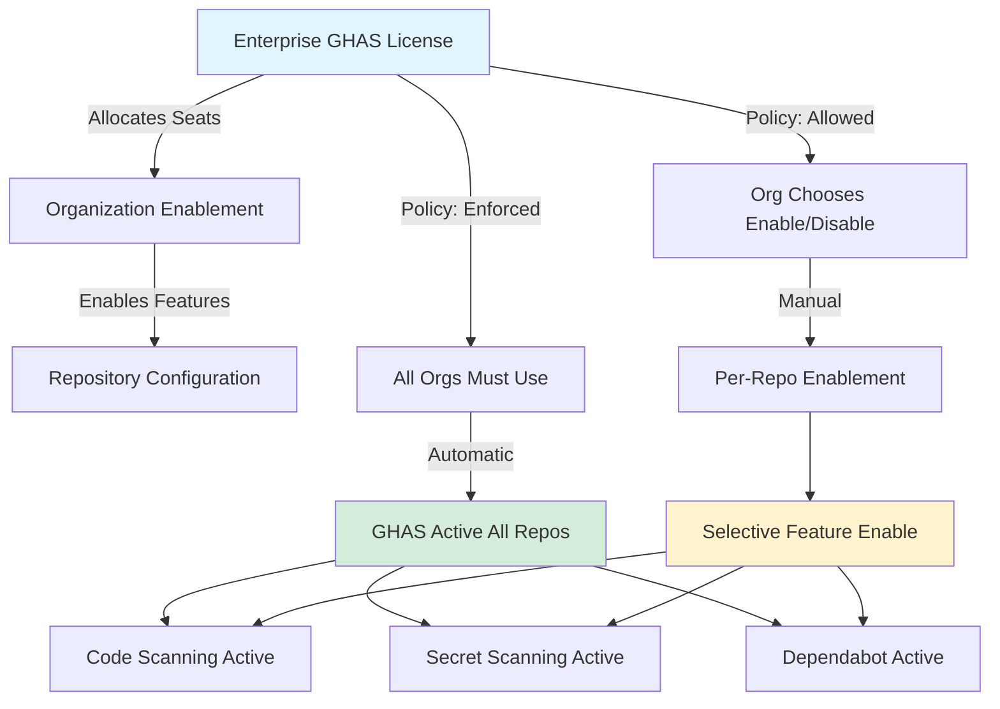
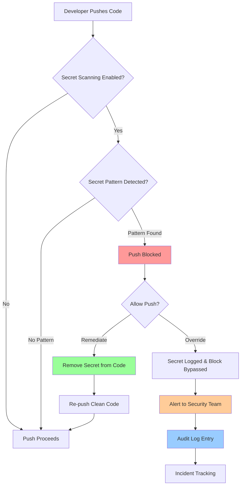
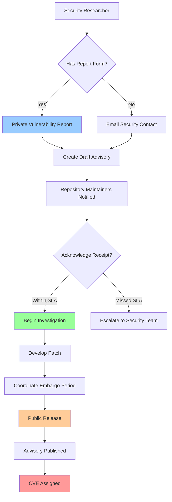
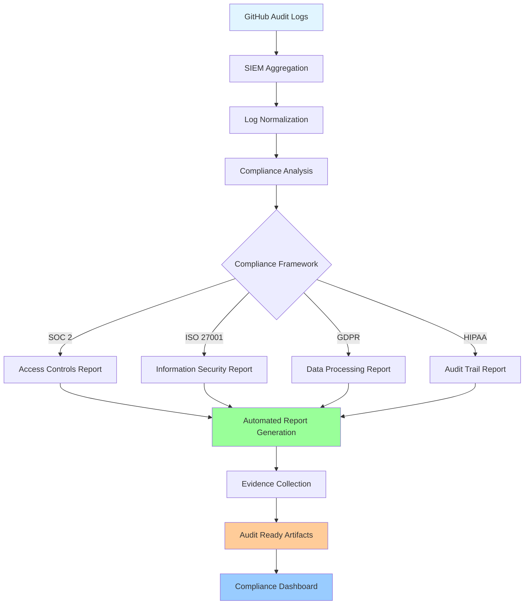
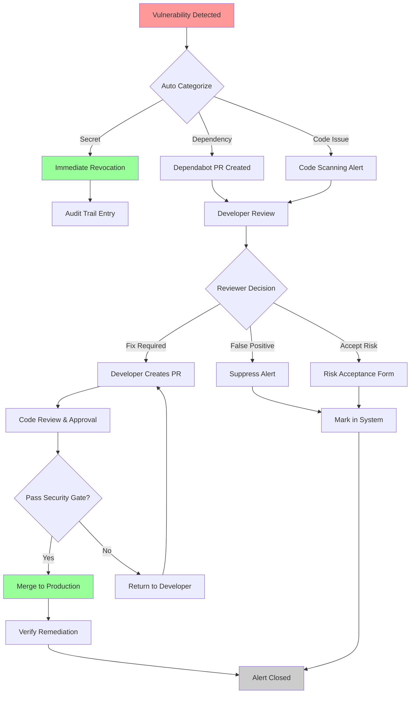

# Security and Compliance

## Overview

GitHub Enterprise Cloud provides enterprise-grade security capabilities and compliance controls that enable organizations to protect intellectual property, secure software supply chains, and meet regulatory requirements. The GitHub Advanced Security (GHAS) suite delivers integrated security features that operate natively within the development workflow, enabling security teams to shift left while maintaining developer velocity.

Security in GitHub Enterprise Cloud operates across multiple layers: code-level security through static analysis and secret detection, supply chain security through dependency management, access security through identity controls, and operational security through audit logging and compliance monitoring. Each layer integrates with enterprise policy frameworks, enabling centralized governance while allowing organizational autonomy within defined boundaries.

Modern compliance requirements demand not just security controls but also evidence collection, audit trails, and continuous monitoring capabilities. GitHub Enterprise Cloud addresses these requirements through comprehensive audit logging, SIEM integration, security advisories, and certifications aligned with industry standards including SOC 2, ISO 27001, FedRAMP, and GDPR. Understanding these capabilities and their enterprise-scale implementation patterns is essential for security architects and compliance officers.

This document explores the technical architecture, configuration patterns, and operational practices for implementing security and compliance at enterprise scale. It covers GitHub Advanced Security features, vulnerability management workflows, compliance automation, and integration patterns with enterprise security infrastructure.

## GitHub Advanced Security (GHAS)

### Architecture and Components

GitHub Advanced Security represents an integrated security platform built directly into the GitHub development workflow. Unlike bolt-on security tools that operate externally, GHAS features are embedded in the code review process, pull request workflows, and repository security tabs, creating a frictionless security experience that encourages adoption and remediation.

GHAS consists of three primary security scanning capabilities:

**Code Scanning** analyzes source code for security vulnerabilities, coding errors, and quality issues using semantic analysis engines. The primary engine, CodeQL, performs deep static analysis by treating code as queryable data, enabling complex security pattern detection that goes beyond simple pattern matching.

**Secret Scanning** monitors repositories for accidentally committed credentials, API keys, tokens, and other sensitive data. It operates continuously, scanning historical commits, new pushes, and pull requests. Push protection extends this capability by preventing secrets from being committed in the first place.

**Dependency Scanning** through Dependabot identifies vulnerable dependencies in project manifests and lockfiles across multiple ecosystems. It provides automated pull requests for dependency updates, security patches, and version upgrades, enabling proactive vulnerability management.

These three pillars work together to provide comprehensive security coverage across the software development lifecycle, from initial commit through production deployment.

### Licensing and Enablement

GitHub Advanced Security is licensed per active committer at the enterprise level. An active committer is defined as any user who has made at least one commit to a GHAS-enabled repository in the previous 90 days. This consumption-based licensing model ensures organizations only pay for security coverage on actively developed codebases.

Enablement follows the enterprise policy hierarchy:



Enterprise administrators can enforce GHAS enablement through enterprise policies, requiring organizations to enable features on all repositories, or allow organizations to selectively enable GHAS on specific repositories based on criticality, compliance requirements, or development maturity.

### Security Configurations at Scale

Implementing GHAS across enterprise organizations requires standardized security posture management while respecting organizational autonomy. This involves:

**Baseline Security Policies**: Establish minimum security standards across all organizations through enterprise policies. These may include mandatory code scanning on critical repositories, mandatory secret scanning with push protection, and required dependency vulnerability reviews before merge.

**Organization Inheritance Hierarchy**: As described in [Policy Inheritance Architecture (Doc 06)](./06-policy-inheritance.md), security configurations flow from enterprise to organization to repository levels. GHAS enablement policies cascade through this hierarchy, with organizations inheriting enterprise mandates while adding organization-specific controls.

**Tiered Implementation Levels**: Organizations should classify repositories into tiers (critical, important, standard) and apply proportionate security scanning configurations. Critical repositories might require all GHAS features with strict blocking policies, while standard repositories enable core scanning with advisory-only configurations.

**Security Scanning Strategy**: Define scanning frequency (continuous on PR, scheduled full scans), retention policies (how long to keep historical results), and alert management rules. Different repositories may require different strategies based on risk profile and development velocity.

**Compliance-Driven Configuration**: For regulated codebases (healthcare, financial services, government), security configurations must align with compliance frameworks. This includes enabling all scanning features, maintaining complete audit trails, and implementing alerting for compliance-critical vulnerabilities.

## Code Scanning with CodeQL

### Overview and Enablement

Code scanning uses static analysis engines to identify security vulnerabilities, code quality issues, and compliance violations in source code. GitHub's primary engine, CodeQL, performs deep semantic analysis by converting source code into a queryable database, enabling detection of complex vulnerability patterns that would be impossible with simple regex-based scanning.

CodeQL analysis operates through multiple phases:

1. **Database Generation**: Source code is compiled or interpreted, and an abstract syntax tree (AST) is generated and stored as a relational database
2. **Query Execution**: Security queries written in CodeQL Query Language execute against this database, identifying vulnerability patterns
3. **Result Aggregation**: Findings are deduplicated, ranked by severity, and presented in the GitHub UI with remediation guidance

### Default Setup vs Advanced Configuration

**Default Setup** provides pre-configured CodeQL scanning with GitHub-maintained queries covering OWASP Top 10, CWE Top 25, and common security anti-patterns. Default setup automatically:

- Detects the repository's primary language(s)
- Downloads pre-built CodeQL databases for compiled languages
- Executes GitHub-maintained query suites
- Reports findings as code scanning alerts in the Security tab
- Runs on pull requests and on a weekly schedule

Default setup is ideal for:
- Standard applications with single or dual primary languages
- Teams new to GHAS adoption
- Projects with straightforward build configurations
- Rapid enablement across many repositories

**Advanced Configuration** through workflow files (`codeql-analysis.yml` or similar) provides full control over the scanning process:

```yaml
name: CodeQL Advanced Analysis

on:
  push:
    branches: [main, develop]
  pull_request:
    branches: [main]
  schedule:
    - cron: '0 2 * * 0'

jobs:
  analyze:
    runs-on: ubuntu-latest
    permissions:
      contents: read
      security-events: write
    
    strategy:
      matrix:
        language: [java, python, javascript]
        include:
          - language: java
            build-mode: manual
          - language: javascript
            build-mode: none
    
    steps:
      - uses: actions/checkout@v3
      
      - name: Initialize CodeQL
        uses: github/codeql-action/init@v2
        with:
          languages: ${{ matrix.language }}
          build-mode: ${{ matrix.build-mode }}
          queries: security-and-quality
          config-file: .github/codeql-config.yml
      
      - name: Build
        if: matrix.build-mode == 'manual'
        run: |
          ./build-scripts/compile.sh
      
      - name: Perform CodeQL Analysis
        uses: github/codeql-action/analyze@v2
        with:
          category: "/${{ matrix.language }}-analysis"
```

Advanced configuration enables:
- Multi-language scanning with language-specific build processes
- Custom CodeQL query suites combining GitHub, community, and proprietary queries
- Granular build mode control (autobuild, manual, none)
- Integration with build caching and artifact management
- Fine-grained control over query execution and result filtering

### CodeQL Query Language

CodeQL Query Language is a declarative language designed for code analysis. Queries treat code as data, enabling complex vulnerability pattern detection:

```codeql
// Example: Detect potential SQL injection vulnerabilities
import java

class SqlInjectionVulnerability extends DataFlow::Configuration {
  SqlInjectionVulnerability() { this = "sql-injection" }
  
  override predicate isSource(DataFlow::Node source) {
    source.asExpr() instanceof ParameterExpr or
    source.asExpr() instanceof FieldAccess
  }
  
  override predicate isSink(DataFlow::Node sink) {
    exists(MethodCall m |
      m.getMethod().hasName("executeQuery") or
      m.getMethod().hasName("execute") |
      sink.asExpr() = m.getArgument(0)
    )
  }
}

from SqlInjectionVulnerability config, DataFlow::PathNode source, DataFlow::PathNode sink
where config.hasFlowPath(source, sink)
select source.getNode(), source, sink, "Potential SQL injection from user input"
```

Key concepts:
- **Data Flow Analysis**: Tracks how data flows through programs, identifying when untrusted input reaches sensitive operations
- **Taint Analysis**: Marks user-controlled data as tainted, following it through transformations to detect vulnerabilities
- **Predicates**: Reusable logical definitions (sources, sinks, sanitizers) that define vulnerability patterns
- **Path Finding**: Explains the exact code path from vulnerability source to sink

Organizations can create custom queries for:
- Industry-specific compliance violations (GDPR data handling, HIPAA encryption)
- Internal coding standards enforcement
- Architecture anti-pattern detection
- Framework-specific vulnerabilities

### Severity Levels and Alert Management

CodeQL findings are categorized by severity:

| Severity | Definition | Response Time | Example |
|----------|-----------|---|---------|
| **Critical** | Immediate risk to security or data integrity | 1-4 hours | Remote Code Execution, Authentication Bypass, SQL Injection |
| **High** | Significant security exposure requiring urgent remediation | 1-2 days | Hardcoded credentials, Insecure deserialization, Path traversal |
| **Medium** | Important but not immediately exploitable vulnerabilities | 1-2 weeks | Information disclosure, Insecure cryptographic practices |
| **Low** | Coding anti-patterns with indirect security implications | 1-2 months | Use of deprecated APIs, Potential null pointer dereference |
| **Note** | Code quality and maintainability issues | No SLA | Code duplication, Complex logic patterns |

Each security level has an associated Cost of Remediation Index (CRI):
- Critical: CRI = 1 (must fix before merge in critical repos)
- High: CRI = 0.8 (should fix before merge, exceptions allowed with risk acceptance)
- Medium: CRI = 0.5 (fix within sprint, not blocking)
- Low: CRI = 0.2 (accumulate and batch fix)

### Build Mode and Multi-Language Analysis

CodeQL analysis requires understanding the source code structure, which varies by language:

**Interpreted Languages** (Python, JavaScript, TypeScript, Ruby):
- Source code directly analyzed without compilation
- Build mode: `none` or `autobuild`
- Faster analysis, no build artifacts required

**Compiled Languages** (Java, C/C++, Go, C#):
- Source code must be compiled to generate AST
- Build mode: `autobuild` (GitHub attempts to detect build process) or `manual` (explicit build commands)
- Requires compilation success for accurate analysis

**Database Caching** improves analysis performance:

```yaml
- name: CodeQL Analysis with Caching
  uses: github/codeql-action/analyze@v2
  with:
    upload: always
    category: "/${{ matrix.language }}"
    ram: 4096
    threads: 4
```

## Secret Scanning

### Architecture and Detection Pipeline

Secret scanning continuously monitors repositories for accidentally committed credentials, API keys, OAuth tokens, and other sensitive data. It operates at multiple points:

1. **Push Protection**: Blocks pushes containing detected secrets before they reach the repository
2. **Historical Scanning**: Analyzes entire repository history when secret scanning is enabled
3. **Ongoing Monitoring**: Continuously scans new commits and pull requests
4. **Custom Pattern Detection**: Organizations define custom secret patterns matching internal credential formats

### Supported Patterns

GitHub secret scanning detects patterns for major cloud providers and services:

**Cloud Infrastructure**:
- AWS Access Keys, AWS Secret Keys, AWS Session Tokens
- Azure Connection Strings, Azure Storage Account Keys
- Google API Keys, Google Cloud Service Account Keys
- GitHub Personal Access Tokens, GitHub OAuth Tokens, GitHub Refresh Tokens

**SaaS Platforms**:
- Slack API Tokens, Slack Bot Tokens, Slack Webhook URLs
- Twilio API Keys, SendGrid API Keys
- Stripe API Keys, PayPal Credentials
- Datadog API Keys, New Relic License Keys

**Version Control and CI/CD**:
- SSH Private Keys (OpenSSH, PuTTY, SecureShell formats)
- CI/CD Tokens (CircleCI, Travis CI, Jenkins)
- Container Registry Credentials (Docker Hub, Quay.io)
- NPM and Maven Repository Tokens

**Enterprise Services**:
- Splunk Tokens, Kubernetes Tokens
- JFrog Artifactory Credentials
- Database Connection Strings

Each detected pattern triggers an alert with:
- Location of the secret in repository history
- Type of credential detected
- Timestamp of commit containing the credential
- Remediation options (revoke, rotate, suppress)

### Push Protection Configuration

Push protection prevents secrets from being committed, enabling inline remediation before exposure:



Configuration through organization settings:

```yaml
# Enable Push Protection in organization
PUT /orgs/{org}/code_security_and_analysis/push_protection
{
  "enabled": true,
  "threshold": "all_patterns",
  "bypass_allowed": true,
  "bypass_require_pr": true,
  "bypass_log_to_audit": true
}
```

When a secret is detected during push:
1. Push is blocked at the server before reaching the repository
2. Developer receives local error message with secret type and location
3. Developer can choose to remove the secret or request override
4. Override requests are logged to audit trail with business justification
5. Security team receives alert for every override, enabling threat tracking

### Custom Patterns and Enterprise Integration

Organizations can define custom secret patterns for internal credential formats:

```json
{
  "name": "Internal API Token Format",
  "pattern": "api_token_[a-zA-Z0-9]{32}",
  "secret_group": 0,
  "test_values": [
    "api_token_abcdefghijklmnopqrstuvwxyz123456",
    "api_token_0123456789abcdefghijklmnopqrstuv"
  ],
  "false_positive_patterns": [
    "api_token_example_[a-z]+",
    "api_token_demo_[0-9]+"
  ]
}
```

Custom patterns can detect:
- Internal JWT claim formats
- Proprietary API credential structures
- Database connection string formats
- Microservice authentication tokens
- Legacy system credentials

Integration with enterprise identity systems:
- Automatically revoke detected secrets from identity provider
- Alert identity team for user authentication review
- Trigger temporary account suspension for high-risk patterns
- Feed detection data to SIEM for correlation with access events

## Dependency Management

### Dependabot Overview

Dependabot is an automated dependency management system that:
- Maintains awareness of all project dependencies and their versions
- Identifies vulnerable versions through CVE databases
- Automatically creates pull requests for security updates and version upgrades
- Monitors for outdated dependencies across the entire dependency tree

Dependabot operates at three levels:

**Security Updates**: Automatic PRs when a dependency has a published CVE. These are high-priority and should merge quickly. Enabled by default when Dependabot is active.

**Version Updates**: Periodic PRs for newer versions of dependencies. Frequency configurable (daily, weekly, monthly). Allows batching non-critical updates.

**Digest Updates**: For Docker images and other digested dependencies, updates to latest digest even when version remains the same.

Configuration through `dependabot.yml`:

```yaml
version: 2
updates:
  # Java/Maven dependencies
  - package-ecosystem: "maven"
    directory: "/"
    schedule:
      interval: "daily"
      time: "03:00"
    security-updates-only: false
    commit-message:
      prefix: "deps:"
    pull-request-branch-name:
      separator: "/"
    reviewers:
      - "platform-team"
    assignees:
      - "tech-lead"
    labels:
      - "dependencies"
      - "java"

  # Python dependencies
  - package-ecosystem: "pip"
    directory: "/app"
    schedule:
      interval: "weekly"
      day: "monday"
    allow:
      - dependency-type: "production"
      - dependency-type: "indirect"
    ignore:
      - dependency-name: "numpy"
        versions: [">1.20"]

  # Docker image updates
  - package-ecosystem: "docker"
    directory: "/docker"
    schedule:
      interval: "daily"
    registries:
      - docker-hub
    
  # GitHub Actions
  - package-ecosystem: "github-actions"
    directory: "/"
    schedule:
      interval: "monthly"
```

### Dependency Review and Governance

Dependency review gates pull request merging based on vulnerability criteria:

- **Blocking Criteria**: Automatic block if PR introduces high or critical vulnerabilities
- **Advisory Criteria**: Comment on PR with medium and low severity vulnerabilities for developer awareness
- **License Compliance**: Flag dependencies with incompatible licenses (GPL vs MIT, etc.)
- **Supply Chain Risk**: Flag dependencies with unusual maintainer changes, deprecated status, or unusual activity

GitHub's Dependency Review API enables custom governance policies:

```yaml
- name: Dependency Review
  uses: actions/dependency-review-action@v3
  with:
    fail-on-severity: high
    allow-licenses: |
      MIT
      Apache-2.0
      ISC
    deny-licenses: |
      GPL-2.0
      LGPL-2.1
    vulnerability-check: true
    license-check: true
    comment-summary-in-pr: true
```

### Dependency Graph Architecture

The dependency graph builds a complete map of an organization's dependencies:

```
Repository Dependencies
├── Direct Dependencies (explicitly declared)
│   ├── Production Dependencies
│   │   └── Version constraints, vulnerability status
│   └── Development Dependencies
│       └── Test frameworks, build tools
└── Transitive Dependencies (pulled in by direct deps)
    ├── Resolved from manifest/lockfile
    └── Nested vulnerability propagation
```

Dependency graph capabilities:
- **Manifest Scanning**: Analyzes package manifests (package.json, pom.xml, requirements.txt, etc.)
- **Lockfile Resolution**: Parses lockfiles for exact versions (package-lock.json, yarn.lock, Pipfile.lock)
- **Cross-Repository Dependencies**: Tracks dependencies across multiple repositories within the organization
- **Vulnerability Correlation**: Links dependencies to known vulnerabilities in NVD, GitHub Security Advisories, and ecosystem-specific databases

The dependency graph powers:
- Automated Dependabot PR creation
- Dependency export APIs for third-party tools
- Organization-level dependency insights
- Supply chain risk scoring

## Security Policies and Vulnerability Reporting

### SECURITY.md File

Organizations should create a standardized SECURITY.md file in each repository describing security practices and incident reporting:

```markdown
# Security Policy

## Supported Versions

| Version | Supported |
|---------|-----------|
| 1.x | :white_check_mark: |
| 0.x | :x: |

## Reporting a Vulnerability

We take security very seriously. If you discover a security vulnerability, please email
security@organization.com with:

- Description of the vulnerability
- Steps to reproduce
- Potential impact
- Suggested remediation (if any)

**Do not** open a public GitHub issue for security vulnerabilities.

## Response Expectations

- Initial response within 24 hours
- Triage complete within 3 business days
- Public advisory or patch release within 30 days of report

## Security Contact

- Primary: security@organization.com
- Escalation: ciso@organization.com
- PGP Key: Available at https://organization.com/security.gpg
```

### Private Vulnerability Reporting

Private vulnerability reporting enables external researchers to report security issues through a standardized GitHub flow:



Organizations enable private vulnerability reporting through repository settings, allowing external researchers to:
1. Click "Report a vulnerability" in Security tab
2. Provide vulnerability details through guided form
3. Repository maintainers receive notification
4. Discussion occurs in private draft advisory space
5. Patch development proceeds confidentially
6. Public advisory released with CVE upon remediation

### GitHub Security Advisories

GitHub Security Advisories are structured records for vulnerabilities affecting publicly available software:

```json
{
  "cveid": "CVE-2024-12345",
  "ghsa": "GHSA-xxxx-yyyy-zzzz",
  "summary": "Remote Code Execution in package-name",
  "description": "Detailed technical description of vulnerability...",
  "severity": "critical",
  "affected_versions": [
    {
      "range": ">= 1.0.0, < 1.0.5"
    },
    {
      "range": ">= 2.0.0, < 2.0.3"
    }
  ],
  "patched_versions": ["1.0.5", "2.0.3"],
  "identifiers": [
    {
      "type": "GHSA",
      "value": "GHSA-xxxx-yyyy-zzzz"
    },
    {
      "type": "CVE",
      "value": "CVE-2024-12345"
    }
  ],
  "references": [
    "https://nvd.nist.gov/vuln/detail/CVE-2024-12345"
  ],
  "published_at": "2024-01-15T10:00:00Z",
  "updated_at": "2024-01-15T10:00:00Z",
  "withdrawn_at": null,
  "cve_metadata_updated_at": "2024-01-15T10:00:00Z"
}
```

Advisories provide:
- Automatic correlation with repositories using affected versions
- Dependabot integration for automatic update PR creation
- Export to security databases and vulnerability management systems
- Public searchability for vulnerability intelligence gathering

## Audit Logging and SIEM Integration

### Audit Log Architecture

GitHub Enterprise Cloud maintains comprehensive audit logs of security-relevant events across organizations:

```
Audit Log Categories
├── Authentication Events
│   ├── Login/logout
│   ├── Multi-factor authentication events
│   ├── SAML/OIDC authentication
│   └── Token generation/revocation
├── Repository Events
│   ├── Repository creation/deletion
│   ├── Branch protection changes
│   ├── Secret scanning alerts
│   ├── Code scanning findings
│   └── Deployment activity
├── Access Control Events
│   ├── Permission changes
│   ├── Team modifications
│   ├── Organization role changes
│   ├── Deploy key management
│   └── SSH key management
├── Content Events
│   ├── Code pushes
│   ├── Pull request reviews
│   ├── Issue modifications
│   ├── Discussion activity
│   └── Wiki changes
└── Administrative Events
    ├── Organization setting changes
    ├── Enterprise policy modifications
    ├── License changes
    ├── SAML identity provider changes
    └── Third-party app authorizations
```

Audit logs record:
- **Event ID**: Unique identifier for correlation
- **Timestamp**: UTC timestamp with millisecond precision
- **Actor**: User, service account, or application performing action
- **Action**: Specific event type
- **Resource**: Affected repository, organization, or user
- **Result**: Success/failure status with error codes
- **IP Address**: Source IP for network forensics
- **User Agent**: Client information
- **Changes**: Before/after values for modifications
- **Context**: Additional metadata (SAML session ID, API scope, etc.)

### Audit Log Streaming to SIEM

GitHub Enterprise Cloud can stream audit logs in real-time to Security Information and Event Management (SIEM) systems:

**Supported Streaming Protocols**:
- **Syslog over TLS**: Standard syslog protocol with TLS encryption, compatible with most SIEMs
- **Webhook**: HTTPS webhook delivery, best for high-volume environments
- **HTTP API**: Polling API for periodic retrieval

Configuration example:

```yaml
# Syslog Streaming Configuration
name: "Production SIEM"
type: "syslog"
server: "siem.organization.com"
port: 6514
protocol: "tls"
certificate_verification: true
ca_path: "/etc/ssl/certs/organization-ca.pem"
event_batch_size: 500
retry_policy: "exponential_backoff"
max_retries: 3
```

SIEM integration enables:
- **Centralized Log Aggregation**: All GitHub audit events in one searchable location
- **Real-Time Alerting**: Automated alerts for suspicious patterns (mass deletions, privilege escalation)
- **Correlation Analysis**: Cross-referencing GitHub events with other infrastructure events
- **Compliance Reporting**: Automated evidence collection for audit requirements
- **Forensic Investigation**: Historical analysis of security incidents

### SIEM Pattern Examples

**Suspicious Login Pattern Detection**:
```
event.type = "authentication" AND 
event.result = "failure" AND
count(events in 5 minutes) > 10 AND
source.ip NOT IN (known_corporate_networks)
→ Alert: Brute Force Attempt
```

**Unauthorized Privilege Escalation**:
```
event.type = "org.access_change" AND
event.change.permission = "owner" AND
actor.type = "user" AND
actor NOT IN (approved_admins) AND
event.timestamp NOT IN (change_window)
→ Alert: Unauthorized Privilege Change
```

**Code Injection Attempt**:
```
event.type = "push" AND
event.repository.branch = "main" AND
event.files.added > 50 AND
event.files.modified > 100 AND
actor.repository_permissions < "maintain"
→ Alert: Suspicious Mass Commit
```

### Compliance Reporting Workflow

Automated compliance reporting integrates audit logs with reporting systems:



Monthly compliance reports automatically:
1. **Collect Evidence**: Pull audit log entries matching compliance criteria
2. **Normalize Data**: Convert GitHub events to compliance framework terminology
3. **Analyze Patterns**: Detect anomalies or policy violations
4. **Generate Artifacts**: Create timestamped evidence packages
5. **Store Immutably**: Archive reports for audit retention
6. **Alert on Violations**: Notify compliance team of policy failures

## Compliance Certifications

### SOC 2 Type II

GitHub Enterprise Cloud maintains SOC 2 Type II certification, demonstrating compliance with security, availability, processing integrity, confidentiality, and privacy criteria.

**Controls Addressed**:
- **CC1-CC9**: Control environment and risk management
- **C1-C2**: Logical access controls
- **S1**: Segregation of duties in development and production
- **PI1**: Policies for preventing unauthorized access to user data
- **PV1**: Privacy policies alignment with GDPR, CCPA

**Relevant for Organizations**:
- Processing customer data in software
- Subject to vendor security assessments
- Requiring vendor attestation for compliance programs

### ISO 27001 / 27018

GitHub maintains ISO/IEC 27001 certification (information security management) and 27018 (cloud PII protection).

**Requirements Addressed**:
- **Annex A.5-A.8**: Organization of information security
- **Annex A.9-A.10**: Asset management and access control
- **Annex A.11-A.14**: Physical/technical security, operations, communications
- **Annex A.18**: Compliance with legal and regulatory requirements
- **ISO 27018 Cloud PII**: Specific protections for personally identifiable information processing

**Enterprise Implications**:
- Evidence of information security management system maturity
- Third-party validation of privacy controls for EU organizations
- Compliance with customer requirements for ISO 27001-certified vendors

### FedRAMP

FedRAMP (Federal Risk and Authorization Management Program) provides standardized compliance framework for cloud services used by U.S. government agencies.

GitHub Cloud for Government meets FedRAMP Moderate baseline requirements:
- **Moderate baseline controls**: 325 security controls from NIST SP 800-53
- **Authority to Operate (ATO)**: Issued by JAB (Joint Authorization Board)
- **Continuous monitoring**: Annual reassessment with monthly compliance reviews
- **Government-specific network isolation**: Segregated infrastructure for government customers

**Compliance Domains**:
- Access Control (AC): 22 controls
- Identification and Authentication (IA): 8 controls
- System Communications Protection (SC): 20 controls
- Audit and Accountability (AU): 12 controls
- Security Assessment and Authorization (CA): 8 controls
- Contingency Planning (CP): 13 controls
- Configuration Management (CM): 9 controls

### Additional Certifications

**HIPAA Business Associate Agreement (BAA)**:
- Healthcare organizations can execute Business Associate Agreement with GitHub
- Enables compliance with HIPAA Omnibus Rule for handling Protected Health Information (PHI)
- Includes HIPAA-specific audit log requirements and encryption standards

**PCI DSS**:
- For payment card processing integration
- GitHub data handling meets PCI DSS 3.2.1 requirements
- Suitable for fintech and e-commerce organizations

**GDPR Data Processing Agreement (DPA)**:
- Standard contractual clauses for EU data transfers
- Data Processing Agreement specifies data processor obligations
- Compliance with Article 28 and Article 44 requirements

**CCPA/CPRA**:
- California Consumer Privacy Act and California Privacy Rights Act compliance
- Data deletion capabilities and privacy rights management
- Transparency in data collection and processing

## Enterprise-Scale Security Implementation

### Security Architecture at Scale

Implementing comprehensive security across enterprise organizations requires strategic alignment of technical controls with organizational structure:

**Security Posture Pyramid**:

```
                        Advanced Threat Detection
                       (Machine Learning, Behavioral)
                        /
                       /
                  Incident Response
                  (Playbooks, Automation)
                   /
                  /
             Vulnerability Management
             (Scanning, Prioritization, Remediation)
              /
             /
        Access Control & Identity
        (RBAC, MFA, SSO)
         /
        /
    Foundation: Audit Logging & Monitoring
```

**Layer 1 - Foundation**: Comprehensive logging of all security-relevant events, enabling retrospective investigation and compliance evidence gathering.

**Layer 2 - Access Control**: Identity management integration (as described in [Identity and Access Management - Doc 03](./03-identity-access-management.md)) ensures least-privilege access, with enforcement at organization and team levels (as per [Teams and Permissions - Doc 05](./05-teams-permissions.md)).

**Layer 3 - Vulnerability Management**: GHAS scanning capabilities identify vulnerabilities, which are prioritized and tracked through remediation.

**Layer 4 - Incident Response**: Automated playbooks detect patterns indicating compromise or policy violation, triggering investigation and response workflows.

**Layer 5 - Advanced Detection**: Machine learning models detect behavioral anomalies, zero-day attack patterns, and supply chain compromises.

### Cross-Repository Security Governance

Security governance operates across repository tiers:

**Critical Repositories** (Tier 1):
- Application: Production applications, core platform libraries, security infrastructure
- GHAS Policy: All features enabled, mandatory before merge
- Code Review: Minimum 2 approvals, at least one from security team
- Deployment: Automated security gates, production approval required
- Audit: Daily scanning, weekly comprehensive security review

**Important Repositories** (Tier 2):
- Application: Staging environments, internal tools, development frameworks
- GHAS Policy: Code scanning and secret scanning mandatory, dependency review advisory
- Code Review: Minimum 1 approval
- Deployment: Automated gates with fallback option
- Audit: Weekly scanning, monthly review

**Standard Repositories** (Tier 3):
- Application: Development branches, experimental projects, archived code
- GHAS Policy: Code scanning and secret scanning enabled, not blocking
- Code Review: Self-approval option for non-production work
- Deployment: Minimal gates
- Audit: Monthly scanning

### Security Cross-Functional Alignment

Effective enterprise security requires alignment across teams:

**Development Teams**:
- Responsibility: Fix code scanning findings, resolve secret alerts, keep dependencies current
- Support: 5-day SLA for critical vulnerabilities, 30-day for medium
- Tools: IDE plugins, local CodeQL validation, pre-commit hooks

**Platform/DevOps Teams**:
- Responsibility: Deploy and maintain scanning infrastructure, configure audit log streaming, manage deployment security gates
- Support: Infrastructure hardening, secret rotation automation, incident response coordination
- Tools: GitHub Actions runners, webhook handlers, SIEM integration

**Security Teams**:
- Responsibility: Define vulnerability response policies, review critical findings, monitor audit logs, compliance reporting
- Support: Threat intelligence integration, advanced analysis, policy development
- Tools: Vulnerability management platform, SIEM, threat intelligence feeds

**Compliance Teams**:
- Responsibility: Map controls to compliance requirements, generate audit reports, manage certifications
- Support: Regulatory interpretation, audit preparation, evidence collection
- Tools: Policy management system, audit evidence repository

## Security Operations Workflows

### Vulnerability Remediation Workflow

Vulnerability detection and remediation follows a structured process:



**Detection Phase**:
1. Scanning detects vulnerability (code scanning, secret scanning, or dependency analysis)
2. Alert is automatically categorized by type and severity
3. Affected team is automatically assigned based on CODEOWNERS or repository configuration
4. Alert is surfaced in Security tab with remediation guidance

**Triage Phase**:
1. Security team or repository maintainer reviews the alert
2. Assesses false positive likelihood
3. Determines business impact and risk tolerance
4. Creates response plan

**Remediation Phase**:
1. For secrets: Immediate revocation and credential rotation
2. For dependencies: Automatic Dependabot PR or manual update
3. For code issues: Developer creates fix PR with security team review
4. Fix PR undergoes standard code review process
5. Security gates verify remediation effectiveness

**Closure Phase**:
1. Merged fix is deployed through normal deployment pipeline
2. Verification scanning confirms vulnerability is resolved
3. Alert is automatically closed with remediation evidence link
4. Metrics captured for SLA tracking

### Incident Response Integration

Security incidents in GitHub trigger coordinated response:

**Detection**: SIEM correlation rules identify suspicious patterns in audit logs:
- Mass deletion of repositories or branches
- Unauthorized authentication attempts
- Privilege escalation without approval
- Unusual API token activity
- Code push to critical repositories outside deployment windows

**Initial Response**:
```yaml
incident_response:
  mass_deletion_detected:
    trigger: "event.action = 'repo.delete' AND count > 5 AND time_window < 5m"
    actions:
      - alert_severity: "critical"
      - notify:
          - security_team
          - soc_team
          - incident_commander
      - auto_response:
          - revoke_actor_tokens: true
          - lock_actor_account: true
          - archive_deleted_repos: true
      - evidence_collection:
          - capture_audit_logs: "24h_before_and_after"
          - snapshot_affected_repos: true
          - preserve_git_history: true
```

**Investigation Phase**:
1. Determine if action was authorized (check change windows, approvals)
2. Review actor's recent activities in audit log
3. Correlate with other infrastructure events (SIEM cross-reference)
4. Interview team members and approvers
5. Review security controls that failed to prevent

**Containment Phase**:
1. Temporarily suspend compromised account
2. Rotate credentials used during incident
3. Review and revoke any suspicious OAuth applications
4. Reset MFA for affected users
5. Force re-authentication for active sessions

**Recovery Phase**:
1. Restore data from backups (deleted repositories, branches)
2. Verify integrity of restored data
3. Review code changes for malicious modifications
4. Patch any exploited vulnerabilities
5. Communicate remediation status to stakeholders

**Post-Incident**:
1. Complete incident report with timeline
2. Identify control failures and process gaps
3. Implement preventive measures
4. Update incident response playbooks
5. Conduct post-mortem with technical team

### Continuous Compliance Monitoring

Continuous monitoring ensures security posture remains compliant:

**Daily Checks**:
- Monitor code scanning alert volume and age (aging alerts escalate in priority)
- Review secret scanning detections (any push protection bypasses)
- Verify audit log streaming to SIEM (detect streaming failures)
- Check for disabled security features

**Weekly Checks**:
- Review vulnerability remediation SLA compliance
- Audit dependency update PRs and merge status
- Verify no critical repositories without branch protection
- Review access control changes for policy violations

**Monthly Checks**:
- Comprehensive security posture assessment
- Compliance control mapping verification
- Generate executive security dashboard
- Security team all-hands review of security metrics

## References

### GitHub Advanced Security Documentation
- [GitHub Code Scanning Documentation](https://docs.github.com/en/code-security/code-scanning)
- [CodeQL Query Language Documentation](https://codeql.github.io/docs/)
- [GitHub Secret Scanning Documentation](https://docs.github.com/en/code-security/secret-scanning)
- [GitHub Dependabot Documentation](https://docs.github.com/en/code-security/dependabot)

### GitHub Enterprise Cloud Security
- [Enterprise Security Documentation](https://docs.github.com/en/enterprise-cloud@latest/admin/security)
- [Audit Log API Reference](https://docs.github.com/en/enterprise-cloud@latest/admin/monitoring-managing-and-maintaining-your-instance/reviewing-audit-logs-for-your-enterprise)
- [Private Vulnerability Reporting](https://docs.github.com/en/code-security/security-advisories/guidance-on-reporting-and-writing-information-about-vulnerabilities/privately-reporting-a-security-vulnerability)

### Compliance and Certifications
- [GitHub Trust Center - Security Certifications](https://www.github.com/security)
- [SOC 2 Type II Report](https://github.com/security/compliance)
- [ISO 27001 Certification](https://github.com/security/compliance)
- [FedRAMP Authorization](https://marketplace.fedramp.gov/)

### Integration Patterns
- [GitHub Actions Security](https://docs.github.com/en/actions/security-guides)
- [SIEM Integration Best Practices](https://docs.github.com/en/enterprise-cloud@latest/admin/monitoring-managing-and-maintaining-your-instance/streaming-the-audit-log-for-your-enterprise)
- [GitHub Apps for Security Integration](https://docs.github.com/en/developers/apps)

### Policy and Process Documentation
- [Document 03: Identity and Access Management](./03-identity-access-management.md)
- [Document 04: Enterprise-Managed Users](./04-enterprise-managed-users.md)
- [Document 05: Teams and Permissions](./05-teams-permissions.md)
- [Document 06: Policy Inheritance Architecture](./06-policy-inheritance.md)
- [Document 07: Repository Governance](./07-repository-governance.md)

### Industry Standards
- [NIST Cybersecurity Framework](https://www.nist.gov/cyberframework)
- [OWASP Top 10 Web Application Security Risks](https://owasp.org/www-project-top-ten/)
- [CWE/SANS Top 25 Software Weaknesses](https://cwe.mitre.org/top25/)
- [CVE Numbering Authority Information](https://www.cve.org/)
