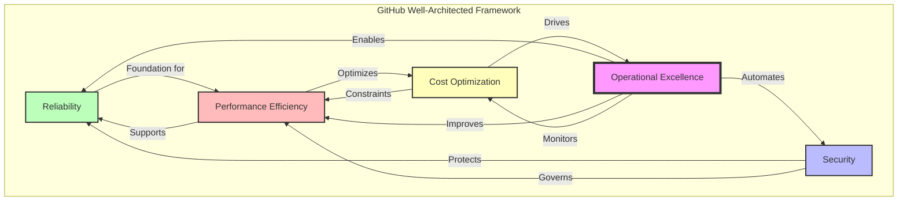
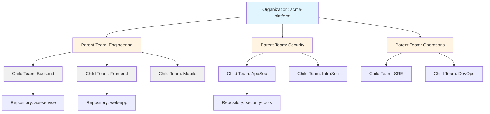
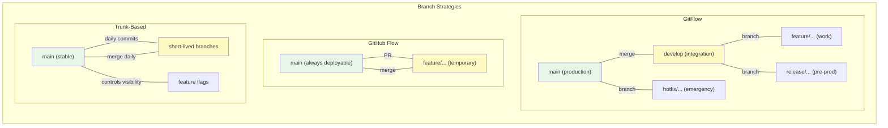
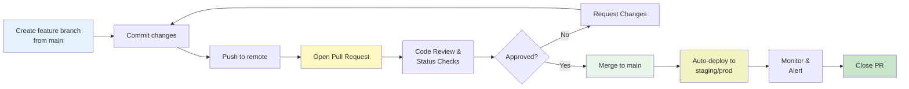
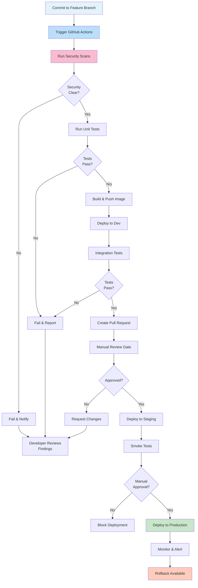
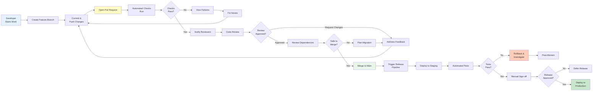
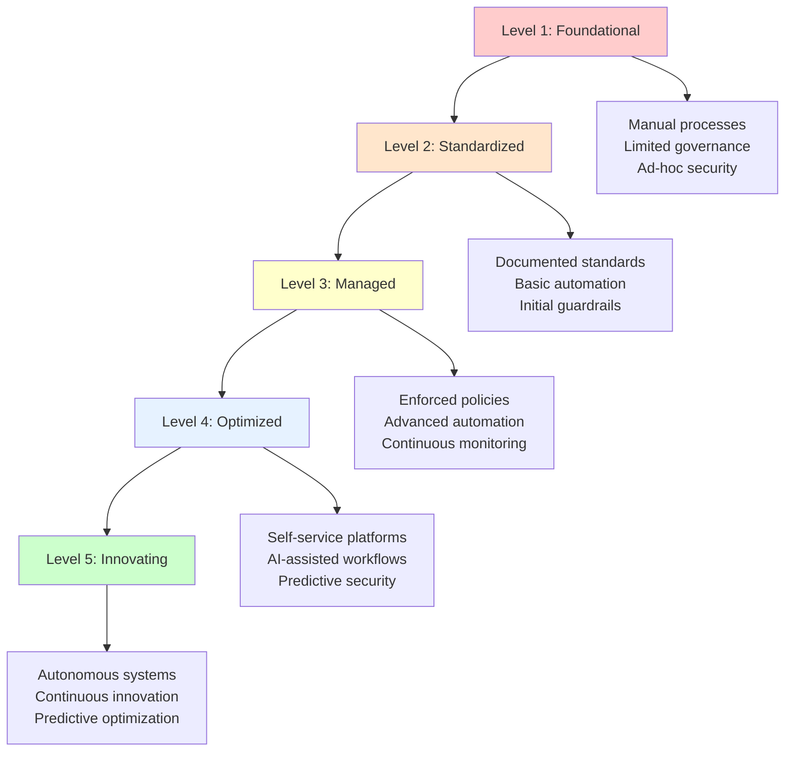

# GitHub Well-Architected Framework: Best Practices and Principles

## Overview

The GitHub Well-Architected Framework (WAF) provides a comprehensive set of principles and best practices for designing, implementing, and operating enterprise-scale GitHub environments. This framework enables organizations to build secure, reliable, and efficient software delivery platforms that scale with business growth.

> **Note:** The official GitHub Well-Architected Framework ([wellarchitected.github.com](https://wellarchitected.github.com)) is organized around five pillars: **Productivity**, **Collaboration**, **Application Security**, **Governance**, and **Architecture**. This document presents an enterprise-focused perspective that maps these official pillars to operational concerns commonly addressed in enterprise deployments, drawing inspiration from cloud architecture frameworks while remaining aligned with GitHub's official guidance.

The following sections organize best practices around operational pillars that enterprise administrators commonly address when deploying GitHub at scale.

## Enterprise Deployment Pillars

### 1. Reliability

**Definition:** The ability of your GitHub environment to perform its intended function correctly and consistently, with mechanisms to recover from failures and meet service level objectives.

**Core Principles:**
- **High Availability:** Design for 99.9%+ uptime using GitHub Enterprise Cloud or properly configured GHES with high availability replicas
- **Disaster Recovery:** Implement comprehensive backup strategies with tested recovery procedures (RPO < 24 hours, RTO < 4 hours for critical systems)
- **Fault Tolerance:** Build resilience into CI/CD pipelines with automatic retries, fallback strategies, and circuit breakers
- **Monitoring and Observability:** Implement comprehensive logging, metrics collection, and alerting across all GitHub operations

**Key Practices:**
- Use GitHub Enterprise Cloud for maximum reliability (99.95% SLA)
- Implement repository backup automation using GitHub APIs and third-party tools
- Configure webhook delivery monitoring and automatic retry mechanisms
- Design CI/CD workflows with idempotency and retry logic
- Establish clear incident response procedures for GitHub outages
- Use GitHub Actions caching to reduce external dependencies
- Implement health checks for self-hosted runners with automatic replacement

### 2. Security

**Definition:** Protection of information, systems, and assets while delivering business value through risk assessments and mitigation strategies.

**Core Principles:**
- **Defense in Depth:** Multiple layers of security controls from authentication to code scanning
- **Least Privilege:** Grant minimum necessary permissions using RBAC and custom roles
- **Zero Trust:** Verify explicitly, use least privilege access, and assume breach
- **Shift Left:** Integrate security early in the development lifecycle

**Key Practices:**
- Enforce SAML SSO with IdP synchronization for all organization members
- Require 2FA/MFA for all users, especially admins and privileged accounts
- Implement IP allow lists for enterprise and organization access
- Use GitHub Advanced Security (GHAS) with code scanning, secret scanning, and dependency review
- Enable push protection to prevent secret commits in real-time
- Configure branch protection rules with required reviews and status checks
- Use environment protection rules with required reviewers for production deployments
- Implement OIDC for workload identity federation (eliminate long-lived credentials)
- Regular security audits using the audit log API and SIEM integration
- Use custom organization roles for fine-grained access control
- Enable Dependabot security updates with automatic merge for low-risk patches

**See also:** [Security and Compliance](08-security-compliance.md)

### 3. Operational Excellence

**Definition:** The ability to support development and run systems effectively, gain insight into operations, and continuously improve supporting processes and procedures.

**Core Principles:**
- **Infrastructure as Code:** Manage GitHub configurations through code (Terraform, GitHub CLI scripts)
- **Automation First:** Automate repetitive tasks to reduce human error and increase efficiency
- **Continuous Improvement:** Regular retrospectives and optimization of workflows
- **Observable Operations:** Comprehensive monitoring, logging, and alerting

**Key Practices:**
- Use Terraform or GitHub CLI for infrastructure provisioning and configuration management
- Implement GitOps for managing GitHub settings and policies
- Automate user lifecycle management with SCIM provisioning
- Create standardized repository templates with pre-configured settings
- Establish clear runbooks for common operational tasks
- Use GitHub Actions workflows for self-service operations
- Implement chatops for common GitHub operations
- Regular audit log review and compliance reporting automation
- Establish SLAs for common support requests (repository creation, access grants)
- Use labels and projects for operational tracking and metrics

### 4. Performance Efficiency

**Definition:** The ability to use computing resources efficiently to meet system requirements and maintain efficiency as demand changes and technologies evolve.

**Core Principles:**
- **Optimize CI/CD Pipelines:** Minimize build times through caching, parallelization, and resource optimization
- **Efficient Resource Utilization:** Right-size self-hosted runners and manage hosted runner usage
- **Scalability:** Design systems to handle growth without performance degradation
- **Performance Monitoring:** Track and optimize key performance indicators

**Key Practices:**
- Use GitHub Actions caching for dependencies and build artifacts
- Implement matrix builds for parallel test execution
- Optimize Docker layer caching in containerized workflows
- Use larger hosted runners for compute-intensive workloads
- Configure self-hosted runner autoscaling (Kubernetes, EC2, AKS)
- Implement workflow concurrency controls to prevent resource contention
- Use path filters and conditional execution to skip unnecessary workflows
- Optimize Git operations (shallow clones, sparse checkouts)
- Monitor and optimize Actions minutes consumption
- Use artifact retention policies to manage storage costs
- Implement incremental builds and selective testing strategies

### 5. Cost Optimization

**Definition:** The ability to run systems to deliver business value at the lowest price point while meeting functional and non-functional requirements.

**Core Principles:**
- **Cost Visibility:** Understand and allocate costs accurately across teams and projects
- **Resource Optimization:** Eliminate waste and right-size resources
- **Usage Monitoring:** Track consumption patterns and identify optimization opportunities
- **Financial Governance:** Establish budgets, alerts, and accountability

**Key Practices:**
- Monitor GitHub Actions minutes usage by organization and repository
- Implement tagging strategies for cost allocation
- Use self-hosted runners for high-volume workloads to reduce Actions minutes costs
- Configure appropriate artifact and log retention periods
- Optimize GitHub Packages storage usage with cleanup policies
- Review and right-size GitHub Copilot seat assignments
- Use GitHub Advanced Security efficiently with targeted repository enablement
- Implement workflow approval gates for expensive operations
- Regular license utilization audits to remove unused seats
- Use enterprise-level purchasing for volume discounts
- Implement cost allocation reports using the billing API

**See also:** [Enterprise Hierarchy Design](01-enterprise-hierarchy.md)

## Pillars Relationship




## Enterprise Setup Checklist

### Phase 1: Foundation (Weeks 1-2)

- [ ] **Enterprise Account Setup**
  - [ ] Create GitHub Enterprise Cloud account
  - [ ] Configure enterprise-level settings and policies
  - [ ] Set up enterprise billing and payment methods
  - [ ] Establish enterprise owner and billing manager roles
  - [ ] Configure enterprise-level IP allow lists

- [ ] **Identity and Access Management**
  - [ ] Configure SAML SSO with corporate IdP (Okta, Azure AD, Ping)
  - [ ] Enable SCIM provisioning for automated user lifecycle
  - [ ] Enforce 2FA/MFA for all enterprise members
  - [ ] Create initial team structure aligned with organizational hierarchy
  - [ ] Define custom organization roles for fine-grained permissions

- [ ] **Security Baseline**
  - [ ] Enable GitHub Advanced Security at enterprise level
  - [ ] Configure secret scanning with custom patterns
  - [ ] Enable push protection for secrets
  - [ ] Set up audit log streaming to SIEM (Splunk, Azure Sentinel)
  - [ ] Configure security advisories and vulnerability reporting

### Phase 2: Organization Structure (Weeks 3-4)

- [ ] **Organization Design**
  - [ ] Create organizations based on business units or product lines
  - [ ] Apply organization naming conventions (e.g., `company-product`, `company-dept`)
  - [ ] Configure organization base permissions (read, write, none)
  - [ ] Set up organization-level teams and hierarchies
  - [ ] Configure organization security and analysis settings

- [ ] **Policy Implementation**
  - [ ] Create and apply repository policies (naming, visibility, features)
  - [ ] Configure branch protection rulesets at organization level
  - [ ] Set up required workflows for compliance and security scanning
  - [ ] Define and enforce merge strategies (squash, merge, rebase)
  - [ ] Establish code review requirements (reviewers, approvals)

**See also:** [Organization Strategies](02-organization-strategies.md), [Policy Inheritance](06-policy-inheritance.md)

### Phase 3: Repository Standards (Weeks 5-6)

- [ ] **Repository Templates**
  - [ ] Create repository templates for common project types
  - [ ] Include standard files (README, CONTRIBUTING, CODE_OF_CONDUCT, SECURITY)
  - [ ] Pre-configure branch protection rules and workflows
  - [ ] Add issue and PR templates
  - [ ] Include standard GitHub Actions workflows

- [ ] **Repository Governance**
  - [ ] Define repository naming conventions by project type
  - [ ] Establish repository creation approval process (if needed)
  - [ ] Configure repository settings standards (wikis, issues, projects)
  - [ ] Set default labels and milestones
  - [ ] Configure vulnerability alerts and Dependabot

### Phase 4: CI/CD Implementation (Weeks 7-10)

- [ ] **GitHub Actions Setup**
  - [ ] Configure organization-level secrets and variables
  - [ ] Set up self-hosted runners (if required) with autoscaling
  - [ ] Create reusable workflows for common patterns
  - [ ] Implement workflow templates for standardization
  - [ ] Configure Actions usage limits and policies

- [ ] **Environment Protection**
  - [ ] Create environment definitions (dev, staging, production)
  - [ ] Configure environment protection rules and required reviewers
  - [ ] Set up environment secrets and variables
  - [ ] Implement deployment gates and approval workflows
  - [ ] Configure environment-specific branch policies

### Phase 5: Monitoring and Optimization (Ongoing)

- [ ] **Observability**
  - [ ] Set up audit log monitoring and alerting
  - [ ] Configure Actions usage dashboards
  - [ ] Implement security scanning dashboards
  - [ ] Create cost tracking and allocation reports
  - [ ] Set up performance monitoring for workflows

- [ ] **Continuous Improvement**
  - [ ] Establish quarterly review cycles for policies and practices
  - [ ] Implement feedback mechanisms for developer experience
  - [ ] Regular security posture assessments
  - [ ] Cost optimization reviews and adjustments
  - [ ] Performance tuning for CI/CD pipelines

## Organization Design Recommendations

### Multi-Organization vs. Single Organization

**Use Multiple Organizations When:**
- **Regulatory Compliance:** Need strict separation for compliance (HIPAA, PCI-DSS, FedRAMP)
- **Acquired Companies:** Maintaining separate brand identities or legal entities
- **Geographic Distribution:** Different regional requirements or data residency needs
- **Business Unit Autonomy:** Independent P&L with separate IT governance
- **Security Isolation:** Different security postures or risk profiles

**Use Single Organization When:**
- **Centralized Governance:** Consistent policies and standards across all teams
- **Resource Sharing:** Common workflows, secrets, and Actions across teams
- **Simplified Management:** Easier administration and lower operational overhead
- **Cross-Team Collaboration:** Frequent collaboration and code sharing
- **Cost Efficiency:** Centralized billing and license management

### Organization Naming Conventions

```
<company>-<business-unit>      # Example: acme-retail, acme-healthcare
<company>-<region>              # Example: acme-us, acme-eu
<company>-<environment>         # Example: acme-prod, acme-nonprod (discouraged)
<company>-<product>             # Example: acme-platform, acme-mobile
```

**Best Practice:** Use business unit or product-based organizations rather than environment-based. Environments should be managed within repositories using environment protection rules.

### Team Structure Hierarchy



**Key Principles:**
- **Nested Teams:** Use parent-child relationships to mirror organizational structure
- **Team Synchronization:** Sync teams with IdP groups using SCIM or team sync
- **Role Assignment:** Assign teams to repositories with appropriate roles (read, triage, write, maintain, admin)
- **Least Privilege:** Start with minimal permissions and grant additional access as needed
- **Team Maintainers:** Designate team maintainers for self-service management


## Repository Naming and Structure Conventions

### Naming Strategy by Project Type

Consistent naming conventions improve discoverability, reduce confusion, and enable automated management through tooling. Implement naming conventions at the organization level through repository creation policies.

#### Microservices

```
<product>-<service>[-<variant>]

Examples:
- platform-auth-service
- platform-api-gateway
- platform-notification-service
- e-commerce-payment-processor-v2
- e-commerce-order-fulfillment-sandbox
```

**Structure Example:**
```
platform-auth-service/
├── .github/
│   ├── workflows/
│   │   ├── ci.yml
│   │   ├── security-scan.yml
│   │   └── deploy.yml
│   ├── ISSUE_TEMPLATE/
│   └── PULL_REQUEST_TEMPLATE/
├── src/
│   ├── main/
│   ├── test/
│   └── integration/
├── config/
│   ├── kubernetes/
│   ├── helm/
│   └── terraform/
├── docs/
│   ├── api/
│   ├── architecture/
│   └── deployment/
├── Dockerfile
├── docker-compose.yml
├── Makefile
├── README.md
├── CONTRIBUTING.md
└── .gitignore
```

#### Frontend Applications

```
<product>-<platform>-ui

Examples:
- platform-web-ui
- platform-mobile-ui-ios
- platform-mobile-ui-android
- customer-portal-ui
```

**Structure Example:**
```
platform-web-ui/
├── .github/workflows/
├── public/
├── src/
│   ├── components/
│   ├── pages/
│   ├── services/
│   ├── hooks/
│   ├── context/
│   └── __tests__/
├── scripts/
├── config/
│   ├── dev.env
│   ├── staging.env
│   └── prod.env
├── package.json
├── webpack.config.js
├── README.md
└── docker-compose.yml
```

#### Shared Libraries

```
<product>-<domain>-lib-<language>

Examples:
- platform-logging-lib-python
- platform-auth-lib-dotnet
- platform-common-lib-js
- shared-utils-lib-go
```

**Structure Example:**
```
platform-common-lib-js/
├── .github/workflows/
│   ├── test.yml
│   ├── publish.yml
│   └── release.yml
├── src/
│   ├── utils/
│   ├── validators/
│   └── formatters/
├── __tests__/
├── docs/
│   ├── API.md
│   └── CHANGELOG.md
├── examples/
├── package.json
├── tsconfig.json
├── jest.config.js
└── README.md
```

#### Infrastructure and DevOps

```
<product>-<type>-<target>

Examples:
- platform-terraform-aws
- platform-helm-charts
- platform-docker-images
- platform-ansible-playbooks
- infrastructure-as-code-prod
```

**Structure Example:**
```
platform-terraform-aws/
├── .github/workflows/
│   ├── validate.yml
│   ├── plan.yml
│   └── apply.yml
├── modules/
│   ├── networking/
│   ├── compute/
│   ├── storage/
│   └── rds/
├── environments/
│   ├── dev/
│   ├── staging/
│   └── production/
├── scripts/
├── docs/
├── terraform.tfvars
├── main.tf
├── variables.tf
├── outputs.tf
└── README.md
```

#### Documentation and Knowledge Base

```
<product>-docs

Examples:
- platform-docs
- architecture-decision-records
- runbooks
```

#### Tools and Utilities

```
<product>-tools-<name>

Examples:
- platform-tools-migration
- platform-tools-performance-profiler
- platform-tools-security-scanner
```

### Repository Directory Structure Standards

All repositories should follow this common structure:

```
repository-name/
├── .github/
│   ├── workflows/           # GitHub Actions workflows
│   ├── ISSUE_TEMPLATE/      # Issue templates
│   └── PULL_REQUEST_TEMPLATE/
├── src/                      # Source code
├── test/ or tests/          # Test files
├── docs/                     # Documentation
├── config/                   # Configuration files
├── scripts/                  # Build and deployment scripts
├── .gitignore
├── .gitattributes
├── README.md
├── CONTRIBUTING.md
├── CODE_OF_CONDUCT.md
├── SECURITY.md
├── LICENSE
└── CHANGELOG.md
```

**Cross-reference:** See [Repository Governance](07-repository-governance.md) for enforcement strategies.

---

## Branching Strategy Recommendations

### Strategy Comparison: GitFlow vs GitHub Flow vs Trunk-Based Development



### Strategy Selection Matrix

| Factor | GitFlow | GitHub Flow | Trunk-Based |
|--------|---------|------------|-------------|
| **Complexity** | High | Low | Medium |
| **Release Cadence** | Planned releases | Continuous deployment | Continuous deployment |
| **Learning Curve** | Steep | Gradual | Medium |
| **Team Size** | Large (50+) | Small-Medium (5-25) | Any size |
| **Best For** | Versioned products | SaaS, web apps | Rapid iteration |
| **Hotfix Handling** | Dedicated branch | PR from main | Immediate fix on main |
| **QA Window** | Release branch | Pre-merge checks | Feature flags |

### Recommended: GitHub Flow for Most Teams

**GitHub Flow Workflow:**



**Best Practices:**
- Branch naming: `feature/JIRA-123-description`, `fix/JIRA-456-description`
- Keep branches short-lived (< 3 days)
- Squash merge to main for clean history
- Tag releases on main: `v1.2.3`
- Use semantic versioning (MAJOR.MINOR.PATCH)

### Branch Protection Rules

Enforce protection at the organization level using rulesets:

```yaml
# Configured via GitHub API or UI
Protection Rules:
  - Branch: main
    - Require pull request reviews (minimum 2)
    - Require code owner reviews
    - Require status checks to pass (CI, security scan)
    - Require branches to be up to date
    - Require conversation resolution before merge
    - Include admins in restrictions
    - Restrict who can push to matching branches
    
  - Branch: develop
    - Require pull request reviews (minimum 1)
    - Require status checks to pass (CI)
    - Allow bypasses for release managers only
```

**Cross-reference:** See [Policy Inheritance](06-policy-inheritance.md) for organization-wide enforcement.

---

## CI/CD Governance Best Practices

### CI/CD Governance Flow



### GitHub Actions Governance

**Workflow Standardization:**

```yaml
# .github/workflows/ci.yml - Organization standard
name: CI Pipeline

on:
  push:
    branches: [main, develop]
  pull_request:
    branches: [main, develop]

env:
  REGISTRY: ghcr.io

jobs:
  security:
    runs-on: ubuntu-latest
    permissions:
      security-events: write
    steps:
      - uses: actions/checkout@v4
        with:
          fetch-depth: 0
      
      - name: Run CodeQL
        uses: github/codeql-action/init@v2
        with:
          languages: ['javascript', 'python']
      
      - name: Run Secret Scanning
        uses: trufflesecurity/trufflehog@main
        with:
          path: ./
          base: ${{ github.event.repository.default_branch }}
          head: HEAD
      
      - name: CodeQL Analysis
        uses: github/codeql-action/analyze@v2

  test:
    runs-on: ubuntu-latest
    needs: security
    strategy:
      matrix:
        node-version: [18.x, 20.x]
    steps:
      - uses: actions/checkout@v4
      
      - uses: actions/setup-node@v3
        with:
          node-version: ${{ matrix.node-version }}
          cache: 'npm'
      
      - run: npm ci
      - run: npm run lint
      - run: npm run test -- --coverage
      - run: npm run build

  deploy:
    runs-on: ubuntu-latest
    needs: test
    if: github.ref == 'refs/heads/main' && github.event_name == 'push'
    environment: production
    steps:
      - uses: actions/checkout@v4
      - name: Deploy to production
        run: |
          echo "Deploying to production..."
          # Add deployment logic
```

**Governance Controls:**

```yaml
# .github/workflows/governance.yml
name: Governance Checks

on: [pull_request]

jobs:
  check-policies:
    runs-on: ubuntu-latest
    steps:
      - uses: actions/checkout@v4
      
      - name: Verify file changes
        run: |
          # Prevent changes to critical files without approval
          if git diff --name-only origin/main HEAD | grep -E '(\.github/workflows|package.json|Dockerfile)'; then
            echo "Critical files modified - requires senior review"
            exit 0  # Require status check in branch protection
          fi
      
      - name: Check branch naming
        run: |
          BRANCH=${GITHUB_HEAD_REF}
          if ! [[ $BRANCH =~ ^(feature|fix|hotfix|release)/ ]]; then
            echo "Branch must follow naming convention: feature/*, fix/*, hotfix/*, release/*"
            exit 1
          fi
      
      - name: Verify CHANGELOG updated
        run: |
          if ! git diff origin/main HEAD | grep -q "CHANGELOG.md"; then
            echo "CHANGELOG.md must be updated"
            exit 1
          fi
```

### Required Status Checks Configuration

```python
# GitHub API: Set required status checks on main branch
{
  "context": [
    "Security / CodeQL Analysis",
    "Security / Secret Scanning",
    "Test / Unit Tests (18.x)",
    "Test / Unit Tests (20.x)",
    "Test / Build",
    "Governance / Policies",
    "Code Quality / Code Coverage"
  ],
  "strict": true,  # Branch must be up to date
  "enforce_admins": true
}
```

### Deployment Approval Gates

```yaml
# Environment protection rules in GitHub
Environments:
  - dev:
      protection_rules:
        - type: none
        - deployment_branches: "nonexistent"  # Any branch can deploy
  
  - staging:
      protection_rules:
        - type: required_reviewers
          reviewers:
            - teams: [platform/devops, platform/sre]
            - minimum: 1
        - deployment_branches: "main"
  
  - production:
      protection_rules:
        - type: required_reviewers
          reviewers:
            - teams: [platform/devops, platform/release-managers]
            - minimum: 2
        - deployment_branches: "main"
        - custom_deployment_protection_rules:
          - timeout_minutes: 15
```

**Cross-reference:** See [Security and Compliance](08-security-compliance.md) for security scanning details.

---

## Change Management Processes

### Change Management PR Workflow



### Pull Request Standards

**PR Title Format:**
```
[TYPE] #JIRA-123: Brief description

Types:
- [FEATURE]: New functionality
- [FIX]: Bug fix
- [REFACTOR]: Code restructuring
- [DOCS]: Documentation only
- [PERF]: Performance improvement
- [TEST]: Test coverage improvement
- [CHORE]: Build, CI, dependencies
```

**PR Template (.github/PULL_REQUEST_TEMPLATE/pull_request_template.md):**

```markdown
## Description
Brief summary of changes and why they're needed.

## Related Issues
Fixes #JIRA-123
Related to #JIRA-456

## Type of Change
- [ ] Feature
- [ ] Bug Fix
- [ ] Breaking Change
- [ ] Documentation
- [ ] Performance Improvement

## Testing Done
- [ ] Unit tests added/updated
- [ ] Integration tests added/updated
- [ ] Manual testing completed
- [ ] Test coverage maintained (>85%)

## Checklist
- [ ] Code follows style guidelines
- [ ] Self-review completed
- [ ] Comments added for complex logic
- [ ] Documentation updated
- [ ] No new warnings generated
- [ ] Dependencies updated and audited
- [ ] CHANGELOG.md updated

## Screenshots/Demos
[Add if applicable]

## Deployment Notes
[Add any special deployment considerations]

## Rollback Plan
[Describe how to revert if needed]
```

### Code Review Standards

**Review Checklist:**

```yaml
# .github/code-review-guidelines.md
Code Review Checklist:
  Functionality:
    - [ ] Changes implement the intended feature/fix
    - [ ] No unnecessary complexity introduced
    - [ ] Error handling is appropriate
    - [ ] Edge cases are handled

  Quality:
    - [ ] Code follows project conventions
    - [ ] Naming is clear and descriptive
    - [ ] Functions are reasonably sized
    - [ ] Comments explain "why" not "what"

  Testing:
    - [ ] Test coverage is adequate
    - [ ] Tests are meaningful
    - [ ] Edge cases tested
    - [ ] No flaky tests introduced

  Performance:
    - [ ] No obvious performance issues
    - [ ] N+1 query problems avoided
    - [ ] Memory leaks prevented

  Security:
    - [ ] No hardcoded secrets
    - [ ] Input validation present
    - [ ] SQL injection/XSS prevention
    - [ ] OWASP top 10 not violated

  Documentation:
    - [ ] README updated if needed
    - [ ] API changes documented
    - [ ] Breaking changes called out
    - [ ] CHANGELOG updated
```

### Change Categories and Approval Requirements

```yaml
Change Categories:
  
  Routine:
    description: "Low-risk changes (docs, tests, small refactors)"
    approvals_required: 1
    deployment_wait: none
    rollback_plan: "Optional"
    
  Standard:
    description: "Normal features and bug fixes"
    approvals_required: 2
    deployment_wait: "Staging soak: 4 hours"
    rollback_plan: "Required"
    notification: "Notify #deployments channel"
    
  High-Impact:
    description: "Major features, database migrations, security changes"
    approvals_required: 3
    deployment_wait: "Staging soak: 24 hours"
    rollback_plan: "Required + dry-run"
    notification: "Notify leadership + #deployments"
    testing: "Security review + load testing"
    
  Emergency/Hotfix:
    description: "Production outages, critical security fixes"
    approvals_required: 2
    deployment_wait: "none"
    rollback_plan: "Pre-prepared"
    notification: "Real-time + incident channel"
    post_action: "Post-mortem required"
```

### Change Window Management

```yaml
# .github/workflows/deployment-schedule.yml
name: Change Window Enforcement

on:
  workflow_dispatch:
    inputs:
      environment:
        description: 'Target environment'
        required: true
        type: choice
        options:
          - staging
          - production

jobs:
  check-window:
    runs-on: ubuntu-latest
    steps:
      - name: Check change window
        run: |
          HOUR=$(date +%H)
          DAY=$(date +%u)
          
          # Production changes: Tue-Thu, 09:00-17:00 UTC
          if [[ "${{ github.event.inputs.environment }}" == "production" ]]; then
            if [[ $DAY -lt 2 || $DAY -gt 4 || $HOUR -lt 9 || $HOUR -gt 17 ]]; then
              echo "Production deployments outside change window"
              exit 1
            fi
          fi
          
          echo "✓ Within approved change window"
```

**Cross-reference:** See [Repository Governance](07-repository-governance.md) for policy enforcement.

---

## Disaster Recovery and Backup Strategies

### Backup Scope and Requirements

| Asset | RTO | RPO | Backup Frequency | Method |
|-------|-----|-----|------------------|--------|
| **Repositories** | 4 hours | < 1 hour | Hourly | GitHub API snapshots |
| **Configuration** | 2 hours | < 30 min | Every 30 min | GitOps repository |
| **Secrets** | 1 hour | < 15 min | Every 15 min | Vault snapshots |
| **Audit Logs** | 24 hours | < 1 hour | Hourly | SIEM export |
| **Webhooks** | 4 hours | < 1 hour | Hourly | API registry |
| **Team Data** | 8 hours | < 1 hour | Daily | SCIM logs |

### Repository Backup Automation

**Python backup script:**

```python
#!/usr/bin/env python3
"""
GitHub Enterprise Repository Backup Script
Backs up all repositories in an organization to S3
"""

import os
import subprocess
import json
import boto3
from datetime import datetime
from concurrent.futures import ThreadPoolExecutor, as_completed
import logging

logging.basicConfig(level=logging.INFO)
logger = logging.getLogger(__name__)

class RepositoryBackup:
    def __init__(self, org_name, s3_bucket, github_token):
        self.org_name = org_name
        self.s3_bucket = s3_bucket
        self.github_token = github_token
        self.s3_client = boto3.client('s3')
        self.timestamp = datetime.utcnow().isoformat()
    
    def get_repositories(self):
        """Fetch all repositories in organization"""
        cmd = [
            'gh', 'repo', 'list', self.org_name,
            '--json', 'nameWithOwner,isPrivate,description',
            '--limit', '1000'
        ]
        
        result = subprocess.run(
            cmd,
            capture_output=True,
            text=True,
            env={**os.environ, 'GH_TOKEN': self.github_token}
        )
        
        if result.returncode != 0:
            raise Exception(f"Failed to fetch repos: {result.stderr}")
        
        return json.loads(result.stdout)
    
    def backup_repository(self, repo_name):
        """Backup single repository with all metadata"""
        try:
            logger.info(f"Backing up {repo_name}")
            
            # Create temporary directory for backup
            backup_dir = f"/tmp/backup-{repo_name.replace('/', '-')}"
            os.makedirs(backup_dir, exist_ok=True)
            
            # Mirror clone (includes all branches and tags)
            clone_cmd = [
                'git', 'clone', '--mirror',
                f'https://{self.github_token}@github.com/{repo_name}.git',
                f'{backup_dir}/repo.git'
            ]
            
            subprocess.run(clone_cmd, check=True, capture_output=True)
            
            # Fetch repository metadata
            meta_cmd = [
                'gh', 'repo', 'view', repo_name,
                '--json', 'description,homepage,topics,defaultBranchRef,parent,visibility'
            ]
            
            result = subprocess.run(
                meta_cmd,
                capture_output=True,
                text=True,
                env={**os.environ, 'GH_TOKEN': self.github_token}
            )
            
            metadata = json.loads(result.stdout)
            
            # Save metadata
            with open(f'{backup_dir}/metadata.json', 'w') as f:
                json.dump(metadata, f, indent=2)
            
            # Create tarball
            tar_path = f"{backup_dir}.tar.gz"
            subprocess.run(
                ['tar', '-czf', tar_path, '-C', '/tmp', f'backup-{repo_name.replace("/", "-")}'],
                check=True,
                capture_output=True
            )
            
            # Upload to S3
            s3_key = f"backups/{self.org_name}/{self.timestamp}/{repo_name}.tar.gz"
            
            self.s3_client.upload_file(
                tar_path,
                self.s3_bucket,
                s3_key,
                ExtraArgs={
                    'ServerSideEncryption': 'AES256',
                    'Metadata': {
                        'backup-date': self.timestamp,
                        'repository': repo_name,
                        'organization': self.org_name
                    }
                }
            )
            
            logger.info(f"✓ Backed up {repo_name} to s3://{self.s3_bucket}/{s3_key}")
            
            # Cleanup
            subprocess.run(['rm', '-rf', backup_dir, tar_path], check=True)
            
            return {
                'repository': repo_name,
                'status': 'success',
                's3_key': s3_key
            }
            
        except Exception as e:
            logger.error(f"✗ Failed to backup {repo_name}: {str(e)}")
            return {
                'repository': repo_name,
                'status': 'failed',
                'error': str(e)
            }
    
    def run_backup(self, max_workers=5):
        """Execute parallel backups"""
        repos = self.get_repositories()
        logger.info(f"Backing up {len(repos)} repositories")
        
        results = []
        with ThreadPoolExecutor(max_workers=max_workers) as executor:
            futures = {
                executor.submit(self.backup_repository, repo['nameWithOwner']): repo
                for repo in repos
            }
            
            for future in as_completed(futures):
                try:
                    result = future.result()
                    results.append(result)
                except Exception as e:
                    logger.error(f"Backup task failed: {str(e)}")
        
        # Generate report
        self.generate_report(results)
        return results
    
    def generate_report(self, results):
        """Generate and store backup report"""
        successful = len([r for r in results if r['status'] == 'success'])
        failed = len([r for r in results if r['status'] == 'failed'])
        
        report = {
            'timestamp': self.timestamp,
            'organization': self.org_name,
            'total_repositories': len(results),
            'successful': successful,
            'failed': failed,
            'details': results
        }
        
        # Save report to S3
        report_key = f"backups/{self.org_name}/{self.timestamp}/backup-report.json"
        self.s3_client.put_object(
            Bucket=self.s3_bucket,
            Key=report_key,
            Body=json.dumps(report, indent=2),
            ContentType='application/json'
        )
        
        logger.info(f"Backup report: {successful} succeeded, {failed} failed")
        logger.info(f"Report: s3://{self.s3_bucket}/{report_key}")

if __name__ == '__main__':
    backup = RepositoryBackup(
        org_name=os.getenv('GH_ORG'),
        s3_bucket=os.getenv('BACKUP_BUCKET'),
        github_token=os.getenv('GH_TOKEN')
    )
    backup.run_backup()
```

### Configuration Backup Script

```bash
#!/bin/bash
# Backup GitHub organization configuration to Git repository

set -euo pipefail

ORG=${GH_ORG:-"acme"}
BACKUP_REPO="git@github.com:${ORG}/${ORG}-infra-backup.git"
TEMP_DIR=$(mktemp -d)

trap "rm -rf $TEMP_DIR" EXIT

echo "📦 Backing up organization configuration..."

# Clone or create backup repository
if git ls-remote "$BACKUP_REPO" &>/dev/null; then
    git clone "$BACKUP_REPO" "$TEMP_DIR/backup"
else
    mkdir -p "$TEMP_DIR/backup"
    cd "$TEMP_DIR/backup"
    git init
fi

cd "$TEMP_DIR/backup"

# Backup organization settings
echo "Fetching organization settings..."
gh org view "${ORG}" --json "name,description,email,blog,location" \
    > "org-settings.json"

# Backup teams
echo "Fetching teams..."
gh team list --org "${ORG}" --json "name,slug,description,privacy" \
    > teams.json

# Backup repositories
echo "Fetching repositories..."
gh repo list "${ORG}" --json "name,description,visibility,isArchived,topics" \
    > repositories.json

# Backup branch protection rules
echo "Fetching branch protection rules..."
mkdir -p branch-protection-rules
for repo in $(gh repo list "${ORG}" --json "name" --jq ".[].name"); do
    gh api "repos/${ORG}/${repo}/rules/branches" > "branch-protection-rules/${repo}.json" 2>/dev/null || true
done

# Backup webhooks registry
echo "Fetching webhooks..."
mkdir -p webhooks
for repo in $(gh repo list "${ORG}" --json "name" --jq ".[].name"); do
    gh api "repos/${ORG}/${repo}/hooks" --jq '.[] | {id, name, events, active}' \
        > "webhooks/${repo}.json" 2>/dev/null || true
done

# Backup custom roles
echo "Fetching custom roles..."
gh api "orgs/${ORG}/roles/custom_roles" --jq '.[] | {id, name, permissions}' \
    > custom-roles.json 2>/dev/null || true

# Commit and push
git add -A
git commit -m "Organization backup: $(date -u +'%Y-%m-%d %H:%M:%S UTC')" || true
git push -u origin main 2>/dev/null || git push -u origin master

echo "✓ Configuration backup complete"
```

### Recovery Procedures

**Repository Recovery:**

```bash
#!/bin/bash
# Restore a repository from backup

BACKUP_ARCHIVE=$1
REPO_NAME=$2
TARGET_ORG=$3

if [[ -z "$BACKUP_ARCHIVE" || -z "$REPO_NAME" || -z "$TARGET_ORG" ]]; then
    echo "Usage: $0 <backup.tar.gz> <repo-name> <target-org>"
    exit 1
fi

echo "�� Restoring repository ${REPO_NAME}..."

# Extract backup
TEMP_DIR=$(mktemp -d)
trap "rm -rf $TEMP_DIR" EXIT

tar -xzf "$BACKUP_ARCHIVE" -C "$TEMP_DIR"

# Read metadata
METADATA=$(cat "$TEMP_DIR/backup-${REPO_NAME}/metadata.json")
DESCRIPTION=$(echo "$METADATA" | jq -r '.description')
VISIBILITY=$(echo "$METADATA" | jq -r '.visibility')

# Create repository
gh repo create "${TARGET_ORG}/${REPO_NAME}" \
    --description "$DESCRIPTION" \
    --visibility "$VISIBILITY" \
    --source "$TEMP_DIR/backup-${REPO_NAME}/repo.git" \
    --remote origin \
    --push

echo "✓ Repository restored to github.com/${TARGET_ORG}/${REPO_NAME}"
```

### Backup Validation and Testing

```yaml
# .github/workflows/backup-validation.yml
name: Backup Validation

on:
  schedule:
    - cron: '0 2 * * 0'  # Weekly

jobs:
  validate-backups:
    runs-on: ubuntu-latest
    steps:
      - uses: actions/checkout@v4
      
      - name: Download latest backups
        run: |
          aws s3 sync s3://${{ secrets.BACKUP_BUCKET }}/backups/${{ secrets.ORG }}/ \
            ./backups/ \
            --exclude "*" \
            --include "$(date +%Y-%m-%d)/*" \
            --region us-east-1
      
      - name: Validate backup integrity
        run: |
          for backup in backups/*/*.tar.gz; do
            echo "Validating $backup..."
            tar -tzf "$backup" > /dev/null || exit 1
            echo "✓ $backup valid"
          done
      
      - name: Test repository restore
        run: |
          # Extract and verify a random backup
          BACKUP=$(ls -1 backups/*/*.tar.gz | shuf -n 1)
          echo "Testing restore of $BACKUP..."
          
          TEMP_DIR=$(mktemp -d)
          tar -xzf "$BACKUP" -C "$TEMP_DIR"
          
          # Verify git repository
          git -C "$TEMP_DIR/*/repo.git" rev-parse HEAD
          echo "✓ Repository restore successful"
      
      - name: Generate validation report
        if: always()
        run: |
          # Generate and upload report
          echo "Backup validation report: $(date)" > validation-report.txt
          aws s3 cp validation-report.txt \
            s3://${{ secrets.BACKUP_BUCKET }}/validation-reports/$(date +%Y-%m-%d).txt
```

**Cross-reference:** See [Security and Compliance](08-security-compliance.md) for encryption and access control.

---

## Enterprise Maturity Model

### Five-Level Maturity Framework



### Level 1: Foundational

**Characteristics:**
- Manual repository creation and access provisioning
- No consistent naming conventions
- Ad-hoc security practices
- Limited audit capabilities
- Reactive incident response

**Maturity Indicators:**
- [ ] GitHub Enterprise Cloud account created
- [ ] Basic RBAC configured
- [ ] Limited audit logging
- [ ] Manual backup procedures
- [ ] No formal governance policies

**Timeline:** 2-4 weeks

**Estimated Cost:** $50k-$100k setup

---

### Level 2: Standardized

**Characteristics:**
- Defined repository naming conventions
- Consistent branch strategies
- Basic CI/CD pipelines
- Documented security baseline
- Initial automation

**Maturity Indicators:**
- [ ] Repository templates implemented
- [ ] Branch protection rules enforced
- [ ] GitHub Actions basic workflows
- [ ] Security scanning enabled
- [ ] Audit logging to centralized system
- [ ] Formal repository governance policy

**Timeline:** 4-8 weeks

**Estimated Cost:** $100k-$200k

**Implementation Focus:**
```yaml
Governance:
  - Repository creation policy
  - Naming conventions
  - Branch protection standards
  - Code review requirements

Security:
  - Secret scanning enabled
  - Dependabot configured
  - SAML SSO enforced
  - 2FA requirement

Automation:
  - GitHub Actions setup
  - Automated testing
  - Build pipelines
```

---

### Level 3: Managed

**Characteristics:**
- Automated policy enforcement
- Advanced CI/CD with multiple environments
- Comprehensive security controls
- Real-time monitoring and alerting
- Self-service operations

**Maturity Indicators:**
- [ ] Rulesets and policy enforcement
- [ ] Advanced GitHub Actions workflows
- [ ] Environment protection rules
- [ ] Custom roles implemented
- [ ] Deployment automation
- [ ] Real-time alerting configured
- [ ] SLA definitions
- [ ] Change management process

**Timeline:** 8-12 weeks

**Estimated Cost:** $200k-$400k

**Implementation Focus:**
```yaml
Governance:
  - Rulesets for policy enforcement
  - Custom organization roles
  - Delegated administration
  - Change management process

CI/CD:
  - Multi-environment pipelines
  - Automated testing matrix
  - Deployment gates
  - Rollback procedures

Operations:
  - Dashboards and metrics
  - Alert policies
  - Runbook automation
  - Incident response procedures
```

---

### Level 4: Optimized

**Characteristics:**
- AI-assisted security and compliance
- Predictive performance optimization
- Autonomous deployment pipelines
- Cost optimization automation
- Platform as a service for development teams

**Maturity Indicators:**
- [ ] Machine learning-based anomaly detection
- [ ] Predictive scaling
- [ ] Autonomous deployment gates
- [ ] Cost optimization dashboards
- [ ] Advanced custom workflows
- [ ] Platform self-service portal
- [ ] Continuous optimization cycles

**Timeline:** 12-20 weeks

**Estimated Cost:** $400k-$800k

**Implementation Focus:**
```yaml
Intelligence:
  - ML-based security scanning
  - Predictive performance metrics
  - Anomaly detection
  - Usage forecasting

Automation:
  - Autonomous deployment gates
  - Self-healing workflows
  - Automatic cost optimization
  - Predictive scaling

Platform:
  - Self-service developer portal
  - GitOps-driven infrastructure
  - Automatic compliance reporting
```

---

### Level 5: Innovating

**Characteristics:**
- Continuous autonomous innovation
- Predictive governance
- Integrated with AI/ML systems
- Continuous compliance
- Strategic business alignment

**Maturity Indicators:**
- [ ] Continuous feature delivery
- [ ] Autonomous security response
- [ ] Real-time compliance auditing
- [ ] Predictive business metrics
- [ ] Advanced developer experience
- [ ] Integrated with enterprise AI/ML

**Timeline:** 20+ weeks

**Estimated Cost:** $800k-$2M+

**Implementation Focus:**
```yaml
Innovation:
  - Continuous feature delivery
  - AI-driven architecture recommendations
  - Predictive capacity planning
  - Autonomous security response

Governance:
  - Real-time compliance
  - Predictive risk management
  - Autonomous policy adjustment
  - Strategic alignment automation

Experience:
  - Advanced developer platform
  - Integrated AI/ML services
  - Predictive issue resolution
  - Context-aware recommendations
```

### Maturity Assessment Questionnaire

```yaml
Questions by Category:

Process Maturity:
  1. How are repositories currently created? (manual/templated/automated)
  2. Are naming conventions enforced? (no/advisory/enforced)
  3. Is CI/CD pipeline standard? (no/basic/advanced)
  4. Are deployments automated? (no/partial/full)
  5. Is there a change management process? (no/documented/enforced)

Security Maturity:
  1. Is SAML SSO implemented? (no/partial/full)
  2. Is MFA enforced? (no/optional/required)
  3. Are secrets scanned? (no/optional/required)
  4. Is GHAS enabled? (no/some repos/all repos)
  5. Are audit logs centralized? (no/local/SIEM)

Operational Maturity:
  1. Are operations automated? (manual/partial/full)
  2. Is there centralized monitoring? (no/basic/advanced)
  3. Are SLAs defined? (no/informal/formal)
  4. Is incident response documented? (no/basic/advanced)
  5. Are retrospectives regular? (no/ad-hoc/scheduled)

Financial Maturity:
  1. Is cost tracking implemented? (no/manual/automated)
  2. Are budgets defined? (no/informal/enforced)
  3. Is usage monitored? (no/manual/automated)
  4. Are optimization efforts planned? (no/ad-hoc/continuous)
  5. Is ROI measured? (no/estimated/measured)
```

**Cross-reference:** See [Organization Strategies](02-organization-strategies.md) for organizational alignment.

---

## Scaling Patterns for Large Enterprises

### Pattern 1: Federated Multi-Organization Model

**Use When:**
- Organizations > 10,000 developers
- Multiple business units with autonomous governance
- Strict regulatory/compliance requirements
- Geographic distribution requirements

**Architecture:**
```
Enterprise
├── acme-platform (shared services)
│   ├── Team: Platform
│   └── Repos: shared-libs, workflows, tools
├── acme-commerce (business unit)
│   ├── Team: Commerce-Backend
│   ├── Team: Commerce-Frontend
│   └── Repos: payment-service, checkout-ui
├── acme-healthcare (business unit)
│   ├── Team: Healthcare-Backend
│   └── Repos: patient-api, records-service
└── acme-infrastructure (DevOps)
    ├── Team: SRE
    └── Repos: terraform-aws, helm-charts
```

**Implementation:**

```hcl
# Enterprise-level Terraform configuration
terraform {
  required_providers {
    github = {
      source = "integrations/github"
      version = "~> 6.0"
    }
  }
}

# Create federated organizations
module "commerce_org" {
  source = "./modules/organization"
  
  name = "acme-commerce"
  display_name = "ACME Commerce Platform"
  billing_email = "commerce-billing@acme.com"
  
  teams = {
    backend = {
      privacy = "closed"
      members = ["backend-team@acme.com"]
    }
    frontend = {
      privacy = "closed"
      members = ["frontend-team@acme.com"]
    }
  }
  
  policies = {
    require_branch_protection = true
    require_code_owners = true
    minimum_reviewers = 2
  }
}

# Create shared services organization
module "platform_org" {
  source = "./modules/organization"
  
  name = "acme-platform"
  display_name = "ACME Shared Platform"
  billing_email = "platform-billing@acme.com"
  
  shared_services = true
}
```

### Pattern 2: Hub-and-Spoke Monorepo Strategy

**Use When:**
- Highly interdependent teams
- Monorepo benefits outweigh distributed drawbacks
- Central platform team coordination needed
- Real-time code sharing required

**Structure:**
```
monorepo/
├── services/
│   ├── auth-service/
│   ├── api-gateway/
│   └── payments-service/
├── packages/
│   ├── common-lib/
│   ├── logging-lib/
│   └── auth-lib/
├── frontend/
│   ├── web-app/
│   └── admin-portal/
├── infrastructure/
│   ├── kubernetes/
│   ├── terraform/
│   └── helm/
└── .github/workflows/
    ├── ci-root.yml
    ├── ci-services.yml
    └── deploy.yml
```

**Workflow Implementation:**

```yaml
# .github/workflows/monorepo-ci.yml
name: Monorepo CI

on:
  push:
    branches: [main, develop]
  pull_request:
    branches: [main, develop]

env:
  REGISTRY: ghcr.io
  CACHE_REGISTRY: ttl.sh

jobs:
  detect-changes:
    runs-on: ubuntu-latest
    outputs:
      services: ${{ steps.detect.outputs.services }}
      packages: ${{ steps.detect.outputs.packages }}
      frontend: ${{ steps.detect.outputs.frontend }}
      infrastructure: ${{ steps.detect.outputs.infrastructure }}
    steps:
      - uses: actions/checkout@v4
        with:
          fetch-depth: 0
      
      - id: detect
        run: |
          # Detect changed directories
          BASE=${{ github.event.pull_request.base.sha || 'HEAD~1' }}
          HEAD=${{ github.sha }}
          
          CHANGED=$(git diff --name-only $BASE...$HEAD)
          
          # Check each path
          echo "services=$(echo "$CHANGED" | grep -q '^services/' && echo 'true' || echo 'false')" >> $GITHUB_OUTPUT
          echo "packages=$(echo "$CHANGED" | grep -q '^packages/' && echo 'true' || echo 'false')" >> $GITHUB_OUTPUT
          echo "frontend=$(echo "$CHANGED" | grep -q '^frontend/' && echo 'true' || echo 'false')" >> $GITHUB_OUTPUT
          echo "infrastructure=$(echo "$CHANGED" | grep -q '^infrastructure/' && echo 'true' || echo 'false')" >> $GITHUB_OUTPUT

  build-services:
    needs: detect-changes
    if: ${{ needs.detect-changes.outputs.services == 'true' }}
    runs-on: ubuntu-latest
    strategy:
      matrix:
        service: [auth-service, api-gateway, payments-service]
    steps:
      - uses: actions/checkout@v4
      - name: Build ${{ matrix.service }}
        run: |
          cd services/${{ matrix.service }}
          docker build -t ${{ env.REGISTRY }}/acme/${{ matrix.service }}:${{ github.sha }} .
          docker push ${{ env.REGISTRY }}/acme/${{ matrix.service }}:${{ github.sha }}

  build-frontend:
    needs: detect-changes
    if: ${{ needs.detect-changes.outputs.frontend == 'true' }}
    runs-on: ubuntu-latest
    steps:
      - uses: actions/checkout@v4
      - uses: actions/setup-node@v3
        with:
          node-version: 18
          cache: npm
      - run: |
          npm ci
          npm run lint
          npm run test
          npm run build
      - name: Build and push frontend image
        run: |
          docker build -t ${{ env.REGISTRY }}/acme/web-app:${{ github.sha }} ./frontend/web-app
          docker push ${{ env.REGISTRY }}/acme/web-app:${{ github.sha }}

  integration-tests:
    needs: [build-services, build-frontend]
    runs-on: ubuntu-latest
    steps:
      - uses: actions/checkout@v4
      - name: Run integration tests
        run: |
          docker-compose -f docker-compose.test.yml up --abort-on-container-exit
```

### Pattern 3: Distributed Microservices Model

**Use When:**
- Autonomous service ownership required
- Different release cadences per service
- Technology diversity needed
- Large number of small teams (50+)

**Repository Organization:**

```
GitHub Enterprise
├── acme-platform-org
│   ├── Platform Services (5-7 repos)
│   ├── Shared Libraries (3-5 repos)
│   ├── Infrastructure (2-3 repos)
│   └── DevOps Tools (2-3 repos)
├── acme-services-org (40+ repos, 1 per service)
│   ├── user-service
│   ├── order-service
│   ├── payment-service
│   ├── shipping-service
│   └── ... (1 repo per autonomously owned service)
├── acme-frontend-org (8-12 repos)
│   ├── web-app-core
│   ├── mobile-app-ios
│   ├── mobile-app-android
│   └── ... (1 repo per frontend app)
└── acme-infrastructure-org
    ├── terraform-modules
    ├── helm-charts
    ├── kubernetes-manifests
    └── observability-stack
```

**Service Repository Template:**

```yaml
# service-template/.github/workflows/service-deployment.yml
name: Service Deployment Pipeline

on:
  push:
    branches: [main]
    tags: ['v*']
  pull_request:
    branches: [main]

env:
  SERVICE_NAME: ${{ github.event.repository.name }}
  REGISTRY: ghcr.io/${{ github.repository_owner }}

jobs:
  test:
    runs-on: ubuntu-latest
    services:
      postgres:
        image: postgres:15
        env:
          POSTGRES_PASSWORD: postgres
      redis:
        image: redis:7
    steps:
      - uses: actions/checkout@v4
      - uses: actions/setup-go@v4
        with:
          go-version: 1.21
          cache: true
      
      - run: |
          go test ./... -v -race -coverprofile=coverage.out
          go tool cover -html=coverage.out -o coverage.html
      
      - uses: codecov/codecov-action@v3
        with:
          files: ./coverage.out

  build:
    needs: test
    if: github.event_name == 'push'
    runs-on: ubuntu-latest
    outputs:
      image-tag: ${{ steps.image.outputs.tag }}
    steps:
      - uses: actions/checkout@v4
      
      - id: image
        run: |
          if [[ "${{ github.ref }}" == refs/tags/* ]]; then
            TAG=${GITHUB_REF#refs/tags/}
          else
            TAG=${{ github.sha }}
          fi
          echo "tag=$TAG" >> $GITHUB_OUTPUT
      
      - uses: docker/build-push-action@v4
        with:
          context: .
          push: true
          tags: ${{ env.REGISTRY }}/${{ env.SERVICE_NAME }}:${{ steps.image.outputs.tag }}
          cache-from: type=gha
          cache-to: type=gha,mode=max

  deploy:
    needs: build
    if: github.ref == 'refs/heads/main' && github.event_name == 'push'
    runs-on: ubuntu-latest
    environment: production
    steps:
      - uses: actions/checkout@v4
      
      - uses: azure/setup-kubectl@v3
        with:
          version: 1.27
      
      - name: Deploy to Kubernetes
        run: |
          kubectl set image deployment/${{ env.SERVICE_NAME }} \
            ${{ env.SERVICE_NAME }}=${{ env.REGISTRY }}/${{ env.SERVICE_NAME }}:${{ needs.build.outputs.image-tag }} \
            -n production
          
          kubectl rollout status deployment/${{ env.SERVICE_NAME }} -n production
```

### Pattern 4: Enterprise API Platform

**Use When:**
- Internal API marketplace needed
- API versioning and governance required
- Cross-organization API consumers
- Revenue-generating APIs

**Implementation:**

```bash
# API Platform Structure
api-platform-org/
├── api-catalog (registry of all APIs)
├── api-gateway (central entry point)
├── api-governance (policies and standards)
├── api-docs (centralized documentation)
├── api-examples (SDKs, samples)
└── api-services/
    ├── users-api
    ├── products-api
    ├── orders-api
    └── ... (one repo per API)
```

**API Documentation Portal:**

```yaml
# .github/workflows/api-docs-build.yml
name: Build API Documentation

on:
  push:
    branches: [main]
  pull_request:

jobs:
  build-docs:
    runs-on: ubuntu-latest
    steps:
      - uses: actions/checkout@v4
      
      - name: Aggregate OpenAPI specs
        run: |
          # Collect OpenAPI specs from all API repos
          gh repo list acme-platform-org --json "nameWithOwner" --jq '.[] | select(.nameWithOwner | test("api$")) | .nameWithOwner' | while read repo; do
            gh repo clone "$repo" "/tmp/$repo"
            if [ -f "/tmp/$repo/openapi.yaml" ]; then
              cp "/tmp/$repo/openapi.yaml" "specs/${repo##*/}.yaml"
            fi
          done
      
      - name: Generate API documentation
        run: |
          npx redoc-cli bundle specs/*.yaml -o api-docs.html
      
      - name: Deploy to API Portal
        run: |
          aws s3 sync . s3://api-portal/docs/ --exclude "*" --include "api-docs.html"
```

### Pattern 5: Multi-Region Deployment

**Use When:**
- Global deployments required
- Regional compliance needs
- High availability across regions
- Latency optimization

**Regional Organization Structure:**

```
Enterprise
├── acme-global (cross-region shared)
├── acme-us (US region)
│   ├── Resources in us-east-1, us-west-2
│   ├── US-specific compliance
│   └── Regional SRE team
├── acme-eu (EU region)
│   ├── Resources in eu-west-1, eu-central-1
│   ├── GDPR compliance
│   └── Regional SRE team
└── acme-apac (Asia-Pacific)
    ├── Resources in ap-southeast-1, ap-northeast-1
    ├── Regional compliance
    └── Regional SRE team
```

**Regional Deployment Workflow:**

```yaml
# infrastructure/workflows/multi-region-deploy.yml
name: Multi-Region Deployment

on:
  workflow_dispatch:
    inputs:
      regions:
        description: Regions to deploy to
        required: true
        default: us,eu,apac
        type: choice
        options:
          - us
          - eu
          - apac
          - us,eu
          - us,eu,apac

jobs:
  deploy-regions:
    strategy:
      matrix:
        region: ${{ fromJSON(format('["{0}"]', github.event.inputs.regions)) }}
    runs-on: ubuntu-latest
    environment: production-${{ matrix.region }}
    steps:
      - uses: actions/checkout@v4
      
      - name: Deploy to ${{ matrix.region }}
        env:
          AWS_REGION: ${{ secrets[format('AWS_REGION_{0}', matrix.region)] }}
        run: |
          # Deploy to specific region
          terraform -chdir=infrastructure/regions/${{ matrix.region }} apply -auto-approve
      
      - name: Run smoke tests
        run: |
          ./scripts/smoke-tests.sh ${{ matrix.region }}
      
      - name: Update traffic weights
        run: |
          # Gradually shift traffic to new deployment (canary)
          ./scripts/canary-deploy.sh ${{ matrix.region }} 5 10 20 50 100
```

**Cross-reference:** See [Organization Strategies](02-organization-strategies.md) for multi-organization patterns.


## Common Anti-Patterns to Avoid

### 1. Unlimited Repository Creation Without Governance

**Anti-Pattern:**
```
❌ No repository creation controls
❌ No naming conventions enforced
❌ No consistent structure
❌ Impossible to discover repositories
```

**Problem:**
- Repository sprawl and duplication
- Inconsistent configurations
- Security vulnerabilities from misconfigured repos
- Compliance violations
- Difficult cost tracking

**Solution:**

```python
# Enforce repository creation through automation
import subprocess
import sys
import re
import json

def create_repository(org: str, name: str, template: str, **kwargs):
    """Create repository from template with validation"""
    
    # Validate naming convention
    valid_patterns = {
        'service': r'^[a-z]+-service$',
        'lib': r'^[a-z]+-lib-[a-z]+$',
        'ui': r'^[a-z]+-ui(-[a-z]+)?$',
    }
    
    repo_type = kwargs.get('type', 'service')
    pattern = valid_patterns.get(repo_type)
    
    if not re.match(pattern, name):
        sys.exit(f"❌ Repository name '{name}' doesn't match pattern for type '{repo_type}'")
    
    # Use template
    cmd = [
        'gh', 'repo', 'create', f'{org}/{name}',
        '--template', f'{org}/{template}',
        '--visibility', kwargs.get('visibility', 'private'),
        '--description', kwargs.get('description', ''),
    ]
    
    subprocess.run(cmd, check=True)
    
    # Configure branch protection
    subprocess.run([
        'gh', 'api', f'repos/{org}/{name}/branches/main/protection',
        '--input', '/dev/stdin'
    ], input=json.dumps({
        'required_pull_request_reviews': {'required_approving_review_count': 1},
        'required_status_checks': {'strict': True, 'contexts': ['ci', 'security']},
        'enforce_admins': True
    }), check=True)
```

---

### 2. Secrets Stored in Code or Environment Variables

**Anti-Pattern:**
```python
❌ API_KEY="sk-12345abcde"  # In code
❌ DATABASE_PASSWORD in .env file
❌ SSH keys committed to repository
❌ Credentials in CI/CD logs
```

**Problem:**
- Exposed credentials in git history (permanent)
- Leaked secrets in logs
- Compromised integrations
- Regulatory violations
- Difficult remediation

**Solution:**

```yaml
# Use GitHub Secrets Management
- name: Deploy with secure credentials
  run: |
    # ✓ Credentials only in memory, never in logs
    export DB_PASSWORD=${{ secrets.DB_PASSWORD }}
    export API_KEY=${{ secrets.API_KEY }}
    ./deploy.sh
  env:
    # ✓ Mask sensitive values from logs
    ACTIONS_STEP_DEBUG: false

# Use OIDC for workload identity
- name: Authenticate to AWS
  uses: aws-actions/configure-aws-credentials@v2
  with:
    role-to-assume: ${{ secrets.AWS_ROLE_ARN }}
    aws-region: us-east-1
    # No access keys needed!

# Use sealed secrets in GitOps
apiVersion: bitnami.com/v1alpha1
kind: SealedSecret
metadata:
  name: app-secrets
  namespace: production
spec:
  encryptedData:
    database-password: AgBv...  # Encrypted, safe to commit
```

---

### 3. Monolithic CI/CD with Long Build Times

**Anti-Pattern:**
```yaml
❌ All tests run sequentially
❌ Full build on every change
❌ No caching
❌ 45+ minute build time
❌ Developers wait for feedback
```

**Problem:**
- Developer productivity loss
- Slow feedback loop
- Build queue backlogs
- Wasted compute resources
- High cost

**Solution:**

```yaml
name: Optimized Parallel CI

on: [push, pull_request]

jobs:
  lint-and-unit-fast:
    runs-on: ubuntu-latest
    # Run immediately, fail fast
    steps:
      - uses: actions/checkout@v4
      - uses: actions/setup-node@v3
        with:
          node-version: 18
          cache: npm
      
      - run: npm ci --prefer-offline --no-audit
      - run: npm run lint -- --max-warnings 0
      - run: npm run test:unit -- --coverage --forceExit
        # Total: 5-7 minutes

  security-scan-parallel:
    runs-on: ubuntu-latest
    steps:
      - uses: actions/checkout@v4
      - uses: github/codeql-action/init@v2
      - uses: github/codeql-action/analyze@v2
      - uses: aquasecurity/trivy-action@master
        # Parallel with tests: 10-12 minutes total

  build-and-integration:
    needs: [lint-and-unit-fast]  # Only run if fast checks pass
    runs-on: ubuntu-latest
    strategy:
      matrix:
        node-version: [18.x, 20.x]
    steps:
      - uses: actions/checkout@v4
      - uses: actions/setup-node@v3
        with:
          node-version: ${{ matrix.node-version }}
          cache: npm
      
      - run: npm ci --prefer-offline
      - run: npm run build
      - run: npm run test:integration
        # 15-20 minutes, but parallel

  # Total time: 20 minutes vs 45 minutes sequential
```

---

### 4. No Enforcement of Code Quality Standards

**Anti-Pattern:**
```
❌ Code reviews are optional
❌ No automated checks
❌ Anyone can merge without review
❌ Code quality degrades over time
❌ No coverage requirements
```

**Problem:**
- Technical debt accumulates
- Bugs reach production
- Security vulnerabilities missed
- Inconsistent code style
- Knowledge silos

**Solution:**

```yaml
# .github/workflows/enforce-quality.yml
name: Quality Gate Enforcement

on: [pull_request]

permissions:
  contents: read
  pull-requests: write

jobs:
  enforce-standards:
    runs-on: ubuntu-latest
    steps:
      - uses: actions/checkout@v4
        with:
          fetch-depth: 0
      
      # Prevent merge without required reviewers
      - uses: actions/github-script@v7
        with:
          script: |
            const { owner, repo, number } = context.issue;
            const pr = await github.rest.pulls.get({ owner, repo, pull_number: number });
            
            // Require 2 reviews from code owners
            if (pr.data.review_comments < 2) {
              core.setFailed('Requires at least 2 review comments');
            }
      
      # Enforce test coverage minimum
      - uses: actions/setup-node@v3
        with:
          node-version: 18
          cache: npm
      
      - run: npm ci
      - run: npm run test:coverage
      
      - name: Check coverage thresholds
        run: |
          COVERAGE=$(cat coverage/coverage-summary.json | jq '.total.lines.pct')
          if (( $(echo "$COVERAGE < 85" | bc -l) )); then
            echo "❌ Test coverage $COVERAGE% is below 85% threshold"
            exit 1
          fi
          echo "✓ Test coverage $COVERAGE% meets threshold"
```

---

### 5. Deploying Directly from Personal Laptops

**Anti-Pattern:**
```
❌ "I'll deploy from my machine"
❌ Manual SSH to production servers
❌ No audit trail
❌ Different versions deployed
❌ Developers have production access
```

**Problem:**
- No reproducibility
- No rollback capability
- Security vulnerabilities
- Compliance violations
- Knowledge not shared

**Solution:**

```yaml
# Enforce deployment only through automated pipelines
name: Production Deployment

on:
  workflow_dispatch:
    inputs:
      version:
        description: 'Version to deploy'
        required: true

jobs:
  deploy:
    environment: 
      name: production
      url: https://api.acme.com
    runs-on: ubuntu-latest
    permissions:
      id-token: write  # For OIDC
    steps:
      - uses: actions/checkout@v4
        with:
          ref: ${{ github.event.inputs.version }}
      
      - name: Verify version exists and is tagged
        run: |
          git describe --exact-match --tags ${{ github.event.inputs.version }} || exit 1
      
      - name: Authenticate to production
        uses: aws-actions/configure-aws-credentials@v2
        with:
          role-to-assume: ${{ secrets.PROD_ROLE_ARN }}
          role-session-name: github-actions-deploy
      
      - name: Deploy with rollback capability
        run: |
          ./scripts/deploy.sh \
            --version ${{ github.event.inputs.version }} \
            --enable-rollback \
            --verify-health \
            --canary 10
      
      # GitHub Actions provides:
      # ✓ Authentication (OIDC, no keys)
      # ✓ Audit trail (Who, When, What)
      # ✓ Approval gates (environment protection)
      # ✓ Reproducibility (exact version)
```

---

### 6. Insufficient Monitoring and Alerting

**Anti-Pattern:**
```
❌ No dashboard for CI/CD health
❌ Build failures go unnoticed
❌ Security alerts ignored
❌ Performance degradation undetected
❌ Cost overruns unexpected
```

**Problem:**
- Issues discovered by users
- Slow incident response
- Unknown cost drivers
- Blind spots in security

**Solution:**

```yaml
# .github/workflows/publish-metrics.yml
name: Publish Platform Metrics

on:
  schedule:
    - cron: '*/5 * * * *'  # Every 5 minutes

jobs:
  collect-metrics:
    runs-on: ubuntu-latest
    steps:
      - uses: actions/checkout@v4
      
      - name: Collect workflow metrics
        uses: actions/github-script@v7
        env:
          PROMETHEUS_PUSHGATEWAY: ${{ secrets.PROMETHEUS_PUSHGATEWAY }}
        with:
          script: |
            const axios = require('axios');
            
            // Get workflow run times
            const runs = await github.rest.actions.listWorkflowRuns({
              owner: context.repo.owner,
              repo: context.repo.repo,
              per_page: 100
            });
            
            const metrics = {
              'workflow_duration_minutes': [],
              'workflow_failures': 0,
              'workflow_successes': 0
            };
            
            for (const run of runs.data.workflow_runs) {
              if (run.status === 'completed') {
                const duration = new Date(run.updated_at) - new Date(run.created_at);
                metrics.workflow_duration_minutes.push(duration / 60000);
                
                if (run.conclusion === 'success') {
                  metrics.workflow_successes++;
                } else {
                  metrics.workflow_failures++;
                }
              }
            }
            
            // Push to monitoring
            await axios.post(
              process.env.PROMETHEUS_PUSHGATEWAY,
              formatMetrics(metrics)
            );
```

---

### 7. Granting Excessive Permissions

**Anti-Pattern:**
```
❌ Everyone has admin access
❌ No role-based access control
❌ Contractors have production access
❌ GitHub tokens never rotate
❌ Machine accounts have user permissions
```

**Problem:**
- Increased attack surface
- Accidental deletions/changes
- Compliance violations
- Impossible to audit who did what

**Solution:**

```yaml
# Principle of Least Privilege
organizations:
  acme-platform:
    custom_roles:
      - name: junior_developer
        permissions:
          - pull_requests: write
          - issues: write
          - packages: read
          # ✓ Cannot delete repos, modify settings, merge to main
      
      - name: senior_developer
        permissions:
          - pull_requests: write
          - issues: write
          - packages: read
          - workflows: write
          - repository_hooks: write
      
      - name: devops_engineer
        permissions:
          - admin: true
          # Scoped to infrastructure repos only
      
      - name: security_reviewer
        permissions:
          - pull_requests: read
          - security_events: read
          - settings: read

# Use environment-based deployment restrictions
environments:
  production:
    protection_rules:
      - required_reviewers:
          minimum_count: 2
          # Only senior devs and devops can approve
          teams: [senior-developers, devops-engineers]
      - custom_deployment_rules:
          - type: required_status_checks
            contexts: [security-scan, integration-tests]

# Use GitHub Apps for fine-grained permissions
github_apps:
  - name: deployment-bot
    permissions:
      deployments: write
      contents: read
      pull_requests: read
      # ✓ Cannot delete, modify settings, or access user data
```

---

### 8. No Documentation or Knowledge Sharing

**Anti-Pattern:**
```
❌ Knowledge only in individuals' heads
❌ No runbooks for common tasks
❌ "How does X work?" - "Only Bob knows"
❌ Onboarding takes weeks
❌ When someone leaves, context is lost
```

**Problem:**
- Onboarding delays
- Inconsistent procedures
- Knowledge silos
- Bus factor = 1
- Operational inefficiency

**Solution:**

```markdown
# Example: docs/runbooks/incident-response.md

## Incident Response Runbook

### Severity Levels
- **P1 (Critical):** Complete outage, customer impact
- **P2 (High):** Partial outage, degraded performance
- **P3 (Medium):** Minor issues, workarounds available
- **P4 (Low):** No customer impact

### Response Steps

#### Step 1: Acknowledge (Immediately)
```bash
# Acknowledge in Slack
@incident-commander acknowledged incident in #incidents
```

#### Step 2: Gather Information (2 min)
- [ ] Access monitoring dashboard (Grafana)
- [ ] Check recent deployments
- [ ] Review error rates and latency
- [ ] Check infrastructure status

#### Step 3: Execute Runbook
Based on error pattern, execute appropriate runbook:
- [Database replication lag](./db-replication-lag.md)
- [High error rate](./high-error-rate.md)
- [Deployment rollback](./deployment-rollback.md)

#### Step 4: Communicate Status
```bash
# Update status every 5 minutes
gh issue comment <incident-issue> --body "Status: Still investigating..."
```

#### Step 5: Post-Incident
- [ ] Complete post-mortem within 24 hours
- [ ] Create follow-up GitHub issues
- [ ] Update runbooks based on learnings
- [ ] Share learnings with team
```

---

### 9. Overlooking Environment Configuration Drift

**Anti-Pattern:**
```
❌ Environments configured manually
❌ "Apply this change to production" via email
❌ No version control for infrastructure
❌ Can't replicate prod locally
❌ Settings lost when servers are replaced
```

**Problem:**
- Environments diverge over time
- Difficult to debug "works in prod but not staging"
- Disaster recovery nearly impossible
- Compliance audit failures

**Solution:**

```hcl
# Terraform: Infrastructure as Code
terraform {
  required_providers {
    github = {
      source = "integrations/github"
      version = "~> 6.0"
    }
  }
  
  backend "s3" {
    bucket = "terraform-state"
    key = "github/main.tfstate"
    encrypt = true
    dynamodb_table = "terraform-locks"
  }
}

# Define all environments from code
module "dev_environment" {
  source = "./modules/github-org"
  
  org_name = "acme-dev"
  visibility = "internal"
  
  required_status_checks = ["ci", "lint"]
  required_reviewers = 1
}

module "prod_environment" {
  source = "./modules/github-org"
  
  org_name = "acme-prod"
  visibility = "private"
  
  required_status_checks = ["ci", "lint", "security-scan", "performance-test"]
  required_reviewers = 2
  require_code_owners = true
}

# Version control all changes
# git log shows who changed what and when
```

---

### 10. Ignoring Cost Management

**Anti-Pattern:**
```
❌ "GitHub is cheap, don't worry about costs"
❌ No Actions minute limits
❌ No artifact retention policy
❌ GitHub Copilot seats assigned but unused
❌ Large repositories not optimized
```

**Problem:**
- Costs spiral unchecked
- Wasted spending
- Business can't predict budgets
- No ROI analysis

**Solution:**

```python
# Cost monitoring and optimization
import boto3
import json
from datetime import datetime, timedelta

class GitHubCostOptimizer:
    def __init__(self, github_token, org_name):
        self.github_token = github_token
        self.org_name = org_name
        self.gh = GitHubAPI(github_token)
    
    def analyze_actions_usage(self):
        """Analyze GitHub Actions minute consumption"""
        usage = self.gh.get_organization_actions_usage(self.org_name)
        
        # Find top consumers
        repo_usage = {}
        for repo in usage.get('repositories', []):
            minutes = repo['actions_minutes_used']
            repo_usage[repo['name']] = minutes
        
        top_10 = sorted(repo_usage.items(), key=lambda x: x[1], reverse=True)[:10]
        
        print("Top 10 Actions consumers:")
        for repo, minutes in top_10:
            print(f"  {repo}: {minutes} minutes (${minutes * 0.008})")
        
        return top_10
    
    def optimize_expensive_workflows(self):
        """Identify and optimize expensive workflows"""
        improvements = []
        
        for repo in self.gh.list_repositories(self.org_name):
            workflows = self.gh.get_workflows(repo)
            
            for workflow in workflows:
                runs = self.gh.get_workflow_runs(workflow, limit=10)
                
                for run in runs:
                    # Check for optimization opportunities
                    if self.could_use_caching(run):
                        improvements.append({
                            'repo': repo,
                            'workflow': workflow['name'],
                            'suggestion': 'Enable dependency caching',
                            'potential_savings': '40%'
                        })
                    
                    if self.has_sequential_jobs(run):
                        improvements.append({
                            'repo': repo,
                            'workflow': workflow['name'],
                            'suggestion': 'Parallelize jobs',
                            'potential_savings': '30%'
                        })
        
        return improvements
    
    def optimize_runners(self):
        """Right-size runner usage"""
        # Analyze runner utilization
        # Recommend spot instances for non-critical workloads
        # Suggest self-hosted runners for high-volume workloads
        pass
    
    def cleanup_artifacts(self):
        """Remove old/unused artifacts"""
        for repo in self.gh.list_repositories(self.org_name):
            artifacts = self.gh.get_artifacts(repo)
            
            # Keep only recent artifacts
            cutoff = datetime.now() - timedelta(days=30)
            
            for artifact in artifacts:
                if artifact['created_at'] < cutoff:
                    self.gh.delete_artifact(artifact['id'])
                    print(f"✓ Deleted old artifact: {artifact['name']}")
```

**Cross-reference:** See the Pillars section on Cost Optimization for detailed strategies.


## Key Performance Indicators (KPIs)

Measuring GitHub platform effectiveness through carefully selected KPIs enables data-driven optimization and demonstrates business value.

### Development Velocity Metrics

| KPI | Target | Frequency | Tool |
|-----|--------|-----------|------|
| **Deployment Frequency** | 10-20x/day | Daily | GitHub API |
| **Lead Time for Changes** | < 1 hour | Weekly | GitHub API |
| **Mean Time to Recovery (MTTR)** | < 30 min | Per incident | Incident tracking |
| **Change Failure Rate** | < 15% | Weekly | Deployment logs |
| **Cycle Time** | < 2 days | Weekly | GitHub Projects |

**Implementation:**

```python
# Calculate velocity metrics
from datetime import datetime, timedelta
import statistics

class VelocityMetrics:
    def __init__(self, gh_api):
        self.gh = gh_api
    
    def deployment_frequency(self, org, days=30):
        """Deployments per day"""
        deployments = self.gh.get_deployments(org, days)
        
        days_with_deployments = len(set(
            d['created_at'].date() for d in deployments
        ))
        
        total_days = min(days, (datetime.now() - datetime.now() - timedelta(days=days)).days)
        
        return {
            'deployments_per_day': len(deployments) / total_days,
            'days_with_deployments': days_with_deployments,
            'total_deployments': len(deployments)
        }
    
    def lead_time_for_changes(self, org, repos=None):
        """Time from commit to production"""
        if not repos:
            repos = self.gh.list_repositories(org)
        
        lead_times = []
        
        for repo in repos:
            pulls = self.gh.get_merged_pulls(repo, days=30)
            
            for pr in pulls:
                # Time from PR creation to merge
                created = datetime.fromisoformat(pr['created_at'])
                merged = datetime.fromisoformat(pr['merged_at'])
                lead_time = (merged - created).total_seconds() / 3600  # hours
                lead_times.append(lead_time)
        
        return {
            'mean_hours': statistics.mean(lead_times),
            'median_hours': statistics.median(lead_times),
            'p95_hours': np.percentile(lead_times, 95),
            'p99_hours': np.percentile(lead_times, 99)
        }
    
    def change_failure_rate(self, org, days=30):
        """Percentage of deployments causing incidents"""
        deployments = self.gh.get_deployments(org, days)
        failed_deployments = self.gh.get_failed_deployments(org, days)
        
        if not deployments:
            return 0
        
        return (len(failed_deployments) / len(deployments)) * 100
```

### Code Quality Metrics

| KPI | Target | Frequency | Tool |
|-----|--------|-----------|------|
| **Test Coverage** | > 85% | Per PR | CodeCov/Codecov |
| **Security Findings** | 0 critical/high | Daily | GitHub GHAS |
| **Code Review Cycle Time** | < 4 hours | Weekly | GitHub API |
| **Merge Conflict Rate** | < 5% | Weekly | GitHub API |
| **Code Churn** | < 20% | Weekly | Git analytics |

**Dashboard Query:**

```sql
-- Calculate code quality metrics
SELECT
    repository,
    COUNT(CASE WHEN security_severity = 'critical' THEN 1 END) as critical_findings,
    COUNT(CASE WHEN security_severity = 'high' THEN 1 END) as high_findings,
    AVG(test_coverage) as avg_coverage,
    AVG(review_time_hours) as avg_review_time
FROM code_quality_metrics
WHERE date >= NOW() - INTERVAL '7 days'
GROUP BY repository
ORDER BY critical_findings DESC;
```

### Operational Excellence Metrics

| KPI | Target | Frequency | Tool |
|-----|--------|-----------|------|
| **Build Success Rate** | > 95% | Daily | GitHub Actions |
| **Build Duration** | < 20 min | Daily | GitHub Actions |
| **Repository Coverage** | 100% | Monthly | GitHub API |
| **Policy Compliance** | 100% | Weekly | Compliance tool |
| **Incident Response Time** | < 15 min | Per incident | Incident tracking |

**Calculation Example:**

```python
def build_success_rate(org, days=7):
    """% of successful workflow runs"""
    runs = github.get_workflow_runs(org, days)
    
    successful = len([r for r in runs if r['conclusion'] == 'success'])
    total = len(runs)
    
    return {
        'success_rate': (successful / total * 100) if total > 0 else 0,
        'total_runs': total,
        'successful_runs': successful,
        'failed_runs': total - successful
    }
```

### Security and Compliance Metrics

| KPI | Target | Frequency | Tool |
|-----|--------|-----------|------|
| **Dependency Vulnerabilities** | 0 critical | Daily | Dependabot |
| **Secret Exposure Incidents** | 0 | Real-time | Secret scanning |
| **Unreviewed Code** | 0% | Daily | GitHub API |
| **Access Control Violations** | 0 | Daily | Audit logs |
| **Compliance Violations** | 0 | Weekly | Compliance tool |

**Monitoring Dashboard:**

```yaml
# Prometheus metrics exposed by custom exporter
github_vulnerabilities_critical: 0
github_vulnerabilities_high: 2
github_secrets_exposed: 0
github_audit_log_events: 1542
github_access_violations: 0
github_branch_protection_violations: 1
github_policy_violations: 3
```

### Team and Organization Metrics

| KPI | Target | Frequency | Tool |
|-----|--------|-----------|------|
| **Onboarding Time** | < 3 days | Per new member | Manual tracking |
| **Developer Satisfaction** | > 4.0/5.0 | Quarterly | Survey |
| **Knowledge Distribution** | Gini < 0.3 | Monthly | Code ownership |
| **Team Autonomy** | > 70% self-service | Monthly | GitHub API |
| **Community Contribution** | > 20% external | Monthly | GitHub API |

### Cost Metrics

| KPI | Target | Frequency | Tool |
|-----|--------|-----------|------|
| **Cost per Developer** | $500-$1000/year | Monthly | Billing API |
| **Cost per Deployment** | < $5 | Per deployment | Cost analysis |
| **Actions Minutes Efficiency** | < 3 min/deployment | Daily | GitHub API |
| **Storage Cost** | < $100/month | Monthly | Billing API |
| **Copilot ROI** | > 3:1 | Quarterly | Usage analysis |

**Cost Tracking Script:**

```python
class CostTracker:
    def monthly_cost_analysis(self, org):
        """Detailed cost breakdown by category"""
        billing = self.gh.get_billing_info(org)
        
        costs = {
            'github_pro_seats': billing['pro_users'] * 4,  # $4/user/month
            'actions_minutes': billing['actions_minutes_used'] * 0.008,
            'packages_storage': billing['packages_gb_used'] * 0.25,
            'actions_storage': billing['actions_storage_gb'] * 0.25,
            'advanced_security': billing['ghas_repos'] * 3,
            'copilot_seats': billing['copilot_seats'] * 10,
        }
        
        total = sum(costs.values())
        
        return {
            'costs': costs,
            'total': total,
            'cost_per_dev': total / billing['total_users'],
            'breakdown': {k: v/total*100 for k, v in costs.items()}
        }
```

### KPI Dashboard Configuration

```yaml
# Grafana dashboard configuration
dashboard:
  title: GitHub Enterprise Platform KPIs
  panels:
    - title: Deployment Frequency
      query: rate(deployments_total[1d])
      target: 10-20
      threshold_warning: 5
      threshold_critical: 2
    
    - title: Mean Lead Time
      query: histogram_quantile(0.5, lead_time_hours)
      target: 1
      threshold_warning: 4
      threshold_critical: 8
    
    - title: Security Findings
      query: count(security_findings{severity="critical"})
      target: 0
      threshold_warning: 1
      threshold_critical: 5
    
    - title: Build Success Rate
      query: rate(workflow_success[1d]) / rate(workflow_total[1d])
      target: 0.95
      threshold_warning: 0.90
      threshold_critical: 0.80
    
    - title: Monthly Cost
      query: github_monthly_cost
      target: null
      threshold_warning: null
      threshold_critical: null
```

---

## Implementation Roadmap

### Timeline Overview

```
Phase 1: Foundation          Phase 2: Standardization    Phase 3: Optimization
(Weeks 1-4)                 (Weeks 5-12)               (Weeks 13-26)
├─ Setup                    ├─ Policy Enforcement      ├─ Advanced Automation
├─ Security Baseline        ├─ CI/CD Automation        ├─ Governance Automation
├─ Identity                 ├─ Knowledge Transfer      ├─ Cost Optimization
└─ Initial Org              └─ Process Definition      └─ Platform Maturity
```

### Detailed Phase Timeline

**Phase 1: Foundation (Weeks 1-4)**

| Week | Activities | Deliverables |
|------|-----------|--------------|
| 1 | Enterprise account setup, SAML SSO, initial policies | GitHub Enterprise account, SSO working, initial org |
| 2 | Team structure, basic security scanning, audit logging | Teams created, security scanning enabled, logs flowing |
| 3 | Repository templates, branch protection, access control | Templates available, branch protection enforced |
| 4 | Initial CI/CD setup, basic monitoring | GitHub Actions working, basic dashboard |

**Phase 2: Standardization (Weeks 5-12)**

| Week | Activities | Deliverables |
|------|-----------|--------------|
| 5-6 | Repository governance policy, naming enforcement | Policy document, template enforcement |
| 7-8 | Advanced CI/CD patterns, multi-environment deployments | Deployment pipelines, environment configs |
| 9-10 | Knowledge base and runbooks, team training | Documentation, training completed |
| 11-12 | Change management process, approval workflows | Process documented, workflows configured |

**Phase 3: Optimization (Weeks 13-26)**

| Week | Activities | Deliverables |
|------|-----------|--------------|
| 13-14 | Advanced security automation, policy enforcement | Security automation, policies enforced |
| 15-16 | Cost optimization, usage monitoring | Cost dashboards, optimization strategies |
| 17-18 | Performance optimization, scaling patterns | Optimized workflows, scaling ready |
| 19-20 | AI/ML integration, advanced analytics | Analytics dashboards, ML models |
| 21-24 | Disaster recovery, backup procedures, testing | DR plan documented, tested |
| 25-26 | Maturity assessment, improvement plan | Assessment complete, continuous improvement |

### Detailed Action Items

**Week 1 Activities:**

```yaml
GitHub Enterprise Setup:
  - Create GitHub Enterprise Cloud account
  - Configure enterprise settings
  - Set up billing and payment method
  - Configure enterprise-level IP allow list
  - Enable audit log streaming

SAML SSO Configuration:
  - Integrate with corporate IdP (Okta/Azure AD)
  - Configure SCIM provisioning
  - Test SSO login
  - Enable MFA requirement

Initial Organization:
  - Create main organization
  - Configure base permissions
  - Create owner and billing manager roles
  - Set default repository permissions
```

**Week 2-3 Activities:**

```yaml
Security & Access:
  - Enable GitHub Advanced Security
  - Configure secret scanning with custom patterns
  - Enable push protection for secrets
  - Set up audit log SIEM integration
  - Configure security advisories

Teams and Permissions:
  - Define team hierarchy
  - Create cross-functional teams
  - Configure team maintainers
  - Set up team synchronization
  - Create custom organization roles

Repository Standards:
  - Create repository templates (microservice, frontend, lib)
  - Add standard files (README, CONTRIBUTING, LICENSE)
  - Pre-configure branch protection rules
  - Add issue and PR templates
  - Include standard GitHub Actions workflows
```

### Resource Requirements

```yaml
Team Structure:
  GitHub Architects: 1-2 FTE
    - Enterprise design
    - Policy development
    - Security strategy
  
  DevOps Engineers: 2-3 FTE
    - CI/CD pipeline development
    - Infrastructure automation
    - Monitoring and observability
  
  Security Engineers: 1-2 FTE
    - Security scanning setup
    - Access control implementation
    - Compliance verification
  
  Platform Engineers: 2-4 FTE
    - Developer experience
    - Self-service tooling
    - Documentation

Tools and Infrastructure:
  - GitHub Enterprise Cloud license ($231k-$500k/year for 1000 seats)
  - Self-hosted runners infrastructure (if needed)
  - SIEM integration (Splunk, Datadog, etc.)
  - Monitoring and observability (Prometheus, Grafana)
  - Secret management (HashiCorp Vault, AWS Secrets Manager)
  - Infrastructure automation (Terraform, Ansible)
```

### Success Criteria

**Phase 1 Success:**
- ✓ All developers using GitHub with SSO
- ✓ Basic security scanning enabled on 100% of repositories
- ✓ Audit logging active and centralized
- ✓ Team adoption > 80%

**Phase 2 Success:**
- ✓ 100% of repositories use naming conventions
- ✓ CI/CD pipelines automated for 100% of services
- ✓ Change management process in use
- ✓ 90% team adoption, regular feedback

**Phase 3 Success:**
- ✓ Security and cost automated
- ✓ 95%+ deployment success rate
- ✓ MTTR < 30 minutes
- ✓ Platform self-serve capability
- ✓ Continuous innovation cycle established

---

## References

### GitHub Documentation

- [GitHub Enterprise Cloud Documentation](https://docs.github.com/en/enterprise-cloud@latest)
- [GitHub Advanced Security Documentation](https://docs.github.com/en/code-security/secret-scanning)
- [GitHub Actions Documentation](https://docs.github.com/en/actions)
- [GitHub REST API](https://docs.github.com/en/rest)
- [GitHub GraphQL API](https://docs.github.com/en/graphql)

### Industry Standards and Frameworks

- [DORA Metrics](https://dora.dev/) - DevOps Research and Assessment
- [AWS Well-Architected Framework](https://aws.amazon.com/architecture/well-architected/)
- [Microsoft Azure Well-Architected Framework](https://learn.microsoft.com/en-us/azure/architecture/framework/)
- [GitOps Best Practices](https://opengitops.dev/)
- [Trunk-Based Development](https://trunkbaseddevelopment.com/)

### Security and Compliance

- [NIST Cybersecurity Framework](https://www.nist.gov/cyberframework/)
- [CIS Controls](https://www.cisecurity.org/controls/)
- [OWASP Top 10](https://owasp.org/Top10/)
- [GitHub Security Best Practices](https://docs.github.com/en/code-security)

### Tools and Integration

- [GitHub CLI](https://cli.github.com/) - Official GitHub command-line tool
- [Terraform GitHub Provider](https://registry.terraform.io/providers/integrations/github/latest/docs)
- [GitHub Actions Marketplace](https://github.com/marketplace)
- [Dependabot](https://docs.github.com/en/code-security/dependabot)

### Related Documentation in This Series

1. [Enterprise Hierarchy Design](01-enterprise-hierarchy.md)
2. [Organization Strategies](02-organization-strategies.md)
3. [Identity and Access Management](03-identity-access-management.md)
4. [Enterprise Managed Users](04-enterprise-managed-users.md)
5. [Teams and Permissions](05-teams-permissions.md)
6. [Policy Inheritance](06-policy-inheritance.md)
7. [Repository Governance](07-repository-governance.md)
8. [Security and Compliance](08-security-compliance.md)

### Recommended Reading

- **The Phoenix Project** by Gene Kim - Understanding DevOps transformation
- **Accelerate** by Nicole Forsgren et al. - Measuring software development performance
- **Site Reliability Engineering** by Betsy Beyer et al. - Operations best practices
- **The Twelve-Factor App** by Adam Wiggins - Application design principles
- **Building Microservices** by Sam Newman - Architecture patterns

### External Resources

- [GitHub Enterprise Blog](https://github.blog/enterprise/)
- [GitHub Community Forum](https://github.community/)
- [GitHub Education](https://education.github.com/)
- [GitHub Skills](https://skills.github.com/)
- [O'Reilly Learning Platform](https://learning.oreilly.com/) - Courses on Git and DevOps

### Version History

| Version | Date | Changes |
|---------|------|---------|
| 1.0 | 2024 | Initial comprehensive WAF documentation |

---

## Appendix: Configuration Templates

### Enterprise-Level Rulesets (JSON)

```json
{
  "name": "Enterprise Core Rules",
  "target": "branch",
  "bypass_actors": [
    {
      "actor_type": "Organization",
      "actor_id": null,
      "bypass_mode": "always"
    }
  ],
  "enforcement": "active",
  "conditions": {
    "ref_name": {
      "include": ["refs/heads/main", "refs/heads/develop"],
      "exclude": []
    }
  },
  "rules": [
    {
      "type": "pull_request",
      "parameters": {
        "required_approving_review_count": 2,
        "require_code_owner_review": true,
        "require_last_push_approval": true,
        "dismiss_stale_reviews_on_push": false
      }
    },
    {
      "type": "required_status_checks",
      "parameters": {
        "strict_required_status_checks_policy": true,
        "required_status_checks": [
          {
            "context": "Security / CodeQL Analysis",
            "integration_id": null
          },
          {
            "context": "Test / Unit Tests",
            "integration_id": null
          }
        ]
      }
    },
    {
      "type": "committed_signatures",
      "parameters": {}
    },
    {
      "type": "non_fast_forward",
      "parameters": {}
    }
  ]
}
```

### GitHub Actions Reusable Workflow

```yaml
# .github/workflows/shared-security-scan.yml
name: Security Scan (Reusable)

on:
  workflow_call:
    inputs:
      scan-type:
        description: 'Type of security scan'
        required: true
        type: string
        default: 'full'

jobs:
  security-scan:
    runs-on: ubuntu-latest
    permissions:
      security-events: write
      contents: read
      pull-requests: write
    steps:
      - uses: actions/checkout@v4
        with:
          fetch-depth: 0
      
      - name: Run CodeQL
        if: inputs.scan-type == 'full' || inputs.scan-type == 'codeql'
        uses: github/codeql-action/init@v2
      
      - name: Run Secret Scanning
        uses: trufflesecurity/trufflehog@main
        with:
          path: ./
          base: ${{ github.event.repository.default_branch }}
          head: HEAD
      
      - name: Upload results
        uses: github/codeql-action/upload-sarif@v2
        with:
          sarif_file: 'results.sarif'
```

---

**Document Complete**

This comprehensive GitHub Well-Architected Framework document provides enterprise-grade guidance for implementing GitHub at scale. Organizations should use this as a reference for designing, implementing, and optimizing their GitHub infrastructure.

For questions or updates, refer to the related documentation series or contact your GitHub Enterprise Account Team.

