# Reference Architecture

> **Consolidated architecture diagrams, reference patterns, and quick reference guides for GitHub Enterprise Cloud administration and governance.**

---

## Table of Contents

- [Complete Enterprise Architecture](#complete-enterprise-architecture)
- [Organization Topology Patterns](#organization-topology-patterns)
- [IAM Integration Architecture](#iam-integration-architecture)
- [Security Scanning Architecture](#security-scanning-architecture)
- [CI/CD Pipeline Governance Architecture](#cicd-pipeline-governance-architecture)
- [Hybrid and Multi-Cloud Integration](#hybrid-and-multi-cloud-integration)
- [Migration Architecture](#migration-architecture)
- [Quick Reference Cards](#quick-reference-cards)

---

## Complete Enterprise Architecture

The complete GitHub Enterprise Cloud architecture shows all major components and their relationships.

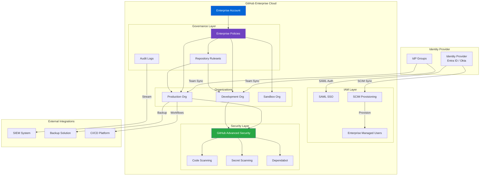

### Architecture Components

1. **Identity Provider Layer**: Centralized authentication and user provisioning
2. **IAM Layer**: SAML SSO, SCIM provisioning, and Enterprise Managed Users
3. **Organization Layer**: Multi-org topology for environment separation
4. **Security Layer**: GitHub Advanced Security features
5. **Governance Layer**: Enterprise policies, rulesets, and audit logging
6. **Integration Layer**: External systems (SIEM, backup, CI/CD)

---

## Organization Topology Patterns

### Pattern 1: Single Organization

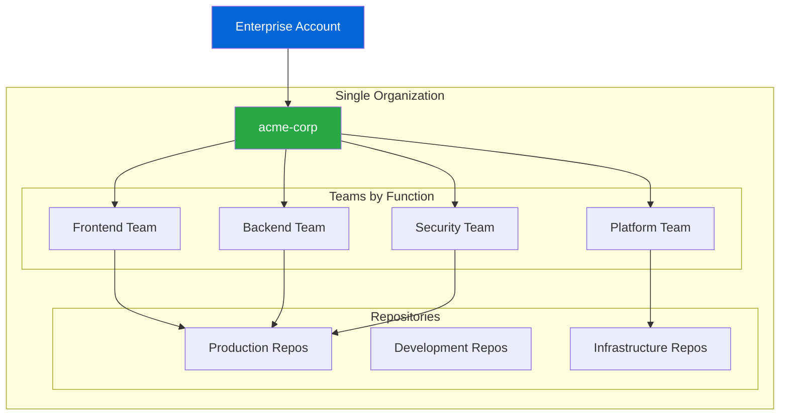

**Best For:**
- Small to medium enterprises (< 500 developers)
- Single business unit
- Unified governance model
- Simple compliance requirements

### Pattern 2: Multi-Organization (Red-Green-Sandbox-Archive)

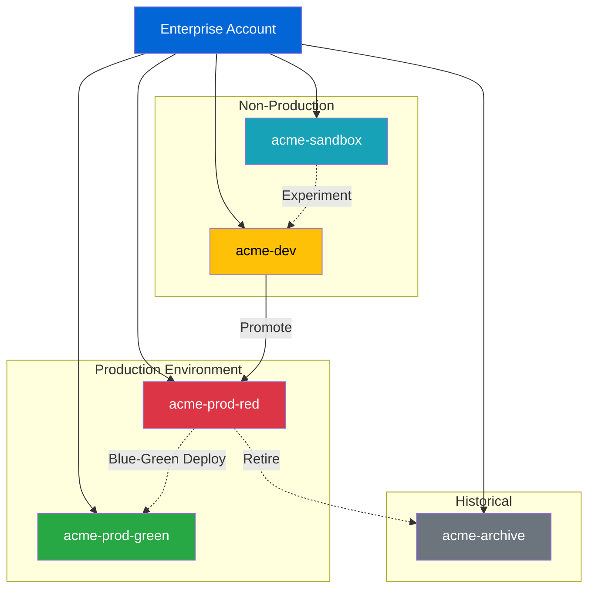

**Best For:**
- Large enterprises (500+ developers)
- Blue-green deployment patterns
- Multiple environments with strict separation
- Complex compliance requirements
- Innovation and experimentation needs

### Pattern 3: Business Unit Separation

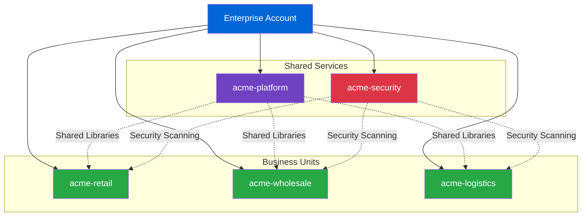

**Best For:**
- Multi-division enterprises
- Independent P&L units
- Different compliance requirements per unit
- Decentralized governance

---

## IAM Integration Architecture

### Enterprise Managed Users (EMU) with Microsoft Entra ID

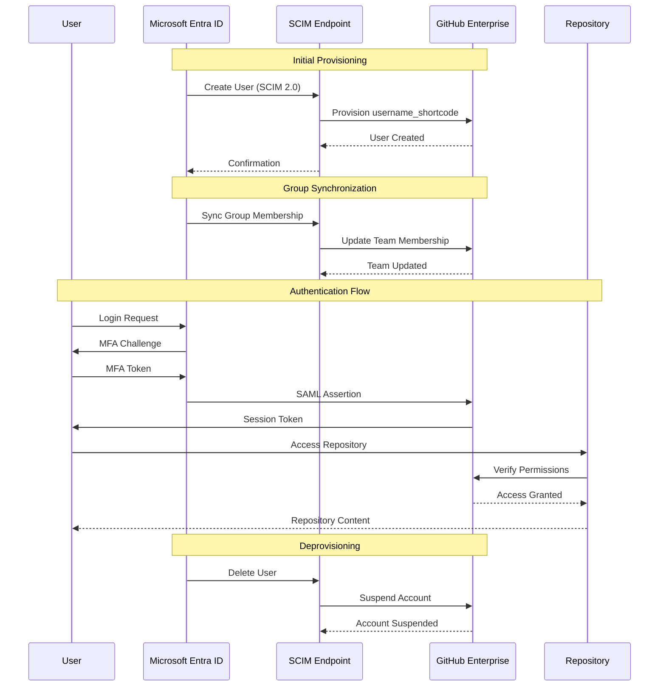

### Personal Accounts with SAML SSO

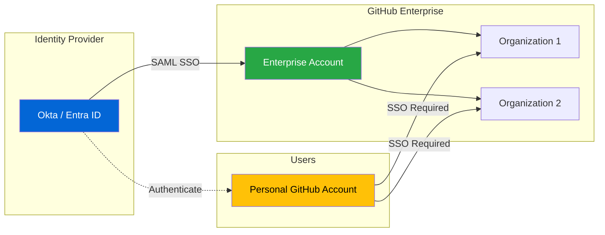

**Key Differences:**

| Feature | EMU | Personal Accounts with SSO |
|---------|-----|---------------------------|
| Identity Source | IdP only | GitHub + IdP |
| Username Format | user_shortcode | user (personal) |
| Account Creation | IdP provisioning | Self-service |
| Deprovisioning | Automatic via SCIM | Manual removal |
| External Collaboration | Limited | Full access |
| Public Repos | Enterprise only | Personal + Enterprise |

---

## Security Scanning Architecture

### GitHub Advanced Security Pipeline

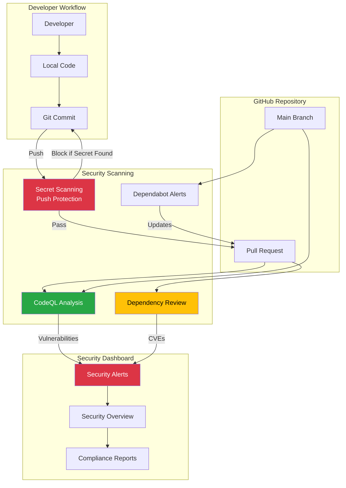

### Secret Scanning with Push Protection

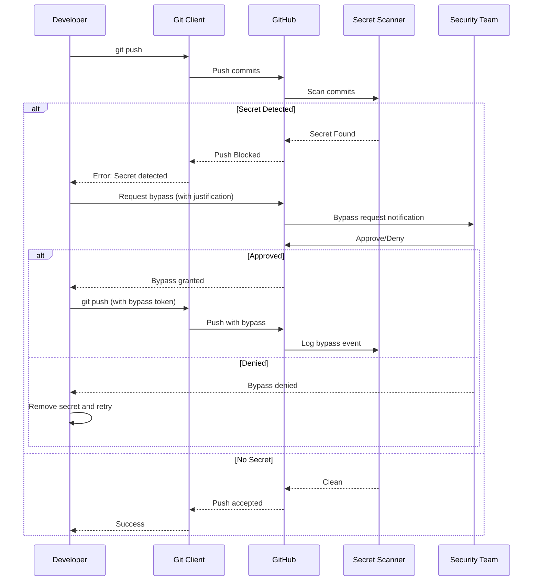

---

## CI/CD Pipeline Governance Architecture

### GitHub Actions with Policy Enforcement

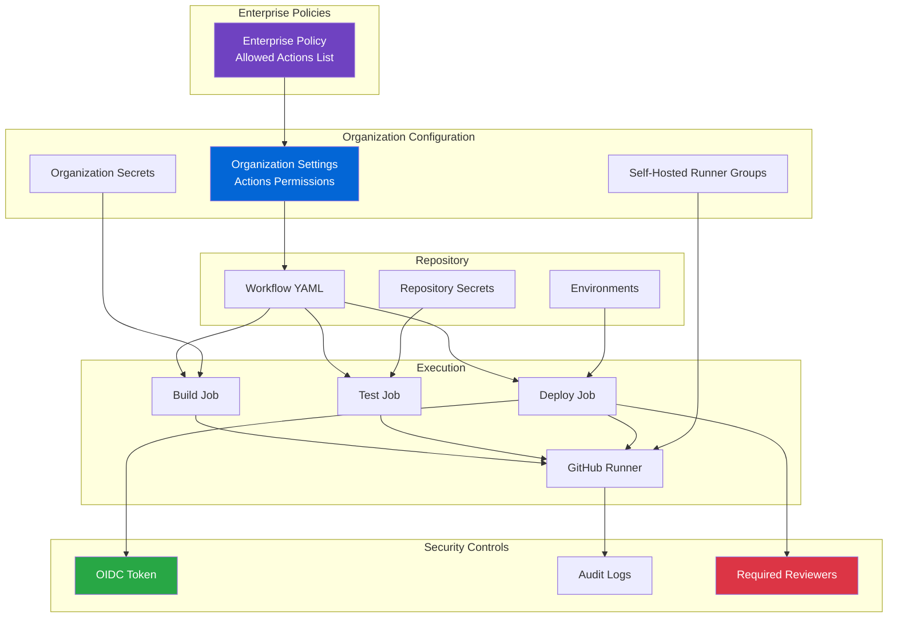

### Deployment Pipeline with Environments

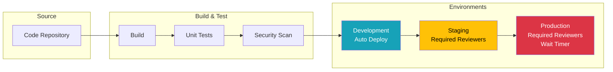

---

## Hybrid and Multi-Cloud Integration

### GitHub Enterprise with On-Premises Systems

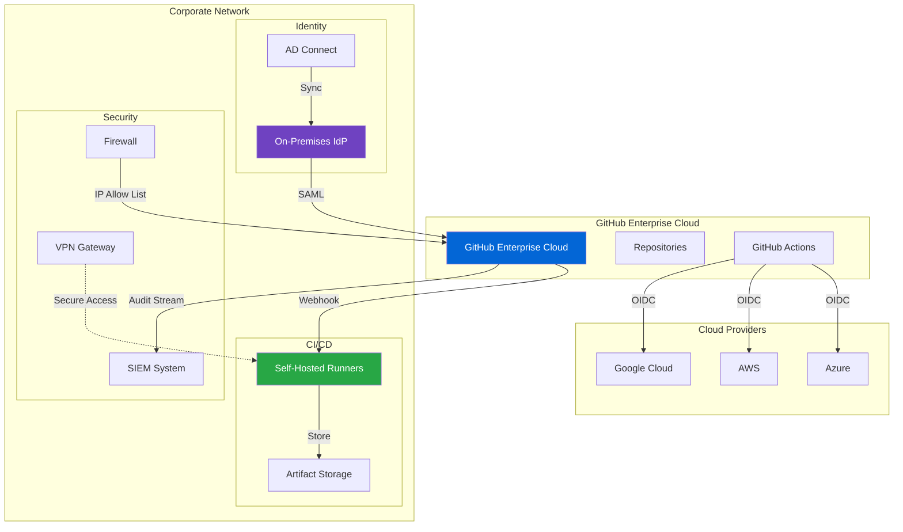

---

## Migration Architecture

### Migration from Other Platforms to GitHub Enterprise Cloud

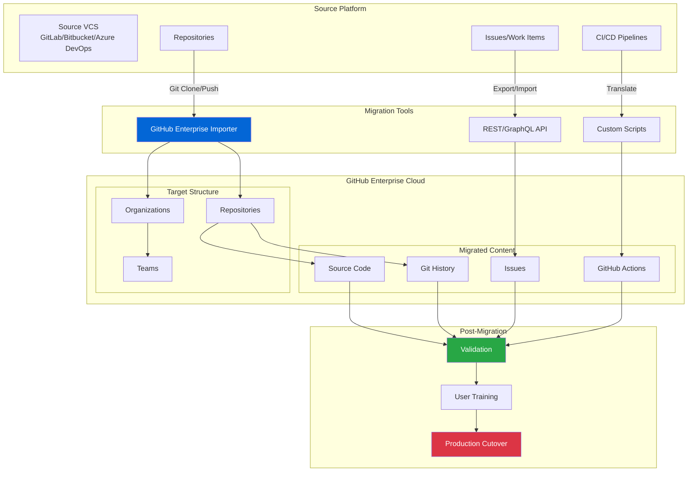

### Migration Phases

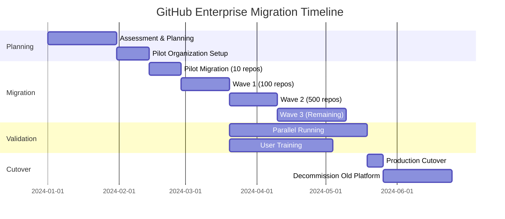

---

## Quick Reference Cards

### Permission Levels Quick Reference

#### Repository Permissions

| Level | Read | Write | Admin |
|-------|------|-------|-------|
| **Read** | ✅ View code<br>✅ Open issues<br>✅ Comment | ❌ | ❌ |
| **Triage** | ✅ Read access<br>✅ Manage issues<br>✅ Manage PRs | ❌ | ❌ |
| **Write** | ✅ Triage access<br>✅ Push commits<br>✅ Merge PRs | ✅ Push to branch<br>✅ Create releases | ❌ |
| **Maintain** | ✅ Write access<br>✅ Manage issues<br>✅ Manage releases | ✅ Push to protected<br>✅ Manage webhooks | ❌ Delete repo |
| **Admin** | ✅ Maintain access<br>✅ Full control | ✅ All write access | ✅ Delete repo<br>✅ Manage settings<br>✅ Manage access |

#### Organization Roles

| Role | Scope | Key Permissions |
|------|-------|-----------------|
| **Owner** | Organization | • Full admin access<br>• Manage all repos<br>• Manage members<br>• Configure SSO<br>• Access billing |
| **Billing Manager** | Billing only | • View billing info<br>• Update payment methods<br>• View usage reports |
| **Member** | Limited | • Create repos (if allowed)<br>• Create teams<br>• View members |
| **Moderator** | Content | • Block/unblock users<br>• Limit interactions<br>• Manage comments |

#### Enterprise Roles

| Role | Permissions |
|------|-------------|
| **Enterprise Owner** | • Full enterprise control<br>• Manage organizations<br>• Configure policies<br>• Access audit logs<br>• Manage billing |
| **Billing Manager** | • View/update billing<br>• View usage reports<br>• No organization access |
| **Member** | • Access via organization<br>• No enterprise settings |

### Policy Inheritance Matrix

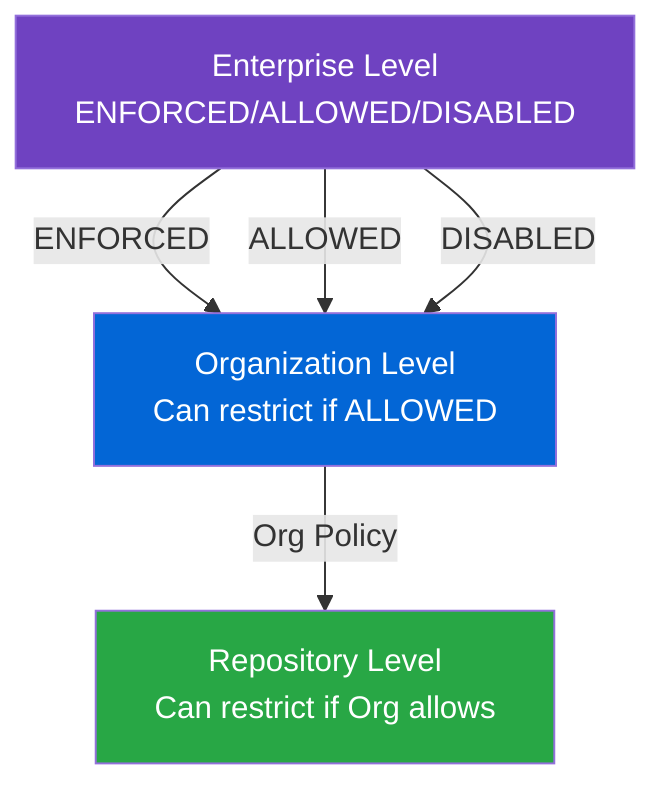

| Policy | Enterprise | Organization | Repository |
|--------|-----------|--------------|------------|
| **Actions Permissions** | Allowed list | Can restrict further | Cannot override |
| **Repository Visibility** | Enforced/Allowed | Can restrict | Cannot override |
| **Forking** | Allowed/Disabled | Can disable | Cannot override |
| **GitHub Pages** | Enabled/Disabled | Can disable | Cannot override |
| **Branch Protection** | N/A | N/A | Full control |
| **Rulesets** | Via org policy | Applied to repos | Can add more rules |

### Security Features Matrix

| Feature | Free | Team | Enterprise with GHAS |
|---------|------|------|----------------------|
| **Dependabot Alerts** | Public repos | All repos | All repos |
| **Dependabot Security Updates** | Public repos | All repos | All repos |
| **Dependabot Version Updates** | ✅ | ✅ | ✅ |
| **Dependency Review** | Public repos | ❌ | ✅ |
| **Code Scanning (CodeQL)** | Public repos | ❌ | ✅ |
| **Secret Scanning** | Public repos | ❌ | ✅ |
| **Secret Push Protection** | Public repos | ❌ | ✅ |
| **Custom Secret Patterns** | ❌ | ❌ | ✅ |
| **Security Overview** | ❌ | ❌ | ✅ |

### Rulesets vs Branch Protection

| Feature | Branch Protection | Rulesets |
|---------|------------------|----------|
| **Scope** | Single branch pattern | Multiple branches/tags |
| **Organization-Wide** | ❌ | ✅ |
| **Bypass Actors** | Limited | ✅ Full control |
| **Status Checks** | ✅ | ✅ |
| **File Path Restrictions** | ❌ | ✅ |
| **Metadata Restrictions** | ❌ | ✅ (commit message, author) |
| **Import/Export** | ❌ | ✅ |
| **Evaluation Modes** | N/A | Active/Evaluate |

### Common CLI Commands

```bash
# GitHub CLI (gh) - Essential Commands

# Authentication
gh auth login
gh auth status

# Repository Management
gh repo create org/repo --public
gh repo clone org/repo
gh repo view org/repo

# Organization Management
gh api orgs/my-org
gh api orgs/my-org/members

# Team Management
gh api orgs/my-org/teams/my-team/members
gh api -X PUT orgs/my-org/teams/my-team/repos/my-org/my-repo

# Security Alerts
gh api repos/my-org/my-repo/code-scanning/alerts
gh api repos/my-org/my-repo/secret-scanning/alerts
gh api repos/my-org/my-repo/dependabot/alerts

# Audit Log (Enterprise)
gh api enterprises/my-enterprise/audit-log

# Actions
gh workflow list
gh workflow run workflow.yml
gh run list
gh run view 1234567890

# Rulesets
gh api repos/my-org/my-repo/rulesets
gh api -X POST repos/my-org/my-repo/rulesets --input ruleset.json

# Organization Policies
gh api -X PUT orgs/my-org/actions/permissions --field allowed_actions=selected
```

### Terraform Resource Quick Reference

```hcl
# Essential GitHub Terraform Resources

# Organization
resource "github_organization_settings" "main" {
  billing_email = "billing@example.com"
}

# Team
resource "github_team" "engineering" {
  name        = "engineering"
  description = "Engineering team"
  privacy     = "closed"
}

# Repository
resource "github_repository" "main" {
  name        = "my-repo"
  visibility  = "private"
  auto_init   = true
}

# Team Repository Access
resource "github_team_repository" "main" {
  team_id    = github_team.engineering.id
  repository = github_repository.main.name
  permission = "push"
}

# Branch Protection
resource "github_branch_protection" "main" {
  repository_id = github_repository.main.node_id
  pattern       = "main"
  
  required_pull_request_reviews {
    required_approving_review_count = 2
  }
}

# Repository Ruleset
resource "github_repository_ruleset" "main" {
  name        = "main-protection"
  repository  = github_repository.main.name
  target      = "branch"
  enforcement = "active"
  
  rules {
    required_linear_history = true
    required_signatures     = true
  }
}

# Actions Secrets
resource "github_actions_organization_secret" "main" {
  secret_name     = "API_TOKEN"
  visibility      = "selected"
  plaintext_value = var.api_token
}
```

---

## Architecture Decision Records

### ADR-001: Choose EMU vs Personal Accounts

**Status:** Template

**Context:** Organizations must decide between Enterprise Managed Users (EMU) and personal accounts with SAML SSO.

**Decision Factors:**

| Factor | EMU | Personal Accounts |
|--------|-----|-------------------|
| Identity Control | ✅ Full control | ⚠️ Partial |
| External Collaboration | ⚠️ Limited | ✅ Full |
| Open Source Contributions | ❌ | ✅ |
| Compliance Requirements | ✅ Strong | ⚠️ Moderate |
| User Experience | ⚠️ Separate accounts | ✅ Single account |
| Implementation Complexity | ⚠️ Complex | ✅ Simple |

**Recommendation:**
- **Choose EMU if:** Strict compliance, regulated industry, need full lifecycle control
- **Choose Personal Accounts if:** Open source contributions, external collaboration, developer experience priority

### ADR-002: Single vs Multi-Organization

**Status:** Template

**Decision Factors:**

| Factor | Single Org | Multi Org |
|--------|-----------|-----------|
| Simplicity | ✅ Simple | ⚠️ Complex |
| Environment Separation | ⚠️ Weak | ✅ Strong |
| Policy Management | ✅ Centralized | ⚠️ Distributed |
| Compliance Isolation | ⚠️ Limited | ✅ Strong |
| Cost | ✅ Lower | ⚠️ Higher |
| Scalability | ⚠️ Limited | ✅ High |

**Recommendation:**
- **Single Org:** < 500 developers, simple governance, unified business unit
- **Multi Org:** > 500 developers, multiple environments, complex compliance, business unit separation

---

## Integration Patterns

### Pattern: SIEM Integration with Audit Log Streaming

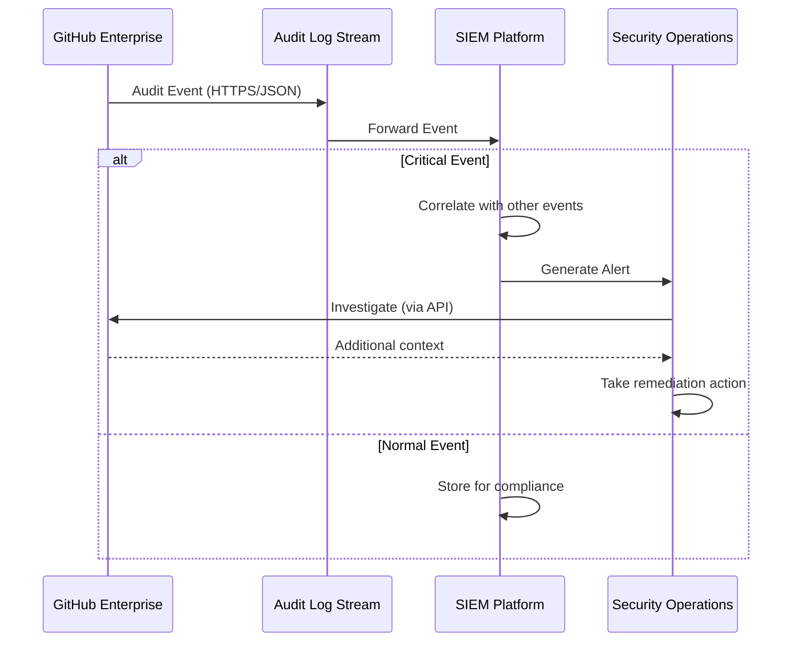

### Pattern: Automated Compliance Reporting

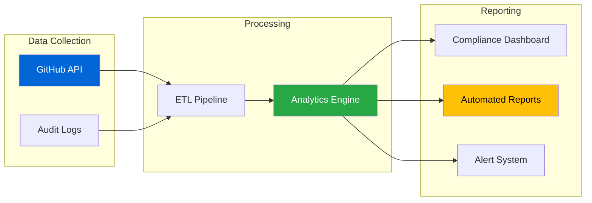

---

## Summary

This reference architecture document provides consolidated views of:

1. **Complete Enterprise Architecture** - All components and relationships
2. **Organization Topologies** - Single, multi-org, and business unit patterns
3. **IAM Integration** - EMU and personal account flows
4. **Security Architecture** - GHAS features and scanning pipelines
5. **CI/CD Governance** - Actions policies and deployment patterns
6. **Hybrid Integration** - On-premises and multi-cloud connections
7. **Migration Patterns** - Moving to GitHub Enterprise Cloud
8. **Quick References** - Permissions, policies, CLI commands, and Terraform

### Related Documentation

- [Enterprise Hierarchy](01-enterprise-hierarchy.md) - Enterprise structure and roles
- [Organization Strategies](02-organization-strategies.md) - Org design patterns
- [Identity & Access Management](03-identity-access-management.md) - IAM configuration
- [Enterprise Managed Users](04-enterprise-managed-users.md) - EMU deep dive
- [Teams & Permissions](05-teams-permissions.md) - Team structures
- [Policy Inheritance](06-policy-inheritance.md) - Policy enforcement
- [Repository Governance](07-repository-governance.md) - Repo settings and rulesets
- [Security & Compliance](08-security-compliance.md) - GHAS and compliance
- [Best Practices & WAF](09-best-practices-waf.md) - Well-Architected Framework

---

## References

### Architecture Documentation
- [GitHub Enterprise Cloud Architecture](https://docs.github.com/en/enterprise-cloud@latest/admin)
- [GitHub Well-Architected Framework](https://wellarchitected.github.com/)
- [GitHub Enterprise Onboarding](https://docs.github.com/en/enterprise-cloud@latest/enterprise-onboarding)

### Integration Guides
- [SAML Configuration](https://docs.github.com/en/enterprise-cloud@latest/admin/identity-and-access-management/using-saml-for-enterprise-iam)
- [SCIM Provisioning](https://docs.github.com/en/enterprise-cloud@latest/admin/identity-and-access-management/provisioning-user-accounts-for-enterprise-managed-users)
- [Audit Log Streaming](https://docs.github.com/en/enterprise-cloud@latest/admin/monitoring-activity-in-your-enterprise/reviewing-audit-logs-for-your-enterprise/streaming-the-audit-log-for-your-enterprise)

### API References
- [GitHub REST API](https://docs.github.com/en/rest)
- [GitHub GraphQL API](https://docs.github.com/en/graphql)
- [GitHub CLI](https://cli.github.com/)

### Terraform Provider
- [GitHub Terraform Provider](https://registry.terraform.io/providers/integrations/github/latest/docs)

### Best Practices
- [Best Practices for Organizations](https://github.blog/enterprise-software/devops/best-practices-for-organizations-and-teams-using-github-enterprise-cloud/)
- [GitHub Enterprise Cloud eBook](https://assets.ctfassets.net/wfutmusr1t3h/ooXuGRtFrKHrFZ8cIdbUC/4333e8014b2e950d9381bdb102415e3a/GitHub-Enterprise-Cloud_ebook.pdf)
