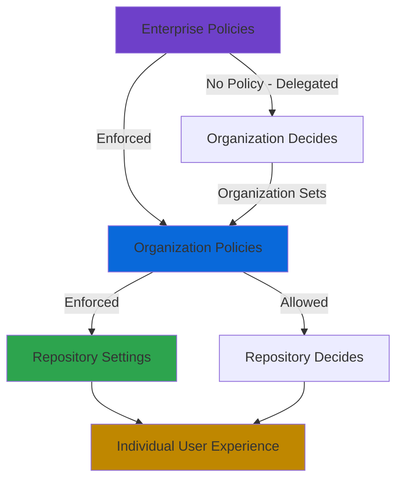

# GitHub Copilot Governance

This document provides comprehensive guidance for configuring GitHub Copilot policies, settings, and best practices for enterprise deployments. Following these recommendations will help establish secure and effective AI-assisted development practices following the principle of "security by default."

> **Last Updated:** January 18, 2026

---

## Table of Contents

1. [Overview](#overview)
2. [GitHub Copilot Plans for Business](#github-copilot-plans-for-business)
3. [Policy Architecture](#policy-architecture)
4. [Configuring Enterprise Policies](#configuring-enterprise-policies)
5. [Configuring Organization Policies](#configuring-organization-policies)
6. [Content Exclusions](#content-exclusions)
7. [Network Configuration](#network-configuration)
8. [License Management](#license-management)
9. [Driving Enterprise Adoption](#driving-enterprise-adoption)
10. [Best Practices for Using Copilot](#best-practices-for-using-copilot)
11. [Copilot Coding Agent Governance](#copilot-coding-agent-governance)
12. [Audit and Compliance](#audit-and-compliance)
13. [Troubleshooting](#troubleshooting)
14. [References](#references)

---

## Overview

GitHub Copilot is an AI-powered coding assistant that helps developers write code faster and with less effort. For enterprises adopting GitHub Copilot, establishing proper governance through policies, settings, and best practices ensures consistent usage, maintains security compliance, and maximizes return on investment across the organization.

This document provides comprehensive guidance for enterprise administrators, organization owners, and security teams on configuring GitHub Copilot policies, implementing content exclusions, managing licenses, driving adoption, and following best practices for AI-assisted development at scale.

GitHub Copilot governance operates through a hierarchical policy model that flows from enterprise to organization to individual developer settings. Enterprise owners can enforce policies across all organizations, delegate policy decisions to organization owners, or allow individual developers to configure their own preferences within defined boundaries. Understanding this hierarchy and the available controls is essential for effective Copilot governance.

Modern enterprise deployments require balancing developer productivity with security, compliance, and cost management concerns. This involves careful consideration of which Copilot features to enable, what content to exclude from AI suggestions, how to manage licenses efficiently, and how to measure and optimize Copilot adoption over time.

## GitHub Copilot Plans for Business

### Plan Comparison

GitHub offers multiple Copilot subscription plans tailored for different organizational needs:

| Feature | Copilot Business | Copilot Enterprise |
|---------|------------------|-------------------|
| **Target Audience** | Organizations requiring centralized management | Large enterprises needing advanced features |
| **Code Completions** | Unlimited | Unlimited |
| **Chat Capabilities** | IDE and CLI | IDE, CLI, and GitHub.com |
| **Model Selection** | Standard models | Premium and advanced models |
| **Copilot Code Review** | ✓ | ✓ |
| **Copilot Coding Agent** | ✓ | ✓ |
| **Knowledge Bases** | ✗ | ✓ |
| **Custom Instructions** | Organization-level | Enterprise-wide |
| **Admin Controls** | Organization policies | Enterprise policies + audit logs |
| **Content Exclusions** | ✓ | ✓ |
| **IP Indemnification** | ✓ | ✓ |
| **Data Privacy** | No code retention | No code retention |

### Licensing Model

Copilot Business and Enterprise licenses are assigned per seat, with billing based on the number of active users. Key licensing considerations include:

**Seat Assignment Methods**:
- Direct assignment to individual users
- Assignment through team membership
- Self-service license claiming (with proper configuration)
- Automatic assignment based on organization membership

**Cost Management**:
- Licenses can be reclaimed from inactive users
- Usage metrics help identify underutilized licenses
- Enterprise billing provides consolidated cost visibility
- Seat caps can limit maximum license consumption

**License Inheritance**:
- Users receive Copilot access through their organization membership
- Enterprise policies can override organization-level license controls
- Users with multiple organization memberships inherit the most permissive policy

## Policy Architecture

### Policy Hierarchy



GitHub Copilot policies follow the standard GitHub Enterprise Cloud policy inheritance model:

**Enterprise Level**: Enterprise owners define policies that apply across all organizations within the enterprise. Enterprise policies can:
- **Enforce** specific settings, preventing organizations from changing them
- **Set "No Policy"** to delegate decisions to organization owners
- **Configure defaults** for enterprise-assigned users

**Organization Level**: Organization owners configure policies for their organization, subject to enterprise-level constraints:
- Can only configure policies not enforced at enterprise level
- Set defaults for repositories within the organization
- Control feature availability for organization members

**Repository Level**: Repository administrators can configure content exclusions for specific repositories, subject to organization policies.

**Individual Level**: Developers can configure personal preferences in their IDE, subject to organizational policy constraints.

### Policy Types

GitHub Copilot policies are organized into three categories:

**Feature Policies**: Control the availability of Copilot features
- Copilot in the IDE (code completions)
- Copilot Chat in IDE
- Copilot Chat in GitHub.com
- Copilot Chat in GitHub Mobile
- Copilot CLI
- Copilot code review
- Copilot coding agent
- Agent mode in IDE
- MCP servers support

**Privacy Policies**: Control data handling and sensitive operations
- Suggestions matching public code
- Prompt and suggestion collection
- User feedback collection
- Preview feature opt-in

**Models Policies**: Control access to AI models
- Default model selection
- Premium model access
- Model usage limits

### Policy Enforcement Options

For feature policies at the enterprise level:

| Setting | Behavior |
|---------|----------|
| **Enabled** | Feature is available to all users; organizations cannot disable |
| **Disabled** | Feature is blocked for all users; organizations cannot enable |
| **No Policy** | Organization owners decide whether to enable or disable |

For organization-level policies:

| Setting | Behavior |
|---------|----------|
| **Enabled** | Feature is available to all organization members |
| **Disabled** | Feature is blocked for all organization members |
| **Unconfigured** | Placeholder until organization owner selects a setting |

For privacy policies, options are typically "Allowed" or "Blocked" to clearly indicate the impact on data handling.

## Configuring Enterprise Policies

### Accessing AI Controls

Enterprise owners manage Copilot policies through the AI Controls section:

1. Navigate to your enterprise settings
2. Click **AI controls** at the top of the page
3. Use the sidebar to navigate between:
   - **Agents**: Configure AI agent policies
   - **Copilot**: Configure Copilot feature and privacy policies
   - **MCP**: Configure Model Context Protocol settings

### Security-by-Default Enterprise Policy Configuration

For enterprise deployments following security-by-default principles, the following configuration prioritizes security and compliance while enabling developer productivity:

> **Security Principle**: Start with restrictive settings and enable features based on demonstrated need and security review.

**Core Feature Policies**:

| Policy | Security-by-Default Setting | Rationale | Reference |
|--------|----------------------------|-----------|----------|
| Copilot in IDE | **Enabled** | Core productivity feature with code remaining local | [GitHub Copilot policies](https://docs.github.com/en/enterprise-cloud@latest/copilot/concepts/policies) |
| Copilot Chat in IDE | **Enabled** | Essential for context-aware assistance | [GitHub Copilot policies](https://docs.github.com/en/enterprise-cloud@latest/copilot/concepts/policies) |
| Copilot Chat in GitHub.com | **Enabled** | Enables web-based chat for GitHub workflows | [Managing Copilot policies](https://docs.github.com/en/enterprise-cloud@latest/copilot/managing-copilot/managing-copilot-for-your-enterprise/managing-policies-and-features-for-copilot-in-your-enterprise) |
| Copilot CLI | **Enabled** | Useful for command-line workflows | [GitHub Copilot policies](https://docs.github.com/en/enterprise-cloud@latest/copilot/concepts/policies) |
| Copilot code review | **Enabled** | Improves code quality and security | [GitHub Copilot policies](https://docs.github.com/en/enterprise-cloud@latest/copilot/concepts/policies) |
| Copilot coding agent | **Disabled** or **No Policy** | Requires careful evaluation; allows autonomous code changes | [About coding agent](https://docs.github.com/en/copilot/concepts/agents/coding-agent/about-coding-agent) |
| Agent mode in IDE | **No Policy** | Let organizations decide based on security posture | [GitHub Copilot policies](https://docs.github.com/en/enterprise-cloud@latest/copilot/concepts/policies) |
| MCP servers | **Disabled** | External integrations require security review | [MCP documentation](https://docs.github.com/en/copilot/concepts/mcp) |

**Privacy Policies (Critical for Security)**:

| Policy | Security-by-Default Setting | Rationale | Reference |
|--------|----------------------------|-----------|----------|
| Suggestions matching public code | **Blocked** | Prevents suggestions identical to public code; reduces IP and licensing risks | [Managing Copilot policies](https://docs.github.com/en/enterprise-cloud@latest/copilot/managing-copilot/managing-copilot-for-your-enterprise/managing-policies-and-features-for-copilot-in-your-enterprise) |
| Prompt and suggestion collection | **Blocked** | Maintains data privacy; code is not retained | [GitHub Copilot Trust Center](https://copilot.github.trust.page/) |
| User feedback collection | **Allowed** (Optional) | Helps improve Copilot; enable only if participating in product improvement | [Managing Copilot policies](https://docs.github.com/en/enterprise-cloud@latest/copilot/managing-copilot/managing-copilot-for-your-enterprise/managing-policies-and-features-for-copilot-in-your-enterprise) |
| Preview features | **Disabled** | Avoid preview features in production; enable only for evaluation | [Managing Copilot policies](https://docs.github.com/en/enterprise-cloud@latest/copilot/managing-copilot/managing-copilot-for-your-enterprise/managing-policies-and-features-for-copilot-in-your-enterprise) |

**Models Policies**:

| Policy | Security-by-Default Setting | Rationale | Reference |
|--------|----------------------------|-----------|----------|
| Default model | **GPT-4o** or latest stable | Use stable, well-tested models | [GitHub Copilot policies](https://docs.github.com/en/enterprise-cloud@latest/copilot/concepts/policies) |
| Premium models | **No Policy** | Let organizations decide based on cost/benefit | [GitHub Copilot policies](https://docs.github.com/en/enterprise-cloud@latest/copilot/concepts/policies) |

### Configuring Policies Step-by-Step

To configure enterprise Copilot policies:

1. In the top-right corner of GitHub, click your profile picture
2. Click **Enterprises** and select your enterprise
3. Click the **AI controls** tab at the top of the page
4. In the sidebar, click **Copilot**
5. For each policy:
   - Policies with dropdown menus: Select the enforcement option
   - Policies with toggles: Click to enable or disable
   - Policies requiring additional configuration: Click the policy name

### Policies for Enterprise-Assigned Users

When users receive Copilot access directly from the enterprise (rather than through an organization), additional configuration determines how "No Policy" settings behave:

- **Enable by default**: Features default to enabled for enterprise-assigned users
- **Disable by default**: Features default to disabled unless explicitly enabled

This setting is particularly important for enterprises using the dedicated Copilot Business model without full GitHub Enterprise licenses.

## Configuring Organization Policies

### Organization Policy Management

Organization owners configure Copilot policies through organization settings:

1. Click your profile picture, then **Organizations**
2. Click **Settings** next to your organization
3. In the sidebar, under "Code, planning, and automation," click **Copilot**
4. Select **Policies** to configure feature availability
5. Select **Models** to configure model access

Organization policies are subject to enterprise-level constraints—settings enforced at the enterprise level cannot be changed at the organization level.

### Feature and Model Configuration

For each policy, organization owners can select:
- **Enabled**: Available to all organization members with Copilot licenses
- **Disabled**: Blocked for all organization members
- **Unconfigured**: Initial placeholder state (treated as disabled until configured)

**Best Practice**: Review and explicitly configure all policies rather than leaving them unconfigured. This ensures intentional governance rather than accidental restrictions.

### Preview Features and Feedback

Organizations can opt into Copilot preview features and feedback collection:

**Preview Features**: When enabled, users can test new Copilot features before general availability. Considerations:
- Preview features may have bugs or limitations
- Features may change or be discontinued
- Early access helps teams prepare for new capabilities

**Feedback Collection**: When enabled, users can provide feedback on Copilot features:
- Improves Copilot quality over time
- Helps GitHub prioritize improvements
- Feedback is anonymized and aggregated

## Content Exclusions

### Understanding Content Exclusions

Content exclusions prevent GitHub Copilot from accessing specified files or repositories when generating suggestions. This is essential for:

- **Security**: Protecting sensitive configuration files, secrets, and credentials
- **Compliance**: Excluding regulated data from AI processing
- **Intellectual Property**: Protecting proprietary algorithms and business logic
- **Data Residency**: Meeting data sovereignty requirements

When content is excluded:
- Copilot will not use that content as context for suggestions
- Inline suggestions are disabled for excluded files
- Copilot Chat cannot reference excluded content

**Important Limitations**: Content exclusions do not currently apply to:
- GitHub Copilot CLI
- Copilot coding agent
- Agent mode in Copilot Chat

> **⚠️ Security Warning**: Because content exclusions do not apply to Copilot coding agent and Agent mode, organizations with sensitive codebases should carefully evaluate enabling these features. Consider disabling them at the enterprise level if content exclusion is critical for compliance.

### Repository-Level Exclusions

Repository administrators can exclude content within their repository:

1. Navigate to the repository on GitHub
2. Click **Settings**
3. Under "Code & automation," click **Copilot** → **Content exclusion**
4. Enter paths to exclude using the format: `- "/PATH/TO/DIRECTORY/OR/FILE"`

**Example Configuration**:
```yaml
# Exclude specific sensitive files
- "/src/some-dir/kernel.rs"
- "secrets.json"

# Exclude by pattern
- "secret*"
- "*.cfg"

# Exclude directories
- "/scripts/**"
- "/config/**"
```

### Organization-Level Exclusions

Organization owners can exclude content across multiple repositories:

1. Navigate to organization **Settings**
2. Click **Copilot** → **Content exclusion**
3. Enter repository references and paths

**Example Configuration**:
```yaml
# Exclude from all repositories
"*":
  - "**/.env"
  - "**/secrets/**"

# Exclude from specific repository
octo-repo:
  - "/src/some-dir/kernel.rs"
  - "secrets.json"

# Exclude from external repository
https://github.com/primer/react.git:
  - "secrets.json"
  - "/src/**/temp.rb"

# Exclude from any repository named 'copilot' across organizations
git@github.com:*/copilot:
  - "/__tests__/**"
  - "/scripts/*"
```

### Enterprise-Level Exclusions

Enterprise owners can configure content exclusions that apply to all users across the enterprise:

1. Navigate to enterprise settings
2. Click **AI controls**
3. In the sidebar, click **Copilot**
4. Click **Content exclusion**
5. Configure exclusions using the same syntax as organization-level

**Key Difference**: Enterprise-level exclusions apply to all Copilot users in the enterprise, regardless of which organization assigned their license. Organization-level exclusions only apply to users licensed through that specific organization.

### Content Exclusion Best Practices

**Security-Focused Exclusions**:
```yaml
# Exclude all environment and secret files
"*":
  - "**/.env"
  - "**/.env.*"
  - "**/secrets/**"
  - "**/*secret*"
  - "**/*credential*"
  - "**/config/production.*"
```

**Compliance-Focused Exclusions**:
```yaml
# Exclude regulated data directories
"*":
  - "**/pii/**"
  - "**/hipaa/**"
  - "**/gdpr/**"
  - "**/financial/**"
```

**Testing Exclusions**: After configuring exclusions:
1. Wait up to 30 minutes for settings to propagate, or reload your IDE
2. Open an excluded file
3. Verify no inline suggestions appear
4. In Copilot Chat, ask to explain the file—it should not be able to use the file content

### Recommended Content Exclusion Patterns

The following patterns represent security-by-default exclusions for enterprise environments:

**Enterprise-Level Mandatory Exclusions**:
```yaml
# Secrets and credentials (CRITICAL)
"*":
  - "**/.env"
  - "**/.env.*"
  - "**/secrets/**"
  - "**/*secret*"
  - "**/*credential*"
  - "**/*password*"
  - "**/config/production.*"
  - "**/*.pem"
  - "**/*.key"
  - "**/*.p12"
  - "**/*.pfx"
  - "**/id_rsa*"
  - "**/id_ed25519*"

# Infrastructure and deployment secrets
"*":
  - "**/terraform.tfvars"
  - "**/*.tfstate"
  - "**/ansible/vault*"
  - "**/kubeconfig*"
```

**Compliance-Focused Exclusions**:
```yaml
# PII and regulated data
"*":
  - "**/pii/**"
  - "**/hipaa/**"
  - "**/gdpr/**"
  - "**/financial/**"
  - "**/customer-data/**"
  - "**/pci/**"

# Legal and proprietary
"*":
  - "**/legal/**"
  - "**/patents/**"
  - "**/proprietary/**"
```

**Security-Critical Path Exclusions**:
```yaml
# Authentication and authorization
"*":
  - "**/auth/**"
  - "**/authentication/**"
  - "**/authorization/**"
  - "**/crypto/**"
  - "**/security/**"
```

## Network Configuration

### Firewall and Proxy Configuration

Enterprise users connecting through firewalls or proxy servers must ensure Copilot endpoints are accessible. The following domains should be added to your allowlist:

**Essential Endpoints**:
| Domain | Purpose |
|--------|---------|
| `github.com` | Authentication and repository access |
| `api.github.com` | GitHub API access |
| `copilot.github.com` | Copilot service |
| `*.githubcopilot.com` | Copilot completions |
| `copilot-proxy.githubusercontent.com` | Copilot proxy |
| `copilot-telemetry.githubusercontent.com` | Telemetry (if enabled) |

**Additional Endpoints for Full Functionality**:
| Domain | Purpose |
|--------|---------|
| `*.github.dev` | GitHub Codespaces |
| `vscode-cdn.net` | VS Code extensions |
| `marketplace.visualstudio.com` | Extension marketplace |

### SSL Certificate Configuration

For environments using custom SSL certificates (SSL inspection, corporate proxies):

1. Obtain your organization's root CA certificate
2. Configure your IDE to trust the certificate:
   - **VS Code**: Add to system certificate store or configure `http.proxyStrictSSL`
   - **JetBrains**: Add to IDE's trusted certificates
   - **Visual Studio**: Uses system certificate store

3. Set environment variables if needed:
   ```bash
   export NODE_EXTRA_CA_CERTS=/path/to/ca-bundle.crt
   ```

### Troubleshooting Network Issues

Common network-related issues and solutions:

| Issue | Possible Cause | Solution |
|-------|---------------|----------|
| "Unable to connect" | Firewall blocking | Add Copilot domains to allowlist |
| Certificate errors | SSL inspection | Install corporate CA certificate |
| Slow responses | Proxy latency | Optimize proxy routing for Copilot domains |
| Intermittent failures | Network instability | Check proxy logs, enable retry logic |

## License Management

### Granting Access

Enterprises can grant Copilot access through multiple methods:

**Method 1: Enable for Organizations**
1. Navigate to enterprise AI controls
2. Enable Copilot for specific organizations
3. Organization owners assign licenses to members

**Method 2: Direct Enterprise Assignment**
1. Assign licenses directly to users from enterprise settings
2. Useful for users who don't have GitHub Enterprise licenses
3. Currently only available for Copilot Business

**Method 3: Team-Based Assignment**
1. Create teams representing Copilot-eligible groups
2. Grant Copilot access to teams
3. Team membership changes automatically adjust access

### Self-Service License Model

Many successful enterprise rollouts implement self-service license claiming:

**Benefits**:
- Reduces administrative overhead
- Accelerates adoption
- Empowers developers to access tools when needed

**Implementation Options**:
1. **GitHub App**: Use a GitHub App to automate license assignment based on criteria
2. **Issue-Based Requests**: Create an issue template for license requests
3. **Team Membership**: Allow users to join a Copilot-enabled team
4. **Automatic Assignment**: Enable Copilot for all organization members

### Monitoring License Usage

Track license utilization to optimize costs:

**Usage Metrics Dashboard**:
- Access through enterprise **Insights** tab
- View total active users, daily/weekly active users
- Monitor feature adoption across languages and IDEs

**API-Based Monitoring**:
```
GET /enterprises/{enterprise}/copilot/metrics/reports/enterprise-28-day/latest
GET /enterprises/{enterprise}/copilot/metrics/reports/users-28-day/latest
```

**Inactive User Management**:
- Identify users who haven't used Copilot recently
- Send reminders or reclaim unused licenses
- Set policies for automatic license reclamation

### Cost Optimization Strategies

| Strategy | Implementation | Impact |
|----------|----------------|--------|
| Usage-based assignment | Only assign to active developers | Reduces unused licenses |
| Inactive user reclamation | Revoke after 30/60/90 days inactivity | Recovers wasted spend |
| Team-based allocation | Assign to development teams only | Targets licenses effectively |
| Pilot programs | Start with limited rollout | Validates value before full deployment |

## Driving Enterprise Adoption

### Rollout Strategy

An effective Copilot enablement process follows these stages:

**Phase 1: Planning (4-6 weeks before launch)**
- Define success metrics and goals
- Identify pilot teams and champions
- Establish governance policies
- Configure enterprise settings

**Phase 2: Pilot (2-4 weeks)**
- Deploy to early adopter teams
- Gather feedback and iterate
- Develop training materials
- Document best practices

**Phase 3: Controlled Rollout**
- Expand to additional teams
- Provide training and support
- Monitor adoption metrics
- Address issues promptly

**Phase 4: General Availability**
- Enable organization-wide or enterprise-wide
- Establish ongoing support channels
- Continue monitoring and optimization

### Example Rollout Timeline

| Timeline | Activity |
|----------|----------|
| Day -45 | Define success metrics, train champions |
| Day -14 | Share announcements and async resources |
| Day -7 | Host introductory workshop |
| Day 0 | Launch with Slack channel, wiki, resources |
| Day +7 | First feedback collection |
| Day +30 | Evaluate pilot results |
| Day +45 | Expand rollout based on learnings |

### Training and Enablement

**Onboarding Resources to Provide**:
- Organization's Copilot usage policies and guidelines
- Best practices for using Copilot documentation
- Prompt engineering guides
- IDE-specific setup instructions
- FAQ and troubleshooting guide

**Training Formats**:
- **Workshops**: Hands-on sessions for teams
- **Office Hours**: Drop-in support for questions
- **Documentation**: Self-service learning materials
- **Champions Network**: Peer-to-peer knowledge sharing

**Copilot Workshops Repository**: GitHub provides a dedicated repository with workshop materials: [github.com/copilot-workshops](https://github.com/copilot-workshops)

### Building a Champions Network

Identify and empower Copilot champions within your organization:

**Champion Responsibilities**:
- Advocate for Copilot adoption
- Provide peer support and guidance
- Share success stories and best practices
- Gather feedback from their teams
- Contribute to training materials

**Supporting Champions**:
- Provide early access to new features
- Create a dedicated communication channel
- Recognize contributions and successes
- Offer advanced training opportunities

### Measuring Success

Define clear metrics to evaluate Copilot adoption:

| Metric Category | Metrics | Target |
|-----------------|---------|--------|
| **Adoption** | Total active users, license activation rate | 70-90% within first month |
| **Engagement** | Daily/weekly active users, feature usage | Stable or increasing over time |
| **Productivity** | Acceptance rate, code velocity | Positive feedback from developers |
| **Satisfaction** | Survey results, NPS scores | Developers report efficiency gains |

**Trial Success Indicators**:
- Most licensed developers activate and use Copilot regularly
- Developers explore multiple features beyond basic completions
- Teams report efficiency gains and workflow improvements
- Support requests indicate engagement rather than frustration

## Best Practices for Using Copilot

### Understanding Copilot's Strengths

GitHub Copilot excels at:
- **Writing tests**: Generating unit tests, integration tests, and test data
- **Repetitive code**: Boilerplate, CRUD operations, similar patterns
- **Debugging**: Identifying syntax errors and logical issues
- **Explaining code**: Understanding unfamiliar codebases
- **Regular expressions**: Complex pattern matching
- **Documentation**: Comments, docstrings, and README content

Copilot is not designed for:
- Responding to prompts unrelated to coding and technology
- Replacing developer expertise and decision-making
- Generating code without human review

### Choosing the Right Tool

**Use Inline Suggestions for**:
- Completing code snippets as you write
- Generating repetitive patterns
- Implementing from inline comments
- Test-driven development workflows

**Use Copilot Chat for**:
- Answering questions about code
- Generating larger code sections
- Explaining complex algorithms
- Accomplishing specific tasks with keywords
- Code review and refactoring suggestions

### Prompt Engineering Best Practices

Effective prompts lead to better Copilot responses:

**Structure Your Prompts**:
1. **Context**: Provide relevant background
2. **Intent**: Clearly state what you want
3. **Constraints**: Specify requirements and limitations
4. **Examples**: Show expected inputs and outputs

**Tips for Better Results**:
- Break complex tasks into smaller steps
- Be specific about requirements
- Provide examples when helpful
- Follow good coding practices in your prompt
- Use clear, descriptive variable and function names

**Example Prompt Structure**:
```
Context: I'm building a REST API for user management
Intent: Create a function to validate email addresses
Constraints: Must handle international domains, return boolean
Example: validate_email("user@example.com") should return True
```

### Code Review and Validation

Always validate Copilot suggestions before accepting:

**Review Checklist**:
- [ ] Understand what the code does
- [ ] Verify correctness and edge case handling
- [ ] Check for security vulnerabilities
- [ ] Assess readability and maintainability
- [ ] Ensure alignment with coding standards
- [ ] Run tests to validate functionality

**Automated Validation**:
- Use linting to catch style issues
- Run code scanning for security vulnerabilities
- Enable IP scanning to check for public code matches
- Implement comprehensive test coverage

### Providing Context Effectively

Help Copilot generate better suggestions:

**In Your IDE**:
- Keep relevant files open
- Close irrelevant files
- Use descriptive file and function names
- Include type annotations and documentation

**In Copilot Chat**:
- Reference specific files, symbols, or repositories
- Use keywords and skills (e.g., `/explain`, `/tests`, `/fix`)
- Delete unhelpful context from conversation history
- Start new conversations for unrelated topics

### Security Considerations

Maintain security when using Copilot:

**Sensitive Data Protection**:
- Configure content exclusions for sensitive files
- Never include secrets in prompts
- Review suggestions for hardcoded credentials
- Use environment variables for configuration

**Code Quality**:
- Treat Copilot suggestions as drafts
- Review all generated code thoroughly
- Run security scanning on Copilot-generated code
- Follow secure coding practices

**IP Protection**:
- Enable "Block suggestions matching public code" policy
- Review suggestions for license compatibility
- Document Copilot-assisted code appropriately

## Copilot Coding Agent Governance

### Understanding Copilot Coding Agent

Copilot coding agent is an autonomous AI capability that can make code changes, create pull requests, and implement features with minimal human intervention. Due to its autonomous nature, it requires careful governance.

> **⚠️ Security Consideration**: Copilot coding agent operates with repository permissions and can create commits, branches, and pull requests. Organizations should carefully evaluate the security implications before enabling.

### Coding Agent Security Controls

| Control | Recommendation | Rationale |
|---------|----------------|----------|
| **Enterprise Policy** | **Disabled** or **No Policy** | Allow organizations to evaluate readiness |
| **Branch Protection** | **Required** | Ensure all agent-created PRs go through review |
| **Required Reviews** | **Minimum 2 reviewers** | Human oversight for autonomous changes |
| **Status Checks** | **Required** | Ensure CI/CD validation of agent changes |
| **CODEOWNERS** | **Configured** | Domain experts must review changes |

### When to Enable Coding Agent

Consider enabling Copilot coding agent when:
- Strong branch protection and review processes are in place
- Teams have experience with Copilot and understand its limitations
- Repositories have comprehensive test coverage
- Clear guidelines exist for acceptable agent use cases

### When to Keep Coding Agent Disabled

Keep coding agent disabled when:
- Repositories contain highly sensitive or regulated code
- Content exclusions are critical for compliance
- Teams lack experience with Copilot
- Review and testing processes are not mature

## Audit and Compliance

### Audit Logging

GitHub Enterprise Cloud provides comprehensive audit logging for Copilot activities:

**Logged Events Include**:
- Policy changes at enterprise and organization levels
- License assignments and revocations
- Content exclusion configuration changes
- Feature enablement/disablement
- Coding agent activity and PR creation

**Accessing Audit Logs**:
1. Navigate to enterprise settings
2. Click **Audit log** in the sidebar
3. Filter for Copilot-related events using `action:copilot*`

### Compliance Considerations

**Data Privacy**:
- Copilot Business and Enterprise do not retain prompts or suggestions
- Code snippets are processed in real-time and discarded
- Telemetry can be disabled through privacy policies

**IP Indemnification**:
- Available for Copilot Business and Enterprise customers
- Protects against IP claims related to Copilot suggestions
- Requires compliance with usage terms

**Regulatory Compliance**:
- Configure content exclusions for regulated data
- Maintain audit trails for compliance evidence
- Document Copilot governance policies
- Regular review and updates to configurations

### Responsible AI Usage

GitHub provides guidance on responsible use of Copilot features:

**Key Principles**:
- Human oversight: Developers remain responsible for code quality
- Transparency: Understand Copilot's capabilities and limitations
- Validation: Always review and test generated code
- Continuous learning: Stay updated on Copilot features and best practices

## Troubleshooting

### Common Issues and Solutions

| Issue | Solution |
|-------|----------|
| Copilot not providing suggestions | Check license assignment, network connectivity, IDE extension status |
| Suggestions seem irrelevant | Improve context by opening relevant files, provide clearer prompts |
| Feature not available | Verify policy settings at enterprise/organization level |
| Slow response times | Check network latency, proxy configuration |
| Authentication errors | Re-authenticate GitHub account in IDE |

### Getting Support

**Self-Service Resources**:
- GitHub Copilot documentation: [docs.github.com/copilot](https://docs.github.com/copilot)
- GitHub Community discussions
- IDE-specific troubleshooting guides

**Enterprise Support**:
- GitHub Premium Support for enterprise customers
- Dedicated support channels based on support tier
- GitHub Professional Services for implementation assistance

---

## Quick Reference: Copilot Security Priority Matrix

| Priority | Setting Category | Key Actions |
|----------|-----------------|-------------|
| **Critical** | Privacy Policies | Block suggestions matching public code, block prompt/suggestion collection |
| **Critical** | Content Exclusions | Configure enterprise-wide exclusions for secrets, credentials, PII, and regulated data |
| **Critical** | Coding Agent | Disable or require org evaluation; ensure branch protection for agent PRs |
| **High** | Feature Policies | Enable core features (IDE, Chat, Code Review); carefully evaluate autonomous features |
| **High** | Network Security | Configure firewall allowlist, SSL certificates for corporate proxies |
| **High** | License Governance | Implement approval workflows, monitor usage, reclaim inactive licenses |
| **Medium** | Preview Features | Disable in production; enable only for controlled evaluation |
| **Medium** | MCP Servers | Disable by default; require security review before enabling |
| **Medium** | Audit Logging | Enable audit log streaming to SIEM for Copilot events |
| **Low** | User Feedback | Allow if participating in product improvement |

---

## Summary

Effective GitHub Copilot governance requires a comprehensive approach spanning policies, content exclusions, license management, and user enablement. Key takeaways:

1. **Establish Clear Policies**: Configure enterprise and organization policies to balance productivity with security and compliance requirements

2. **Protect Sensitive Content**: Implement content exclusions at appropriate levels to prevent sensitive data from being used in AI suggestions

3. **Manage Licenses Effectively**: Use self-service models, monitor usage, and optimize costs through active license management

4. **Drive Adoption Thoughtfully**: Plan phased rollouts with training, support, and feedback mechanisms

5. **Follow Best Practices**: Educate developers on effective Copilot usage, prompt engineering, and code review processes

6. **Maintain Compliance**: Leverage audit logging, configure privacy policies appropriately, and document governance decisions

By following this guidance, enterprises can maximize the benefits of GitHub Copilot while maintaining appropriate controls and governance.

## Related Documentation

This document is part of the GitHub Enterprise Cloud Administration series:

- [Enterprise Hierarchy](01-enterprise-hierarchy.md) - GHEC structure and multi-org management
- [Policy Inheritance](06-policy-inheritance.md) - Enterprise → Org → Repo policy enforcement
- [Security & Compliance](08-security-compliance.md) - GHAS, code scanning, audit logs
- [Security-by-Default Policies](11-security-by-default-policies.md) - Comprehensive security settings recommendations

## References

### Official GitHub Documentation

- [GitHub Copilot Documentation](https://docs.github.com/copilot)
- [Enforcing Policies for GitHub Copilot in Your Enterprise](https://docs.github.com/en/enterprise-cloud@latest/admin/enforcing-policies/enforcing-policies-for-your-enterprise/enforcing-policies-for-github-copilot-in-your-enterprise)
- [Managing Policies and Features for GitHub Copilot in Your Enterprise](https://docs.github.com/en/enterprise-cloud@latest/copilot/managing-copilot/managing-copilot-for-your-enterprise/managing-policies-and-features-for-copilot-in-your-enterprise)
- [Managing Policies and Features for GitHub Copilot in Your Organization](https://docs.github.com/en/enterprise-cloud@latest/copilot/managing-copilot/managing-github-copilot-in-your-organization/setting-policies-for-copilot-in-your-organization/managing-policies-for-copilot-in-your-organization)
- [GitHub Copilot Policies to Control Availability of Features and Models](https://docs.github.com/en/enterprise-cloud@latest/copilot/concepts/policies)
- [Best Practices for Using GitHub Copilot](https://docs.github.com/en/enterprise-cloud@latest/copilot/get-started/best-practices)
- [Excluding Content from GitHub Copilot](https://docs.github.com/en/copilot/managing-copilot/managing-github-copilot-in-your-organization/setting-policies-for-copilot-in-your-organization/excluding-content-from-github-copilot)
- [Setting up GitHub Copilot for Your Enterprise](https://docs.github.com/en/copilot/setting-up-github-copilot/setting-up-github-copilot-for-your-enterprise)

### Rollout and Adoption

- [Rolling Out GitHub Copilot at Scale](https://docs.github.com/en/copilot/rolling-out-github-copilot-at-scale)
- [Driving GitHub Copilot Adoption in Your Company](https://docs.github.com/en/copilot/rolling-out-github-copilot-at-scale/driving-copilot-adoption-in-your-company)
- [Setting Up a Self-Serve Process for GitHub Copilot Licenses](https://docs.github.com/en/copilot/rolling-out-github-copilot-at-scale/setting-up-a-self-serve-process-for-github-copilot-licenses)
- [Measuring the Success of a GitHub Copilot Trial](https://docs.github.com/en/copilot/tutorials/roll-out-at-scale/measure-success)
- [Assigning GitHub Copilot Licenses in Your Enterprise](https://docs.github.com/en/copilot/tutorials/roll-out-at-scale/assign-licenses)

### Developer Resources

- [Prompt Engineering for GitHub Copilot Chat](https://docs.github.com/en/copilot/using-github-copilot/copilot-chat/prompt-engineering-for-copilot-chat)
- [GitHub Copilot Chat Cookbook](https://docs.github.com/en/copilot/copilot-chat-cookbook)
- [Copilot Workshops Repository](https://github.com/copilot-workshops)
- [Responsible Use of GitHub Copilot Features](https://docs.github.com/en/copilot/responsible-use-of-github-copilot-features)

### Trust and Compliance

- [GitHub Copilot Trust Center](https://copilot.github.trust.page/)
- [GitHub Copilot Plans](https://github.com/features/copilot/plans)
- [Finding Public Code That Matches GitHub Copilot Suggestions](https://docs.github.com/en/copilot/using-github-copilot/finding-public-code-that-matches-github-copilot-suggestions)

### Network and Troubleshooting

- [Configuring Your Proxy Server or Firewall for Copilot](https://docs.github.com/en/copilot/managing-copilot/managing-github-copilot-in-your-organization/configuring-your-proxy-server-or-firewall-for-copilot)
- [Configuring Network Settings for GitHub Copilot](https://docs.github.com/en/copilot/managing-copilot/configure-personal-settings/configuring-network-settings-for-github-copilot)
- [Troubleshooting GitHub Copilot](https://docs.github.com/en/copilot/troubleshooting-github-copilot)

### Additional Resources

- [GitHub Blog - Copilot Changelog](https://github.blog/changelog/label/copilot/)
- [Training and Onboarding Developers on GitHub Copilot Whitepaper](https://github.com/resources/whitepapers/training-and-onboarding-developers-on-github-copilot)
- [Copilot Survey Engine](https://github.com/github/copilot-survey-engine)

---

## Version History

| Version | Date | Changes |
|---------|------|--------|
| 1.0 | January 2026 | Initial document creation |

---

> **Note:** This document should be reviewed and updated regularly as GitHub releases new Copilot features and security capabilities. Always refer to the official GitHub documentation for the most current information.
