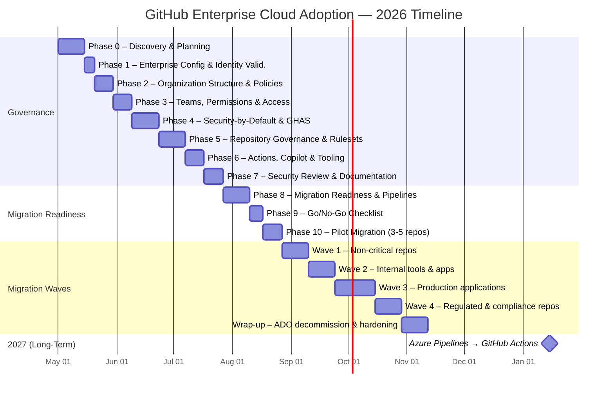

# GitHub Enterprise Cloud Adoption Plan — ADO to GitHub Migration

> **Document Type:** High-Level Phased Adoption Plan  
> **Audience:** Customer leadership, platform team, security team  
> **Context:** Azure DevOps → GitHub Enterprise Cloud migration  
> **Enterprise Type:** Enterprise Managed Users (EMU) — already established  
> **Team:** 1 dedicated member (100%) + 4 supporting members (10-20% each)  
> **Pre-existing:** ADO Advanced Security already in place  
> **Goal:** Phase 1 — Repos migration; Phase 2 — Azure Pipelines → GitHub Actions; Phase 3 — DevSecOps in GitHub  
> **Reference Repo:** [githubabcs/gh-abcs-admin](https://github.com/githubabcs/gh-abcs-admin/tree/main/docs)

---

## Executive Summary

This plan provides a structured, security-first approach to adopting GitHub Enterprise Cloud, migrating from Azure DevOps. It is organized into **11 phases (0–10)**, progressing from foundational governance through pilot migration. The philosophy is **"governance before migration"** — all security, policies, identity, and structure must be validated before any code moves.

### Cost Considerations (High-Level)

| Item | Pricing Model | Notes |
|---|---|---|
| **GitHub Enterprise Cloud** | Per-user/month | All enterprise members |
| **GitHub Secret Protection** | Per active committer/month | Secret scanning + push protection (formerly part of GHAS) |
| **GitHub Code Security** | Per active committer/month | CodeQL + Dependabot + Copilot Autofix (formerly part of GHAS) |
| **GitHub Copilot Business** | Per-seat/month | IDE + Chat + CLI |
| **GitHub Actions** | Per-minute (hosted) or self-hosted | Linux $0.008/min; Windows $0.016/min; estimate from `gh actions-importer forecast` |
| **ADO overlap period** | Double licensing risk | ADO Advanced Security + GHAS run in parallel during transition |

> ⚠️ **GHAS Unbundling:** As of 2024, GitHub Advanced Security was split into **GitHub Secret Protection** and **GitHub Code Security** — two separately-licensed SKUs. Budget and enable each independently. Contact GitHub Sales for current pricing.

> 💡 Work with GitHub Sales to build a detailed cost model in Phase 0 before proceeding.

### 2026 Timeline — Target Completion by Year-End

| Phases | Scope | Duration | Calendar 2026 |
|---|---|---|---|
| 0–1 | Discovery + Enterprise Config & Identity Validation | 3 weeks | **May 1 – May 23** |
| 2–3 | Organization Structure + Teams + Access Model | 2 weeks | **May 26 – Jun 6** |
| 4–5 | Security-by-Default + GHAS + Rulesets + Templates | 4 weeks | **Jun 9 – Jul 4** |
| 6 | Actions + Copilot + Developer Tooling | 2 weeks | **Jul 7 – Jul 18** |
| 7 | Security Review + Documentation + Training | 2 weeks | **Jul 21 – Aug 1** |
| 8–9 | Migration Readiness + Hybrid Pipelines + Go/No-Go | 3 weeks | **Aug 4 – Aug 22** |
| 10 | Pilot Migration (3-5 repos) + Validation | 2 weeks | **Aug 25 – Sep 5** |
| | | | |
| **Governance Complete** | **Phases 0–10 done** | **~18 weeks** | **May → Early Sep** |
| | | | |
| **Wave 1** | Non-critical repos migration | 3 weeks | **Sep 8 – Sep 26** |
| **Wave 2** | Internal tools + lower-criticality apps | 3 weeks | **Sep 29 – Oct 17** |
| **Wave 3** | Production applications | 4 weeks | **Oct 20 – Nov 14** |
| **Wave 4** | Regulated/compliance-critical repos | 3 weeks | **Nov 17 – Dec 5** |
| **Wrap-up** | ADO decommission + post-migration hardening | 3 weeks | **Dec 8 – Dec 24** |
| | | | |
| **Migration Complete** | **All repos on GitHub** | | **🎯 End of 2026** |

> **Phase 2 (2027):** Azure Pipelines → GitHub Actions migration + remaining ADO assets (Boards, Artifacts, Test Plans)



> ⚠️ **Staffing Note:** This compressed timeline requires Security SME and Platform Engineer at **30-40% during their peak phases** (not 10-20%). The Migration Lead backup should be identified by Week 1. Phases 2-3 and 6-7 can partially overlap to stay on track.

### Approach Challenge & Rationale

The original email proposed a linear phase sequence. After deep analysis of GitHub Enterprise documentation, ADO migration guides, and best practices, this plan **restructures and enriches** the phases as follows:

| Original Phase | Revised Phase | Rationale |
|---|---|---|
| Phase 0: Review docs | Phase 0: **Discovery & Planning** | Inventory ADO, plan org structure, align stakeholders (EMU already established) |
| Phase 1: Enterprise Policies | Phase 1: **Enterprise Configuration & Identity Validation** | Validate existing EMU SSO/SCIM, configure policies, audit logging |
| Phase 2: Org Policies | Phase 2: **Organization Structure & Policies** | Combined org creation + policies for efficiency |
| Phase 3: Teams | Phase 3: **Teams, Permissions & Access Model** | Include ADO→GitHub team mapping + CODEOWNERS |
| Phase 4: Repo Settings (pilot) | Phase 4: **Security-by-Default & GHAS** | Security must be configured BEFORE any repos exist |
| Phase 5: Rulesets | Phase 5: **Repository Governance, Rulesets & Templates** | Include templates + custom properties |
| Phase 6: Documentation | Phase 6: **GitHub Actions, Copilot & Developer Tooling** | More actionable — configure Actions/Copilot instead of just docs |
| Phase 7: Security review | Phase 7: **Global Security Review & Documentation** | Formal security signoff + comprehensive documentation |
| Phase 8: Pilot + Pipelines | Phase 8: **Migration Readiness & Azure Pipelines Integration** | Pre-migration assessment + hybrid Pipelines setup |
| Phase 9: Go/No-Go | Phase 9: **Go/No-Go Checklist & Cutover Plan** | Formal gate with rollback strategy |
| Phase 10: Pilot Migration | Phase 10: **Pilot Migration & Validation** | Execute pilot + validate + lessons learned |

---

## Team Allocation Model

| Role | Allocation | Responsibilities |
|---|---|---|
| **Migration Lead** (dedicated) | 100% | Drive all phases, coordinate stakeholders, execute migration tasks |
| **Migration Lead Backup** | 10-15% | Shadow Phases 0–3, able to execute cutover independently if needed |
| **Security/Identity SME** | 10-20% (↑30-40% in Phases 1,4,7) | SSO/SCIM config, GHAS setup, security review, policy validation |
| **Platform/DevOps Engineer** | 10-20% (↑30-40% in Phases 6,8) | Actions config, runners, CI/CD pipeline mapping, Copilot setup |
| **Developer Champion** | 10-20% | Developer onboarding, training, documentation, feedback collection |
| **Project Sponsor/Architect** | 10-20% | Decision-making (EMU, org structure), stakeholder alignment, Go/No-Go |

---

## Phase 0: Discovery & Planning

**Effort:** ~2 weeks | **Who:** Migration Lead (100%) + Project Sponsor (20%)  
**Priority:** 🔴 CRITICAL — Must complete before any technical work  
**Deliverable:** ADO inventory complete, org structure planned, stakeholders aligned

> ✅ **Enterprise type already decided:** This is an **EMU (Enterprise Managed Users)** organization with SSO/SCIM already established. Phase 0 focuses on ADO inventory, org structure planning, and stakeholder alignment.

### 0.1 Review Reference Documentation

| Action | Resource | Status |
|---|---|---|
| Review existing onboarding plan | [13-github-onboarding-implementation-plan.md](https://github.com/githubabcs/gh-abcs-admin/blob/main/docs/13-github-onboarding-implementation-plan.md) | ☐ |
| Review GEI migration guide | [14-github-enterprise-importer-ado-guide.md](https://github.com/githubabcs/gh-abcs-admin/blob/main/docs/14-github-enterprise-importer-ado-guide.md) | ☐ |
| Review Azure Pipelines impact analysis | [15-azure-pipelines-github-repos-integration.md](https://github.com/githubabcs/gh-abcs-admin/blob/main/docs/15-azure-pipelines-github-repos-integration.md) | ☐ |
| Review ADO pain points & solutions | [16-azure-devops-to-github-migration-analysis.md](https://github.com/githubabcs/gh-abcs-admin/blob/main/docs/16-azure-devops-to-github-migration-analysis.md) | ☐ |
| Review GitHub Enterprise administration essentials | [GitHub Resources — Administration & Governance](https://resources.github.com/essentials-of-administration-and-governance-with-github-enterprise-cloud/) | ☐ |
| Review enterprise onboarding docs | [Enterprise Onboarding — GitHub Docs](https://docs.github.com/en/enterprise-cloud@latest/admin/managing-your-enterprise-account/about-enterprise-accounts) | ☐ |
| Review security lockdown discussion | [GitHub Community Discussion #182182](https://github.com/orgs/community/discussions/182182) | ☐ |

### 0.2 EMU Constraints Acknowledgment

Since this is an EMU enterprise, confirm the team is aware of these constraints:

| EMU Constraint | Impact | Mitigation | Acknowledged |
|---|---|---|---|
| No public repositories | Cannot host OSS from EMU accounts | Developers use separate personal accounts for OSS | ☐ |
| No personal repositories | EMU accounts cannot have personal repos | Use Sandbox org for experiments | ☐ |
| Mannequins can ONLY be reclaimed to SCIM-provisioned users | All committers must be provisioned before migration | Complete SCIM provisioning in Phase 0.4 | ☐ |
| GitHub App required for ADO service connections | PAT-based service connections do NOT work with EMU | Enterprise Owner must install GitHub App | ☐ |
| IdP outage blocks all GitHub access | Single IdP dependency | Ensure IdP HA; document setup user recovery | ☐ |
| OIDC supported (Entra ID or Okta only) | SAML also supported; choose one | Confirm current IdP protocol | ☐ |

> **Reference:** [EMU Limitations and Considerations](https://github.com/githubabcs/gh-abcs-admin/blob/main/docs/04-enterprise-managed-users.md)

### 0.3 Organization Structure Decision

**Recommended: Red-Green-Sandbox-Archive Model**

| Organization | Purpose | Base Permission | Visibility Default |
|---|---|---|---|
| **company-green** (~90%) | Standard development, innersource | **None** | Internal/Private |
| **company-red** | Confidential/regulated code | **None** | Private only |
| **company-sandbox** | POCs, experiments, hackathons | **None** | Internal/Private |
| **company-archive** | Retired/historical repos | **None** | Internal/Private |

### 0.4 ADO Inventory & Assessment

| Task | Owner | Status |
|---|---|---|
| Run `gh ado2gh inventory-report` for all ADO organizations | Migration Lead | ☐ |
| Catalog total repos, PR volume, user count, repo sizes | Migration Lead | ☐ |
| **⚠️ Identify TFVC repositories** — GEI only supports Git repos; TFVC requires separate `git-tfs` conversion before migration | Migration Lead | ☐ |
| Identify repos with Git LFS (use `git-sizer`) | Migration Lead | ☐ |
| Map ADO Org → Team Project → Repos to target GitHub structure | Migration Lead | ☐ |
| Classify repos by migration wave (pilot, wave 1-4) | Migration Lead | ☐ |
| Document cross-repo dependencies (pipelines, templates, shared libs) | Migration Lead | ☐ |
| Inventory Azure Pipelines by complexity (simple CI, complex multi-stage, templates) | Platform Engineer | ☐ |
| **Run `gh actions-importer audit azure-devops`** — assessment only, not migration; informs Wave 5 scope + runner budget | Platform Engineer | ☐ |
| **Run `gh actions-importer forecast`** — estimate Actions minutes/cost for budget planning | Platform Engineer | ☐ |
| **Inventory ADO Service Hooks** on repos in scope — identify GitHub equivalents (webhooks, Apps, Actions) | Platform Engineer | ☐ |
| **Inventory ADO Artifact feeds** (NuGet, npm, Maven — feed names, package counts, consumers) | Platform Engineer | ☐ |
| **Export ADO Advanced Security alert baseline** — open/dismissed/fixed alerts with rationale as CSV/JSON for GHAS reconciliation | Security SME | ☐ |
| **Map all ADO pipeline template repos** — identify all `extends`/`template` references and cross-repo resource dependencies | Platform Engineer | ☐ |
| **Inventory ADO secrets/service connections** — catalog all variable groups, service connections, deploy keys, PATs, webhooks | Platform Engineer | ☐ |

### 0.5 Identity Provider Validation

| Task | Owner | Status |
|---|---|---|
| Confirm current IdP and protocol (OIDC or SAML) — Entra ID or Okta | Security SME | ☐ |
| Verify existing IdP groups are mapped to planned GitHub teams | Security SME | ☐ |
| Verify SCIM provisioning is operational (users + groups) | Security SME | ☐ |
| Document username normalization format (`{idp_username}_{shortcode}`) | Security SME | ☐ |
| Verify setup user (`{shortcode}_admin`) credentials are securely stored and tested | Security SME | ☐ |

### 0.6 Stakeholder Alignment

| Task | Owner | Status |
|---|---|---|
| Identify 3-5 Enterprise Owners (require hardware security keys) | Sponsor | ☐ |
| Identify Billing Managers | Sponsor | ☐ |
| Identify Security Managers for GHAS | Sponsor | ☐ |
| Define RACI matrix for GitHub administration | Migration Lead | ☐ |
| Align on budget (GHAS licenses, Copilot seats, Actions minutes) | Sponsor | ☐ |
| **Confirm data residency requirements** — if EU-only data residency required, contact GitHub Sales before provisioning | Sponsor | ☐ |
| **Build cost projection** — GHAS (Secret Protection + Code Security) per active committer, Copilot per seat, Actions minutes estimate, ADO overlap licensing | Migration Lead | ☐ |
| **Define migration scope contract** — document what migrates, what stays in ADO, what is deferred, get stakeholder sign-off | Migration Lead | ☐ |

---

## Phase 1: Enterprise Configuration & Identity Validation

**Effort:** ~1 week | **Who:** Migration Lead (100%) + Security SME (30%)  
**Priority:** 🔴 CRITICAL  
**Prerequisites:** Phase 0 planning completed  
**Deliverable:** Enterprise policies configured, SSO/SCIM validated for migration readiness, audit logging operational

> ✅ **Enterprise account and SSO/SCIM already exist.** This phase focuses on validating the existing setup, configuring migration-specific policies, and ensuring audit logging is active.

### 1.1 Enterprise Account Validation

| Task | Owner | Status |
|---|---|---|
| Verify enterprise account is operational (EMU) | Enterprise Admin | ☐ |
| Confirm enterprise shortcode and username format (`user_shortcode`) | Enterprise Admin | ☐ |
| Verify setup user credentials (`{shortcode}_admin`) are accessible and tested | Security SME | ☐ |
| Verify 3-5 Enterprise Owners are assigned with **hardware security keys** (U2F/WebAuthn) | Enterprise Admin | ☐ |
| Verify Billing Managers are assigned | Enterprise Admin | ☐ |
| Review and adjust spending limits (Actions, Packages) for migration workloads | Billing Manager | ☐ |

### 1.2 SSO/SCIM Validation for Migration

| Task | Owner | Status |
|---|---|---|
| Verify OIDC or SAML is configured and enforced at enterprise level | Security SME | ☐ |
| Test SSO authentication flow is working | Security SME | ☐ |
| Verify SSO auto-redirect is enabled | Security SME | ☐ |
| **Test break-glass procedure** — verify setup user can access enterprise if IdP is down | Security SME | ☐ |
| Verify Conditional Access Policies are appropriate (if Entra ID) | Security SME | ☐ |

### 1.3 SCIM Provisioning Validation

| Task | Owner | Status |
|---|---|---|
| Verify SCIM provisioning is active and syncing users | Security SME | ☐ |
| Verify IdP group sync is provisioning teams correctly | Security SME | ☐ |
| **Verify all ADO committers are SCIM-provisioned** — critical for mannequin reclamation | Security SME | ☐ |
| **Test user deprovisioning** — verify instant access revocation | Security SME | ☐ |
| Test user reactivation flow | Security SME | ☐ |

> ⚠️ **Critical for migration:** Any ADO committer NOT provisioned via SCIM will appear as an unrecoverable mannequin in GitHub. Verify provisioning coverage before Phase 8.

### 1.4 Network Security

| Task | Owner | Status |
|---|---|---|
| Document corporate VPN/office/cloud IP ranges | Network/Security | ☐ |
| Configure enterprise IP allow list | Enterprise Admin | ☐ |
| Add GitHub-hosted runner IPs (or plan self-hosted runners) | Platform Engineer | ☐ |
| Test access from allowed and non-allowed IPs | Security SME | ☐ |

### 1.5 Audit Logging

| Task | Owner | Status |
|---|---|---|
| Enable audit log streaming to SIEM (Splunk, Azure Sentinel, Datadog) | Security SME | ☐ |
| Enable source IP display in audit logs | Security SME | ☐ |
| Configure log retention strategy (GitHub retains audit events ~180 days, Git events only ~7 days; stream for longer retention and SIEM) | Security SME | ☐ |
| Create alerting rules for privilege changes, policy changes, suspicious activity | Security SME | ☐ |

> 🔑 **Key:** Stream audit logs from day 1. GitHub does not retain indefinitely.

---

## Phase 2: Organization Structure & Policies

**Effort:** ~1-2 weeks | **Who:** Migration Lead (100%) + Sponsor (10%)  
**Priority:** 🔴 HIGH  
**Prerequisites:** Phase 1 complete  
**Deliverable:** Organizations created with security policies enforced

### 2.1 Create Organizations

| Organization | Purpose | Status |
|---|---|---|
| `company-green` | Main development (innersource) | ☐ |
| `company-red` | Confidential/regulated repos | ☐ |
| `company-sandbox` | Experiments, POCs, trial migrations | ☐ |
| `company-archive` | Historical/retired repos | ☐ |

### 2.2 Enterprise-Level Policies (Enforced Across All Orgs)

| Policy | Setting | Status |
|---|---|---|
| Base repository permissions | **Enforce: No permission** | ☐ |
| Repository creation | **Enforce: Organization Owners only** | ☐ |
| Public repository creation | **Disable** | ☐ |
| Repository visibility change | **Restrict to Org Owners** | ☐ |
| Repository deletion/transfer | **Restrict to Org Owners** | ☐ |
| Repository forking | **Restrict within same org** | ☐ |
| Default branch name | **Enforce: `main`** | ☐ |
| Outside collaborators | **Restrict to Org Owners** | ☐ |
| Block user namespace repos (EMU) | **Enable** (mandatory for EMU — prevents personal repos) | ☐ |
| Deploy keys | **Restrict** (prefer GitHub Apps) | ☐ |
| Issue deletion | **Restrict to Org Owners** | ☐ |

### 2.3 Organization-Level Settings (Per Org)

| Setting | Green Org | Red Org | Sandbox | Archive |
|---|---|---|---|---|
| Base permission | None | None | None | None |
| Default repo visibility | Internal | Private | Internal | Internal |
| Team creation | Org Admins only | Org Admins only | Org Admins only | Org Admins only |
| Outside collaborators | Org Owners only | Org Owners only | Org Owners only | Disabled |
| OAuth app restrictions | **Enable** | **Enable** | **Enable** | **Enable** |

### 2.4 PAT Policies

| Policy | Setting | Status |
|---|---|---|
| Fine-grained PAT access | **Allow with approval** | ☐ |
| Classic PAT access | **Restrict or Block** | ☐ |
| PAT maximum lifetime | **90-365 days** | ☐ |
| Fine-grained PAT approval | **Require approval** | ☐ |

---

## Phase 3: Teams, Permissions & Access Model

**Effort:** ~1-2 weeks | **Who:** Migration Lead (100%) + Security SME (10%)  
**Priority:** 🟡 HIGH  
**Prerequisites:** Phase 2 complete  
**Deliverable:** Team hierarchy created, IdP sync operational, CODEOWNERS model defined

### 3.1 Design Team Hierarchy

**ADO → GitHub Mapping:**

| ADO Concept | GitHub Equivalent |
|---|---|
| ADO Organization | GitHub Organization |
| ADO Team Project | **Teams** (NOT separate orgs) |
| ADO Security Groups | GitHub Teams |
| ADO Area Paths | Parent Teams |
| ADO Feature Squads | Child Teams |

**Recommended Hierarchy (max 3-4 levels):**

```
Enterprise
└── Organization (company-green)
    ├── eng-platform (Parent Team)
    │   ├── platform-infra (Child)
    │   ├── platform-devops (Child)
    │   └── platform-sre (Child)
    ├── eng-product (Parent Team)
    │   ├── product-mobile (Child)
    │   └── product-web (Child)
    └── security-appsec (Team)
```

### 3.2 Create & Configure Teams

| Task | Owner | Status |
|---|---|---|
| Design team hierarchy aligned with IdP groups | Migration Lead | ☐ |
| Enable team sync from IdP groups | Security SME | ☐ |
| Create core teams (Platform, Security, DevOps, Architecture) | Migration Lead | ☐ |
| Assign 3+ team maintainers per team (business continuity) | Migration Lead | ☐ |
| Configure team visibility (Visible vs Secret for security teams) | Migration Lead | ☐ |

### 3.3 CODEOWNERS Model

| Task | Owner | Status |
|---|---|---|
| Define CODEOWNERS strategy (component-level teams) | Migration Lead | ☐ |
| Create CODEOWNERS template for repo templates | Migration Lead | ☐ |
| Use child teams for precise ownership scopes | Migration Lead | ☐ |
| Document CODEOWNERS + required review workflow | Migration Lead | ☐ |

### 3.4 Custom Repository Roles (If Needed)

| Role | Permissions | Use Case |
|---|---|---|
| Team Lead | Manage team membership + create repos | Delegated team management |
| Release Engineer | Push to release branches + manage tags | Release workflow |
| Security Reviewer | View security alerts + manage GHAS | Security triage |

---

## Phase 4: Security-by-Default & GitHub Advanced Security

**Effort:** ~2-3 weeks | **Who:** Migration Lead (100%) + Security SME (20→40%)  
**Priority:** 🔴 CRITICAL  
**Prerequisites:** Phase 3 complete  
**Deliverable:** GHAS fully configured, secret scanning + push protection active, security configurations applied

> ⚠️ **GHAS is now two SKUs:** **GitHub Secret Protection** (secret scanning + push protection) and **GitHub Code Security** (CodeQL + Dependabot + Copilot Autofix). Budget and enable each independently.

### 4.1 GHAS Enterprise Policies (Secret Protection + Code Security)

| Policy | Setting | Status |
|---|---|---|
| GHAS availability | **Enable for all organizations** | ☐ |
| Dependabot alerts | **Allow** | ☐ |
| Secret scanning | **Enable** | ☐ |
| Code scanning (CodeQL) | **Enable** | ☐ |
| Push protection | **Enable** | ☐ |
| Copilot Autofix for security | **Enable** | ☐ |
| AI detection for secret scanning | **Enable** | ☐ |
| Dependency insights visibility | **Enable** | ☐ |

### 4.2 Organization Security Configurations

| Task | Owner | Status |
|---|---|---|
| Create default security configuration (dependency graph, Dependabot, secret scanning, push protection, CodeQL default setup) | Security SME | ☐ |
| Apply security configuration to all repos org-wide | Migration Lead | ☐ |
| Define custom secret patterns (internal tokens, API keys) | Security SME | ☐ |
| Enable non-provider pattern detection (SSH keys, PGP keys, connection strings) | Security SME | ☐ |
| Configure push protection bypass permissions (Security team only, with approval workflow) | Security SME | ☐ |

### 4.3 ADO Advanced Security → GHAS Migration

Since ADO Advanced Security is already in place:

> ⚠️ **Critical: ADO Advanced Security alert history does NOT migrate to GHAS.** When GHAS runs its first scan on migrated repos, it generates a fresh alert set. Existing ADO alert state (open/dismissed/fixed + rationale) must be exported beforehand and reconciled manually.

| ADO Feature | GHAS Equivalent | Migration Action |
|---|---|---|
| ADO Code Analysis | CodeQL + SARIF | Map rules, start with default setup, expand to advanced; run shadow comparison on 2-3 pilot repos for 2 weeks |
| ADO Secret Detection | Secret scanning + push protection | Enable org-wide, add custom patterns; ⚠️ expect **historical scan alert flood** on first enable |
| ADO Dependency Alerts | Dependabot + dependency review | Enable org-wide, configure `.github/dependabot.yml` |

**Alert Baseline Reconciliation:**

| Task | Owner | Status |
|---|---|---|
| Export ADO AdvSec alert inventory (open/dismissed/fixed with rationale) as CSV — completed in Phase 0.4 | Security SME | ☐ |
| After GHAS first scan on pilot repos, reconcile GHAS findings against ADO export | Security SME | ☐ |
| Carry forward known-false-positive dismissals to GHAS | Security SME | ☐ |
| Document detection-parity gaps (rules in ADO not covered by CodeQL) | Security SME | ☐ |
| Plan for SARIF import of historical scan results using `upload-sarif` action if audit trail needed | Security SME | ☐ |
| Estimate and plan for **alert triage workload** — secret scanning historical backfill can generate hundreds of alerts | Security SME | ☐ |
| Configure alert notification routing to dedicated triage channel (not individual email) | Security SME | ☐ |
| Document licensing overlap plan (ADO AdvSec + GHAS running in parallel during transition) | Migration Lead | ☐ |

**Rollout Strategy:**
1. Enable dependency graph + Dependabot alerts (low risk, high value)
2. Turn on secret scanning + push protection (⚠️ run trial on 2-3 sandbox repos first to estimate alert volume)
3. Enable CodeQL default setup on pilot repos — shadow-run alongside ADO for 2 weeks to validate coverage parity
4. Expand to all repos with advanced setup for complex builds
5. Add rulesets requiring security checks before merge
6. Retire ADO Advanced Security after parity sign-off per repo/wave

### 4.4 SSH Certificate Authority (Optional but Recommended)

| Task | Owner | Status |
|---|---|---|
| Generate enterprise SSH CA key pair | Security SME | ☐ |
| Upload SSH CA public key to enterprise | Enterprise Admin | ☐ |
| Configure certificate expiration | Enterprise Admin | ☐ |
| Document SSH certificate issuance procedure | Security SME | ☐ |

---

## Phase 5: Repository Governance, Rulesets & Templates

**Effort:** ~2 weeks | **Who:** Migration Lead (100%) + Platform Engineer (15%)  
**Priority:** 🟡 HIGH  
**Prerequisites:** Phase 4 complete  
**Deliverable:** Org-level rulesets active, repo templates ready, custom properties defined

### 5.1 Organization-Level Rulesets

#### Default Branch Protection Ruleset (`default-branch-protection`)

| Rule | Setting | Status |
|---|---|---|
| Enforcement | **Active** | ☐ |
| Target | Default branch (`main`), all repositories | ☐ |
| Require pull request | **Enable** | ☐ |
| Required approvals | **≥1** (2+ for production repos) | ☐ |
| Dismiss stale reviews | **Enable** | ☐ |
| Require CODEOWNERS review | **Enable** | ☐ |
| Require conversation resolution | **Enable** | ☐ |
| Block force pushes | **Enable** | ☐ |
| Block branch deletion | **Enable** | ☐ |
| Require up-to-date branches | **Enable** | ☐ |
| Bypass actors | Minimal — release automation + break-glass admins only | ☐ |

> 💡 **ADO Branch Policy Mapping:**
> - ADO minimum reviewers → Required PR reviews  
> - ADO build validation → Required status checks  
> - ADO comment resolution → Require conversation resolution  
> - ADO block direct push → Restrict pushes to protected branches  
> - ADO code owners → CODEOWNERS + required review  

#### Push Rulesets (Recommended)

| Rule | Setting | Status |
|---|---|---|
| Restrict file paths | Protect `.github/`, `CODEOWNERS`, security configs | ☐ |
| Restrict file extensions | Block `.exe`, `.dll`, binaries | ☐ |
| Restrict file size | 50MB limit | ☐ |
| Protect release tags | `v*`, `release-*` — restrict creation to release group | ☐ |

#### Code Scanning Results Ruleset

| Rule | Setting | Status |
|---|---|---|
| Require code scanning results | Block merges if not run | ☐ |
| Severity threshold | Block on Critical/High | ☐ |

### 5.2 Repository Templates

| Template | Use Case | Status |
|---|---|---|
| `repo-template-base` | General purpose (README, .gitignore, LICENSE, CODEOWNERS, SECURITY.md, CONTRIBUTING.md, PR template, issue templates, Dependabot config, CI starter workflows) | ☐ |
| `repo-template-python` | Python apps/services | ☐ |
| `repo-template-javascript` | JS/TS applications | ☐ |
| `repo-template-dotnet` | .NET applications | ☐ |
| `repo-template-terraform` | Infrastructure as Code | ☐ |

### 5.3 Custom Repository Properties

| Property | Values | Purpose | Status |
|---|---|---|---|
| Security tier | `tier-1-critical`, `tier-2-important`, `tier-3-standard` | Risk-based ruleset targeting | ☐ |
| Compliance | `pci`, `hipaa`, `sox`, `gdpr`, `none` | Compliance reporting | ☐ |
| Production status | `production`, `staging`, `development`, `archive` | Lifecycle tracking | ☐ |

---

## Phase 6: GitHub Actions, Copilot & Developer Tooling

**Effort:** ~2 weeks | **Who:** Migration Lead (100%) + Platform Engineer (20%)  
**Priority:** 🟡 HIGH  
**Prerequisites:** Phase 5 complete  
**Deliverable:** Actions policies set, Copilot configured, reusable workflows ready

### 6.1 GitHub Actions Policies

| Policy | Setting | Status |
|---|---|---|
| Actions availability | **Enable for all organizations** | ☐ |
| Allowed actions | **Restrict**: Enterprise + GitHub + verified creators | ☐ |
| Require SHA pinning | **Enforce via ruleset on workflow files + CI lint** (use `zizmor` or StepSecurity Harden-Runner — no native toggle exists) | ☐ |
| Default workflow permissions | **Read-only** | ☐ |
| Allow Actions to create PRs | **Disable** | ☐ |
| Fork PR workflows | **Require approval for all outside collaborators** | ☐ |
| Repository-level runners | **Disable** (use org/enterprise runners) | ☐ |

### 6.2 Runner Strategy

| Option | When to Use | Status |
|---|---|---|
| GitHub-hosted runners | Standard CI workloads | ☐ Evaluate |
| Self-hosted runners (ephemeral) | Network access, legacy tools, compliance | ☐ Evaluate |
| Larger runners | CPU/RAM-heavy builds | ☐ Evaluate |

### 6.3 Reusable Workflows & Environments

| Task | Owner | Status |
|---|---|---|
| Create reusable CI workflow (build + test) | Platform Engineer | ☐ |
| Create reusable security scanning workflow (CodeQL + dependency review) | Security SME | ☐ |
| Create reusable deployment workflow with approvals | Platform Engineer | ☐ |
| Create environments: `development`, `staging`, `production` | Platform Engineer | ☐ |
| Configure production environment reviewers | Platform Engineer | ☐ |
| Configure deployment branch policies | Platform Engineer | ☐ |

### 6.4 Copilot Governance

#### Enterprise Copilot Policies

| Policy | Setting | Status |
|---|---|---|
| Copilot in IDE | **Enabled** | ☐ |
| Copilot Chat (IDE + GitHub.com) | **Enabled** | ☐ |
| Copilot CLI | **Enabled** | ☐ |
| Copilot Code Review | **Enabled** | ☐ |
| Suggestions matching public code | **Blocked** (reduces IP/licensing risk) | ☐ |
| Prompt and suggestion collection | **Blocked** (data privacy) | ☐ |
| Preview features | **Disabled** (avoid in production) | ☐ |

#### Content Exclusions

| Task | Owner | Status |
|---|---|---|
| Configure org exclusions: `**/secrets/**`, `**/.env*`, `**/credentials/**` | Migration Lead | ☐ |
| Add repo-specific exclusions for sensitive code | Repo Admins | ☐ |
| Assign Copilot seats to pilot users/teams | Migration Lead | ☐ |
| Configure firewall allowlist for Copilot endpoints | Network/Security | ☐ |

---

## Phase 7: Global Security Review & Documentation

**Effort:** ~1-2 weeks | **Who:** Migration Lead (100%) + Security SME (20%) + Sponsor (10%)  
**Priority:** 🔴 CRITICAL — Gate before migration  
**Prerequisites:** Phases 1-6 complete  
**Deliverable:** Signed-off security review, comprehensive governance documentation

### 7.1 Security Review Checklist

| Area | Review Question | Verified |
|---|---|---|
| **Identity** | SSO enforced? SCIM operational? Break-glass tested? | ☐ |
| **Network** | IP allow list enabled? Access paths documented? | ☐ |
| **Enterprise Policies** | All policies from Phase 2 enforced? No overrides? | ☐ |
| **GHAS** | Secret scanning + push protection on all repos? CodeQL active? | ☐ |
| **Rulesets** | Org-level rulesets active? Bypass actors minimal? | ☐ |
| **Actions** | Read-only GITHUB_TOKEN? Allowed actions restricted? SHA pinning? | ☐ |
| **Copilot** | Public code matching blocked? Content exclusions set? | ☐ |
| **PATs** | Classic PATs restricted? Fine-grained PATs require approval? | ☐ |
| **Apps** | OAuth restrictions enabled? GitHub App approval required? | ☐ |
| **Audit** | Logs streaming to SIEM? Alerting rules in place? | ☐ |
| **Teams** | Least privilege? No orphan access? Team sync working? | ☐ |

### 7.2 Documentation Deliverables

| Document | Owner | Status |
|---|---|---|
| Enterprise architecture & org structure decision record | Migration Lead | ☐ |
| Security policies & settings inventory (the "what & why") | Security SME | ☐ |
| Team structure & access model documentation | Migration Lead | ☐ |
| Developer quick-start guide (login, clone, PR workflow) | Developer Champion | ☐ |
| Branch strategy & conventions guide | Developer Champion | ☐ |
| PR best practices guide | Developer Champion | ☐ |
| Security practices guide (secret handling, scanning remediation) | Security SME | ☐ |
| Copilot usage guide | Developer Champion | ☐ |
| IDE setup guide (VS Code, JetBrains + extensions) | Developer Champion | ☐ |
| SSH/GPG key configuration guide | Security SME | ☐ |
| Escalation path & support channel documentation | Migration Lead | ☐ |

### 7.3 Training Sessions

| Session | Audience | Status |
|---|---|---|
| GitHub Fundamentals (Git, PR workflow, code review) | All developers | ☐ |
| GitHub Advanced (rebase, conflict resolution, Actions) | Senior developers | ☐ |
| Security Practices (scanning, secret handling, GHAS) | All developers | ☐ |
| GitHub Copilot (features, best practices, limitations) | All developers | ☐ |
| Admin Training (repo settings, team management, rulesets) | Repository admins | ☐ |

---

## Phase 8: Migration Readiness & Azure Pipelines Integration

**Effort:** ~2-3 weeks | **Who:** Migration Lead (100%) + Platform Engineer (20%)  
**Priority:** 🟡 HIGH  
**Prerequisites:** Phase 7 security review signed off  
**Deliverable:** Migration tooling ready, hybrid Pipelines model validated, migration script generated

### 8.1 Migration Tool Setup

| Task | Owner | Status |
|---|---|---|
| Install GEI CLI: `gh extension install github/gh-ado2gh` | Migration Lead | ☐ |
| Install `git-sizer` for large repo assessment | Migration Lead | ☐ |
| Create GitHub classic PAT (`repo`, `admin:org`, `workflow`) | Migration Lead | ☐ |
| Create ADO PAT (Work Item Read, Code Read, Identity Read, **Pull Request Threads Read**) | Migration Lead | ☐ |
| Run inventory report: `gh ado2gh inventory-report --ado-org ORG` | Migration Lead | ☐ |

### 8.2 Migration Planning

| Task | Owner | Status |
|---|---|---|
| Generate migration script: `gh ado2gh generate-script` | Migration Lead | ☐ |
| Review and customize repo name mappings | Migration Lead | ☐ |
| Plan migration waves by team/dependency | Migration Lead | ☐ |
| Identify repos requiring LFS post-migration | Migration Lead | ☐ |
| Temporarily bypass org rulesets that could block import (add "Repository migrations" bypass) | Migration Lead | ☐ |

#### 8.2.1 Mannequin Reclamation Strategy

> ⚠️ **EMU Critical:** Mannequins can ONLY be reclaimed to users already provisioned via SCIM. Complete SCIM provisioning for all committers of pilot repos BEFORE migration. Unprovisioned committers become **permanently unrecoverable** mannequins.

| Task | Owner | Status |
|---|---|---|
| Create ADO user → GitHub EMU user mapping file before migration | Migration Lead | ☐ |
| Verify all pilot repo committers are SCIM-provisioned in EMU | Migration Lead | ☐ |
| Document criteria for unmapped users (reclaim as specific identity or accept mannequin) | Migration Lead | ☐ |
| Plan mannequin reclamation effort (manual CSV workflow — slow at scale) | Migration Lead | ☐ |

#### 8.2.2 Git LFS Migration Procedure

GEI does NOT migrate LFS objects. For repos identified with LFS in Phase 0.4:

```bash
# 1. Clone the repo with full LFS content from ADO
git clone --mirror https://dev.azure.com/ORG/PROJECT/_git/REPO
cd REPO.git
git lfs fetch --all

# 2. Push everything including LFS objects to GitHub
git remote set-url origin https://github.com/ORG/REPO.git
git push --mirror
git lfs push --all origin
```

| Task | Owner | Status |
|---|---|---|
| For each LFS repo: clone with `--mirror`, fetch all LFS, push to GitHub | Migration Lead | ☐ |
| Verify LFS objects are accessible after push (clone from GitHub, `git lfs pull`) | Migration Lead | ☐ |

> ⚠️ **Execute LFS migration immediately after GEI migration, BEFORE developer unfreeze and CI validation.** Broken LFS = broken builds.

### 8.3 Azure Pipelines Hybrid Integration (CRUCIAL)

During migration, repos move to GitHub while Azure Pipelines remains. This requires rewiring:

| Impact Area | Action Required | Priority |
|---|---|---|
| **Pipeline templates** | Update `type: git` → `type: github`, add `endpoint` | 🔴 High |
| **Repository resources** | Update `name` format from `Project/Repo` to `Org/Repo` | 🔴 High |
| **Service connections** | Create GitHub App service connection in Azure DevOps | 🔴 High |
| **Resource triggers** | ⚠️ `resources.repositories` triggers are **limited for GitHub repos** — implement webhooks or GitHub Actions triggers. `resources.pipelines` triggers are unaffected. | 🔴 High |
| **CI/PR triggers** | Generally continue working, but **require repo-by-repo validation** (check names, branch filters, path filters) | 🟡 Medium |
| **Status checks/PR gates** | Verify check names match — ADO check names may differ when repo source changes | 🟡 Medium |

**Hybrid Model Setup:**

| Task | Owner | Status |
|---|---|---|
| Create GitHub App service connection in ADO project settings | Platform Engineer | ☐ |

> ⚠️ **EMU Requirement:** The GitHub App must be installed by an Enterprise Owner. PAT-based service connections do NOT work with EMU. For multiple ADO organizations, create a separate service connection per ADO org.
| Test service connection with a sample pipeline | Platform Engineer | ☐ |
| Inventory all pipelines referencing repos being migrated | Platform Engineer | ☐ |
| Identify all template dependencies (`extends`, `template`) | Platform Engineer | ☐ |
| Document all resource triggers (will stop working) | Platform Engineer | ☐ |
| Prepare pipeline YAML updates in branches (ready to deploy on cutover) | Platform Engineer | ☐ |
| Plan alternative for resource triggers (webhooks / GitHub Actions → Azure Pipeline) | Platform Engineer | ☐ |

> ⚠️ **Critical:** If you use a central template repository, ALL pipelines referencing it must be updated atomically when that repo moves to GitHub. This cannot be done incrementally.

### 8.4 Azure Pipelines → GitHub Actions (Long-Term Strategy)

This is the **long-term** Phase 2 goal, not required for pilot migration:

| Task | Owner | Status |
|---|---|---|
| Run `gh actions-importer audit azure-devops` to inventory pipelines | Platform Engineer | ☐ |
| Run `gh actions-importer forecast` for runner/cost sizing | Platform Engineer | ☐ |
| Identify 3-5 simple CI pipelines for Actions pilot | Platform Engineer | ☐ |
| Run `gh actions-importer dry-run` on pilot pipelines | Platform Engineer | ☐ |
| Map ADO secrets/variable groups → GitHub secrets/environments | Platform Engineer | ☐ |
| Map ADO service connections → OIDC workload identity federation | Platform Engineer | ☐ |
| Map ADO environments/approvals → GitHub environments/protection rules | Platform Engineer | ☐ |

**Syntax Quick Reference:**

| Azure Pipelines | GitHub Actions |
|---|---|
| `trigger:` | `on:` |
| `pool.vmImage` | `runs-on` |
| `- script:` | `- run:` |
| `task:` | `uses:` |
| `condition:` | `if:` |
| `dependsOn:` | `needs:` |
| `variables:` | `env:` / secrets / vars |
| `stages:` | separate workflows / reusable workflows |
| service connections | OIDC + environment secrets |

---

## Phase 9: Go/No-Go Checklist & Cutover Plan

**Effort:** ~1 week | **Who:** Migration Lead (100%) + All team members (10%)  
**Priority:** 🔴 CRITICAL — Formal gate  
**Prerequisites:** Phase 8 complete, pilot repos selected  
**Deliverable:** Signed Go/No-Go decision, cutover runbook

### 9.1 Go/No-Go Checklist

| # | Criteria | Verified |
|---|---|---|
| 1 | Enterprise account provisioned and configured | ☐ |
| 2 | SSO/SCIM integration tested and operational | ☐ |
| 3 | At least 3 Enterprise Owners with hardware security keys (tested login) | ☐ |
| 4 | Break-glass / setup user access tested | ☐ |
| 5 | IP allow list configured and tested | ☐ |
| 6 | All enterprise security policies enforced | ☐ |
| 7 | Organization rulesets active with required reviews | ☐ |
| 8 | GHAS enabled: secret scanning, code scanning, push protection | ☐ |
| 9 | GitHub Actions policies configured (read-only token, restricted actions) | ☐ |
| 10 | Copilot policies configured (public code blocked, exclusions set) | ☐ |
| 11 | Repository templates created and tested | ☐ |
| 12 | Audit log streaming operational to SIEM | ☐ |
| 13 | Developer documentation ready and published | ☐ |
| 14 | Support channels established (Teams/Slack, escalation path) | ☐ |
| 15 | Azure Pipelines service connection tested | ☐ |
| 16 | Pipeline YAML updates prepared for migrated repos | ☐ |
| 17 | Pilot repos selected (3-5 low-risk, representative repos) | ☐ |
| 18 | TFVC repos (if any) converted to Git before migration | ☐ |
| 19 | ADO AdvSec alert baseline exported for reconciliation | ☐ |
| 20 | All resource trigger alternatives validated in dry-run | ☐ |
| 21 | Mannequin user mapping prepared (all pilot committers provisioned) | ☐ |
| 22 | Stakeholders notified of pilot timeline | ☐ |
| 23 | Rollback plan documented | ☐ |
| 24 | Compliance/security team sign-off obtained | ☐ |

### 9.2 Cutover Runbook (Per Migration Batch)

| Step | Action | Owner |
|---|---|---|
| 1 | Freeze source repos in ADO (set to read-only or communicate freeze) | Migration Lead |
| 2 | Temporarily add GEI IP ranges to allow list (if applicable) | Migration Lead |
| 3 | Temporarily bypass org rulesets for migration | Migration Lead |
| 4 | Run migration: `gh ado2gh migrate-repo` | Migration Lead |
| 5 | Verify migration status: `gh ado2gh wait-for-migration` | Migration Lead |
| 6 | Review migration log (auto-created as Issue in target repo) | Migration Lead |
| 7 | Set repository visibility (private → internal if needed) | Migration Lead |
| 8 | **Migrate Git LFS objects** (if applicable — do this BEFORE developer unfreeze) | Migration Lead |
| 9 | Reclaim mannequins (reattribute history to GitHub users) | Enterprise Admin |
| 9 | Add team access permissions | Migration Lead |
| 10 | Apply repository template settings (CODEOWNERS, Dependabot, workflows) | Migration Lead |
| 11 | Verify GHAS features activate on migrated repos | Security SME |
| 12 | Deploy Azure Pipeline YAML updates (template/resource type changes) | Platform Engineer |
| 13 | Verify CI/CD pipelines execute successfully | Platform Engineer |
| 14 | Remove temporary allow list entries and ruleset bypasses | Migration Lead |
| 16 | Migrate Git LFS objects (if applicable) | Migration Lead |
| 17 | **Rotate all credentials** — new secrets in GitHub, revoke ADO migration PATs | Security SME |
| 18 | Notify developers with new repo URLs and access info | Developer Champion |
| 19 | Revoke ADO write access for migrated repos | Migration Lead |

> ⚠️ **Post-cutover grace period:** Maintain a 24-48h commit freeze on GitHub after migration before declaring success. If critical issues arise, reverse-sync to ADO with `git remote push` during this window.

### 9.3 Rollback Strategy

GEI has no built-in rollback. Mitigate with:

| Strategy | Detail |
|---|---|
| **Trial first** | Always run trial migration in sandbox org |
| **Freeze source** | No changes during cutover window |
| **Keep ADO accessible** | Don't delete ADO repos until validation complete — keep read-only for minimum 2 weeks per wave |
| **Grace period** | 24-48h commit freeze on GitHub post-migration before declaring success |
| **Reverse-sync** | During grace window: `git remote push` from GitHub back to ADO if abort needed |
| **If migration fails** | Keep ADO as source of truth, fix issues, re-run |
| **ADO retention policy** | Define formal sign-off gate before deleting any ADO repos (recommend: 30 days after validation) |
| **Incident checklist** | Day-of-cutover: if pipeline breaks → check GitHub status → check ADO service connection → revert YAML if needed |
| **Communication** | Pre-communicate rollback criteria to stakeholders |

### 9.4 Exception & Bypass Request Process

| Task | Owner | Status |
|---|---|---|
| Define RACI for ruleset/policy exceptions | Security SME | ☐ |
| Create exception request template (GitHub Issue or internal ticket) | Migration Lead | ☐ |
| Define approval criteria (time-bound, documented reason, audit trail) | Security SME | ☐ |
| Define auto-rollback mechanism for temporary bypasses | Migration Lead | ☐ |
| Document escape hatch: Org Owners + Security SME approval + recorded reason | Security SME | ☐ |

---

## Phase 10: Pilot Migration & Validation

**Effort:** ~2-3 weeks | **Who:** Migration Lead (100%) + Platform Engineer (15%) + Developer Champion (15%)  
**Priority:** 🟡 HIGH  
**Prerequisites:** Phase 9 Go decision  
**Deliverable:** Successful pilot migration, validated repos, lessons learned document

### 10.1 Pilot Repo Selection

Select 3-5 repos with these characteristics:

| Criteria | Why |
|---|---|
| Low production risk | Minimize impact if issues arise |
| Medium size with PR history | Test GEI migration fidelity |
| At least 1 repo with branch policies | Test ruleset mapping |
| At least 1 repo with Azure Pipeline | Test hybrid model |
| Active development team willing to provide feedback | Validate developer experience |

### 10.2 Execute Pilot Migration

Follow the **Cutover Runbook** from Phase 9.2 for each pilot repo.

### 10.3 Validation Checklist (Per Repo)

**Pilot Success Criteria:** ALL validation items must pass. Any failure = "critical" blocker for Wave 1.  
**Approval Authority:** Sponsor + Security SME sign-off on lessons learned before Wave 1 planning.

| Validation | Status |
|---|---|
| Git history complete (all commits, branches, tags) | ☐ |
| Pull requests migrated with history | ☐ |
| Repository visibility correct | ☐ |
| Team access permissions working | ☐ |
| CODEOWNERS file present and working | ☐ |
| Branch protection ruleset applied | ☐ |
| GHAS features active (secret scanning, CodeQL) | ☐ |
| Dependabot configured and scanning | ☐ |
| CI/CD pipeline executes (Azure Pipelines from GitHub) | ☐ |
| PR workflow works (create PR → review → CI passes → merge) | ☐ |
| Copilot accessible to pilot developers | ☐ |
| Developer can clone, push (to feature branch), and create PR | ☐ |
| Audit logs capture activity | ☐ |
| Documentation URLs updated | ☐ |
| Mannequins reclaimed | ☐ |

### 10.4 Post-Pilot Actions

| Task | Owner | Status |
|---|---|---|
| Collect developer feedback (survey + office hours) | Developer Champion | ☐ |
| Document lessons learned | Migration Lead | ☐ |
| Identify issues for full migration planning | Migration Lead | ☐ |
| Update cutover runbook based on lessons learned | Migration Lead | ☐ |
| Plan Wave 1 migration batch | Migration Lead | ☐ |
| Present pilot results to stakeholders | Migration Lead | ☐ |

### 10.5 Monitoring & Adoption Metrics (Ongoing)

| Metric | Purpose |
|---|---|
| Active committers | Track platform adoption |
| PR merge time | Measure development velocity |
| Code review turnaround | Review efficiency |
| Actions minutes usage | Cost tracking |
| Copilot acceptance rate | Copilot effectiveness |
| Security alert close rate | Security posture improvement |
| GHAS coverage % | Security completeness |

**Vulnerability SLAs:**

| Severity | Response | Remediation |
|---|---|---|
| Critical | 1-4 hours | 24 hours |
| High | 1-2 days | 7 days |
| Medium | 1-2 weeks | 30 days |
| Low | 1-2 months | 90 days |

---

## Post-Pilot: Migration Waves (Oct – Dec 2026)

After successful pilot (September), execute migration waves to complete by year-end:

| Wave | Content | Risk | Target |
|---|---|---|---|
| **Wave 1** (Sep) | Non-critical repos, development/sandbox | Low | Sep 8 – Sep 26 |
| **Wave 2** (Oct) | Internal tools, lower-criticality apps | Medium | Sep 29 – Oct 17 |
| **Wave 3** (Oct-Nov) | Production applications (with rollback plan) | High | Oct 20 – Nov 14 |
| **Wave 4** (Nov-Dec) | Regulated/compliance-critical repos | High | Nov 17 – Dec 5 |
| **Wrap-up** (Dec) | ADO decommission, credential rotation, post-migration hardening | Medium | Dec 8 – Dec 24 |
| **Phase 2 (2027)** | Azure Pipelines → GitHub Actions migration | High | Q1-Q2 2027 |
| **Phase 3 (2027)** | Remaining ADO assets (Boards, Artifacts, Test Plans) | Medium | Q2-Q3 2027 |

---

## Key References

| Document | Location |
|---|---|
| Enterprise Hierarchy Design | [01-enterprise-hierarchy.md](https://github.com/githubabcs/gh-abcs-admin/blob/main/docs/01-enterprise-hierarchy.md) |
| Organization Strategies | [02-organization-strategies.md](https://github.com/githubabcs/gh-abcs-admin/blob/main/docs/02-organization-strategies.md) |
| Identity & Access Management | [03-identity-access-management.md](https://github.com/githubabcs/gh-abcs-admin/blob/main/docs/03-identity-access-management.md) |
| Enterprise Managed Users | [04-enterprise-managed-users.md](https://github.com/githubabcs/gh-abcs-admin/blob/main/docs/04-enterprise-managed-users.md) |
| Teams & Permissions | [05-teams-permissions.md](https://github.com/githubabcs/gh-abcs-admin/blob/main/docs/05-teams-permissions.md) |
| Policy Inheritance | [06-policy-inheritance.md](https://github.com/githubabcs/gh-abcs-admin/blob/main/docs/06-policy-inheritance.md) |
| Repository Governance | [07-repository-governance.md](https://github.com/githubabcs/gh-abcs-admin/blob/main/docs/07-repository-governance.md) |
| Security & Compliance | [08-security-compliance.md](https://github.com/githubabcs/gh-abcs-admin/blob/main/docs/08-security-compliance.md) |
| Best Practices & WAF | [09-best-practices-waf.md](https://github.com/githubabcs/gh-abcs-admin/blob/main/docs/09-best-practices-waf.md) |
| Security-by-Default Policies | [11-security-by-default-policies.md](https://github.com/githubabcs/gh-abcs-admin/blob/main/docs/11-security-by-default-policies.md) |
| Copilot Governance | [12-github-copilot-governance.md](https://github.com/githubabcs/gh-abcs-admin/blob/main/docs/12-github-copilot-governance.md) |
| Detailed Onboarding Plan | [13-github-onboarding-implementation-plan.md](https://github.com/githubabcs/gh-abcs-admin/blob/main/docs/13-github-onboarding-implementation-plan.md) |
| GEI Migration Guide | [14-github-enterprise-importer-ado-guide.md](https://github.com/githubabcs/gh-abcs-admin/blob/main/docs/14-github-enterprise-importer-ado-guide.md) |
| Azure Pipelines Integration | [15-azure-pipelines-github-repos-integration.md](https://github.com/githubabcs/gh-abcs-admin/blob/main/docs/15-azure-pipelines-github-repos-integration.md) |
| ADO Migration Analysis | [16-azure-devops-to-github-migration-analysis.md](https://github.com/githubabcs/gh-abcs-admin/blob/main/docs/16-azure-devops-to-github-migration-analysis.md) |
| GitHub Enterprise Cloud Docs | [docs.github.com](https://docs.github.com/en/enterprise-cloud@latest) |
| GitHub Well-Architected Framework | [wellarchitected.github.com](https://wellarchitected.github.com) |

---

## Common Pitfalls to Avoid

| Pitfall | Mitigation |
|---|---|
| Starting migration before governance is ready | Complete Phases 0-7 before Phase 8 |
| Not testing user deprovisioning | Verify SCIM revokes access immediately |
| Overly permissive base permissions | Start with "None", grant explicit access |
| Ignoring pipeline template dependencies | Map all `extends`/`template` references before migration |
| Forgetting resource triggers don't work for GitHub | Plan webhook/Actions alternatives before cutover |
| Skipping pilot migration | Always pilot with representative repos first |
| Not documenting bypass procedures | Document and audit all ruleset bypass events |
| **Mannequin reclamation fails (EMU)** | ALL committers must be SCIM-provisioned BEFORE migration — unprovisioned = permanent mannequin |
| Not rotating secrets post-migration | Rotate all credentials, revoke ADO tokens |
| Insufficient Enterprise Owner security | Require hardware security keys for all Enterprise Owners |
| **TFVC repos discovered mid-migration** | Inventory ALL repo types in Phase 0 — TFVC requires separate `git-tfs` conversion |
| **GHAS alert flood on first enable** | Trial secret scanning on sandbox repos first; route alerts to triage channel |
| **ADO AdvSec alert history lost** | Export alert baseline before migration; reconcile with GHAS findings |
| **LFS migration forgotten** | Migrate LFS objects immediately after GEI, BEFORE developer unfreeze |
| **Single point of failure on Migration Lead** | Designate backup lead; document all tooling credentials and runbooks |
| **Double licensing cost during overlap** | Plan ADO AdvSec → GHAS transition window; budget for parallel period |

---

> **Document generated:** April 23, 2026  
> **Next action:** Review this plan with stakeholders, make Phase 0 decisions, and begin execution

---

## Appendix: Document Provenance & Quality Validation

### How This Document Was Built

This plan was generated using a multi-agent AI workflow combining deep research, synthesis, and independent peer review.

**Date:** April 23, 2026

**Author:** GitHub Copilot CLI (Claude Opus 4.6 1M context) — orchestrating 15 specialized AI agents

#### Phase 1 — Research (10 parallel agents)

| Agent | Focus | Model |
|---|---|---|
| Enterprise Policies | GHEC enterprise-level policies, identity, audit | Claude Haiku 4.5 |
| Organization Policies | Org-level settings, base permissions, forking | Claude Haiku 4.5 |
| Teams Management | Team hierarchy, IdP sync, CODEOWNERS, ADO mapping | Claude Haiku 4.5 |
| Repo Settings & Rulesets | Repository config, rulesets, branch protection, ADO policy mapping | Claude Haiku 4.5 |
| GHAS & DevSecOps | Code scanning, secret scanning, Dependabot, ADO AdvSec migration | Claude Haiku 4.5 |
| ADO → GitHub Migration | GEI tool, pre-migration, mannequins, rollback, LFS | Claude Haiku 4.5 |
| Pipelines → Actions | Syntax mapping, Actions Importer, hybrid model, runners | Claude Haiku 4.5 |
| Enterprise Onboarding | Onboarding phases, EMU vs non-EMU, training, Go/No-Go | Claude Haiku 4.5 |
| Security Lockdown | Security-first config, audit logging, compliance, access control | Claude Haiku 4.5 |
| Existing Docs Review | Review all 20+ docs in `githubabcs/gh-abcs-admin` for gaps | Claude Haiku 4.5 |

#### Phase 2 — Synthesis

All research was synthesized into this 11-phase adoption plan, cross-referenced with:

- **20+ existing docs** from [githubabcs/gh-abcs-admin](https://github.com/githubabcs/gh-abcs-admin/tree/main/docs) (onboarding plan, GEI guide, Pipelines impact, migration analysis, security policies, EMU guide, etc.)
- **Official GitHub Enterprise Cloud documentation** (enterprise accounts, SAML/SCIM, rulesets, GHAS, GEI, Actions migration)
- **Microsoft Learn documentation** (Azure Pipelines GitHub integration, service connections)

#### Phase 3 — Independent Review (5 reviewer agents)

| Reviewer | Model | Key Focus |
|---|---|---|
| Reviewer 1 | **Claude Opus 4.7** | Factual accuracy (GHAS SKU split, audit retention, SHA pinning, mannequin EMU constraints) |
| Reviewer 2 | **Claude Sonnet 4.6** | Completeness (TFVC repos, ADO PAT scopes, LFS procedure, service hooks, data residency) |
| Reviewer 3 | **GPT 5.3 Codex** | Operational risk (security bypass controls, pipeline validation matrix, alert flood triage, staffing bottlenecks) |
| Reviewer 4 | **Claude Haiku 4.5** | Feasibility & governance (team capacity, exception processes, pilot success criteria, compliance gates) |
| Reviewer 5 | **GPT 5.4** | Sequencing & architecture (credential cutover, pipeline assessment timing, scope contracts, exit criteria) |

**Total findings:** ~70 across all reviewers. **20+ critical/high items** were incorporated into the final document. Remaining medium/low items are listed below for future refinement.

### Corrections Applied

| Category | Examples |
|---|---|
| **Factual corrections** | GHAS unbundled into 2 SKUs; SHA pinning is not a native toggle; audit log Git events = 7 days; OIDC only for EMU |
| **Missing procedures** | Git LFS migration commands; mannequin reclamation strategy; ADO AdvSec alert baseline export |
| **Risk gaps closed** | TFVC detection; secret scanning alert flood; credential rotation; 24-48h grace period |
| **Feasibility adjustments** | Realistic 5-6 month timeline; backup Migration Lead; SME surge allocation |
| **Governance additions** | Exception/bypass process; pilot success criteria; ADO retention policy |

### Future Refinements (Not Yet Incorporated)

- GitHub Apps governance policy (pre-approval workflow)
- Merge Queue configuration for high-traffic repos
- OIDC federation setup for Azure deployments
- Detailed Gantt chart with dependency-based critical path
- Day-2 operations runbook (setup-user rotation, PAT request SLAs, audit alert owners)
- ADO Boards/Artifacts migration strategy detail for Wave 6
- External security audit / compliance checkpoint

---

## Appendix: Original Prompt

> The following summarizes the original request from `github-implementation-detailed-plan.txt` that initiated this plan.

**Source file:** `github-implementation-detailed-plan.txt`

**Context:** The customer has an existing EMU enterprise with ADO Advanced Security in place. The team consists of 1 member dedicated 100% and 4 others supporting at 10-20%. The goal is a phased GitHub Enterprise Cloud adoption (Phases 0–10) covering governance, security, and migration.

**Original phased outline provided:**

| Phase | Description |
|---|---|
| 0 | Review tentative plan, docs, and reference materials |
| 1 | Enterprise Policies and Settings |
| 2 | Organization Policies and Settings |
| 3 | Teams |
| 4 | Repository Settings (pilot repo) |
| 5 | Repository Rulesets |
| 6 | Documentation of all decisions (what and why) |
| 7 | Global security review of plan, policies, and settings |
| 8 | Pilot migration and Azure Pipelines integration (crucial) |
| 9 | Go/No-Go Checklist for Migration |
| 10 | Pilot Migration with few repos |

**Key requirements from the original request:**
1. Read all reference docs to understand concepts and the migration/adoption plan
2. Focus on setup, configuration, structure, governance, policies, settings, and advanced security
3. Once governance is in place, target ADO → GitHub repo migration, Azure Pipelines rewiring, and pilot team migrations
4. Focus on phases and create a high-level plan that can be detailed as each phase is worked on
5. Produce a markdown file with the adoption plan

**Reference materials cited:**
- [githubabcs/gh-abcs-admin](https://github.com/githubabcs/gh-abcs-admin) — admin training repo with templates, examples, and labs
- [GitHub Onboarding Implementation Plan](https://github.com/githubabcs/gh-abcs-admin/blob/main/docs/13-github-onboarding-implementation-plan.md)
- GitHub Enterprise Cloud administration and governance essentials
- Enterprise onboarding docs
- GitHub Enterprise security lockdown discussion (#182182)
