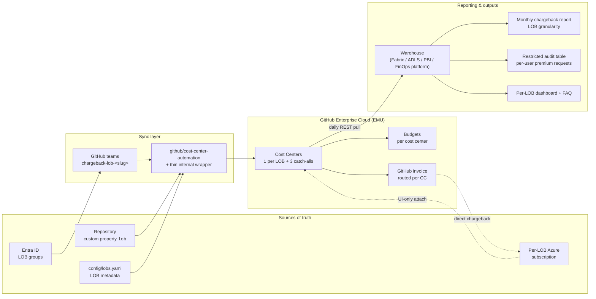

# GitHub Enterprise Chargeback System — Design

This document describes how to attribute and charge back all GitHub Enterprise Cloud (EMU) costs — licenses, GitHub Copilot, GitHub Actions, Codespaces, Packages, Git LFS, GitHub Advanced Security, premium requests, and self-hosted runner infrastructure — to internal lines of business (LOBs).

The design is grounded in the GitHub-native **Cost Centers** capability on the enhanced billing platform and is tuned for the constraints captured during requirements gathering: an EMU enterprise, a single monolithic organization, IdP-managed group membership, repository custom properties, and the goal of **true chargeback** to per-LOB Azure subscriptions.

> **Last Updated:** May 14, 2026
> **Owner:** Platform / GitHub Admin team
> **Status:** Design — pending stakeholder review

---

## Executive Summary

This design routes every in-scope GitHub-billed cost — Enterprise and Copilot licenses, Copilot premium requests, Actions, Codespaces, Packages, LFS, Advanced Security, and self-hosted runner infrastructure — to exactly one line of business (LOB), then bills each LOB on its own Azure subscription through GitHub's native **Cost Centers** capability. GitHub Marketplace apps and other spend that GitHub does not allow on a cost center are handled separately (see [Risks and Edge Cases](#risks-and-edge-cases)).

**Core idea in one sentence:** identity-driven user assignment plus repository-property-driven repo assignment populate a per-LOB cost center, which is bound to a per-LOB Azure subscription for direct chargeback, with a thin warehouse layer providing multi-year reporting, audit, and budget governance.

**Approach at a glance:**

* **Two assignment levers, one source-of-truth per lever.** IdP group membership (mirrored into GitHub teams) drives *user* assignment for license-based products (Enterprise seats, Copilot, GHAS, premium requests). Repository custom properties drive *repo* assignment for usage-based products (Actions, Codespaces, Packages, LFS).
* **One cost center per LOB.** Sub-LOB granularity stays in finance, not in GitHub. Three reserved catch-alls track different operational states: `00 - Shared Platform`, `98 - Pending Onboarding`, `99 - Attribution Defect`.
* **True chargeback via Azure subscription linkage.** Each LOB cost center is attached to that LOB's Azure subscription so GitHub-metered usage invoices the LOB directly. The attach step is UI-only and remains a manual onboarding gate.
* **Summarized REST data for the chargeback report; restricted per-user audit table for waste and anomaly detection.** Detailed UI-only reports stay out of the automated pipeline.
* **Reuse before build.** Adopt [github/cost-center-automation](https://github.com/github/cost-center-automation) for sync, budgets, and PRU tracking; wrap it with a thin internal layer for reconciliation, runner cost merging, and approval workflow.
* **Warehouse choice deferred but constrained.** Four landing-zone options (Fabric + FinOps Toolkit, ADLS + Synapse/Databricks, Power BI direct, existing internal FinOps platform) all feed from the same daily exports; whichever is chosen must meet a minimum binding contract (raw immutable exports, replayable close, 7-year retention).

### System overview



### Phased rollout in one view

| Phase | Focus | Mode |
|---|---|---|
| 0 — Prerequisites | Service account, automation repo, LOB list, `lob` property | None |
| 1 — Showback pilot | Two pilot LOBs, plan-only, report against history | **Showback** |
| 2 — Apply + budgets | Apply-mode sync, alert-only budgets, edge-case validation | **Showback** |
| 3 — True chargeback | Attach Azure billing identities, sign off with finance | **Chargeback** |
| 4 — Full rollout | All LOBs in waves, drive catch-all usage to zero, on-call handoff | **Chargeback** |

### How to read this document

* Sections 1–4 are scope, assumptions, and platform limits.
* Sections 5–10 cover the design itself (allocation, mapping, naming, Azure linkage, runner reconciliation).
* Sections 11–12 cover reporting and the warehouse.
* Sections 13–16 cover operations (budgets, automation, APIs, runbook).
* Sections 17–18 cover dispute resolution and end-user documentation — the human-process layer.
* Sections 19–20 cover risks and the phased rollout plan.
* Sections 21–22 close with open questions and references.

---

## Table of Contents

0. [Executive Summary](#executive-summary)
1. [Goals and Non-Goals](#goals-and-non-goals)
2. [Assumptions and Constraints](#assumptions-and-constraints)
3. [GitHub Cost Centers — Capability Summary](#github-cost-centers--capability-summary)
4. [Documented Limits](#documented-limits)
5. [Allocation Rules per Product](#allocation-rules-per-product)
6. [LOB-to-Cost-Center Mapping Strategy](#lob-to-cost-center-mapping-strategy)
7. [Source-of-Truth Pipeline](#source-of-truth-pipeline)
8. [Naming Conventions](#naming-conventions)
9. [True Chargeback via Azure Subscription Linkage](#true-chargeback-via-azure-subscription-linkage)
10. [Self-Hosted Runner Reconciliation](#self-hosted-runner-reconciliation)
11. [Reporting, Retention, and Invoice Reconciliation](#reporting-retention-and-invoice-reconciliation)
12. [Long-Term Warehouse Strategy](#long-term-warehouse-strategy)
13. [Budgets and Guardrails](#budgets-and-guardrails)
14. [Build vs. Buy — Automation](#build-vs-buy--automation)
15. [APIs, Permissions, and Token Strategy](#apis-permissions-and-token-strategy)
16. [Operational Runbook](#operational-runbook)
17. [Dispute Resolution Process](#dispute-resolution-process)
18. [End-User Documentation](#end-user-documentation)
19. [Risks and Edge Cases](#risks-and-edge-cases)
20. [Phased Rollout Plan](#phased-rollout-plan)
21. [Open Questions](#open-questions)
22. [References](#references)

---

## Goals and Non-Goals

### Goals

* Attribute every billable GitHub product to exactly one LOB on every invoice line.
* Achieve **true chargeback** by routing each LOB's GitHub usage to that LOB's own Azure subscription (where Azure billing identity is supported).
* Keep LOB-to-resource mappings driven by the existing identity and repo metadata systems, so the chargeback model stays in sync with organizational reality without manual reassignment.
* Provide budgets and alerts per LOB to give cost owners agency, not just visibility.
* Produce a monthly chargeback report that reconciles to the GitHub invoice within rounding tolerance.

### Non-Goals

* Replacing finance ledger systems. The system produces reconciled inputs; it does not post journal entries.
* Tracking marketplace apps or third-party integrations not billed by GitHub.
* Allocating partner/contractor seats outside the IdP. Those are handled as a single "Shared / Unattributed" cost center until the IdP catches up.
* Real-time cost prevention beyond what GitHub budget enforcement already provides.

## Assumptions and Constraints

The design assumes the following confirmed inputs:

> [!NOTE]
> These are **prerequisites this design depends on**, not universal requirements of GitHub or Azure. They were confirmed during requirements gathering. If any change — different IdP, multiple Entra tenants, classic PATs banned by security policy, no per-LOB Azure subscription, multi-currency billing, no change-management system — the corresponding section of the design must be revisited before implementation.

| Area | Assumption |
|---|---|
| Plan | GitHub Enterprise Cloud with EMU, on the enhanced billing platform |
| Org topology | One large monolithic organization spanning all LOBs |
| Identity | EMU users provisioned by SCIM from Entra ID (single tenant) |
| Group truth | IdP groups synced to GitHub teams; this is the LOB source for *people* |
| Repo truth | Repository custom properties (for example, `lob`, `cost-center`) are the LOB source for *repos* |
| Azure | Each LOB owns a distinct Azure subscription that is to be charged directly. Subscriptions are tagged `chargeback-lob=<slug>` under a tag policy the platform team can audit |
| Currency and legal entity | All in-scope LOB Azure subscriptions billed in **USD** with a single legal entity. Non-USD or cross-entity rollout is out of scope for v1 (see Risks) |
| Tooling | A change-management ticketing system (or equivalent auditable approval record) is available for the manual Azure-attach gate |
| Tokens | Classic PATs scoped to billing endpoints can be issued to a designated EMU service account, subject to security review (see [APIs, Permissions, and Token Strategy](#apis-permissions-and-token-strategy)) |
| Products in scope | GitHub Enterprise seats, Copilot seats, Copilot premium requests, Actions hosted minutes, self-hosted runner infra, Git LFS, GitHub Advanced Security (Code Security, Secret Protection) |
| Admin authority | A central platform team owns the enterprise, billing, and the chargeback automation |

> [!IMPORTANT]
> Cost Centers apply only to **metered usage** under the enhanced billing platform. Volume or pre-paid subscription billing is not affected. Confirm the enterprise has fully transitioned before relying on this design.

## GitHub Cost Centers — Capability Summary

A **cost center** is an enterprise-scoped grouping of resources used to allocate GitHub spending. Each cost center can contain any combination of:

* Users (EMU `_short_login` values)
* Organizations (relevant for multi-org enterprises; less so here)
* Repositories (the primary lever in a monolithic-org setup)

Each cost center can optionally be linked to a distinct **Azure subscription** for direct billing — the basis for the true chargeback design in this document.

Cost centers are managed in the GitHub UI under **Enterprise → Billing & Licensing → Cost centers**, and through REST endpoints under `/enterprises/{enterprise}/settings/billing/cost-centers`. Once a resource is assigned, future usage attributes to the cost center; past usage is **not** retroactively re-allocated.

> [!IMPORTANT]
> **GitHub teams are not a cost center resource type.** Only users, organizations, and repositories can be attached. To allocate by team, the automation must expand each team to its user members and attach the users individually. The [github/cost-center-automation](https://github.com/github/cost-center-automation) tool's Teams Mode performs this expansion for you.

> [!NOTE]
> Outside collaborators and other unaffiliated users can be added to a cost center **only via the API**, not the UI. Pure-EMU enterprises do not have outside collaborators, so this is rarely relevant here, but worth noting if any partner identities exist.

## Documented Limits

These are the published platform limits as of May 2026; verify against the [Cost centers limitations](https://docs.github.com/en/billing/concepts/cost-centers#cost-center-limitations) doc before any large-scale rollout.

| Limit | Value | Implication for this design |
|---|---|---|
| Active cost centers per enterprise | 250 | Comfortably above any realistic LOB count. Archived cost centers do not count toward this cap. |
| Resources per cost center | 25,000 | Per cost center, not total. With 250 cost centers the theoretical ceiling is 6.25M resources — the practical limit is operational, not API-imposed. |
| Resources added or removed per API call | 50 | The sync automation must batch in groups of 50 with retry/backoff. |
| Azure subscription assignment | UI-only | Cannot be automated via REST today. Plan a manual step in LOB onboarding. See [True Chargeback](#true-chargeback-via-azure-subscription-linkage). |
| Detailed usage report (UI) | Max 31-day window per request | Multi-month history must be persisted to a warehouse. Detailed reports are not available via REST. See [Long-Term Warehouse Strategy](#long-term-warehouse-strategy). |
| Summarized usage report (REST) | Past 24 months accessible | The system of record for periods older than 24 months must live in your warehouse. |
| Premium request usage report | Begins October 1, 2025 | No premium request data exists for periods earlier than this date. |

## Allocation Rules per Product

This is the most important table in the design. Two assignment levers — *user* and *org/repo* — are both required because GitHub allocates products differently.

| Product | Charged based on | Lever in this design |
|---|---|---|
| GitHub Enterprise (seats) | User who holds the license; org if user is unassigned | User assignment |
| GitHub Copilot (seats) | User who holds the license; org if user is unassigned | User assignment |
| Copilot premium requests / cloud agent | User who triggered the request; org of the Copilot license if user is unassigned | User assignment |
| GitHub Advanced Security / Secret Protection / Code Security | Active committer (user); org if user is unassigned | User assignment |
| GitHub Actions (hosted runners) | Repository or org where the workflow ran | Repository assignment |
| GitHub Actions cache and custom-image storage | Repository or org owning the cache / image | Repository assignment |
| GitHub Codespaces (compute) | Repository or org where the codespace was created | Repository assignment |
| GitHub Codespaces prebuild storage | Repository owning the prebuild | Repository assignment |
| GitHub Packages | Repository or org that owns the package | Repository assignment |
| Git LFS | Repository or org where LFS storage / bandwidth is consumed | Repository assignment |
| GitHub Models inference (when enabled) | User who invoked the model; falls back to org of the calling repo | User assignment, repo fallback |
| Self-hosted runner compute | Not on the GitHub invoice (paid in your own infra) | Out-of-band reconciliation (see [Self-Hosted Runner Reconciliation](#self-hosted-runner-reconciliation)) |

**Key implication:** every LOB needs both *its users* and *its repositories* assigned to its cost center. Assigning only one or the other will leave a category of cost falling through to "Enterprise Only" (unallocated) on the report.

> [!NOTE]
> When a user is directly assigned to a cost center, that takes priority over indirect assignment via organization membership. Use direct user assignment as the rule, not the exception, for license-based products.

### Allocation edge cases

The table above is the happy path. These cases need an explicit policy, otherwise spend silently lands in "Enterprise Only" or the wrong LOB:

* **User with no cost center membership.** In a monolithic-org topology where the org itself is not assigned to any cost center, license usage and premium requests for an unassigned user fall to **Enterprise Only**, not to `99 - Attribution Defect`. Two acceptable policies: (a) attach the monolithic org to `99 - Attribution Defect` so the fallback is captured, or (b) gate license assignment in the IdP so a user cannot receive a Copilot or Enterprise seat without an LOB group. This design recommends option (b); option (a) is a safety net during cutover.
* **Forks and first-time contributor PRs.** GitHub Actions minutes bill to the **repository owner**, not the actor. PRs from forks consume the base repo's Actions minutes, so the cost lands on the base repo's LOB. Document this so LOBs hosting open source or shared internal repos understand that they pay for community contributions.
* **Copilot cloud-agent invocations.** When the cloud agent runs a workflow, the premium requests bill to the **assigned user** of the agent invocation, and the Actions minutes bill to the **repository** the workflow runs in. These can land in different LOBs. Surface both lines in the report; do not attempt to merge them.
* **Mid-month cost-center moves.** Usage timestamps before the move stay with the prior cost center; usage after the move attributes to the new one. There is no proration. Schedule moves at month boundaries when the LOB change is administrative; accept the in-month split when the change is operational.
* **Multi-LOB users.** GitHub allows only one cost center per user. The chargeback automation logs a warning when a user is in two `chargeback-lob-*` teams; the IdP must enforce single-LOB membership upstream. The automation picks one (last-write-wins) and surfaces the conflict.
* **Codespaces secrets, Migrations, Code Search.** These are not separately metered today. If GitHub introduces meters, slot them into the existing user-vs-repo split using the same logic as the closest analog above.

## LOB-to-Cost-Center Mapping Strategy

A single monolithic organization with multiple LOBs has two complications: users are mixed in one org, and repos are mixed in one org. A clean chargeback model needs both axes mapped.

### One cost center per LOB

Create exactly one cost center per LOB. Avoid splitting a single LOB across multiple cost centers — sub-LOB granularity belongs in downstream finance reporting, not in GitHub, because:

* Users can only belong to one cost center at a time.
* Repos can only belong to one cost center at a time.
* Multi-cost-center sprawl makes budget and reporting math harder without improving accuracy.

If a sub-LOB breakdown is mandatory, encode it in repository custom properties (for example, `business-unit`, `team`) and produce sub-LOB rollups from the detailed usage report. The cost center stays at LOB granularity.

### Hybrid driver model

Drive cost center membership from two synchronized sources:

| Resource type | Source | Mapping rule |
|---|---|---|
| Users | IdP group membership (mirrored into GitHub teams) | One designated "LOB" team (or top-level IdP group) per LOB. Membership in that team = cost center membership. |
| Repositories | Repository custom property (for example, `lob`) | The property value (case-normalized) selects the cost center. |

This separation is intentional. People move between LOBs via HRIS / IdP changes; repositories move between LOBs through deliberate property edits, code review, and CODEOWNERS — separate lifecycles, separate authoritative systems.

### Catch-all cost centers

Reserve three operational cost centers in addition to the LOB cost centers. Each one signals a different operational state:

* `00 - Shared Platform` — for shared infrastructure repos (DevEx, internal tooling, golden paths) and for platform-team users. **Expected to have steady, planned spend** that is charged back through an internal allocation key, not direct LOB.
* `98 - Pending Onboarding` — for users and repos belonging to LOBs that are mid-onboarding (IdP group exists, GitHub team being populated, Azure subscription not yet attached). **Expected to trend down** as onboarding waves complete.
* `99 - Attribution Defect` — for users without an IdP LOB group, repos without a `lob` property, or anything else that should not be in the catch-all by design. **Expected to trend to zero.** Anything in this bucket triggers a cleanup ticket.

The operational signals are different: `00` is steady-state platform overhead; `98` measures onboarding velocity; `99` measures attribution defect rate. Do not collapse them.

## Source-of-Truth Pipeline

```text
+---------------------+      +---------------------+      +-------------------------+
| Entra ID            | ---> | GitHub teams (EMU)  | ---> | Cost center: users      |
| LOB groups          |      | one team per LOB    |      | (license + premium req) |
+---------------------+      +---------------------+      +-------------------------+

+---------------------+      +---------------------+      +-------------------------+
| Repository custom   | ---> | Cost-center sync    | ---> | Cost center: repos      |
| property `lob`      |      | automation          |      | (Actions, LFS, etc.)    |
+---------------------+      +---------------------+      +-------------------------+

+---------------------+      +---------------------+      +-------------------------+
| Per-LOB Azure sub   | ---> | Cost center Azure   | ---> | Direct chargeback to    |
| (one per LOB)       |      | billing identity    |      | LOB Azure invoice       |
+---------------------+      +---------------------+      +-------------------------+
```

### Stage 1 — Identity sync (existing)

EMU SCIM from the IdP creates and deactivates GitHub users. IdP group membership is mirrored into GitHub teams. This stage already exists in the EMU baseline and is not changed by this design.

### Stage 2 — LOB team designation

For each LOB, designate one GitHub team as the **chargeback team**. Naming convention: `chargeback-lob-<lob-slug>`. Membership in this team is the single authority for assigning users to a cost center. Other functional teams (review groups, application teams) continue to operate without billing semantics.

### Stage 3 — Repository property tagging

Define a tenant-wide repository custom property `lob` (or `cost-center`) with an allowed-values list matching the LOB slugs. Enforce population through:

* Repository creation templates and golden-path workflows
* A scheduled audit that lists repos with empty or invalid `lob` values
* CODEOWNERS plus repo admin responsibility for keeping the value current

### Stage 4 — Sync automation

A scheduled job reads the team membership and the repo property values, then makes the cost center match through the GitHub REST API. Plan-then-apply, with an audit log per run. See [Build vs. Buy — Automation](#build-vs-buy--automation).

### Stage 5 — Azure billing identity per cost center

For each LOB cost center, attach the LOB's Azure subscription as the billing identity. From that point GitHub charges the LOB subscription directly for that cost center's usage. This is configured in the cost center settings UI and verified against Azure during creation.

## Naming Conventions

Consistent slugs are critical because the same LOB identifier is used in IdP groups, GitHub team names, repo property values, and cost center names.

| Item | Pattern | Example |
|---|---|---|
| LOB slug | `kebab-case`, ASCII, no spaces | `retail-banking` |
| IdP group | `gh-lob-<slug>` | `gh-lob-retail-banking` |
| GitHub team | `chargeback-lob-<slug>` | `chargeback-lob-retail-banking` |
| Repo custom property `lob` | `<slug>` | `retail-banking` |
| Cost center name | `LOB - <Display Name>` | `LOB - Retail Banking` |
| Shared platform cost center | `00 - Shared Platform` | (literal) |
| Pending onboarding cost center | `98 - Pending Onboarding` | (literal) |
| Attribution defect cost center | `99 - Attribution Defect` | (literal) |

> [!TIP]
> If finance maintains stable LOB codes (for example, `LOB-042`), include the code in the cost center display name: `LOB-042 - Retail Banking`. Stable codes survive display-name renames and make finance reconciliation deterministic. Add the same code as a column in `config/lobs.yaml`.

Maintain a single source-of-truth file — `config/lobs.yaml` in the **internal thin-wrapper repo** (not in upstream `github/cost-center-automation`, which has its own `config/config.yaml` for tool runtime settings) — listing every LOB with its slug, display name, finance code, IdP group, owner email, and budget defaults. The wrapper reads this file to derive the team mappings, repository custom-property mappings, and budget definitions that it then feeds into the upstream tool.

> [!IMPORTANT]
> **Azure subscription IDs are deliberately not stored in `lobs.yaml`.** The Azure-to-cost-center binding is a UI-only operation in GitHub, so a Git copy can never be automatically reconciled with the live state and would drift silently. The binding is governed instead by an Azure subscription tagging convention plus a monthly audit query (see [True Chargeback via Azure Subscription Linkage](#true-chargeback-via-azure-subscription-linkage)).

> [!NOTE]
> Two distinct config files exist and they are not interchangeable:
>
> * **Upstream** `github/cost-center-automation/config/config.yaml` — the tool's own runtime configuration (mode, scope, naming patterns, budget amounts). One file per environment.
> * **Internal** `<our-wrapper-repo>/config/lobs.yaml` — our LOB registry, owned by the platform team. The wrapper transforms entries here into the upstream tool's `team_mappings` / `repository_config.explicit_mappings` / `budgets.products` structures at run time.

### Sample `config/lobs.yaml`

A minimal but complete example showing two active LOBs, one pending LOB, and the three reserved catch-alls. Only the fields the wrapper actually consumes are shown; extend with finance metadata as needed.

```yaml
# config/lobs.yaml
# Internal LOB registry consumed by the chargeback wrapper.
# One entry per line of business + the three reserved catch-alls.
# Source of truth: platform team. Reviewed monthly with finance.
#
# DELIBERATELY OMITTED: Azure subscription IDs and billing-identity
# attachment metadata. The Azure-to-cost-center binding is a UI-only
# operation in GitHub, so duplicating it in Git creates a shadow copy
# that drifts silently. Instead:
#   - Each LOB Azure subscription carries the tag 'chargeback-lob=<slug>'.
#   - The cost-center display name on GitHub encodes the same <slug>.
#   - A monthly audit query joins GitHub cost centers + tagged Azure subs
#     and reports any mismatch. See Section 9.

schema_version: 1
updated: 2026-05-14

defaults:
  budget_currency: USD
  budget_alert_thresholds: [50, 75, 90, 100]   # percent of budget
  cost_center_name_prefix: "LOB - "
  team_name_prefix: "chargeback-lob-"
  repo_property_name: lob
  azure_subscription_tag_key: chargeback-lob   # value must equal the LOB slug

lobs:
  - slug: retail-banking
    finance_code: LOB-042                       # stable code from finance ledger
    display_name: Retail Banking
    status: active                              # active | pending | retired
    owner_email: retail-banking-platform-leads@contoso.com
    entra_group_id: 8f3c5f80-1234-4abc-9def-1111aaaa2222
    budgets:
      copilot: 18000          # USD per month
      actions: 4500
      packages: 800
      codespaces: 600
      lfs: 200
    notes: "Includes mortgage origination sub-team; do not split."

  - slug: capital-markets
    finance_code: LOB-077
    display_name: Capital Markets
    status: active
    owner_email: capmkts-eng-leads@contoso.com
    entra_group_id: 9a4d6090-2345-4bcd-8eaf-2222bbbb3333
    budgets:
      copilot: 9000
      actions: 7500
      packages: 400
      codespaces: 1500
      lfs: 100

  - slug: data-platform
    finance_code: LOB-103
    display_name: Data Platform
    status: pending                             # awaiting Azure subscription attach in GitHub UI
    owner_email: data-platform-leads@contoso.com
    entra_group_id: 7b2e4070-3456-4cde-7fbf-3333cccc4444
    budgets:
      copilot: 6000
      actions: 3000
    notes: "Resources currently park in '98 - Pending Onboarding'."

# Reserved catch-all cost centers.
# These are NOT line-of-business entries; they are operational buckets that
# stay billed to the central enterprise subscription.
catch_alls:
  - slug: shared-platform
    cost_center_name: "00 - Shared Platform"
    purpose: "Steady-state shared infrastructure (e.g., shared runners idle capacity, platform tooling)."

  - slug: pending-onboarding
    cost_center_name: "98 - Pending Onboarding"
    purpose: "Resources for LOBs whose cost center / Azure subscription is not yet linked. Should trend down each month."

  - slug: attribution-defect
    cost_center_name: "99 - Attribution Defect"
    purpose: "Resources that failed the assignment rules (e.g., repo missing 'lob' custom property, user missing IdP group). Should trend to zero."
```

Key conventions the wrapper enforces when reading this file:

* `slug` is the immutable identifier; renaming a `display_name` does not break attribution. The same slug appears on the GitHub cost center display name (`LOB - <Display Name>` or `LOB-<finance_code> - <Display Name>`) and on the LOB's Azure subscription as the value of the `chargeback-lob` tag.
* `finance_code` is what gets prepended to the cost center display name when present (`LOB-042 - Retail Banking`).
* `status: pending` blocks the wrapper from moving resources out of `98 - Pending Onboarding`. Promotion to `active` is allowed only after the Azure subscription has been attached to the cost center in the GitHub UI **and** the monthly audit query (Section 9) has confirmed the binding.
* No subscription IDs, billing accounts, or attach timestamps live in this file. The `chargeback-lob` Azure tag is the source of truth for the binding; the cost center display name is the cross-reference; the change-management ticket is the human audit trail.
* Adding a new LOB requires a PR with platform-team and finance approval; the wrapper's plan-mode run is attached to the PR for review before merge.

## True Chargeback via Azure Subscription Linkage

Each LOB cost center is bound to its LOB's Azure subscription so GitHub usage allocated to the cost center bills directly to that subscription. The mechanics:

1. The LOB provides the Azure subscription that will receive the chargeback (identified by the LOB **slug** in the change-management ticket, not by raw subscription ID in any platform-repo file).
2. The platform team adds the Azure billing identity to the cost center **in the GitHub UI** (this step is not available via the REST API today). GitHub validates the identity against Azure during configuration.
3. Going forward, GitHub-metered usage attributed to that cost center is invoiced against the LOB's Azure subscription rather than the central enterprise subscription.
4. License-based products allocated to the cost center (Copilot seats, Enterprise seats, GHAS) bill the same way.

> [!WARNING]
> The Azure subscription assignment is **UI-only**. The chargeback automation cannot attach or rotate Azure billing identities programmatically. Treat this as a manual gate in the LOB onboarding runbook.

### Binding governance — how the link is kept correct without storing IDs in Git

Because the attach is UI-only and the wrapper cannot enforce it, the binding is governed by **convention plus audit**, not by a Git-stored mirror of the linkage:

1. **Cost center display name encodes the LOB slug.** Every LOB cost center is named with the convention `LOB - <Display Name>` (or `LOB-<finance_code> - <Display Name>` when finance codes are in use). This makes the LOB identity machine-readable from the GitHub side without any external lookup.
2. **Azure subscription tag encodes the same LOB slug.** Each LOB Azure subscription carries the tag `chargeback-lob=<slug>` (the key is configured in `defaults.azure_subscription_tag_key` in `lobs.yaml`). Tag policy on the LOB management group enforces presence of the tag; missing-tag findings open a P2 ticket on the LOB owner.
3. **Monthly audit query reconciles both sides.** A scheduled job runs after the monthly close and produces a three-column reconciliation:
   * the GitHub cost center (name and ID, fetched via REST),
   * the Azure subscription currently attached to it in the GitHub UI — read from the GitHub cost center API if exposed, otherwise inferred from the actual Azure-side billed entity for the period,
   * the Azure subscription whose `chargeback-lob` tag matches the LOB slug embedded in the cost center name.
   Rows where the second and third values disagree are governance violations and block the next month's report sign-off until cleared.
4. **Change-management ticket is the human audit trail.** Each attach, detach, or re-attach is recorded in the platform team's change-management system with the operator, the date, the cost center ID, the Azure subscription ID, and a link to the LOB onboarding ticket. This is where ID-level evidence lives — in the change system, not in the platform repo.

This design accepts that the platform repo will never know the live Azure subscription ID for any cost center. That is the trade-off for not maintaining a shadow copy that silently drifts. The audit query, the Azure tag, and the change ticket together substitute for the Git mirror, and each of them is independently verifiable.

Edge cases to plan for:

* **An LOB does not yet have a usable Azure subscription.** Park its cost center against the central enterprise subscription and tag the cost center with a temporary marker (for example, prepend `PENDING-` to the display name). Re-link when the LOB onboarding completes.
* **Mid-month subscription change.** GitHub charges based on the configuration at the time of usage; switching the Azure billing identity does not retroactively rebill prior usage. Schedule changes at month boundaries when possible.
* **Resource moves between cost centers mid-month.** Usage before the move stays with the old cost center; usage after the move attributes to the new one. The detailed usage report timestamps allow accurate proration if needed.
* **`chargeback-lob` tag missing or wrong on the Azure side.** The monthly audit query catches this. Until the tag is corrected, the LOB cannot move out of `pending` status and the cost center remains a candidate for `99 - Attribution Defect` review.

## Self-Hosted Runner Reconciliation

Self-hosted runner compute does not appear in the GitHub invoice. The chargeback record for that compute lives in the runner's hosting environment and must be merged with the GitHub-billed view to give LOBs a complete picture.

### Two attribution patterns

Different runner topologies need different attribution math. Choose per pool.

**Pattern A — Static pool per LOB (preferred when feasible):**

Tag every Azure resource that supports the runner — VM scale sets, container apps, AKS node pools, Azure Container Instances — with at minimum:

* `lob` — same value as the GitHub repo custom property
* `purpose=github-actions-runner`
* `runner-pool` — pool name owned by that LOB

Reconciliation is then a direct sum of Azure-tagged spend grouped by `lob`.

**Pattern B — Shared pool (Actions Runner Controller / AKS or shared VMSS):**

The pool is a single Azure resource serving many LOBs, so direct tagging cannot attribute. Split the pool's Azure cost downstream using a **job wall-clock occupancy** weighting key (workflow-runs alone is the wrong key — it ignores job duration, runner shape, retries, and matrix fan-out):

1. Pull workflow run inventory per repository from `GET /repos/{owner}/{repo}/actions/runs`, then expand each run to its jobs via `GET /repos/{owner}/{repo}/actions/runs/{run_id}/jobs`.
2. For each job, capture: `started_at`, `completed_at`, `runner_name`, `labels`, `conclusion`. Compute wall-clock seconds per job.
3. **Month-boundary splitting:** when a job spans a month boundary, split its wall-clock time into the two months at the boundary. Bill each month independently.
4. **Failed and cancelled jobs:** include them in the weighting key. The runner was occupied; the LOB owns the cost regardless of conclusion. Surface a separate "failure-rate" KPI per LOB if waste reduction is a goal.
5. **Runner shape weighting:** if the shared pool runs heterogeneous runner SKUs (for example, 2-vCPU and 8-vCPU nodes), weight by `wall_clock_seconds × vCPU_count` (or vCPU-seconds) rather than raw seconds. Otherwise small jobs on big runners under-pay.
6. Roll job-time up to LOB by joining on the `lob` repo custom property of the job's repository.
7. Apportion the pool's Azure monthly cost across LOBs in proportion to LOB-share of total weighted occupancy.
8. **Idle capacity and cold-start overhead:** the difference between `sum(occupied vCPU-seconds)` and `pool capacity vCPU-seconds` is **shared platform overhead**. Charge it to `00 - Shared Platform`, not pro-rata to LOBs. Track this idle ratio as a platform KPI — high idle ratio means the pool is over-provisioned; high occupancy with queue time means under-provisioned.
9. Publish the split rule and version it. Every chargeback dispute on shared infra traces to this rule, so it must be reviewable.

### Reconciliation pipeline

1. Pull Azure cost data filtered by `purpose=github-actions-runner`, grouped by `lob` (Pattern A) or by `runner-pool` (Pattern B).
2. Pull the GitHub usage summary for the same period, grouped by cost center.
3. Join on the LOB slug; produce a single row per LOB per month with both columns: `github_invoiced_cost` and `self_hosted_runner_cost`.
4. Surface both in the chargeback report and ledger feed.

> [!TIP]
> Where workflows mix hosted and self-hosted runners, allow LOBs to see both numbers in the same report. This is the most-asked-for capability from finance and engineering leads when chargeback launches.

> [!NOTE]
> GitHub does not currently bill for self-hosted runner minutes; only Actions storage (artifacts and logs) is metered. A previously announced per-minute fee for self-hosted runners has been deferred and has no published GA date as of the report date. If GitHub introduces a meter, it will surface in the GitHub usage report keyed by org/repo and will flow through the existing cost center allocation without code changes.

## Reporting, Retention, and Invoice Reconciliation

### What is and is not available via API

| Report | Available via REST? | Granularity | Retention |
|---|---|---|---|
| Summarized usage (`/usage/summary`) | Yes | Aggregated by product, SKU, cost center, day | 24 months via API |
| Per-cost-center usage (`/usage`) | Yes | Per resource per day, includes `cost_center_name`, `organization_name`, `repository_name` (no `username` / `workflow_path`) | 24 months via API |
| Premium request usage (`/premium_request/usage`) | Yes | Per user, per model, per day | 24 months via API; data starts October 1, 2025 |
| **Detailed usage report** (with `username` and `workflow_path`) | **No** | Per resource per day with user and workflow detail | Max 31-day window per request, **UI download only**, **emailed as CSV**, one report per account at a time |

> [!WARNING]
> The detailed usage report — the one that includes `username` and `workflow_path` — is **not exposed by the REST API**. It must be requested in the GitHub web UI and is delivered by email. **This design does not consume the detailed report in the automated pipeline** — see [Chargeback granularity — design decision](#chargeback-granularity--design-decision). The detailed report remains available in the UI for ad-hoc finance investigations only.

### Chargeback granularity — design decision

This design **uses summarized REST data only**. The detailed usage report (which adds `username` and `workflow_path`) is UI- and email-only and is not consumed by the automated chargeback pipeline.

What this means in practice:

* Chargeback is allocated at **cost center × product × SKU × organization × repository × day** granularity.
* The chargeback report does **not** break costs down per user or per workflow file. License-based products are still attributed to the LOB through the user's cost center membership; the per-user line item is just not present in the warehouse.
* The detailed report remains available in the GitHub web UI for ad-hoc investigations — platform engineers can request it for a 31-day window if a finance question requires per-user or per-workflow detail.
* If at a later date GitHub exposes the detailed report through the REST API, the warehouse schema can absorb the new fields without breaking existing rows.

This trade-off is acceptable because: (a) cost center membership already encodes the user-to-LOB mapping for license-based products, (b) repository custom properties already encode the repo-to-LOB mapping for usage-based products, and (c) finance reconciliation works at LOB granularity, not at user granularity.

### Data sources

| Source | Endpoint or system | Cadence |
|---|---|---|
| Enterprise usage summary (REST) | `GET /enterprises/{enterprise}/settings/billing/usage/summary?year=&month=&cost_center_id=` | Daily pull, monthly close |
| Per-cost-center usage (REST) | `GET /enterprises/{enterprise}/settings/billing/usage?cost_center_id=` | Daily |
| Premium request usage (REST) | `GET /enterprises/{enterprise}/settings/billing/premium_request/usage` | Daily |
| Detailed usage report (UI / email) | Web UI request → CSV by email | **Ad-hoc only** — not in the daily pipeline. Used for finance investigations needing user or workflow detail. |
| Cost center inventory (REST) | `GET /enterprises/{enterprise}/settings/billing/cost-centers` | Hourly cache |
| Self-hosted runner cost | Azure Cost Management export filtered by tag | Daily |
| LOB metadata | `config/lobs.yaml` in the chargeback repo | On change |

### Monthly chargeback report — column contract

The monthly report is the artifact finance consumes. Lock the schema early and version it.

| Column | Source | Description |
|---|---|---|
| `period_year_month` | Calculated | YYYY-MM |
| `lob_slug` | LOB metadata | Stable identifier |
| `lob_display_name` | LOB metadata | Human-readable name |
| `cost_center_id` | GitHub | UUID |
| `cost_center_name` | GitHub | Cost center name |
| `azure_subscription_id` | GitHub cost center API / Azure tag lookup | Azure target subscription. Resolved at report build time from the GitHub cost center binding (or, if not exposed via REST, from the Azure subscription whose `chargeback-lob` tag matches the LOB slug). Never sourced from `lobs.yaml`. |
| `product` | GitHub usage | for example, `actions`, `copilot`, `git_lfs` |
| `sku` | GitHub usage | SKU name (for example, `actions_linux`, `copilot_premium_request`) |
| `unit_type` | GitHub usage | for example, `minutes`, `gb_month`, `requests` |
| `organization_name` | GitHub usage | Owning organization (when applicable) |
| `repository_name` | GitHub usage | Owning repository (when applicable) |
| `quantity` | GitHub usage | Raw units consumed |
| `gross_amount_usd` | GitHub usage | Pre-discount amount |
| `discount_amount_usd` | GitHub usage | Included quota / contract discounts |
| `net_amount_usd` | GitHub usage | Billed amount |
| `self_hosted_runner_cost_usd` | Azure Cost Mgmt | Only on rows where applicable |
| `notes` | Calculated | Reconciliation flags, for example `RECONCILED`, `MISSING_LOB`, `REASSIGNED_MID_MONTH` |

> [!NOTE]
> The `username` and `workflow_path` columns from the detailed report are intentionally not in the contract. See [Chargeback granularity — design decision](#chargeback-granularity--design-decision).

### Per-user premium-request audit table (restricted access)

The `/premium_request/usage` REST endpoint already returns per-user data including `username`, `model`, `requests`, `exceeds_quota`, and `total_monthly_quota`. The standard chargeback report deliberately rolls this up to LOB granularity. **A separate restricted audit table persists the raw per-user rows** to enable a small set of operational use cases that LOB granularity cannot serve:

* Top-N premium-request users per LOB (waste detection, training need identification).
* Anomaly investigation when an LOB's overall premium-request spend spikes.
* Seat utilization review (Copilot seats allocated but with zero or near-zero premium request usage).
* Quota-exceedance triage (`exceeds_quota=true` + `total_monthly_quota` columns surface users hitting limits before finance close).

**Access controls:**

* The platform FinOps team has full read access for cross-LOB investigations.
* Each LOB cost owner has read access **scoped to their own LOB only** through row-level security in the warehouse.
* HR / People Operations is consulted before any individual-level report is shared outside the LOB cost owner.
* The table is excluded from any general-purpose chargeback dataset published to engineering.

**Schema (in addition to the standard chargeback columns):**

| Column | Source | Description |
|---|---|---|
| `username` | `/premium_request/usage` | EMU `_short_login` |
| `model` | `/premium_request/usage` | Model name (for example, `claude-opus-4`, `gpt-5`) |
| `requests` | `/premium_request/usage` | Number of premium requests in the period |
| `gross_amount_usd` | `/premium_request/usage` | Pre-quota cost |
| `net_amount_usd` | `/premium_request/usage` | Billed cost after quota |
| `exceeds_quota` | `/premium_request/usage` | `true` if the user passed their monthly quota |
| `total_monthly_quota` | `/premium_request/usage` | The user's quota for the period |

This preserves operational visibility without breaking the LOB-granularity contract finance signed off on. If GitHub later exposes detailed report data via REST, the same audit-table pattern extends to per-user Actions and Codespaces usage.

### Reconciliation rules

* Sum of `net_amount_usd` across all cost centers for a period must equal the GitHub invoice total within ±1 USD (rounding tolerance). Mismatches block report sign-off.
* Any rows assigned to `99 - Attribution Defect` open a P2 cleanup ticket. The goal is zero rows in this bucket each month; track defect rate as a platform KPI.
* Rows assigned to `98 - Pending Onboarding` are expected during onboarding waves; they should trend down to zero as each wave completes. Track as an onboarding velocity KPI, not a defect.
* Rows assigned to `00 - Shared Platform` are charged back through the internal allocation key documented separately in the platform team budget.
* Self-hosted runner reconciliation runs separately; mismatches between Azure-tagged spend and runner inventory open infrastructure tickets.

## Long-Term Warehouse Strategy

GitHub's REST endpoints expose the past 24 months of summarized usage. For multi-year trend analysis, audit, and finance retention beyond two years, every usage record retrieved must be persisted to your own store. The same store also enables:

* Joining GitHub usage with Azure Cost Management exports for self-hosted runner reconciliation.
* Joining with HRIS / IdP master data for canonical LOB hierarchy and sub-LOB rollups that GitHub does not model.
* Producing FOCUS-conformed cost rows so GitHub spend appears in the same FinOps dashboards as Azure spend.

### Recommended landing zone

Four landing-zone options are realistic for this design. The choice is downstream of the chargeback automation itself — the same daily REST exports feed any of them. Lock the choice with finance and the platform data team before Phase 2 of the rollout.

| Option | Description | Strengths | Trade-offs |
|---|---|---|---|
| 1. Microsoft Fabric / ADX with [FinOps Toolkit](https://microsoft.github.io/finops-toolkit/) | Land GitHub and Azure Cost Management exports in the same Fabric lakehouse or ADX cluster, conform both to the [FOCUS specification](https://focus.finops.org/), publish to Power BI with the FinOps Toolkit templates. | FOCUS-conformed; reuses existing FinOps dashboards; one place for GitHub + Azure spend; well-documented patterns. | Heavier lift if Fabric / ADX is not already in use; capacity costs; FinOps Toolkit schema must be extended for non-Azure rows. |
| 2. Azure Data Lake Storage Gen2 + Synapse or Databricks | Land raw exports in ADLS, transform with Synapse pipelines or Databricks notebooks, publish to Power BI. No FinOps Toolkit dependency. | Maximum flexibility; works with any non-FOCUS internal schema; good fit if the data team already runs Databricks or Synapse. | More custom engineering; you build the equivalent of FinOps Toolkit transforms yourself; no out-of-the-box FOCUS conformance. |
| 3. Power BI direct from CSV exports | Daily exports written to a SharePoint / OneDrive / blob folder, ingested by Power BI dataflows or imported datasets. No lakehouse. | Lowest infra cost; fastest to stand up; finance and platform team can own end-to-end. | Limited multi-year history; no easy join with high-volume Azure cost exports; refresh and dataset size limits in Power BI Pro / Premium. |
| 4. Existing internal FinOps platform | Push GitHub exports as a new source into whatever the organization already runs (Apptio Cloudability, Vantage, CloudZero, Finout, internal showback). | Reuses existing finance integrations and chargeback workflow; no parallel BI surface to maintain. | Vendor-specific connectors and FOCUS support vary; depends on whether the platform supports cost center as a dimension; some products map GitHub via "Virtual Tags" rather than native cost centers. |

> [!IMPORTANT]
> The chargeback automation — cost center sync, budget creation, monthly export — is **independent** of the warehouse choice. Land that work first against simple file exports, then route the same exports into whichever option finance ratifies.

Minimum schema to persist per usage row:

* `report_date`, `period_year_month`
* `cost_center_id`, `cost_center_name`, `lob_slug` (joined from LOB metadata)
* `product`, `sku`, `unit_type`, `quantity`
* `gross_amount_usd`, `discount_amount_usd`, `net_amount_usd`
* `organization_name`, `repository_name`
* `azure_subscription_id` (resolved at build time — see [True Chargeback](#true-chargeback-via-azure-subscription-linkage); not stored in `lobs.yaml`)
* `source_report_type` — one of `summary | per_cc | premium_request`
* `ingested_at` — load timestamp for audit

### Operating principles

* **GitHub remains the canonical allocator.** The warehouse copies what GitHub already computed; it does not invent attributions.
* **Tolerate one-source-of-truth tension.** The GitHub billing UI and the warehouse must reconcile to the invoice each month. If they disagree, the warehouse is wrong.
* **Daily incremental loads, monthly close.** Daily for trend visibility, monthly close once the GitHub invoice is final.
* **Backfill is bounded.** You can backfill at most 24 months from the API at any time, so the warehouse must capture data forward from go-live.

### Minimum binding contract for any chosen warehouse option

"Decide warehouse later" is acceptable only if the chosen option — whichever it is — meets these requirements. Lock these before Phase 2 of the rollout:

* **Raw immutable exports.** Every API response is persisted unmodified with a per-call hash, before any transformation. Never overwrite; new pulls land as new partitions.
* **Transformed chargeback rows.** A reproducible transform produces the monthly chargeback rows from the raw exports. The transform code is versioned in git; each row carries the transform version that produced it.
* **Reconciliation snapshot per close.** Each month-close produces a frozen snapshot — raw payloads, transformed rows, the GitHub invoice PDF / CSV, and the reconciliation result — stored as an immutable bundle for audit.
* **Replay procedure.** Given any month's snapshot, the close can be regenerated identically without depending on the live API (which has only 24 months of history). This is the only defense against month-18 drift.
* **Access model.** Read access for finance and LOB cost owners; restricted access for the per-user audit table (see the Reporting section); write access only to the chargeback automation service principal.
* **Retention.** Minimum 7 years for closed-month snapshots (typical finance retention); longer if regulated.
* **Ledger interface contract.** A documented push or pull interface to the finance ledger system, with idempotent semantics so re-runs do not double-post.

## Budgets and Guardrails

GitHub budgets attach at four scopes — enterprise, organization, repository, and cost center. For chargeback, the **cost center scope** is the primary control surface.

### Default budget set per LOB cost center

Create these on every LOB cost center as part of onboarding:

| Budget | Scope | Type | Purpose |
|---|---|---|---|
| Copilot premium request | Cost center | `SkuPricing` (`copilot_premium_request`) | Cap PRU overage spend |
| Actions compute (Linux) | Cost center | `SkuPricing` (`actions_linux`) | Cap hosted-runner spend |
| Actions compute (Windows) | Cost center | `SkuPricing` (`actions_windows`) | Optional — only for LOBs with Windows pipelines |
| Git LFS | Cost center | `ProductPricing` (`git_lfs`) | Cap LFS storage growth |
| Codespaces | Cost center | `ProductPricing` (`codespaces`) | Optional |
| Packages | Cost center | `ProductPricing` (`packages`) | Optional |

Each budget should:

* Use `prevent_further_usage=true` only with explicit LOB owner sign-off, since blocking usage will halt CI/CD.
* Always set `will_alert=true` with the LOB cost owner and the platform team on the recipient list.
* Default alerting at 75 / 90 / 100 percent thresholds (GitHub-built-in).

### Enterprise-wide guardrails

Set very high enterprise-scope budgets that act as a circuit breaker — they should never trip in normal operation, but they catch a runaway budget misconfiguration in a cost center.

> [!WARNING]
> Avoid low enterprise-wide budgets that overlap with cost center budgets. Enterprise limits are evaluated independently and a low enterprise budget can stop usage in an LOB that has not yet hit its own cost center budget.

## Build vs. Buy — Automation

GitHub publishes [github/cost-center-automation](https://github.com/github/cost-center-automation), an open-source Python tool maintained by GitHub that supports the exact patterns this design needs.

### Capability fit

| Need in this design | github/cost-center-automation support |
|---|---|
| Sync users to cost centers from GitHub teams | **Teams Mode** — direct fit |
| Sync repos to cost centers from custom properties | **Repository Mode** — direct fit |
| Per-user premium-request quota tracking | **PRU Mode** — direct fit (used for the audit table data feed) |
| Auto-create budgets per cost center per product | **Built-in budget creation** for Copilot premium requests and Actions — use this rather than rebuilding |
| Plan-then-apply with diff preview | Built-in (`--mode plan` / `--mode apply`) |
| Run on a schedule | Included GitHub Actions workflow (every 6 hours) |
| EMU / GHE.com endpoint support | Supported via `GITHUB_API_BASE_URL` |
| Azure billing identity attachment per cost center | **Not supported** — must be done via UI |
| Multi-LOB user disambiguation | Documented behavior (last team wins, with warnings) |

### Recommendation

Adopt `github/cost-center-automation` for stages 4a (user sync) and 4b (repo sync), and **add a thin internal wrapper** for:

* Reconciliation reporting (the column contract above)
* Self-hosted runner cost merging
* Approval workflow before applying changes that affect more than N users or M repos in one run

> [!IMPORTANT]
> The wrapper **cannot** automate Azure billing identity attachment per cost center. That step is UI-only today and remains a manual gate in the LOB onboarding runbook.

Document the internal wrapper in this repo. Treat the upstream tool as a managed dependency, pinned to a known release.

## APIs, Permissions, and Token Strategy

### Authentication

| Operation | Token type | Required scopes |
|---|---|---|
| Manage cost centers (create, list, add resources) | Classic PAT | `manage_billing:enterprise` |
| Read teams for sync | Classic PAT or GitHub App | `read:org` |
| Read enterprise usage summary, premium requests | Classic PAT | `manage_billing:enterprise` |
| Manage budgets | Classic PAT | `manage_billing:enterprise` |
| Read repository custom properties at scale | Classic PAT or GitHub App | `repo` (read) |

> [!IMPORTANT]
> Fine-grained PATs are **not supported** for the billing usage and budget endpoints at the time of writing. Use a classic PAT created by an enterprise owner or billing manager service account, stored as a GitHub Actions secret with restricted environment access.

> [!CAUTION]
> **Classic PATs are a security prerequisite, not just an implementation detail.** Many enterprises restrict or ban classic PATs by policy. Before Phase 1, confirm with the security team that:
>
> * Issuing a classic PAT to a designated EMU service account is permitted (or a documented exception is granted).
> * Compensating controls are in place: PAT scoped to the minimum (`manage_billing:enterprise`, `read:org`, `repo` read), stored as a GitHub Actions environment secret with restricted environment access, every API call audited via the chargeback workflow run ID, and rotation on a published cadence.
> * GitHub Apps are tracked as a future replacement once the billing and budgets endpoints support fine-grained authentication.
>
> If classic PATs are not permitted and no exception is granted, this design cannot proceed — the upstream `github/cost-center-automation` tool requires this scope today.

> [!NOTE]
> Cost centers can also be created by **organization owners** for their own org, not only by enterprise owners. In a monolithic-org topology this distinction is moot — the platform team holds both roles — but worth noting if the topology evolves to multi-org or if a sub-org delegation model is introduced later.

### Endpoint inventory

| Purpose | Method | Path |
|---|---|---|
| List cost centers | GET | `/enterprises/{enterprise}/settings/billing/cost-centers` |
| Create cost center | POST | `/enterprises/{enterprise}/settings/billing/cost-centers` |
| Add resources to cost center | POST | `/enterprises/{enterprise}/settings/billing/cost-centers/{id}/resource` |
| Usage summary | GET | `/enterprises/{enterprise}/settings/billing/usage/summary?year=&month=&cost_center_id=` |
| Premium request usage | GET | `/enterprises/{enterprise}/settings/billing/premium_request/usage` |
| List budgets | GET | `/enterprises/{enterprise}/settings/billing/budgets` |
| Create budget | POST | `/enterprises/{enterprise}/settings/billing/budgets` |
| Update / delete budget | PATCH / DELETE | `/enterprises/{enterprise}/settings/billing/budgets/{budget_id}` |
| Org teams (members) | GET | `/orgs/{org}/teams/{team_slug}/members` |
| Repo custom properties | GET | `/orgs/{org}/properties/values` |

> [!NOTE]
> The Budgets endpoints are in **public preview** and require the API version header `X-GitHub-Api-Version: 2026-03-10`. Pin the version in the automation and review the changelog before upgrading. The version header value should be re-verified against the [github/cost-center-automation](https://github.com/github/cost-center-automation) source code at upgrade time, since the public docs page for the budgets endpoint has been intermittently unavailable.

### Service account model

* Create one EMU service account designated as enterprise billing manager.
* Issue one classic PAT with the minimum scopes above; rotate every 90 days.
* Store the PAT as a GitHub Actions environment secret accessible only to the chargeback workflow.
* All API calls log the run ID in the audit trail (see operational runbook).
* If the PAT expires, is revoked, or rotation fails during a monthly close, the close pauses (no partial pulls, no partial budget edits). Reissue the PAT under the rotation procedure, then resume from the last successful step. Raw exports for that period remain reproducible from the GitHub REST API for 24 months.

## Operational Runbook

### Onboard a new LOB

1. LOB lead provides: display name, slug, finance code (if any), primary cost owner email, secondary alert recipients, and confirmation that the LOB Azure subscription is tagged `chargeback-lob=<slug>` and is ready to be attached. The Azure subscription ID is captured in the change-management ticket, not in `lobs.yaml`.
2. Add the LOB entry to `config/lobs.yaml`. Initial state is `pending`.
3. Create the IdP group and the corresponding `chargeback-lob-<slug>` GitHub team (provisioned by IdP sync).
4. Add the LOB slug to the allowed-values list of the `lob` repository custom property.
5. Run the chargeback automation in `--mode plan` and review the diff. With `status: pending`, the plan creates the LOB cost center as an empty container; the LOB's user and repo resources are routed to `98 - Pending Onboarding` rather than to the new cost center. Resources only move out of `98` after step 8.
6. Apply the change. The empty LOB cost center now exists in GitHub; LOB resources are still attached to `98 - Pending Onboarding`.
7. **Manual UI step (gated):** an enterprise owner or billing manager attaches the LOB's Azure subscription to the new cost center through the GitHub UI (this is not available via REST). Verify the binding in the cost center settings; record the verification in the change-management ticket (operator, timestamp, cost center ID, subscription ID). The platform repo is intentionally not updated with the subscription ID.
8. Run the binding audit query (Section 9) and confirm the LOB row is clean. Move LOB resources from `98 - Pending Onboarding` to the new LOB cost center. Flip the LOB entry in `config/lobs.yaml` from `pending` to `active`.
9. Create the default budget set with the LOB-provided amounts.
10. Send the LOB cost owner the link to the cost center page, the per-LOB FAQ (see [End-User Documentation](#end-user-documentation)), and a sample report.

### Move a user between LOBs

1. The HRIS / IdP change updates the user's group membership. GitHub team membership follows automatically.
2. The next chargeback automation run reassigns the user to the destination cost center. Past usage stays with the original cost center. Future usage attributes to the new one.

### Move a repository between LOBs

1. A repo admin updates the `lob` repository custom property to the new value (typically through a PR template or governance workflow).
2. The next chargeback automation run reassigns the repo. Same proration semantics as users.

### Decommission an LOB

1. Remove or merge the IdP group; users either move to another LOB or are deactivated.
2. Reassign or archive the LOB's repositories.
3. Wait one full billing period after the last activity for the cost center to stop accruing.
4. Mark the cost center as deleted via the UI or API. Historical usage remains visible under the **Deleted** tab.

### Monthly close

The close is a multi-team workflow. Each step names the responsible role and the permission required, because no single role has all the access needed.

| Step | Responsible role | Required access | Output |
|---|---|---|---|
| 1. Pull final usage summary for the closed period | Platform team | GitHub classic PAT with `manage_billing:enterprise` | Raw payload bundle in warehouse |
| 2. Pull final premium-request usage (per-user, for audit table) | Platform team | Same PAT | Restricted audit table updated |
| 3. Run reconciliation against the GitHub invoice | Platform team + Finance ops | Platform: PAT; Finance: read access to warehouse + invoice PDF | Reconciliation snapshot, ±1 USD tolerance |
| 4. Resolve any rows in `99 - Attribution Defect` (open cleanup tickets) | Platform team | GitHub admin to reassign | Defect tickets filed; defect rate KPI updated |
| 5. Resolve any rows in `98 - Pending Onboarding` that should now be `active` | Platform team + LOB lead | GitHub admin + LOB sign-off | LOBs promoted in `config/lobs.yaml` |
| 6. Reconcile self-hosted runner costs from Azure tags | Platform team + Azure subscription owners | Azure Cost Management Reader on each LOB sub | `self_hosted_runner_cost_usd` populated per row |
| 7. Verify Azure subscription chargeback flowed correctly per LOB | Azure subscription owners + Finance | Azure Cost Management on LOB sub | Per-LOB confirmation logged |
| 8. Publish the monthly chargeback report to the finance share | Finance ops | Warehouse read + finance share write | Report file with snapshot ID |
| 9. Push the per-LOB ledger feed to the finance system | Finance ops | Ledger system write | Idempotent ledger post |
| 10. Close the snapshot bundle as immutable | Platform team | Warehouse admin | Snapshot frozen, hash recorded |

> [!IMPORTANT]
> Steps 1–2 and 4–5 require GitHub billing manager / admin rights and cannot be executed by finance ops alone. Steps 6–7 require Azure access on each LOB subscription; if the platform team cannot obtain Cost Management Reader on a given LOB sub, the LOB's Azure subscription owner must export their own Cost Management view for that period and hand it off, otherwise the close is blocked for that LOB until access is granted. The platform team owns the orchestration; finance owns the verification and the ledger push. Document **named role groups** (not individuals) in `config/lobs.yaml` so handoffs survive turnover.

### Failure handling and recovery

The chargeback automation is a scheduled, side-effecting job; treat its failures the way any other production data pipeline is treated.

| Failure | Detection | Recovery |
|---|---|---|
| Daily REST export missed | Monitoring alert on the workflow run | Re-run the workflow for the missed day. Backfill is bounded to the 24-month REST window; beyond that, the warehouse snapshot is the only record. |
| Classic PAT expired or revoked mid-close | Authentication failures in the workflow log | Pause the close. Reissue the PAT under the documented rotation procedure, then resume from the last successful step. No partial budgets are edited. |
| `github/cost-center-automation` upgrade breaks the apply step | `--mode plan` diff diverges from the previous run | Pin the upstream version; do not auto-upgrade in production. Test upgrades in a non-prod enterprise first. |
| Section 9 audit query reports a binding mismatch | Audit job result | Block the affected LOB row in the report; open a P1 to re-attach in the GitHub UI; do not retroactively re-bill. |
| Warehouse snapshot bundle write fails | Snapshot integrity check | Retry the write; if the snapshot is irrecoverable, replay the close from raw exports. The snapshot is the system of record for the period; an unwritten snapshot is a P1. |

## Dispute Resolution Process

The first time an LOB disputes a chargeback line, the system either has a defensible process or it loses finance trust. Define the process before the first invoice cycle.

### Intake

* Disputes are filed as GitHub issues in the chargeback automation repository using a `Dispute` issue template. The template captures: LOB slug, period, disputed line(s), expected attribution, supporting evidence (link to repo, link to user activity, link to runner pool), and dispute category.
* SLA target: triage within 2 business days; resolution within 10 business days.

### Dispute categories

| Category | Owner | Typical resolution |
|---|---|---|
| Tagging error (repo `lob` property wrong) | Platform team | Correct the property; confirm next sync attributes correctly. Past usage stays as-is. |
| Membership error (user in wrong LOB team) | Platform team + IdP team | Correct in IdP; same proration semantics. |
| Allocation rule disagreement (for example, fork PR billed to base repo) | Platform team + LOB lead | Validate against the [Allocation Rules](#allocation-rules-per-product) table. If the rule is correct, deny the dispute with documentation. If the rule is unclear, escalate to the FinOps council. |
| Shared-runner attribution dispute | Platform team | Trace to the versioned split rule (Pattern B in [Self-Hosted Runner Reconciliation](#self-hosted-runner-reconciliation)). Show the LOB their weighted occupancy. |
| Invoice / Azure billing mismatch | Finance ops + Azure subscription owner | Reconcile the GitHub invoice line against the Azure Cost Management entry; if they truly disagree, open a GitHub support ticket. |

### Arbitration

* Disputes that cannot be resolved at the platform / LOB level escalate to a monthly **FinOps council** (platform lead, finance lead, one rotating LOB representative).
* Council decisions are recorded as ADRs (architecture decision records) in this repo so future disputes have precedent.

### Adjustments

* **Never alter historical chargeback rows.** Adjustments are posted as separate credit / debit lines in the next month's report with a back-reference to the dispute issue. The warehouse audit trail stays clean.
* If the disputed amount is below an agreed threshold (for example, 50 USD), accept the dispute without investigation to avoid spending more on resolution than the disputed amount.

## End-User Documentation

LOB engineers and cost owners cannot act on a chargeback they do not understand. Maintain a small set of user-facing docs alongside the design.

### Per-LOB FAQ (one page)

Maintain a single FAQ page on the internal developer portal. Required questions:

1. How is my LOB charged for GitHub usage?
2. Where do I see my LOB's spending? (Direct link to the cost center page and the per-LOB dashboard.)
3. Why did my Copilot premium-request bill go up this month? (Pointer to the audit table for LOB cost owners; pointer to the model multipliers doc.)
4. How do I move a repository to my LOB? (Pointer to the repo `lob` property procedure.)
5. How do I dispute a charge? (Pointer to the dispute issue template.)
6. Who do I contact? (Platform team distribution list and FinOps council rotation.)

### Onboarding email template

When an LOB completes onboarding (step 10 of [Onboard a new LOB](#onboard-a-new-lob)), send the LOB cost owner a templated email containing:

* The cost center URL
* The per-LOB dashboard URL (filtered view in the chosen warehouse / Power BI surface)
* Link to the FAQ
* Link to the dispute process
* Names of the platform team contacts and the FinOps council

### Where each artifact lives

| Artifact | Owner | Location |
|---|---|---|
| This design doc | Platform team | `gh-abcs-admin/docs/22-github-chargeback-system-design.md` |
| Per-LOB FAQ | Platform team | Internal developer portal |
| Dispute issue template | Platform team | Chargeback automation repo `.github/ISSUE_TEMPLATE/` |
| Allocation rule ADRs | FinOps council | This repo, in a new `docs/adr/` folder |
| Per-LOB dashboard | Data / FinOps team | Warehouse / Power BI |

## Risks and Edge Cases

| Risk | Impact | Mitigation |
|---|---|---|
| User belongs to multiple LOB teams | Allocation goes to one LOB only; the other LOBs do not see the cost | Enforce single-LOB membership in the IdP. Treat warnings from the sync tool as P2 tickets. |
| Repo `lob` property unset | Repo-level usage falls into `99 - Attribution Defect` | Repo-creation templates require the property; weekly audit ticket for empty values. |
| User leaves the enterprise mid-month | Per GitHub allocation rules, residual usage stays attributed to the cost center the user belonged to | Document the behavior; do not remove deactivated users from cost centers. |
| Cost center deleted while still accruing | Future usage rebills to the central enterprise subscription | Decommission only after a full quiet period; verify in the usage summary. |
| Azure billing identity verification fails | Cost center created without LOB chargeback active | Retry workflow; escalate to LOB Azure admin. Park as `PENDING-` until resolved. |
| Budget set to `prevent_further_usage` blocks production CI | Engineering outage | Default to alert-only. Require LOB owner sign-off in writing before enabling enforcement. |
| Public preview API change (Budgets) | Automation breaks | Pin the `X-GitHub-Api-Version` header; subscribe to the GitHub changelog; smoke test in plan mode after each release. |
| Premium-request multipliers change | Forecast accuracy degrades | Surface multipliers in the report; re-baseline forecasts after any pricing change. |
| Mixed-ownership repo (multiple LOBs share code) | Single cost center cannot reflect joint ownership | Define a primary owner LOB in policy; optionally split via internal cross-charge in finance, not in GitHub. |
| Detailed usage report (with `username`, `workflow_path`) is UI-only | Not used by the automated pipeline by design | See [Chargeback granularity — design decision](#chargeback-granularity--design-decision). Detailed report stays available in the UI for ad-hoc investigations. |
| Azure subscription attachment per cost center is UI-only | LOB onboarding requires a manual gate that cannot be in CI | Govern via cost-center display-name convention + `chargeback-lob` Azure subscription tag + monthly binding audit query (see [Section 9](#true-chargeback-via-azure-subscription-linkage)). Block go-live for the LOB until the audit row is clean. The change-management ticket holds the ID-level evidence; the platform repo does not. |
| Missing daily export beyond the API window | Permanent gap in long-term warehouse | Operate daily exports as a monitored job with paging; backfill within the 24-month API window; no recovery beyond that window. |
| No audit trail of cost-center membership changes | Disputes cannot prove who moved User X to LOB Y on what date | Persist daily snapshots of cost-center membership and the IdP group-change correlation ID in the warehouse. Link to the chargeback automation run ID. |
| Cross-country LOBs with different billing currency, tax treatment, or legal entity | Simple USD net-amount reporting hides legal-entity exposure; non-USD attach is a finance, tax, and legal review prerequisite, not an edge case | **Gate non-USD LOBs** behind explicit finance + tax + legal sign-off before attaching the Azure billing identity. Capture `billing_currency`, `tax_jurisdiction`, and legal entity per LOB in `config/lobs.yaml`. The chargeback report's USD-centric columns are defaults; multi-currency rollout requires schema extension. |
| GitHub Marketplace apps billed per org | Spend appears on the GitHub invoice but cannot be attached to a cost center | Treat as a separate "non-attributable GitHub spend" lane in the chargeback report; charge to `00 - Shared Platform` or to the requesting LOB by manual policy. Out of scope for cost center automation. |
| Codespaces prebuild storage and Actions cache storage runaway | Sustained storage growth without a single owner | Add product-specific budgets per LOB cost center for these SKUs (see [Budgets and Guardrails](#budgets-and-guardrails)). |
| GitHub Models inference (when generally available) not yet in budget set | Unbudgeted spend after the meter ships | Add Models inference budget to the default set when the SKU is GA in the enterprise. |

## Phased Rollout Plan

### Phase 0 — Prerequisites (week 0–2)

* Confirm enhanced billing platform is live and cost centers are visible in the UI.
* Create the chargeback service account, PAT, and a private repo for the automation.
* Define LOB list, naming conventions, and the Azure subscription tag key (`chargeback-lob`) in `config/lobs.yaml`. Subscription IDs themselves are not stored — see [True Chargeback](#true-chargeback-via-azure-subscription-linkage).
* Create the `lob` repository custom property and seed values for the top 20 percent of repos by activity.

### Phase 1 — Showback pilot (week 2–6)

* Deploy `github/cost-center-automation` in plan-only mode for two pilot LOBs.
* Create the cost centers and assign resources for the pilots.
* Generate the monthly chargeback report against historical data; validate the column contract with finance.
* Do **not** attach Azure billing identities yet. The pilot operates in showback mode.

### Phase 2 — Apply mode and budgets (week 6–10)

* Switch automation to apply mode for the pilot LOBs on a 6-hour schedule.
* Create the default budget set per pilot LOB with alert-only thresholds.
* Validate user, repo, and budget edge cases against the runbook.

### Phase 3 — True chargeback (week 10–14)

* Attach Azure billing identities to pilot LOB cost centers.
* Verify the next GitHub invoice charges the LOB Azure subscriptions correctly.
* Sign off the report format with finance.

### Phase 4 — Full rollout (week 14+)

* Onboard remaining LOBs in waves of three to five per week.
* Backfill the `lob` property across all repositories. Each wave should drive `98 - Pending Onboarding` and `99 - Attribution Defect` usage closer to zero.
* Hand the operational runbook to the platform on-call rotation.
* Establish a quarterly review of LOB list, budget defaults, and naming conventions.

## Open Questions

These are deliberately unresolved and need stakeholder input before implementation begins:

1. **Sub-LOB granularity.** Does finance need a sub-LOB breakdown in the GitHub-side report, or is a flat LOB roll-up sufficient with sub-LOB derived from repo metadata?
2. **Catch-all chargeback policy.** How is `00 - Shared Platform` charged back? Equal split across LOBs, weighted by headcount, or absorbed by the platform team's own budget?
3. **Contractor and partner seats.** Are contractor accounts in their own IdP group with a designated cost center, or do they roll up to the engaging LOB?
4. **Data residency premium-request multiplier.** If the enterprise uses GitHub Enterprise Cloud with data residency, the 1.1x multiplier on premium requests should be surfaced in the report — confirm this is in scope.
5. **Approval workflow.** Should bulk reassignments above a threshold require a manual approval step in the automation, or is plan-and-audit sufficient?
6. **Self-hosted runner attribution detail.** Should runner cost be attributed at the LOB level only, or also broken down by repository? Repo-level requires runner pool tagging at finer granularity.
7. **Long-term archive.** How many months of detailed usage reports does the organization need to retain in the chargeback system itself, separate from GitHub's own retention?
8. **Anomaly detection.** Beyond the budget alert thresholds, should the warehouse layer add automated anomaly detection (statistical thresholds on per-LOB daily spend deltas)? Deferred to v2; budget alerts cover the most common cases.
9. **Forecasting and variance.** Should the monthly report include forward forecasts and month-over-month variance per LOB? Requires at least 3 months of warehouse history; deferred to v2 unless finance wants it earlier.
10. **Commitment utilization.** If the enterprise has a Copilot Business / Enterprise contract with committed seats, should the report show per-LOB commitment utilization (LOB share of committed vs. consumed)? Out of scope for v1; revisit when contract terms are confirmed.
11. **FOCUS schema commitment.** Once a warehouse option is locked, should the schema use [FOCUS specification](https://focus.finops.org/) column names (`BilledCost`, `SubAccountName`, etc.) for forward compatibility with multi-cloud FinOps tooling? Recommend yes for Option 1 (Fabric + FinOps Toolkit), TBD for Options 2–4.

## References

All URLs verified during the research and review cycles for this design (May 2026). Items marked **verified** were re-read live during review and the cited quote was confirmed against the source page.

### GitHub Cost Centers and enhanced billing

* [About cost centers — limitations, resource types, Azure subscription attachment](https://docs.github.com/en/billing/concepts/cost-centers) — **verified**
* [Cost center allocation rules per product](https://docs.github.com/en/enterprise-cloud@latest/billing/reference/cost-center-allocation)
* [Controlling and tracking costs at scale (cost center tutorial)](https://docs.github.com/en/enterprise-cloud@latest/billing/tutorials/control-costs-at-scale)
* [About the enhanced billing platform](https://docs.github.com/en/billing/concepts/enhanced-billing-platform)
* [Billing reports reference (summarized, detailed, premium-request)](https://docs.github.com/en/billing/reference/billing-reports) — **verified**
* [GitHub product and SKU names](https://docs.github.com/en/enterprise-cloud@latest/billing/reference/product-and-sku-names)

### GitHub REST APIs

* [REST API: Billing usage (`/usage`, `/usage/summary`)](https://docs.github.com/en/enterprise-cloud@latest/rest/billing/usage) — **verified**
* [REST API: Premium request usage](https://docs.github.com/en/enterprise-cloud@latest/rest/billing/premium-request-usage)
* [REST API: Enhanced billing budgets (public preview, `2026-03-10`)](https://docs.github.com/en/enterprise-cloud@latest/rest/billing/enhanced-billing-budgets)
* [REST API: Repository custom properties](https://docs.github.com/en/rest/repos/custom-properties)
* [REST API: Teams and team membership](https://docs.github.com/en/rest/teams/teams)
* [REST API: GitHub Actions workflow runs](https://docs.github.com/en/rest/actions/workflow-runs)
* [Automating usage reporting with the REST API](https://docs.github.com/en/enterprise-cloud@latest/billing/managing-your-billing/automating-usage-reporting)
* [GitHub API versioning](https://docs.github.com/en/rest/overview/api-versions)

### Identity, EMU, and access

* [About Enterprise Managed Users](https://docs.github.com/en/enterprise-cloud@latest/admin/managing-iam/understanding-iam-for-enterprises/about-enterprise-managed-users)
* [SCIM provisioning for EMU with Entra ID](https://docs.github.com/en/enterprise-cloud@latest/admin/managing-iam/provisioning-user-accounts-with-scim/configuring-scim-provisioning-with-entra-id)
* [About custom repository properties](https://docs.github.com/en/repositories/creating-and-managing-repositories/managing-custom-properties-for-organizations)
* [Personal access tokens — classic vs fine-grained](https://docs.github.com/en/authentication/keeping-your-account-and-data-secure/managing-your-personal-access-tokens)
* [Roles in an enterprise account](https://docs.github.com/en/enterprise-cloud@latest/admin/managing-accounts-and-repositories/managing-users-in-your-enterprise/roles-in-an-enterprise)

### GitHub Copilot and premium requests

* [About billing for GitHub Copilot](https://docs.github.com/en/billing/managing-billing-for-your-products/about-billing-for-github-copilot)
* [Premium request behavior, quotas, and multipliers](https://docs.github.com/en/copilot/managing-copilot/monitoring-usage-and-entitlements/about-premium-requests)
* [Managing Copilot policies for the enterprise](https://docs.github.com/en/enterprise-cloud@latest/copilot/managing-copilot/managing-copilot-for-your-enterprise)

### GitHub Actions and runners

* [About billing for GitHub Actions](https://docs.github.com/en/billing/managing-billing-for-your-products/managing-billing-for-github-actions)
* [About self-hosted runners](https://docs.github.com/en/actions/hosting-your-own-runners/managing-self-hosted-runners/about-self-hosted-runners)
* [Actions Runner Controller (ARC) for Kubernetes](https://github.com/actions/actions-runner-controller)

### Automation tooling

* [github/cost-center-automation](https://github.com/github/cost-center-automation) — official GitHub Python tool with Teams Mode, Repository Mode, PRU Mode, and budget creation — **verified**

### Microsoft Azure billing and FinOps

* [Azure Cost Management documentation](https://learn.microsoft.com/en-us/azure/cost-management-billing/)
* [Azure cost allocation rules](https://learn.microsoft.com/en-us/azure/cost-management-billing/costs/allocate-costs)
* [Microsoft FinOps Toolkit](https://microsoft.github.io/finops-toolkit/) — referenced as Option 1 in the warehouse strategy
* [Microsoft Fabric overview](https://learn.microsoft.com/en-us/fabric/get-started/microsoft-fabric-overview)
* [Azure Data Explorer (ADX) overview](https://learn.microsoft.com/en-us/azure/data-explorer/)

### FinOps Foundation and FOCUS

* [FinOps Framework](https://www.finops.org/framework/) — lifecycle, capabilities, maturity
* [FOCUS specification](https://focus.finops.org/) — open standard for cloud cost data
* [FinOps showback vs chargeback maturity](https://www.finops.org/wg/showback-and-chargeback/)

### Related internal documents

* [12-github-copilot-governance.md](12-github-copilot-governance.md) — enterprise Copilot policies and content exclusions
* [GitHub-Copilot-Usage-Based-Billing-Research.md](GitHub-Copilot-Usage-Based-Billing-Research.md) — current premium-request multipliers (canonical source over external tables)
* [21-github-enterprise-adoption-plan.md](21-github-enterprise-adoption-plan.md) — ADO→GitHub migration plan that this chargeback design slots into
* [20-governed-ai-sdlc-plan.md](20-governed-ai-sdlc-plan.md) — governance context for AI-assisted SDLC

### External research input (peer review)

* Parallel research authored by a coworker (May 2026) was reviewed as part of the cross-check pass. The factual corrections and architectural additions accepted from that input are documented in the change history of this file; the underlying source document is not committed to this repository.

---

## Document provenance

> ℹ️ **AI-assisted authoring disclosure**
>
> This document was drafted, fact-checked, and revised with significant generative AI assistance inside Visual Studio Code with GitHub Copilot. A human platform engineer directed the work, supplied the enterprise context, made every architectural trade-off, and reviewed each revision before sharing.
>
> Source corpus: official GitHub documentation, the `github/cost-center-automation` repository, Microsoft Learn (Azure Cost Management, Fabric, FinOps Toolkit), the FinOps Foundation framework, and the FOCUS specification. Multiple AI models cross-checked the design against the live documentation before publication.
>
> Document version: **2026-05-14**.
>
> Re-confirm the live GitHub documentation pages cited above before relying on this design for production rollout — GitHub updates billing and enterprise documentation continuously, and any divergence between this document and the live pages should be resolved in favor of the live pages.
