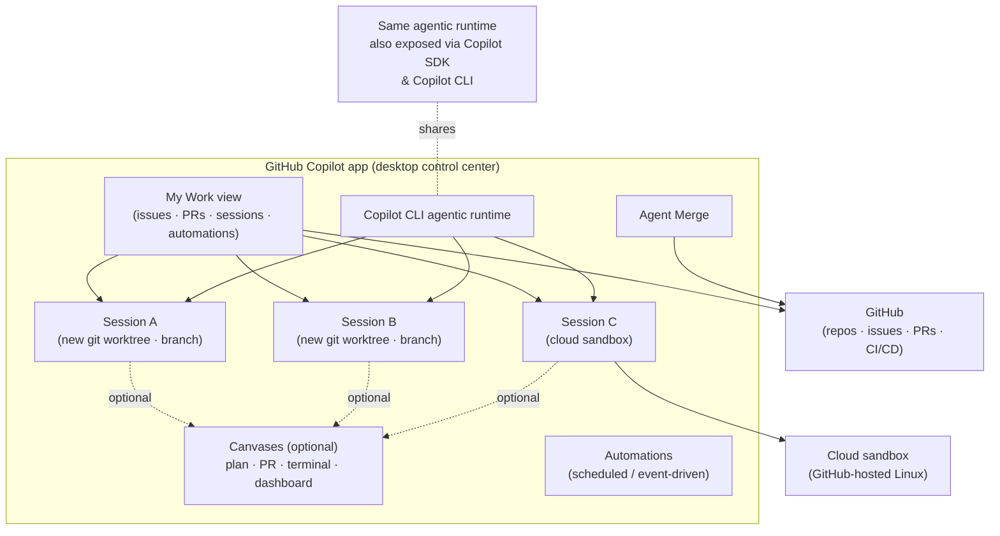

# The GitHub Copilot App — Agent-Native Desktop Development

**Level:** L300 (Advanced)
**Objective:** Understand the GitHub Copilot app — the agent-native desktop experience — its features, advantages, extensibility, and demo-ready scenarios, plus where to learn it.

> **Document status**
>
> - **Last reviewed:** 2026-07-20
> - **Authorship:** Drafted by GitHub Copilot (Claude Opus 4.8), with critic review by GPT-5.6 Sol and Gemini 3.1 Pro, and reviewed by a human maintainer before publication.
> - **Sources:** Based on public documentation — primarily [docs.github.com](https://docs.github.com), [learn.microsoft.com](https://learn.microsoft.com), and official vendor blogs cited inline.
> - **Verify before acting:** The GitHub Copilot app was announced at **Microsoft Build 2026** and is in **technical/public preview**. GitHub and Microsoft update product documentation continuously, and preview products change quickly (UI labels, model/tier names, availability). Re-confirm against the live source pages before relying on this content for production decisions or demos.

> The agent-native desktop experience built on GitHub for finding, running, steering, and landing software work across your repositories.

**Scope:** What the app is, why it matters, its features and advantages, real demo-ready examples (canvases, automations, extensions, and more), a training/learning section with videos and learning paths, and a fully cited References section.

---

## Table of contents

1. [Executive summary](#1-executive-summary)
2. [What is the GitHub Copilot app?](#2-what-is-the-github-copilot-app)
3. [Why it exists: the agent-native problem](#3-why-it-exists-the-agent-native-problem)
4. [Core concepts & architecture](#4-core-concepts--architecture)
5. [Feature deep dive](#5-feature-deep-dive)
6. [Advantages & benefits](#6-advantages--benefits)
7. [Getting started](#7-getting-started)
8. [Customization & extensibility](#8-customization--extensibility)
9. [Security, governance & enterprise controls](#9-security-governance--enterprise-controls)
10. [Demo-ready examples & cool features](#10-demo-ready-examples--cool-features)
11. [Training: videos & learning paths](#11-training-videos--learning-paths)
12. [Comparison with other Copilot surfaces](#12-comparison-with-other-copilot-surfaces)
13. [Limitations & things to watch](#13-limitations--things-to-watch)
14. [FAQ](#14-faq)
15. [References](#15-references)

---

## 1. Executive summary

The **GitHub Copilot app** is a dedicated **desktop application** (macOS, Windows, Linux) purpose-built for **agent-driven ("agent-native") development**. It is a single **control center** where you can direct multiple AI agents working in parallel across your GitHub repositories — investigating bugs, implementing issues, addressing review feedback, and landing pull requests — without constantly switching between terminals, IDEs, browser tabs, and GitHub.com pages. ([github.blog](https://github.blog/news-insights/product-news/github-copilot-app-the-agent-native-desktop-experience/), [github.com/github/app](https://github.com/github/app))

Key ideas at a glance:

- **My Work view** — one place to see active sessions, issues, pull requests, and background automations across connected repositories.
- **Parallel, isolated sessions** — each local session runs in its own **git worktree** (a real isolated copy of your branch); cloud sessions run in isolated, GitHub-hosted sandboxes.
- **Session modes** — *Interactive* (collaborate), *Plan* (agent proposes, you approve), *Autopilot* (fully autonomous).
- **Canvases** — bidirectional, inspectable work surfaces (plan, PR, browser, terminal, dashboard, kanban, spreadsheet) where humans and agents collaborate — the beginning of "agent experience (AX)."
- **Automations** — save recurring prompts/tasks to run on a schedule, on demand, or in response to GitHub events (locally or in the cloud).
- **Agent Merge** — carries a PR through review, CI, and merge conditions with the autonomy level you choose.
- **Extensibility** — MCP servers, agent skills, custom agents, plugins, canvas extensions, and the generally available **GitHub Copilot SDK**.
- **Availability** — works with any Copilot plan (Free, Pro, Pro+, Business, Enterprise), or bring-your-own-key (BYOK). Business/Enterprise require the **Copilot CLI policy** enabled by an admin. ([docs.github.com](https://docs.github.com/en/copilot/concepts/agents/github-copilot-app))

---

## 2. What is the GitHub Copilot app?

The GitHub Copilot app is *"an agent-native desktop experience for finding, running, steering, and landing software work across your GitHub repositories."* It is built **on top of the GitHub Copilot CLI** and integrates natively with GitHub, so your repositories, branches, issues, pull requests, and CI pipelines work out of the box with no extra setup. ([github.com/github/app](https://github.com/github/app), [docs.github.com](https://docs.github.com/en/copilot/concepts/agents/github-copilot-app))

It was unveiled at **Microsoft Build 2026** and announced on the GitHub Blog by GitHub Chief Product Officer **Mario Rodriguez**. At launch it entered **technical preview** for existing Copilot Pro, Pro+, Business, and Enterprise users, later described in docs as available across all plans (with BYOK as an alternative). ([github.blog](https://github.blog/news-insights/product-news/github-copilot-app-the-agent-native-desktop-experience/))

**Supported operating systems:** macOS, Linux, and Windows. Note: the app runs on all three, but **local sandboxing** is fully available only on macOS/Linux (Windows via Insiders builds) — see [§5.8](#58-local--cloud-sandboxes) and [§13](#13-limitations--things-to-watch). ([docs.github.com](https://docs.github.com/en/copilot/concepts/agents/github-copilot-app), [docs.github.com](https://docs.github.com/en/copilot/concepts/about-cloud-and-local-sandboxes))

The public home for the app is the **`github/app` repository**, which hosts downloadable releases, the changelog, issues/feature requests, and discussions. ([github.com/github/app](https://github.com/github/app))

### In one sentence

> If VS Code + Copilot is about *writing* code with an assistant, the Copilot app is about *directing and verifying* a fleet of agents that do the work — from **idea → issue → plan → pull request → merge** — from a single desktop control center.

---

## 3. Why it exists: the agent-native problem

GitHub's thesis is that agents are becoming a durable part of how software gets built, but most developer tools were **not designed for directing multiple agents in parallel**. The result is fragmentation: ([github.blog](https://github.blog/news-insights/product-news/github-copilot-app-the-agent-native-desktop-experience/))

- Context scatters across windows.
- You lose track of what's running.
- Code lands in pull requests **without a clear trail** of what the agent tried, what it validated, or where human judgment is needed.
- Too much time is spent reviewing agent-generated code and context-switching.

The scale backdrop GitHub cites: commits on GitHub nearly **doubled year over year to more than 1.4 billion per month**, plus **over 2 billion GitHub Actions minutes per week** — with repository creation, PR activity, and API usage all accelerating. Existing tools weren't designed for this volume or for directing many agents at once. ([github.blog](https://github.blog/news-insights/product-news/github-copilot-app-the-agent-native-desktop-experience/), [devops.com](https://devops.com/github-copilot-gets-its-own-app-and-agents-are-the-reason-why/))

Industry framing (DevOps.com, quoting The Futurum Group's Mitch Ashley): a dedicated application for directing and reviewing **parallel agents** reflects vendors competing to own the **"agent orchestration and coordination layer."** As agents move to running workstreams and submitting PRs, the developer's surface shifts to **directing and overseeing** their output — and capabilities that make agent intent *visible and reviewable* (isolated worktrees, surfaces for inspecting active work) become the selection criteria. **"Agent autonomy stays bounded by what teams can verify."** ([devops.com](https://devops.com/github-copilot-gets-its-own-app-and-agents-are-the-reason-why/))

---

## 4. Core concepts & architecture

*Diagram notes: the app is **built on** the Copilot CLI agentic runtime; the **Copilot SDK exposes that same runtime** to other tools (it is not a component the app depends on). Canvases and sandboxes are **optional** per session — not every session uses them.*

### Sessions & worktrees
When you start a session you choose **where it runs**: a **new working tree**, your **local repository**, or a **cloud sandbox** (public preview). ([docs.github.com](https://docs.github.com/en/copilot/how-tos/github-copilot-app/agent-sessions))

Each **new-working-tree** session runs in its **own isolated git worktree** — a real, isolated copy of your branch — so parallel agent sessions don't step on each other. The app manages every worktree for you: no manual setup, no cleanup, no branch juggling. ⚠️ **Isolation caveat:** only *new-working-tree* (and cloud sandbox) sessions are isolated. A **local-repository** session operates directly on your existing working tree and can touch uncommitted files, so use new-working-tree or cloud sessions for the parallel-isolation workflows described below. Sessions can start from a **prompt** or from an **issue**, and Copilot pulls context from existing issues, PRs, and connected repos. ([github.blog](https://github.blog/news-insights/product-news/github-copilot-app-the-agent-native-desktop-experience/), [github.com/github/app](https://github.com/github/app), [docs.github.com](https://docs.github.com/en/copilot/how-tos/github-copilot-app/agent-sessions))

> **Merge conflicts across parallel sessions:** Because each isolated session works on its own branch, changes ultimately reconcile at the **pull request** stage. GitHub's public materials don't document a dedicated in-app conflict-resolution surface; **Agent Merge** focuses on driving CI to green, addressing review feedback, and satisfying merge conditions. Treat cross-session conflict handling as an area to verify in the live product rather than an assured automated feature. *(Gap noted during review; not confirmable from primary sources at compile time.)*

### Session modes (autonomy dial)
| Mode | Who's driving | Best for |
|---|---|---|
| **Interactive** | You + agent collaborate; agent waits for input | Tight steering, exploratory work |
| **Plan** | Agent proposes a plan; you approve before execution | Validating scope/approach before spending effort |
| **Autopilot** | Agent works fully autonomously (writes code, runs tests, iterates) | Well-defined, lower-ambiguity tasks |

You can change modes at any time. ([docs.github.com](https://docs.github.com/en/copilot/how-tos/github-copilot-app/agent-sessions))

### Model selection & reasoning effort
Pick a **model** and **reasoning effort** per session; choose **Auto** to let the app select the optimal model based on task complexity. BYOK models you configure also appear in the picker. Higher reasoning effort gives the agent more time to think through complex problems but may take longer. ([docs.github.com](https://docs.github.com/en/copilot/how-tos/github-copilot-app/agent-sessions))

### Runtime foundation
The app is built on **GitHub Copilot CLI** and exposes the **same agentic runtime** that the **GitHub Copilot SDK** provides — "one runtime, many surfaces" (terminal, cloud, the app, and your own tools). ([docs.github.com](https://docs.github.com/en/copilot/concepts/agents/github-copilot-app), [github.blog](https://github.blog/news-insights/product-news/github-copilot-app-the-agent-native-desktop-experience/))

---

## 5. Feature deep dive

### 5.1 My Work
A single view that consolidates **active agent sessions, issues, pull requests, and background automations** across connected repositories, so you can decide what needs attention next. Organized into sections (default **All**, **Active**, **Review requests**, **Done**), editable and filterable (e.g., `label:bug`). Check CI status and leave reviews from here. ([github.com/github/app](https://github.com/github/app), [docs.github.com](https://docs.github.com/en/copilot/how-tos/github-copilot-app/managing-issues-and-pull-requests))

### 5.2 Parallel, isolated agent sessions
Run multiple sessions simultaneously, each on its own branch/worktree, so you make progress on several tasks without waiting for one to finish and without collisions. Sessions appear in the sidebar grouped by repository. ([docs.github.com](https://docs.github.com/en/copilot/concepts/agents/github-copilot-app))

### 5.3 Quick chats
A conversation mode for brainstorming or asking questions **without** creating a branch or worktree — ideal for scoping work before committing to a full session. History is saved by conversation name. ([docs.github.com](https://docs.github.com/en/copilot/how-tos/github-copilot-app/agent-sessions))

### 5.4 Canvases (Agent Experience / AX)
**Bidirectional work surfaces** for humans and agents. Instead of burying plans, terminals, browser previews, diffs, and workflow state in a long chat thread, a canvas gives you a place to **see** what the agent is doing, **edit or redirect** the work, and **verify** progress in context. Agents update the canvas as they work; you can edit, reorder, approve, or redirect on the same surface. Canvases open in the app's right-side panel. ([github.blog](https://github.blog/news-insights/product-news/github-copilot-app-the-agent-native-desktop-experience/), [docs.github.com](https://docs.github.com/en/copilot/how-tos/github-copilot-app/working-with-canvas-extensions))

Canvas types are **generated per your prompt** rather than a fixed catalog of first-party templates. Documented **examples** include: a **plan**, **pull request**, **browser session**, **terminal**, **deployment**, **dashboard**, **workflow state**, **kanban board**, **issue triage board**, **markdown doc**, or **spreadsheet**. Create one with the `/create-canvas` skill and iterate with the agent; some examples (e.g., anything pulling calendar or external data) require custom capabilities or MCP integrations. (More in [§10](#10-demo-ready-examples--cool-features).) ([docs.github.com](https://docs.github.com/en/copilot/how-tos/github-copilot-app/working-with-canvas-extensions))

### 5.5 Automations
Save recurring agent tasks and run them **on a schedule** (hourly/daily/weekly), **on demand**, or **when an issue is created**. Two flavors:
- **Local automations** run from your local environment.
- **Cloud automations** run in a cloud environment — even when your computer is off — and can respond to GitHub events, open issues, and leave comments. For **unattended** runs, authorization is governed primarily by the **preselected Tools** you grant (push changes, update labels, create a PR, etc.) — choose the least privilege the task needs. (The "asks permission before each write action" default described at launch applies to *interactive* cloud-agent use; scheduled automation runs rely on the preauthorized tool set rather than per-write prompts.) ([docs.github.com](https://docs.github.com/en/copilot/how-tos/github-copilot-app/using-automations), [github.blog](https://github.blog/news-insights/product-news/github-copilot-app-the-agent-native-desktop-experience/))

> **Automation caveats to demo responsibly:** runs consume AI usage/credits and (for cloud) GitHub Actions minutes; automations are private to their creator; public-repository support and untrusted-event triggers are restricted by default. Verify these in the live product before an unattended demo. ([docs.github.com](https://docs.github.com/en/copilot/concepts/agents/cloud-agent/about-automations))

### 5.6 Agent Merge
Helps carry a pull request through **review, checks, and merge conditions**. It monitors CI, tracks required reviewers, addresses failing checks, and waits for all conditions to be satisfied. You choose how far Copilot should go: drive CI back to green, address feedback, or merge when your conditions are met — you decide what automation is enabled and what ships. ([github.blog](https://github.blog/news-insights/product-news/github-copilot-app-the-agent-native-desktop-experience/), [github.com/github/app](https://github.com/github/app))

### 5.7 Issue & pull request lifecycle
Browse/find issues, start sessions from them (with issue context preloaded), create and close PRs, review PRs (Files changed diff, inline comments), view CI results, respond to review comments, and **submit a review** — all inside the app. One-click **Fix** buttons let you ask an agent to resolve a review comment or failing CI check. You can also open a PR in your browser or another IDE from the app. ([docs.github.com](https://docs.github.com/en/copilot/how-tos/github-copilot-app/managing-issues-and-pull-requests))

### 5.8 Local & cloud sandboxes
Sandboxes give agents a **bounded place to act** — run code, inspect results, test changes, and iterate with reduced risk to production. Per GitHub's docs, sandboxes for Copilot **currently apply to Copilot CLI sessions**, and you can also use **cloud sandboxes for sessions in the Copilot app**:
- **Cloud sandbox** (available as an app session location) — fully isolated, ephemeral **Linux** environment hosted by GitHub, built on **Azure Container Apps Sandboxes**, with GitHub providing identity, policy, and billing. Start from the CLI with `copilot --cloud`, or choose it as a session location in the app. Pick up sessions on **any device**; sessions have Active/Stopped/Deleted lifecycle states with snapshotting.
- **Local sandbox** (currently a **Copilot CLI** capability, not an app session location) — isolated environment on your machine with restricted filesystem, network, and system access; policies can be centrally configured/enforced via MDM (e.g., Microsoft Intune). Enable in the CLI with `/sandbox enable`. Cross-platform: macOS/Linux; Windows on Insiders builds.

⚠️ Worktree isolation and sandbox isolation are **different**: a worktree prevents file/branch collisions between sessions but is **not a security boundary**; sandboxes add the execution isolation and policy controls. ([github.blog](https://github.blog/news-insights/product-news/github-copilot-app-the-agent-native-desktop-experience/), [docs.github.com](https://docs.github.com/en/copilot/concepts/about-cloud-and-local-sandboxes))

### 5.9 Code review (in-app and related platform capabilities)
Three distinct things are easy to conflate — keep them separate for demos:

**a) PR review inside the app** — review a PR's diff (Files changed), leave inline comments, view CI, and submit a review from the app; one-click **Fix** asks an agent to resolve a comment or failing check. ([docs.github.com](https://docs.github.com/en/copilot/how-tos/github-copilot-app/managing-issues-and-pull-requests))

**b) In-session `/security-review`** (public preview) — run it in an active session on in-progress changes to get prioritized, high-confidence vulnerability findings with severity/confidence and suggested fixes you apply and verify in the same session (complements code scanning, Dependabot, and secret scanning). ([docs.github.com](https://docs.github.com/en/copilot/how-tos/github-copilot-app/agent-sessions))

**c) The built-in rubber duck agent** — a constructive critic that reviews your plan/implementation/tests on a *different* model than the driving session (available when the main agent uses a Claude or GPT model). Invoke it in-session with a slash command. ⚠️ **Command spelling varies across sources** — GitHub's launch blog wrote `/rubberduck` while app docs reference `/rubber-duck`; confirm the exact command in your build before demoing. ([docs.github.com](https://docs.github.com/en/copilot/how-tos/github-copilot-app/agent-sessions), [github.blog](https://github.blog/news-insights/product-news/github-copilot-app-the-agent-native-desktop-experience/))

**Related platform-wide code review (not exclusively an app feature):** the broader **Copilot code review** service adds a **medium-tier review** (higher-reasoning model, admins set repos to "low"/"medium"), extensibility via custom skills/MCP/Actions, and **native Azure DevOps** support. These are GitHub platform announcements — treat them as adjacent to, not built into, the desktop app unless verified in the app UI. ([github.blog](https://github.blog/news-insights/product-news/github-copilot-app-the-agent-native-desktop-experience/), [docs.github.com](https://docs.github.com/en/copilot/concepts/agents/code-review))

### 5.10 Memory & session history
**`/chronicle`** is documented for app sessions and gives Copilot continuity by letting you query context from previous sessions — including work started in the **app, CLI, VS Code, or on GitHub**. `/chronicle cost tips` surfaces expensive usage patterns to improve efficiency. GitHub has also referenced broader **"Memory++"** continuity across devices and over time; treat "Memory++" as a platform capability whose exact app-surface behavior (storage, sync, retention, opt-out) should be verified in-product. ([github.blog](https://github.blog/news-insights/product-news/github-copilot-app-the-agent-native-desktop-experience/), [docs.github.com](https://docs.github.com/en/copilot/concepts/agents/github-copilot-app))

### 5.11 Related GitHub Copilot ecosystem capabilities
> The items below were announced alongside the app and share its runtime, but several occur on **other surfaces** (github.com, GitHub Mobile, the CLI, or the GitHub workflow) rather than strictly inside the desktop app. They're included for a complete picture; confirm the exact surface for each in your demo.

**Remote control & mobile** — start work in VS Code or the CLI and **finish from a phone**. Remote control for Copilot sessions is generally available on **github.com** and **GitHub Mobile**. ([devops.com](https://devops.com/github-copilot-gets-its-own-app-and-agents-are-the-reason-why/))

### 5.12 Deep links
Launch the app from the terminal, tickets, and internal tools with deep links so people jump directly into the right **repository, pull request, automation, or session** (e.g., `ghapp://mywork`, `ghapp://automations`). ([docs.github.com](https://docs.github.com/en/copilot/how-tos/github-copilot-app/open-with-deep-links), [docs.github.com](https://docs.github.com/en/copilot/how-tos/github-copilot-app/getting-started))

### 5.13 GitHub Copilot SDK
Now **generally available** in **Node.js/TypeScript, Python, Go, .NET, Rust, and Java**, exposing the **same agentic runtime** that powers the app. Build internal code-analysis tools, custom release-notes generators, or embedded support agents on the same foundation. ([github.blog](https://github.blog/news-insights/product-news/github-copilot-app-the-agent-native-desktop-experience/))

### 5.14 Redesigned Copilot CLI
The CLI (the app's foundation) gained a **redesigned TUI** (in `/experimental` mode) with **tabbed access to PRs, issues, and gists**; **voice input** using on-device speech-to-text (audio never leaves your machine); and **`/every`** to schedule recurring prompts and background tasks. ([github.blog](https://github.blog/news-insights/product-news/github-copilot-app-the-agent-native-desktop-experience/))

### 5.15 Partner / third-party agent apps
Partner-built agent apps integrate with Copilot to automate tasks, generate code, analyze context, and execute actions — usable without leaving GitHub, and assignable to issues. Launch partners include **LaunchDarkly, Bright, Amplitude, Sonar, Endor Labs, Octopus Deploy, Packfiles, PagerDuty, and Miro**. A waitlist lets companies bring their own agent apps to GitHub. ([github.blog](https://github.blog/news-insights/product-news/github-copilot-app-the-agent-native-desktop-experience/))

---

## 6. Advantages & benefits

From the official benefits list plus the launch materials: ([docs.github.com](https://docs.github.com/en/copilot/concepts/agents/github-copilot-app), [github.com/github/app](https://github.com/github/app))

| Advantage | What it means in practice |
|---|---|
| **Work in parallel** | Multiple agent sessions at once, each on its own branch — progress on several tasks without waiting. |
| **Stay in one place** | Triage issues, direct agents, review changes, and land PRs without switching terminal/IDE/browser. |
| **Start fast** | Native GitHub connection — repos, branches, issues, PRs work out of the box, no extra setup. |
| **Stay in control** | Dial autonomy from fully collaborative to fully autonomous; tune model + reasoning effort per session. |
| **Collaborate on a shared surface** | Canvases give humans and agents a common, inspectable workspace. |
| **Isolation & safety** | Worktrees + sandboxes keep agent work bounded and reviewable; combined with scoped tools and review gates they reduce the risk of unintended changes. |
| **Portability** | Cloud sessions/sandboxes let you resume on any device, including mobile. |
| **Verifiable trail** | Plans, canvases, diffs, CI, and Agent Merge make what the agent did *visible and reviewable*. |
| **Extensible** | MCP, skills, custom agents, plugins, canvas extensions, and the SDK adapt it to your stack. |
| **Cost/efficiency controls** | Auto model selection, `/chronicle cost tips`, quick chats, and mode selection optimize AI spend. |

### Efficiency best practices (official)
- Match **model capability** to task complexity (light models for simple changes, high-capability for complex debugging/design).
- Choose the right **session mode** for the stage of work (Plan to validate, Interactive to steer, Autopilot when well-defined).
- Use **quick chats** to scope before opening a full session.
- **Start a new session** when you switch tasks to keep context focused.
- Use **usage insights** regularly (`/chronicle cost tips`). ([docs.github.com](https://docs.github.com/en/copilot/concepts/agents/github-copilot-app))

---

## 7. Getting started

### Prerequisites
- **Git** installed. ([docs.github.com](https://docs.github.com/en/copilot/how-tos/github-copilot-app/getting-started))
- A **GitHub account**.
- A **Copilot plan** — any plan works, including **Copilot Free** and **GitHub Copilot for students**. No plan? Use **bring-your-own-key (BYOK)** with your own model provider.
- **Copilot Business/Enterprise**: an admin must enable the **Copilot CLI** policy. ([github.com/github/app](https://github.com/github/app), [docs.github.com](https://docs.github.com/en/copilot/concepts/agents/github-copilot-app))

### Install & first run
1. Visit the **[download page](https://github.com/features/ai/github-app)** (or browse all builds on the [`github/app` Releases page](https://github.com/github/app/releases)) and download for your platform.
2. Open the app → **Sign in to GitHub** (choose **Use GitHub Enterprise** for GHES and enter your server address).
3. If you have no Copilot plan, sign up or continue with your own model provider (enter credentials → **Save and continue**).
4. Select one or more repositories (or add a local repo / skip and add later).
5. Choose a theme and finish onboarding. ([docs.github.com](https://docs.github.com/en/copilot/how-tos/github-copilot-app/getting-started))

### Connect a repository
Sidebar **+** next to "Sessions" → **Add project from**: **Local folder or repository**, **GitHub repository**, or **Repository URL**. ([docs.github.com](https://docs.github.com/en/copilot/how-tos/github-copilot-app/getting-started))

### The sidebar (orientation)
- **My Work** — issues & PRs, CI status, reviews.
- **Automations** — saved scheduled/on-demand tasks.
- **Search** — search across repositories.
- **Sessions** — active sessions grouped by repo, plus **Quick chats**. ([docs.github.com](https://docs.github.com/en/copilot/how-tos/github-copilot-app/getting-started))

### Your first session (typical workflow)
1. Browse issues and pick one up, or start from a blank workspace.
2. Choose a **session mode** and **model**.
3. Describe the task; the agent creates a branch, writes code, runs tests.
4. Review changes, give feedback, iterate.
5. Create a PR, review, check CI, merge — all in-app. Run several of these in parallel. ([docs.github.com](https://docs.github.com/en/copilot/concepts/agents/github-copilot-app))

**Prompt tips inside a session:** reference issues with `#`, add files with `@`, and use `/` for commands. ([docs.github.com](https://docs.github.com/en/copilot/how-tos/github-copilot-app/agent-sessions))

---

## 8. Customization & extensibility

All of these can be configured in **app settings** and are shared with the CLI where applicable: ([docs.github.com](https://docs.github.com/en/copilot/how-tos/github-copilot-app/customize-github-copilot-app))

- **Global & repository instructions** — set global instructions under **General**; repo-specific instructions under the repo in the "Projects" section.
- **Agent skills** — folders of instructions, scripts, and resources Copilot loads when relevant. Skills configured for your repos or the CLI are automatically available; manage more under **Skills**.
- **MCP servers** — connect the agent to external tools/data. A catalog of popular servers is built in; add custom servers under **MCP Servers**.
- **Custom agents** — specialized versions of the cloud agent; invoke with `/agent` in a session.
- **Plugins** — installable packages that bundle skills, hooks, and custom agents; browse/install under **Plugins**.
- **Canvas extensions** — build shared, agent-driven UIs with `/create-canvas` (see [§10](#10-demo-ready-examples--cool-features)).
- **BYOK models** — connect an external provider with your own API key and use those models in sessions.

### How a canvas extension is structured
Each canvas extension lives in its own directory under **`.github/extensions`** (project scope, team-shared/committed) or **`~/.copilot/extensions`** (user scope, personal). It commonly includes: ([docs.github.com](https://docs.github.com/en/copilot/how-tos/github-copilot-app/working-with-canvas-extensions))
- `package.json` — extension metadata and dependencies.
- An entry file (e.g., `extension.mjs`) — defines canvas behavior and **agent-callable capabilities**.
- Optional JSON artifacts (e.g., an `artifacts/` directory) — persisted canvas data/state.

Both people (via UI controls) and agents (via capabilities like `get_board`, `add_card`, `move_card`) interact with the same shared state.

---

## 9. Security, governance & enterprise controls

- **Isolation by design** — local worktrees and cloud/local sandboxes bound what agents can touch and make their work reviewable. ⚠️ Worktrees prevent file/branch collisions but are **not a security boundary**; use **sandboxes**, **scoped tools/credentials**, and **review gates** for defense in depth. These controls *reduce* risk rather than guarantee production is never affected — MCP tools, automations, deployment canvases, and Agent Merge can still act on external systems if you grant them permission. ([github.blog](https://github.blog/news-insights/product-news/github-copilot-app-the-agent-native-desktop-experience/), [docs.github.com](https://docs.github.com/en/copilot/concepts/about-cloud-and-local-sandboxes))
- **Policy enforcement** — local sandbox policies are centrally configurable/enforceable via **Microsoft Intune** and other MDM platforms. Cloud sandbox policies share configuration with **Copilot cloud agent policies** (unified governance). ([docs.github.com](https://docs.github.com/en/copilot/concepts/about-cloud-and-local-sandboxes))
- **Scoped tools** — cloud automations expose a **Tools** dropdown; select only what a task needs (push, label, create PR). By default the cloud agent asks permission before each write action. ([docs.github.com](https://docs.github.com/en/copilot/how-tos/github-copilot-app/using-automations))
- **Admin gating** — Business/Enterprise require the **Copilot CLI** policy; cloud automations require the **Copilot cloud agent** policy and organization allow-listing. Automation triggers can be restricted to users with write access. ([docs.github.com](https://docs.github.com/en/copilot/how-tos/github-copilot-app/using-automations))
- **Public-code matching caveat** — the app may generate code matching public code even when the "Suggestions matching public code" policy is set to "Block." Review the public-code policy. ([docs.github.com](https://docs.github.com/en/copilot/concepts/agents/github-copilot-app))
- **Telemetry & trust** — usage data (e.g., acceptances/rejections), conversation data, and feedback may be collected; see the **[GitHub Copilot Trust Center](https://copilot.github.trust.page)**. Debug logs (`/collect-debug-logs`) may contain sensitive info. ([github.com/github/app](https://github.com/github/app))

---

## 10. Demo-ready examples & cool features

Below are concrete, demo-friendly scenarios. Each maps to a documented capability so you can reproduce it live.

> **Before you demo (safety & prerequisites):** Use a **disposable private repository** with a couple of seed issues/PRs and **protected test branches**. Confirm the required **plan, policies (Copilot CLI / cloud agent), repository visibility, and permissions** are in place, and that any preview feature (canvases, cloud sandboxes, `/security-review`) is enabled in your build. For anything that writes (automations, **Agent Merge**), start in **Plan/Interactive** mode with **least-privilege tools**, and keep a **prerecorded fallback** in case a live preview feature misbehaves. Live-merging with Agent Merge should target a throwaway branch, not a real default branch.

### 10.1 "Fleet of agents" parallel demo ⭐
Open **three sessions at once**: one investigating a production bug, one implementing a backlog issue, one working through PR review feedback — each in its **own isolated worktree**. Switch between them in the sidebar. This is the app's signature story: *directing* rather than *doing*. ([github.blog](https://github.blog/news-insights/product-news/github-copilot-app-the-agent-native-desktop-experience/))

### 10.2 Canvas: agentic kanban board ⭐
`/create-canvas` → *"Create an agentic kanban canvas with actions to create, assign, and move cards."* People move cards via UI; the agent calls `get_board` / `add_card` / `move_card`. Great for showing **human + agent coordination** on one shared board. ([docs.github.com](https://docs.github.com/en/copilot/how-tos/github-copilot-app/working-with-canvas-extensions))

### 10.3 Canvas: issue triage board
Summarize top issues, recurring themes, and user pain points for a repository on a live board — a compelling maintainer demo. ([docs.github.com](https://docs.github.com/en/copilot/how-tos/github-copilot-app/working-with-canvas-extensions))

### 10.4 Canvas: "plan my day" markdown canvas
*"Create a markdown canvas that combines my meetings with prioritized issues and pull requests, then lets me launch and track agent sessions from that canvas."* A persistent, editable command surface. ⚠️ The **meetings/calendar** part requires a **calendar connector (MCP server/API) with authentication and consent** — it is not automatic. For a dependency-free demo, swap meetings for repository-local data (issues/PRs/CI). ([docs.github.com](https://docs.github.com/en/copilot/how-tos/github-copilot-app/working-with-canvas-extensions))

### 10.5 Canvas: document / spreadsheet / dashboard / browser / terminal
Open, edit, and collaborate on documents, spreadsheets, and slide decks; or use terminal/browser/deployment/dashboard canvases to watch and steer live work in context. ([docs.github.com](https://docs.github.com/en/copilot/how-tos/github-copilot-app/working-with-canvas-extensions), [github.blog](https://github.blog/news-insights/product-news/github-copilot-app-the-agent-native-desktop-experience/))

### 10.6 Automation: daily issue triage
New automation → trigger **When an issue is created** (optional search filter) → prompt *"Label, summarize, and route this issue."* Run in the cloud so it works when your machine is off. ([docs.github.com](https://docs.github.com/en/copilot/how-tos/github-copilot-app/using-automations))

### 10.7 Automation: morning PR review sweep
Scheduled **daily** cloud automation that checks open PRs for review status and comments — demonstrate event/schedule triggers plus scoped **Tools**. ([docs.github.com](https://docs.github.com/en/copilot/how-tos/github-copilot-app/using-automations))

### 10.8 Agent Merge: green-to-merge
Kick off a PR, then let Agent Merge **drive CI back to green, address review feedback, and merge when conditions are met** — with you choosing how far it goes. ([github.blog](https://github.blog/news-insights/product-news/github-copilot-app-the-agent-native-desktop-experience/))

### 10.9 `/security-review` in-session
On an in-progress change, run `/security-review` for prioritized, high-confidence vulnerability findings with suggested fixes you apply and verify in the same session. ([docs.github.com](https://docs.github.com/en/copilot/how-tos/github-copilot-app/agent-sessions))

### 10.10 Rubber duck critique
Let the built-in **rubber duck agent** (running on a *different* model) critique your plan/implementation/tests, then have the main agent apply the feedback — a strong "multi-model quality" demo. ([docs.github.com](https://docs.github.com/en/copilot/how-tos/github-copilot-app/agent-sessions))

### 10.11 Cloud sandbox hand-off across devices
Start `copilot --cloud`, stop the session (snapshot), then **resume on another device** — showcases portability without copying files or reinstalling deps. ([docs.github.com](https://docs.github.com/en/copilot/concepts/about-cloud-and-local-sandboxes))

### 10.12 CLI voice + `/every`
In the redesigned CLI, use **voice input** (on-device STT) and **`/every`** to schedule recurring prompts — a fun, tactile demo that ties the CLI to the app's shared runtime. ([github.blog](https://github.blog/news-insights/product-news/github-copilot-app-the-agent-native-desktop-experience/))

### 10.13 Build your own tool with the SDK
Scaffold a tiny agent (e.g., a custom release-notes generator) with the **Copilot SDK** in your language of choice to show "one runtime, many surfaces." ([github.blog](https://github.blog/news-insights/product-news/github-copilot-app-the-agent-native-desktop-experience/))

### 10.14 Third-party agent app
Assign an issue to a **partner agent** (e.g., Sonar, PagerDuty, LaunchDarkly) to demonstrate the open agent ecosystem inside GitHub. ([github.blog](https://github.blog/news-insights/product-news/github-copilot-app-the-agent-native-desktop-experience/))

> **Demo tip:** The most memorable narrative is **idea → issue → plan → PR → merge, ×3 in parallel**, with a **canvas** open to make one agent's work visible and **Agent Merge** landing the change. It hits parallelism, AX, and verifiability in one flow.

---

## 11. Training: videos & learning paths

> The GitHub Copilot app is new (Build 2026), so dedicated app-only courses are still emerging. The resources below are the **official** GitHub and Microsoft Learn materials that cover the app and the broader Copilot agentic workflow. The **most directly relevant** module is called out first.

### 11.1 Most relevant module (covers the Copilot app directly)
- **GitHub Copilot Across Environments: IDE, Chat, GitHub.com, Command Line Techniques, and the GitHub Copilot App** — Microsoft Learn module (Intermediate, 8 units). One of its 8 units is dedicated to the Copilot app, with the objective *"Understand how to interact with the GitHub Copilot App and its use cases."* Note: this is a **single, relatively short unit** within a broader module, not a full app-only course — pair it with the GitHub Docs how-tos below for depth.
  → https://learn.microsoft.com/en-us/training/modules/github-copilot-across-environments/

### 11.2 Official GitHub product docs (self-paced, authoritative)
- **About the GitHub Copilot app** (concept) — https://docs.github.com/en/copilot/concepts/agents/github-copilot-app
- **Getting started with the GitHub Copilot app** — https://docs.github.com/en/copilot/how-tos/github-copilot-app/getting-started
- **Working with agent sessions** — https://docs.github.com/en/copilot/how-tos/github-copilot-app/agent-sessions
- **Working with canvas extensions** — https://docs.github.com/en/copilot/how-tos/github-copilot-app/working-with-canvas-extensions
- **Using automations** — https://docs.github.com/en/copilot/how-tos/github-copilot-app/using-automations
- **Managing issues and pull requests** — https://docs.github.com/en/copilot/how-tos/github-copilot-app/managing-issues-and-pull-requests
- **Customizing the app** — https://docs.github.com/en/copilot/how-tos/github-copilot-app/customize-github-copilot-app
- **Cloud & local sandboxes** — https://docs.github.com/en/copilot/concepts/about-cloud-and-local-sandboxes

### 11.3 Microsoft Learn — learning paths (mostly text + interactive units)
> These paths are primarily **text-based interactive** modules with knowledge checks; some include embedded video. They cover Copilot broadly (the app is one part).
- **GitHub Copilot Fundamentals — Part 1 of 2** — https://learn.microsoft.com/en-us/training/paths/copilot/
- **GitHub Copilot Fundamentals — Part 2 of 2** — https://learn.microsoft.com/en-us/training/paths/gh-copilot-2/
- **Get Started with AI-Assisted Development with GitHub Copilot** — https://learn.microsoft.com/en-us/training/paths/accelerate-app-development-using-github-copilot/
- **Get Started with GitHub Copilot (module)** — https://learn.microsoft.com/en-us/training/modules/get-started-github-copilot/
- **Training for GitHub (hub)** — https://learn.microsoft.com/en-us/training/github/
- **Browse all GitHub Copilot training** — https://learn.microsoft.com/en-us/training/browse/?products=github-copilot

### 11.4 Video series
> Note: the GitHub Copilot Series and GitHub's YouTube channel are **series/channels** to browse (not a single app-specific video). Search within them for the newest Copilot app / agentic-development sessions.
- **GitHub Copilot Series (Microsoft Learn Shows)** — real-world Copilot across languages/environments — https://learn.microsoft.com/en-us/shows/github-copilot-series/
- **GitHub's YouTube channel** — launch talks, demos, Universe/Build sessions — https://www.youtube.com/@GitHub
- **Microsoft Build 2026 sessions** (search for the Copilot app / agentic development sessions) — https://build.microsoft.com/

### 11.5 Practice, community & release notes
- **GitHub Skills** (hands-on, interactive courses) — https://skills.github.com/
- **`github/app` Discussions** (ask questions, see workflows) — https://github.com/github/app/discussions
- **`github/app` changelog / release notes** — https://github.com/github/app/blob/main/changelog.md
- **GitHub Changelog** (ongoing feature announcements) — https://github.blog/changelog/

> ℹ️ **Assumption/uncertainty:** Deep-linking to a *specific* app-only video or a standalone "GitHub Copilot app" learning path was not confirmable from primary sources at compile time. The items above are verified official hubs; check them for newly published, app-specific modules and recordings.

---

## 12. Comparison with other Copilot surfaces

| Dimension | Copilot in IDE (VS Code/JetBrains) | Copilot CLI | **Copilot app (desktop)** | Copilot on github.com / Mobile |
|---|---|---|---|---|
| Primary job | Write code with inline/chat assist | Terminal-native agent & scripting | **Direct/verify parallel agents end-to-end** | Review & remote-control on the go |
| Parallelism | Limited | Session-based | **Many isolated worktree/cloud sessions** | View/steer running sessions |
| Work surface | Editor + chat | TUI | **Canvases + My Work + diffs** | Web/mobile UI |
| PR lifecycle | Partial | Partial | **Full: review → CI → Agent Merge** | Review + remote control |
| Autonomy control | Chat/agent | Modes | **Interactive / Plan / Autopilot** | Depends on session |
| Foundation | Editor extension | CLI runtime | **Built on CLI runtime + SDK** | GitHub platform |

*(Comparison synthesized from official descriptions; the app is explicitly built on the CLI runtime and shares the SDK runtime.)* ([docs.github.com](https://docs.github.com/en/copilot/concepts/agents/github-copilot-app), [github.blog](https://github.blog/news-insights/product-news/github-copilot-app-the-agent-native-desktop-experience/))

---

## 13. Limitations & things to watch

- **Preview status** — technical/public preview; features (canvases, cloud sandboxes, `/security-review`) are subject to change. ([github.blog](https://github.blog/news-insights/product-news/github-copilot-app-the-agent-native-desktop-experience/), [docs.github.com](https://docs.github.com/en/copilot/concepts/about-cloud-and-local-sandboxes))
- **"Isolated sessions" ≠ every session** — only **new-working-tree** and **cloud sandbox** sessions are isolated; **local-repository** sessions act on your existing working tree. ([docs.github.com](https://docs.github.com/en/copilot/how-tos/github-copilot-app/agent-sessions))
- **Local sandbox is CLI-scoped today** — the app exposes **cloud** sandboxes as a session location; **local** sandboxing is currently a Copilot CLI capability. ([docs.github.com](https://docs.github.com/en/copilot/concepts/about-cloud-and-local-sandboxes))
- **Automation constraints** — runs consume AI usage/credits and (cloud) Actions minutes; automations are private to their creator; public repos and untrusted-event triggers are restricted by default. ([docs.github.com](https://docs.github.com/en/copilot/concepts/agents/cloud-agent/about-automations))
- **Feature availability varies** — the base app works on any plan, but **cloud automations, cloud sandboxes, medium-tier code review, and Agent Merge** may require specific paid plans, repository visibility, admin policies, permissions, or metered billing. Verify per feature. ([docs.github.com](https://docs.github.com/en/copilot/how-tos/github-copilot-app/using-automations))
- **Command-name drift** — e.g., `/rubberduck` (blog) vs `/rubber-duck` (docs); confirm exact slash commands in your build.
- **Local sandbox platform gaps** — full sandboxing is macOS/Linux; Windows support is on **Insiders builds**. ([docs.github.com](https://docs.github.com/en/copilot/concepts/about-cloud-and-local-sandboxes))
- **Rubber duck model dependency** — available only when the main agent runs a **Claude or GPT** model. ([docs.github.com](https://docs.github.com/en/copilot/how-tos/github-copilot-app/agent-sessions))
- **Admin prerequisites** — Business/Enterprise need the **Copilot CLI** policy; cloud automations need **cloud agent** enablement and org allow-listing. ([docs.github.com](https://docs.github.com/en/copilot/how-tos/github-copilot-app/using-automations))
- **Public-code matches possible** even with the block policy on. ([docs.github.com](https://docs.github.com/en/copilot/concepts/agents/github-copilot-app))
- **Verify autonomy** — autopilot/Agent Merge should be scoped and trust-gated; "agent autonomy stays bounded by what teams can verify." ([devops.com](https://devops.com/github-copilot-gets-its-own-app-and-agents-are-the-reason-why/))

---

## 14. FAQ

**Do I need a paid plan?** No — any Copilot plan works (including Free and Student), or use **BYOK** with your own model provider. Business/Enterprise need the Copilot CLI policy enabled. ([github.com/github/app](https://github.com/github/app), [docs.github.com](https://docs.github.com/en/copilot/concepts/agents/github-copilot-app))

**Which OSes?** macOS, Windows, Linux. ([docs.github.com](https://docs.github.com/en/copilot/concepts/agents/github-copilot-app))

**Where do I download it?** The [features page](https://github.com/features/ai/github-app) or the [`github/app` Releases page](https://github.com/github/app/releases). ([github.com/github/app](https://github.com/github/app))

**How is it different from just using Copilot in my IDE?** The app is a **control center for directing many agents in parallel** through the full lifecycle (issue → PR → merge), with worktree isolation, canvases, automations, and Agent Merge — not primarily an in-editor code-completion surface. ([docs.github.com](https://docs.github.com/en/copilot/concepts/agents/github-copilot-app))

**Can agents run code safely?** Agents run in **local and cloud sandboxes** with restricted access and enforceable policies, which significantly reduces risk. This is defense in depth, not an absolute guarantee — scope tools/credentials, keep review gates, and use protected branches/deploy environments for anything that can affect production. ([docs.github.com](https://docs.github.com/en/copilot/concepts/about-cloud-and-local-sandboxes))

**Can I extend it?** Yes — MCP servers, agent skills, custom agents, plugins, canvas extensions, and the **Copilot SDK** (Node/TS, Python, Go, .NET, Rust, Java). ([docs.github.com](https://docs.github.com/en/copilot/how-tos/github-copilot-app/customize-github-copilot-app), [github.blog](https://github.blog/news-insights/product-news/github-copilot-app-the-agent-native-desktop-experience/))

**Where do I file bugs / ask questions?** The [`github/app` Issues](https://github.com/github/app/issues) and [Discussions](https://github.com/github/app/discussions) tabs. ([github.com/github/app](https://github.com/github/app))

---

## 15. References

### Primary — GitHub (official)
1. GitHub Copilot app — public repo (`github/app`): https://github.com/github/app
2. GitHub Copilot app — releases/downloads: https://github.com/github/app/releases
3. GitHub Copilot app — changelog: https://github.com/github/app/blob/main/changelog.md
4. GitHub Copilot app — issues: https://github.com/github/app/issues
5. GitHub Copilot app — discussions: https://github.com/github/app/discussions
6. Features / download page — "GitHub Copilot app": https://github.com/features/ai/github-app
7. GitHub Blog — *GitHub Copilot app: the agent-native desktop experience* (Mario Rodriguez): https://github.blog/news-insights/product-news/github-copilot-app-the-agent-native-desktop-experience/
8. GitHub Changelog: https://github.blog/changelog/
9. GitHub Copilot Trust Center: https://copilot.github.trust.page

### Primary — GitHub Docs (official)
10. About the GitHub Copilot app: https://docs.github.com/en/copilot/concepts/agents/github-copilot-app
11. Getting started with the GitHub Copilot app: https://docs.github.com/en/copilot/how-tos/github-copilot-app/getting-started
12. Working with agent sessions: https://docs.github.com/en/copilot/how-tos/github-copilot-app/agent-sessions
13. Working with canvas extensions: https://docs.github.com/en/copilot/how-tos/github-copilot-app/working-with-canvas-extensions
14. Using automations: https://docs.github.com/en/copilot/how-tos/github-copilot-app/using-automations
15. Managing issues and pull requests: https://docs.github.com/en/copilot/how-tos/github-copilot-app/managing-issues-and-pull-requests
16. Customizing the GitHub Copilot app: https://docs.github.com/en/copilot/how-tos/github-copilot-app/customize-github-copilot-app
17. Using your own LLM models (BYOK): https://docs.github.com/en/copilot/how-tos/github-copilot-app/use-byok-models
18. Using deep links to open the app: https://docs.github.com/en/copilot/how-tos/github-copilot-app/open-with-deep-links
19. GitHub Copilot app how-tos (index): https://docs.github.com/en/copilot/how-tos/github-copilot-app
20. About cloud and local sandboxes: https://docs.github.com/en/copilot/concepts/about-cloud-and-local-sandboxes
21. Copilot code review (concept): https://docs.github.com/en/copilot/concepts/agents/code-review
22. About Copilot automations: https://docs.github.com/en/copilot/concepts/agents/cloud-agent/about-automations
23. About the Copilot cloud agent: https://docs.github.com/en/copilot/concepts/agents/cloud-agent/about-cloud-agent
24. About agent skills: https://docs.github.com/en/copilot/concepts/agents/about-agent-skills
25. About custom agents: https://docs.github.com/en/copilot/concepts/agents/cloud-agent/about-custom-agents
26. About GitHub Copilot plugins: https://docs.github.com/en/copilot/concepts/agents/about-plugins
27. About Copilot auto model selection: https://docs.github.com/en/copilot/concepts/auto-model-selection
28. Copilot SDK — getting started: https://docs.github.com/en/copilot/how-tos/copilot-sdk/getting-started
29. Copilot CLI — browse issues/PRs/gists (experimental TUI): https://docs.github.com/en/copilot/how-tos/copilot-cli/use-copilot-cli/browse-issues-prs-gists
30. Copilot CLI — voice input: https://docs.github.com/en/copilot/how-tos/copilot-cli/use-copilot-cli/voice-input
31. Optimizing your AI usage: https://docs.github.com/en/copilot/tutorials/optimize-ai-usage
32. Copilot CLI feature page: https://github.com/features/copilot/cli
33. Copilot plans: https://github.com/features/copilot/plans
34. Agent apps for GitHub (waitlist/preview): https://github.com/features/preview/agent-apps-for-github

### Primary — Microsoft Learn (training)
35. GitHub Copilot Across Environments (IDE, Chat, GitHub.com, CLI, and the **Copilot App**): https://learn.microsoft.com/en-us/training/modules/github-copilot-across-environments/
36. GitHub Copilot Fundamentals — Part 1: https://learn.microsoft.com/en-us/training/paths/copilot/
37. GitHub Copilot Fundamentals — Part 2: https://learn.microsoft.com/en-us/training/paths/gh-copilot-2/
38. Get Started with AI-Assisted Development: https://learn.microsoft.com/en-us/training/paths/accelerate-app-development-using-github-copilot/
39. Get Started with GitHub Copilot (module): https://learn.microsoft.com/en-us/training/modules/get-started-github-copilot/
40. Training for GitHub (hub): https://learn.microsoft.com/en-us/training/github/
41. Browse all GitHub Copilot training: https://learn.microsoft.com/en-us/training/browse/?products=github-copilot
42. GitHub Copilot Series (video shows): https://learn.microsoft.com/en-us/shows/github-copilot-series/
43. Microsoft Build 2026 (event & sessions): https://build.microsoft.com/
44. Microsoft Build 2026 announcement (Microsoft blog): https://blogs.microsoft.com/blog/2026/06/02/microsoft-build-2026-be-yourself-at-work/

### Community / practice
45. GitHub Skills (hands-on): https://skills.github.com/
46. GitHub on YouTube: https://www.youtube.com/@GitHub

### Secondary — industry press
47. DevOps.com — *GitHub Copilot Gets Its Own App, and Agents Are the Reason Why*: https://devops.com/github-copilot-gets-its-own-app-and-agents-are-the-reason-why/
