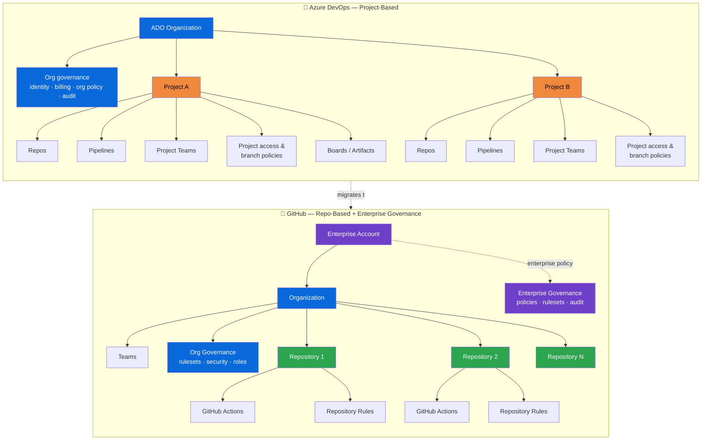
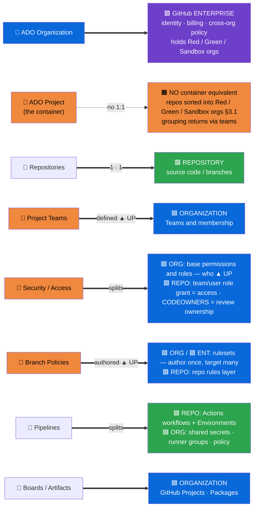
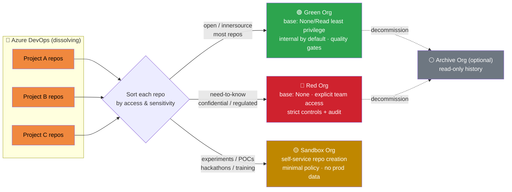
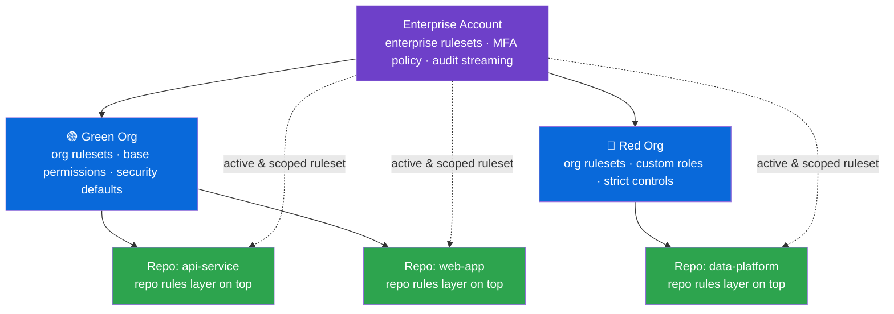

# Azure DevOps → GitHub: Structural Concept Mapping

> **Document status**
>
> - **Last reviewed:** 2026-07-21
> - **Authorship:** Drafted by GitHub Copilot (Claude Opus 4.8), with critic review by GPT-5.6 Sol and Gemini 3.1 Pro, and reviewed by a human maintainer before publication.
> - **Sources:** Based on public documentation — primarily [docs.github.com](https://docs.github.com) and [learn.microsoft.com](https://learn.microsoft.com) — and the companion docs in this repository (listed below).
> - **Repository sources used:**
>   - [`01-enterprise-hierarchy.md`](./01-enterprise-hierarchy.md) — Enterprise → Organization → Repository hierarchy.
>   - [`02-organization-strategies.md`](./02-organization-strategies.md) — the Red-Green-Sandbox-Archive organization model (§3.1).
>   - [`11-security-by-default-policies.md`](./11-security-by-default-policies.md) — base-permission and least-privilege baseline used in §3.1.
>   - [`16-azure-devops-to-github-migration-analysis.md`](./16-azure-devops-to-github-migration-analysis.md) — ADO pain points and concept mapping.
>   - [`ado-to-github-migration-assessment.md`](./ado-to-github-migration-assessment.md) — feature-by-feature ADO↔GitHub comparison.
> - **Verify before acting:** GitHub and Microsoft update product documentation continuously. Re-confirm against the live source pages before relying on this content for production decisions.

> **Audience:** Architects and stakeholders planning an Azure DevOps → GitHub migration who need a high-level, visual explanation of how the two platforms are structured differently.

---

## 1. The Core Structural Difference: Project-Based vs Repo-Based

The single most important thing to understand about moving from Azure DevOps (ADO) to GitHub is a **shift in the center of gravity**:

| | Azure DevOps | GitHub |
|---|---|---|
| **Primary container** | The **Project** (grouping repos, pipelines, boards, teams) — under an **Organization/tenant** that owns identity, billing, and org-wide policy | The **Organization** + the **Repository** — under an **Enterprise** that owns identity, billing, and cross-org policy |
| **Model** | **Project-based** — the Project is the day-to-day boundary for repos, pipelines, boards, and team access grants | **Repo-based + org/enterprise governance** — code and CI/CD live at the **repo**; teams, access, and policy are authored at the **org/enterprise** |
| **Governance** | Split between **Organization** (identity, org-wide policy) and **Project** (team access, project settings, branch policies across the project's repos) | Split between **Enterprise** (cross-org policy), **Organization** (teams, base access, rulesets), and **Repository** (repo rules, environments) |
| **Consequence** | Project-level settings are **repeated for each new project** | Org/enterprise settings are **authored once and target many repos** (when rulesets are active and scoped) |

> **Key takeaway:** There is **no native GitHub container between the org and the repo**, so an ADO *Project* has **no one-to-one container equivalent**. The recommended target is **not** a project-shaped org. Instead the Project **decomposes**: its team-access and policy responsibilities are re-expressed at the **GitHub Organization / Enterprise**, and its repositories are sorted by **access/visibility level** into the recommended **Red-Green-Sandbox-Archive** multi-org model (see §3.1), with **teams** reintroducing the day-to-day grouping. GitHub's own migration guidance confirms that *treating organizations as the equivalent of team projects is not recommended*; GitHub Enterprise Importer migrates **repository-by-repository**, so a project's repos can be distributed across the target orgs. A dedicated org for a single project is reserved for genuine hard-isolation cases.

---

## 2. Side-by-Side Structural Hierarchy

This diagram contrasts the two platform hierarchies. Notice how ADO nests almost everything **inside a Project**, while GitHub flattens repos under the Organization and lifts governance to the Enterprise.

**How to read it:**
- **Orange = ADO Project** — the busy container that holds nearly everything.
- **Purple = Enterprise**, **Blue = Organization**, **Green = Repository** on the GitHub side.
- The ADO Project (orange) has **no GitHub container equivalent**; its contents scatter across the GitHub Enterprise, Org, and Repos.

---

## 3. The Hero View — Where Each Component Lands

This is the central visual — a clean **left-to-right mapping**. Each **ADO concept (left)** maps straight across to **where it lands in GitHub (right)**, colored by tier: 🟪 **Enterprise**, 🟦 **Organization**, 🟩 **Repository**. Rows are aligned so you can trace each mapping horizontally. **Governance and access** concepts that ADO manages per-Project but GitHub authors centrally are marked **▲ UP**; concepts that **split across tiers** list every landing place inside the node (each prefixed with its tier emoji; the node's fill shows its **primary** tier); the **Project** has **no container equivalent**.

**How to read it:**
- **Trace each row straight across** — left is the ADO concept, right is where it lands in GitHub, colored by tier (🟪 Enterprise, 🟦 Organization, 🟩 Repository).
- **ADO Organization → GitHub Enterprise:** the Enterprise owns identity/SSO, billing, and cross-org policy **and holds the Red/Green/Sandbox organizations** (§3.1). In ADO that identity role comes from attaching the org to an **Entra ID** tenant; the Enterprise tier absorbs it. (Enterprise-wide SCIM applies to **Enterprise Managed Users (EMU)**; personal-account orgs use org-scoped SCIM.)
- **ADO Project → no container:** it has **no native GitHub container**. Its repos are sorted into the **Red / Green / Sandbox** orgs by access level (§3.1) and its grouping is reintroduced with **teams**. A dedicated org per project is reserved for genuine hard-isolation only.
- **Left-node colors:** **orange** marks ADO concepts that move ▲ UP or dissolve (Project, Teams, Security/Access, Branch Policies); **blue** marks the ADO Organization (which maps up to the Enterprise). Uncolored left nodes (Repositories, Pipelines, Boards) land primarily at the repo/org without a tier jump.
- **▲ UP = moves up a tier:** Teams, base access, and branch policies that ADO manages **per Project** are authored **once at the org/enterprise** in GitHub — the core "project-based → repo-based + central governance" shift.
- **Split rows list every landing place** (each with its tier emoji; the fill shows the primary tier): **Security/Access** (the *who* is org-level base permissions/roles; the effective **role grant is per-repo**, while **CODEOWNERS** assigns *review ownership*, not access), **Branch Policies** (org/enterprise rulesets **plus** a repo rules layer; a few ADO policies like work-item linking have no direct ruleset equivalent), and **Pipelines** (Actions/Environments run at the repo; shared secrets, runner groups, and Actions policy are governed at the org).

> **Why this matters:** In ADO you typically re-create project teams, access grants, and branch policies **for every new project**. In the recommended GitHub target state you author teams, base access, and **rulesets once at the org/enterprise level and scope them to many repos** — reducing duplication and enabling centrally-enforced, non-overridable guardrails (subject to any configured bypass actors). This is *target-state configuration*, not an automatic platform default.

---

## 3.1 Where Repositories Land: the Red / Green / Sandbox Target Org Model

Because the ADO Project has no container equivalent, the question becomes *"which organization should each repo live in?"* This repository's recommended answer (see [`02-organization-strategies.md`](./02-organization-strategies.md)) is the **Red-Green-Sandbox-Archive** pattern — a multi-org model built on GitHub's guidance for using multiple organizations. Crucially, orgs are chosen by **visibility and access-control level, not by project or by deployment environment**. As ADO Projects dissolve, their repositories are **sorted by sensitivity** into a small, fixed set of orgs.

> **Important:** "Red" and "Green" are **access-control** signals (restricted vs. open) — **not** blue/green *deployment* environments.

| Policy domain | 🟢 Green (open) | 🔴 Red (restricted) | 🟡 Sandbox |
|---|---|---|---|
| **Base permission** | **None / Read** (Read for innersource discovery; write access granted via **teams**) | None (explicit team access) | Read / Write (self-service) |
| **Repo creation** | Controlled | Restricted (approval) | Self-service |
| **Branch protection** | Required (quality) | Strict (security + quality) | Optional |
| **Default visibility** | Internal | Private | Internal / Private |
| **External collaborators** | Controlled | Prohibited / strict | Allowed |
| **Typical content** | Most app code, shared libs, platform services | Confidential, regulated, security-critical | POCs, experiments, training |

> **Note on Green base permission:** [`02-organization-strategies.md`](./02-organization-strategies.md) describes a **Write**-based innersource model for Green. This document follows the stricter **security-by-default baseline** in [`11-security-by-default-policies.md`](./11-security-by-default-policies.md), which recommends organization base permission **None or Read** (least privilege) — with elevated (write/maintain/admin) access granted explicitly through **teams**. Do not set a broad Write base permission by default. Note the base permission mainly governs **private** repositories: **internal** repositories are already readable by all enterprise members even when base permission is None, so Read chiefly widens default access to *private* org repos.

**Reintroducing "the project":** the grouping an ADO Project used to provide is re-expressed *inside* these orgs with **teams** (access + navigation), plus **naming conventions, topics, and custom properties** for discovery. Repos flow between orgs over their lifecycle: Sandbox → Green (promote), Green → Red (elevate sensitivity), Red → Green (declassify), and Green/Red → Archive (decommission).

> **Cardinality summary:** map **1 ADO Org → 1 GitHub Enterprise** containing the Red/Green/Sandbox(/Archive) orgs — **not** one GitHub org per ADO Project. A dedicated org for a single project is reserved for genuine hard-isolation needs (e.g., a distinct compliance or M&A boundary).

---

## 4. Governance Layering: Author Once, Target Many Repos

Where ADO governance is centered on the **Project** — branch policies can target branches across the project's repositories, alongside repository-, branch-, pipeline-, and object-level permissions — GitHub authors governance as **rulesets at three scopes** that **layer** on top of one another. Rulesets target branches, tags, and repos using **`fnmatch` glob patterns** (not regular expressions). An active, targeted enterprise ruleset can apply the same control across many orgs and repos without re-authoring it per repository.

- **Enterprise rulesets** apply to the orgs, repos, and refs they **target** and are **not overridable** by lower tiers — except for any **bypass actors** the ruleset defines. Rulesets stack independently: a bypass on the enterprise ruleset does **not** bypass a separate org- or repo-level ruleset, so an actor must satisfy (or be a bypass actor on) **every** applicable ruleset.
- **Organization rulesets** add stricter requirements for a business unit or product.
- **Repository rules** add repo-specific needs (e.g., a required status check unique to that codebase).
- When multiple rulesets apply, they **layer** — the most restrictive combination of controls wins.

> **Note on defaults:** GitHub does not enforce these controls automatically. Base permissions, rulesets, and MFA enforcement are **configured** as part of the target-state design. For example, setting the organization base permission to **None** and granting access explicitly via teams is a *recommended configuration* to achieve least privilege — not an out-of-the-box default. Internal repositories also remain readable by enterprise members even when base permission is None. (For **Enterprise Managed Users**, MFA is enforced by the identity provider rather than GitHub's own 2FA requirement.)

---

## 5. Detailed Concept Mapping Table

| Azure DevOps concept | GitHub equivalent | Level it lands on | Notes on the structural shift |
|---|---|---|---|
| **Azure DevOps Organization** | **GitHub Enterprise** containing the **Red / Green / Sandbox** orgs | Enterprise + Org | **Recommended cardinality: 1 ADO Org → 1 GitHub Enterprise** (not 1 org). Repos are distributed across the access-level orgs (§3.1). Identity/SSO that ADO handles by attaching its org to an **Entra ID** tenant is absorbed by the GitHub **Enterprise** tier. **SCIM lifecycle provisioning at the enterprise applies to Enterprise Managed Users (EMU)**; with personal GitHub accounts, SCIM is org-scoped and SAML can be org- or enterprise-scoped — state your target IAM model. |
| **Azure DevOps Project** | *No native container equivalent* — **decompose**: repos sorted into **Red/Green/Sandbox** orgs by access level (§3.1); grouping via **teams** | Org **and** Repo | No GitHub container sits between org and repo. GitHub's migration guidance explicitly says **treating organizations as team-project equivalents is not recommended**. GitHub Enterprise Importer migrates **repository-by-repository**, so a project's repos can be distributed across the target orgs — reinforcing that a project is *not* a unit that maps to one org. Group related repos via **teams**, naming conventions, topics, or custom properties. A dedicated org for one project is reserved for genuine hard-isolation only — and even then it is an administrative boundary (internal repos stay readable enterprise-wide, enterprise policy still applies). |
| **Repositories** | **Repositories** | Repo | Both are Git. GitHub repos are first-class org citizens, not nested inside a project. **1 ADO repo → 1 GitHub repo.** |
| **Project Teams** | **Teams** | Org | Teams are *defined* at the org (nested teams supported); the *effective access grant* (a team given a role) is attached to each repository. |
| **Security / Permissions** | Split: **identity, membership & team definitions** (Enterprise/Org) + **base permissions / custom roles** (Org) + **effective role grants** (Repository) + **code-governance** (Repository Rules) | Enterprise + Org + Repo | ADO's project-centric model separates into *who* (org/enterprise identity, membership) and *effective grant* (team/user role attached per repo). Rulesets govern *what code changes are allowed* and are **not** the equivalent of access permissions. |
| **Branch policies** | **Repository Rulesets** (and the older **branch protection rules**) | Enterprise / Org / Repo | ADO branch policies map to GitHub **branch protection rules** (repo-level) or, preferably, **rulesets** — the newer superset that can additionally be authored at **org or enterprise** scope, targeting refs with **`fnmatch` glob patterns** (not regex) and layering across tiers. Both set minimum reviewers, required status checks, and signed-commit requirements. Some ADO policies (work-item linking, comment resolution, path-specific required reviewers, build-expiration) have **no direct ruleset equivalent** and need separate mechanisms. Rulesets can be managed centrally via the API, Terraform, or JSON export/import (no built-in shared-definition library). |
| **Pipelines (Build)** | **GitHub Actions workflows** (repo) + **reusable workflows** (repo-stored, shared via org) + **shared secrets/variables, runner groups** (org) + **Actions policies** (org/enterprise) | Repo + Org + Enterprise | Workflows and reusable workflows are both **files in a repository** (reusable ones typically in a central automation repo); the org/enterprise governs their sharing, secrets, runner groups, and allowed-actions policy. |
| **Pipelines (Release)** | **GitHub Actions workflows + Environments with protection rules** | Repo | Deployment jobs run in workflows; environments add approvals, required reviewers, and wait timers. Not environments alone. |
| **Service connections** | **OIDC Workload Identity Federation** (preferred) or **GitHub Apps / scoped credentials** | Repo / Org + target system | OIDC is an *authentication pattern* — the trust relationship and RBAC live in the **target cloud** (e.g., Entra ID / AWS IAM). GitHub Apps replace *GitHub-API* integrations; arbitrary third-party service connections may still need scoped credentials stored as secrets. |
| **Area Paths** | *No true 1:1 equivalent* — partially covered by **JIRA components / GitHub Projects fields + labels** (work classification) and **CODEOWNERS** (code ownership) | Org / Repo | Area Paths combine hierarchical work classification, backlog ownership, **and** permissions. GitHub reproduces only portions across separate features; there is no single equivalent. |
| **Iterations / Sprints** | **GitHub Projects** (or JIRA sprints) | Org / User | GitHub Projects are user- or organization-owned; repo Issues/PRs are added to them. (Org uses JIRA for planning; Projects is optional.) |
| **Azure Boards (Work Items)** | **GitHub Issues + GitHub Projects** (or keep **Azure Boards**) | Org / Repo | Planning layer; often kept in JIRA via the GitHub for Atlassian integration. **Azure Boards can also stay connected to GitHub repos** — you can keep referencing work items from commits/PRs (e.g., `Fix login bug (AB#1234)`) and link branches/commits/PRs from Azure Boards. |
| **Azure Artifacts** | **GitHub Packages** | Org / Repo | Package hosting. Dependabot scans dependency **manifests** (and can authenticate to registries) — it does not vulnerability-scan a package merely because it is hosted in GitHub Packages. Note gaps vs Azure Artifacts: **no PyPI/Python**, no Universal Packages, and different upstream-source behavior. |
| **Governance (org-wide policy)** | **Enterprise Governance** (policies, rulesets, audit streaming) | Enterprise | New top tier above the org. Applies to the orgs/repos it **targets** and is non-overridable except for configured bypass actors. |

---

## 6. Reading Guide for Architects and Stakeholders

When presenting the migration target state, use these three talking points anchored to the diagrams above:

1. **"The Project goes away as a container."** (Diagrams §2–§3) — Stop thinking *"which project owns this?"* and start thinking *"which access-level org holds this repo, and which team grants access?"* Target cardinality: **1 ADO Org → 1 GitHub Enterprise**, with repositories sorted into the **Red / Green / Sandbox (/ Archive)** orgs by sensitivity (§3.1) — **not** one org per project. Reintroduce project-style grouping with **teams**.
2. **"Access consolidates up; code governance is authored up; runs happen at the repo."** (Diagram §3) — Identity, membership, team definitions, and base permissions consolidate at the **org/enterprise**; branch policies become **rulesets** you can author at org/enterprise scope; source and CI/CD *run* at the **repo**, where effective role grants and repo-level rules also land. *Access, branch policies, and pipelines each split across tiers.*
3. **"Author once, target many."** (Diagram §4) — Enterprise and org rulesets replace ADO's per-project duplication. This is *configured* target-state design (base permissions, rulesets, MFA enforcement) — not an automatic platform default — and delivers centrally-enforced guardrails, non-overridable except for defined bypass actors (which apply per ruleset, not globally).

### Legend used across all diagrams

| Color | Meaning |
|---|---|
| 🟪 **Purple** `#6e40c9` | GitHub **Enterprise** tier (governance apex) |
| 🟦 **Blue** `#0969da` | **Organization** tier (GitHub org / ADO org) |
| 🟩 **Green** `#2da44e` | **Repository** tier (code, Actions, repo rules) |
| 🟧 **Orange** `#f0883e` | ADO **Project** / concepts that **move up** in GitHub |

> **Diagram §3.1 exception:** to distinguish the target organizations by access level, §3.1 recolors nodes: 🟢 **Green** = Green org, 🔴 **Red** `#cf222e` = Red org, 🟡 **Gold** `#bf8700` = Sandbox org, ⚪ **Gray** `#6e7781` = Archive org. Elsewhere green always means the Repository tier.

---

## 7. References

- [`01-enterprise-hierarchy.md`](./01-enterprise-hierarchy.md) — GitHub Enterprise → Organization → Repository hierarchy.
- [`02-organization-strategies.md`](./02-organization-strategies.md) — the **Red-Green-Sandbox-Archive** organization model used in §3.1.
- [`11-security-by-default-policies.md`](./11-security-by-default-policies.md) — base-permission / least-privilege baseline (None/Read) applied in §3.1.
- [`16-azure-devops-to-github-migration-analysis.md`](./16-azure-devops-to-github-migration-analysis.md) — pain points and the concept mapping table.
- [`ado-to-github-migration-assessment.md`](./ado-to-github-migration-assessment.md) — feature-by-feature comparison and DevSecOps mapping.
- [Strategies for using organizations in GitHub Enterprise Cloud](https://resources.github.com/learn/pathways/administration-governance/essentials/strategies-for-using-organizations-github-enterprise-cloud/) — official Red-Green-Sandbox-Archive pattern.
- [GitHub Enterprise hierarchy](https://docs.github.com/en/enterprise-cloud@latest/admin/overview/about-enterprise-accounts)
- [Key differences between Azure DevOps and GitHub](https://docs.github.com/en/migrations/ado/key-differences-between-azure-devops-and-github) — official structure, authentication, branch-protection, and packages guidance.
- [About repository rulesets](https://docs.github.com/en/enterprise-cloud@latest/repositories/configuring-branches-and-merges-in-your-repository/managing-rulesets/about-rulesets)
- [Migrating from Azure DevOps with GitHub Enterprise Importer](https://docs.github.com/en/migrations/using-github-enterprise-importer)
- [Azure DevOps organizations & projects](https://learn.microsoft.com/en-us/azure/devops/organizations/)
