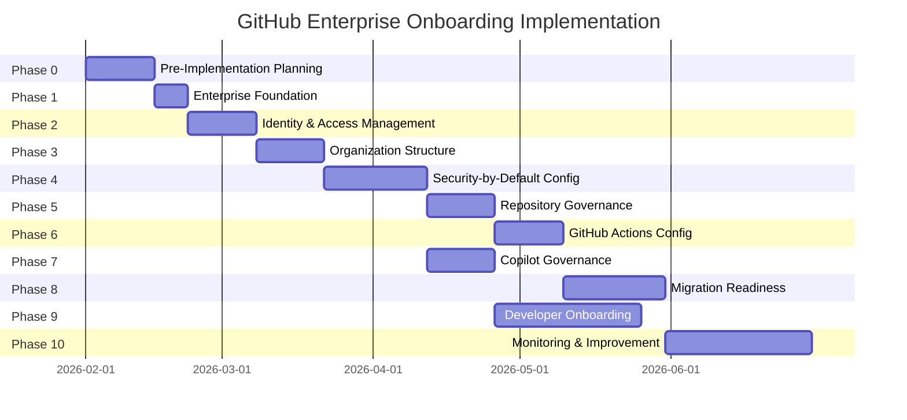

# GitHub Enterprise Cloud Onboarding Implementation Plan

> **Purpose:** Priority task list for a successful GitHub onboarding focusing on governance, compliance, settings, configuration, repository rules, and migration enablement.
> 
> **Target State:** Enable secure repository migration from other platforms to GitHub, with security-by-default features, PR validation, and GitHub Copilot full features ready for developers.
> 
> **Last Updated:** January 28, 2026

---

## Table of Contents

1. [Phase 0: Pre-Implementation Planning](#phase-0-pre-implementation-planning)
2. [Phase 1: Enterprise Foundation](#phase-1-enterprise-foundation)
3. [Phase 2: Identity and Access Management](#phase-2-identity-and-access-management)
4. [Phase 3: Organization Structure](#phase-3-organization-structure)
5. [Phase 4: Security-by-Default Configuration](#phase-4-security-by-default-configuration)
6. [Phase 5: Repository Governance and Rulesets](#phase-5-repository-governance-and-rulesets)
7. [Phase 6: GitHub Actions Configuration](#phase-6-github-actions-configuration)
8. [Phase 7: GitHub Copilot Governance](#phase-7-github-copilot-governance)
9. [Phase 8: Migration Readiness](#phase-8-migration-readiness)
10. [Phase 9: Developer Onboarding Enablement](#phase-9-developer-onboarding-enablement)
11. [Phase 10: Monitoring and Continuous Improvement](#phase-10-monitoring-and-continuous-improvement)
12. [Implementation Timeline Summary](#implementation-timeline-summary)
13. [Critical Success Factors](#critical-success-factors)

---

## Phase 0: Pre-Implementation Planning

**Duration:** 1-2 weeks  
**Priority:** CRITICAL - Must complete before any technical implementation

### 0.1 Decision: Enterprise Type Selection

| Task | Description | Owner | Status |
|------|-------------|-------|--------|
| **Evaluate Enterprise Types** | Decide between Enterprise with Personal Accounts vs. Enterprise Managed Users (EMU). This decision is **irreversible** - cannot convert between types. | Enterprise Architect | ☐ |
| **EMU Prerequisites Assessment** | If selecting EMU, verify: (1) Supported IdP (Entra ID, Okta, PingFederate), (2) No public repository needs, (3) External collaboration strategy, (4) Data residency requirements | IT/Security | ☐ |

**EMU Decision Criteria:**

| Criteria | Choose EMU If | Choose Personal Accounts If |
|----------|--------------|----------------------------|
| Identity Control | Need complete IdP-controlled identity lifecycle | Need flexible user-managed accounts |
| External Collaboration | Minimal or managed via separate personal accounts | Extensive external collaboration required |
| Public Content | No public repos/gists/GitHub Pages needed | Public repositories or open source participation needed |
| Compliance | Strong compliance mandates (SOC2, ISO 27001, FedRAMP) | Standard compliance requirements |
| Offboarding | Must have instant, automated access revocation | Manual offboarding acceptable |

> **Reference:** [Enterprise Managed Users documentation](./04-enterprise-managed-users.md)

### 0.2 EMU Limitations Acknowledgment (If Using EMU)

| Limitation | Impact | Mitigation Strategy | Acknowledged |
|------------|--------|---------------------|---------------|
| **No Public Repository Contributions** | Developers cannot contribute to open source from EMU accounts | Developers use separate personal accounts for OSS | ☐ |
| **No Personal Repositories** | EMU accounts cannot have personal repos | Use Sandbox org for experiments | ☐ |
| **No GitHub Certifications** | EMU users cannot access certification program | Use personal accounts for certifications | ☐ |
| **No Copilot Pro/Free Signup** | Requires enterprise Copilot Business/Enterprise license | Ensure enterprise Copilot licensing in place | ☐ |
| **No GitHub-Hosted Runners for User Repos** | Runners not available in personal EMU repos | All CI/CD in organization repositories | ☐ |
| **Limited Codespaces Access** | Cannot create codespaces for repos outside orgs | Organization-owned repos only | ☐ |
| **IdP Dependency** | IdP outage blocks all GitHub access | Ensure IdP high availability; document setup user recovery | ☐ |
| **Dual Account Workflow** | Developers need personal + EMU accounts for OSS work | Document account switching procedures | ☐ |

> **Reference:** [EMU Limitations and Considerations](./04-enterprise-managed-users.md#emu-limitations-and-considerations)

### 0.3 Organization Structure Planning

| Task | Description | Owner | Status |
|------|-------------|-------|--------|
| **Select Organization Pattern** | Choose between: Single Organization, Red-Green-Sandbox-Archive (recommended for most enterprises), or Business Unit Separation | Enterprise Architect | ☐ |
| **Define Organization Naming Convention** | Establish naming standard (e.g., `company-green`, `company-red`, `company-sandbox`) | Platform Team | ☐ |
| **Document Access Model** | Define base permissions strategy per organization (recommended: None or Read with explicit team grants) | Security Team | ☐ |

**Recommended Pattern: Red-Green-Sandbox-Archive**

| Organization | Purpose | Base Permission | Visibility Default |
|--------------|---------|-----------------|-------------------|
| **Green** (~90% of repos) | Standard development, innersource collaboration | Read or Write | Internal |
| **Red** (Need-to-know) | Confidential, regulated, or sensitive code | None | Private |
| **Sandbox** | Experimentation, POCs, hackathons | Write | Internal |
| **Archive** | Retired/historical repositories | Read-only | Internal/Private |

> **Reference:** [Organization Strategies](./02-organization-strategies.md)

### 0.4 Identity Provider Preparation

| Task | Description | Owner | Status |
|------|-------------|-------|--------|
| **Identify IdP for SSO** | Confirm IdP: Microsoft Entra ID, Okta, PingFederate, or other SAML 2.0/OIDC compliant provider | IT Security | ☐ |
| **Plan IdP Groups for Team Sync** | Map existing IdP groups to planned GitHub teams | IT/Platform Team | ☐ |
| **Prepare SCIM Integration** | Plan user/group provisioning; ensure IdP supports SCIM 2.0 | IT Identity Team | ☐ |
| **Document Username Normalization** | For EMU: Username format is `{idp_username}_{shortcode}` - plan for conflicts | IT Identity Team | ☐ |

> ⚠️ **Critical:** For EMU, mixing Okta and Entra ID for SSO and SCIM (in either direction) is **explicitly unsupported**. Choose one partner IdP for both authentication and provisioning.

### 0.5 Stakeholder Alignment

| Task | Description | Owner | Status |
|------|-------------|-------|--------|
| **Identify Enterprise Owners** | Limit to 3-5 individuals maximum (C-level, senior IT leadership, security architects) | Executive Sponsor | ☐ |
| **Identify Billing Managers** | Finance/procurement personnel for cost management | Finance | ☐ |
| **Identify Security Managers** | Personnel who will manage security features and alerts enterprise-wide | Security Team | ☐ |
| **Define RACI Matrix** | Document responsibility matrix for GitHub administration | Project Lead | ☐ |

---

## Phase 1: Enterprise Foundation

**Duration:** 1 week  
**Priority:** CRITICAL  
**Prerequisites:** Phase 0 decisions completed

### 1.1 Enterprise Account Setup

| Task | Description | Owner | Status |
|------|-------------|-------|--------|
| **Create GitHub Enterprise Cloud Account** | Work with GitHub sales to provision enterprise account (EMU or Personal Accounts based on Phase 0 decision) | Enterprise Admin | ☐ |
| **Record Enterprise Shortcode** | For EMU: Note the shortcode (used in usernames: `user_shortcode`) | Enterprise Admin | ☐ |
| **Secure Setup User Credentials** | For EMU: Securely store `{shortcode}_admin` credentials for emergency access | Security Team | ☐ |
| **Configure Enterprise Display Name** | Set clear, identifiable enterprise name | Enterprise Admin | ☐ |

### 1.2 Enterprise Owner and Role Assignment

| Task | Description | Owner | Status |
|------|-------------|-------|--------|
| **Assign Enterprise Owners** | Add 3-5 enterprise owners with hardware security keys (U2F/WebAuthn) | Enterprise Admin | ☐ |
| **Assign Billing Managers** | Grant billing access to finance personnel (no admin access) | Enterprise Admin | ☐ |
| **Assign Security Managers** | Grant security management permissions for GHAS features | Enterprise Admin | ☐ |
| **Document Owner Access** | Record all enterprise owner assignments externally for audit | Security Team | ☐ |

> **Best Practice:** Require hardware security keys for all Enterprise Owners. Implement quarterly access reviews.

### 1.3 Enterprise Billing Configuration

| Task | Description | Owner | Status |
|------|-------------|-------|--------|
| **Configure Payment Method** | Set up enterprise billing with approved payment method | Billing Manager | ☐ |
| **Set Spending Limits** | Configure spending limits for GitHub Actions and Packages | Billing Manager | ☐ |
| **Enable Usage Reporting** | Enable detailed usage tracking for cost allocation | Billing Manager | ☐ |
| **Plan License Allocation** | Determine GHAS and Copilot seat allocation strategy | Finance/Platform | ☐ |

---

## Phase 2: Identity and Access Management

**Duration:** 2 weeks  
**Priority:** CRITICAL  
**Prerequisites:** Phase 1 complete, IdP ready

### 2.1 SAML SSO Configuration

| Task | Description | Owner | Status |
|------|-------------|-------|--------|
| **Configure SAML SSO at Enterprise Level** | Set up SAML 2.0 or OIDC with your IdP | IT Security | ☐ |
| **Test SSO Authentication** | Verify login flow with test users before enforcement | IT Security | ☐ |
| **Enable SSO Auto-Redirect** | For EMU: Enable redirect to IdP for unauthenticated users | Enterprise Admin | ☐ |
| **Document SSO Recovery Procedures** | Document procedures for SSO failures and setup user access | IT Security | ☐ |

**For EMU with Microsoft Entra ID:**
1. Register GitHub EMU application in Entra ID
2. Configure SAML/OIDC claims (required: NameID, email, name)
3. Enable Conditional Access Policies (CAP) as needed

**For EMU with Okta:**
> ⚠️ Okta supports SAML 2.0 only for EMU (OIDC is **not supported**)

### 2.2 SCIM Provisioning Configuration

| Task | Description | Owner | Status |
|------|-------------|-------|--------|
| **Configure SCIM Endpoint** | Set up SCIM 2.0 provisioning from IdP to GitHub | IT Identity Team | ☐ |
| **Configure User Attribute Mapping** | Map IdP attributes to GitHub profile fields (name, email) | IT Identity Team | ☐ |
| **Configure Group Provisioning** | Enable IdP group sync for team membership automation | IT Identity Team | ☐ |
| **Test User Provisioning** | Provision test users and verify account creation | IT Identity Team | ☐ |
| **Test User Deprovisioning** | Verify that disabling IdP user suspends GitHub account immediately | IT Identity Team | ☐ |

### 2.3 Two-Factor Authentication (For Non-EMU Only)

| Task | Description | Owner | Status |
|------|-------------|-------|--------|
| **Require 2FA Enterprise-Wide** | Enforce 2FA for all organization members | Enterprise Admin | ☐ |
| **Require Secure 2FA Methods** | Disable SMS-based 2FA; allow only passkeys, security keys, TOTP apps, GitHub Mobile | Enterprise Admin | ☐ |
| **Set 2FA Grace Period** | Allow reasonable grace period for compliance | Enterprise Admin | ☐ |

> **Note:** 2FA enforcement is not available for EMU enterprises—EMU users authenticate via IdP, which should enforce MFA.

### 2.4 IP Allow List Configuration

| Task | Description | Owner | Status |
|------|-------------|-------|--------|
| **Identify Corporate IP Ranges** | Document all corporate VPN, office, and cloud infrastructure IPs | Network Team | ☐ |
| **Configure Enterprise IP Allow List** | Add approved IP ranges at enterprise level | Enterprise Admin | ☐ |
| **Configure GitHub Actions IP Ranges** | Add GitHub-hosted runner IPs if needed, or use self-hosted runners | Platform Team | ☐ |
| **Test Access from Allowed IPs** | Verify access works from approved networks | Platform Team | ☐ |
| **Test Access from Non-Allowed IPs** | Verify access is blocked from unapproved networks | Security Team | ☐ |

### 2.5 SSH Certificate Authority (Optional but Recommended)

| Task | Description | Owner | Status |
|------|-------------|-------|--------|
| **Generate SSH CA Key Pair** | Create enterprise SSH Certificate Authority | Security Team | ☐ |
| **Upload SSH CA to Enterprise** | Add SSH CA public key to enterprise settings | Enterprise Admin | ☐ |
| **Configure Certificate Expiration** | Upgrade CA to require certificate expiration | Enterprise Admin | ☐ |
| **Document SSH Certificate Issuance** | Create procedures for issuing user SSH certificates | Security Team | ☐ |

---

## Phase 3: Organization Structure

**Duration:** 1-2 weeks  
**Priority:** HIGH  
**Prerequisites:** Phase 2 complete

### 3.1 Create Organizations

| Task | Description | Owner | Status |
|------|-------------|-------|--------|
| **Create Green Organization** | Main development organization (e.g., `company-green`) | Enterprise Admin | ☐ |
| **Create Red Organization** | Restricted/confidential organization (e.g., `company-red`) | Enterprise Admin | ☐ |
| **Create Sandbox Organization** | Experimentation space (e.g., `company-sandbox`) | Enterprise Admin | ☐ |
| **Create Archive Organization** | Historical repositories (e.g., `company-archive`) | Enterprise Admin | ☐ |

### 3.2 Configure Organization Base Permissions

| Task | Description | Recommended Setting | Status |
|------|-------------|---------------------|--------|
| **Green Org Base Permission** | Set default access for members | **Read** (for innersource) or **Write** | ☐ |
| **Red Org Base Permission** | Set default access for members | **None** (explicit grants only) | ☐ |
| **Sandbox Org Base Permission** | Set default access for members | **Write** | ☐ |
| **Archive Org Base Permission** | Set default access for members | **Read** | ☐ |

### 3.3 Configure Team Structure

| Task | Description | Owner | Status |
|------|-------------|-------|--------|
| **Design Team Hierarchy** | Create team structure aligned with IdP groups (limit nesting to 3-4 levels) | Platform Team | ☐ |
| **Enable Team Sync** | Connect IdP groups to GitHub teams for automatic membership | IT Identity Team | ☐ |
| **Create Core Teams** | Create teams for: Platform, Security, DevOps, Architecture | Org Admin | ☐ |
| **Assign Team Maintainers** | Designate 3+ maintainers per team for business continuity | Org Admin | ☐ |

**Team Naming Convention Example:**
- `eng-platform` - Platform engineering team
- `eng-frontend` - Frontend team
- `eng-backend` - Backend team
- `security-appsec` - Application security team
- `devops-sre` - SRE team

### 3.4 Configure Organization Membership Settings

| Task | Description | Recommended Setting | Status |
|------|-------------|---------------------|--------|
| **Team Creation Permissions** | Who can create teams | **Organization Admins only** | ☐ |
| **Outside Collaborator Permissions** | Who can invite external users | **Organization Owners only** | ☐ |
| **Default Repository Visibility** | Default for new repositories | **Internal** (Green), **Private** (Red) | ☐ |

---

## Phase 4: Security-by-Default Configuration

**Duration:** 2-3 weeks  
**Priority:** CRITICAL  
**Prerequisites:** Phase 3 complete

### 4.1 Enterprise-Level Security Policies

#### 4.1.1 Repository Management Policies

| Policy | Recommended Setting | Rationale | Status |
|--------|---------------------|-----------|--------|
| **Base Repository Permissions** | **Enforce: No permission** | Least privilege principle | ☐ |
| **Repository Creation** | **Enforce: Organization Owners** | Prevent repository sprawl | ☐ |
| **Block User Namespace Repos** (EMU) | **Enable** | Prevent personal repos in enterprise | ☐ |
| **Public Repository Creation** | **Disable** | Prevent accidental public exposure | ☐ |
| **Repository Visibility Change** | **Restrict to Org Owners** | Prevent accidental exposure | ☐ |
| **Repository Deletion/Transfer** | **Restrict to Org Owners** | Prevent accidental data loss | ☐ |
| **Repository Forking** | **Restrict within same org** | Control code duplication | ☐ |
| **Default Branch Name** | **Enforce: `main`** | Consistency across enterprise | ☐ |
| **Outside Collaborators** | **Restrict to Org Owners** | Control external access | ☐ |
| **Deploy Keys** | **Restrict** (prefer GitHub Apps) | Better access control | ☐ |
| **Issue Deletion** | **Restrict to Org Owners** | Preserve issue history | ☐ |

> **Reference:** [Security-by-Default Policies](./11-security-by-default-policies.md)

#### 4.1.2 GitHub Advanced Security (GHAS) Policies

| Policy | Recommended Setting | Rationale | Status |
|--------|---------------------|-----------|--------|
| **GHAS Availability** | **Enable for all organizations** | Enable security features | ☐ |
| **Dependabot Alerts** | **Allow** | Repository admins can enable | ☐ |
| **Secret Scanning** | **Enable** | Detect exposed secrets | ☐ |
| **Code Scanning (CodeQL)** | **Enable** | Automated vulnerability detection | ☐ |
| **Dependency Insights Visibility** | **Enable** | Allow members to view dependencies | ☐ |
| **Copilot Autofix** | **Enable** | AI-powered security fix suggestions | ☐ |
| **AI Detection for Secret Scanning** | **Enable** | Detect generic passwords/secrets | ☐ |

### 4.2 Organization-Level Security Configurations

#### 4.2.1 Create Security Configurations

| Task | Description | Owner | Status |
|------|-------------|-------|--------|
| **Create Default Security Configuration** | Enable: Dependency graph, Dependabot alerts, Dependabot security updates, Secret scanning, Push protection, Code scanning (default setup) | Security Team | ☐ |
| **Apply Configuration to All Repos** | Apply default security configuration organization-wide | Org Admin | ☐ |
| **Configure Custom Secret Patterns** | Define patterns for internal tokens, API keys, custom credentials | Security Team | ☐ |
| **Enable Non-Provider Pattern Detection** | Enable detection of SSH keys, PGP keys, connection strings | Security Team | ☐ |
| **Configure Dependabot Version Updates** | Create standard `.github/dependabot.yml` for repositories | Security Team | ☐ |

**Recommended Dependabot Configuration (`.github/dependabot.yml`):**

```yaml
version: 2
updates:
  # GitHub Actions
  - package-ecosystem: "github-actions"
    directory: "/"
    schedule:
      interval: "weekly"
    commit-message:
      prefix: "ci:"
    labels:
      - "dependencies"
      - "github-actions"

  # Add ecosystems based on project type (npm, pip, maven, etc.)
```

#### 4.2.2 Push Protection Configuration

| Task | Description | Owner | Status |
|------|-------------|-------|--------|
| **Enable Push Protection** | Block pushes containing detected secrets | Security Team | ☐ |
| **Configure Bypass Permissions** | Limit bypass to Security team with documented procedures | Security Team | ☐ |
| **Enable Bypass Request Workflow** | Require approval for push protection bypass | Security Team | ☐ |

### 4.3 Personal Access Token (PAT) Policies

| Policy | Recommended Setting | Rationale | Status |
|--------|---------------------|-----------|--------|
| **Fine-Grained PAT Access** | **Allow with approval** | Require org owner approval | ☐ |
| **Classic PAT Access** | **Restrict or Block** | Prefer fine-grained PATs | ☐ |
| **PAT Maximum Lifetime** | **90-365 days** | Limit exposure window | ☐ |
| **Fine-Grained PAT Approval** | **Require approval** | Centralized token governance | ☐ |

---

## Phase 5: Repository Governance and Rulesets

**Duration:** 2 weeks  
**Priority:** HIGH  
**Prerequisites:** Phase 4 complete

### 5.1 Organization-Level Repository Rulesets

#### 5.1.1 Create Default Branch Protection Ruleset

| Rule | Setting | Rationale | Status |
|------|---------|-----------|--------|
| **Ruleset Name** | `default-branch-protection` | - | ☐ |
| **Enforcement** | **Active** | Enforce immediately | ☐ |
| **Target** | Default branch (`main`) | Protect primary branches | ☐ |
| **Apply to** | All repositories | Organization-wide enforcement | ☐ |

**Rules to Include:**

| Rule | Recommended Setting | Status |
|------|---------------------|--------|
| **Require Pull Request** | **Enable** | ☐ |
| **Required Approvals** | **At least 1** (2+ for production) | ☐ |
| **Dismiss Stale Reviews** | **Enable** | ☐ |
| **Require CODEOWNERS Review** | **Enable** | ☐ |
| **Require Conversation Resolution** | **Enable** | ☐ |
| **Block Force Pushes** | **Enable** | ☐ |
| **Block Branch Deletion** | **Enable** | ☐ |
| **Require Up-to-Date Branches** | **Enable** | ☐ |
| **Require Signed Commits** | **Enable** (if org readiness ≥80%) | ☐ |

#### 5.1.2 Create Required Status Checks Ruleset

| Task | Description | Owner | Status |
|------|-------------|-------|--------|
| **Define Required CI Checks** | Specify required status check names (e.g., `ci/build`, `ci/test`) | Platform Team | ☐ |
| **Define Required Security Checks** | Specify required security checks (e.g., `security/codeql`, `security/dependency-review`) | Security Team | ☐ |
| **Configure Status Check Strictness** | Enable "Require branches to be up to date" | Platform Team | ☐ |
| **Add Status Checks to Ruleset** | Add all required checks to organization ruleset | Platform Team | ☐ |

#### 5.1.3 Create Code Scanning Results Ruleset

| Task | Description | Owner | Status |
|------|-------------|-------|--------|
| **Require Code Scanning Results** | Block merges if code scanning not run | Security Team | ☐ |
| **Configure Severity Thresholds** | Block merges with Critical/High severity findings | Security Team | ☐ |

#### 5.1.4 Configure Push Rulesets (Optional but Recommended)

| Rule | Recommended Setting | Rationale | Status |
|------|---------------------|-----------|--------|
| **Restrict File Paths** | Protect `.github/`, `CODEOWNERS`, security configs | Prevent policy tampering | ☐ |
| **Restrict File Extensions** | Block `.exe`, `.dll`, binaries | Prevent binary commits | ☐ |
| **Restrict File Size** | Set appropriate limit (e.g., 50MB) | Prevent large files | ☐ |

### 5.2 Repository Templates

| Task | Description | Owner | Status |
|------|-------------|-------|--------|
| **Create Base Repository Template** | Include: README, .gitignore, LICENSE, CODEOWNERS, SECURITY.md, CONTRIBUTING.md | Platform Team | ☐ |
| **Add PR Template** | Create `.github/pull_request_template.md` | Platform Team | ☐ |
| **Add Issue Templates** | Create `.github/ISSUE_TEMPLATE/` directory with templates | Platform Team | ☐ |
| **Add Dependabot Configuration** | Create `.github/dependabot.yml` with default settings | Security Team | ☐ |
| **Add CI/CD Starter Workflows** | Create `.github/workflows/` with CI/security templates | Platform Team | ☐ |
| **Mark as Template Repository** | Enable "Template repository" setting | Platform Team | ☐ |

**Template Variants to Create:**

| Template | Target Use Case | Status |
|----------|-----------------|--------|
| `repo-template-base` | General purpose projects | ☐ |
| `repo-template-python` | Python applications/services | ☐ |
| `repo-template-javascript` | JavaScript/TypeScript apps | ☐ |
| `repo-template-java` | Java applications | ☐ |
| `repo-template-dotnet` | .NET applications | ☐ |
| `repo-template-terraform` | Infrastructure as Code | ☐ |

### 5.3 Custom Repository Properties

| Task | Description | Owner | Status |
|------|-------------|-------|--------|
| **Define Security Tier Property** | Values: `tier-1-critical`, `tier-2-important`, `tier-3-standard` | Security Team | ☐ |
| **Define Compliance Property** | Values: `pci`, `hipaa`, `sox`, `gdpr`, `none` | Compliance Team | ☐ |
| **Define Production Status Property** | Values: `production`, `staging`, `development`, `archive` | Platform Team | ☐ |
| **Create Property-Based Rulesets** | Apply stricter rules to `tier-1-critical` repositories | Security Team | ☐ |

---

## Phase 6: GitHub Actions Configuration

**Duration:** 2 weeks  
**Priority:** HIGH  
**Prerequisites:** Phase 5 complete

### 6.1 Enterprise-Level Actions Policies

| Policy | Recommended Setting | Rationale | Status |
|--------|---------------------|-----------|--------|
| **Actions Availability** | **Enable for all organizations** | Allow Actions with restrictions | ☐ |
| **Allowed Actions** | **Restrict**: Enterprise actions, GitHub actions, verified creators | Prevent untrusted actions | ☐ |
| **Require Actions SHA Pinning** | **Enable** | Prevent action version tampering | ☐ |
| **Default Workflow Permissions** | **Read-only** | Least privilege for GITHUB_TOKEN | ☐ |
| **Allow Actions to Create PRs** | **Disable** | Prevent automated PR creation/approval | ☐ |
| **Fork Pull Request Workflows** | **Require approval for all outside collaborators** | Prevent malicious workflow execution | ☐ |
| **Repository-Level Runners** | **Disable** | Use org/enterprise runners for security | ☐ |

### 6.2 Organization-Level Actions Configuration

| Task | Description | Owner | Status |
|------|-------------|-------|--------|
| **Configure Organization Secrets** | Create shared secrets for CI/CD | Platform Team | ☐ |
| **Configure Organization Variables** | Create shared configuration variables | Platform Team | ☐ |
| **Create Runner Groups** | Organize runners by purpose (build, deploy, security) | Platform Team | ☐ |
| **Limit Runner Group Access** | Restrict runner groups to specific repositories | Platform Team | ☐ |

### 6.3 Self-Hosted Runners (If Required)

| Task | Description | Owner | Status |
|------|-------------|-------|--------|
| **Plan Runner Infrastructure** | Decide: Kubernetes, EC2 auto-scaling, AKS, or other | Platform Team | ☐ |
| **Implement Runner Autoscaling** | Configure scale-up/down based on queue depth | Platform Team | ☐ |
| **Configure Runner Labels** | Label runners by capability (os, gpu, size) | Platform Team | ☐ |
| **Implement Runner Ephemeral Mode** | Use ephemeral runners for security (new VM per job) | Platform Team | ☐ |
| **Configure Runner Health Checks** | Implement monitoring and automatic replacement | Platform Team | ☐ |

### 6.4 Reusable Workflows

| Task | Description | Owner | Status |
|------|-------------|-------|--------|
| **Create Reusable CI Workflow** | Standard build/test workflow | Platform Team | ☐ |
| **Create Reusable Security Scanning Workflow** | CodeQL, dependency review, secret scanning | Security Team | ☐ |
| **Create Reusable Deployment Workflow** | Standard deployment with approvals | Platform Team | ☐ |
| **Document Workflow Usage** | Create documentation for workflow consumption | Platform Team | ☐ |

### 6.5 Environment Protection Rules

| Task | Description | Owner | Status |
|------|-------------|-------|--------|
| **Create Environment Definitions** | Create: `development`, `staging`, `production` | Platform Team | ☐ |
| **Configure Production Reviewers** | Require approval from designated reviewers for production | Platform Team | ☐ |
| **Configure Environment Secrets** | Set environment-specific secrets | Platform Team | ☐ |
| **Configure Deployment Branch Policies** | Limit which branches can deploy to each environment | Platform Team | ☐ |

---

## Phase 7: GitHub Copilot Governance

**Duration:** 1-2 weeks  
**Priority:** HIGH  
**Prerequisites:** Phase 4 complete (security baseline)

### 7.1 Enterprise-Level Copilot Policies

#### 7.1.1 Feature Policies

| Policy | Security-by-Default Setting | Rationale | Status |
|--------|----------------------------|-----------|--------|
| **Copilot in IDE** | **Enabled** | Core productivity feature | ☐ |
| **Copilot Chat in IDE** | **Enabled** | Context-aware assistance | ☐ |
| **Copilot Chat in GitHub.com** | **Enabled** | Web-based chat workflows | ☐ |
| **Copilot CLI** | **Enabled** | Command-line assistance | ☐ |
| **Copilot Code Review** | **Enabled** | Improves code quality | ☐ |
| **Copilot Coding Agent** | **Disabled** or **No Policy** | Requires security evaluation | ☐ |
| **Agent Mode in IDE** | **No Policy** | Let organizations decide | ☐ |
| **MCP Servers** | **Disabled** | External integrations require review | ☐ |

#### 7.1.2 Privacy Policies (Critical)

| Policy | Security-by-Default Setting | Rationale | Status |
|--------|----------------------------|-----------|--------|
| **Suggestions Matching Public Code** | **Blocked** | Reduces IP/licensing risks | ☐ |
| **Prompt and Suggestion Collection** | **Blocked** | Maintains data privacy | ☐ |
| **User Feedback Collection** | **Allowed** (optional) | Only if participating in improvement | ☐ |
| **Preview Features** | **Disabled** | Avoid preview features in production | ☐ |

### 7.2 Content Exclusions

| Task | Description | Owner | Status |
|------|-------------|-------|--------|
| **Identify Sensitive Paths** | Document file paths containing secrets, credentials, sensitive configs | Security Team | ☐ |
| **Configure Organization Exclusions** | Exclude: `**/secrets/**`, `**/.env*`, `**/credentials/**` | Org Admin | ☐ |
| **Configure Repository-Level Exclusions** | Add repo-specific exclusions for sensitive code | Repo Admins | ☐ |

> ⚠️ **Important:** Content exclusions do NOT apply to Copilot Coding Agent and Agent Mode. If content exclusion is critical for compliance, consider disabling these features at enterprise level.

### 7.3 License Management

| Task | Description | Owner | Status |
|------|-------------|-------|--------|
| **Define License Assignment Strategy** | Choose: Direct assignment, team-based, or organization-wide | Platform Team | ☐ |
| **Configure Seat Assignment** | Assign Copilot seats to users/teams | Org Admin | ☐ |
| **Set Up Usage Monitoring** | Enable tracking to identify underutilized licenses | Platform Team | ☐ |
| **Establish Reclamation Process** | Process to reclaim seats from inactive users | Platform Team | ☐ |

### 7.4 Network Configuration for Copilot

| Task | Description | Owner | Status |
|------|-------------|-------|--------|
| **Configure Firewall Allowlist** | Add Copilot domains to corporate firewall allowlist | Network Team | ☐ |
| **Configure SSL Certificate Trust** | If using SSL inspection, ensure Copilot endpoints trusted | Network Team | ☐ |
| **Document Proxy Configuration** | Document proxy settings for developer IDEs | Platform Team | ☐ |

**Required Copilot Endpoints for Firewall Allowlist:**

| Domain | Purpose |
|--------|--------|
| `github.com` | Authentication and repository access |
| `api.github.com` | GitHub API access |
| `copilot.github.com` | Copilot service |
| `*.githubcopilot.com` | Copilot completions |
| `copilot-proxy.githubusercontent.com` | Copilot proxy |
| `copilot-telemetry.githubusercontent.com` | Telemetry (if enabled) |
| `*.github.dev` | GitHub Codespaces |
| `vscode-cdn.net` | VS Code extensions |
| `marketplace.visualstudio.com` | Extension marketplace |

### 7.5 Copilot Custom Instructions (Enterprise)

| Task | Description | Owner | Status |
|------|-------------|-------|--------|
| **Define Coding Standards** | Document enterprise coding conventions | Architecture Team | ☐ |
| **Create Custom Instructions** | Configure Copilot to follow enterprise patterns | Platform Team | ☐ |
| **Configure Knowledge Bases** (Enterprise only) | Set up knowledge bases for Copilot context | Platform Team | ☐ |

---

## Phase 8: Migration Readiness

**Duration:** 2-3 weeks  
**Priority:** HIGH  
**Prerequisites:** Phases 1-7 complete

### 8.1 Pre-Migration Assessment

| Task | Description | Owner | Status |
|------|-------------|-------|--------|
| **Inventory Source Repositories** | List all repositories to migrate with metadata | Migration Team | ☐ |
| **Assess Repository Sizes** | Identify large repositories requiring special handling | Migration Team | ☐ |
| **Document Repository Dependencies** | Map cross-repository dependencies | Migration Team | ☐ |
| **Identify Large Files/LFS Needs** | Plan for Git LFS migration if needed | Migration Team | ☐ |
| **Audit Source Access Permissions** | Document current access model for mapping | Migration Team | ☐ |

### 8.2 Migration Tool Selection

| Source Platform | Recommended Tool | Notes | Status |
|-----------------|------------------|-------|--------|
| **Azure DevOps** | GitHub Enterprise Importer (GEI) | Full migration support | ☐ |
| **GitLab** | GitHub Enterprise Importer (GEI) | Full migration support | ☐ |
| **Bitbucket Server** | GitHub Enterprise Importer (GEI) | Full migration support | ☐ |
| **Bitbucket Cloud** | GitHub Enterprise Importer (GEI) | Full migration support | ☐ |
| **Other Git hosts** | `git clone --mirror` + push | Manual migration | ☐ |

### 8.3 Migration Configuration

| Task | Description | Owner | Status |
|------|-------------|-------|--------|
| **Configure GEI Authentication** | Set up tokens for source and destination | Migration Team | ☐ |
| **Create Migration Organization** | Consider staging organization for migration testing | Migration Team | ☐ |
| **Plan Migration Waves** | Group repositories by priority/dependency | Migration Team | ☐ |
| **Define Naming Mapping** | Map source repo names to GitHub naming convention | Migration Team | ☐ |
| **Plan Team/Permission Mapping** | Map source permissions to GitHub teams | Migration Team | ☐ |

### 8.4 Pilot Migration

| Task | Description | Owner | Status |
|------|-------------|-------|--------|
| **Select Pilot Repositories** | Choose 3-5 representative repositories | Migration Team | ☐ |
| **Execute Pilot Migration** | Migrate pilot repos and validate | Migration Team | ☐ |
| **Validate Git History** | Confirm all commits, branches, tags migrated | Migration Team | ☐ |
| **Validate PRs/Issues** (if applicable) | Confirm work items migrated | Migration Team | ☐ |
| **Test CI/CD Workflows** | Validate Actions workflows execute correctly | Platform Team | ☐ |
| **Test Security Scanning** | Confirm GHAS features activate on migrated repos | Security Team | ☐ |
| **Document Lessons Learned** | Capture issues for full migration planning | Migration Team | ☐ |

### 8.5 Post-Migration Checklist (Per Repository)

| Task | Description | Status |
|------|-------------|--------|
| Apply repository template settings | ☐ |
| Verify CODEOWNERS file | ☐ |
| Enable branch protection ruleset | ☐ |
| Assign team access permissions | ☐ |
| Enable security features (GHAS) | ☐ |
| Configure Dependabot | ☐ |
| Set up CI/CD workflows | ☐ |
| Verify Copilot access | ☐ |
| Update documentation with new URLs | ☐ |
| Notify repository stakeholders | ☐ |

---

## Phase 9: Developer Onboarding Enablement

**Duration:** Ongoing (parallel to Phase 8)  
**Priority:** HIGH

### 9.1 Developer Documentation

| Task | Description | Owner | Status |
|------|-------------|-------|--------|
| **Create Developer Quick Start Guide** | Getting started with GitHub (login, clone, PR workflow) | Platform Team | ☐ |
| **Create Branch Strategy Documentation** | Document branching strategy and conventions | Platform Team | ☐ |
| **Create PR Best Practices Guide** | Document PR requirements, review process | Platform Team | ☐ |
| **Create Security Practices Guide** | Secret handling, security scanning remediation | Security Team | ☐ |
| **Create Copilot Usage Guide** | Best practices for using Copilot effectively | Platform Team | ☐ |

### 9.2 Developer Tooling

| Task | Description | Owner | Status |
|------|-------------|-------|--------|
| **Document IDE Setup** | VS Code, JetBrains with GitHub extensions | Platform Team | ☐ |
| **Configure GitHub CLI** | Document `gh` CLI installation and authentication | Platform Team | ☐ |
| **Copilot Extension Setup** | Document Copilot extension installation and activation | Platform Team | ☐ |
| **SSH Key Configuration** | Document SSH key generation and GitHub setup | Platform Team | ☐ |
| **GPG Key Configuration** | Document GPG/SSH signing setup for signed commits | Security Team | ☐ |

### 9.3 Training Sessions

| Session | Target Audience | Content | Status |
|---------|-----------------|---------|--------|
| **GitHub Fundamentals** | All developers | Git basics, PR workflow, code review | ☐ |
| **GitHub Advanced** | Senior developers | Advanced Git, rebase, conflict resolution | ☐ |
| **Security Practices** | All developers | Security scanning, secret handling | ☐ |
| **GitHub Copilot** | All developers | Copilot features, best practices | ☐ |
| **Admin Training** | Repository admins | Repository settings, team management | ☐ |

### 9.4 Support Channels

| Task | Description | Owner | Status |
|------|-------------|-------|--------|
| **Create GitHub Support Channel** | Slack/Teams channel for GitHub questions | Platform Team | ☐ |
| **Document Escalation Path** | How to escalate GitHub issues | Platform Team | ☐ |
| **Create FAQ Documentation** | Common questions and answers | Platform Team | ☐ |
| **Establish Office Hours** | Regular sessions for GitHub support | Platform Team | ☐ |

---

## Phase 10: Monitoring and Continuous Improvement

**Duration:** Ongoing  
**Priority:** MEDIUM (but essential for long-term success)

### 10.1 Audit Log Configuration

| Task | Description | Owner | Status |
|------|-------------|-------|--------|
| **Enable Audit Log Streaming** | Stream to SIEM (Splunk, Azure Sentinel, Datadog) | Security Team | ☐ |
| **Configure Log Retention** | Set appropriate retention (audit events: 180 days in GitHub; extend via streaming) | Security Team | ☐ |
| **Create Alerting Rules** | Alert on: admin privilege changes, policy changes, suspicious activity | Security Team | ☐ |
| **Schedule Regular Audit Reviews** | Weekly/monthly review of audit events | Security Team | ☐ |

### 10.2 Security Dashboards

| Task | Description | Owner | Status |
|------|-------------|-------|--------|
| **Configure Security Overview** | Use GitHub Security Overview dashboard | Security Team | ☐ |
| **Create Vulnerability Tracking Dashboard** | Track open vulnerabilities by severity | Security Team | ☐ |
| **Create Secret Scanning Dashboard** | Track detected and remediated secrets | Security Team | ☐ |
| **Define SLAs for Vulnerability Remediation** | Set timeframes by severity level | Security Team | ☐ |

**Recommended Vulnerability SLAs:**

| Severity | Response Time | Remediation Time |
|----------|---------------|------------------|
| Critical | 1-4 hours | 24 hours |
| High | 1-2 days | 7 days |
| Medium | 1-2 weeks | 30 days |
| Low | 1-2 months | 90 days |

### 10.3 Usage and Adoption Metrics

| Metric | Purpose | Status |
|--------|---------|--------|
| **Active Committers** | Track platform adoption | ☐ |
| **PR Merge Time** | Measure development velocity | ☐ |
| **Code Review Turnaround** | Measure review efficiency | ☐ |
| **Actions Minutes Usage** | Cost tracking and optimization | ☐ |
| **Copilot Acceptance Rate** | Measure Copilot effectiveness | ☐ |
| **Security Alert Close Rate** | Measure security posture improvement | ☐ |

### 10.4 Continuous Improvement Process

| Task | Frequency | Owner | Status |
|------|-----------|-------|--------|
| **Policy Review** | Quarterly | Security Team | ☐ |
| **Ruleset Effectiveness Review** | Quarterly | Platform Team | ☐ |
| **Developer Experience Survey** | Bi-annually | Platform Team | ☐ |
| **Security Posture Assessment** | Quarterly | Security Team | ☐ |
| **Cost Optimization Review** | Quarterly | Finance/Platform | ☐ |
| **Access Review (Enterprise Owners)** | Quarterly | Security Team | ☐ |

---

## Implementation Timeline Summary



**Estimated Total Duration:** 16-20 weeks (depending on organization size and complexity)

| Phase | Duration | Dependencies |
|-------|----------|--------------|
| Phase 0: Pre-Implementation Planning | 1-2 weeks | None |
| Phase 1: Enterprise Foundation | 1 week | Phase 0 |
| Phase 2: Identity and Access Management | 2 weeks | Phase 1 |
| Phase 3: Organization Structure | 1-2 weeks | Phase 2 |
| Phase 4: Security-by-Default | 2-3 weeks | Phase 3 |
| Phase 5: Repository Governance | 2 weeks | Phase 4 |
| Phase 6: GitHub Actions | 2 weeks | Phase 5 |
| Phase 7: Copilot Governance | 1-2 weeks | Phase 4 (can parallel with 5-6) |
| Phase 8: Migration Readiness | 2-3 weeks | Phase 6 |
| Phase 9: Developer Onboarding | Ongoing | Phase 5+ |
| Phase 10: Monitoring | Ongoing | Phase 8 |

---

## Critical Success Factors

### ✅ Must-Have Before Migration

1. **Identity Provider Integration Complete**
   - SAML SSO enforced
   - SCIM provisioning operational
   - Test user provisioning/deprovisioning verified

2. **Security Baseline Established**
   - Enterprise policies enforced
   - GHAS enabled and configured
   - Push protection enabled
   - Secret scanning active

3. **Repository Governance Ready**
   - Organization rulesets active
   - Branch protection configured
   - Repository templates created

4. **GitHub Actions Secured**
   - Allowed actions restricted
   - GITHUB_TOKEN read-only by default
   - Self-hosted runners configured (if needed)

5. **Copilot Configured**
   - Privacy policies set (suggestions matching public code blocked)
   - Content exclusions configured
   - Licenses assigned

6. **Monitoring Operational**
   - Audit log streaming active
   - Security dashboards configured
   - Alerting rules in place

### ⚠️ Common Pitfalls to Avoid

| Pitfall | Mitigation |
|---------|------------|
| **Starting migration before governance is ready** | Complete Phases 1-7 before Phase 8 |
| **Insufficient enterprise owner security** | Require hardware security keys for all Enterprise Owners |
| **Overly permissive base permissions** | Start with "None" and grant explicit access |
| **Not testing user deprovisioning** | Verify SCIM deprovisioning removes all access immediately |
| **Ignoring Copilot content exclusions** | Configure exclusions before enabling Copilot |
| **Not documenting bypass procedures** | Document and audit all ruleset bypass events |
| **Skipping pilot migration** | Always pilot with representative repositories first |

### 📋 Go/No-Go Checklist for Migration

| Criteria | Verified |
|----------|----------|
| Enterprise account provisioned and configured | ☐ |
| SSO/SCIM integration tested and operational | ☐ |
| At least 2 Enterprise Owners with hardware security keys | ☐ |
| IP allow list configured and tested | ☐ |
| All enterprise security policies enforced | ☐ |
| Organization rulesets active with required reviews | ☐ |
| GHAS features enabled (secret scanning, code scanning) | ☐ |
| Push protection enabled | ☐ |
| GitHub Actions policies configured | ☐ |
| Copilot policies configured | ☐ |
| Repository templates created | ☐ |
| Audit log streaming operational | ☐ |
| Developer documentation ready | ☐ |
| Support channels established | ☐ |
| Pilot migration successful | ☐ |

---

## References

- [Enterprise Hierarchy Design](./01-enterprise-hierarchy.md)
- [Organization Strategies](./02-organization-strategies.md)
- [Identity and Access Management](./03-identity-access-management.md)
- [Enterprise Managed Users](./04-enterprise-managed-users.md)
- [Teams and Permissions](./05-teams-permissions.md)
- [Policy Enforcement and Inheritance](./06-policy-inheritance.md)
- [Repository Governance](./07-repository-governance.md)
- [Security and Compliance](./08-security-compliance.md)
- [Best Practices and WAF](./09-best-practices-waf.md)
- [Reference Architecture](./10-reference-architecture.md)
- [Security-by-Default Policies](./11-security-by-default-policies.md)
- [GitHub Copilot Governance](./12-github-copilot-governance.md)
- [GitHub Documentation](https://docs.github.com)
- [GitHub Well-Architected Framework](https://wellarchitected.github.com)
